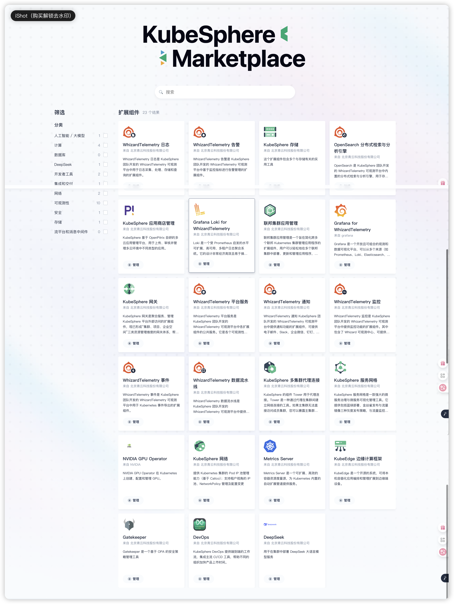
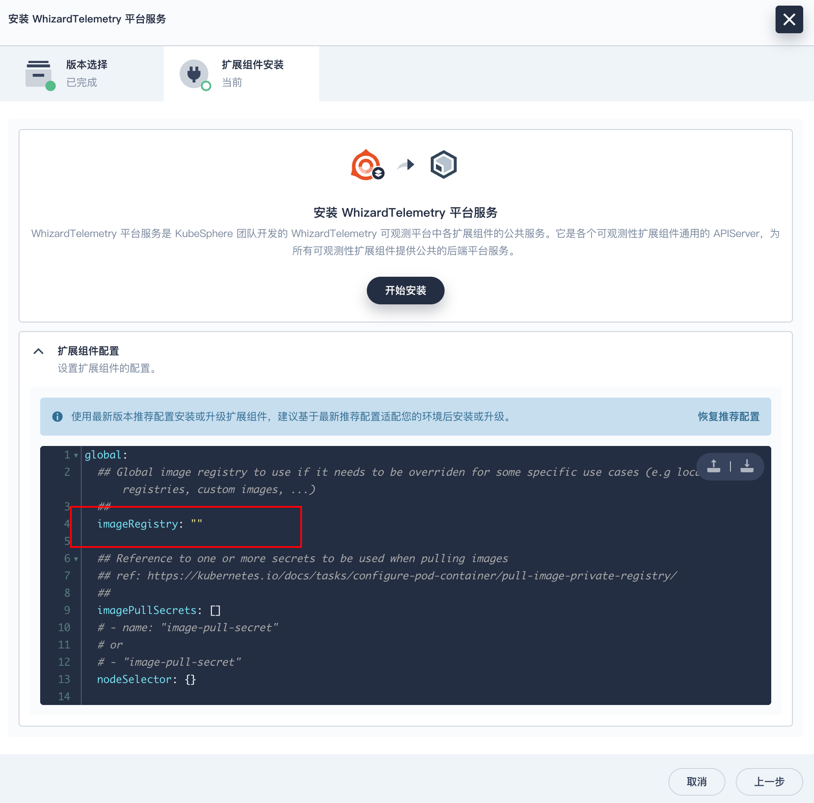
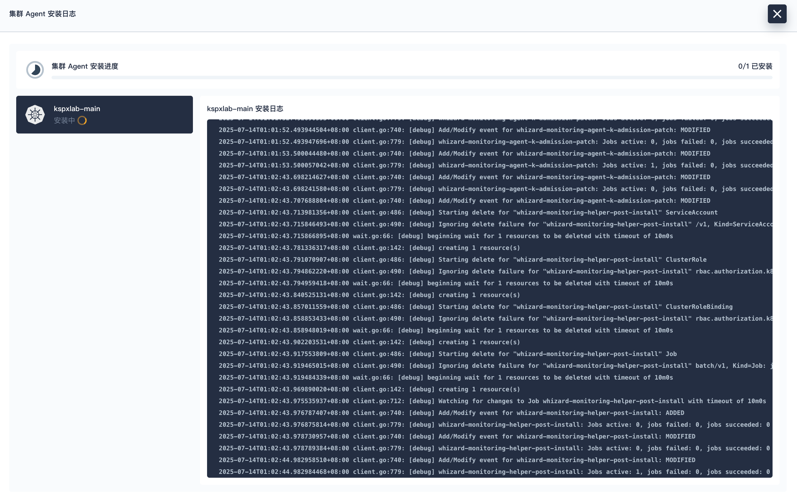
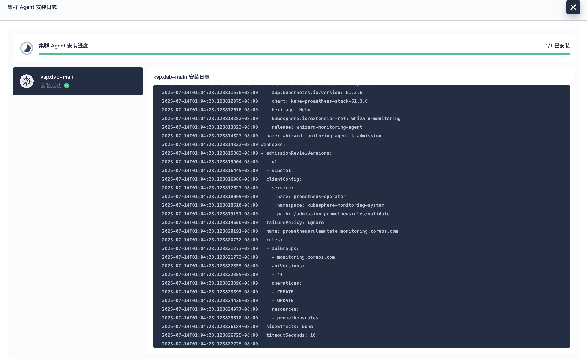
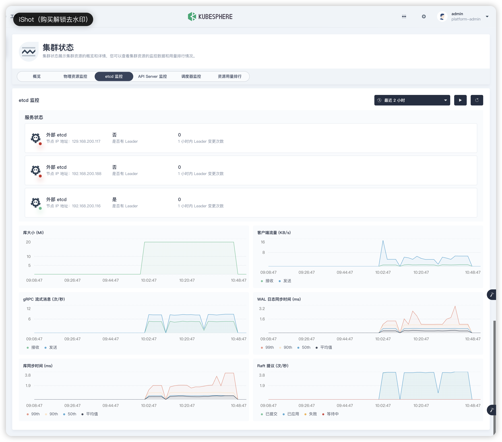
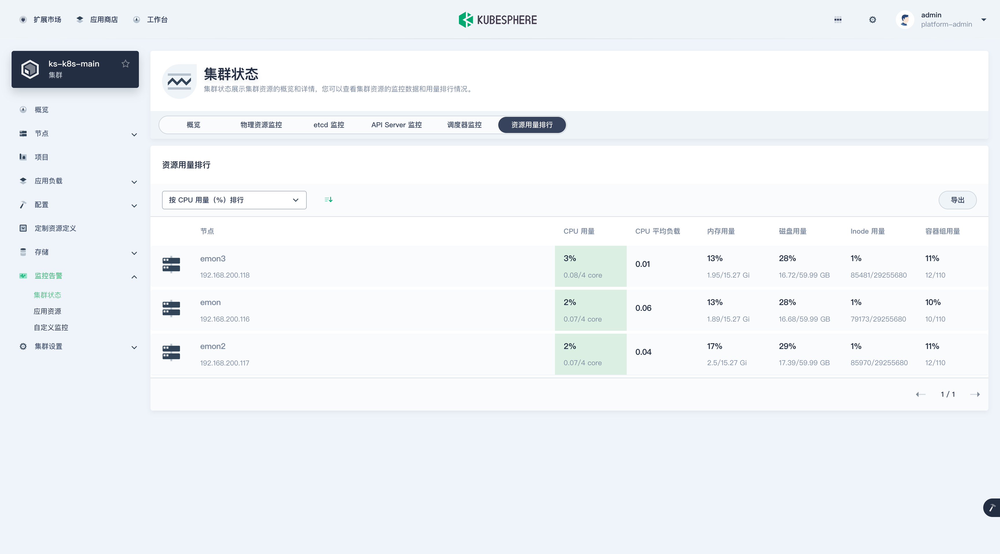

# 第2章 KubeSphere扩展组件安装

本文以最常用的监控扩展组件为例，演示扩展市场的功能特性和扩展组件的安装方法，其它组件的安装配置过程基本类似。

## 0 安装流程介绍

1. 以具有 **platform-admin** 角色的用户登录 KubeSphere Web 控制台。
2. 点击**扩展中心**，搜索您要安装的扩展组件。
3. 点击扩展组件名称，然后点击**安装**，进入组件安装页面。
4. 在组件安装对话框的**版本选择**页签，选择扩展组件的版本号，并安装好所有必装组件（若有），点击**下一步**。

:::info

安装检测时，会识别扩展组件是否有依赖组件。依赖组件分为必装组件和选装组件。若必装组件的状态为**未就绪**，您需要先行安装正确版本的必装组件，以确保扩展组件的正常使用。而选装组件不会影响扩展组件的安装

:::

5. 在**扩展组件安装**页签，修改扩展组件的配置后（可选），点击**开始安装**，开始安装扩展组件。


6. 待安装完成后，点击**下一步**，配置集群 Agent。

7. 在**集群选择**页签，根据名称、标识选择集群（可选择多个集群），以便在目标集群中开启扩展组件。

8. 在**差异化配置**页签，分别编辑选中集群的 YAML 配置，也可不修改，使用初始默认配置。点击**确定**，开始安装集群 Agent，等待完成即可。

安装完成后，默认启用扩展组件。

:::info
部分扩展组件不需要安装集群 Agent（即没有**集群选择**和**差异化配置**页签），请以实际页面为准。

:::

##  1 安装「WhizardTelemetry 平台服务」组件

[KubeSphere V4 扩展组件使用指南](https://ask.kubesphere.com.cn/forum/d/24123-kubesphere-v4-kuo-zhan-zu-jian-shi-yong-zhi-nan)

### 1.0 查看扩展市场

点击左上角的「扩展市场」，进入扩展市场管理页面，您可以安装、管理插件市场已有的插件。4.1.3 默认自带 **23 个** 插件。



### 1.1 安装

在扩展市场首页，先安装「WhizardTelemetry 平台服务」组件。


**版本选择:** 选择扩展组件版本。


**扩展组件安装：** 镜像仓库默认使用国外镜像，为了避免部署失败，在扩展组件配置页，修改 **imageRegistry** 为 KubeSphere 官方提供的华为云镜像仓库地址。



点击开始安装，**安装过程可视化**，安装完成后**显示成功**的图标。


安装完成后，默认启用该组件。您可以在扩展中心对扩展组件进行扩展组件配置、禁用、卸载等操作：


## 2 安装「WhizardTelemetry 监控」组件

### 2.1 安装

KubeSphere v4 将原有的监控功能拆解成了 8个新版的监控组件并新增了 2个额外的组件。


点击扩展市场「WhizardTelemetry 监控」组件的「管理」按钮，打开监控组件的详情页面：


依次点击“管理”、“安装”，选择合适的扩展组件版本：


**扩展组件安装：** 在扩展组件配置页，修改 **imageRegistry** 为 KubeSphere 官方提供的华为云镜像仓库地址。

点击开始安装，**安装过程可视化**，安装完成后**显示成功**的图标。


**集群选择：** 扩展组件安装完成后点击下一步，选择需要开启扩展组件的目标集群，目前只有一个集群，选择后点击「下一步」。


**差异化配置：** 对目标集群中扩展组件进行差异化配置，在差异化配置页，编辑选中集群的 YAML 配置。

编辑差异化配置，需要参阅组件配置说明进行调整。本文暂不修改，使用初始默认配置。


点击「确认」，开始安装**集群 Agent**。


在扩展组件详情页面，点击「组件安装状态」图标，点击「查看日志」，查看安装过程。等待扩展组件集群 Agent 安装完成后**关闭页面**。





安装完成后，默认启用该组件。您可以在扩展中心对扩展组件进行启用、配置变更、禁用、卸载、集群 Agent 配置等操作：


**注意：** 本文只安装了 WhizardTelemetry 的**平台服务和监控**组件，还有通知、日志、事件、告警、数据流水线、OpenSearch 分布式检索与分析引擎等组件，请根据需求自行安装。

### 2.2 监控组件启用 Etcd 监控

<span style="color:#9400D3;font-weight:bold;">首次安装完成后执行</span>

1. 创建 Etcd 客户端证书密钥（**在任一集群控制面板节点**）

   ```sh
   $ kubectl -n kubesphere-monitoring-system create secret generic kube-etcd-client-certs  \
    --from-file=etcd-client-ca.crt=/etc/ssl/etcd/ssl/ca.pem  \
    --from-file=etcd-client.crt=/etc/ssl/etcd/ssl/node-$(hostname).pem  \
    --from-file=etcd-client.key=/etc/ssl/etcd/ssl/node-$(hostname)-key.pem
   ```

2. 修改 **扩展组件配置**，包含以下部分，保存并更新配置后，开始安装

   将 `whizard-monitoring-helper.etcdMonitoringHelper.enabled` 设置为 `true`

   ```yaml
   whizard-monitoring-helper:
     etcdMonitoringHelper:
       enabled: true
   ```

   修改 **集群 Agent 配置**，在 **差异化配置** 增加如下内容，注意 Etcd 端点分别与各自集群对应

   ```yaml
   kube-prometheus-stack:
     prometheus:
       prometheusSpec:
         secrets:
           - kube-etcd-client-certs  ## be added when enable kubeEtcd servicemonitor with tls config
   
     kubeEtcd:
       enabled: true ## set true to enable etcd monitoring
       endpoints: 
        - 192.168.200.116 ## add etcd endpoints
        - 129.168.200.117
        - 192.168.200.188
   ```

### 2.3 插件验证

不同的扩展组件会有不同的集成方式，有的会将扩展组件的功能入口放在顶部导航栏，有的扩展组件会将功能入口放在企业空间或项目的侧边栏，有的扩展组件会将功能入口放在快捷访问入口。

「WhizardTelemetry 监控」组件的集成采用了我们熟悉的方式，扩展组件安装完成之后，进入到集群管理页面，**概览**页面展示了优化后的新版大屏页面。


监控告警也出现在了集群管理页面左侧菜单列表中，接下来我们查看细节：

- 集群状态


- 物理资源监控


- etcd 监控(<span style="color:#9400D3;font-weight:bold;">监控组件启用了Etcd监控才有</span>）



- API Server 监控


- 调度器监控


- 资源用量排行



至此，我们顺利完成了今天的实战部署任务：

- 利用 KubeKey 在三台虚拟机上安装 K8s 1.30.13 高可用集群
- K8s 集群对接 NFS 存储
- 利用 Helm 安装 KubeSphere 4.1.3
- KubeSphere v4 新特性扩展组件介绍及监控组件安装配置实战


## 3 安装「OpenSearch 分布式检索与分析引擎」组件

<span style="color:#9400D3;font-weight:bold;">请注意，该组件会拉取一个接近800M的镜像（docker.io/opensearchproject/opensearch:2.8.0）</span>

### 3.0 OpenSearch 的起源

- OpenSearch 最初是从 **Elasticsearch 7.10.2** 和 **Kibana 7.10.2** 分叉而来（2021年）。
- 之后 OpenSearch 和 Elasticsearch 的版本号完全独立发展，功能差异逐渐扩大。

### 3.1 问题

- **问题1：max virtual memory areas vm.max_map_count**

  - 详情：

  ```bash
  ERROR: [1] bootstrap checks failed
  [1]: max virtual memory areas vm.max_map_count [65530] is too low, increase to at least [262144]
  ERROR: OpenSearch did not exit normally - check the logs at /usr/share/opensearch/logs/opensearch-cluster.log
  ```

  - 解决：永久修改内核参数

  ```bash
  # 修改配置文件
  $ echo "vm.max_map_count=262144" | sudo tee -a /etc/sysctl.conf
  
  # 立即生效（无需重启）
  $ sudo sysctl -p
  
  # 验证
  $ sysctl vm.max_map_count  # 应显示 262144
  ```

- **问题2**

  - 详情

  ```bash
  $ kubectl logs -f helm-install-opensearch-agent-bm924q-blkn6 -n kubesphere-logging-system|tail -n 5
  ready.go:303: [debug] Deployment is not ready: kubesphere-logging-system/opensearch-agent-opensearch-dashboards. 0 out of 1 expected pods are ready
  ready.go:303: [debug] Deployment is not ready: kubesphere-logging-system/opensearch-agent-opensearch-dashboards. 0 out of 1 expected pods are ready
  ready.go:303: [debug] Deployment is not ready: kubesphere-logging-system/opensearch-agent-opensearch-dashboards. 0 out of 1 expected pods are ready
  Error: client rate limiter Wait returned an error: rate: Wait(n=1) would exceed context deadline
  helm.go:84: [debug] client rate limiter Wait returned an error: rate: Wait(n=1) would exceed context deadline
  ```

  - 调整 Kubernetes API 速率限制（**需要集群管理员权限，并不需要重启**）

  ```bash
  # 修改 kube-apiserver 配置（所有控制平面节点）
  $ vim /etc/kubernetes/manifests/kube-apiserver.yaml
  ```

  ```yaml
  spec:
    containers:
    - command:
      - kube-apiserver
      - --max-requests-inflight=2000    # 默认值 400 // [!code ++]
      - --max-mutating-requests-inflight=1000  # 默认值 200 // [!code ++]
  ```

### 3.2 扩展组件配置

<span style="color:#9400D3;font-weight:bold;">首次安装时可配置</span>

- **启用OpenSearch Dashboard**

OpenSearch Dashboard 用于可视化 OpenSearch 数据以及管理 OpenSearch 集群的用户界面。通过设置 `opensearch-dashboards.enabled` 可以启用 OpenSearch Dashboards 插件。默认情况下，此功能处于关闭状态。

```yaml
opensearch-dashboards:
  enabled: false # [!code --] [!code focus:2]
  enabled: true # [!code ++]
  image:
    tag: "2.8.0"
  service: # [!code ++]  [!code focus:3] 开放外部访问端口
    type: NodePort # [!code ++]
    nodePort: 31323 # [!code ++]
```

- **启用OpenSearch Curator**

OpenSearch Curator 是一个定时任务，定期清理超过配置日期（默认为 7 天）的 Kubernetes 事件日志、Kubernetes 审计日志、Kubernetes 应用程序日志以及通知历史日志。通过设置 `opensearch-curator.enabled` 可以决定是否启用 OpenSearch Curator 插件。默认情况下，该插件已启用。

```yaml
opensearch-curator:
  enabled: true
```

### 3.3 访问

- 访问OpenSearch

安装完成后，可以访问： 
http://192.168.200.116:30920
admin/admin

- 访问OpenSearch Dashboard

安装完成后，可以访问： 
http://192.168.200.116:31323 
admin/admin


## 4 安装「WhizardTelemetry 数据流水线」组件

## 5 安装「Metrics Server」组件

## 6 安装「KubeSphere服务网格」组件

### 6.1 扩展组件配置

<span style="color:#9400D3;font-weight:bold;">首次安装时可配置</span>

- 调整Istio版本

```yaml
backend:
  ## istio
  istio:
    revision: "1-17-8" # [!code ++][!code focus:1]
```

## 7 安装「KubeSphere网关」组件

## 8 安装「KubeSphere网络」组件

## 9 安装「DevOps组件」组件

<span style="color:#9400D3;font-weight:bold;">首次安装时可配置</span>

### 8.1 扩展组件配置

<span style="color:#9400D3;font-weight:bold;font-size:18px">在DevOps安装时，请检查扩展组件配置里 `jenkins.securityRealm.openIdConnect.kubesphereCoreApi` 和 `jenkins.securityRealm.openIdConnect.jenkinsURL` ，确保已经分别修改为 ks-console 和 devops-jenkins 服务实际可访问的地址。否则可能导致Jenkins在浏览器端无法被访问。</span>

```yaml
  jenkins:
    securityRealm:
      openIdConnect:
        # The kubesphere-core api used for jenkins OIDC
        # If you want to access to jenkinsWebUI, the kubesphereCoreApi must be specified and browser-accessible
        # Modifying this configuration will take effect only during installation
        # If you wish for changes to take effect after installation, you need to update the jenkins-casc-config ConfigMap, copy the securityRealm configuration from jenkins.yaml to jenkins_user.yaml, save, and wait for approximately 70 seconds for the changes to take effect.
        kubesphereCoreApi: "http://ks-apiserver:30880" # [!code --] [!code focus:2]
        kubesphereCoreApi: "http://192.168.200.116:30880" # [!code ++]
        # The jenkins web URL used for OIDC redirect
        jenkinsURL: "http://devops-jenkins:30180" # [!code --] [!code focus:2]
        jenkinsURL: "http://192.168.200.116:30180" # [!code ++]
```

### 8.2 问题

- **问题1：arm镜像版本不存在配置调整**

 quay.io 镜像仓库里没有这个镜像 arm 版本的；可以手动编辑 Deployment devops-agent-argocd-applicationset-controller，更新image 如下：

```bash
quay.io/argoproj/argocd-applicationset:v0.4.1
```

替换为：

```bash
kubespheredev/argocd-applicationset-arm64:v0.4.1
```

- **问题2：Jenkins登录后被认证拦截**

若在安装DevOps时没留意扩展组件中的配置，导致了Jenkins无法被访问（表现为通过NodePort访问Jenkins时，触发认证问题，被拦截到ks-apiserver），可以如下解决！！！

1. 请检查扩展组件配置里 `jenkins.securityRealm.openIdConnect.kubesphereCoreApi` 和 `jenkins.securityRealm.openIdConnect.jenkinsURL` ，确保已经分别修改为 ks-console 和 devops-jenkins 服务实际可访问的地址，如果不是，请修改并等待组件更新完成。

   ```yaml
   jenkins:
     securityRealm:
       openIdConnect:
         # The kubesphere-core api used for jenkins OIDC
         # If you want to access to jenkinsWebUI, the kubesphereCoreApi must be specified and browser-accessible
         # Modifying this configuration will take effect only during installation
         # If you wish for changes to take effect after installation, you need to update the jenkins-casc-config ConfigMap, copy the securityRealm configuration from jenkins.yaml to jenkins_user.yaml, save, and wait for approximately 70 seconds for the changes to take effect.
         kubesphereCoreApi: "http://192.168.200.116:30880"
         # The jenkins web URL used for OIDC redirect
         jenkinsURL: "http://192.168.200.116:30180"
   ```

2. 请检查配置字典 `jenkins-casc-config` 中 `jenkins_user.yaml` 下 `securityRealm.oic` 的所有地址，确保已经改为与 `jenkins.yaml` 下 `securityRealm.oic` 里一样的，都改成 kubesphere-console 实际可访问的地址，如果不一样，请修改并等待 70s 左右使其生效。

   ```yaml
       securityRealm:
         oic:
           clientId: "jenkins"
           clientSecret: "jenkins"
           tokenServerUrl: "http://192.168.200.116:30880/oauth/token"
           authorizationServerUrl: "http://192.168.200.116:30880/oauth/authorize"
           userInfoServerUrl: "http://192.168.200.116:30880/oauth/userinfo"
           endSessionEndpoint: "http://192.168.200.116:30880/oauth/logout"
           logoutFromOpenidProvider: true
           scopes: openid profile email
           fullNameFieldName: url
           userNameField: preferred_username
   ```

3. 请检查配置字典 `kubesphere-config` 中的 `authentication.issuer.url` ，确保已经修改为 kubesphere-console 实际可访问的地址，如果不是，请修改并重启 Deployment ks-apiserver 使其生效。（<span style="color:red;font-weight:bold;">经过实际验证，若安装时配置了正确ip，这里实际上也不是实际ip，而是pod中访问svc的形式，但不影响使用Jenkins。</span>）

   ```yaml
   authentication:
     issuer:
       url: "http://192.168.200.116:30880"
   ```

   ```shell
   $ kubectl -n kubesphere-system rollout restart deploy ks-apiserver
   ```

## 10 安装「Grafana for WhizardTelemetry」组件

### 10.1 扩展组件配置

- Grafana外部访问配置

```yml
  service:
    enabled: true
    type: ClusterIP # [!code --][!code focus:2]
    type: NodePort # [!code ++]
    loadBalancerIP: ""
    loadBalancerClass: ""
    loadBalancerSourceRanges: []
    port: 80
    targetPort: 3000
    # nodePort: 32000
    nodePort: 32000 # [!code ++][!code focus:1]
```

| 参数               | 描述                                                         |
| ------------------ | ------------------------------------------------------------ |
| type: ClusterIP    | 只能在集群内部通过虚拟 IP 地址访问 Grafana 服务。            |
| type: NodePort     | 使用 NodePort 方式暴露服务，可通过 `nodePort` 参数指定端口。Grafana 服务的默认端口为 32000。配置后，可通过 : 访问 Grafana 控制台。 |
| type: LoadBalancer | 使用云服务商提供的负载均衡器向外部暴露 Grafana 服务。有关更多信息，请联系您的基础设施环境提供商。 |

按照以上配置暴露 Grafana 服务后，访问 Grafana 控制台，使用默认帐户和密码 (**admin/admin**) 登录。

http://192.168.200.116:32000

| 用户名 | 原密码 | 新密码   |
| ------ | ------ | -------- |
| admin  | admin  | P@88word |

点击左侧导航栏的 **Dashboards**，查看 Grafana for WhizardTelemetry 预置的 Dashboard 模板。

## 11 安装「Grafana Loki for WhizardTelemetry」组件

若 Grafana 控制台为 Grafana for WhizardTelemetry 扩展组件所部署，Grafana Loki for WhizardTelemetry 安装完成后，会自动在 Grafana 控制台为日志、审计、事件及通知历史添加 Loki 数据源。无需手动添加数据源。

### 11.1 问题

- **问题1：client rate limiter Wait returned an error**

  - 详情

  ```bash
  $ kubectl logs helm-install-loki-agent-jsbqvg-kkd8w -n loki
  ......
  Error: client rate limiter Wait returned an error: rate: Wait(n=1) would exceed context deadline
  helm.go:84: [debug] client rate limiter Wait returned an error: rate: Wait(n=1) would exceed context deadline
  ```

  - 调整 Kubernetes API 速率限制（需要集群管理员权限）

  ```bash
  # 修改 kube-apiserver 配置（所有控制平面节点）
  $ vim /etc/kubernetes/manifests/kube-apiserver.yaml
  ```

  ```yml
  spec:
    containers:
    - command:
      - kube-apiserver
      - --max-requests-inflight=2000    # 默认值 400 // [!code ++]
      - --max-mutating-requests-inflight=1000  # 默认值 200 // [!code ++]
  ```

- **问题2：集群DNS服务名称问题**

  - 详情：

  ```bash
  $ kubectl logs loki-agent-gateway-68fc65fbc9-jh72v -n loki
  /docker-entrypoint.sh: No files found in /docker-entrypoint.d/, skipping configuration
  2025/07/10 05:09:59 [emerg] 1#1: host not found in resolver "coredns.kube-system.svc.cluster.local." in /etc/nginx/nginx.conf:38
  nginx: [emerg] host not found in resolver "coredns.kube-system.svc.cluster.local." in /etc/nginx/nginx.conf:38
  ```

  - 解决：执行以下命令，确认集群 DNS 服务的真实名称：

  ```bash
    $ kubectl get svc -n kube-system -l k8s-app=kube-dns
    NAME       TYPE        CLUSTER-IP   EXTERNAL-IP   PORT(S)                  AGE
    kube-dns   ClusterIP   10.96.0.10   <none>        53/UDP,53/TCP,9153/TCP   23d
  ```

  如果输出显示 Service 名称为 `kube-dns`（常见情况），则需修改 Nginx 配置。

  如果名称为 `coredns`，检查其是否正常运行。

  - 调整“扩展组件配置”

  ```yml
  loki:
    global:
      dnsService: coredns # [!code --][!code focus:2]
      dnsService: kube-dns # [!code ++]
  ```

## 12 安装「KubeSphere 应用商店管理」组件

## 50 汇总安装组件

**安装情况（15/23）**

- WhizardTelemetry系列组件
  - WhizardTelemetry 平台服务
  - WhizardTelemetry 监控
  - OpenSearch 分布式检索与分析引擎
  - WhizardTelemetry 数据流水线
- Metrics Server
- KubeSphere服务网格（蓝绿发布、链路追踪、自制应用、istio）
- KubeSphere网关（NodePort、LoadBalancer 与 ClusterIP。项目、企业空间、集群网关）
- KubeSphere网络（类比calico，IP池、网络隔离）
- DevOps组件
- Grafana for WhizardTelemetry
- Grafana Loki for WhizardTelemetry
- KubeSphere应用商店管理（应用上架审核，chart 包上传）

- ~~KubeSphere存储（存储类授权规则，PVC 自动扩容，快照）~~

## 51 登录 Jenkins 仪表板

安装 DevOps 时，默认情况下也会安装 Jenkins 仪表板。

### 51.1 前提条件

KubeSphere 平台需要安装并启用 **DevOps** 扩展组件。

### 51.2 操作步骤

1. 查看 jenkins 仪表盘对应的服务，然后参阅[如何访问服务](https://www.kubesphere.io/zh/docs/v4.1/02-quickstart/08-access-a-service/)，访问 Jenkins 仪表板。

```bash
$ kubectl -n kubesphere-devops-system get svc devops-jenkins
```

```bash
NAME             TYPE       CLUSTER-IP     EXTERNAL-IP   PORT(S)        AGE
devops-jenkins   NodePort   10.233.34.54   <none>        80:30180/TCP   5d16h
```

2. 获取 jenkins 管理员的用户名和密码。

```bash
$ kubectl -n kubesphere-devops-system get secret devops-jenkins -o yaml
```

输出示例：

```yml
......
data:
  jenkins-admin-password: YVBSZzNGbXBkZ2J3SnVvaklpdjlQRA==
  jenkins-admin-token: MTExNDAyODM1MTM5NDU0Mzc1ODkxMzYxMjc5NTUwMjI5OQ==
  jenkins-admin-user: YWRtaW4=
......
```

将 `jenkins-admin-user` 和 `jenkins-admin-password` 对应的内容 base64 解码后，即得到 jenkins 管理员的用户名和密码。

比如，这里是： admin / aPRg3FmpdgbwJuojIiv9PD

3. 使用获取的用户名和密码，登录 Jenkins 仪表板。

- 执行以下命令获取 Jenkins 的地址。

```bash
export NODE_PORT=$(kubectl get svc --namespace kubesphere-devops-system -o jsonpath="{.spec.ports[0].nodePort}" devops-jenkins)
export NODE_IP=$(kubectl get no --namespace kubesphere-devops-system -o jsonpath="{.items[0].status.addresses[0].address}")
echo http://$NODE_IP:$NODE_PORT
```

输出：

http://192.168.200.116:30180

<span style="color:red;font-weight:bold;">访问时，未登录KubeSphere会被拦截并调整到KubeSphere的登录界面，登录后自动进入Jenkins页面</span>

## 99 扩展组件登录信息

| 登录地址                     | 描述                 | 用户名                 | 密码     | 原密码   |
| ---------------------------- | -------------------- | ---------------------- | -------- | -------- |
| http://192.168.200.116:30880 | KubeSphere           | admin                  | P@88word | P@88w0rd |
| http://192.168.200.116:30920 | OpenSearch           | admin                  | admin    | admin    |
| http://192.168.200.116:31323 | OpenSearch Dashboard | admin                  | admin    | admin    |
| http://192.168.200.116:32000 | Grafana              | admin                  | P@88word | admin    |
| http://192.168.200.116:30180 | Jenkins              | 伴随ks-console单点登录 |          |          |

