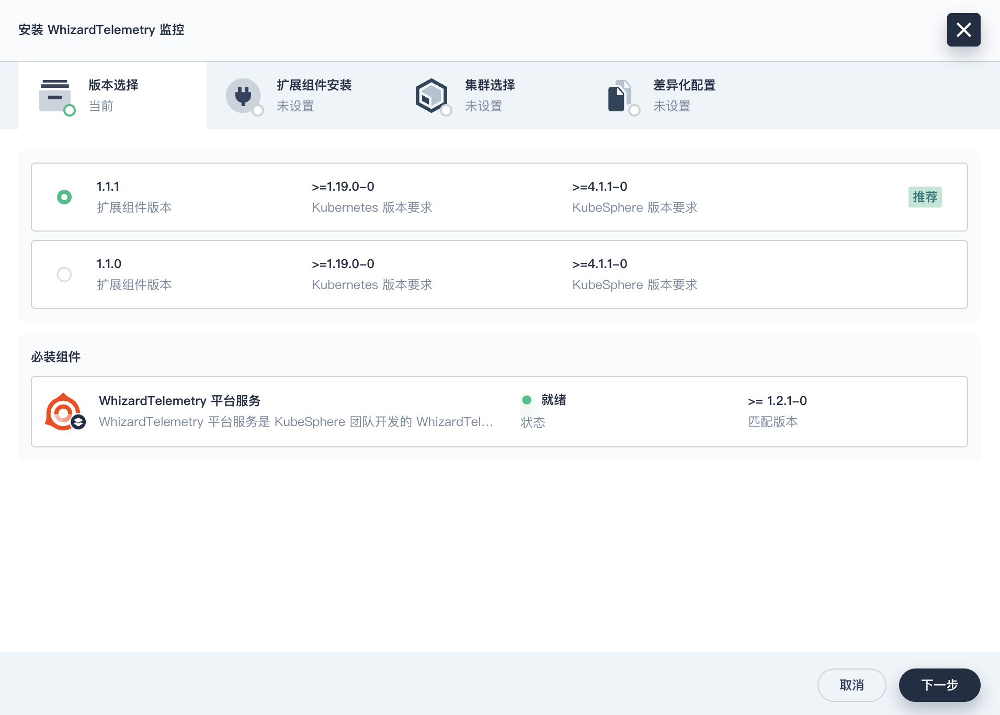

# 第2章 KubeSphere扩展组件安装与使用

本文以最常用的监控扩展组件为例，演示扩展市场的功能特性和扩展组件的安装方法，其它组件的安装配置过程基本类似。

##  1 安装并使用扩展组件（快速版）

### 1.0 安装流程介绍

1. 以具有 **platform-admin** 角色的用户登录 KubeSphere Web 控制台。
2. 点击**扩展中心**，搜索您要安装的扩展组件。
3. 点击扩展组件名称，然后点击**安装**，进入组件安装页面。
4. 在组件安装对话框的**版本选择**页签，选择扩展组件的版本号，并安装好所有必装组件（若有），点击**下一步**。

:::info

安装检测时，会识别扩展组件是否有依赖组件。依赖组件分为必装组件和选装组件。若必装组件的状态为**未就绪**，您需要先行安装正确版本的必装组件，以确保扩展组件的正常使用。而选装组件不会影响扩展组件的安装

:::

5. 在**扩展组件安装**页签，修改扩展组件的配置后（可选），点击**开始安装**，开始安装扩展组件。


6. 待安装完成后，点击**下一步**，配置集群 Agent。

7. 在**集群选择**页签，根据名称、标识选择集群（可选择多个集群），以便在目标集群中开启扩展组件。

8. 在**差异化配置**页签，分别编辑选中集群的 YAML 配置，也可不修改，使用初始默认配置。点击**确定**，开始安装集群 Agent，等待完成即可。

安装完成后，默认启用扩展组件。

:::info
部分扩展组件不需要安装集群 Agent（即没有**集群选择**和**差异化配置**页签），请以实际页面为准。

:::

### 1.1 查看扩展市场

点击左上角的「扩展市场」，进入扩展市场管理页面，您可以安装、管理插件市场已有的插件。4.1.3 默认自带 **23 个** 插件。


### 1.2 安装监控组件

接下来以监控（WhizardTelemetry）组件为例实战演示如何安装、配置扩展组件。

KubeSphere v4 将原有的监控功能拆解成了 8个新版的监控组件并新增了 2个额外的组件。


点击扩展市场「WhizardTelemetry 监控」组件的「管理」按钮，打开监控组件的详情页面：


依次点击“管理”、“安装”，选择合适的扩展组件版本：


依赖组件检测功能页面提示需要安装**必装组件**「WhizardTelemetry 平台服务」。


我们先返回扩展市场首页，先安装「WhizardTelemetry 平台服务」组件。


**版本选择:** 选择扩展组件版本。


**扩展组件安装：** 镜像仓库默认使用国外镜像，为了避免部署失败，在扩展组件配置页，修改 **imageRegistry** 为 KubeSphere 官方提供的华为云镜像仓库地址。


点击开始安装，**安装过程可视化**，安装完成后**显示成功**的图标。


安装完成后，默认启用该组件。您可以在扩展中心对扩展组件进行扩展组件配置、禁用、卸载等操作：


接下来，我们返回扩展市场首页，再次安装「WhizardTelemetry 监控」组件。

**集群选择：** 安装完成后点击下一步，选择需要开启扩展组件的目标集群，目前只有一个集群，选择后点击「下一步」。



**扩展组件安装：** 在扩展组件配置页，修改 **imageRegistry** 为 KubeSphere 官方提供的华为云镜像仓库地址。

点击开始安装，**安装过程可视化**，安装完成后**显示成功**的图标。

**集群选择：** 安装完成后点击下一步，选择需要开启扩展组件的目标集群，目前只有一个集群，选择后点击「下一步」。

**差异化配置：** 对目标集群中扩展组件进行差异化配置，在差异化配置页，编辑选中集群的 YAML 配置。

编辑差异化配置，需要参阅组件配置说明进行调整。本文暂不修改，使用初始默认配置。


点击「确认」，开始安装配置**集群 Agent。


在扩展组件详情页面，点击「组件安装状态」图标，点击「查看日志」，查看安装过程。等待扩展组件集群 Agent 安装完成后**关闭页面**。


安装完成后，默认启用该组件。您可以在扩展中心对扩展组件进行启用、配置变更、禁用、卸载、集群 Agent 配置等操作：


**注意：** 本文只安装了 WhizardTelemetry 的**平台服务和监控**组件，还有通知、日志、事件、告警、数据流水线、OpenSearch 分布式检索与分析引擎等组件，请根据需求自行安装。

### 1.3 插件验证

不同的扩展组件会有不同的集成方式，有的会将扩展组件的功能入口放在顶部导航栏，有的扩展组件会将功能入口放在企业空间或项目的侧边栏，有的扩展组件会将功能入口放在快捷访问入口。

「WhizardTelemetry 监控」组件的集成采用了我们熟悉的方式，扩展组件安装完成之后，进入到集群管理页面，**概览**页面展示了优化后的新版大屏页面。


监控告警也出现在了集群管理页面左侧菜单列表中，接下来我们查看细节（**与之前版本展示效果基本一致**）：

- 集群状态


- 物理资源监控


- API Server 监控


- 调度器监控


- 资源用量排行


至此，我们顺利完成了今天的实战部署任务：

- 利用 KubeKey 在三台虚拟机上安装 K8s 1.30.6 高可用集群
- K8s 集群对接 NFS 存储
- 利用 Helm 安装 KubeSphere 4.1.2
- KubeSphere v4 新特性扩展组件介绍及监控组件安装配置实战

### 1.4 安装哪些组件？

**安装情况（15/23）**

- WhizardTelemetry系列组件
- OpenSearch分布式检索与分析引擎组件
- Metrics Server组件
- KubeSphere服务网格（蓝绿发布、链路追踪）
- KubeSphere网络（类比calico）
- KubeSphere网关（NodePort、LoadBalancer 与 ClusterIP。）
- DevOps组件
- KubeSphere应用管理组件
- KubeSphere存储组件

### 1.9 安装问题与解决方案锦集

#### 1.9.1 安装opensearch引发的日志问题

- 问题

```
ERROR: [1] bootstrap checks failed
[1]: max virtual memory areas vm.max_map_count [65530] is too low, increase to at least [262144]
ERROR: OpenSearch did not exit normally - check the logs at /usr/share/opensearch/logs/opensearch-cluster.log
```

- 永久修改内核参数

```bash
# 修改配置文件
$ echo "vm.max_map_count=262144" | sudo tee -a /etc/sysctl.conf

# 立即生效（无需重启）
$ sudo sysctl -p

# 验证
$ sysctl vm.max_map_count  # 应显示 262144
```

- **重启 OpenSearch Pod**

```bash
$ kubectl delete pod <opensearch-pod-name>
```

#### 1.9.2 安装Grafana Loki for WhizardTelemetry的错误

- 问题

```bash
$ kubectl logs helm-install-loki-agent-jsbqvg-kkd8w -n loki
......
Error: client rate limiter Wait returned an error: rate: Wait(n=1) would exceed context deadline
helm.go:84: [debug] client rate limiter Wait returned an error: rate: Wait(n=1) would exceed context deadline
```

- 调整 Kubernetes API 速率限制（需要集群管理员权限）

```bash
# 修改 kube-apiserver 配置（所有控制平面节点）
$ vim /etc/kubernetes/manifests/kube-apiserver.yaml
```

```js
spec:
  containers:
  - command:
    - kube-apiserver
    - --max-requests-inflight=2000    # 默认值 400 // [!code ++]
    - --max-mutating-requests-inflight=1000  # 默认值 200 // [!code ++]
```

#### 1.9.3 loki安装失败

- 问题

```bash
$ kubectl logs loki-agent-gateway-68fc65fbc9-jh72v -n loki
/docker-entrypoint.sh: No files found in /docker-entrypoint.d/, skipping configuration
2025/07/10 05:09:59 [emerg] 1#1: host not found in resolver "coredns.kube-system.svc.cluster.local." in /etc/nginx/nginx.conf:38
nginx: [emerg] host not found in resolver "coredns.kube-system.svc.cluster.local." in /etc/nginx/nginx.conf:38
```

- 执行以下命令，确认集群 DNS 服务的真实名称：

  ```basH
    $ kubectl get svc -n kube-system -l k8s-app=kube-dns
    NAME       TYPE        CLUSTER-IP   EXTERNAL-IP   PORT(S)                  AGE
    kube-dns   ClusterIP   10.96.0.10   <none>        53/UDP,53/TCP,9153/TCP   23d
  ```

  - 如果输出显示 Service 名称为 `kube-dns`（常见情况），则需修改 Nginx 配置。

  - 如果名称为 `coredns`，检查其是否正常运行。

- 调整“扩展组件配置”

```js
loki:
  global:
    dnsService: coredns // [!code --][!code focus:2]
    dnsService: kube-dns // [!code ++]
```

#### 1.9.4 devops安装失败

 quay.io 镜像仓库里没有这个镜像 arm 版本的；可以手动编辑下 Deployment devops-agent-argocd-applicationset-controller，更新下 image 为 kubespheredev/argocd-applicationset-arm64:v0.4.1

<span style="color:#9400D3;font-weight:bold;font-size:18px">在DevOps安装时，请检查扩展组件配置里 `jenkins.securityRealm.openIdConnect.kubesphereCoreApi` 和 `jenkins.securityRealm.openIdConnect.jenkinsURL` ，确保已经分别修改为 ks-console 和 devops-jenkins 服务实际可访问的地址。否则可能导致Jenkins在浏览器端无法被访问。</span>

#### 1.9.5 解决Jenkins登录后被认证拦截的问题

​	若在安装DevOps时没留意扩展组件中的配置，导致了Jenkins无法被访问（表现为通过NodePort访问Jenkins时，触发认证问题，被拦截到ks-apiserver），可以如下解决！！！

1. 请检查扩展组件配置里 `jenkins.securityRealm.openIdConnect.kubesphereCoreApi` 和 `jenkins.securityRealm.openIdConnect.jenkinsURL` ，确保已经分别修改为 ks-console 和 devops-jenkins 服务实际可访问的地址，如果不是，请修改并等待组件更新完成。

   ```yaml
   jenkins:
     securityRealm:
       openIdConnect:
         # The kubesphere-core api used for jenkins OIDC
         # If you want to access to jenkinsWebUI, the kubesphereCoreApi must be specified and browser-accessible
         # Modifying this configuration will take effect only during installation
         # If you wish for changes to take effect after installation, you need to update the jenkins-casc-config ConfigMap, copy the securityRealm configuration from jenkins.yaml to jenkins_user.yaml, save, and wait for approximately 70 seconds for the changes to take effect.
         kubesphereCoreApi: "http://192.168.200.116:30880"
         # The jenkins web URL used for OIDC redirect
         jenkinsURL: "http://192.168.200.116:30180"
   ```

2. 请检查配置字典 `jenkins-casc-config` 中 `jenkins_user.yaml` 下 `securityRealm.oic` 的所有地址，确保已经改为与 `jenkins.yaml` 下 `securityRealm.oic` 里一样的，都改成 kubesphere-console 实际可访问的地址，如果不一样，请修改并等待 70s 左右使其生效。

   ```yaml
       securityRealm:
         oic:
           clientId: "jenkins"
           clientSecret: "jenkins"
           tokenServerUrl: "http://192.168.200.116:30880/oauth/token"
           authorizationServerUrl: "http://192.168.200.116:30880/oauth/authorize"
           userInfoServerUrl: "http://192.168.200.116:30880/oauth/userinfo"
           endSessionEndpoint: "http://192.168.200.116:30880/oauth/logout"
           logoutFromOpenidProvider: true
           scopes: openid profile email
           fullNameFieldName: url
           userNameField: preferred_username
   ```

3. 请检查配置字典 `kubesphere-config` 中的 `authentication.issuer.url` ，确保已经修改为 kubesphere-console 实际可访问的地址，如果不是，请修改并重启 Deployment ks-apiserver 使其生效。

   ```yaml
   authentication:
     issuer:
       url: "http://192.168.200.116:30880"
   ```

   ```shell
   $ kubectl -n kubesphere-system rollout restart deploy ks-apiserver
   ```

## 2 登录 Jenkins 仪表板

安装 DevOps 时，默认情况下也会安装 Jenkins 仪表板。

### 2.1 前提条件

KubeSphere 平台需要安装并启用 **DevOps** 扩展组件。

### 2.2 操作步骤

1. 查看 jenkins 仪表盘对应的服务，然后参阅[如何访问服务](https://www.kubesphere.io/zh/docs/v4.1/02-quickstart/08-access-a-service/)，访问 Jenkins 仪表板。

```bash
$ kubectl -n kubesphere-devops-system get svc devops-jenkins
```

```bash
NAME             TYPE       CLUSTER-IP     EXTERNAL-IP   PORT(S)        AGE
devops-jenkins   NodePort   10.233.34.54   <none>        80:30180/TCP   5d16h
```

2. 获取 jenkins 管理员的用户名和密码。

```bash
$ kubectl -n kubesphere-devops-system get secret devops-jenkins -o yaml
```

输出示例：

```yml
......
data:
  jenkins-admin-password: YVBSZzNGbXBkZ2J3SnVvaklpdjlQRA==
  jenkins-admin-token: MTExNDAyODM1MTM5NDU0Mzc1ODkxMzYxMjc5NTUwMjI5OQ==
  jenkins-admin-user: YWRtaW4=
......
```

将 `jenkins-admin-user` 和 `jenkins-admin-password` 对应的内容 base64 解码后，即得到 jenkins 管理员的用户名和密码。

比如，这里是： admin / aPRg3FmpdgbwJuojIiv9PD

3. 使用获取的用户名和密码，登录 Jenkins 仪表板。

- 执行以下命令获取 Jenkins 的地址。

```bash
export NODE_PORT=$(kubectl get svc --namespace kubesphere-devops-system -o jsonpath="{.spec.ports[0].nodePort}" devops-jenkins)
export NODE_IP=$(kubectl get no --namespace kubesphere-devops-system -o jsonpath="{.items[0].status.addresses[0].address}")
echo http://$NODE_IP:$NODE_PORT
```

输出：

http://192.168.200.116:30180

<span style="color:red;font-weight:bold;">访问时，未登录KubeSphere会被拦截并调整到KubeSphere的登录界面，登录后自动进入Jenkins页面</span>


## 9 DevOps

