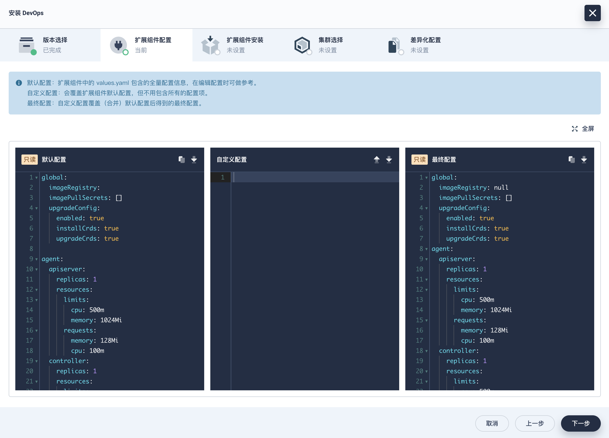
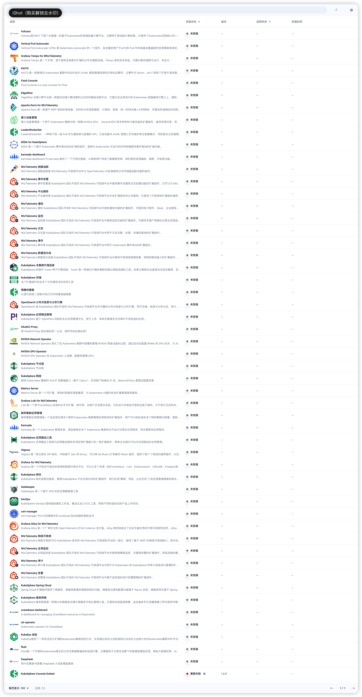

# 第2章 KubeSphere扩展组件管理

## 2.1 安装扩展组件

**前提条件**

您需要在 KubeSphere 平台具有 **platform-admin** 角色。

**安装步骤**

1. 以具有 **platform-admin** 角色的用户登录 KubeSphere Web 控制台。
2. 点击**扩展中心**，搜索您要安装的扩展组件。
3. 点击扩展组件名称，然后点击**安装**，进入组件安装页面。
4. 在组件安装对话框的**版本选择**页签，选择扩展组件的版本号，并安装好所有必装组件（若有），点击**下一步**。

:::tip

安装检测时，会识别扩展组件是否有依赖组件。依赖组件分为必装组件和选装组件。

若必装组件的状态为**未就绪**，您需要先行安装正确版本的必装组件，以确保扩展组件的正常使用。而选装组件不会影响扩展组件的安装。

:::

5. 在**扩展组件配置**页签，在中间的**自定义配置**框中输入您需要的配置。查看**最终配置**确认后，点击**下一步**。



- 点击右上角的可全屏查看配置信息。

- 点击上传自定义的配置文件。
- 点击复制配置信息。
- 点击下载配置文件。

6. 在**扩展组件安装**页签，点击**开始安装**，开始安装扩展组件。

7. 待安装完成后，点击**下一步**。

8. 在**集群选择**页签，根据名称、标识选择集群（可选择多个集群），以便在目标集群中开启扩展组件。

9. 在**差异化配置**页签，点击编辑集群的 Agent 配置，也可不修改，使用初始默认配置。点击**确定**，开始安装集群 Agent，等待完成即可。

安装完成后，默认启用扩展组件。

::: tip

部分扩展组件不需要安装集群 Agent（即没有**集群选择**和**差异化配置**页签），请以实际页面为准。

:::

:::details 安装失败解决办法

```bash
# 发现问题：若安装卡主，查看安装详情
$ kubectl get po -n kubesphere-devops-system
$ kubectl describe po -n kubesphere-devops-system ${pod} | grep Events -A10
Events:
  Type     Reason                  Age                From               Message
  ----     ------                  ----               ----               -------
  Normal   Scheduled               25s                default-scheduler  Successfully assigned kubesphere-devops-system/helm-install-devops-cczl9w-l22k5 to k8s-node2
  Warning  FailedCreatePodSandBox  25s                kubelet            Failed to create pod sandbox: rpc error: code = Unknown desc = failed to setup network for sandbox "b47b864d74dd3712f4c65c351c1f7742c4fc56e8ba6364041a3e2cfd706ff42d": plugin type="calico" failed (add): error getting ClusterInformation: connection is unauthorized: Unauthorized
  Normal   SandboxChanged          11s (x2 over 25s)  kubelet            Pod sandbox changed, it will be killed and re-created.
  
# 解决，此时虽然看起来 calico-node-xxx 是 Running 状态，需要删除重建
$ kubectl get pod -n kube-system -l k8s-app=calico-node
$ kubectl delete pod -n kube-system -l k8s-app=calico-node
```

:::

## 2.2 管理扩展组件

### 2.2.1 配置扩展组件

除了在安装组件时配置组件，您还可以在扩展中心的组件详情页，修改扩展组件的配置。

:::warning

在安装、升级、卸载过程中不允许变更配置。

:::

**前提条件**

- 您需要在 KubeSphere 平台具有 **platform-admin** 角色。
- 您已成功安装一个扩展组件。

**操作步骤**

1. 以具有 **platform-admin** 角色的用户登录 KubeSphere Web 控制台。
2. 点击**扩展中心**。
3. 点击已安装的组件名称，进入组件详情页。
4. 点击组件图标下的，选择**扩展组件配置**。
5. 在中间的**自定义配置**框中输入您需要的配置。查看**最终配置**确认后，点击**确定**。
   - 点击上传自定义的配置文件。
   - 点击复制配置信息。
   - 点击下载配置文件。

### 2.2.2 配置集群Agent

除了在安装组件时配置集群 Agent，您还可以在扩展中心的组件详情页，修改集群 Agent 的配置。

**前提条件**

- 您需要在 KubeSphere 平台具有 **platform-admin** 角色。
- 您已成功安装一个扩展组件。

**操作步骤**

1. 以具有 **platform-admin** 角色的用户登录 KubeSphere Web 控制台。
2. 点击**扩展中心**。
3. 点击已安装的组件名称，进入组件详情页。
4. 点击组件图标下的，选择**集群 Agent 配置**。
5. 选择一个集群，点击**下一步**。
6. 在**差异化配置**页签，点击编辑集群的 Agent 配置。
7. 在中间的**自定义配置**框中输入您需要的配置。查看**最终配置**确认后，点击**确定**。
   - 点击右上角的可全屏查看配置信息。
   - 点击上传自定义的配置文件。
   - 点击复制配置信息。
   - 点击下载配置文件。

### 2.2.3 禁用扩展组件

组件安装完成后，会自动启用。您可以在扩展中心的组件详情页中禁用扩展组件。

禁用后，再次启用，即可在集群、企业空间、项目中继续使用该组件。

**前提条件**

您需要在 KubeSphere 平台具有 **platform-admin** 角色。

**操作步骤**

1. 以具有 **platform-admin** 角色的用户登录 KubeSphere Web 控制台。
2. 点击**扩展中心**，进入扩展中心页面。
3. 点击已安装的组件名称，进入组件详情页。
4. 点击组件图标下的，选择**禁用**。
5. 禁用后，再次点击，选择**启用**即可继续使用该组件。

## 2.3 升级扩展组件

当组件有新版本时，您可以在扩展中心的组件详情页升级组件。

::: warning 注意事项

在 KubeSphere v4.2.0 之前的版本中，在扩展组件安装时显式配置了镜像标签（image tag），而在 KubeSphere v4.2.0 及之后的版本中，镜像标签会跟随扩展组件的版本，优先使用默认值，无需您手动配置。

因此，在升级扩展组件时，请务必确认镜像标签配置是否符合预期。新版本通常会使用新的镜像标签，如果您在配置中显式指定了旧的镜像标签，可能会导致升级后仍拉取旧版本镜像，无法获得最新功能或修复。

为确保升级顺利进行，请遵循以下建议：

1. **检查并移除手动设置的镜像标签**，或将其更新为新版本所需的镜像标签。
2. **推荐使用默认配置**，以自动获取与当前版本匹配的镜像标签。

:::

**前提条件**

您需要在 KubeSphere 平台具有 **platform-admin** 角色。

**操作步骤**

1. 以具有 **platform-admin** 角色的用户登录 KubeSphere Web 控制台。
2. 点击**扩展中心**。
3. 点击已安装的组件名称，进入组件详情页。
4. 点击组件图标下的，选择**更新**。
5. 在更新对话框中，参照组件安装流程，完成升级。

## 2.4 卸载扩展组件

您可以在扩展中心的组件详情页中卸载扩展组件。

对于配置了集群 Agent 的扩展组件，卸载时会先卸载集群 Agent，再卸载组件。

**前提条件**

您需要在 KubeSphere 平台具有 **platform-admin** 角色。

**操作步骤**

1. 以具有 **platform-admin** 角色的用户登录 KubeSphere Web 控制台。
2. 点击**扩展中心**，进入扩展中心页面。
3. 点击已安装的组件名称，进入组件详情页。
4. 点击组件图标下的，选择**卸载**。
5. 输入扩展组件的名称，点击**确定**开始卸载。

## 2.5 扩展组件一览

KubeSphere 扩展组件，是构建在 KubeSphere LuBan 之上，用来扩展并增强 KubeSphere 产品能力，以进一步满足企业各类型的业务需求。KubeSphere 安装完成后，仅包含系统运行的必备基础功能，建议您安装扩展组件以充分利用 KubeSphere 的功能特性。

### 2.5.1 了解扩展组件

<span style="color:#9400D3;font-weight:bold;">**可观测性**</span>

**WizTelemetry 平台服务**：是 WizTelemetry 可观测平台各扩展组件的公共服务。是各个可观测性扩展组件通用的 APIServer，为所有可观测性扩展组件提供公共的后端平台服务。

**WizTelemetry 数据流水线**: 提供可观测性数据的收集、转换和路由能力。

**OpenSearch 分布式检索与分析引擎**：KubeSphere 默认使用的日志接收器，用于存储日志、审计、事件、通知历史等可观测数据。

**WizTelemetry 日志**：提供多租户视角的云原生应用实时及历史日志收集、查询、导出、存储等功能，可对接如 ElasticSearch、OpenSearch、Kafka 等日志接收器。

**WizTelemetry 事件**：可长期保存 Kubernetes 相关对象产生的事件，并提供多租户视角的事件检索和查看功能。

**WizTelemetry 审计**：实时记录 KubeSphere 平台上的用户相关操作行为，并提供多租户视角的审计历史的检索及查看功能，可快速回溯相关用户的操作行为。

**WizTelemetry 监控**：提供多租户视角的云原生资源监控能力，对集群，节点，工作负载、GPU、Kubernetes 控制面等对象的核心监控指标进行实时和历史数据展示。

**WizTelemetry 告警**：基于 KubeSphere 采集的监控数据，可针对不同资源类型和监控指标，提供平台及租户视角的告警及告警规则管理功能。

**WizTelemetry 全局监控**：是 WizTelemetry 可观测平台中提供跨集群资源监控、多集群告警的扩展组件，包含原有 Whizard 可观测中心的功能。

**WizTelemetry 事件告警**：为 Kubernetes/KubeSphere 审计事件、Kubernetes 原生事件、以及容器日志定义告警规则，对传入的事件数据和日志数据进行评估，并将告警发送到指定的接收器，如 alertmanager。

**WizTelemetry 通知**：管理多租户 Kubernetes 环境中的通知。它能够接收来自不同发送者的告警、云事件以及其他类型的事件（例如审计和 Kubernetes 事件），并根据租户标签（如命名空间或用户）将通知发送给相应的租户。

**WizTelemetry 网络可观测**：用于在 Kubernetes 集群中部署和管理 eBPF 监控代理。内置了多个网络可观测性相关的 eBPF 程序/插件，可提供对第 4 层网络流量、第 7 层 HTTP 流量以及网络拓扑的深入洞察。

**WizTelemetry 链路追踪**：基于 [OpenTelemetry](https://opentelemetry.io/docs/specs/otel/trace/) 提供分布式链路追踪的功能。

**Grafana for WizTelemetry**：一个开放且可组合的数据可视化和监控分析平台，内置众多仪表盘（Dashboard）来增强 WizTelemetry 可观测平台的可视化能力。

**Grafana Loki for WizTelemetry**：存储 KubeSphere 日志、审计、事件及通知历史数据，并支持在 Grafana 控制台查看。

**Grafana Alloy for WizTelemetry**：一个 OpenTelemetry Collector 发行版。除了收集 Kubernetes 日志、Prometheus 指标、OpenTelemetry 数据，还可以用作导出各种指标的 Exporter。

**Grafana Tempo for WizTelemetry**：是一个开源、易于使用且高度可扩展的分布式跟踪后端。Tempo 具有成本效益，仅需对象存储即可运行，并且与 Grafana、Prometheus 和 Loki 深度集成。您可以将 Tempo 与开源跟踪协议（包括 Jaeger、Zipkin 或 OpenTelemetry）结合使用。

**KubeEye 巡检**：提供了一种灵活且可扩展的 Kubernetes 集群巡检方式，支持通过自定义巡检规则以及自定义巡检计划对 Kubernetes 集群中的节点、工作负载以及服务进行自动化巡检，采集巡检结果数据并自动生成巡检报告。

<span style="color:#9400D3;font-weight:bold;">**开发者工具**</span>

**KubeSphere 应用商店管理**：基于 OpenPitrix 的多云应用管理平台，用于上传、审核并管理多云环境中不同类型的应用。它可作为企业不同团队间数据、中间件和办公应用的共享与分发管理工具。

**KubeSphere 服务网格**：一款强大的微服务治理与微服务可视化管理工具。它提供包括蓝绿部署、金丝雀发布与流量镜像三种灰度发布策略，与流量监控、链路追踪两项可观测能力。

**Spring Cloud**：提供微服务、微服务配置和微服务网关功能。

<span style="color:#9400D3;font-weight:bold;">**计算**</span>

**KubeSphere 多集群代理连接**：是一种通过代理在集群间建立网络连接的工具。如果主集群无法直接访问成员集群，您可以暴露主集群的代理服务地址，这样可以让成员集群通过代理连接到主集群。

**联邦集群应用管理**：一个旨在简化跨多个联邦 Kubernetes 集群管理应用程序的扩展组件，用户可以轻松地在多个联邦集群中部署、更新和管理应用程序。

**Metrics Server**：根据设定指标对 Pod 数量进行动态伸缩，使运行在上面的服务对指标的变化有一定的自适应能力。

**Vertical Pod Autoscaler**：是 Kubernetes Autoscaler 的组件，可自动管理 Pod 中容器的资源配额需求，免除手动配置。

**KEDA for KubeSphere**：是一个基于 Kubernetes 事件驱动自动扩缩的组件，能够为 Kubernetes 中运行的任何容器提供事件驱动的扩缩功能。

**KubeSphere 节点组**：是一个专为简化 Kubernetes 集群节点管理而设计的组件。它通过直观的图形化界面，允许管理员根据节点的硬件属性、业务角色或环境逻辑，灵活地对集群内大量异构节点进行可视化分组与标记。

<span style="color:#9400D3;font-weight:bold;">**CI/CD**</span>

**DevOps**：基于 Jenkins 提供开箱即用的 CI/CD 功能，提供一站式 DevOps 方案、支持使用图形编辑面板或 Jenkinsfile 创建流水线。

**镜像构建器**：从源代码或二进制可执行文件构建容器镜像 (S2I & B2I)。

<span style="color:#9400D3;font-weight:bold;">**网络**</span>

**KubeSphere 网关**：KubeSphere 网关是聚合服务、管理 KubeSphere 平台外部访问的扩展组件，现已形成“集群、项目、企业空间”三类资源管理维度的网关体系，支持管理集群网关、企业空间网关与项目网关。

**KubeSphere 网络**：管理集群的网络策略和容器组 IP 池。控制集群和项目中容器组的访问和被访问权限；创建容器组 IP 池并从 IP 池中分配 IP 地址到 Pod。

**应用路由工具**：为应用路由提供多项实用扩展能力，如域名重用校验，添加后，租户侧在创建应用路由无法将同一个域名应用在不同的项目中。

<span style="color:#9400D3;font-weight:bold;">**安全**</span>

**Gatekeeper**：Gatekeeper 是一个用于 Kubernetes 可灵活配置策略的准入控制器，利用 [Open Policy Agent (OPA)](https://www.openpolicyagent.org/) 验证在 Kubernetes 集群上创建和更新资源的请求。

**OAuth2-Proxy**：提供统一认证接口确保所有应用通过相同流程保护，简化多应用环境下的身份验证管理，提高安全性和用户体验，适用于需要对多个后端应用进行统一认证管理的企业环境，以及需要通过第三方认证服务进行用户身份验证的应用。

**证书管理**：为 Kubernetes 中的工作负载创建 TLS 证书，并在证书过期前续订。

<span style="color:#9400D3;font-weight:bold;">**存储**</span>

**KubeSphere 存储**：管理卷快照、卷快照类、为存储类设置授权规则、设置存储卷自动扩展。

<span style="color:#9400D3;font-weight:bold;">人工智能</span>

**NVIDIA GPU Operator**：基于 [GPU Operator](https://github.com/NVIDIA/gpu-operator) 改造的扩展组件，支持在 Kubernetes 上创建、配置和管理 GPU。

**算力设备管理**：用于在 Kubernetes 集群中统一纳管 NVIDIA GPU、Ascend NPU 等多种异构计算设备，提供资源共享、资源隔离、智能调度、实时监控告警等功能，可提升算力设备资源利用率，降低 AI 集群运维复杂度。

**Volcano**：是一个基于 Kubernetes 构建的容器批量计算平台，主要用于高性能计算场景。它扩展了 Kubernetes 的原生调度能力，为 AI 机器学习、大数据处理、科学计算等需要大规模并行计算的任务提供了高级调度策略、队列管理、异构硬件支持等关键特性，显著提升了集群资源利用率和复杂工作流的运行效率。

### 2.5.2 扩展组件概览

1. 以具有 **platform-admin** 角色的用户登录 KubeSphere Web 控制台。
2. 点击**扩展中心**，查看扩展组件列表。<span style="color:#9400D3;font-weight:bold;">KubeSphere4.2.1共53个组件</span>




