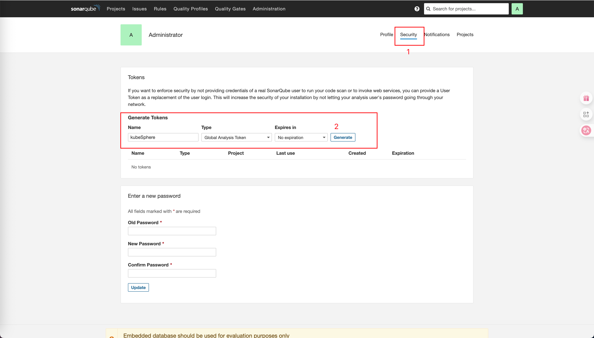
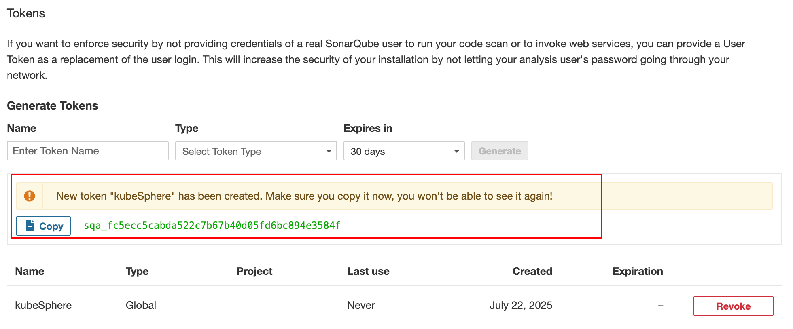

# 第3章 KubeSphere扩展服务安装

## 1 安装OpenELB负载均衡器

OpenELB 是一个开源的云原生负载均衡器实现，可以在基于裸金属服务器、边缘以及虚拟化的 Kubernetes 环境中使用 LoadBalancer 类型的 Service 对外暴露服务。

OpenELB安装：https://github.com/openelb/openelb/blob/master/README_zh.md

[openelb最新版官网文档](https://openelb.io/docs/getting-started/)

### 1.0 为什么选择 OpenELB

在云服务环境中的 Kubernetes 集群里，通常可以用云服务提供商提供的负载均衡服务来暴露 Service，但是在本地没办法这样操作。而 OpenELB 可以让用户在裸金属服务器、边缘以及虚拟化环境中创建 LoadBalancer 类型的 Service 来暴露服务，并且可以做到和云环境中的用户体验是一致的。

- 核心功能

  - BGP 模式和二层网络模式下的负载均衡

  - ECMP 路由和负载均衡

  - IP 池管理

  - 基于 CRD 来管理 BGP 配置

  - 支持 Helm Chart 方式安装

- 网络协议支持

  | 协议类型   | 适用场景                 | 工作原理                      |                                                          |
  | :--------- | :----------------------- | :---------------------------- | -------------------------------------------------------- |
  | **Layer2** | 同子网环境               | 通过 ARP(IPv4)/NDP(IPv6) 响应 | 简单易用，适合小型环境，<br />但有单点瓶颈（10节点以下） |
  | **BGP**    | 跨路由器环境             | 通过 BGP 协议广播路由         | 专业级解决方案，适合生产环境，<br />需要网络设备支持     |
  | **VIP**    | 需要虚拟 IP 的高可用场景 | 配合 Keepalived 实现          |                                                          |


- 核心工作流程


- 绑定方式对比

  [官网OpenELP IP 地址分配](https://openelb.io/docs/getting-started/usage/openelb-ip-address-assignment/#there-is-a-default-eip-in-the-cluster)

  | 特性            | 自动分配          | 指定 Eip 池     | 静态 IP 绑定         |
  | :-------------- | :---------------- | :-------------- | :------------------- |
  | **IP 确定性**   | 随机分配          | 池内随机        | 固定 IP              |
  | **配置复杂度**  | 最简单（1个注解） | 中等（2个注解） | 最复杂（显式声明IP） |
  | **跨命名空间**  | 需 Eip 授权       | 需 Eip 授权     | 需 Eip 授权          |
  | **IP 冲突风险** | 低（自动管理）    | 低（自动管理）  | 高（需人工保障）     |
  | **适用场景**    | 测试环境          | 多团队生产环境  | 关键基础设施         |

  - 指定Eip池分配

  为服务添加注解，指定 OpenELB 作为负载均衡插件，并确保指定的 EIP 存在，无需检查是否分配给了命名空间。

  ```yaml
  apiVersion: network.kubesphere.io/v1alpha2
  kind: Eip
  metadata:
    name: layer2-eip # 定义elp资源
  spec:
    address: 172.31.73.130-172.31.73.132
    namespaces: 
    - project
    interface: eth0
    protocol: layer2
  
  ---
  kind: Service
  apiVersion: v1
  metadata:
    name: nginx
    namespace: project-test
    annotations:
      lb.kubesphere.io/v1alpha1: openelb # 指定 OpenELB 作为负载均衡插件
      eip.openelb.kubesphere.io/v1alpha2: layer2-eip # 指定elp资源
  spec:
    selector:
      app: nginx
    type: LoadBalancer
    ports:
      - name: http
        port: 80
        targetPort: 80
    externalTrafficPolicy: Cluster
  ```

  - 指定静态IP分配

  为服务添加注解，指定 OpenELB 作为负载均衡插件，并确保指定的 IP 在现有 EIP 的 CIDR 范围内，无需检查 EIP 是否分配给了命名空间。

  如果指定的 IP 已经分配，将会共享。

  ```yaml
  apiVersion: network.kubesphere.io/v1alpha2
  kind: Eip
  metadata:
    name: layer2-eip
  spec:
    address: 172.31.73.130-172.31.73.132 # 定义elp资源的ip范围
    namespaces: 
    - project
    interface: eth0
    protocol: layer2
  
  ---
  kind: Service
  apiVersion: v1
  metadata:
    name: nginx
    namespace: project-test
    annotations:
      lb.kubesphere.io/v1alpha1: openelb # 指定 OpenELB 作为负载均衡插件
      eip.openelb.kubesphere.io/v1alpha1: "192.168.1.10" # 指定一个在elp资源ip范围内的一个ip
  spec:
    selector:
      app: nginx
    type: LoadBalancer
    ports:
      - name: http
        port: 80
        targetPort: 80
    externalTrafficPolicy: Cluster
  
  
  # You can also set spec.loadBalancerIP to the specified ip. This method is recommended.
  ---
  kind: Service
  apiVersion: v1
  metadata:
    name: nginx1
    namespace: project-test
    annotations:
      lb.kubesphere.io/v1alpha1: openelb
  spec:
    loadBalancerIP: 192.168.1.10
    selector:
      app: nginx
    type: LoadBalancer
    ports:
      - name: http
        port: 80
        targetPort: 80
    externalTrafficPolicy: Cluster
  ```

  - 自动分配

    - 自动分配（没有默认elp）

    当您仅在注解中配置 `openelb` 而未指定 `eip` 和 `ip` 时，将进入自动分配。OpenELB 首先会找到一个合适的 eip，然后选择一个合适的 ip 完成分配。

    向 Service 添加注解，指定 OpenELB 作为负载均衡插件，并<span style="color:red;font-weight:bold;">确保命名空间分配给可用的 Eips</span>。

    ```yaml
    apiVersion: network.kubesphere.io/v1alpha2
    kind: Eip
    metadata:
      name: layer2-eip
    spec:
      address: 172.31.73.130-172.31.73.132
      namespaces: 
      - project
      interface: eth0
      protocol: layer2
    
    ---
    kind: Service
    apiVersion: v1
    metadata:
      name: nginx
      namespace: project
      annotations:
        lb.kubesphere.io/v1alpha1: openelb
    spec:
      selector:
        app: nginx
      type: LoadBalancer
      ports:
        - name: http
          port: 80
          targetPort: 80
      externalTrafficPolicy: Cluster
    ```

    :::info
  
    自动分配期间的 eip 选择策略：
  
    - 根据 `eip.namespace` 和 `eip.namespaceSelector` 预选可用的 Eips。
    - 按优先级对预选的 Eips 进行排序，并选择优先级最高的 Eip。
    - 如果没有预选 Eips，则使用默认 Eip。
    - 如果没有可用的 Eips，则分配失败并等待合适的 Eip。
    - 分配失败并等待 IP 释放，如果所有可用的 Eips 都已完全分配。
  
    :::
  
    - 自动分配（集群中有一个默认的 EIP）
  
      这里有一个如图所示的示例：
  
      - 使用注解 `"eip.openelb.kubesphere.io/is-default-eip": "true"` 将 `default-eip` 设置为默认的 EIP。
      - 命名空间 `namespace-1` 和 `namespace-2` 具有标签 `label: test` ，该标签被 `eip-selector` 的 `namespaceSelector` 用于匹配和选择。
      - `eip-ns` 的 Eip 有一个 namespaces 字段，它指定了 `namespace-1` 。这使得 `eip-ns` 能够匹配并被分配给 `namespace-1` 。
      - `eip` 弹性公网 IP 没有任何特殊配置。它只能用于指定分配，不能自动分配。
  
    ```yaml
    ```
  
    
  
    | Namespace 命名空间 | Available Eip Count 可用 Eip 数量 |
    | ------------------ | --------------------------------- |
    | `namespace-1`      | 3                                 |
    | `namespace-2`      | 2                                 |
    | `namespace-3`      | 1                                 |
  
    :::info
  
    当可用 Eip 数量大于 1 时，将根据优先级选择最终的 Eip。
  
    - 命名空间绑定的 Eip 优先级高于默认 Eip。
    - 对于多个命名空间绑定的 Eip，将根据优先级字段确定优先级。优先级值越低，优先级越高。
  
    :::

### 1.1 使用kubectl安装和卸载OpenELB（v0.6.0）

#### 0 前置条件

你需要准备一个 Kubernetes 集群，并确保 Kubernetes 版本为 1.15 或更高版本。OpenELB 需要 CustomResourceDefinition (CRD) v1，而 Kubernetes 1.15 或更高版本才支持 CRD v1。

#### 1 下载并安装

```bash
$ cd /k8s_soft
$ wget https://raw.githubusercontent.com/openelb/openelb/release-0.6/deploy/openelb.yaml
$ kubectl apply -f openelb.yaml
```

#### 2 查看安装结果

```bash
$ kubectl get po -n openelb-system
```

#### 3 卸载

```bash
$ kubectl delete -f openelb.yaml
```

### 1.2 使用helm安装【推荐】

#### 1 配置helm仓库并安装

```bash
$ helm repo add openelb https://openelb.github.io/openelb
$ helm repo update
$ helm install openelb openelb/openelb -n openelb-system --create-namespace
```

> 若添加repo时网络不通，设置代理：
>
> ```bash
> $ export https_proxy=http://192.168.200.1:7890 http_proxy=http://192.168.200.1:7890 all_proxy=socks5://192.168.200.1:7890 no_proxy="xxx"
> ```

#### 2 查看安装结果

```bash
$ kubectl get po -n openelb-system
```

#### 3 卸载

```bash
$ helm delete openelb -n openelb-system
```

### 1.3 在 Layer 2 模式下使用 OpenELB

#### 1.3.0 前置条件

- 您需要准备一个已安装 OpenELB 的 Kubernetes 集群。所有 Kubernetes 集群节点必须在同一个 Layer 2 网络（同一路由器下）。
- 您需要准备一台客户端机器，用于验证 OpenELB 在 Layer 2 模式下的功能是否正常。客户端机器需要与 Kubernetes 集群节点位于同一网络。
- Layer 2 模式需要您的基础设施环境允许匿名 ARP/NDP 数据包。如果 OpenELB 在基于云的 Kubernetes 集群中进行测试安装，您需要向您的云供应商确认是否允许匿名 ARP/NDP 数据包。如果不允许，则无法使用 Layer 2 模式。

- <span style="color:red;font-weight:bold;">为OpenELB指定NIC网络接口卡（Network Interface Card）</span>

  如果OpenELB的安装节点有多个网卡（比如：eth0,eth1等），需要指定OpenELB在Layer 2模式下使用哪一个网卡。如果节点只有1个网卡，就不需要指定了。

  - **按需给节点添加注解**

  ```bash
  # 只给有多接口的节点添加注解："当此节点被选为 EIP 的 ARP 响应节点时，请使用 `192.168.200.116` 对应的接口"
  $ kubectl annotate nodes emon layer2.openelb.kubesphere.io/v1alpha1="192.168.200.116"
  ```

  > 查看是否存在多个网络适配器：
  >
  > ```bash
  > $ ip -o link show | awk '{print $2}' | cut -d':' -f1 | grep -Ev "lo|cali"
  > ```

  - **验证注解添加情况**

  ```bash
  $ kubectl describe node emon | grep openelb.kubesphere.io
  ```

  - **删除无用注解**（如果需要）：

  ```bash
  $ kubectl annotate node emon layer2.openelb.kubesphere.io/v1alpha1-
  ```

  - **影响选举行为**：

  ```mermaid
  graph TD
      A[EIP 192.168.200.91] --> B{选举 ARP 响应节点}
      B --> C[已注解节点]
      B --> D[未注解节点]
      C -->|优先选择| E[使用指定 IP 的接口]
      D -->|自动选择| F[同子网的第一个接口]
  ```

  

#### 1.3.1 第一步：确保已启用 Layer 2 模式

Layer 2 模式可以通过命令行参数启用或禁用。在使用 Layer 2 模式时，请确保 Layer 2 发言人已正确启用。

运行以下命令以编辑 openelb-speaker DaemonSet

```bash
$ kubectl edit ds -n openelb-system openelb-speaker
```

将 `enable-layer2` 设置为 `true` 并保存更改。openelb-speaker 将自动重启。

```yaml
    spec:
      containers:
      - args:
        - --api-hosts=:50051
        - --enable-keepalived-vip=false
        - --enable-layer2=true
        command:
        - openelb-speaker
```

#### 1.3.2 第二步：为 kube-proxy 启用 strictARP

在 Layer 2 模式下，您需要为 kube-proxy 启用 strictARP，以便 Kubernetes 集群中的所有网络接口卡停止应答来自其他网络接口卡的 ARP 请求，并由 OpenELB 处理 ARP 请求。

1. 登录到 Kubernetes 集群并运行以下命令编辑 kube-proxy ConfigMap：

```bash
$ kubectl edit configmap kube-proxy -n kube-system
```

2. 在 kube-proxy ConfigMap 的 YAML 配置中，将 `data.config.conf.ipvs.strictARP` 设置为 `true` 。

```yaml
ipvs:
  strictARP: true
```

3. 运行以下命令重启 kube-proxy：

```bash
$ kubectl rollout restart daemonset kube-proxy -n kube-system
```

#### 1.3.3 第三步：创建 Eip 对象

Eip 对象作为 OpenELB 的 IP 地址池使用。

1. 运行以下命令创建 Eip 对象的 YAML 文件：

```bash
$ vim layer2-eip.yaml
```

2. 将以下信息添加到 YAML 文件中：

```yaml
apiVersion: network.kubesphere.io/v1alpha2
kind: Eip
metadata:
  name: layer2-eip
spec:
  address: 192.168.200.91-192.168.200.100
  interface: ens160
  protocol: layer2
```

:::info

`spec:address` 中指定的 IP 地址必须与 Kubernetes 集群节点位于同一网络段。

有关 Eip YAML 配置中字段的详细信息，请参阅[使用 Eip 配置 IP 地址池](https://openelb.io/docs/getting-started/configuration/configure-ip-address-pools-using-eip/)。

:::

3. 运行以下命令创建 Eip 对象：

```bash
$ kubectl apply -f layer2-eip.yaml
```

#### 1.3.4 第四步：创建部署

以下使用 nginx 镜像创建一个包含两个 Pod 的 Deployment。每个 Pod 都会将其自己的 Pod 名称返回给外部请求。

1. 运行以下命令创建 Deployment 的 YAML 文件：

```bash
$ vim layer2-openelb.yaml
```

2. 将以下信息添加到 YAML 文件中：

```yaml
apiVersion: apps/v1
kind: Deployment
metadata:
  name: layer2-openelb
spec:
  replicas: 2
  selector:
    matchLabels:
      app: layer2-openelb
  template:
    metadata:
      labels:
        app: layer2-openelb
    spec:
      containers:
        - image: nginx:1.25.4
          name: nginx
          ports:
            - containerPort: 80
```

3. 运行以下命令创建 Deployment：

```bash
$ kubectl apply -f layer2-openelb.yaml
```

#### 1.3.5 第五步：创建服务

1. 运行以下命令为服务创建一个 YAML 文件：

```bash
$ vim layer2-svc.yaml
```

2. 将以下信息添加到 YAML 文件中：

```yaml
kind: Service
apiVersion: v1
metadata:
  name: layer2-svc
  annotations:
    lb.kubesphere.io/v1alpha1: openelb
    # For versions below 0.6.0, you also need to specify the protocol
    # protocol.openelb.kubesphere.io/v1alpha1: layer2
    eip.openelb.kubesphere.io/v1alpha2: layer2-eip
spec:
  selector:
    app: layer2-openelb
  type: LoadBalancer
  ports:
    - name: http
      port: 80
      targetPort: 80
  externalTrafficPolicy: Cluster
```

:::warning

- 你必须将 `spec:type` 设置为 `LoadBalancer` 。
- `lb.kubesphere.io/v1alpha1: openelb` 注释指定该服务使用 OpenELB。
- `protocol.openelb.kubesphere.io/v1alpha1: layer2` 注释指定 OpenELB 使用 Layer 2 模式。自 0.6.0 版本起已弃用。
- `eip.openelb.kubesphere.io/v1alpha2: layer2-eip` 注释指定 OpenELB 使用的 Eip 对象。如果未配置此注释，OpenELB 会自动选择一个可用的 Eip 对象。或者，您可以移除此注释并使用 `spec:loadBalancerIP` 字段（例如， `spec:loadBalancerIP: 192.168.200.91` ）或添加注释 `eip.openelb.kubesphere.io/v1alpha1: 192.168.200.91` 为服务分配特定的 IP 地址。当您将多个服务的 `spec:loadBalancerIP` 设置为相同的值以进行 IP 地址共享（这些服务通过不同的服务端口区分）时，在这种情况下，您必须将 `spec:ports:port` 设置为不同的值并将 `spec:externalTrafficPolicy` 设置为 `Cluster` 。有关 IPAM 的更多详细信息，请参阅 openelb ip address assignment。
- 如果 `spec:externalTrafficPolicy` 设置为 `Cluster` （默认值），OpenELB 会从所有 Kubernetes 集群节点中随机选择一个节点来处理 Service 请求。<span style="color:#9400D3;font-weight:bold;">其他节点上的 Pod 也可以通过 kube-proxy 访问</span>。
- 如果 `spec:externalTrafficPolicy` 设置为 `Local` ，OpenELB 会随机选择 Kubernetes 集群中包含 Pod 的节点来处理 Service 请求。<span style="color:#9400D3;font-weight:bold;">只有选中节点上的 Pod 才能被访问</span>。

:::

3. 运行以下命令创建服务：

```bash
$ kubectl apply -f layer2-svc.yaml
```

#### 1.3.6 第六步：验证 OpenELB 在 Layer 2 模式下的功能

以下验证 OpenELB 是否正常运行。

1. 在 Kubernetes 集群中，运行以下命令以确认容器组、部署都已成功，并获取服务的外部 IP 地址：

```bash
$ kubectl get deploy,po,svc
NAME                             READY   UP-TO-DATE   AVAILABLE   AGE
deployment.apps/layer2-openelb   2/2     2            2           168m

NAME                                 READY   STATUS    RESTARTS   AGE
pod/layer2-openelb-c689cf6cd-8vkhl   1/1     Running   0          7m46s
pod/layer2-openelb-c689cf6cd-gqw6n   1/1     Running   0          7m35s

NAME                 TYPE           CLUSTER-IP     EXTERNAL-IP      PORT(S)        AGE
service/kubernetes   ClusterIP      10.233.0.1     <none>           443/TCP        6d
service/layer2-svc   LoadBalancer   10.233.18.27   192.168.200.91   80:30996/TCP   147m
```

2. 在 Kubernetes 集群中，运行以下命令以获取集群节点的 IP 地址：

```bash
$ kubectl get nodes -o wide
```

3. 在 Kubernetes 集群中，运行以下命令以检查 Pod 的节点：

```bash
$ kubectl get pod -o wide
```

> 在这个示例中，Pods 会自动分配到不同的节点。你可以手动将 Pods 分配到不同的节点。

4. 在客户端机器（<span style="color:blue;font-weight:bold;">同一网段机器，非集群节点</span>）上，运行以下命令来 ping 服务 IP 地址并检查 IP 邻居：

- 通过 <span style="color:blue;font-weight:bold;">查看邻居</span> 命令查看IP绑定到哪一个集群节点了

```bash
# 无法ping通
$ ping 192.168.200.91 -c 4
# 查看邻居：在Linux机器上使用 `ip neigh`；在Mac机器上使用`arp -a`
$ arp -a
```

```bash
? (192.168.3.1) at f8:20:a9:5e:6d:7b on en0 ifscope [ethernet]
? (192.168.3.4) at 82:2d:64:e0:81:25 on en0 ifscope [ethernet]
? (192.168.3.49) at 40:f9:46:43:dd:42 on en0 ifscope [ethernet]
? (192.168.3.255) at ff:ff:ff:ff:ff:ff on en0 ifscope [ethernet]
? (192.168.32.255) at ff:ff:ff:ff:ff:ff on bridge101 ifscope [bridge]
? (192.168.186.255) at ff:ff:ff:ff:ff:ff on bridge100 ifscope [bridge]
? (192.168.200.91) at 0:c:29:3b:fe:91 on bridge102 ifscope [bridge]
? (192.168.200.92) at 0:c:29:30:af:3f on bridge102 ifscope [bridge]
emon (192.168.200.116) at 0:c:29:30:af:3f on bridge102 ifscope [bridge]
emon2 (192.168.200.117) at 0:c:29:49:3b:3e on bridge102 ifscope [bridge]
emon3 (192.168.200.118) at 0:c:29:3b:fe:91 on bridge102 ifscope [bridge]
? (192.168.200.255) at ff:ff:ff:ff:ff:ff on bridge102 ifscope [bridge]
mdns.mcast.net (224.0.0.251) at 1:0:5e:0:0:fb on en0 ifscope permanent [ethernet]
```

> 在 <span style="color:red;font-weight:bold;">查看邻居</span> 命令的输出中，服务 IP 地址 <span style="color:blue;font-weight:bold;">192.168.200.91</span> 的 MAC 地址与 <span style="color:blue;font-weight:bold;">emon3 (192.168.200.118)</span> 的 MAC 地址相同。因此，OpenELB 已将服务 IP 地址映射到 <span style="color:blue;font-weight:bold;">emon3</span> 的 MAC 地址。

- 通过容器组日志查看IP绑定到哪一个集群节点了

```bash
$ kubectl get pods -n openelb-system -l component=speaker -o name|xargs -I {} kubectl logs -n openelb-system {} | grep -A5 "192.168.200.91"
```


> 如图所示，服务 IP 地址 <span style="color:blue;font-weight:bold;">192.168.200.91</span> 绑定到了集群节点 <span style="color:blue;font-weight:bold;">emon3 (192.168.200.118)</span>  上的 <span style="color:blue;font-weight:bold;">ens160</span> 网卡上

5. 在客户端机器（<span style="color:blue;font-weight:bold;">同一网段机器，非集群节点</span>）上，运行 `curl` 命令以访问服务：

```bash
$ curl 192.168.200.91
```

### 1.4 在 VIP 模式下使用 OpenELB【本地环境推荐安装】

#### 1.4.0 前置条件

- 您需要准备一个已安装 OpenELB 的 Kubernetes 集群。所有 Kubernetes 集群节点必须在同一个 Layer 2 网络（同一路由器下）。

- <span style="color:#9400D3;font-weight:bold;">所有 Kubernetes 集群节点必须只有一个网卡。当前 VIP 模式不支持具有多个网卡的 Kubernetes 集群节点</span>。
- 您需要准备一台客户端机器，用于验证 OpenELB 在 Layer 2 模式下的功能是否正常。客户端机器需要与 Kubernetes 集群节点位于同一网络。

- <span style="color:red;font-weight:bold;">为OpenELB指定NIC网络接口卡（Network Interface Card）</span>

  如果OpenELB的安装节点有多个网卡（比如：eth0,eth1等），需要指定OpenELB在Layer 2模式下使用哪一个网卡。如果节点只有1个网卡，就不需要指定了。

  - **按需给节点添加注解**

  ```bash
  # 只给有多接口的节点添加注解："当此节点被选为 EIP 的 ARP 响应节点时，请使用 `192.168.200.116` 对应的接口"
  $ kubectl annotate nodes emon layer2.openelb.kubesphere.io/v1alpha1="192.168.200.116"
  ```

  > 查看是否存在多个网络适配器：
  >
  > ```bash
  > $ ip -o link show | awk '{print $2}' | cut -d':' -f1 | grep -Ev "lo|cali"
  > ```

  - **验证注解添加情况**

  ```bash
  $ kubectl describe node emon | grep openelb.kubesphere.io
  ```

  - **删除无用注解**（如果需要）：

  ```bash
  $ kubectl annotate node emon layer2.openelb.kubesphere.io/v1alpha1-
  ```

  - **影响选举行为**：

  ```mermaid
  graph TD
      A[EIP 192.168.200.91] --> B{选举 ARP 响应节点}
      B --> C[已注解节点]
      B --> D[未注解节点]
      C -->|优先选择| E[使用指定 IP 的接口]
      D -->|自动选择| F[同子网的第一个接口]
  ```

#### 1.4.1 第一步：确保已启用 VIP 模式

VIP 模式可以通过命令行参数启用或禁用。使用 VIP 模式时，请确保 VIP 发言人已正确启用。

运行以下命令以编辑 openelb-speaker DaemonSet：

```bash
$ kubectl edit ds -n openelb-system openelb-speaker
```

将 `enable-keepalived-vip` 设置为 `true` 并保存更改。openelb-speaker 将自动重启。

```yaml
    spec:
      containers:
      - args:
        - --api-hosts=:50051
        - --enable-keepalived-vip=true
        - --enable-layer2=false
        command:
        - openelb-speaker
```

#### 1.4.2 第二步：创建 Eip 对象

Eip 对象作为 OpenELB 的 IP 地址池使用。

1. 运行以下命令创建 Eip 对象的 YAML 文件：

```bash
$ vim vip-eip.yaml
```

2. 将以下信息添加到 YAML 文件中：

```yaml
apiVersion: network.kubesphere.io/v1alpha2
kind: Eip
metadata:
  name: vip-eip
spec:
  address: 192.168.200.91-192.168.200.100
  interface: ens160
  protocol: vip
```

:::info

- `spec:address` 中指定的 IP 地址必须与 Kubernetes 集群节点位于同一网络段。
- 有关 Eip YAML 配置中字段的详细信息，请参阅[使用 Eip 配置 IP 地址池](https://openelb.io/docs/getting-started/configuration/configure-ip-address-pools-using-eip/)。

:::

3. 运行以下命令创建 Eip 对象：

```bash
$ kubectl apply -f vip-eip.yaml
```

#### 1.4.3 第三步：创建部署

以下使用 nginx 镜像创建一个包含两个 Pod 的 Deployment。每个 Pod 都会将其自己的 Pod 名称返回给外部请求。

1. 运行以下命令创建 Deployment 的 YAML 文件：

```bash
$ vim vip-openelb.yaml
```

2. 将以下信息添加到 YAML 文件中：

```yaml
apiVersion: apps/v1
kind: Deployment
metadata:
  name: vip-openelb
spec:
  replicas: 2
  selector:
    matchLabels:
      app: vip-openelb
  template:
    metadata:
      labels:
        app: vip-openelb
    spec:
      containers:
        - image: nginx:1.25.4
          name: nginx
          ports:
            - containerPort: 80
```

3. 运行以下命令创建 Deployment：

```bash
$ kubectl apply -f vip-openelb.yaml
```

#### 1.4.4 第三步：创建服务[ ](https://openelb.io/docs/getting-started/usage/use-openelb-in-vip-mode/#step-4-create-a-service)

1. 运行以下命令为服务创建一个 YAML 文件：

```bash
$ vim vip-svc.yaml
```

2. 将以下信息添加到 YAML 文件中：

```yaml
kind: Service
apiVersion: v1
metadata:
  name: vip-svc
  annotations:
    lb.kubesphere.io/v1alpha1: openelb
    # For versions below 0.6.0, you also need to specify the protocol
    # protocol.openelb.kubesphere.io/v1alpha1: vip
    eip.openelb.kubesphere.io/v1alpha2: vip-eip
spec:
  selector:
    app: vip-openelb
  type: LoadBalancer
  ports:
    - name: http
      port: 80
      targetPort: 80
  externalTrafficPolicy: Cluster
```

:::warning

- 你必须将 `spec:type` 设置为 `LoadBalancer` 。
- `lb.kubesphere.io/v1alpha1: openelb` 注释指定该服务使用 OpenELB。
- `protocol.openelb.kubesphere.io/v1alpha1: vip` 注释指定 OpenELB 以 VIP 模式使用。自 0.6.0 版本起已弃用。
- `eip.openelb.kubesphere.io/v1alpha2: vip-eip` 注释指定 OpenELB 使用的 Eip 对象。如果未配置此注释，OpenELB 会自动选择一个可用的 Eip 对象。或者，您可以移除此注释并使用 `spec:loadBalancerIP` 字段（例如， `spec:loadBalancerIP: 192.168.200.91` ）或添加注释 `eip.openelb.kubesphere.io/v1alpha1: 192.168.200.91` 为服务分配特定的 IP 地址。当您将多个服务的 `spec:loadBalancerIP` 设置为相同的值以进行 IP 地址共享（这些服务通过不同的服务端口区分）时，在这种情况下，您必须将 `spec:ports:port` 设置为不同的值并将 `spec:externalTrafficPolicy` 设置为 `Cluster` 。有关 IPAM 的更多详细信息，请参阅 openelb ip address assignment。
- 如果 `spec:externalTrafficPolicy` 设置为 `Cluster` （默认值），OpenELB 会从所有 Kubernetes 集群节点中随机选择一个节点来处理 Service 请求。<span style="color:#9400D3;font-weight:bold;">其他节点上的 Pod 也可以通过 kube-proxy 访问</span>。
- 如果 `spec:externalTrafficPolicy` 设置为 `Local` ，OpenELB 会随机选择 Kubernetes 集群中包含 Pod 的节点来处理 Service 请求。<span style="color:#9400D3;font-weight:bold;">只有选中节点上的 Pod 才能被访问</span>。

:::

3. 运行以下命令创建服务：

```bash
$ kubectl apply -f vip-svc.yaml
```

#### 1.4.5 第五步：验证 VIP 模式下的 OpenELB

以下验证 OpenELB 是否正常运行。

1. 在 Kubernetes 集群中，运行以下命令以获取服务的外部 IP 地址：

```bash
$ kubectl get deploy,po,svc
NAME                          READY   UP-TO-DATE   AVAILABLE   AGE
deployment.apps/vip-openelb   2/2     2            2           38s

NAME                               READY   STATUS    RESTARTS   AGE
pod/vip-openelb-64fcb9fb58-d55tm   1/1     Running   0          38s
pod/vip-openelb-64fcb9fb58-jmhn6   1/1     Running   0          38s

NAME                 TYPE           CLUSTER-IP     EXTERNAL-IP      PORT(S)        AGE
service/kubernetes   ClusterIP      10.233.0.1     <none>           443/TCP        6d10h
service/vip-svc      LoadBalancer   10.233.41.54   192.168.200.91   80:31293/TCP   7s
```

2. 在 Kubernetes 集群中，运行以下命令以获取集群节点的 IP 地址：

```bash
$ kubectl get nodes -o wide
```

3. 在 Kubernetes 集群中，运行以下命令以检查 Pod 的节点：

```bash
$ kubectl get pod -o wide
```

>  在这个示例中，Pods 会自动分配到不同的节点。你可以手动将 Pods 分配到不同的节点。

4. 在客户端机器（<span style="color:blue;font-weight:bold;">同一网段机器，非集群节点</span>）上，运行以下命令来 ping 服务 IP 地址并检查 IP 邻居：

- 通过 <span style="color:blue;font-weight:bold;">查看邻居</span> 命令查看IP绑定到哪一个集群节点了

```bash
$ ping 192.168.200.91 -c 4
PING 192.168.200.91 (192.168.200.91): 56 data bytes
64 bytes from 192.168.200.91: icmp_seq=0 ttl=64 time=0.256 ms
64 bytes from 192.168.200.91: icmp_seq=1 ttl=64 time=0.258 ms
64 bytes from 192.168.200.91: icmp_seq=2 ttl=64 time=0.509 ms
64 bytes from 192.168.200.91: icmp_seq=3 ttl=64 time=0.427 ms

--- 192.168.200.91 ping statistics ---
4 packets transmitted, 4 packets received, 0.0% packet loss
round-trip min/avg/max/stddev = 0.256/0.363/0.509/0.109 ms
```

```bash
# 查看邻居：在Linux机器上使用 `ip neigh`；在Mac机器上使用`arp -a`
$ arp -a
? (192.168.3.1) at f8:20:a9:5e:6d:7b on en0 ifscope [ethernet]
? (192.168.3.45) at 96:61:e1:c9:b0:67 on en0 ifscope [ethernet]
? (192.168.3.49) at 40:f9:46:43:dd:42 on en0 ifscope [ethernet]
? (192.168.3.255) at ff:ff:ff:ff:ff:ff on en0 ifscope [ethernet]
? (192.168.32.255) at ff:ff:ff:ff:ff:ff on bridge101 ifscope [bridge]
? (192.168.186.255) at ff:ff:ff:ff:ff:ff on bridge100 ifscope [bridge]
? (192.168.200.91) at 0:c:29:3b:fe:91 on bridge102 ifscope [bridge]
emon (192.168.200.116) at 0:c:29:30:af:3f on bridge102 ifscope [bridge]
emon2 (192.168.200.117) at 0:c:29:49:3b:3e on bridge102 ifscope [bridge]
emon3 (192.168.200.118) at 0:c:29:3b:fe:91 on bridge102 ifscope [bridge]
? (192.168.200.255) at ff:ff:ff:ff:ff:ff on bridge102 ifscope [bridge]
mdns.mcast.net (224.0.0.251) at 1:0:5e:0:0:fb on en0 ifscope permanent [ethernet]
```

> 在 <span style="color:red;font-weight:bold;">查看邻居</span> 命令的输出中，服务 IP 地址 <span style="color:blue;font-weight:bold;">192.168.200.91</span> 的 MAC 地址与 <span style="color:blue;font-weight:bold;">emon3 (192.168.200.118)</span> 的 MAC 地址相同。因此，OpenELB 已将服务 IP 地址映射到 <span style="color:blue;font-weight:bold;">emon3</span> 的 MAC 地址。

5. 在客户端机器（<span style="color:blue;font-weight:bold;">同一网段机器，非集群节点</span>）上，运行 `curl` 命令以访问服务：

```bash
$ curl 192.168.200.91
```

### 1.5 配置集群网关设置

admin 账户操作

- 集群设置=>网关设置=>启用网关

    - LoadBalancer
        - 负载均衡器提供商：默认 QingCloud Kubernets Engine，这里选择 OpenELB（选择哪一个都没关系，使用的是默认EIP）
        - 注解：添加下面注解

        | 注解key                                 | 注解value | 备注                                      |
        | --------------------------------------- | --------- | ----------------------------------------- |
        | lb.kubesphere.io/v1alpha1               | openelb   |                                           |
        | protocol.openelb.kubesphere.io/v1alpha1 | vip       | v0.6.0之前必须配置，自 0.6.0 版本起已弃用 |
        | eip.openelb.kubesphere.io/v1alpha2      | vip-eip   |                                           |
    
    - 点击确定

> 由于上面创建了默认eip，这里可以不用配置注解

- 查看是否启用成功

```bash
# 查看 EXTERNAL-IP 字段是否已经分配了eip地址，比如：192.168.200.91
$ kubectl -n kubesphere-controls-system get svc
```

<span style="color:green;font-weight:bold;">注意：192.168.200.91可以通过网络适配器ens160添加新ip的方式达到宿主机本地DNS访问</span>

## 2 SonarQube代码质量持续检测工具

[SonarQube](https://www.sonarqube.org/) 是一种主流的代码质量持续检测工具，可用于代码库的静态和动态分析。

### 2.1 安装

#### 2.1.1 安装：使用kubesphere仓库

- 通过heml安装

```bash
$ helm repo add kubesphere https://charts.kubesphere.io/main
$ helm repo update
$ helm upgrade --install sonarqube kubesphere/sonarqube \
-n kubesphere-devops-system --create-namespace \
--set service.type=NodePort --set service.nodePort=30681 \
--set image.tag=9.9.0-community \
--set postgresql.image.tag=11.19.0-debian-11-r32
```

```bash
Release "sonarqube" does not exist. Installing it now.
NAME: sonarqube
LAST DEPLOYED: Tue Jul 22 12:56:14 2025
NAMESPACE: kubesphere-devops-system
STATUS: deployed
REVISION: 1
NOTES:
1. Get the application URL by running these commands:
  export NODE_PORT=$(kubectl get --namespace kubesphere-devops-system -o jsonpath="{.spec.ports[0].nodePort}" services sonarqube-sonarqube)
  export NODE_IP=$(kubectl get nodes --namespace kubesphere-devops-system -o jsonpath="{.items[0].status.addresses[0].address}")
  echo http://$NODE_IP:$NODE_PORT
```

- 验证，确保所有 pod 都running

```bash
$ kubectl get po -n kubesphere-devops-system
```

- 卸载

```bash
$ helm uninstall sonarqube -n kubesphere-devops-system
```

#### 2.1.2 安装：使用官方仓库安装

- 通过helm安装

```bash
$ helm repo add sonarqube https://SonarSource.github.io/helm-chart-sonarqube
$ helm repo update
$ export MONITORING_PASSCODE="yourPasscode"
$ helm upgrade --install sonarqube sonarqube/sonarqube --version 2025.4.0 \
-n kubesphere-devops-system --create-namespace \
--set service.type=NodePort --set service.nodePort=30681 \
--set postgresql.image.tag=11.19.0-debian-11-r32 \
--set edition=developer,monitoringPasscode=$MONITORING_PASSCODE
```

```bash
Release "sonarqube" does not exist. Installing it now.
NAME: sonarqube
LAST DEPLOYED: Fri Aug  1 16:25:29 2025
NAMESPACE: kubesphere-devops-system
STATUS: deployed
REVISION: 1
NOTES:
1. Get the application URL by running these commands:
  export NODE_PORT=$(kubectl get --namespace kubesphere-devops-system -o jsonpath="{.spec.ports[0].nodePort}" services sonarqube-sonarqube)
  export NODE_IP=$(kubectl get nodes --namespace kubesphere-devops-system -o jsonpath="{.items[0].status.addresses[0].address}")
  echo http://$NODE_IP:$NODE_PORT
WARNING: 
         Please note that the SonarQube image runs with a non-root user (uid=1000) belonging to the root group (guid=0). In this way, the chart can support arbitrary user ids as recommended in OpenShift.
         Please visit https://docs.openshift.com/container-platform/4.14/openshift_images/create-images.html#use-uid_create-images for more information.

WARNING: The embedded PostgreSQL is intended for evaluation only, it is DEPRECATED, and it will be REMOVED in a future release.
         Please visit https://artifacthub.io/packages/helm/sonarqube/sonarqube#production-use-case for more information.


WARNING: Setting the deployment strategy type is deprecated and will be removed in a future release. It will be hard-coded to Recreate.

WARNING: The deploymentType value is deprecated and won't be supported anymore. SonarQube will be deployed as a Deployment by default.
```

- 验证，确保所有 pod 都running

```bash
$ kubectl get po -n kubesphere-devops-system
```

- 卸载

```bash
$ helm uninstall sonarqube -n kubesphere-devops-system
```

### 2.2 获取 SonarQube 控制台地址

1. 执行以下命令获取 SonarQube NodePort。

```bash
export NODE_PORT=$(kubectl get --namespace kubesphere-devops-system -o jsonpath="{.spec.ports[0].nodePort}" services sonarqube-sonarqube)
export NODE_IP=$(kubectl get nodes --namespace kubesphere-devops-system -o jsonpath="{.items[0].status.addresses[0].address}")
echo http://$NODE_IP:$NODE_PORT
```

2. 预期输出结果：（您的 NodeIP 和 NodePort 应该不同）

http://192.168.200.116:30681

### 2.3 配置 SonarQube 服务器

#### 2.3.1 步骤 1：访问 SonarQube 控制台

1. 执行以下命令查看 SonarQube 的状态。注意，只有在 SonarQube 启动并运行后才能访问 SonarQube 控制台。

```bash
$ kubectl get pod -n kubesphere-devops-system
NAME                                   READY   STATUS      RESTARTS            AGE
devops-29219130-b7hcq                  0/1     Completed   0                   3h37m
devops-29219310-vkj57                  0/1     Completed   0                   23m
devops-29219340-z2pwl                  0/1     Completed   0                   7m10s
devops-apiserver-5659d9c674-s7vj9      1/1     Running     4 (12m ago)         20h
devops-controller-6c6978c674-vxnlt     1/1     Running     4 (12m ago)         5d6h
devops-jenkins-7bf45c888-s2jmd         1/1     Running     2 (<invalid> ago)   20h
sonarqube-postgresql-0                 1/1     Running     0                   10m
sonarqube-sonarqube-6df784d857-kws2g   1/1     Running     0                   10m
```

2. 在浏览器中访问 SonarQube 控制台 [http://NodeIP:NodePort](http://nodeip:NodePort/)。

http://192.168.200.116:30681

3. 点击右上角的 **Log in**，然后使用默认账户 **admin/admin** 登录。

| 用户名 | 原密码 | 新密码       |
| ------ | ------ | ------------ |
| admin  | admin  | P@88word1234 |

:::info

取决于实例的部署位置，您可能需要设置必要的端口转发规则，并在您的安全组中放行该端口，以便访问 SonarQube。

:::

#### 2.3.2 步骤 2：创建 SonarQube 管理员令牌 (Token)

1. 点击右上角字母 **A**，然后从菜单中选择 **My Account** 以转到 **Profile** 页面。


2. 点击 **Security** 并输入令牌名称，例如 **kubeSphere**。



3. 点击 **Generate** 并复制此令牌。



令牌： sqa_fc5ecc5cabda522c7b67b40d05fd6bc894e3584f

:::danger
如提示所示，您无法再次查看此令牌，因此请确保复制成功。

:::

#### 2.3.3 步骤 3：创建 Webhook 服务器

1. 执行以下命令获取 SonarQube Webhook 的地址。

```bash
export NODE_PORT=$(kubectl get --namespace kubesphere-devops-system -o jsonpath="{.spec.ports[0].nodePort}" services devops-jenkins)
export NODE_IP=$(kubectl get nodes --namespace kubesphere-devops-system -o jsonpath="{.items[0].status.addresses[0].address}")
echo http://$NODE_IP:$NODE_PORT/sonarqube-webhook/
```

2. 预期输出结果：

```bash
http://192.168.200.116:30180/sonarqube-webhook/
```

3. 依次点击 **Administration**、**Configuration** 和 **Webhooks** 创建一个 Webhook。


4. 点击 **Create**。


5. 在弹出的对话框中输入 **Name** 和 **Jenkins Console URL**（即 SonarQube Webhook 地址）。点击 **Create** 完成操作。


#### 2.3.4 步骤 4：将 SonarQube 服务器添加至 Jenkins

1. 执行以下命令获取 Jenkins 的地址。

```bash
export NODE_PORT=$(kubectl get --namespace kubesphere-devops-system -o jsonpath="{.spec.ports[0].nodePort}" services devops-jenkins)
export NODE_IP=$(kubectl get nodes --namespace kubesphere-devops-system -o jsonpath="{.items[0].status.addresses[0].address}")
echo http://$NODE_IP:$NODE_PORT
```

您将获得如下输出：

```bash
http://192.168.200.116:30180
```

2. 参照[登录 Jenkins 仪表板](/devops/new/KubeSphere/02-%E7%AC%AC2%E7%AB%A0%20KubeSphere%E6%89%A9%E5%B1%95%E7%BB%84%E4%BB%B6%E5%AE%89%E8%A3%85%E4%B8%8E%E4%BD%BF%E7%94%A8.html#_2-%E7%99%BB%E5%BD%95-jenkins-%E4%BB%AA%E8%A1%A8%E6%9D%BF)进行配置。

3. 使用地址 [http://NodeIP:30180](http://nodeip:30180/) 访问 Jenkins。

安装 DevOps 时，默认情况下也会安装 Jenkins 仪表板。此外，Jenkins 还配置有 KubeSphere LDAP，这意味着您可以直接使用 KubeSphere 账户（例如 `admin/P@88w0rd`）登录 Jenkins。有关配置 Jenkins 的更多信息，请参阅 [Jenkins 系统设置](https://www.kubesphere.io/zh/docs/v4.1/11-use-extensions/01-devops/03-how-to-use/02-pipelines/07-jenkins-setting/)。

4. 点击左侧导航栏中的**系统管理**。

5. 向下滚动并点击**系统配置**。

6. 搜寻到 **SonarQube servers**，然后点击 **Add SonarQube**。
7. 输入 **Name** 和 **Server URL** ([http://NodeIP:NodePort)。](http://nodeip:NodePort)。/) 点击**添加**，选择 **Jenkins**，然后在弹出的对话框中用 SonarQube 管理员令牌创建凭证（如下方第二张截图所示）。创建凭证后，从 **Server authentication token** 旁边的下拉列表中选择该凭证。点击**应用**完成操作。


> | 说明                                                         |
> | :----------------------------------------------------------- |
> | 如果点击**添加**按钮无效，可前往**系统管理**下的 **Manage Credentials** 并点击 **Stores scoped to Jenkins** 下的 **Jenkins**，再点击**全局凭据 (unrestricted)**，然后点击左侧导航栏的**添加凭据**，参考下方第二张截图用 SonarQube 管理员令牌添加凭证。添加凭证后，从 **Server authentication token** 旁边的下拉列表中选择该凭证。 |


#### 2.3.5 步骤 5：将 SonarQube 配置添加到 DevOps

1. 执行以下命令编辑配置字典 `devops-config`。

```bash
$ kubectl -n kubesphere-devops-system edit cm devops-config
```

2. 在 `devops` 段后添加字段 `sonarQube` 并在其下方指定 `host` 和 `token`。

```js
data:
  kubesphere.yaml: |
    authentication:
      authenticateRateLimiterMaxTries: 10
      authenticateRateLimiterDuration: 10m0s
      loginHistoryRetentionPeriod: 168h
      maximumClockSkew: 10s
      jwtSecret: "UDjssmmDgxZtkXVDSeFvBtsZeBSFWhJ6"

    devops:
      host: http://devops-jenkins.kubesphere-devops-system
      username: admin
      maxConnections: 100
      namespace: kubesphere-devops-system
      workerNamespace: kubesphere-devops-worker

    sonarQube: // [!code ++][!code focus:3]
      host: http://192.168.200.116:30180 // [!code ++]
      token: sqa_fc5ecc5cabda522c7b67b40d05fd6bc894e3584f // [!code ++]
```

3. 完成操作后保存此文件。

#### 2.3.6 步骤 6：将 sonarqubeURL 添加到 KubeSphere 控制台

您需要指定 **sonarqubeURL**，以便可以直接从 KubeSphere Web 控制台访问 SonarQube。

1. 执行以下命令：

   ```bash
   $ kubectl edit cm -n kubesphere-system ks-console-config
   ```

2. 搜寻到 **data:client:enableKubeConfig**，在下方添加 **devops** 字段并指定 **sonarqubeURL**。

   ```yaml
       client:
         version:
           kubesphere: v4.1.3
           kubernetes: v1.30.6
         enableKubeConfig: true
         devops: # 手动添加该字段。 [!code ++][!code focus:2]
           sonarqubeURL: http://192.168.200.116:30180 # SonarQube IP 地址。[!code ++]
   ```

3. 保存该文件。

#### 2.3.7 步骤 7：重启服务

执行以下命令重启服务。

```bash
$ kubectl -n kubesphere-devops-system rollout restart deploy devops-apiserver
```

```bash
$ kubectl -n kubesphere-system rollout restart deploy ks-console
```

### 2.4 为新项目创建 SonarQube Token

创建一个 SonarQube 令牌，以便流水线在运行时可以与 SonarQube 通信。

1. 在 SonarQube 控制台上，点击 **Create new project**。


2. 输入项目密钥，例如 **java-demo**，然后点击 **Set Up**。


3. 输入项目名称，例如 **Analyze "java-demo"**，然后点击 **Generate**。


4. 创建令牌后，点击 **Continue**。


Analyze "java-demo": **sqp_2e1db3bcb24cb8022b079aed60bb48e211a1df01**

5. 选择 **Maven**，复制下图所示红色框中的序列号。如果要在流水线中使用，则需要在[凭证](https://www.kubesphere.io/zh/docs/v4.1/11-use-extensions/01-devops/03-how-to-use/05-devops-settings/01-credential-management/)中添加此序列号。

### 2.5 在 KubeSphere 控制台查看结果

[使用 Jenkinsfile 创建流水线](https://www.kubesphere.io/zh/docs/v4.1/11-use-extensions/01-devops/03-how-to-use/02-pipelines/02-create-a-pipeline-using-jenkinsfile/)或[使用图形编辑面板创建流水线](https://www.kubesphere.io/zh/docs/v4.1/11-use-extensions/01-devops/03-how-to-use/02-pipelines/01-create-a-pipeline-using-graphical-editing-panel/)之后，即可查看代码质量分析的结果。

## 3 安装 NFS 存储

[部署NFS](/devops/new/Kubernetes/05-第5章 Kubernetes扩展安装.html#_4-1-部署nfs)

[安装Kubernetes NFS Subdir External Provisioner](/devops/new/Kubernetes/05-第5章 Kubernetes扩展安装.html#_4-2-安装kubernetes-nfs-subdir-external-provisioner)


## 99 扩展登录信息

| 登录地址                     | 描述      | 用户名 | 密码        | 原密码      |
| ---------------------------- | --------- | ------ | ----------- | ----------- |
| http://192.168.200.116:30002 | Harbor    | admin  | Harbor12345 | Harbor12345 |
| http://192.168.200.116:30681 | SonarQube | admin  | P@88word    | admin       |
