# 第3章 KubeSphere扩展组件安装（需代理）

##  1 安装「WizTelemetry 平台服务」组件（必备基础组件）<span style="color:#32CD32;font-weight:bold;">已安装</span>

### 1.1  前提条件

- 您需要在 KubeSphere 平台具有 **platform-admin** 角色。

### 1.1 安装

1. 在**扩展中心**页面点击 **WizTelemetry 平台服务**，点击**安装**。
2. 选择最新版本，然后按需修改**扩展组件配置**。
3. 配置完成后，点击**开始安装**按钮，静待安装完成。

### 1.2 自定义配置

<span style="color:red;font-weight:bold;">注意：不要启用 WizTelemetry 全局监控，除非你安装了<span style="color:#32CD32;font-weight:bold;">WizTelemetry 全局监控</span>否则，在<span style="color:#32CD32;font-weight:bold;">WizTelemetry 监控</span>组件安装后，概览和监控告警页面是没有指标信息的</span>

:::code-group

```yaml [组件配置标准环境]
# 无
```
```yaml [组件配置OrbStack环境]
# 无
```
:::

## 2 安装「WizTelemetry 监控」组件（强烈推荐组件）<span style="color:#32CD32;font-weight:bold;">已安装</span>

### 2.1 前提条件

- 您需要在 KubeSphere 平台具有 **platform-admin** 角色。

### 2.2 安装

1. 在**扩展中心**页面点击 **WizTelemetry 监控**，点击**安装**。
2. 选择最新版本，然后按需修改**扩展组件配置**。
3. 配置完成后，点击**开始安装**按钮，静待安装完成。
4. 在**集群选择**页面，勾选需要安装 Agent 的集群。
5. 在**差异化配置** 页面，按需编辑**集群 Agent 配置**，然后点击**确认**开始安装集群 Agent。

### 2.3 自定义配置

::: code-group

```yaml [组件配置标准环境]
# 无
```

```yaml [组件配置OrbStack环境]
# 禁用 etcd 监控
wiztelemetry-monitoring-helper:
  etcdMonitoringHelper:
    enabled: false

kube-prometheus-stack:
  prometheus:
    prometheusSpec:
      secrets: []
      # - kube-etcd-client-certs    
  kubeEtcd:
    enabled: false
    endpoints: []
```

:::

### 2.4 组件验证

安装“WizTelemetry 监控”扩展组件后，集群和企业空间的左侧导航栏将显示**监控告警**选项，集群和企业空间下的服务将支持**编辑监控导出器**，以下页面也将显示相关监控指标的数据：

| 模块     | 页面                                                         |
| :------- | :----------------------------------------------------------- |
| 集群     | 概览页面；集群节点、项目的列表和详情页；工作负载、任务、容器组、服务、持久卷声明的详情页；集群设置的基本信息页面。 |
| 企业空间 | 概览页面；项目列表；工作负载、任务、容器组、服务、持久卷声明的详情页。 |

:::tip

有关组件配置的更多信息，请参阅扩展中心“WizTelemetry 监控”扩展组件的详情页说明。

:::

- 集群-概览

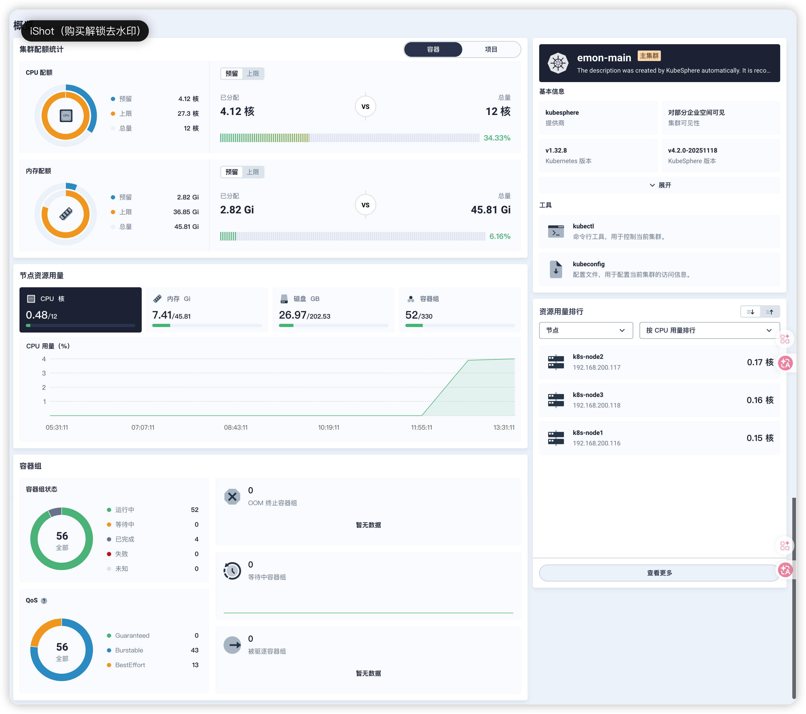

- 集群-节点-集群节点

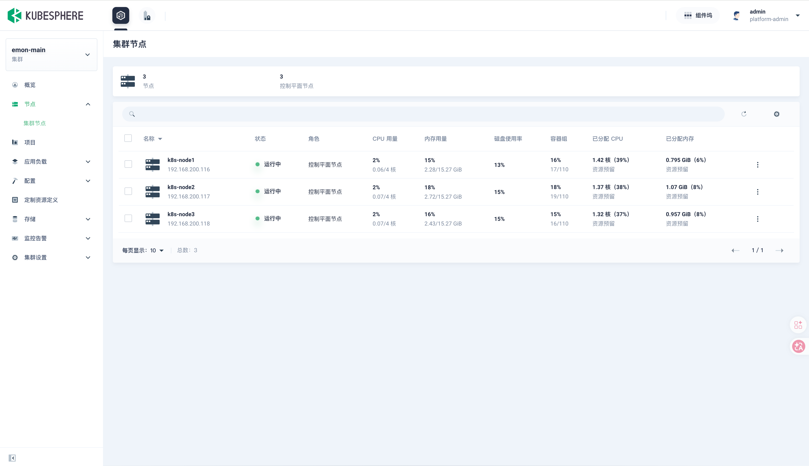

- 集群-节点-集群节点-节点1

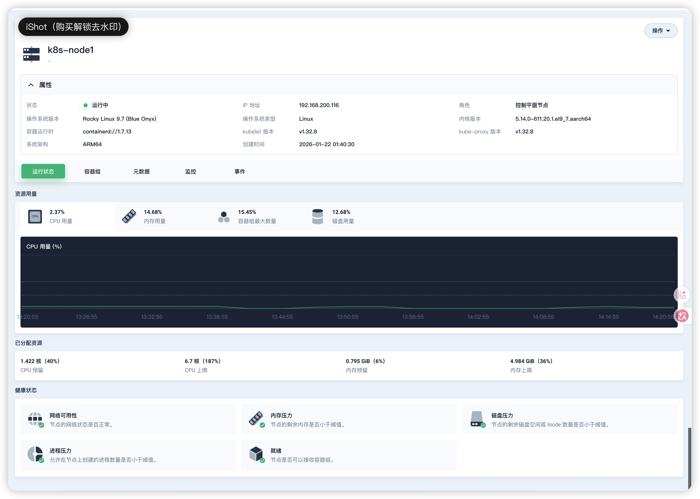


**监控告警**菜单也出现在了集群管理页面左侧菜单列表中，接下来我们查看细节：

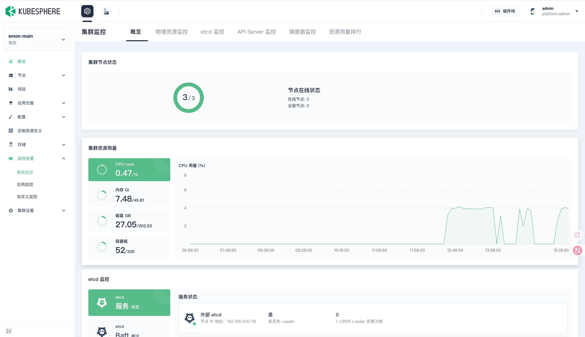

- 概览

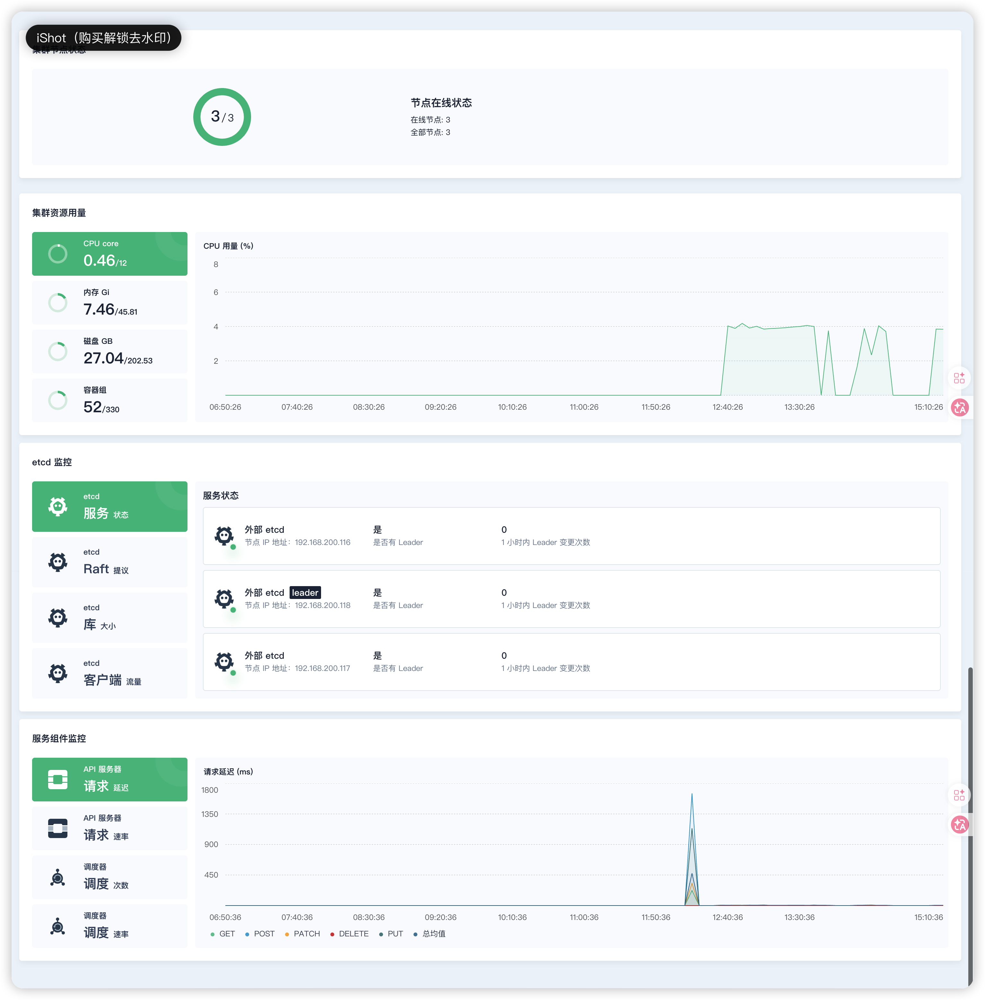

- 物理资源监控

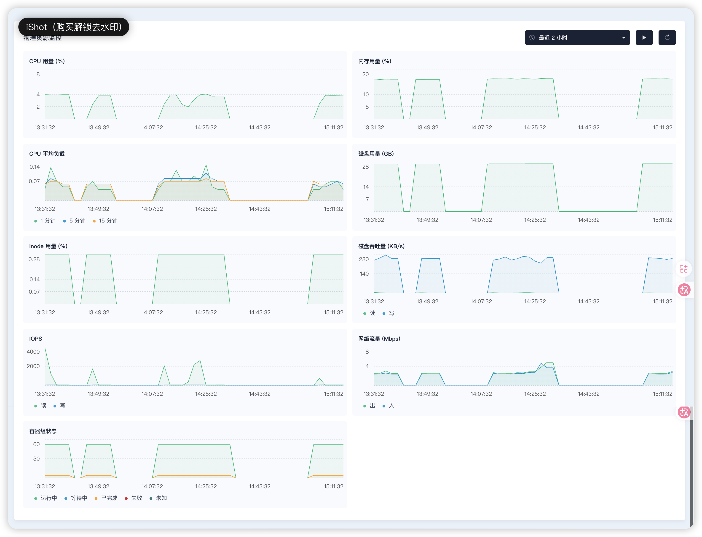

- etcd 监控(<span style="color:#9400D3;font-weight:bold;">从 **WizTelemetry 监控** v1.2.0 开始，**etcd 监控默认启用**</span>）

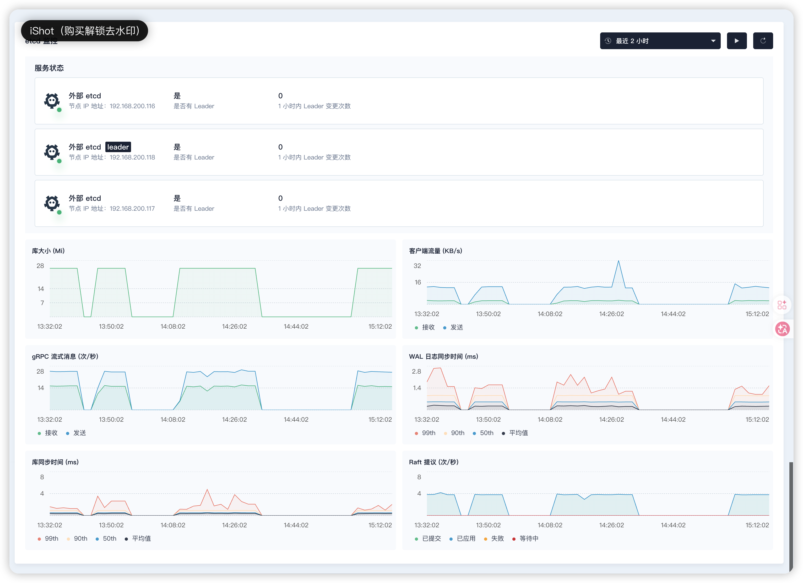

- API Server 监控

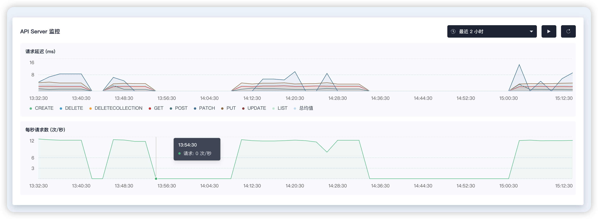

- 调度器监控

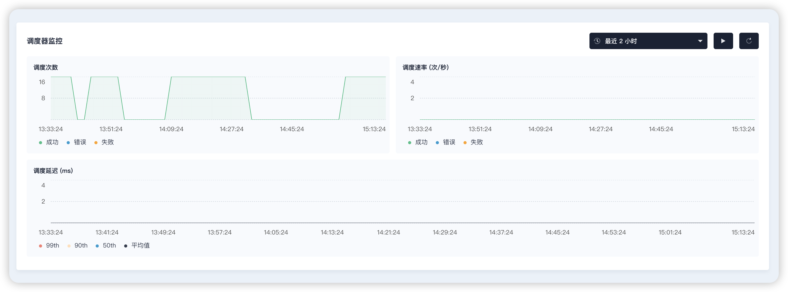

- 资源用量排行

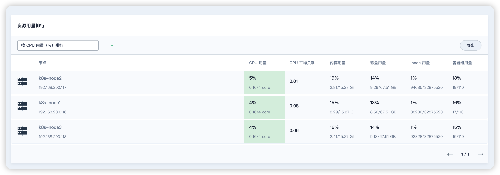


## 3 安装「Grafana for WizTelemetry」组件（必备基础组件）<span style="color:#32CD32;font-weight:bold;">已安装</span>

Grafana 是一个开放且可组合的观测和数据可视化平台，可以从多个来源（如Prometheus、Loki、Elasticsearch、InfluxDB、Postgres等）可视化指标、日志和跟踪数据。

该扩展组件提供一个开放且可组合的数据可视化和监控分析平台，内置众多仪表盘（Dashboard）来增强 WizTelemetry 可观测平台的可视化能力。它提供了丰富的数据展示和分析功能，使用户能够以直观和交互式的方式探索、查询和可视化各种数据源（如 Prometheus、Loki、Elasticsearch、InfluxDB、PostgreSQL 等）的指标、日志和跟踪数据。

Grafana 允许您查询、可视化、报警和理解存储在任何地方的指标。创建、探索和与团队共享仪表板，培养数据驱动的文化：

- **可视化：** 使用多种选项快速灵活的客户端图形。面板插件提供了许多不同的方式来可视化指标和日志。
- **动态仪表板：** 使用模板变量创建动态和可重用的仪表板，这些变量显示为仪表板顶部的下拉列表。
- **探索指标：** 通过自发查询和动态钻取探索您的数据。拆分视图并比较不同的时间范围、查询和数据源。
- **探索日志：** 体验从指标切换到日志的魔法，保留标签过滤器。快速搜索所有日志或实时流式传输。
- **报警：** 视觉上定义您最重要的指标的报警规则。Grafana将持续评估并向诸如Slack、PagerDuty、VictorOps、OpsGenie等系统发送通知。
- **混合数据源：** 在同一图表中混合不同的数据源！您可以根据每个查询指定数据源。甚至适用于自定义数据源。

### 3.1 前提条件

- 您需要在 KubeSphere 平台具有 **platform-admin** 角色。

### 3.2 安装

1. 在**扩展中心**页面点击 **Grafana for WizTelemetry**，点击**安装**。
2. 选择最新版本，然后按需修改**扩展组件配置**。
3. 配置完成后，点击**开始安装**按钮，静待安装完成。

### 3.3 自定义配置

:::code-group

```yaml [组件配置标准环境]
# 暴露 Grafana 服务
grafana:
  service:
    enabled: true
    type: NodePort
    loadBalancerIP: ""
    loadBalancerClass: ""
    loadBalancerSourceRanges: []
    port: 80
    targetPort: 3000
    nodePort: 32000
```

```yaml [组件配置OrbStack环境]
# 暴露 Grafana 服务
grafana:
  service:
    enabled: true
    type: NodePort
    loadBalancerIP: ""
    loadBalancerClass: ""
    loadBalancerSourceRanges: []
    port: 80
    targetPort: 3000
    nodePort: 32000
```

:::

| 参数               | 描述                                                         |
| ------------------ | ------------------------------------------------------------ |
| type: ClusterIP    | 只能在集群内部通过虚拟 IP 地址访问 Grafana 服务。            |
| type: NodePort     | 使用 NodePort 方式暴露服务，可通过 `nodePort` 参数指定端口。Grafana 服务的默认端口为 32000。配置后，可通过 : 访问 Grafana 控制台。 |
| type: LoadBalancer | 使用云服务商提供的负载均衡器向外部暴露 Grafana 服务。有关更多信息，请联系您的基础设施环境提供商。 |

### 3.4 访问

按照以上配置暴露 Grafana 服务后，访问 Grafana 控制台，使用默认帐户和密码 (**admin/admin**) 登录。

http://192.168.200.116:32000

| 用户名 | 原密码 | 新密码   |
| ------ | ------ | -------- |
| admin  | admin  | P@88word |

点击左侧导航栏的 **Dashboards**，查看 Grafana for WhizardTelemetry 预置的 Dashboard 模板。


## 4 安装「OpenSearch 分布式检索与分析引擎」组件（必备基础组件）<span style="color:#32CD32;font-weight:bold;">已安装</span>

OpenSearch 是 KubeSphere 内置的日志存储扩展组件，用于存储日志、审计、事件、通知历史等信息。

<span style="color:#9400D3;font-weight:bold;">请注意，该组件会拉取N个（每个节点一个）接近800M的镜像（docker.io/opensearchproject/opensearch:2.11.1）+一个400M的镜像(docker.io/opensearchproject/opensearch-dashboards:2.11.1)</span>

```bash
docker.io/opensearchproject/opensearch-dashboards                       2.11.1              bbe0609ce3198       446MB
docker.io/opensearchproject/opensearch                                  2.11.1              2f3d98cd3cdc9       876MB
```

OpenSearch 分布式检索与分析引擎仅提供后端服务，无前端界面。通过该扩展组件提供的 OpenSearch 服务为 KubeSphere 默认使用的日志接收器。

安装完成后，需在 WizTelemetry 数据流水线中修改 OpenSearch 的相关配置，以便能够从 OpenSearch 获取日志、审计、事件、通知历史等数据。如果您的 OpenSearch 是安装在 K8s 集群内，需要给 OpenSearch 服务配置好 NodePort 后更改 WizTelemetry 数据流水线中默认设置的 OpenSearch 地址！更多信息，请参阅扩展中心“WizTelemetry 数据流水线”扩展组件的详情页说明。

### 4.0 OpenSearch 的起源

- OpenSearch 最初是从 **Elasticsearch 7.10.2** 和 **Kibana 7.10.2** 分叉而来（2021年）。
- 之后 OpenSearch 和 Elasticsearch 的版本号完全独立发展，功能差异逐渐扩大。

### 4.1 前提条件

- 您需要在 KubeSphere 平台具有 **platform-admin** 角色。

### 4.2 安装

1. 在**扩展中心**页面点击 **OpenSearch 分布式检索与分析引擎**，点击**安装**。
2. 选择最新版本，然后按需修改**扩展组件配置**。
3. 配置完成后，点击**开始安装**按钮，静待安装完成。
4. 在**集群选择**页面，勾选需要安装 Agent 的集群。
5. 在**差异化配置** 页面，按需编辑**集群 Agent 配置**，然后点击**确认**开始安装集群 Agent。

### 4.3 自定义配置

:::code-group

```yaml [组件配置标准环境]
opensearch-dashboards:
  enabled: true
  service: # 开放外部访问端口
    type: NodePort
    nodePort: 31323
```

```yaml [组件配置OrbStack环境]
# 无
```

:::

- OpenSearch Dashboard 用于可视化 OpenSearch 数据以及管理 OpenSearch 集群的用户界面。通过设置 `opensearch-dashboards.enabled` 可以启用 OpenSearch Dashboards 插件。默认情况下，此功能处于关闭状态。

- OpenSearch Curator 是一个定时任务，定期清理超过配置日期（默认为 7 天）的 Kubernetes 事件日志、Kubernetes 审计日志、Kubernetes 应用程序日志以及通知历史日志。通过设置 `opensearch-curator.enabled` 可以决定是否启用 OpenSearch Curator 插件。默认情况下，该插件已启用。

> 注意：OpenSearch Curator 功能已被废弃，并将在未来版本中删除。我们建议用户采用日志、审计、事件和通知插件中的 ISM（Index State Management）功能进行索引管理。

### 4.4 问题

- **问题1：max virtual memory areas vm.max_map_count**

  - 详情：

  ```bash
  ERROR: [1] bootstrap checks failed
  [1]: max virtual memory areas vm.max_map_count [65530] is too low, increase to at least [262144]
  ERROR: OpenSearch did not exit normally - check the logs at /usr/share/opensearch/logs/opensearch-cluster.log
  ```

  - 解决：永久修改内核参数

  ```bash
  # 修改配置文件
  $ echo "vm.max_map_count=262144" | sudo tee -a /etc/sysctl.conf
  
  # 立即生效（无需重启）
  $ sudo sysctl -p
  
  # 验证
  $ sysctl vm.max_map_count  # 应显示 262144
  ```

- **问题2**

  - 详情

  ```bash
  $ kubectl logs -f helm-install-opensearch-agent-d5vtbg-4ckzq -n kubesphere-logging-system|tail -n 5
  ready.go:303: [debug] Deployment is not ready: kubesphere-logging-system/opensearch-agent-opensearch-dashboards. 0 out of 1 expected pods are ready
  ready.go:303: [debug] Deployment is not ready: kubesphere-logging-system/opensearch-agent-opensearch-dashboards. 0 out of 1 expected pods are ready
  ready.go:303: [debug] Deployment is not ready: kubesphere-logging-system/opensearch-agent-opensearch-dashboards. 0 out of 1 expected pods are ready
  Error: client rate limiter Wait returned an error: rate: Wait(n=1) would exceed context deadline
  helm.go:84: [debug] client rate limiter Wait returned an error: rate: Wait(n=1) would exceed context deadline
  ```

  - 调整 Kubernetes API 速率限制（**需要集群管理员权限，并不需要重启**）

  ```bash
  # 修改 kube-apiserver 配置（所有控制平面节点）
  $ vim /etc/kubernetes/manifests/kube-apiserver.yaml
  ```

  ```yaml
  spec:
    containers:
    - command:
      - kube-apiserver
      - --max-requests-inflight=2000    # 默认值 400 // [!code ++]
      - --max-mutating-requests-inflight=1000  # 默认值 200 // [!code ++]
  ```

### 4.5 访问

- 访问OpenSearch

安装完成后，可以访问： 
https://192.168.200.116:30920
admin/admin

```bash
# 验证
curl -k https://192.168.200.116:30920 -u admin:admin
```

- 访问OpenSearch Dashboard

安装完成后，可以访问： 
http://192.168.200.116:31323 
admin/admin


## 5 安装「Metrics Server」组件【HPA】（必备基础组件）<span style="color:#32CD32;font-weight:bold;">已安装</span>

<span style="color:red;font-weight:bold;">订阅授权部分支持该功能，页面不能用，但kubectl top pod可见CPU和内存用度</span>

Metrics Server 是一个可扩展、高效的容器资源度量源，为 Kubernetes 内置的自动扩展管道提供服务。

Metrics Server 从 Kubelet 收集资源指标，并通过 [Metrics API](https://github.com/kubernetes/metrics) 在 Kubernetes apiserver 中公开它们，供 [Horizontal Pod Autoscaler](https://kubernetes.io/docs/tasks/run-application/horizontal-pod-autoscale/) 和 [Vertical Pod Autoscaler](https://github.com/kubernetes/autoscaler/tree/master/vertical-pod-autoscaler/) 使用。Metrics API 也可以被 `kubectl top` 访问，从而更容易调试自动缩放流水线。

Metrics Server 不适用于非自动缩放目的。例如，请勿将其用于将指标转发到监控解决方案，或用作监控解决方案指标的来源。在这种情况下，请直接从 Kubelet `/metrics/resource` 端点收集指标。

安装完成后，点击集群或项目的工作负载，进入部署或有状态副本集的详情页，可创建 **Pod 水平自动扩缩**。

设置后，系统将根据您设定的目标 CPU 和内存用量，自动调整工作负载的容器组副本数量。

### 5.1  前提条件

- 您需要在 KubeSphere 平台具有 **platform-admin** 角色。

### 5.2 安装

1. 在**扩展中心**页面点击 **Metrics Server**，点击**安装**。
2. 选择最新版本，然后按需修改**扩展组件配置**。
3. 配置完成后，点击**开始安装**按钮，静待安装完成。

### 5.3 自定义配置

:::code-group

```yaml [组件配置标准环境]
# 无
```

```yaml [组件配置OrbStack环境]
# 无
```

:::

## 6 安装「KubeSphere 网关」组件（必备基础组件）<span style="color:#FF1493;font-weight:bold;">已安装</span>

<span style="color:red;font-weight:bold;">KubeSphere 社区版只允许创建项目网关，不支持创建集群网关和企业空间网关。</span>

网关为 KubeSphere 平台上的服务提供反向代理。网关需要根据应用路由工作，来自客户端的业务流量先通过域名解析发送给网关，网关再根据应用路由中定义的规则将业务流量转发给不同的服务。网关本身也是通过服务暴露的工作负载，因而网关也支持 NodePort 和 LoadBalancer 两种外部访问模式。

KubeSphere 对每个集群提供一个集群网关，对集群中每个企业空间提供一个企业空间网关，并且对企业空间中每个项目提供一个项目网关，分别用于为整个集群、单个企业空间和单个项目中的服务提供反向代理。

集群网关、企业空间网关和项目网关相互独立，支持自由启用其中任一网关。

核心特性：

- 多层级网络配置：使用 Nginx Ingress，提供了集群网关、企业空间网关与项目网关的管理。
- 灵活管控：集成 KubeSphere 的权限体系，支持租户级的权限下放与控制。
- 灵活访问：支持多种网关访问模式，如 NodePort、LoadBalancer 与 ClusterIP。
- Day-2 运维：基于 WizTelemetry 的监控与日志组件，实现网关监控和网关日志搜索等运维能力。

::: tip

启用集群网关、企业空间网关、或项目网关后，在集群或企业空间的**服务与网络 > 应用路由**菜单下创建应用路由时，可在**路由规则**页签选择对应网关的 IngressClassName。

:::

::: info

- 如需使用链路追踪功能，KubeSphere 平台需要安装并启用 **KubeSphere 服务网格**扩展组件。
- 如需使用网关监控功能，KubeSphere 平台需要安装并启用 **WizTelemetry 监控**扩展组件。
- 如需使用网关日志搜索功能，KubeSphere 平台需要安装并启用 **WizTelemetry 日志**扩展组件。

:::

### 6.1 前提条件

- 您需要在 KubeSphere 平台具有 **platform-admin** 角色。

### 6.2 安装

1. 在**扩展中心**页面点击 **KubeSphere 网关**，点击**安装**。
2. 选择最新版本，然后按需修改**扩展组件配置**。
3. 配置完成后，点击**开始安装**按钮，静待安装完成。
4. 在**集群选择**页面，勾选需要安装 Agent 的集群。
5. 在**差异化配置** 页面，按需编辑**集群 Agent 配置**，然后点击**确认**开始安装集群 Agent。


安装完成后，可在以下页面使用该扩展组件提供的功能：

- 集群左侧导航栏的**集群设置**菜单下将显⽰**网关设置**选项，可启用集群网关；
- 企业空间左侧导航栏的**企业空间设置**菜单下将显⽰**网关设置**选项，可启用企业空间网关和项目网关。

在这些菜单下，您可以启用、禁用、查看和编辑集群网关、企业空间网关和项目网关。这些网关为整个集群、单个企业空间和单个项目中的服务提供反向代理。

### 6.3 自定义配置

:::code-group

```yaml [组件配置标准环境]
# 无
```

```yaml [组件配置OrbStack环境]
# 无
```

:::

## 7 安装「KubeSphere 应用路由工具」组件（按需可选组件）

<span style="color:red;font-weight:bold;">订阅授权不支持该功能</span>

KubeSphere 应用路由工具是为应用路由提供多项实用扩展能力的一款扩展组件，帮助企业强化平台中应用路由的全局管理。

- 域名重用校验：支持管理员添加需要被限制重用的域名。添加后，租户侧在创建应用路由无法将同一个域名应用在不同的项目中。

### 7.1 前提条件

- 您需要在 KubeSphere 平台具有 **platform-admin** 角色。
- ***KubeSphere 网关*** (必需)
- 您需要加入一个集群并在集群中具有 **cluster-admin** 权限。有关更多信息，请参阅[集群成员](https://docs.kubesphere.com.cn/v4.2.1/07-cluster-management/09-cluster-settings/03-cluster-members/)和[集群角色](https://docs.kubesphere.com.cn/v4.2.1/07-cluster-management/09-cluster-settings/04-cluster-roles/)。

### 7.2 安装

1. 在**扩展中心**页面点击 **KubeSphere 应用路由工具**，点击**安装**。
2. 选择最新版本，然后按需修改**扩展组件配置**。
3. 配置完成后，点击**开始安装**按钮，静待安装完成。
4. 在**集群选择**页面，勾选需要安装 Agent 的集群。
5. 在**差异化配置** 页面，按需编辑**集群 Agent 配置**，然后点击**确认**开始安装集群 Agent。


安装后，集群左侧导航栏的**应用负载**菜单下将显⽰**应用路由工具**。平台管理员和集群管理员可在此页面添加需要被限制重用的域名，支持使用通配符。

添加域名后，创建或编辑应用路由时会对此域名进行唯一性校验，确保该域名没有被非同一网关下的其他项目使用。

### 7.3 自定义配置

:::code-group

```yaml [组件配置标准环境]
# 无
```

```yaml [组件配置OrbStack环境]
# 无
```

:::

### 7.4 操作步骤

1. 以具有 **cluster-admin** 权限的用户登录 KubeSphere Web 控制台并进入您的集群。
2. 在左侧导航栏选择**服务与网络 > 应用路由工具**。
3. 在页面点击**添加域名**。
4. 在**添加域名**对话框，设置域名信息。

| 参数 | 描述                                                         |
| :--- | :----------------------------------------------------------- |
| 名称 | 域名的名称。名称只能包含小写字母、数字和连字符（-），必须以小写字母或数字开头和结尾，最长 63 个字符。 |
| 域名 | 域名地址，支持使用通配符进行匹配。通配符 * 标识匹配所有，但只匹配一个层级的子域名。即：*.qingcloud.com 标识匹配后缀为 .qingcloud.com 的所有域名，但不匹配 *.xxx.qingcloud.com。 |
| 描述 | 域名的描述。描述可包含任意字符，最长 256 个字符。            |

## 8 安装「KubeSphere 应用商店管理」组件（强烈推荐组件）

<span style="color:red;font-weight:bold;">订阅授权不支持该功能</span>

**为什么需要 KubeSphere 应用商店管理？**

对内，KubeSphere 应用商店管理可作为企业不同团队间数据、中间件和办公应用的共享与分发管理工具；对外，KubeSphere 应用商店管理有利于设立软件应用生态构建与交付的行业标准。

**核心功能**

- 多云支持：支持多个运行时，如 AWS、阿里云、Azure、Kubernetes、青云、OpenStack、VMWare 等。
- 多种应用类型：支持各种应用类型，包括基于 VM 的应用、Helm Chart、Operator 应用、微服务应用和无服务器应用。
- 应用上传：开发人员可以轻松创建和打包应用程序，灵活进行应用程序版本控制和本地上传。
- 应用统一审核：企业管理员可对各企业空间上传的应用进行统一审核，完成审核后即可发布。
- 应用上下架管控：企业管理员可对各企业空间发布的应用模板进行统一上下架，便于应用的迭代更新与有效分发。
- OpenPitrix 开源项目：https://github.com/openpitrix/openpitrix

### 8.1 前提条件

- 您需要在 KubeSphere 平台具有 **platform-admin** 角色。

### 8.2 安装

### 8.3 自定义配置

:::code-group

```yaml [组件配置标准环境]
# 无
```

```yaml [组件配置OrbStack环境]
# 无
```

:::

## 9 安装「KubeSphere 存储」组件（强烈推荐组件）

<span style="color:red;font-weight:bold;">订阅授权部分支持该功能</span>

该扩展组件包含多个存储相关的实用工具：

- snapshot-controller: 用于为 PVC 创建快照。
- snapshotclass-controller: 用于为快照计数。
- pvc-auto-resizer: 用于为 PVC 在容量不足的情况下实现自动扩容。
- storageclass-accessor: 提供准入控制器，用来验证是否准许在某个命名空间或企业空间创建 PVC。
- volume-initializer: 提供准入控制器，用来为 pod 注入初始化 PVC volumes 的初始容器。
- nfs-pv-static-provisioner: 根据 PVC 的注解，自动创建 NFS 类型的 PV 并与已有的 NFS volume 关联。
- apiserver: 提供存储相关的 API。

<span style="color:red;font-weight:bold;">限制</span>

`pvc-auto-resizer` 需要连接 Prometheus 服务才能工作。

如果您在安装 storage-utils（KubeSphere 存储）扩展组件之后，才安装 Prometheus 服务，或更改了之前的 Prometheus 服务，需要重启 storage-utils 的工作负载，才能使 pvc-auto-resizer 正常工作：

```bash
$ kubectl -n extension-storage-utils rollout restart deployment storage-utils
```

### 9.1 前提条件

- 您需要在 KubeSphere 平台具有 **platform-admin** 角色。

### 9.2 安装

1. 在**扩展中心**页面点击 **KubeSphere 存储**，点击**安装**。
2. 选择最新版本，然后按需修改**扩展组件配置**。
3. 配置完成后，点击**开始安装**按钮，静待安装完成。
4. 在**集群选择**页面，勾选需要安装 Agent 的集群。
5. 在**差异化配置** 页面，按需编辑**集群 Agent 配置**，然后点击**确认**开始安装集群 Agent。


安装完成后，可在以下页面使用该扩展组件提供的功能：

- 集群左侧导航栏的**存储**菜单下将显⽰**卷快照**和**卷快照类**选项，**存储类**将支持**设置授权规则**和**设置自动扩展**。
- 企业空间左侧导航栏的**存储**菜单下将显⽰**卷快照**选项。
- 创建持久卷声明时，支持**绑定已有 NAS 卷**和**通过卷快照创建**卷。

> 通常情况下，集群节点的本地存储系统不支持卷快照和卷扩展功能。您需要为 KubeSphere 集群安装存储插件，确保后端存储系统支持卷快照和卷扩展功能。有关更多信息，请联系您的存储系统提供商。

### 9.3 自定义配置

:::code-group

```yaml [组件配置标准环境]
# 无
```

```yaml [组件配置OrbStack环境]
# 无
```

:::

### 9.4 其他介绍

**存储类**

在集群左侧导航栏的**存储**菜单下的**存储类**详情页面，点击**操作** > **设置授权规则**/**设置自动扩展**。

- 设置授权规则：用户只能在特定项目和企业空间使用存储类。
- 设置自动扩展：系统在卷剩余空间低于阈值时自动扩展卷容量。

> 请确保后端存储系统支持卷扩展功能，且存储类已启用卷扩展功能。操作方法：存储类 > 操作 > 设置卷操作 > 启用卷扩展。

**卷快照类**

卷快照类用于定义卷快照的存储类型。在集群的**卷快照类**菜单下，可创建、查看、编辑卷快照类。

> 创建卷快照类前，请确保后端存储系统支持卷快照功能。

**卷快照**

卷快照保存了存储卷的当前数据，可用于创建持久卷声明以及对应的持久卷。卷快照创建后，系统将在后端存储系统中保存快照数据。

> 创建卷快照前，请确保后端存储系统支持卷快照功能，并已在持久卷声明对应的存储类上启用卷快照功能。操作方法：存储类 > 操作 > 设置卷操作 > 启用卷快照创建。
>
> 创建卷快照前，请确保已创建卷快照类。

在集群的**卷快照**菜单下，可为持久卷声明创建卷快照，使用卷快照创建持久卷，查看、编辑卷快照内容。

在企业空间的**卷快照**菜单下，可为持久卷声明创建卷快照，使用卷快照创建持久卷。

**NFS 持久存储卷**

创建持久卷声明时，选择**绑定已有 NAS 卷**。

**持久卷初始化器**

暂无 UI, 用户根据需要创建 CR (initializers.storage.kubesphere.io) 即可。

## 10 安装「WizTelemetry 数据流水线」组件（共享底座）<span style="color:#32CD32;font-weight:bold;">已安装</span>

WizTelemetry 数据流水线是 WizTelemetry 可观测平台中提供可观测性数据的收集、转换和路由能力的扩展组件。

### 10.1 前提条件

- 您需要在 KubeSphere 平台具有 **platform-admin** 角色。

### 10.2 安装

1. 在**扩展中心**页面点击 **WizTelemetry 数据流水线**，点击**安装**。
2. 选择最新版本，然后按需修改**扩展组件配置**。
3. 配置完成后，点击**开始安装**按钮，静待安装完成。

WizTelemetry 数据流水线仅提供后端服务，无前端界面。

> 注意： WizTelemetry 数据流水线是 WizTelemetry 事件、WizTelemetry 日志、WizTelemetry 审计、WizTelemetry 通知等共同依赖的扩展组件，因此在安装上述几个扩展组件之前必须先安装 WizTelemetry 数据流水线扩展组件，否则日志、通知、审计、事件等功能无法正常使用！
>
> 注意：WizTelemetry 可观测平台（之前版本称之为 WhizardTelemetry）支持从 OpenSearch 查询日志、审计、事件、通知历史等数据，因此需要在 WizTelemetry 数据流水线扩展组件里统一配置接收日志、审计、事件、通知历史等数据的 OpenSearch 服务的信息， 可以是用户自行搭建的 OpenSearch 服务，也可以是通过 `OpenSearch 分布式检索与分析引擎` 这个扩展组件安装的 OpenSearch 服务。

### 10.3 自定义配置

:::code-group

```yaml [组件配置标准环境]
agent:
  sinks:
    opensearch:
      api_version: 2.11
      auth:
        strategy: basic
        user: admin
        password: admin
      endpoints: # 若有其他集群使用，应该配置NodePort地址
        - https://opensearch-cluster-data.kubesphere-logging-system.svc:9200
      tls:
        verify_certificate: false
```

```yaml [组件配置OrbStack环境]
agent:
  sinks:
    opensearch:
      api_version: 2.11
      auth:
        strategy: basic
        user: admin
        password: admin
      endpoints: # 若有其他集群使用，应该配置NodePort地址
        - https://opensearch-cluster-data.kubesphere-logging-system.svc:9200
      tls:
        verify_certificate: false
```

:::

**设置 OpenSearch 的相关配置**

- api_version: OpenSearch API 的版本。根据使用的 OpenSearch 版本选择正确的 API 版本。
- auth.strategy: 鉴权策略。对于 OpenSearch，可以选择 "basic" 或其他支持的鉴权策略。
- auth.user: 鉴权用户名。
- auth.password: 鉴权密码。
- endpoints: OpenSearch 节点的地址。（注意：OpenSearch 的地址必须每个 member 集群都可以访问到。如果您的 OpenSearch 是安装在 K8s 集群内，需要给该 OpenSearch 服务配置好 NodePort 后更改默认安装的 OpenSearch 地址！）
- tls.verify_certificate: 是否验证证书。
- tls.cacert: CA 证书路径。
- ssl: 是否使用 TLS/SSL 连接。

## 11 安装「WizTelemetry 通知」组件（可选组件）

<span style="color:red;font-weight:bold;">订阅授权不支持该功能</span>

该扩展组件用于管理多租户 Kubernetes 环境中的通知。它能够接收来自不同发送者的告警、云事件以及其他类型的事件（例如审计和 Kubernetes 事件），并根据租户标签（如命名空间或用户）将通知发送给相应的租户。支持邮件、飞书、钉钉、企业微信、Slack、Webhook 等多种通知渠道。

### 11.1 前提条件

- 您需要在 KubeSphere 平台具有 **platform-admin** 角色。
- ***WizTelemetry 平台服务*** (必需)
- ***WizTelemetry 数据流水线*** (必需)
- ***OpenSearch 分布式检索与分析引擎*** (可选)

### 11.2 安装

1. 在**扩展中心**页面点击 **WizTelemetry 通知**，点击**安装**。
2. 选择最新版本，然后按需修改**扩展组件配置**。
3. 配置完成后，点击**开始安装**按钮，静待安装完成。


安装“WizTelemetry 通知”扩展组件后，

- 组件坞中的 WizTelemetry 可观测平台将显示**通知**菜单。在该页面，可设置通知渠道（邮件、钉钉、企业微信等）、订阅通知、设置通知静默策略和通知语言、查看已发送给用户的通知。
- 集群左侧导航栏将显示**日志**菜单，**日志**菜单下将显示**日志接收器**。**日志接收器**页面将显示**通知历史**页签，支持添加多种类型的日志接收器。有关更多信息，请参阅[日志接收器](https://docs.kubesphere.com.cn/v4.2.1/11-use-extensions/09-observability-platform/02-logging/02-log-receivers/)。
- 当前登录用户的下拉列表中将显示**通知设置**。

:::warning

WizTelemetry 通知只需在 host 集群部署。在 host 集群添加了 `alertmanager proxy`，并且以 NodePort 形式（默认 31093）暴露。配置 WizTelemetry 告警和 WizTelemetry 事件告警时，若使用 WizTelemetry 通知扩展组件发送告警消息，需要进行相应配置。有关更多信息，请参阅扩展中心“WizTelemetry 告警”和“WizTelemetry 事件告警”扩展组件的详情页说明。

:::

### 11.3 自定义配置

:::code-group

```yaml [组件配置标准环境]
# 无
```

```yaml [组件配置OrbStack环境]
# 无
```

:::

- **配置 notification-history 和 notification-manager**

notification-history 部分为通知历史相关配置。

```bash
# 若要开启通知历史
notification-history:
  enabled: true
  sinks:
    opensearch:
      enabled: true
      index:
        prefix: "{{ .cluster }}-notification-history"
        timestring: "%Y.%m.%d"
```

notification-manager 部分为通知相关配置，配置方法请参考[通知配置](https://github.com/kubesphere/notification-manager)。

- **自定义通知历史的 OpenSearch 索引**

启用 OpenSearch sink 时，可以自定义 OpenSearch 索引的格式。

```yaml
kube-auditing:
  sinks:
    opensearch:
      enabled: true
      index:
        prefix: "{{ .cluster }}-notification-history"
        timestring: "%Y.%m.%d"
```

**prefix** 用于指定索引的前缀，支持模板。**timestring** 用于指定索引的时间格式，为 **strftime** 格式。最终的索引格式为 **{{ prefix }}-{{ timestring }}**。

## 12 安装「WizTelemetry 告警」组件（强烈推荐组件）<span style="color:#32CD32;font-weight:bold;">已安装</span>

### 12.1 前提条件

- 您需要在 KubeSphere 平台具有 **platform-admin** 角色。
- ***WizTelemetry 监控*** (必需)
- ***WizTelemetry 平台服务*** (必需)
- ***WizTelmetry 全局监控*** (可选)
- ***WizTelemetry 通知*** (可选)

### 12.2 安装

> 请按照**配置**部分的说明修改扩展组件配置后，再点击“开始安装”。

1. 在**扩展中心**页面点击 **WizTelemetry 告警**，点击**安装**。
2. 选择最新版本，然后按需修改**扩展组件配置**。
3. 配置完成后，点击**开始安装**按钮，静待安装完成。
4. 在**集群选择**页面，勾选需要安装 Agent 的集群。
5. 在**差异化配置** 页面，按需编辑**集群 Agent 配置**，然后点击**确认**开始安装集群 Agent。


安装完成后，集群和企业空间左侧导航栏的**监控告警**菜单下将显⽰**告警**和**规则组**。

规则组中定义的告警规则用于监测集群资源。支持创建、编辑、禁用、启用规则组，以及重置内置规则组。

当规则组中设置的指标满足预设的条件和持续时间时，系统将生成告警。可在**告警**页面查看已生成的告警。

### 12.3 自定义配置

:::code-group

```yaml [组件配置标准环境]
# 无
```

```yaml [组件配置OrbStack环境]
# 无
```

```yaml [集群Agent配置标准环境]
agent:
  ruler:
    alertmanagersUrl:
    - 'http://192.168.200.116:31093'
```

```yaml [集群Agent配置OrbStack环境]
agent:
  ruler:
    alertmanagersUrl:
    - 'http://192.168.200.116:31093'
```

:::

配置安装当前扩展组件之前，请先确认是否启用了 ***WizTelemetry 全局监控*** 扩展组件。然后按以下情况对当前扩展组件进行配置。

> 如果在安装当前扩展组件之后，对 ***WizTelemetry 全局监控*** 扩展组件进行了启用或禁用的变更，请同样按以下情况对当前扩展组件的配置进行更新。

- 未启用 ***WizTelemetry 全局监控*** 扩展组件时

若 ***WizTelemetry 全局监控*** 扩展组件未启用，在安装当前当前扩展组件时，请进行以下配置：

1. 设置 `global.rules.distributionMode` 为 `Member`。
2. 配置 `agent.ruler.alertmanagersUrl` 为 alertmanager-proxy 服务地址(该服务由***WizTelemetry 通知*** 扩展组件提供，安装在 host 集群，默认在 `http://<host node ip>:31093` 可访问)。

:::warning

**请注意这里应配置 `agent` 下的 `ruler.alertmanagersUrl`**。<span style="color:#9400D3;font-weight:bold;">也就是集群agent</span>

如果未启用 ***WizTelemetry 通知*** 扩展组件而希望告警发送到外部 alertmanager 时，请将上边 `agent.ruler.alertmanagersUrl` 配置为外部服务地址。

:::


- 启用 ***WizTelemetry 全局监控*** 扩展组件时

若 ***WizTelemetry 全局监控*** 扩展组件已启用，在安装当前扩展组件时，需保持 `global.rules.distributionMode` 为 `None`。

```yaml
global:
  rules:
    distributionMode: None
```

> 在该场景下，告警默认直接推送到 alertmanager 服务(该服务由***WizTelemetry 通知*** 扩展组件提供，安装在 host 集群)。通常保持如下默认配置即可。
>
> ```yaml
> extension:
>   ruler:
>     alertmanagersUrl:
>     - 'dnssrv+http://whizard-notification-alertmanager-headless.kubesphere-monitoring-system.svc:9093'
> ```
>
> 如果未启用 ***WizTelemetry 通知*** 扩展组件而希望告警发送到外部 alertmanager 时，请将上边 `extension.ruler.alertmanagersUrl` 配置为外部服务地址。


## 13 安装「WizTelemetry 日志」组件（按需可选组件）

<span style="color:red;font-weight:bold;">订阅授权不支持该功能</span>

WizTelemetry 日志用于收集和查询 KubeSphere 平台的日志。

### 13.1 前提条件

- 您需要在 KubeSphere 平台具有 **platform-admin** 角色。
- ***WizTelemetry 平台服务*** (必需)
- ***WizTelemetry 数据流水线*** (必需)
- ***OpenSearch 分布式检索与分析引擎*** (可选)

### 13.2 安装

1. 在**扩展中心**页面点击 **WizTelemetry 日志**，点击**安装**。
2. 选择最新版本，然后按需修改**扩展组件配置**。
3. 配置完成后，点击**开始安装**按钮，静待安装完成。


安装完成后，在右上角的**组件坞**中找到 **WizTelemetry 可观测平台**，点击进入即可查看日志。KubeSphere 默认使用 OpenSearch 作为日志接收器。您可以在这里查询 OpenSearch 收集的日志。

> 若未收集到日志，请确保 Docker 的根目录在 /var/lib 下，否则需要修改 WizTelemetry 数据流水线扩展组件中 agent 的挂载配置。

集群左侧导航栏的**日志**菜单下将显示**日志接收器**选项，日志接收器页面将显示**容器日志**页签，支持添加多种类型的日志接收器。

### 13.3 自定义配置

:::code-group

```yaml [组件配置标准环境]
# 无
```

```yaml [组件配置OrbStack环境]
# 无
```

:::

- **启用落盘日志收集功能**

  通过设置 logsidecar-injector.enabled 决定是否启用落盘日志收集功能。

  ```yaml
  logsidecar-injector:
    enabled: false
  ```

  > 注意，由于控制此参数更新的 job 只会在 host 集群运行，因此如果想仅开启或关闭某些 member 集群的落盘日志收集功能，只设置 member 集群的 logsidecar-injector.enabled 是不会生效的。对于这个参数的修改每次都需要同时修改 host 集群的参数，以此来触发参数更新。 例如，当需要将某个 member 集群的日志收集功能关闭，只需要在该 member 集群的配置中设置 logsidecar-injector.enabled: false，然后在 host 集群的配置中设置 logsidecar-injector.updateVersion: 1。后续再进行同样操作只需要更新 logsidecar-injector.updateVersion 即可，即可触发更新。

- **日志输出到指定的 OpenSearch**

  如果需要某个集群的日志输出到指定的 OpenSearch，请修改日志扩展组件的 `vector-logging` 中 OpenSearch 的相关配置。

  如果其被配置为非默认的 OpenSearch，请参阅 WizTelemetry 平台服务的详情页说明，修改相关配置。

  ```yaml
  vector-logging:
    sinks:
      opensearch:
        # Create opensearch sink or not
        enabled: true
        # Configurations for the opensearch sink, more info for https://vector.dev/docs/reference/configuration/sinks/elasticsearch/
        # Usually users needn't change the following OpenSearch sink config, and the default sinks in secret "kubesphere-logging-system/vector-sinks" created by the WizTelemetry Data Pipeline extension will be used.
        metadata:
          api_version: v8
          auth:
            strategy: basic
            user: admin
            password: admin
          batch:
            timeout_secs: 5
          buffer:
            max_events: 10000
          endpoints:
            - https://<the opensearch cluster url>:<port>
          tls:
            verify_certificate: false
  ```

- **自定义 OpenSearch 索引**

启用 OpenSearch sink 时，可以自定义 OpenSearch 索引的格式。

```yaml
vector-logging:
  sinks:
    opensearch:
      enabled: true
      index:
        prefix: "{{ .cluster }}-logs"
        timestring: "%Y.%m.%d"
```

**prefix** 用于指定索引的前缀，支持模板。**timestring** 用于指定索引的时间格式，为 **strftime** 格式。最终的索引格式为 **{{ prefix }}-{{ timestring }}**。

## 14 安装「WizTelemetry 审计」组件（按需可选组件）

<span style="color:red;font-weight:bold;">订阅授权不支持该功能</span>

### 14.1 前提条件

- 您需要在 KubeSphere 平台具有 **platform-admin** 角色。
- ***WizTelemetry 平台服务*** (必需)
- ***WizTelemetry 数据流水线*** (必需)
- ***OpenSearch 分布式检索与分析引擎*** (可选)

### 14.2 安装

1. 在**扩展中心**页面点击 **WizTelemetry 审计**，点击**安装**。
2. 选择最新版本，然后按需修改**扩展组件配置**。
3. 配置完成后，点击**开始安装**按钮，静待安装完成。


安装完成后，在右上角的**组件坞**中找到 **WizTelemetry 可观测平台**，点击进入即可查看审计日志，支持用户查询自身权限范围内的审计日志。

集群左侧导航栏的**日志**菜单下将显示**日志接收器**选项，日志接收器页面将显示**审计日志**页签，支持添加多种类型的日志接收器。

为获取审计日志数据，您需要启用 Kubernetes 和 KubeSphere 审计，即启用审计日志收集。


- **启用 KubeSphere 审计**<span style="color:#9400D3;font-weight:bold;">（这一步请在安装之前执行）</span>

  - 编辑 KubeSphere Core (ks-core) chart 包中的 values.yaml 文件。

  > 如果找不到 `ks-core` chart 包，使用 `helm list -n kubesphere-system` 查看 ks-core 的 chart 版本，然后通过 `helm pull oci://hub.kubesphere.com.cn/kse/ks-core --version <version>` 命令下载 chart 包。解压后使用 `vi ks-core/values.yaml` 修改 `auditing` 和 `apiserver` 部分。
  >
  
  ```yaml
  auditing:
    enable: true
    auditLevel: Metadata
    logOptions:
      path: /etc/audit/audit.log
  
  apiserver: 
    extraVolumeMounts:
      - mountPath: /etc/audit
        name: audit
    extraVolumes:
      - hostPath:
          path: /etc/kubesphere/audit
          type: DirectoryOrCreate
        name: audit
  ```
  
  
  修改完 `ks-core` 的 values.yaml 文件后，需要执行 helm upgrade 命令来更新 ks-core。例如：`helm upgrade --install -n kubesphere-system --create-namespace ks-core charts/ks-core --debug --wait`。
  
  **注意：更新 ks-core 的配置需要保证您对 ks-core 的配置更改都存在 values.yaml 文件中，否则执行升级命令会导致其他配置使用默认配置，这可能会覆盖您之前对 ks-core 的配置！**
  
    - 官方版（<span style="color:red;font-weight:bold;">若首次安装时额外 --set指定了参数，该方式默认会丢失，需手工补全</span>）
  
    ```bash
    $ helm list -n kubesphere-system
    NAME                    NAMESPACE               REVISION        UPDATED                                 STATUS          CHART                   APP VERSION    
    ks-console-embed        kubesphere-system       1               2026-01-25 09:50:19.318589147 +0000 UTC deployed        ks-console-embed-1.2.0                 
    ks-core                 kubesphere-system       2               2026-01-25 17:52:16.203671056 +0800 CST deployed        ks-core-1.2.3-20251118  v4.2.0-20251118
    $ helm pull oci://hub.kubesphere.com.cn/kse/ks-core --version 1.2.3-20251118
    # 解压到本地，按照上述配置编辑后安装
    $ helm upgrade --install -n kubesphere-system --create-namespace ks-core charts/ks-core --debug --wait
    ```
  
  - <span style="color:#32CD32;font-weight:bold;">简化版安装（推荐）</span>
  
  ```bash
  $ helm get values ks-core -n kubesphere-system -o yaml > /tmp/current-values.yaml
  $ tee -a /tmp/current-values.yaml > /dev/null << 'EOF'
  
  auditing:
    enable: true
  
  apiserver: 
    extraVolumes:
      - hostPath:
          path: /etc/kubesphere/audit
          type: DirectoryOrCreate
        name: audit
  EOF
  # 请根据安装时指定的命令，额外指定 current-values.yaml进行安装
  $ helm upgrade -n kubesphere-system \
    ks-core oci://hub.kubesphere.com.cn/kse/ks-core \
    --values /tmp/current-values.yaml \
    --debug \
    --wait \
    --version 1.2.4
  ```

### 14.3 自定义配置

<span style="color:red;font-weight:bold;">请先启用 KubeSphere 审计</span>

:::code-group

```yaml [组件配置标准环境]
# 无
```

```yaml [组件配置OrbStack环境]
# 无
```

:::


## 15 安装「WizTelemetry 事件」组件（按需可选组件）

<span style="color:red;font-weight:bold;">订阅授权不支持该功能</span>

WizTelemetry 事件是 KubeSphere 团队开发的 WizTelemetry 可观测平台（之前版本称之为 WhizardTelemetry）中用于 Kubernetes 事件导出的扩展组件。

提供 Kubernetes 事件导出、过滤和告警等功能。

### 15.1 前提条件

- 您需要在 KubeSphere 平台具有 **platform-admin** 角色。
- ***WizTelemetry 平台服务*** (必需)
- ***WizTelemetry 数据流水线*** (必需)
- ***OpenSearch 分布式检索与分析引擎*** (可选)

### 15.2 安装

1. 在**扩展中心**页面点击 **WizTelemetry 事件**，点击**安装**。
2. 选择最新版本，然后按需修改**扩展组件配置**。
3. 配置完成后，点击**开始安装**按钮，静待安装完成。


安装完成后，在右上角的**组件坞**中找到 **WizTelemetry 可观测平台**，点击进入即可查看事件，支持用户查询自身权限范围内的资源事件。

集群左侧导航栏的**日志**菜单下将显示**日志接收器**选项，日志接收器页面将显示**资源事件**页签，支持添加多种类型的日志接收器。

### 15.3 自定义配置

:::code-group

```yaml [组件配置标准环境]
# 无
```

```yaml [组件配置OrbStack环境]
# 无
```

:::

## 16 安装「DevOps」组件（按需可选组件）<span style="color:#32CD32;font-weight:bold;">已安装</span>

KubeSphere DevOps 提供一系列持续集成 (CI) 和持续交付 (CD) 工具，可以使 IT 和软件开发团队之间的流程实现自动化。在 CI/CD 工作流中，每次集成都通过自动化构建来验证，包括编码、发布和测试，从而帮助开发者提前发现集成错误，团队也可以快速、安全、可靠地将内部软件交付到生产环境。支持源代码管理工具，例如 GitHub、Git 和 SVN 等。用户可以通过图形编辑面板 (Jenkinsfile out of SCM) 构建 CI/CD 流水线，或者从代码仓库 (Jenkinsfile in SCM) 创建基于 Jenkinsfile 的流水线。

KubeSphere DevOps 系统为您提供以下功能：

1. 独立的 DevOps 项目，提供访问可控的 CI/CD 流水线。
2. 开箱即用的 DevOps 功能，无需复杂的 Jenkins 配置。
3. 基于 Jenkinsfile 的流水线，提供一致的用户体验，支持多个代码仓库。
4. 图形编辑面板，用于创建流水线，学习成本低。
5. 强大的工具集成机制，例如 SonarQube，用于代码质量检查。
6. 基于 ArgoCD 的持续交付能力，自动化部署到多集群环境。

详细信息可参考：[KubeSphere DevOps 官网](https://www.kubesphere.io/devops/)

### 16.1 前提条件

- 您需要在 KubeSphere 平台具有 **platform-admin** 角色。

### 16.2 安装

1. 在**扩展中心**页面点击 **DevOps**，点击**安装**。
2. 选择最新版本，然后按需修改**扩展组件配置**。
3. 配置完成后，点击**开始安装**按钮，静待安装完成。
4. 在**集群选择**页面，勾选需要安装 Agent 的集群。
5. 在**差异化配置** 页面，按需编辑**集群 Agent 配置**，然后点击**确认**开始安装集群 Agent。

### 16.3 自定义配置

:::code-group

```yaml [组件配置标准环境]
# 无
```

```yaml [组件配置OrbStack环境]
# 无
```

```yaml [集群Agent配置标准环境]
# 无
```

```yaml [集群Agent配置OrbStack环境]
# 无
```
:::

### 16.4 访问 jenkins console

[访问 jenkins console](/devops/new/KubeSphere/03-%E7%AC%AC3%E7%AB%A0%20KubeSphere%E6%89%A9%E5%B1%95%E7%BB%84%E4%BB%B6%E4%BD%BF%E7%94%A8.html#_51-%E7%99%BB%E5%BD%95-jenkins-%E4%BB%AA%E8%A1%A8%E6%9D%BF)

## 17 安装「WizTelemetry 事件告警」组件（按需可选组件）<span style="color:#32CD32;font-weight:bold;">已安装</span>

WizTelemetry 事件告警是 KubeSphere 团队开发的 WizTelemetry 可观测平台（之前版本称之为 WhizardTelemetry）中提供事件告警和日志告警功能的扩展组件。它可以为 K8s 原生事件、K8s/KubeSphere 审计事件和容器日志定义告警规则，对传入的事件数据和日志数据进行评估，并将告警发送到指定的接收器，如 alertmanager。

- WizTelemetry 事件告警功能依赖于 WizTelemetry 数据流水线扩展组件发送过来的审计与事件数据。在使用前，请确保已安装并配置好该扩展组件。
- 事件/审计告警功能默认已启用，请确保已安装并配置好 WizTelemetry 审计和 WizTelemetry 事件扩展组件。
- 日志告警支持基于关键字的告警和滑动窗口告警。当日志中出现特定关键字时触发告警；在滑动时间窗口内，当符合条件的日志数据量达到用户指定数量时触发告警。

通过这些组件的协同作用，系统将能够全面监测和响应 Kubernetes 环境中的各类事件，确保及时发现并快速处理潜在问题，从而保障系统的稳定性和可靠性。

### 17.1 前提条件

- 您需要在 KubeSphere 平台具有 **platform-admin** 角色。
- ***WizTelemetry 审计*** (必需)
- ***WizTelemetry 事件*** (必需)
- ***WizTelemetry 通知*** (必需)

### 17.2 安装

1. **扩展中心**页面点击 **WizTelemetry 事件告警**，点击**安装**。
2. 选择最新版本，然后按需修改**扩展组件配置**。
3. 配置完成后，点击**开始安装**按钮，静待安装完成。
4. 在**集群选择**页面，勾选需要安装 Agent 的集群。
5. 在**差异化配置** 页面，按需编辑**集群 Agent 配置**，然后点击**确认**开始安装集群 Agent。

### 17.3 自定义配置

:::code-group

```yaml [组件配置标准环境]
# 无
```

```yaml [组件配置OrbStack环境]
# 无
```

```yaml [集群Agent配置标准环境]
# 无
```

```yaml [集群Agent配置OrbStack环境]
# 无
```

:::


**启用/禁用审计告警、事件告警和日志告警**

WizTelemetry 事件告警默认启用审计告警和事件告警，禁用日志告警。

- 若需禁用审计告警，请将 `whizard-telemetry-ruler.auditingAlerting.enabled` 设置为 false, 默认为 true。
- 若要禁用事件告警，请将 `whizard-telemetry-ruler.eventsAlerting.enabled` 设置为 false, 默认为 true。
- 若需启用日志告警，请将 `whizard-telemetry-ruler.loggingAlerting.enabled` 设置为 true, 默认为 false。

**配置接收器**

WizTelemetry 事件告警支持通过配置接收器将消息发送至 Webhook 和其他输出端口。可根据需求进行配置。

```bash
whizard-telemetry-ruler:
  config:
    sinks:
    - name: alertmanager
      type: webhook
      config:
        ### Please modify to your actual ip address.
        url: http://< host node ip >:31093/api/v1/alerts
```

| 参数                                              | 描述                                                         |
| ------------------------------------------------- | ------------------------------------------------------------ |
| `whizard-telemetry-ruler.config.sinks.name`       | sink 名称。                                                  |
| `whizard-telemetry-ruler.config.sinks.type`       | sink 类型。                                                  |
| `whizard-telemetry-ruler.config.sinks.config.url` | url 提供 Webhook 标准 URL 格式地址，必须明确指定一个 URL 或 service。 |

> 若使用 **WizTelemetry 通知**扩展组件发送告警消息，需将 WizTelemetry 事件告警的 `whizard-telemetry-ruler.config.sinks.config.url` 配置为 WizTelemetry 通知的 `alertmanager-proxy` 服务，该服务安装在 host 集群，以 NodePort 形式（默认 31093）暴露。alertmanager-proxy 默认的访问地址为 `http://<host node ip>:31093/api/v1/alerts`。
>
> 您也可以将 WizTelemetry 事件告警产生的告警发送到自己安装的 alertmanager 如 `http://<alertmanager-url>:<alertmanager-port>/api/v1/alerts`；或者自定义的 webhook。

## 18 安装「Higress」组件（按需可选组件）

<span style="color:red;font-weight:bold;">非常消耗资源，我预留8000m的CPU资源都不够用，内存也是十几个G的占用，官方默认：12核CPU, 12GB内存</span>

```bash
官方推荐（生产环境）:
  • 控制器 (Controller): 2核CPU + 2GB内存 × 2副本
  • 网关 (Gateway): 4核CPU + 4GB内存 × 2副本
  • 总计: 12核CPU, 12GB内存
  
实际最小可行配置（测试/小流量）:
  • 控制器: 0.5核CPU + 512MB内存 × 1副本
  • 网关: 1核CPU + 1GB内存 × 1副本  
  • 总计: 1.5核CPU, 1.5GB内存
```

Higress 是一款云原生 API 网关，内核基于 Istio 和 Envoy，可以用 Go/Rust/JS 等编写 Wasm 插件，提供了数十个现成的通用插件，以及开箱即用的控制台（demo 点[这里](http://demo.higress.io/)）

Higress 的 AI 网关能力支持国内外所有[主流模型供应商](https://github.com/alibaba/higress/tree/main/plugins/wasm-go/extensions/ai-proxy/provider)和基于 vllm/ollama 等自建的 DeepSeek 模型。同时，Higress 支持通过插件方式托管 MCP (Model Context Protocol) 服务器，使 AI Agent 能够更容易地调用各种工具和服务。借助 [openapi-to-mcp 工具](https://github.com/higress-group/openapi-to-mcpserver)，您可以快速将 OpenAPI 规范转换为远程 MCP 服务器进行托管。Higress 提供了对 LLM API 和 MCP API 的统一管理。

### 18.1 前提条件

- 您需要在 KubeSphere 平台具有 **platform-admin** 角色。

### 18.2 安装

1. 通过 **扩展市场** 页面找到 **Higress** 扩展组件，点击 **安装**，选择最新版本，点击 **下一步** 按钮；
2. 在 **扩展组件安装** 标签页面中，根据需求点击并修改 **扩展组件配置**，配置完成后，点击 **开始安装** 按钮，开始安装；
3. 安装完成后，点击 **下一步** 按钮，进入集群选择页面，勾选需要安装的集群，点击 **下一步** 按钮，进入 **差异化配置** 页面；
4. 根据需求更新 **差异化配置**，更新完成，开始安装，静待安装完成。

> Higress Gateway 默认通过类型为 LoadBalancer 的 Service 对外暴露。如果部署的 Kubernetes 集群不支持 LoadBalancer 类型的 Service，可以将参数 `higress.higress-core.gateway.service.type` 设置为 `NodePort` 或 `ClusterIP`。

### 18.3 自定义配置

:::code-group

```yaml [组件配置标准环境]
# 无
```

```yaml [组件配置OrbStack环境]
# 无
```

```yaml [集群Agent配置标准环境]
# 无
```

```yaml [集群Agent配置OrbStack环境]
# 无
```

:::

### 18.4 使用场景

- **AI 网关**:

  Higress 能够用统一的协议对接国内外所有 LLM 模型厂商，同时具备丰富的 AI 可观测、多模型负载均衡/fallback、AI token 流控、AI 缓存等能力：

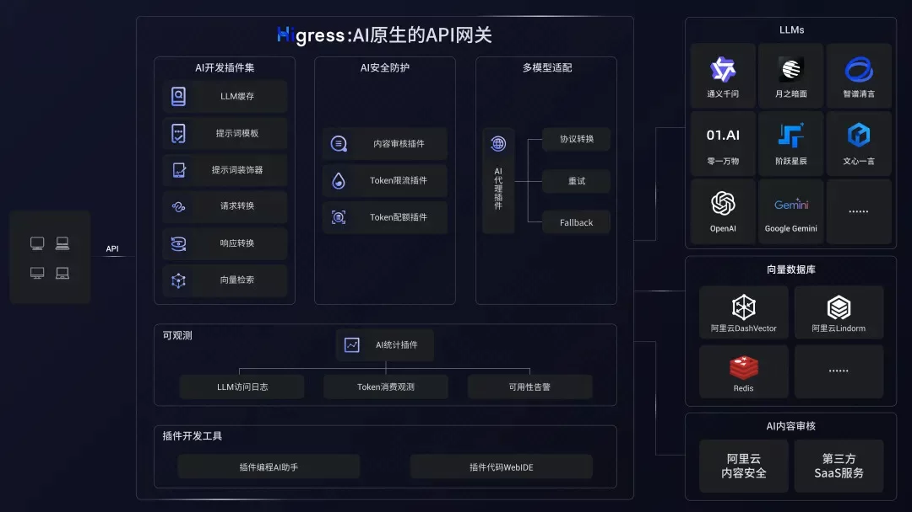

- **MCP Server 托管**:

Higress 作为基于 Envoy 的 API 网关，支持通过插件方式托管 MCP Server。MCP（Model Context Protocol）本质是面向 AI 更友好的 API，使 AI Agent 能够更容易地调用各种工具和服务。Higress 可以统一处理工具调用的认证/鉴权/限流/观测等能力，简化 AI 应用的开发和部署。

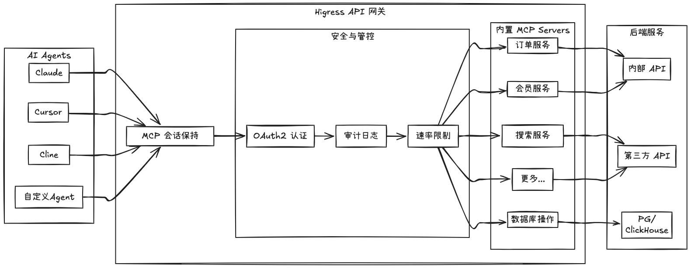

通过 Higress 托管 MCP Server，可以实现：

- 统一的认证和鉴权机制，确保 AI 工具调用的安全性
- 精细化的速率限制，防止滥用和资源耗尽
- 完整的审计日志，记录所有工具调用行为
- 丰富的可观测性，监控工具调用的性能和健康状况
- 简化的部署和管理，通过 Higress 插件机制快速添加新的 MCP Server
- 动态更新无损：得益于 Envoy 对长连接保持的友好支持，以及 Wasm 插件的动态更新机制，MCP Server 逻辑可以实时更新，且对流量完全无损，不会导致任何连接断开

**Kubernetes Ingress 网关**:

Higress 可以作为 K8s 集群的 Ingress 入口网关, 并且兼容了大量 K8s Nginx Ingress 的注解，可以从 K8s Nginx Ingress 快速平滑迁移到 Higress。

支持 [Gateway API](https://gateway-api.sigs.k8s.io/) 标准，支持用户从 Ingress API 平滑迁移到 Gateway API。

相比 ingress-nginx，资源开销大幅下降，路由变更生效速度有十倍提升：

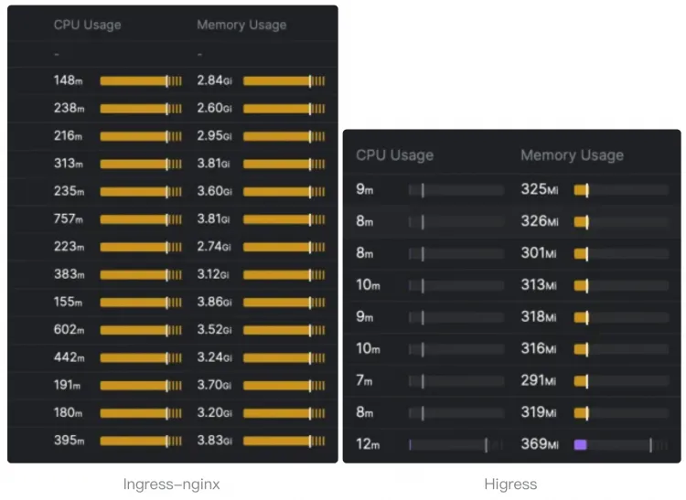

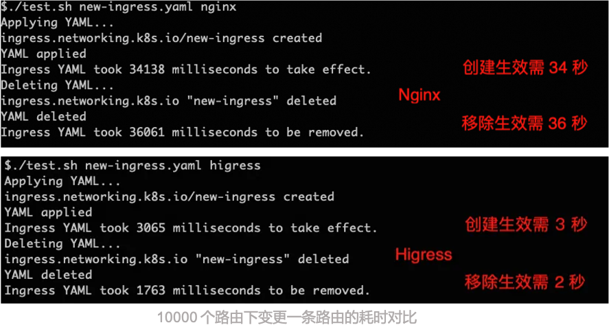

**微服务网关**:

Higress 可以作为微服务网关, 能够对接多种类型的注册中心发现服务配置路由，例如 Nacos, ZooKeeper, Consul, Eureka 等。

并且深度集成了 [Dubbo](https://github.com/apache/dubbo), [Nacos](https://github.com/alibaba/nacos), [Sentinel](https://github.com/alibaba/Sentinel) 等微服务技术栈，基于 Envoy C++ 网关内核的出色性能，相比传统 Java 类微服务网关，可以显著降低资源使用率，减少成本。

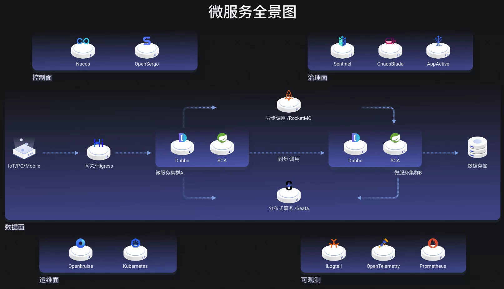

- **安全防护网关**:

  Higress 可以作为安全防护网关， 提供 WAF 的能力，并且支持多种认证鉴权策略，例如 key-auth, hmac-auth, jwt-auth, basic-auth, oidc 等。

### 18.5 核心优势

- **生产等级**

  脱胎于阿里巴巴2年多生产验证的内部产品，支持每秒请求量达数十万级的大规模场景。

  彻底摆脱 Nginx reload 引起的流量抖动，配置变更毫秒级生效且业务无感。对 AI 业务等长连接场景特别友好。

- **流式处理**

  支持真正的完全流式处理请求/响应 Body，Wasm 插件很方便地自定义处理 SSE （Server-Sent Events）等流式协议的报文。

  在 AI 业务等大带宽场景下，可以显著降低内存开销。

- **便于扩展**

  提供丰富的官方插件库，涵盖 AI、流量管理、安全防护等常用功能，满足90%以上的业务场景需求。

  主打 Wasm 插件扩展，通过沙箱隔离确保内存安全，支持多种编程语言，允许插件版本独立升级，实现流量无损热更新网关逻辑。

- **安全易用**

  基于 Ingress API 和 Gateway API 标准，提供开箱即用的 UI 控制台，WAF 防护插件、IP/Cookie CC 防护插件开箱即用。

  支持对接 Let's Encrypt 自动签发和续签免费证书，并且可以脱离 K8s 部署，一行 Docker 命令即可启动，方便个人开发者使用。

## 19 安装「KubeSphere 网络」组件（按需可选组件）

<span style="color:red;font-weight:bold;">订阅授权不支持该功能</span>

这是一个基于 Calico 的 IPPool 和 NetworkPolicy 的 UI 管理界面。它允许用户通过一个友好的用户界面来管理和配置 Calico 的 IPPool 和 NetworkPolicy。

- IPPool 管理：支持创建、更新和删除 IPPools。此外，用户还可以查看每个 IPPool 的详细信息，包括其 CIDR、是否禁用 NAT 等。
- NetworkPolicy 管理：支持创建、更新和删除 NetworkPolicies。此外，用户还可以查看每个 NetworkPolicy 的详细信息，包括其选择器、规则等。

### 19.1 前提条件

- 您需要在 KubeSphere 平台具有 **platform-admin** 角色。

### 19.2 安装

1. 在**扩展中心**页面点击 **KubeSphere 网络**，点击**安装**。
2. 选择最新版本，然后按需修改**扩展组件配置**。
3. 配置完成后，点击**开始安装**按钮，静待安装完成。
4. 在**集群选择**页面，勾选需要安装 Agent 的集群。
5. 在**差异化配置** 页面，按需编辑**集群 Agent 配置**，然后点击**确认**开始安装集群 Agent。

### 19.3 自定义配置

:::code-group

```yaml [组件配置标准环境]
# 无
```

```yaml [组件配置OrbStack环境]
# 无
```

```yaml [集群Agent配置标准环境]
# 无
```

```yaml [集群Agent配置OrbStack环境]
# 无
```

:::

### 19.4 快速开始

安装完成后，可在以下页面使用该扩展组件提供的功能：

- 集群左侧导航栏将显⽰**网络**菜单，可配置网络策略、容器组 IP 池；
- 企业空间左侧导航栏将显⽰**服务网络**菜单，可查看项目网络策略、配置企业空间和项目的网络隔离；
- 创建工作负载或任务时，**高级设置**页签将显示**容器组 IP 池**选项。

### 19.5 网络策略

网络策略用于控制集群中容器组的访问和被访问权限，允许在同个集群内实现网络的隔离。您可以使用网络策略实现以下目的：只允许容器组访问特定的其他容器组或网段；只允许容器组被特定的其他容器组或网段访问。

在集群的**网络策略**菜单下，可创建、查看、编辑网络策略。

网络隔离用于控制企业空间和项目中容器组的出站和入站流量。

### 19.6 容器组 IP 池

容器组 IP 池用于为容器组分配 IP 地址。每个容器组 IP 池包含一个可在集群内部访问的私网 IP 网段。

在集群的**容器组 IP 池**菜单下，可创建、查看、编辑、禁用和启用容器组 IP 池，将容器组 IP 池分配到项目，编辑 Overlay 模式，为容器组 IP 池自动匹配合适的节点等。

创建工作负载或任务时，在**高级设置**页签的**容器组 IP 池**选项，可指定容器组 IP 池。这将为工作负载或任务创建的容器组分配此容器组 IP 池中的 IP 地址。

## 20 安装「KubeSphere 服务网格」组件（按需可选组件）

- 蓝绿部署：创建相同备用环境并运行新应用版本，确保避免宕机或者服务中断。
- 金丝雀发布：缓慢地向一小部分用户推送变更，将版本升级风险降到最低。
- 流量镜像：复制实时生产流量并发送至镜像服务。
- 流量监控：可视化展示各个微服务间的流量情况，支持用户支持配置限流熔断。
- 链路追踪：可视化展示各个微服务间相互的调用关系、跨度与耗时等关键信息。

### 20.1 前提条件

- 您需要在 KubeSphere 平台具有 **platform-admin** 角色。
- 您需要加入一个项目并在项目中具有 **Service Mesh 管理**权限。
- ***WizTelemetry 监控*** (必需)
- ***OpenSearch 分布式检索与分析引擎*** (可选)

### 20.2 安装

1. 在**扩展中心**页面点击 **KubeSphere 服务网格**，点击**安装**。
2. 选择最新版本，然后按需修改**扩展组件配置**。
3. 配置完成后，点击**开始安装**按钮，静待安装完成。
4. 在**集群选择**页面，勾选需要安装 Agent 的集群。
5. 在**差异化配置** 页面，按需编辑**集群 Agent 配置**，然后点击**确认**开始安装集群 Agent。

### 20.3 自定义配置

:::code-group

```yaml [组件配置标准环境]
# 无
```

```yaml [组件配置OrbStack环境]
# 无
```

```yaml [集群Agent配置标准环境]
# 无
```

```yaml [集群Agent配置OrbStack环境]
# 无
```

:::

### 20.4 注意事项

- 需要在配置中配置可用的 Prometheus 服务和 OpenSearch 服务后，方可使用 KubeSphere 服务网格的相关功能。
- 修改 meshConfig 中的 sampling（链路追踪采样率）配置后，新的采样率只应用到新创建的工作负载，修改前已创建的工作负载的采样率将不会随之更新。

| 参数                                                    | 含义                         | 默认值                                                       | 取值  |
| ------------------------------------------------------- | ---------------------------- | ------------------------------------------------------------ | ----- |
| backend.istio.meshConfig.defaultConfig.tracing.sampling | 链路追踪采样率               | 1.0                                                          | 1-100 |
| backend.kiali.prometheus_url                            | promethus 地址               | [http://prometheus-k8s.kubesphere-monitoring-system.svc:9090](http://prometheus-k8s.kubesphere-monitoring-system.svc:9090/) |       |
| backend.jaeger.storage.options.es.server-urls           | OpenSearch/ES 地址           | [https://opensearch-cluster-data.kubesphere-logging-system.svc:9200](https://opensearch-cluster-data.kubesphere-logging-system.svc:9200/) |       |
| backend.jaeger.storage.options.es.username              | OpenSearch/ES 账户名         | admin                                                        |       |
| backend.jaeger.storage.options.es.password              | OpenSearch/ES 密码           | admin                                                        |       |
| backend.jaeger.storage.options.secretName               | OpenSearch/ES 访问 Secret 名 |                                                              |       |

## 21 安装「KubeSphere Spring Cloud」组件（按需可选组件）

- 微服务注册：基于 Nacos 实现。将微服务实例信息注册到服务注册中心，用以动态发现和调用微服务。
- 微服务配置：基于 Nacos 实现，对微服务实例进行动态参数管理，用以动态扩展、负载均衡和故障恢复。
- 微服务网关：基于 Spring Cloud Gateway 实现。微服务架构中的入口，可进行统一访问、安全控制和路由转发。

### 21.1 前提条件

- 您需要在 KubeSphere 平台具有 **platform-admin** 角色。

### 21.2 安装

### 21.3 自定义配置

:::code-group

```yaml [组件配置标准环境]
# 无
```

```yaml [组件配置OrbStack环境]
# 无
```

```yaml [集群Agent配置标准环境]
# 无
```

```yaml [集群Agent配置OrbStack环境]
# 无
```

:::

## 22 安装「Vertical Pod Autoscaler」组件【VPA】（强烈推荐组件）

<span style="color:red;font-weight:bold;">订阅授权不支持该功能</span>

Vertical Pod Autoscaler (VPA) 是 Kubernetes Autoscaler 的组件，可免去用户手动为 Pod 中的容器设置最新资源限制（limits）和请求（requests）的需求。

配置后，该组件会根据使用情况自动设置资源请求量，从而实现 Pod 在节点上的正确调度，确保每个 Pod 获得适当的资源配额。同时会保持容器初始配置中 limits 与 requests 的设定比例。

该组件既可以缩减资源请求过度的 Pod，也能根据历史使用情况扩展资源请求不足的 Pod。

### 22.1  前提条件

- 您需要在 KubeSphere 平台具有 **platform-admin** 角色。
- Vertical Pod Autoscaler 已在 Kubernetes 1.28+ 环境中完成全面验证。为确保功能完备性、性能表现与稳定性，建议在 **最新稳定版 Kubernetes** 上运行。

### 22.2 安装

1. 在**扩展中心**页面点击 **Vertical Pod Autoscaler**，点击**安装**。
2. 选择最新版本，然后按需修改**扩展组件配置**。
3. 配置完成后，点击**开始安装**按钮，静待安装完成。
4. 在**集群选择**页面，勾选需要安装 Agent 的集群。
5. 在**差异化配置** 页面，按需编辑**集群 Agent 配置**，然后点击**确认**开始安装集群 Agent。


安装完成后，企业空间及集群的左侧导航栏将新增 **弹性伸缩 - 容器垂直伸缩**，可用于创建和管理容器垂直伸缩资源。此外，在工作负载详情页面中，也可直接为指定负载创建相关资源。

### 22.3 自定义配置

:::code-group

```yaml [组件配置标准环境]
# 无
```

```yaml [组件配置OrbStack环境]
# 无
```

:::

### 22.4 就地更新 (InPlaceOrRecreate)

> VPA 支持就地更新，以减少应用资源建议时的中断。此功能利用 Kubernetes 的就地更新功能（自 Kubernetes 1.33 起处于 Beta 阶段）来修改容器资源，而无需重新创建 Pod。

该特性要求:

- Kubernetes 1.33+ 且 InPlacePodVerticalScaling 特性开启 (Kubernetes 1.33 及以上版本默认开启)
- VPA 1.4.0+ 且 InPlaceOrRecreate 特性开启 (已通过配置文件默认开启)

如 Kubernetes 版本在 1.28 ~ 1.33 之间且仍需要启用该特性，可在 kube-apiserver 部署参数中增加 `--feature-gates=InPlacePodVerticalScaling=true`

## 23 安装「KEDA for KubeSphere」组件【KEDA】（强烈推荐组件）

<span style="color:red;font-weight:bold;">订阅授权不支持该功能</span>

[KEDA](https://keda.sh/)（Kubernetes Event-driven Autoscaling）是一个基于 Kubernetes 事件驱动自动扩缩的组件，能够为 Kubernetes 中运行的任何容器提供事件驱动的扩缩功能。

KEDA 支持 70+ 种触发器类型，包括消息队列（Kafka、RabbitMQ）、数据库（MySQL、PostgreSQL）、监控系统（Prometheus）、云服务（AWS CloudWatch）等。它特别适用于微服务架构、数据处理管道、Web 应用、批处理任务等场景，能够根据消息队列长度、数据库连接数、自定义指标等外部事件进行智能伸缩，实现真正的按需使用和成本优化。

KEDA for KubeSphere 扩展组件支持在 KubeSphere 平台使用事件驱动伸缩（KEDA）功能。

安装 KEDA for KubeSphere 扩展组件后，集群和企业空间左侧导航栏的**弹性伸缩**菜单下将显⽰**事件驱动伸缩**选项。

### 23.1  前提条件

- 您需要在 KubeSphere 平台具有 **platform-admin** 角色。

### 23.2 安装

1. 通过 **扩展市场** 页面找到 **KEDA for KubeSphere** 扩展组件，点击 **安装**，选择最新版本，点击 **下一步** 按钮；
2. 在 **扩展组件安装** 标签页面中，根据需求点击并修改 **扩展组件配置**，配置完成后，点击 **开始安装** 按钮，开始安装；
3. 安装完成后，点击 **下一步** 按钮，进入集群选择页面，勾选需要安装的集群，点击 **下一步** 按钮，进入 **差异化配置** 页面；
4. 根据需求更新 **差异化配置**，更新完成，开始安装，静待安装完成。

### 23.3 自定义配置

:::code-group

```yaml [组件配置标准环境]
# 无
```

```yaml [组件配置OrbStack环境]
# 无
```

:::

### 23.4 快速开始

安装完成后，企业空间及集群的左侧导航栏将新增 **弹性伸缩 - 事件驱动伸缩**，可用于创建和管理事件驱动伸缩资源。此外，在工作负载详情页面中，也可直接为指定负载创建相关资源。

**示例 1：创建基于 Cron 触发器的事件驱动伸缩资源**

1. 进入某个工作负载的详情页面，点击 **事件驱动伸缩**。
2. 点击 **创建**，填写基础参数后，选择 **Cron 触发器**。
3. 配置开始时间、结束时间、期望副本数等字段，确认后点击 **创建**。

Cron 配置示例如下：

```yaml
triggers:
  - metadata:
      desiredReplicas: '2'
      start: 0 6 * * *
      end: 0 20 * * *
      timezone: Asia/Shanghai
    type: cron
```

> 此配置表示每天 **06:00–20:00** 之间，工作负载期望副本数固定为 **2**。 其中 `start` 与 `end` 字段均使用标准 Cron 表达式。

创建完成后，可在 **事件驱动伸缩** 列表中查看资源状态，并进行编辑或删除。

**示例 2：创建基于 Prometheus 触发器的事件驱动伸缩资源**

1. 进入某个工作负载的详情页面，点击 **事件驱动伸缩**。
2. 选择 **Prometheus 触发器**，填写 Prometheus 地址、查询表达式、阈值等内容。
3. 点击 **创建** 完成配置。

示例如下：

```yaml
triggers:
  - metadata:
      query: sum(rate(http_requests_total{deployment="my-deployment"}[2m]))
      serverAddress: http://prometheus-k8s.kubesphere-monitoring-system.svc:9090
      threshold: "50"
    type: prometheus
```

> 当 `my-deployment` 的 HTTP 请求速率超过 **50 QPS** 时，会触发扩缩容操作。
> 注意: 查询表达式 **必须返回单元素向量/标量**。

同样，可在列表页面查看资源状态，并进行编辑或删除操作。

## 24 安装「cert-manager」组件（必备基础组件）<span style="color:#32CD32;font-weight:bold;">已安装</span>

cert-manager 可以为您集群中的 workload 自动创建和更新证书

cert-manager 为 Kubernetes 中的工作负载创建 TLS 证书，并在证书过期前续订。

cert-manager 可以从各种证书颁发机构获取证书，包括：Let’s Encrypt、HashiCorp Vault、Venafi 和私有 PKI。

### 24.1  前提条件

- 您需要在 KubeSphere 平台具有 **platform-admin** 角色。

### 24.2 安装

1. 通过 **扩展市场** 页面找到 **cert-manager** 扩展组件，点击 **安装**，选择最新版本，点击 **下一步** 按钮；
2. 在 **扩展组件安装** 标签页面中，根据需求点击并修改 **扩展组件配置**，配置完成后，点击 **开始安装** 按钮，静待安装完成。

### 24.3 自定义配置

:::code-group

```yaml [组件配置标准环境]
# 无
```

```yaml [组件配置OrbStack环境]
# 无
```

:::

### 23.4 生成默认的 ClusterIssuer

开启后会在安装时生成 ClusterIssuer, 名为 `default-issuer`。 默认的 ClusterIssuer 可用来给其他组件颁发证书。例如，使用 `KubeSphere 网关` 时，可为路由自动生成和更新证书。

安装时，在 **扩展组件安装** 标签页中， 点击 **扩展组件配置**，修改 `operator` 下 `defaultIssuer` 字段的值。

1. 生成自签名的证书

```yaml
# DefaultIssuer create a default ClusterIssuer
  defaultIssuer:

    selfSigned:
      enabled: true

    CA:
      enabled: false
      data:
        tlsCrt:
        tlsKey:
```

默认会生成自签名证书的 ClusterIssuer，无需修改配置。

1. 导入 CA 证书

```yaml
# DefaultIssuer create a default ClusterIssuer
  defaultIssuer:

    selfSigned:
      enabled: false

    CA:
      enabled: true
      data:
        tlsCrt: LS0tLS1CRUdJTiBDRVJUSUZJQ0FURS0tLS0tCk1JSUMrVENDQWVHZ0F3SUJBZ0lKQUtQR3dLRGwvNUhuTUEwR0NTcUdTSWIzRFFFQkN3VUFNQk14RVRBUEJnTlYKQkFNTUNHcHZjMmgyWVc1c01CNFhEVEU1TURneU1qRTJNRFUxT0ZvWERUSTVNRGd4T1RFMk1EVTFPRm93RXpFUgpNQThHQTFVRUF3d0lhbTl6YUhaaGJtd3dnZ0VpTUEwR0NTcUdTSWIzRFFFQkFRVUFBNElCRHdBd2dnRUtBb0lCCkFRQ3doU0IvcVc2L2tMYjJ6cHUrRUp2RDl3SEZhcStRQS8wSkgvTGxseW83ekFGeCtISHErQ09BYmsrQzhCNHQKL0hVRXNuczVSTDA5Q1orWDRqNnBiSkZkS2R1UHhYdTVaVllua3hZcFVEVTd5ZzdPU0tTWnpUbklaNzIzc01zMApSNmpZbi9Ecmo0eFhNSkVmSFVEcVllU1dsWnIzcWkxRUZhMGM3ZlZEeEgrNHh0WnROTkZPakg3YzZEL3ZXa0lnCldRVXhpd3Vzc2U2S01PV2pEbnYvNFZyamVsMlFnVVlVYkhDeWVaSG1jdGkrSzBMV0Nmby9SZzZQdWx3cmJEa2gKam1PZ1l0MzBwZGhYME9aa0F1a2xmVURIZnA4YmpiQ29JMnRhWUFCQTZBS2pLc08zNUxBRVU3OUNMMW1MVkh1WgpBQ0k1VWppamEzVlBXVkhTd21KUEp5dXhBZ01CQUFHalVEQk9NQjBHQTFVZERnUVdCQlFtbDVkVEFaaXhGS2hqCjkzd3VjUldoYW8vdFFqQWZCZ05WSFNNRUdEQVdnQlFtbDVkVEFaaXhGS2hqOTN3dWNSV2hhby90UWpBTUJnTlYKSFJNRUJUQURBUUgvTUEwR0NTcUdTSWIzRFFFQkN3VUFBNElCQVFCK2tsa1JOSlVLQkxYOHlZa3l1VTJSSGNCdgpHaG1tRGpKSXNPSkhac29ZWGRMbEcxcFpORmpqUGFPTDh2aDQ0Vmw5OFJoRVpCSHNMVDFLTWJwMXN1NkNxajByClVHMWtwUkJlZitJT01UNE1VN3ZSSUNpN1VPbFJMcDFXcDBGOGxhM2hQT2NSYjJ5T2ZGcVhYeVpXWGY0dDBCNDUKdEhpK1pDTkhCOUZ4alNSeWNiR1lWaytUS3B2aEphU1lOTUdKM2R4REthUDcrRHgzWGNLNnNBbklBa2h5SThhagpOVSttdzgvdG1Sa1A0SW4va1hBUitSaTBxVW1Iai92d3ZuazRLbTdaVXkxRllIOERNZVM1TmtzbisvdUhsUnhSClY3RG5uMDM5VFJtZ0tiQXFONzJnS05MbzVjWit5L1lxREFZSFlybjk4U1FUOUpEZ3RJL0svQVRwVzhkWAotLS0tLUVORCBDRVJUSUZJQ0FURS0tLS0tCg==
        tlsKey: LS0tLS1CRUdJTiBSU0EgUFJJVkFURSBLRVktLS0tLQpNSUlFb3dJQkFBS0NBUUVBc0lVZ2Y2bHV2NUMyOXM2YnZoQ2J3L2NCeFdxdmtBUDlDUi95NVpjcU84d0JjZmh4CjZ2Z2pnRzVQZ3ZBZUxmeDFCTEo3T1VTOVBRbWZsK0krcVd5UlhTbmJqOFY3dVdWV0o1TVdLVkExTzhvT3praWsKbWMwNXlHZTl0N0RMTkVlbzJKL3c2NCtNVnpDUkh4MUE2bUhrbHBXYTk2b3RSQld0SE8zMVE4Ui91TWJXYlRUUgpUb3grM09nLzcxcENJRmtGTVlzTHJMSHVpakRsb3c1Ny8rRmE0M3Bka0lGR0ZHeHdzbm1SNW5MWXZpdEMxZ242ClAwWU9qN3BjSzJ3NUlZNWpvR0xkOUtYWVY5RG1aQUxwSlgxQXgzNmZHNDJ3cUNOcldtQUFRT2dDb3lyRHQrU3cKQkZPL1FpOVppMVI3bVFBaU9WSTRvMnQxVDFsUjBzSmlUeWNyc1FJREFRQUJBb0lCQUNFTkhET3JGdGg1a1RpUApJT3dxa2UvVVhSbUl5MHlNNHFFRndXWXBzcmUxa0FPMkFDWjl4YS96ZDZITnNlanNYMEM4NW9PbmtrTk9mUHBrClcxVS94Y3dLM1ZpRElwSnBIZ09VNzg1V2ZWRXZtU3dZdi9Fb1V3eHFHRVMvcnB5Z1drWU5WSC9XeGZGQlg3clMKc0dmeVltbXJvM09DQXEyLzNVVVFiUjcrT09md3kzSHdUdTBRdW5FSnBFbWU2RXdzdWIwZzhTTGp2cEpjSHZTbQpPQlNKSXJyL1RjcFRITjVPc1h1Vm5FTlVqV3BBUmRQT1NrRFZHbWtCbnkyaVZURElST3NGbmV1RUZ1NitXOWpqCmhlb1hNN2czbkE0NmlLenUzR0YwRWhLOFkzWjRmeE42NERkbWNBWnphaU1vMFJVaktWTFVqbVlQSEUxWWZVK3AKMkNYb3dNRUNnWUVBMTgyaU52UEkwVVlWaUh5blhKclNzd1YrcTlTRStvVi90U2ZSUUNGU2xsV0d3KzYyblRiVwpvNXpoL1RDQW9VTVNSbUFPZ0xKWU1LZUZ1SWdvTEoxN1pvWjN0U1czTlVtMmRpT0lPSHorcTQxQzM5MDRrUzM5CjkrYkFtVmtaSFA5VktLOEMraS9tek5mSkdHZEJadGIweWtTM2t3OUIxTHdnT3o3MDhFeXFSQ2tDZ1lFQTBXWlAKbzF2MThnV2tMK2FnUDFvOE13eDRPZlpTN3dKY3E0Z0xnUWhjYS9pSkttY0x0RFN4cUJHckJ4UVo0WTIyazlzdQpzTFVrNEJobGlVM29iUUJNaUdtMGtITHVBSEFRNmJvdWZBMUJwZjN2VFdHSkhSRjRMeFJsNzc2akw4UXI4VnpxClpURVBtY0R0T0hpYjdwb2I1Z2IzSDhiVGhYeUhmdGZxRW55alhFa0NnWUVBdk9DdDZZclZhTlQrWThjMmRFYk4Kd3dJOExBaUZtdjdkRjZFUjlCODJPWDRCeGR0WTJhRDFtNTNqN2NaVnpzNzFYOE1TN25FcDN1dkFqaElkbDI3KwpZbTJ1dUUyYVhIbDN5VTZ3RzBETFpUcnVIU0Z5TVI4ZithbHRTTXBDd0s1NXluSGpHVFp6dXpYaVBBbWpwRzdmCk1XbVRncE1IK3puc3UrNE9VNFBHUW9FQ2dZQWNqdUdKbS84YzlOd0JsR2lDZTJIK2JGTHhSTURteStHcm16QkcKZHNkMENqOWF3eGI3aXJ3MytjRGpoRUJMWExKcjA5YTRUdHdxbStrdElxenlRTG92V0l0QnNBcjVrRThlTVVBcAp0djBmRUZUVXJ0cXVWaldYNWlaSTNpMFBWS2ZSa1NSK2pJUmVLY3V3aWZKcVJpWkw1dU5KT0NxYzUvRHF3Yk93CnRjTHAwUUtCZ0VwdEw1SU10Sk5EQnBXbllmN0F5QVBhc0RWRE9aTEhNUGRpL2dvNitjSmdpUmtMYWt3eUpjV3IKU25QSG1TbFE0aEluNGMrNW1lbHBDWFdJaklLRCtjcTlxT2xmQmRtaWtYb2RVQ2pqWUJjNnVGQ1QrNWRkMWM4RwpiUkJQOUNtWk9GL0hOcHN0MEgxenhNd1crUHk5Q2VnR3hhZ0ZCekxzVW84N0xWR2h0VFFZCi0tLS0tRU5EIFJTQSBQUklWQVRFIEtFWS0tLS0tCg==
```

将 `selfSigned.enabled` 参数改为 false，`CA.enabled` 改为 true。并将准备好的 tls.crt 和 tls.key 使用 base64 编码后， 填入 `CA.data.tlsCrt` 和 `CA.data.tlsKey` 字段中。

### 24.5 在 ingress 中使用默认的 Issuer 签发证书

```yaml
apiVersion: networking.k8s.io/v1
kind: Ingress
metadata:
  namespace: my-ns
  annotations:
    # 指定要默认的 Issuer
    cert-manager.io/cluster-issuer: default-issuer
  name: podinfo
spec:
  rules:
    - protocol: https
      host: podinfo.example.com
      http:
        paths:
          - path: /
            backend:
              service:
                name: frontend-podinfo
                port:
                  number: 9898
            pathType: ImplementationSpecific
  tls:
    - hosts:
      - podinfo.example.com
      # 指定secret名称，将会在以这个名称存储证书到secret
      secretName: podinfo-cert
```

## 51 [登录 Jenkins 仪表板](https://docs.kubesphere.com.cn/v4.2.1/11-use-extensions/02-devops/03-pipelines/07-access-jenkins-console/)

安装 DevOps 时，默认情况下也会安装 Jenkins 仪表板。

### 51.1 前提条件

KubeSphere 平台需要安装并启用 **DevOps** 扩展组件。

### 51.2 操作步骤

1. 查看 jenkins 仪表盘对应的服务，然后参阅[如何访问服务](https://docs.kubesphere.com.cn/v4.2.1/02-quickstart/08-access-a-service/)，访问 Jenkins 仪表板。

```bash
$ kubectl -n kubesphere-devops-system get svc devops-jenkins
```

```bash
NAME             TYPE       CLUSTER-IP     EXTERNAL-IP   PORT(S)        AGE
devops-jenkins   NodePort   10.233.34.54   <none>        80:30180/TCP   5d16h
```

2. 获取 jenkins 管理员的用户名和密码。

```bash
$ kubectl -n kubesphere-devops-system get secret devops-jenkins -o yaml
```

输出示例：

```yml
......
data:
  jenkins-admin-password: aGtIRU9vd1JFVzZjS0h5VTZVYTRaUg==
  jenkins-admin-token: MTE0NTQzMTYxNzkwMzY5NDE4MDg5MjM0NjI5NTgyMDA0OA==
  jenkins-admin-user: YWRtaW4=
......
```

将 `jenkins-admin-user` 和 `jenkins-admin-password` 对应的内容 base64 解码后，即得到 jenkins 管理员的用户名和密码。

比如，这里是： admin / hkHEOowREW6cKHyU6Ua4ZR

3. 使用获取的用户名和密码，登录 Jenkins 仪表板。

:::tip

若想以 LDAP 或 OpenId Connect 的方式登录 jenkins 仪表板，请参阅扩展中心 DevOps 扩展组件的详情页说明。

:::

- 执行以下命令获取 Jenkins 的地址。

```bash
export NODE_PORT=$(kubectl get svc --namespace kubesphere-devops-system -o jsonpath="{.spec.ports[0].nodePort}" devops-jenkins)
export NODE_IP=$(kubectl get no --namespace kubesphere-devops-system -o jsonpath="{.items[0].status.addresses[0].address}")
echo http://$NODE_IP:$NODE_PORT
```

输出：

http://192.168.200.116:30180

<span style="color:red;font-weight:bold;">访问时，未登录KubeSphere会被拦截并调整到KubeSphere的登录界面，登录后自动进入Jenkins页面</span>

## 99 扩展组件登录信息

| 登录地址                      | 描述                 | 用户名                 | 密码     | 原密码   |
| ----------------------------- | -------------------- | ---------------------- | -------- | -------- |
| http://192.168.200.116:30880  | KubeSphere           | admin                  | P@88word | P@88w0rd |
| https://192.168.200.116:30920 | OpenSearch           | admin                  | admin    | admin    |
| http://192.168.200.116:31323  | OpenSearch Dashboard | admin                  | admin    | admin    |
| http://192.168.200.116:32000  | Grafana              | admin                  | P@88word | admin    |
| http://192.168.200.116:30180  | Jenkins              | 伴随ks-console单点登录 |          |          |

