# 第3章 KubeSphere扩展服务安装

## 1 安装OpenELB负载均衡器

OpenELB 是一个开源的云原生负载均衡器实现，可以在基于裸金属服务器、边缘以及虚拟化的 Kubernetes 环境中使用 LoadBalancer 类型的 Service 对外暴露服务。

OpenELB安装：https://github.com/openelb/openelb/blob/master/README_zh.md

[openelb最新版官网文档](https://openelb.io/docs/getting-started/)

### 1.0 为什么选择 OpenELB

在云服务环境中的 Kubernetes 集群里，通常可以用云服务提供商提供的负载均衡服务来暴露 Service，但是在本地没办法这样操作。而 OpenELB 可以让用户在裸金属服务器、边缘以及虚拟化环境中创建 LoadBalancer 类型的 Service 来暴露服务，并且可以做到和云环境中的用户体验是一致的。

- 核心功能

  - BGP 模式和二层网络模式下的负载均衡

  - ECMP 路由和负载均衡

  - IP 池管理

  - 基于 CRD 来管理 BGP 配置

  - 支持 Helm Chart 方式安装

- 网络协议支持

  | 协议类型   | 适用场景                 | 工作原理                      |                                                          |
  | :--------- | :----------------------- | :---------------------------- | -------------------------------------------------------- |
  | **Layer2** | 同子网环境               | 通过 ARP(IPv4)/NDP(IPv6) 响应 | 简单易用，适合小型环境，<br />但有单点瓶颈（10节点以下） |
  | **BGP**    | 跨路由器环境             | 通过 BGP 协议广播路由         | 专业级解决方案，适合生产环境，<br />需要网络设备支持     |
  | **VIP**    | 需要虚拟 IP 的高可用场景 | 配合 Keepalived 实现          |                                                          |


- 核心工作流程


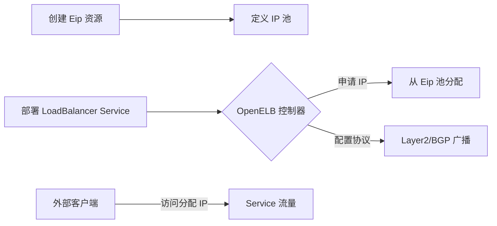
```mermaid
graph LR
A[创建 Eip 资源] --> B[定义 IP 池]
C[部署 LoadBalancer Service] --> D{OpenELB 控制器}
D -->|申请 IP| E[从 Eip 池分配]
D -->|配置协议| F[Layer2/BGP 广播]
G[外部客户端] -->|访问分配 IP| H[Service 流量]
```

- 绑定方式对比

  [官网OpenELP IP 地址分配](https://openelb.io/docs/getting-started/usage/openelb-ip-address-assignment/#there-is-a-default-eip-in-the-cluster)

  | 特性            | 自动分配          | 指定 Eip 池     | 静态 IP 绑定         |
  | :-------------- | :---------------- | :-------------- | :------------------- |
  | **IP 确定性**   | 随机分配          | 池内随机        | 固定 IP              |
  | **配置复杂度**  | 最简单（1个注解） | 中等（2个注解） | 最复杂（显式声明IP） |
  | **跨命名空间**  | 需 Eip 授权       | 需 Eip 授权     | 需 Eip 授权          |
  | **IP 冲突风险** | 低（自动管理）    | 低（自动管理）  | 高（需人工保障）     |
  | **适用场景**    | 测试环境          | 多团队生产环境  | 关键基础设施         |

  - 指定Eip池分配

  为服务添加注解，指定 OpenELB 作为负载均衡插件，并确保指定的 EIP 存在，无需检查是否分配给了命名空间。

  ```yaml
  apiVersion: network.kubesphere.io/v1alpha2
  kind: Eip
  metadata:
    name: layer2-eip # 定义elp资源
  spec:
    address: 172.31.73.130-172.31.73.132
    namespaces: 
    - project
    interface: eth0
    protocol: layer2
  
  ---
  kind: Service
  apiVersion: v1
  metadata:
    name: nginx
    namespace: project-test
    annotations:
      lb.kubesphere.io/v1alpha1: openelb # 指定 OpenELB 作为负载均衡插件
      eip.openelb.kubesphere.io/v1alpha2: layer2-eip # 指定elp资源
  spec:
    selector:
      app: nginx
    type: LoadBalancer
    ports:
      - name: http
        port: 80
        targetPort: 80
    externalTrafficPolicy: Cluster
  ```

  - 指定静态IP分配

  为服务添加注解，指定 OpenELB 作为负载均衡插件，并确保指定的 IP 在现有 EIP 的 CIDR 范围内，无需检查 EIP 是否分配给了命名空间。

  如果指定的 IP 已经分配，将会共享。

  ```yaml
  apiVersion: network.kubesphere.io/v1alpha2
  kind: Eip
  metadata:
    name: layer2-eip
  spec:
    address: 172.31.73.130-172.31.73.132 # 定义elp资源的ip范围
    namespaces: 
    - project
    interface: eth0
    protocol: layer2
  
  ---
  kind: Service
  apiVersion: v1
  metadata:
    name: nginx
    namespace: project-test
    annotations:
      lb.kubesphere.io/v1alpha1: openelb # 指定 OpenELB 作为负载均衡插件
      eip.openelb.kubesphere.io/v1alpha1: "192.168.1.10" # 指定一个在elp资源ip范围内的一个ip
  spec:
    selector:
      app: nginx
    type: LoadBalancer
    ports:
      - name: http
        port: 80
        targetPort: 80
    externalTrafficPolicy: Cluster
  
  
  # You can also set spec.loadBalancerIP to the specified ip. This method is recommended.
  ---
  kind: Service
  apiVersion: v1
  metadata:
    name: nginx1
    namespace: project-test
    annotations:
      lb.kubesphere.io/v1alpha1: openelb
  spec:
    loadBalancerIP: 192.168.1.10
    selector:
      app: nginx
    type: LoadBalancer
    ports:
      - name: http
        port: 80
        targetPort: 80
    externalTrafficPolicy: Cluster
  ```

  - 自动分配

    - 自动分配（没有默认elp）

    当您仅在注解中配置 `openelb` 而未指定 `eip` 和 `ip` 时，将进入自动分配。OpenELB 首先会找到一个合适的 eip，然后选择一个合适的 ip 完成分配。

    向 Service 添加注解，指定 OpenELB 作为负载均衡插件，并<span style="color:red;font-weight:bold;">确保命名空间分配给可用的 Eips</span>。

    ```yaml
    apiVersion: network.kubesphere.io/v1alpha2
    kind: Eip
    metadata:
      name: layer2-eip
    spec:
      address: 172.31.73.130-172.31.73.132
      namespaces: 
      - project
      interface: eth0
      protocol: layer2
    
    ---
    kind: Service
    apiVersion: v1
    metadata:
      name: nginx
      namespace: project
      annotations:
        lb.kubesphere.io/v1alpha1: openelb
    spec:
      selector:
        app: nginx
      type: LoadBalancer
      ports:
        - name: http
          port: 80
          targetPort: 80
      externalTrafficPolicy: Cluster
    ```

    :::info
  
    自动分配期间的 eip 选择策略：
  
    - 根据 `eip.namespace` 和 `eip.namespaceSelector` 预选可用的 Eips。
    - 按优先级对预选的 Eips 进行排序，并选择优先级最高的 Eip。
    - 如果没有预选 Eips，则使用默认 Eip。
    - 如果没有可用的 Eips，则分配失败并等待合适的 Eip。
    - 分配失败并等待 IP 释放，如果所有可用的 Eips 都已完全分配。
  
    :::
  
    - 自动分配（集群中有一个默认的 EIP）
  
      这里有一个如图所示的示例：
  
      - 使用注解 `"eip.openelb.kubesphere.io/is-default-eip": "true"` 将 `default-eip` 设置为默认的 EIP。
      - 命名空间 `namespace-1` 和 `namespace-2` 具有标签 `label: test` ，该标签被 `eip-selector` 的 `namespaceSelector` 用于匹配和选择。
      - `eip-ns` 的 Eip 有一个 namespaces 字段，它指定了 `namespace-1` 。这使得 `eip-ns` 能够匹配并被分配给 `namespace-1` 。
      - `eip` 弹性公网 IP 没有任何特殊配置。它只能用于指定分配，不能自动分配。
  
    ```yaml
    ```
  
    
  
    | Namespace 命名空间 | Available Eip Count 可用 Eip 数量 |
    | ------------------ | --------------------------------- |
    | `namespace-1`      | 3                                 |
    | `namespace-2`      | 2                                 |
    | `namespace-3`      | 1                                 |
  
    :::info
  
    当可用 Eip 数量大于 1 时，将根据优先级选择最终的 Eip。
  
    - 命名空间绑定的 Eip 优先级高于默认 Eip。
    - 对于多个命名空间绑定的 Eip，将根据优先级字段确定优先级。优先级值越低，优先级越高。
  
    :::

### 1.1 使用kubectl安装和卸载OpenELB（v0.6.0）

#### 0 前置条件

你需要准备一个 Kubernetes 集群，并确保 Kubernetes 版本为 1.15 或更高版本。OpenELB 需要 CustomResourceDefinition (CRD) v1，而 Kubernetes 1.15 或更高版本才支持 CRD v1。

#### 1 下载并安装

```bash
$ cd /k8s_soft
$ wget https://raw.githubusercontent.com/openelb/openelb/release-0.6/deploy/openelb.yaml
$ kubectl apply -f openelb.yaml
```

#### 2 查看安装结果

```bash
$ kubectl get po -n openelb-system
```

#### 3 卸载

```bash
$ kubectl delete -f openelb.yaml
```

### 1.2 使用helm安装【推荐】

#### 1 配置helm仓库并安装

```bash
$ helm repo add openelb https://openelb.github.io/openelb
$ helm repo update
$ helm install openelb openelb/openelb -n openelb-system --create-namespace
```

> 若添加repo时网络不通，设置代理：
>
> ```bash
> $ export https_proxy=http://192.168.200.1:7890 http_proxy=http://192.168.200.1:7890 all_proxy=socks5://192.168.200.1:7890 no_proxy="xxx"
> ```

#### 2 查看安装结果

```bash
$ kubectl get po -n openelb-system
```

#### 3 卸载

```bash
$ helm delete openelb -n openelb-system
```

### 1.3 在 Layer 2 模式下使用 OpenELB

#### 1.3.0 前置条件

- 您需要准备一个已安装 OpenELB 的 Kubernetes 集群。所有 Kubernetes 集群节点必须在同一个 Layer 2 网络（同一路由器下）。
- 您需要准备一台客户端机器，用于验证 OpenELB 在 Layer 2 模式下的功能是否正常。客户端机器需要与 Kubernetes 集群节点位于同一网络。
- Layer 2 模式需要您的基础设施环境允许匿名 ARP/NDP 数据包。如果 OpenELB 在基于云的 Kubernetes 集群中进行测试安装，您需要向您的云供应商确认是否允许匿名 ARP/NDP 数据包。如果不允许，则无法使用 Layer 2 模式。

- <span style="color:red;font-weight:bold;">为OpenELB指定NIC网络接口卡（Network Interface Card）</span>

  如果OpenELB的安装节点有多个网卡（比如：eth0,eth1等），需要指定OpenELB在Layer 2模式下使用哪一个网卡。如果节点只有1个网卡，就不需要指定了。

  - **按需给节点添加注解**

  ```bash
  # 只给有多接口的节点添加注解："当此节点被选为 EIP 的 ARP 响应节点时，请使用 `192.168.200.116` 对应的接口"
  $ kubectl annotate nodes emon layer2.openelb.kubesphere.io/v1alpha1="192.168.200.116"
  ```

  > 查看是否存在多个网络适配器：
  >
  > ```bash
  > $ ip -o link show | awk '{print $2}' | cut -d':' -f1 | grep -Ev "lo|cali"
  > ```

  - **验证注解添加情况**

  ```bash
  $ kubectl describe node emon | grep openelb.kubesphere.io
  ```

  - **删除无用注解**（如果需要）：

  ```bash
  $ kubectl annotate node emon layer2.openelb.kubesphere.io/v1alpha1-
  ```

  - **影响选举行为**：

  ```mermaid
  graph TD
      A[EIP 192.168.200.91] --> B{选举 ARP 响应节点}
      B --> C[已注解节点]
      B --> D[未注解节点]
      C -->|优先选择| E[使用指定 IP 的接口]
      D -->|自动选择| F[同子网的第一个接口]
  ```

  

#### 1.3.1 第一步：确保已启用 Layer 2 模式

Layer 2 模式可以通过命令行参数启用或禁用。在使用 Layer 2 模式时，请确保 Layer 2 发言人已正确启用。

运行以下命令以编辑 openelb-speaker DaemonSet

```bash
$ kubectl edit ds -n openelb-system openelb-speaker
```

将 `enable-layer2` 设置为 `true` 并保存更改。openelb-speaker 将自动重启。

```yaml
    spec:
      containers:
      - args:
        - --api-hosts=:50051
        - --enable-keepalived-vip=false
        - --enable-layer2=true
        command:
        - openelb-speaker
```

#### 1.3.2 第二步：为 kube-proxy 启用 strictARP

在 Layer 2 模式下，您需要为 kube-proxy 启用 strictARP，以便 Kubernetes 集群中的所有网络接口卡停止应答来自其他网络接口卡的 ARP 请求，并由 OpenELB 处理 ARP 请求。

1. 登录到 Kubernetes 集群并运行以下命令编辑 kube-proxy ConfigMap：

```bash
$ kubectl edit configmap kube-proxy -n kube-system
```

2. 在 kube-proxy ConfigMap 的 YAML 配置中，将 `data.config.conf.ipvs.strictARP` 设置为 `true` 。

```yaml
ipvs:
  strictARP: true
```

3. 运行以下命令重启 kube-proxy：

```bash
$ kubectl rollout restart daemonset kube-proxy -n kube-system
```

#### 1.3.3 第三步：创建 Eip 对象

Eip 对象作为 OpenELB 的 IP 地址池使用。

1. 运行以下命令创建 Eip 对象的 YAML 文件：

```bash
$ vim layer2-eip.yaml
```

2. 将以下信息添加到 YAML 文件中：

```yaml
apiVersion: network.kubesphere.io/v1alpha2
kind: Eip
metadata:
  name: layer2-eip
spec:
  address: 192.168.200.91-192.168.200.100
  interface: ens160
  protocol: layer2
```

:::info

`spec:address` 中指定的 IP 地址必须与 Kubernetes 集群节点位于同一网络段。

有关 Eip YAML 配置中字段的详细信息，请参阅[使用 Eip 配置 IP 地址池](https://openelb.io/docs/getting-started/configuration/configure-ip-address-pools-using-eip/)。

:::

3. 运行以下命令创建 Eip 对象：

```bash
$ kubectl apply -f layer2-eip.yaml
```

#### 1.3.4 第四步：创建部署

以下使用 nginx 镜像创建一个包含两个 Pod 的 Deployment。每个 Pod 都会将其自己的 Pod 名称返回给外部请求。

1. 运行以下命令创建 Deployment 的 YAML 文件：

```bash
$ vim layer2-openelb.yaml
```

2. 将以下信息添加到 YAML 文件中：

```yaml
apiVersion: apps/v1
kind: Deployment
metadata:
  name: layer2-openelb
spec:
  replicas: 2
  selector:
    matchLabels:
      app: layer2-openelb
  template:
    metadata:
      labels:
        app: layer2-openelb
    spec:
      containers:
        - image: nginx:1.25.4
          name: nginx
          ports:
            - containerPort: 80
```

3. 运行以下命令创建 Deployment：

```bash
$ kubectl apply -f layer2-openelb.yaml
```

#### 1.3.5 第五步：创建服务

1. 运行以下命令为服务创建一个 YAML 文件：

```bash
$ vim layer2-svc.yaml
```

2. 将以下信息添加到 YAML 文件中：

```yaml
kind: Service
apiVersion: v1
metadata:
  name: layer2-svc
  annotations:
    lb.kubesphere.io/v1alpha1: openelb
    # For versions below 0.6.0, you also need to specify the protocol
    # protocol.openelb.kubesphere.io/v1alpha1: layer2
    eip.openelb.kubesphere.io/v1alpha2: layer2-eip
spec:
  selector:
    app: layer2-openelb
  type: LoadBalancer
  ports:
    - name: http
      port: 80
      targetPort: 80
  externalTrafficPolicy: Cluster
```

:::warning

- 你必须将 `spec:type` 设置为 `LoadBalancer` 。
- `lb.kubesphere.io/v1alpha1: openelb` 注释指定该服务使用 OpenELB。
- `protocol.openelb.kubesphere.io/v1alpha1: layer2` 注释指定 OpenELB 使用 Layer 2 模式。自 0.6.0 版本起已弃用。
- `eip.openelb.kubesphere.io/v1alpha2: layer2-eip` 注释指定 OpenELB 使用的 Eip 对象。如果未配置此注释，OpenELB 会自动选择一个可用的 Eip 对象。或者，您可以移除此注释并使用 `spec:loadBalancerIP` 字段（例如， `spec:loadBalancerIP: 192.168.200.91` ）或添加注释 `eip.openelb.kubesphere.io/v1alpha1: 192.168.200.91` 为服务分配特定的 IP 地址。当您将多个服务的 `spec:loadBalancerIP` 设置为相同的值以进行 IP 地址共享（这些服务通过不同的服务端口区分）时，在这种情况下，您必须将 `spec:ports:port` 设置为不同的值并将 `spec:externalTrafficPolicy` 设置为 `Cluster` 。有关 IPAM 的更多详细信息，请参阅 openelb ip address assignment。
- 如果 `spec:externalTrafficPolicy` 设置为 `Cluster` （默认值），OpenELB 会从所有 Kubernetes 集群节点中随机选择一个节点来处理 Service 请求。<span style="color:#9400D3;font-weight:bold;">其他节点上的 Pod 也可以通过 kube-proxy 访问</span>。
- 如果 `spec:externalTrafficPolicy` 设置为 `Local` ，OpenELB 会随机选择 Kubernetes 集群中包含 Pod 的节点来处理 Service 请求。<span style="color:#9400D3;font-weight:bold;">只有选中节点上的 Pod 才能被访问</span>。

:::

3. 运行以下命令创建服务：

```bash
$ kubectl apply -f layer2-svc.yaml
```

#### 1.3.6 第六步：验证 OpenELB 在 Layer 2 模式下的功能

以下验证 OpenELB 是否正常运行。

1. 在 Kubernetes 集群中，运行以下命令以确认容器组、部署都已成功，并获取服务的外部 IP 地址：

```bash
$ kubectl get deploy,po,svc
NAME                             READY   UP-TO-DATE   AVAILABLE   AGE
deployment.apps/layer2-openelb   2/2     2            2           168m

NAME                                 READY   STATUS    RESTARTS   AGE
pod/layer2-openelb-c689cf6cd-8vkhl   1/1     Running   0          7m46s
pod/layer2-openelb-c689cf6cd-gqw6n   1/1     Running   0          7m35s

NAME                 TYPE           CLUSTER-IP     EXTERNAL-IP      PORT(S)        AGE
service/kubernetes   ClusterIP      10.233.0.1     <none>           443/TCP        6d
service/layer2-svc   LoadBalancer   10.233.18.27   192.168.200.91   80:30996/TCP   147m
```

2. 在 Kubernetes 集群中，运行以下命令以获取集群节点的 IP 地址：

```bash
$ kubectl get nodes -o wide
```

3. 在 Kubernetes 集群中，运行以下命令以检查 Pod 的节点：

```bash
$ kubectl get pod -o wide
```

> 在这个示例中，Pods 会自动分配到不同的节点。你可以手动将 Pods 分配到不同的节点。

4. 在客户端机器（<span style="color:blue;font-weight:bold;">同一网段机器，非集群节点</span>）上，运行以下命令来 ping 服务 IP 地址并检查 IP 邻居：

- 通过 <span style="color:blue;font-weight:bold;">查看邻居</span> 命令查看IP绑定到哪一个集群节点了

```bash
# 无法ping通
$ ping 192.168.200.91 -c 4
# 查看邻居：在Linux机器上使用 `ip neigh`；在Mac机器上使用`arp -a`
$ arp -a
```

```bash
? (192.168.3.1) at f8:20:a9:5e:6d:7b on en0 ifscope [ethernet]
? (192.168.3.4) at 82:2d:64:e0:81:25 on en0 ifscope [ethernet]
? (192.168.3.49) at 40:f9:46:43:dd:42 on en0 ifscope [ethernet]
? (192.168.3.255) at ff:ff:ff:ff:ff:ff on en0 ifscope [ethernet]
? (192.168.32.255) at ff:ff:ff:ff:ff:ff on bridge101 ifscope [bridge]
? (192.168.186.255) at ff:ff:ff:ff:ff:ff on bridge100 ifscope [bridge]
? (192.168.200.91) at 0:c:29:3b:fe:91 on bridge102 ifscope [bridge]
? (192.168.200.92) at 0:c:29:30:af:3f on bridge102 ifscope [bridge]
emon (192.168.200.116) at 0:c:29:30:af:3f on bridge102 ifscope [bridge]
emon2 (192.168.200.117) at 0:c:29:49:3b:3e on bridge102 ifscope [bridge]
emon3 (192.168.200.118) at 0:c:29:3b:fe:91 on bridge102 ifscope [bridge]
? (192.168.200.255) at ff:ff:ff:ff:ff:ff on bridge102 ifscope [bridge]
mdns.mcast.net (224.0.0.251) at 1:0:5e:0:0:fb on en0 ifscope permanent [ethernet]
```

> 在 <span style="color:red;font-weight:bold;">查看邻居</span> 命令的输出中，服务 IP 地址 <span style="color:blue;font-weight:bold;">192.168.200.91</span> 的 MAC 地址与 <span style="color:blue;font-weight:bold;">emon3 (192.168.200.118)</span> 的 MAC 地址相同。因此，OpenELB 已将服务 IP 地址映射到 <span style="color:blue;font-weight:bold;">emon3</span> 的 MAC 地址。

- 通过容器组日志查看IP绑定到哪一个集群节点了

```bash
$ kubectl get pods -n openelb-system -l component=speaker -o name|xargs -I {} kubectl logs -n openelb-system {} | grep -A5 "192.168.200.91"
```

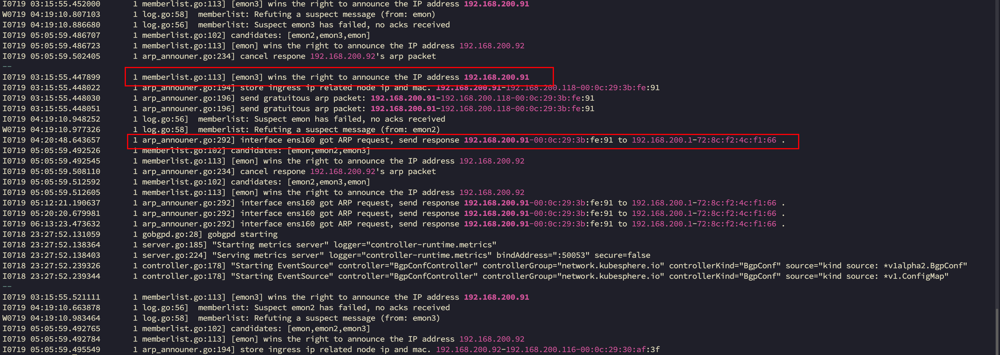

> 如图所示，服务 IP 地址 <span style="color:blue;font-weight:bold;">192.168.200.91</span> 绑定到了集群节点 <span style="color:blue;font-weight:bold;">emon3 (192.168.200.118)</span>  上的 <span style="color:blue;font-weight:bold;">ens160</span> 网卡上

5. 在客户端机器（<span style="color:blue;font-weight:bold;">同一网段机器，非集群节点</span>）上，运行 `curl` 命令以访问服务：

```bash
$ curl 192.168.200.91
```

### 1.4 在 VIP 模式下使用 OpenELB【本地环境推荐安装】

#### 1.4.0 前置条件

- 您需要准备一个已安装 OpenELB 的 Kubernetes 集群。所有 Kubernetes 集群节点必须在同一个 Layer 2 网络（同一路由器下）。

- <span style="color:#9400D3;font-weight:bold;">所有 Kubernetes 集群节点必须只有一个网卡。当前 VIP 模式不支持具有多个网卡的 Kubernetes 集群节点</span>。
- 您需要准备一台客户端机器，用于验证 OpenELB 在 Layer 2 模式下的功能是否正常。客户端机器需要与 Kubernetes 集群节点位于同一网络。

- <span style="color:red;font-weight:bold;">为OpenELB指定NIC网络接口卡（Network Interface Card）</span>

  如果OpenELB的安装节点有多个网卡（比如：eth0,eth1等），需要指定OpenELB在Layer 2模式下使用哪一个网卡。如果节点只有1个网卡，就不需要指定了。

  - **按需给节点添加注解**

  ```bash
  # 只给有多接口的节点添加注解："当此节点被选为 EIP 的 ARP 响应节点时，请使用 `192.168.200.116` 对应的接口"
  $ kubectl annotate nodes emon layer2.openelb.kubesphere.io/v1alpha1="192.168.200.116"
  ```

  > 查看是否存在多个网络适配器：
  >
  > ```bash
  > $ ip -o link show | awk '{print $2}' | cut -d':' -f1 | grep -Ev "lo|cali"
  > ```

  - **验证注解添加情况**

  ```bash
  $ kubectl describe node emon | grep openelb.kubesphere.io
  ```

  - **删除无用注解**（如果需要）：

  ```bash
  $ kubectl annotate node emon layer2.openelb.kubesphere.io/v1alpha1-
  ```

  - **影响选举行为**：

  ```mermaid
  graph TD
      A[EIP 192.168.200.91] --> B{选举 ARP 响应节点}
      B --> C[已注解节点]
      B --> D[未注解节点]
      C -->|优先选择| E[使用指定 IP 的接口]
      D -->|自动选择| F[同子网的第一个接口]
  ```

#### 1.4.1 第一步：确保已启用 VIP 模式

VIP 模式可以通过命令行参数启用或禁用。使用 VIP 模式时，请确保 VIP 发言人已正确启用。

运行以下命令以编辑 openelb-speaker DaemonSet：

```bash
$ kubectl edit ds -n openelb-system openelb-speaker
```

将 `enable-keepalived-vip` 设置为 `true` 并保存更改。openelb-speaker 将自动重启。

```yaml
    spec:
      containers:
      - args:
        - --api-hosts=:50051
        - --enable-keepalived-vip=true
        - --enable-layer2=false
        command:
        - openelb-speaker
```

#### 1.4.2 第二步：创建 Eip 对象

Eip 对象作为 OpenELB 的 IP 地址池使用。

1. 运行以下命令创建 Eip 对象的 YAML 文件：

```bash
$ vim vip-eip.yaml
```

2. 将以下信息添加到 YAML 文件中：

```yaml
apiVersion: network.kubesphere.io/v1alpha2
kind: Eip
metadata:
  name: vip-eip
spec:
  address: 192.168.200.91-192.168.200.100
  interface: ens160
  protocol: vip
```

:::info

- `spec:address` 中指定的 IP 地址必须与 Kubernetes 集群节点位于同一网络段。
- 有关 Eip YAML 配置中字段的详细信息，请参阅[使用 Eip 配置 IP 地址池](https://openelb.io/docs/getting-started/configuration/configure-ip-address-pools-using-eip/)。

:::

3. 运行以下命令创建 Eip 对象：

```bash
$ kubectl apply -f vip-eip.yaml
```

#### 1.4.3 第三步：创建部署

以下使用 nginx 镜像创建一个包含两个 Pod 的 Deployment。每个 Pod 都会将其自己的 Pod 名称返回给外部请求。

1. 运行以下命令创建 Deployment 的 YAML 文件：

```bash
$ vim vip-openelb.yaml
```

2. 将以下信息添加到 YAML 文件中：

```yaml
apiVersion: apps/v1
kind: Deployment
metadata:
  name: vip-openelb
spec:
  replicas: 2
  selector:
    matchLabels:
      app: vip-openelb
  template:
    metadata:
      labels:
        app: vip-openelb
    spec:
      containers:
        - image: nginx:1.25.4
          name: nginx
          ports:
            - containerPort: 80
```

3. 运行以下命令创建 Deployment：

```bash
$ kubectl apply -f vip-openelb.yaml
```

#### 1.4.4 第三步：创建服务[ ](https://openelb.io/docs/getting-started/usage/use-openelb-in-vip-mode/#step-4-create-a-service)

1. 运行以下命令为服务创建一个 YAML 文件：

```bash
$ vim vip-svc.yaml
```

2. 将以下信息添加到 YAML 文件中：

```yaml
kind: Service
apiVersion: v1
metadata:
  name: vip-svc
  annotations:
    lb.kubesphere.io/v1alpha1: openelb
    # For versions below 0.6.0, you also need to specify the protocol
    # protocol.openelb.kubesphere.io/v1alpha1: vip
    eip.openelb.kubesphere.io/v1alpha2: vip-eip
spec:
  selector:
    app: vip-openelb
  type: LoadBalancer
  ports:
    - name: http
      port: 80
      targetPort: 80
  externalTrafficPolicy: Cluster
```

:::warning

- 你必须将 `spec:type` 设置为 `LoadBalancer` 。
- `lb.kubesphere.io/v1alpha1: openelb` 注释指定该服务使用 OpenELB。
- `protocol.openelb.kubesphere.io/v1alpha1: vip` 注释指定 OpenELB 以 VIP 模式使用。自 0.6.0 版本起已弃用。
- `eip.openelb.kubesphere.io/v1alpha2: vip-eip` 注释指定 OpenELB 使用的 Eip 对象。如果未配置此注释，OpenELB 会自动选择一个可用的 Eip 对象。或者，您可以移除此注释并使用 `spec:loadBalancerIP` 字段（例如， `spec:loadBalancerIP: 192.168.200.91` ）或添加注释 `eip.openelb.kubesphere.io/v1alpha1: 192.168.200.91` 为服务分配特定的 IP 地址。当您将多个服务的 `spec:loadBalancerIP` 设置为相同的值以进行 IP 地址共享（这些服务通过不同的服务端口区分）时，在这种情况下，您必须将 `spec:ports:port` 设置为不同的值并将 `spec:externalTrafficPolicy` 设置为 `Cluster` 。有关 IPAM 的更多详细信息，请参阅 openelb ip address assignment。
- 如果 `spec:externalTrafficPolicy` 设置为 `Cluster` （默认值），OpenELB 会从所有 Kubernetes 集群节点中随机选择一个节点来处理 Service 请求。<span style="color:#9400D3;font-weight:bold;">其他节点上的 Pod 也可以通过 kube-proxy 访问</span>。
- 如果 `spec:externalTrafficPolicy` 设置为 `Local` ，OpenELB 会随机选择 Kubernetes 集群中包含 Pod 的节点来处理 Service 请求。<span style="color:#9400D3;font-weight:bold;">只有选中节点上的 Pod 才能被访问</span>。

:::

3. 运行以下命令创建服务：

```bash
$ kubectl apply -f vip-svc.yaml
```

#### 1.4.5 第五步：验证 VIP 模式下的 OpenELB

以下验证 OpenELB 是否正常运行。

1. 在 Kubernetes 集群中，运行以下命令以获取服务的外部 IP 地址：

```bash
$ kubectl get deploy,po,svc
NAME                          READY   UP-TO-DATE   AVAILABLE   AGE
deployment.apps/vip-openelb   2/2     2            2           38s

NAME                               READY   STATUS    RESTARTS   AGE
pod/vip-openelb-64fcb9fb58-d55tm   1/1     Running   0          38s
pod/vip-openelb-64fcb9fb58-jmhn6   1/1     Running   0          38s

NAME                 TYPE           CLUSTER-IP     EXTERNAL-IP      PORT(S)        AGE
service/kubernetes   ClusterIP      10.233.0.1     <none>           443/TCP        6d10h
service/vip-svc      LoadBalancer   10.233.41.54   192.168.200.91   80:31293/TCP   7s
```

2. 在 Kubernetes 集群中，运行以下命令以获取集群节点的 IP 地址：

```bash
$ kubectl get nodes -o wide
```

3. 在 Kubernetes 集群中，运行以下命令以检查 Pod 的节点：

```bash
$ kubectl get pod -o wide
```

>  在这个示例中，Pods 会自动分配到不同的节点。你可以手动将 Pods 分配到不同的节点。

4. 在客户端机器（<span style="color:blue;font-weight:bold;">同一网段机器，非集群节点</span>）上，运行以下命令来 ping 服务 IP 地址并检查 IP 邻居：

- 通过 <span style="color:blue;font-weight:bold;">查看邻居</span> 命令查看IP绑定到哪一个集群节点了

```bash
$ ping 192.168.200.91 -c 4
PING 192.168.200.91 (192.168.200.91): 56 data bytes
64 bytes from 192.168.200.91: icmp_seq=0 ttl=64 time=0.256 ms
64 bytes from 192.168.200.91: icmp_seq=1 ttl=64 time=0.258 ms
64 bytes from 192.168.200.91: icmp_seq=2 ttl=64 time=0.509 ms
64 bytes from 192.168.200.91: icmp_seq=3 ttl=64 time=0.427 ms

--- 192.168.200.91 ping statistics ---
4 packets transmitted, 4 packets received, 0.0% packet loss
round-trip min/avg/max/stddev = 0.256/0.363/0.509/0.109 ms
```

```bash
# 查看邻居：在Linux机器上使用 `ip neigh`；在Mac机器上使用`arp -a`
$ arp -a
? (192.168.3.1) at f8:20:a9:5e:6d:7b on en0 ifscope [ethernet]
? (192.168.3.45) at 96:61:e1:c9:b0:67 on en0 ifscope [ethernet]
? (192.168.3.49) at 40:f9:46:43:dd:42 on en0 ifscope [ethernet]
? (192.168.3.255) at ff:ff:ff:ff:ff:ff on en0 ifscope [ethernet]
? (192.168.32.255) at ff:ff:ff:ff:ff:ff on bridge101 ifscope [bridge]
? (192.168.186.255) at ff:ff:ff:ff:ff:ff on bridge100 ifscope [bridge]
? (192.168.200.91) at 0:c:29:3b:fe:91 on bridge102 ifscope [bridge]
emon (192.168.200.116) at 0:c:29:30:af:3f on bridge102 ifscope [bridge]
emon2 (192.168.200.117) at 0:c:29:49:3b:3e on bridge102 ifscope [bridge]
emon3 (192.168.200.118) at 0:c:29:3b:fe:91 on bridge102 ifscope [bridge]
? (192.168.200.255) at ff:ff:ff:ff:ff:ff on bridge102 ifscope [bridge]
mdns.mcast.net (224.0.0.251) at 1:0:5e:0:0:fb on en0 ifscope permanent [ethernet]
```

> 在 <span style="color:red;font-weight:bold;">查看邻居</span> 命令的输出中，服务 IP 地址 <span style="color:blue;font-weight:bold;">192.168.200.91</span> 的 MAC 地址与 <span style="color:blue;font-weight:bold;">emon3 (192.168.200.118)</span> 的 MAC 地址相同。因此，OpenELB 已将服务 IP 地址映射到 <span style="color:blue;font-weight:bold;">emon3</span> 的 MAC 地址。

5. 在客户端机器（<span style="color:blue;font-weight:bold;">同一网段机器，非集群节点</span>）上，运行 `curl` 命令以访问服务：

```bash
$ curl 192.168.200.91
```

### 1.5 配置集群网关设置

admin 账户操作

- 集群设置=>网关设置=>启用网关

    - LoadBalancer
        - 负载均衡器提供商：默认 QingCloud Kubernets Engine，这里选择 OpenELB（选择哪一个都没关系，使用的是默认EIP）
        - 注解：添加下面注解

        | 注解key                                 | 注解value | 备注                                      |
        | --------------------------------------- | --------- | ----------------------------------------- |
        | lb.kubesphere.io/v1alpha1               | openelb   |                                           |
        | protocol.openelb.kubesphere.io/v1alpha1 | vip       | v0.6.0之前必须配置，自 0.6.0 版本起已弃用 |
        | eip.openelb.kubesphere.io/v1alpha2      | vip-eip   |                                           |
    
    - 点击确定

> 由于上面创建了默认eip，这里可以不用配置注解

- 查看是否启用成功

```bash
# 查看 EXTERNAL-IP 字段是否已经分配了eip地址，比如：192.168.200.91
$ kubectl -n kubesphere-controls-system get svc
```

<span style="color:green;font-weight:bold;">注意：192.168.200.91可以通过网络适配器ens160添加新ip的方式达到宿主机本地DNS访问</span>

## 2 SonarQube代码质量持续检测工具

[SonarQube](https://www.sonarqube.org/) 是一种主流的代码质量持续检测工具，可用于代码库的静态和动态分析。

### 2.1 安装：使用官方仓库安装

[SonarQube官方安装](https://docs.sonarsource.com/sonarqube-server/server-installation/on-kubernetes-or-openshift/installing-helm-chart)

[若非社区版，需要许可证](https://docs.sonarsource.com/sonarqube-server/instance-administration/license-administration)

#### 2.1.1 安装postgresql（镜像：120M左右）

- 安装

```bash
# 添加仓库
$ HTTP_PROXY=http://192.168.200.1:7890 \
HTTPS_PROXY=http://192.168.200.1:7890 \
helm repo add bitnami https://charts.bitnami.com/bitnami
# 从 Helm 仓库服务器获取最新的索引文件，更新本地的仓库缓存
$ HTTP_PROXY=http://192.168.200.1:7890 \
HTTPS_PROXY=http://192.168.200.1:7890 \
helm repo update 
# 下载Chart
$ HTTP_PROXY=http://192.168.200.1:7890 \
HTTPS_PROXY=http://192.168.200.1:7890 \
helm pull bitnami/postgresql --version 18.5.1 --untar
# 查看可用版本
$ helm search repo bitnami/postgresql -l

# 安装（对应postgresql18.3.0版）
$ HTTP_PROXY=http://192.168.200.1:7890 \
HTTPS_PROXY=http://192.168.200.1:7890 \
NO_PROXY=lb.emon.local \
helm install postgresql bitnami/postgresql --version 18.5.1 \
-n devops-system --create-namespace \
--set persistence.storageClass=local \
--set primary.persistence.size=10Gi \
--set auth.database=sonarqube \
--set auth.username=sonar \
--set auth.password=sonar123
```

:::details 安装详情

```bash
NAME: postgresql
LAST DEPLOYED: Fri Feb 27 17:30:42 2026
NAMESPACE: devops-system
STATUS: deployed
REVISION: 1
TEST SUITE: None
NOTES:
CHART NAME: postgresql
CHART VERSION: 18.5.1
APP VERSION: 18.3.0

⚠ WARNING: Since August 28th, 2025, only a limited subset of images/charts are available for free.
    Subscribe to Bitnami Secure Images to receive continued support and security updates.
    More info at https://bitnami.com and https://github.com/bitnami/containers/issues/83267

** Please be patient while the chart is being deployed **

PostgreSQL can be accessed via port 5432 on the following DNS names from within your cluster:

    postgresql.devops-system.svc.cluster.local - Read/Write connection

To get the password for "postgres" run:

    export POSTGRES_ADMIN_PASSWORD=$(kubectl get secret --namespace devops-system postgresql -o jsonpath="{.data.postgres-password}" | base64 -d)

To get the password for "sonar" run:

    export POSTGRES_PASSWORD=$(kubectl get secret --namespace devops-system postgresql -o jsonpath="{.data.password}" | base64 -d)

To connect to your database run the following command:

    kubectl run postgresql-client --rm --tty -i --restart='Never' --namespace devops-system --image registry-1.docker.io/bitnami/postgresql:latest --env="PGPASSWORD=$POSTGRES_PASSWORD" \
      --command -- psql --host postgresql -U sonar -d sonarqube -p 5432

    > NOTE: If you access the container using bash, make sure that you execute "/opt/bitnami/scripts/postgresql/entrypoint.sh /bin/bash" in order to avoid the error "psql: local user with ID 1001} does not exist"

To connect to your database from outside the cluster execute the following commands:

    kubectl port-forward --namespace devops-system svc/postgresql 5432:5432 &
    PGPASSWORD="$POSTGRES_PASSWORD" psql --host 127.0.0.1 -U sonar -d sonarqube -p 5432

WARNING: The configured password will be ignored on new installation in case when previous PostgreSQL release was deleted through the helm command. In that case, old PVC will have an old password, and setting it through helm won't take effect. Deleting persistent volumes (PVs) will solve the issue.
WARNING: Rolling tag detected (bitnami/postgresql:latest), please note that it is strongly recommended to avoid using rolling tags in a production environment.
+info https://techdocs.broadcom.com/us/en/vmware-tanzu/bitnami-secure-images/bitnami-secure-images/services/bsi-doc/apps-tutorials-understand-rolling-tags-containers-index.html
WARNING: Rolling tag detected (bitnami/os-shell:latest), please note that it is strongly recommended to avoid using rolling tags in a production environment.
+info https://techdocs.broadcom.com/us/en/vmware-tanzu/bitnami-secure-images/bitnami-secure-images/services/bsi-doc/apps-tutorials-understand-rolling-tags-containers-index.html

WARNING: There are "resources" sections in the chart not set. Using "resourcesPreset" is not recommended for production. For production installations, please set the following values according to your workload needs:
  - primary.resources
  - readReplicas.resources
+info https://kubernetes.io/docs/concepts/configuration/manage-resources-containers/
```

:::

- 验证，确保所有 pod 都running

```bash
$ kubectl get po -n devops-system
```

- 卸载

```bash
$ helm uninstall postgresql -n devops-system
```


**安装postgresql后，会自动生成保密字典，可以被sonarqube使用。**

```bash
# 查看安装postgresql后，自动创建的保密字典
$ kubectl describe secret -n devops-system postgresql
Name:         postgresql
Namespace:    devops-system
Labels:       app.kubernetes.io/instance=postgresql
              app.kubernetes.io/managed-by=Helm
              app.kubernetes.io/name=postgresql
              app.kubernetes.io/version=18.2.0
              helm.sh/chart=postgresql-18.4.1
Annotations:  meta.helm.sh/release-name: postgresql
              meta.helm.sh/release-namespace: devops-system

Type:  Opaque

Data
====
password:           8 bytes
postgres-password:  10 bytes
```

#### 2.1.2 通过helm安装sonarqube（镜像：1G左右）

- 安装

[sonarqube2025.6.1对postgresql的版本依赖是13-17](https://docs.sonarsource.com/sonarqube-server/2025.6/server-installation/installing-the-database)

```bash
# 添加仓库
$ HTTP_PROXY=http://192.168.200.1:7890 \
HTTPS_PROXY=http://192.168.200.1:7890 \
helm repo add sonarqube https://SonarSource.github.io/helm-chart-sonarqube
# 从 Helm 仓库服务器获取最新的索引文件，更新本地的仓库缓存
$ HTTP_PROXY=http://192.168.200.1:7890 \
HTTPS_PROXY=http://192.168.200.1:7890 \
helm repo update
# 下载Chart
$ HTTP_PROXY=http://192.168.200.1:7890 \
HTTPS_PROXY=http://192.168.200.1:7890 \
helm pull sonarqube/sonarqube --version 2025.6.1 --untar
# 查看可用版本
$ helm search repo sonarqube/sonarqube -l

# 安装（目前2026.1.0版本的社区版使用外部数据库时有问题，2025.6.1默认会安装postgresql，需主动关闭）
$ HTTP_PROXY=http://192.168.200.1:7890 \
HTTPS_PROXY=http://192.168.200.1:7890 \
NO_PROXY=lb.emon.local \
export MONITORING_PASSCODE="yourPasscode" && \
helm upgrade --install sonarqube sonarqube/sonarqube --version 2025.6.1 \
-n devops-system --create-namespace \
--set service.type=NodePort --set service.nodePort=30681 \
--set community.enabled=true \
--set monitoringPasscode=$MONITORING_PASSCODE \
--set postgresql.enabled=false \
--set jdbcOverwrite.enabled=true \
--set jdbcOverwrite.jdbcUrl="jdbc:postgresql://postgresql:5432/sonarqube?sslmode=disable" \
--set jdbcOverwrite.jdbcUsername=sonar \
--set jdbcOverwrite.jdbcSecretName=postgresql \
--set jdbcOverwrite.jdbcSecretPasswordKey=password
```

:::details 安装详情

```bash
Release "sonarqube" does not exist. Installing it now.
NAME: sonarqube
LAST DEPLOYED: Fri Feb 27 17:34:34 2026
NAMESPACE: devops-system
STATUS: deployed
REVISION: 1
NOTES:
1. Get the application URL by running these commands:
  export NODE_PORT=$(kubectl get --namespace devops-system -o jsonpath="{.spec.ports[0].nodePort}" services sonarqube-sonarqube)
  export NODE_IP=$(kubectl get nodes --namespace devops-system -o jsonpath="{.items[0].status.addresses[0].address}")
  echo http://$NODE_IP:$NODE_PORT
WARNING: 
         Please note that the SonarQube image runs with a non-root user (uid=1000) belonging to the root group (guid=0). In this way, the chart can support arbitrary user ids as recommended in OpenShift.
         Please visit https://docs.openshift.com/container-platform/4.14/openshift_images/create-images.html#use-uid_create-images for more information.


WARNING: Setting the deployment strategy type is deprecated and will be removed in a future release. It will be hard-coded to Recreate.

WARNING: The deploymentType value is deprecated and won't be supported anymore. SonarQube will be deployed as a Deployment by default.
```

:::

- 验证，确保所有 pod 都running

```bash
$ kubectl get po -n devops-system
```

- 卸载

```bash
$ helm uninstall sonarqube -n devops-system
```

### 2.2 获取 SonarQube 控制台地址

1. 执行以下命令获取 SonarQube NodePort。

```bash
  export NODE_PORT=$(kubectl get --namespace devops-system -o jsonpath="{.spec.ports[0].nodePort}" services sonarqube-sonarqube)
  export NODE_IP=$(kubectl get nodes --namespace devops-system -o jsonpath="{.items[0].status.addresses[0].address}")
  echo http://$NODE_IP:$NODE_PORT
```

2. 预期输出结果：（您的 NodeIP 和 NodePort 应该不同）

http://192.168.200.116:30681

### 2.3 配置 SonarQube 服务器

#### 2.3.1 步骤 1：访问 SonarQube 控制台

1. 执行以下命令查看 SonarQube 的状态。注意，只有在 SonarQube 启动并运行后才能访问 SonarQube 控制台。

```bash
$ kubectl get pod -n devops-system
NAME                                     READY   STATUS      RESTARTS            AGE
devops-29536470-xt85n                    0/1     Completed   0                   127m
devops-29536530-zmq82                    0/1     Completed   0                   111m
devops-29536590-22zv8                    0/1     Completed   0                   51m
devops-apiserver-7f9cdf88d6-jh4rw        1/1     Running     4 (4h10m ago)       21d
devops-controller-b5cd8f767-n5n5s        1/1     Running     2 (<invalid> ago)   21d
devops-frontend-77c689567f-f6qn9         1/1     Running     5 (3h22m ago)       21d
devops-jenkins-57ddc6c66b-lxttr          1/1     Running     2 (<invalid> ago)   21d
helm-install-devops-agent-b8wzgq-sjlvj   0/1     Completed   0                   21d
helm-install-devops-tx96kh-kk6db         0/1     Completed   0                   21d
postgresql-0                             1/1     Running     0                   4h2m
sonarqube-sonarqube-0                    1/1     Running     0                   3h58m
```

2. 在浏览器中访问 SonarQube 控制台 [http://NodeIP:NodePort](http://nodeip:NodePort/)。

http://192.168.200.116:30681

3. 点击右上角的 **Log in**，然后使用默认账户 **admin/admin** 登录。

| 用户名 | 原密码 | 新密码       |
| ------ | ------ | ------------ |
| admin  | admin  | P@88word1234 |

:::info

取决于实例的部署位置，您可能需要设置必要的端口转发规则，并在您的安全组中放行该端口，以便访问 SonarQube。

:::

#### 2.3.2 步骤 2：创建 SonarQube 管理员令牌 (Token)

1. 点击右上角字母 **A**，然后从菜单中选择 **My Account** 以转到 **Profile** 页面。

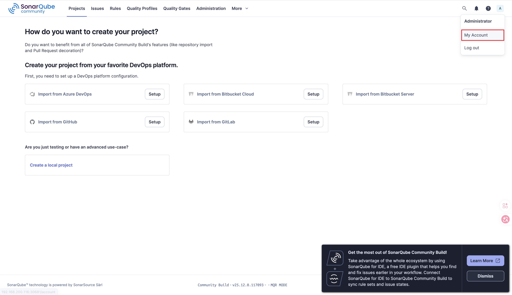

2. 点击 **Security** 并输入令牌名称，例如 **kubeSphere**。

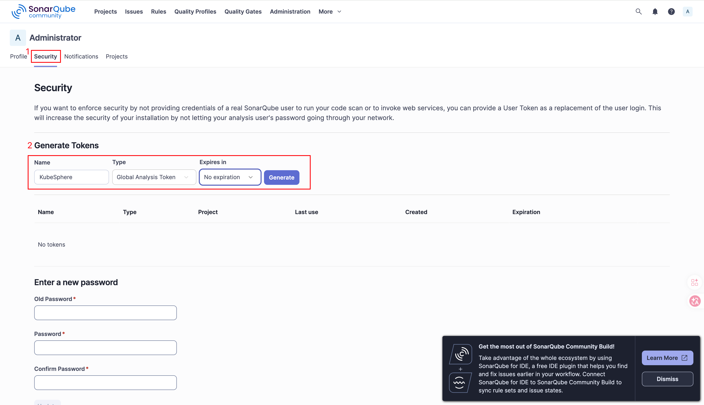

3. 点击 **Generate** 并复制此令牌。

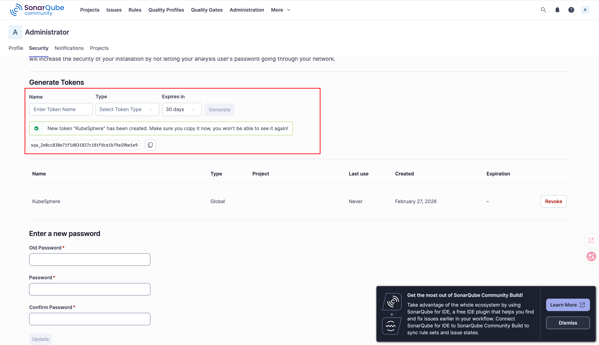

令牌： sqa_da4490626939f6986ef6066d1246dd5545f10d64

:::danger
如提示所示，您无法再次查看此令牌，因此请确保复制成功。

:::

#### 2.3.3 步骤 3：创建 Webhook 服务器

1. 执行以下命令获取 SonarQube Webhook 的地址。

```bash
export NODE_PORT=$(kubectl get --namespace kubesphere-devops-system -o jsonpath="{.spec.ports[0].nodePort}" services devops-jenkins)
export NODE_IP=$(kubectl get nodes --namespace kubesphere-devops-system -o jsonpath="{.items[0].status.addresses[0].address}")
echo http://$NODE_IP:$NODE_PORT/sonarqube-webhook/
```

2. 预期输出结果：

```bash
http://192.168.200.116:30180/sonarqube-webhook/
```

3. 依次点击 **Administration**、**Configuration** 和 **Webhooks** 创建一个 Webhook。

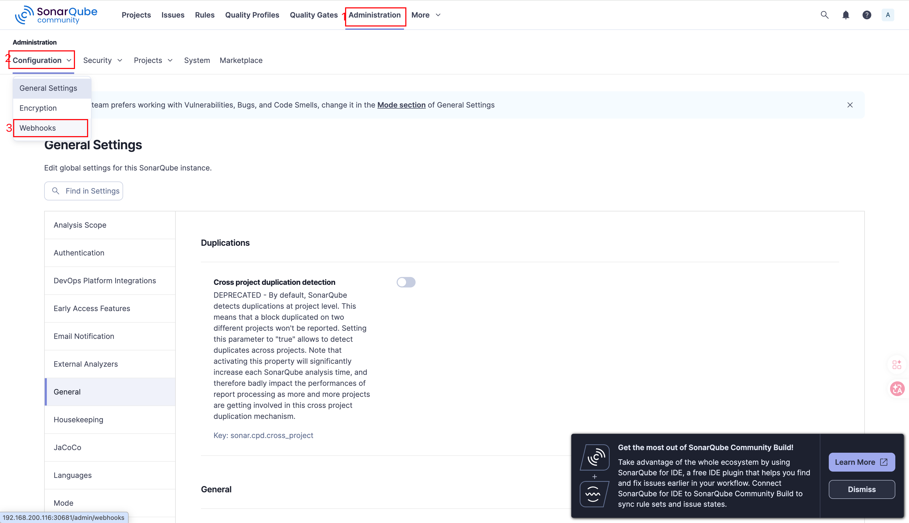


4. 点击 **Create**。

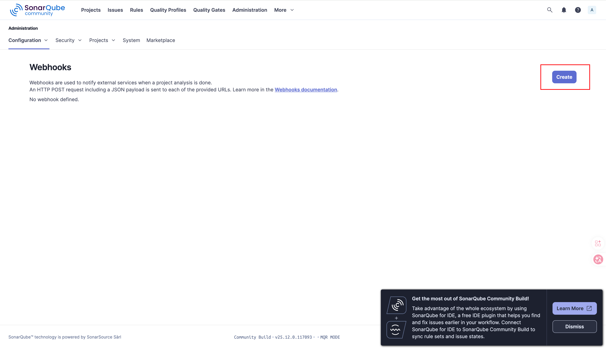

5. 在弹出的对话框中输入 **Name** 和 **Jenkins Console URL**（即 SonarQube Webhook 地址）。点击 **Create** 完成操作。

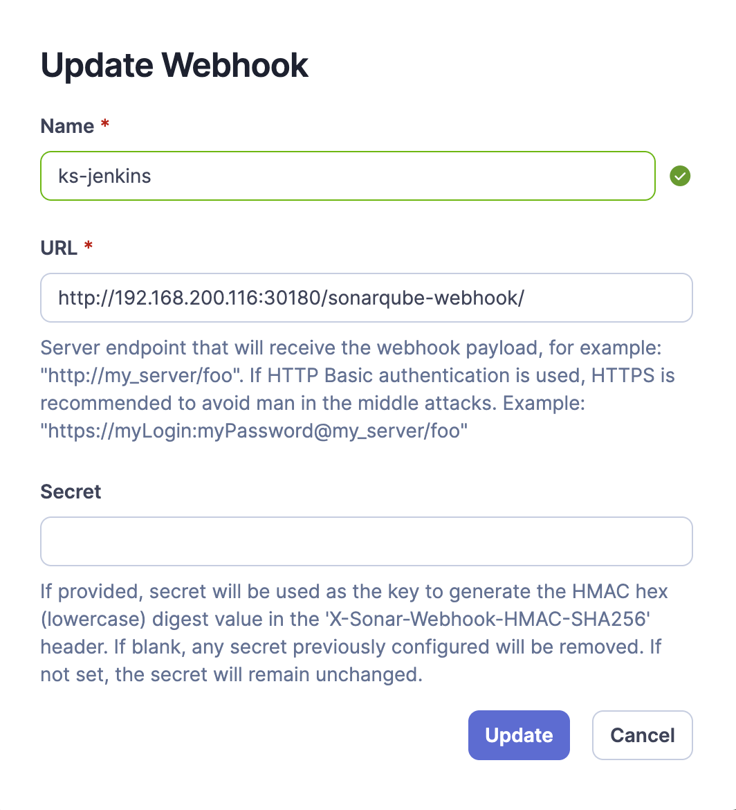

#### 2.3.4 步骤 4：将 SonarQube 服务器添加至 Jenkins

1. 执行以下命令获取 Jenkins 的地址。

```bash
export NODE_PORT=$(kubectl get --namespace kubesphere-devops-system -o jsonpath="{.spec.ports[0].nodePort}" services devops-jenkins)
export NODE_IP=$(kubectl get nodes --namespace kubesphere-devops-system -o jsonpath="{.items[0].status.addresses[0].address}")
echo http://$NODE_IP:$NODE_PORT
```

您将获得如下输出：

```bash
http://192.168.200.116:30180
```

2. 参照[登录 Jenkins 仪表板](/devops/new/KubeSphere/03-%E7%AC%AC3%E7%AB%A0%20KubeSphere%E6%89%A9%E5%B1%95%E7%BB%84%E4%BB%B6%E5%AE%89%E8%A3%85.html#_51-%E7%99%BB%E5%BD%95-jenkins-%E4%BB%AA%E8%A1%A8%E6%9D%BF)进行配置。

3. 使用地址 [http://NodeIP:30180](http://nodeip:30180/) 访问 Jenkins。

安装 DevOps 时，默认情况下也会安装 Jenkins 仪表板。此外，Jenkins 还配置有 KubeSphere LDAP，这意味着您可以直接使用 KubeSphere 账户（例如 `admin/P@88w0rd`）登录 Jenkins。有关配置 Jenkins 的更多信息，请参阅 [Jenkins 系统设置](https://www.kubesphere.io/zh/docs/v4.1/11-use-extensions/01-devops/03-how-to-use/02-pipelines/07-jenkins-setting/)。

4. 点击左侧导航栏中的**系统管理**。
5. 向下滚动并点击**系统配置**。
6. 搜寻到 **SonarQube servers**，然后点击 **Add SonarQube**。
7. 输入 **Name** 和 **Server URL** ([http://NodeIP:NodePort)。](http://nodeip:NodePort)。/) 点击**添加**，选择 **Jenkins**，然后在弹出的对话框中用 SonarQube 管理员令牌创建凭证（如下方第二张截图所示）。创建凭证后，从 **Server authentication token** 旁边的下拉列表中选择该凭证。点击**应用**完成操作。

> | 说明                                                         |
> | :----------------------------------------------------------- |
> | 如果点击**添加**按钮无效，可前往**系统管理**下的 **Manage Credentials** 并点击 **Stores scoped to Jenkins** 下的 **Jenkins**，再点击**全局凭据 (unrestricted)**，然后点击左侧导航栏的**添加凭据**，参考下方第二张截图用 SonarQube 管理员令牌添加凭证。添加凭证后，从 **Server authentication token** 旁边的下拉列表中选择该凭证。 |

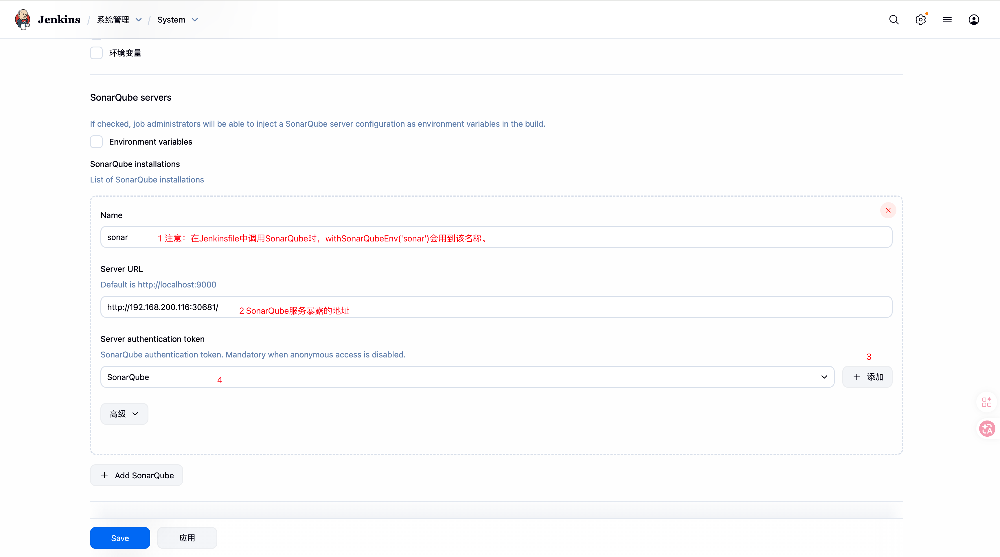

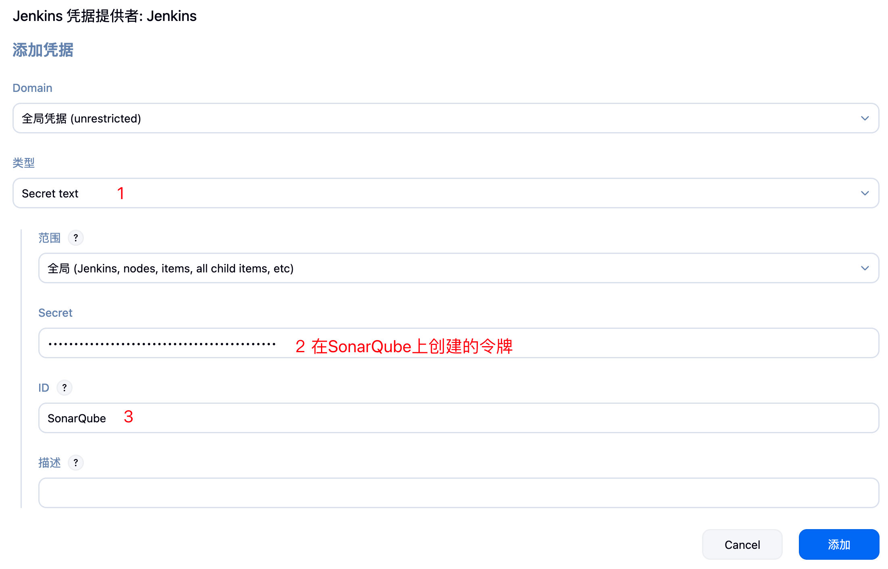

#### 2.3.5 步骤 5：将 SonarQube 配置添加到 DevOps

1. 执行以下命令编辑配置字典 `devops-config`。

```bash
$ kubectl -n kubesphere-devops-system edit cm devops-config
```

2. 在 `devops` 段后添加字段 `sonarQube` 并在其下方指定 `host` 和 `token`。

```js
data:
  kubesphere.yaml: |
    authentication:
      authenticateRateLimiterMaxTries: 10
      authenticateRateLimiterDuration: 10m0s
      loginHistoryRetentionPeriod: 168h
      maximumClockSkew: 10s
      jwtSecret: "UDjssmmDgxZtkXVDSeFvBtsZeBSFWhJ6"

    devops:
      host: http://devops-jenkins.kubesphere-devops-system
      username: admin
      maxConnections: 100
      namespace: kubesphere-devops-system
      workerNamespace: kubesphere-devops-worker

    sonarQube: // [!code ++][!code focus:3]
      host: http://192.168.200.116:30681 // [!code ++]
      token: sqa_da4490626939f6986ef6066d1246dd5545f10d64 // [!code ++]
```

3. 完成操作后保存此文件。

#### 2.3.6 步骤 6：将 sonarqubeURL 添加到 KubeSphere 控制台

您需要指定 **sonarqubeURL**，以便可以直接从 KubeSphere Web 控制台访问 SonarQube。

1. 执行以下命令：

   ```bash
   $ kubectl edit cm -n kubesphere-system ks-console-config
   ```

2. 搜寻到 **data:client:enableKubeConfig**，在下方添加 **devops** 字段并指定 **sonarqubeURL**。

   ```yaml
       client:
         version:
           kubesphere: v4.1.3
           kubernetes: v1.30.6
         enableKubeConfig: true
         devops: # [!code ++][!code focus:2]
           sonarqubeURL: http://192.168.200.116:30681 # [!code ++]
   ```

3. 保存该文件。

#### 2.3.7 步骤 7：重启服务

执行以下命令重启服务。

```bash
$ kubectl -n kubesphere-devops-system rollout restart deploy devops-apiserver
```

```bash
$ kubectl -n kubesphere-system rollout restart deploy ks-console
```

### 2.4 为新项目创建 SonarQube Token

创建一个 SonarQube 令牌，以便流水线在运行时可以与 SonarQube 通信。

1. 在 SonarQube 控制台上，点击 **Create a local project**。

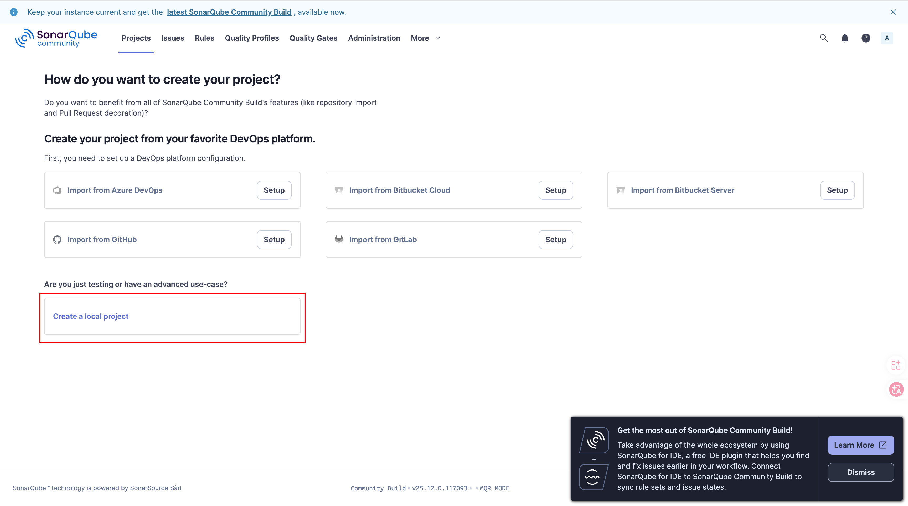

2. 输入项目密钥，例如 **java-demo**，然后点击 **Next**。

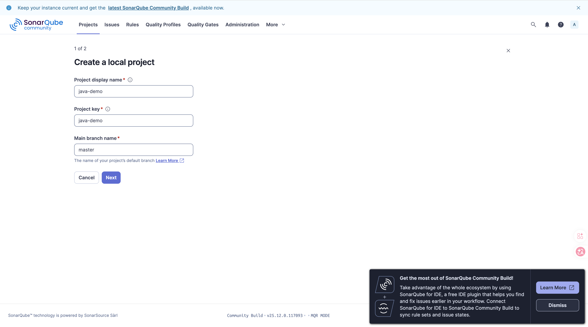

选择**Follows the instance’s default**，并点击**Create project**。

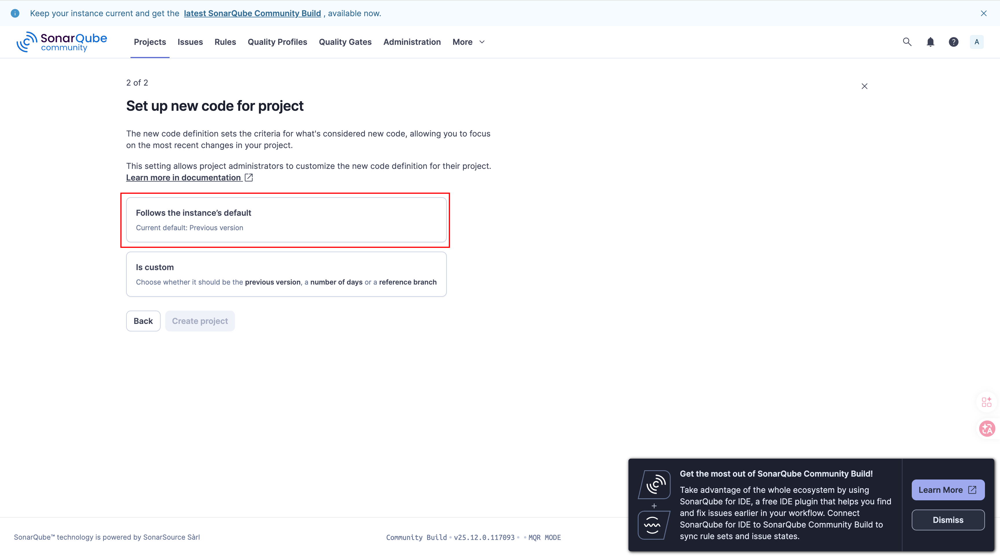

3. 输入项目名称，例如 **Analyze "java-demo"**，然后点击 **Generate**。

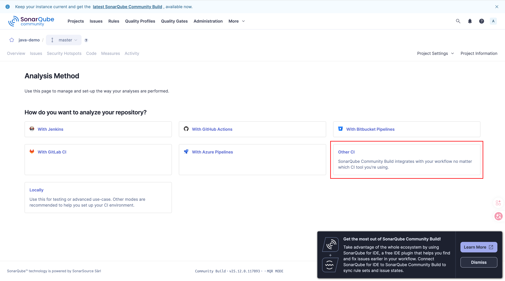

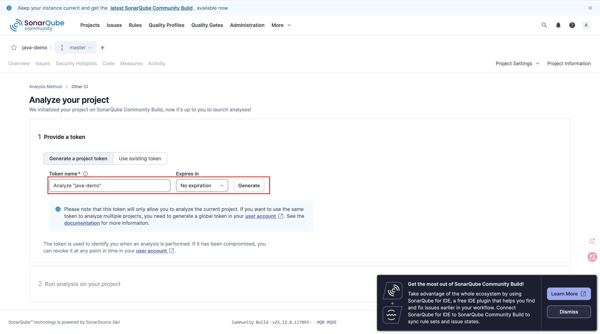

4. 创建令牌后，点击 **Continue**。

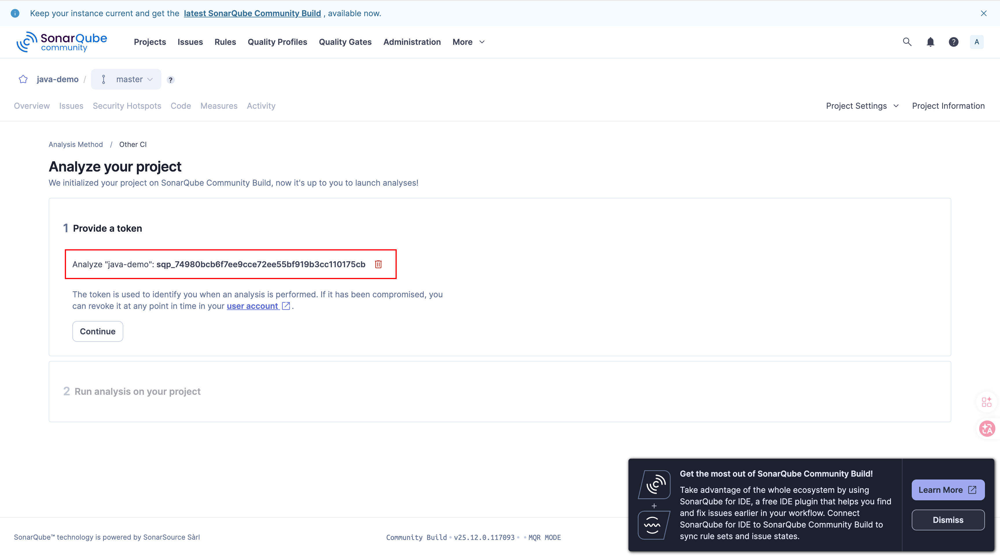

Analyze "java-demo": **sqp_74980bcb6f7ee9cce72ee55bf919b3cc110175cb**

5. 选择 **Maven**，复制下图所示红色框中的序列号。如果要在流水线中使用，则需要在[凭证](https://www.kubesphere.io/zh/docs/v4.1/11-use-extensions/01-devops/03-how-to-use/05-devops-settings/01-credential-management/)中添加此序列号。

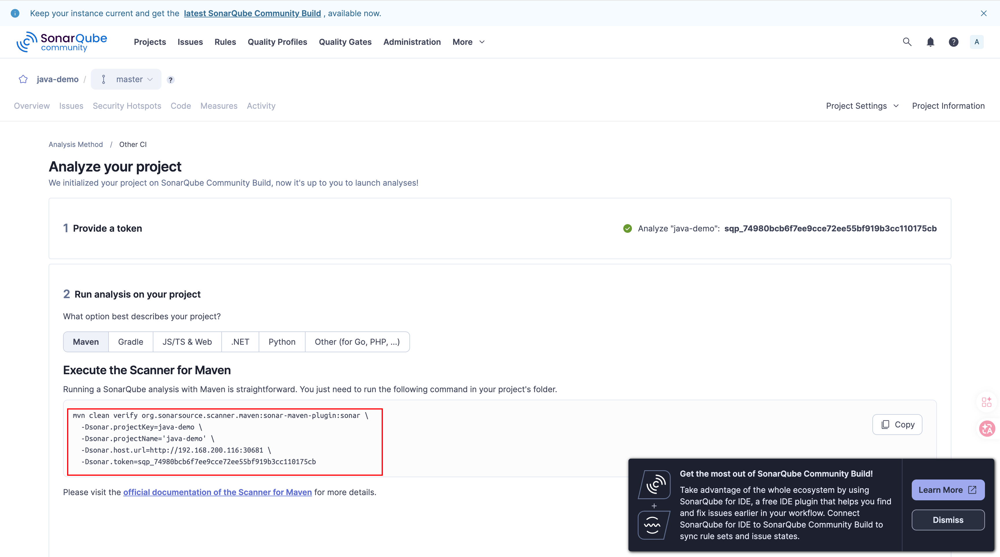

:::code-group

```xml [maven]
mvn clean verify org.sonarsource.scanner.maven:sonar-maven-plugin:sonar \
  -Dsonar.projectKey=java-demo \
  -Dsonar.projectName='java-demo' \
  -Dsonar.host.url=http://192.168.200.116:30681 \
  -Dsonar.token=sqp_74980bcb6f7ee9cce72ee55bf919b3cc110175cb
```

```xml [gradle]
plugins {
  id "org.sonarqube" version "7.2.0.6526"
}

You can find the latest version of the Gradle plugin here.（https://docs.sonarsource.com/sonarqube-community-build/analyzing-source-code/scanners/sonarscanner-for-gradle/）
and run the following command:

./gradlew sonar \
  -Dsonar.projectKey=java-demo \
  -Dsonar.projectName='java-demo' \
  -Dsonar.host.url=http://192.168.200.116:30681 \
  -Dsonar.token=sqp_74980bcb6f7ee9cce72ee55bf919b3cc110175cb
```

:::

### 2.5 在 KubeSphere 控制台查看结果

[使用 Jenkinsfile 创建流水线](https://www.kubesphere.io/zh/docs/v4.1/11-use-extensions/01-devops/03-how-to-use/02-pipelines/02-create-a-pipeline-using-jenkinsfile/)或[使用图形编辑面板创建流水线](https://www.kubesphere.io/zh/docs/v4.1/11-use-extensions/01-devops/03-how-to-use/02-pipelines/01-create-a-pipeline-using-graphical-editing-panel/)之后，即可查看代码质量分析的结果。

## 3 Harbor**企业级容器镜像仓库**

### 3.1 安装

- 解决镜像不支持arm64架构的情况

```bash
# 下载 ARM64 版 nerdctl（兼容 containerd 1.7.13）
$ wget -e use_proxy=yes -e http_proxy=192.168.200.116:7890 \
https://github.com/containerd/nerdctl/releases/download/v2.2.1/nerdctl-2.2.1-linux-arm64.tar.gz
# 查看包内文件
$ tar -ztvf nerdctl-2.2.1-linux-arm64.tar.gz
# 加载二进制文件到系统可执行文件路径
$ sudo tar Cxzvf /usr/local/bin nerdctl-2.2.1-linux-arm64.tar.gz
# 下载 ARM64 版 harbor镜像
$ wget -e use_proxy=yes -e http_proxy=192.168.200.116:7890 \
https://github.com/IabSDocker/harbor/releases/download/v2.14.2/harbor-offline-installer-v2.14.2_arm64.tgz
# 查看包内文件
$ tar -ztvf harbor-offline-installer-v2.14.2_arm64.tgz
# 加载镜像到 k8s.io 命名空间
$ tar -xOzf harbor-offline-installer-v2.14.2_arm64.tgz harbor/harbor.v2.14.2.tar.gz | sudo /usr/local/bin/nerdctl -n k8s.io load
```

> 其他节点，如上处理：
>
> ```bash
> $ kubectl get nodes -o name | awk -F'/' '{print $2}' | grep -v '^k8s-node1$' | xargs -I {} scp harbor-offline-installer-v2.14.2_arm64.tgz nerdctl-2.2.1-linux-arm64.tar.gz emon@{}:/home/emon
> ```

- 安装

执行以下命令，使用 Helm 3 安装 Harbor。

```bash
# 添加仓库
$ HTTP_PROXY=http://192.168.200.1:7890 \
HTTPS_PROXY=http://192.168.200.1:7890 \
helm repo add harbor https://helm.goharbor.io
# 从 Helm 仓库服务器获取最新的索引文件，更新本地的仓库缓存
$ HTTP_PROXY=http://192.168.200.1:7890 \
HTTPS_PROXY=http://192.168.200.1:7890 \
helm repo update 
# 下载Chart
$ HTTP_PROXY=http://192.168.200.1:7890 \
HTTPS_PROXY=http://192.168.200.1:7890 \
helm pull harbor/harbor --version 1.18.2 --untar
# 查看可用版本
$ helm search repo harbor/harbor -l
# 如需快速安装，您可以通过 NodePort 暴露 Harbor 并禁用 tls。
# 请将 externalURL 设置为您的一个节点 IP，并确保 Jenkins 能够访问它。
$ HTTP_PROXY=http://192.168.200.1:7890 \
HTTPS_PROXY=http://192.168.200.1:7890 \
NO_PROXY=lb.emon.local \
helm install harbor harbor/harbor --version 1.18.2 \
-n devops-system --create-namespace \
--set expose.type=nodePort,externalURL=http://192.168.200.116:30002,expose.tls.enabled=false
```

:::details 安装详情

```bash
NAME: harbor-release
LAST DEPLOYED: Sat Feb 28 12:46:01 2026
NAMESPACE: default
STATUS: deployed
REVISION: 1
TEST SUITE: None
NOTES:
Please wait for several minutes for Harbor deployment to complete.
Then you should be able to visit the Harbor portal at http://192.168.200.116:30002
For more details, please visit https://github.com/goharbor/harbor
```

:::

- 验证，确保所有 pod 都running

```bash
$ kubectl get po -n devops-system
```

访问： [http://192.168.200.116:30002](http://192.168.200.116:30002/)

用户名密码：admin/Harbor12345

<span style="color:red;font-weight:bold;">登录时如果提示：用户名或者密码不正确，在确认用户名密码正确的情况下，请清理浏览器缓存！！！</span>

- 卸载

```bash
$ helm uninstall harbor -n devops-system
```

### 3.2 安装`buildkit`支持`nerdctl build`

- 安装

```bash
# 下载 ARM64 版 buildkit（再 https://github.com/containerd/nerdctl/releases 查看兼容版本）
$ wget -e use_proxy=yes -e http_proxy=192.168.200.116:7890 \
https://github.com/moby/buildkit/releases/download/v0.26.3/buildkit-v0.26.3.linux-arm64.tar.gz
# 查看包内文件
$ tar -ztvf buildkit-v0.26.3.linux-arm64.tar.gz
# 加载二进制文件到系统可执行文件路径
$ sudo tar Cxzvf /usr/local/bin buildkit-v0.26.3.linux-arm64.tar.gz --strip-components=1 bin/buildctl bin/buildkitd
# 验证安装
$ buildkitd --version
$ buildctl --version
```

> 其他节点，如上处理：
>
> ```bash
> $ kubectl get nodes -o name | awk -F'/' '{print $2}' | grep -v '^k8s-node1$' | xargs -I {} scp buildkit-v0.26.3.linux-arm64.tar.gz emon@{}:/home/emon
> ```

- 配置 Systemd 服务 (让 buildkitd 后台运行)

为了让 `nerdctl build` 能随时连接，我们需要让 `buildkitd` 作为系统服务运行。

**创建服务文件：**

```bash
$ sudo tee /etc/systemd/system/buildkit.service > /dev/null <<EOF
[Unit]
Description=BuildKit
Requires=containerd.service
After=containerd.service

[Service]
ExecStart=/usr/local/bin/buildkitd --oci-worker=false --containerd-worker=true --addr=unix:///run/buildkit/buildkitd.sock
Restart=always
User=root
Group=root

[Install]
WantedBy=multi-user.target
EOF
```

**启动服务：**

```bash
# 重载配置
$ sudo systemctl daemon-reload
# 启动并设置开机自启
$ sudo systemctl enable --now buildkit
# 检查状态，确保状态显示为 active (running)。
$ sudo systemctl status buildkit
```

:::tip

```bash
level=warning msg="CDI setup error /etc/cdi: failed to monitor for changes: no such file or directory
level=warning msg="using host network as the default
```

你看到的这几行警告可以**完全忽略**，它们不影响功能：

- **CDI Error**: 是因为系统里没有配置 CDI (Container Device Interface) 目录，除非你要做特殊的硬件直通（如 GPU），否则不需要关心。
- **Host Network**: 是因为没有配置专门的 CNI 网络插件给 BuildKit 用，它默认使用宿主机网络。在 CI/CD 构建场景下，这通常是**预期行为**且更方便（构建容器可以直接访问宿主机网络资源）。

:::

- 配置环境变量 (关键步骤)<span style="color:red;font-weight:bold;">（nerdctl有自动探测，但加上该配置可以主动设置，非必须）</span>

现在 `buildkitd` 已经在运行了，但 `nerdctl` 默认可能不知道去哪里找它。你需要设置 `BUILDKIT_HOST` 环境变量。

```bash
echo 'export BUILDKIT_HOST=unix:///run/buildkit/buildkitd.sock' | sudo tee -a /etc/profile
source /etc/profile
```

- 构建镜像

```bash
$ git clone https://github.com/Rushing0711/devops-dockerfile-examples
$ cd dockerfile-examples/rethinkdb
# 构建镜像
$ sudo /usr/local/bin/nerdctl build -t 192.168.200.116:30002/ks-devops-harbor/docker-example:devops-test .
# 输出错误
ERRO[0000] `buildctl` needs to be installed and `buildkitd` needs to be running, see https://github.com/moby/buildkit  error="failed to ping to host unix:///run/buildkit-default/buildkitd.sock: exec: \"buildctl\": executable file not found in $PATH\nfailed to ping to host unix:///run/buildkit/buildkitd.sock: exec: \"buildctl\": executable file not found in $PATH"
FATA[0000] no buildkit host is available, tried 2 candidates: failed to ping to host unix:///run/buildkit-default/buildkitd.sock: exec: "buildctl": executable file not found in $PATH
failed to ping to host unix:///run/buildkit/buildkitd.sock: exec: "buildctl": executable file not found in $PATH 
# sudo会重置环境变量，为了保留可以指定PATH，或者把buildctl创建快捷方式到 /usr/bin/buildctl
$ sudo -E env PATH=$PATH /usr/local/bin/nerdctl build -t 192.168.200.116:30002/ks-devops-harbor/docker-example:devops-test .
# 查看镜像
$ sudo /usr/local/bin/nerdctl images
REPOSITORY                                               TAG            IMAGE ID        CREATED           PLATFORM       SIZE       BLOB SIZE
192.168.200.116:30002/ks-devops-harbor/docker-example    devops-test    15cbb452a282    25 minutes ago    linux/arm64    107.9MB    28.87MB
```

### 3.3 [增强KubeSphere默认base构建镜像的能力](/devops/new/KubeSphere/05-第5章%20DevOps实战.html#_11-5-增强kubesphere默认base构建镜像的能力)

### 3.4 获取 Harbor 凭证

1. 安装 Harbor 后，访问 `<NodeIP>:30002` 并使用默认账户和密码 (**admin/Harbor12345**) 登录 Web 控制台。
2. 在左侧导航栏中点击**项目**，然后点击**新建项目**。
3. 在弹出的对话框中，设置项目名称 **ks-devops-harbor** 并点击**确定**。
4. 点击刚刚创建的项目，在**机器人账户**页签下点击**添加机器人账户**。
5. 在弹出的对话框中，为机器人账户设置名称 **robot-test** 和**过期时间**。然后在**权限**中勾选制品（Artifact）和仓库的所有权限。点击**完成**。
6. 在弹出的对话框中，点击**导出到文件中**，保存该 Harbor 令牌。

- 打开导出的文件`robot$ks-devops-harbor+robot-test.json`查看`name`和`secret`字段值。

```bash
name: 	robot$ks-devops-harbor+robot-test
secret:	qGBGzF7seF9uh9jCGqr6I6EtSiQzWsCT
```

### 3.5 启用 Insecure Registry

配置 Docker，使其忽略您 Harbor 仓库的安全性。

1. 在所有集群节点上编辑配置文件，添加以下内容并保存更改。

:::code-group
```toml [containerd容器]
vim /etc/containerd/config.toml
[plugins]
  [plugins."io.containerd.grpc.v1.cri".containerd.runtimes.runc]
    runtime_type = "io.containerd.runc.v2"
    [plugins."io.containerd.grpc.v1.cri".containerd.runtimes.runc.options]
      SystemdCgroup = true
  [plugins."io.containerd.grpc.v1.cri"]
    sandbox_image = "registry.cn-beijing.aliyuncs.com/kubesphereio/pause:3.9"
    [plugins."io.containerd.grpc.v1.cri".cni]
      bin_dir = "/opt/cni/bin"
      conf_dir = "/etc/cni/net.d"
      max_conf_num = 1
      conf_template = ""
    [plugins."io.containerd.grpc.v1.cri".registry]
        [plugins."io.containerd.grpc.v1.cri".registry.mirrors] // [!code --] [!code focus:2]
      [plugins."io.containerd.grpc.v1.cri".registry.mirrors] // [!code ++]
        [plugins."io.containerd.grpc.v1.cri".registry.mirrors."docker.io"]
          endpoint = ["https://registry-1.docker.io"]
        [plugins."io.containerd.grpc.v1.cri".registry.mirrors."192.168.200.116:30002"] // [!code ++] [!code focus:2]
          endpoint = ["http://192.168.200.116:30002"] // [!code ++]
```

```json [docker容器]
vim /etc/docker/daemon.json
  "insecure-registries" : ["192.168.200.116:30002"]
```
:::

:::tip 说明

- 请将 **192.168.200.116:30002** 替换为您自己的 Harbor 仓库地址。
- 对于 Linux，**daemon.json** 文件的路径为 **/etc/docker/daemon.json**；对于 Windows，该文件的路径为 **C:\ProgramData\docker\config\daemon.json**。
- 对于Linux， **config.toml** 文件的路径为  **/etc/containerd/config.toml**；

:::

文件内容应如下所示：

:::code-group
```toml [containerd容器]
...省略...
[plugins]
  [plugins."io.containerd.grpc.v1.cri".containerd.runtimes.runc]
    runtime_type = "io.containerd.runc.v2"
    [plugins."io.containerd.grpc.v1.cri".containerd.runtimes.runc.options]
      SystemdCgroup = true
  [plugins."io.containerd.grpc.v1.cri"]
    sandbox_image = "registry.cn-beijing.aliyuncs.com/kubesphereio/pause:3.9"
    [plugins."io.containerd.grpc.v1.cri".cni]
      bin_dir = "/opt/cni/bin"
      conf_dir = "/etc/cni/net.d"
      max_conf_num = 1
      conf_template = ""
    [plugins."io.containerd.grpc.v1.cri".registry]
      [plugins."io.containerd.grpc.v1.cri".registry.mirrors]
        [plugins."io.containerd.grpc.v1.cri".registry.mirrors."docker.io"]
          endpoint = ["https://registry-1.docker.io"]
        [plugins."io.containerd.grpc.v1.cri".registry.mirrors."192.168.200.116:30002"]
          endpoint = ["http://192.168.200.116:30002"]
```

```json [docker容器]
{
  "log-opts": {
    "max-size": "5m",
    "max-file": "3"
  },
  // 注意添加逗号
  "exec-opts": ["native.cgroupdriver=systemd"],
  "insecure-registries": ["192.168.200.116:30002"]
}
```
:::

2. 运行以下命令重启 Docker，使更改生效。

:::code-group

```bash [containerd容器]
$ sudo systemctl daemon-reload
$ sudo systemctl restart containerd
```

```bash [docker容器]
$ sudo systemctl daemon-reload
$ sudo systemctl restart docker
```

:::

:::tip 说明

建议您在隔离的测试环境或者严格控制的离线环境中使用该方案。有关更多信息，请参阅 [Deploy a plain HTTP registry](https://docs.docker.com/registry/insecure/#deploy-a-plain-http-registry)。

完成上述操作后，即可在项目中部署工作负载时使用您 Harbor 仓库中的镜像。您需要为自己的 Harbor 仓库创建一个镜像密钥，然后在部署工作负载添加容器时，点击 **Docker Hub**，选择您的 Harbor 仓库并输入镜像的绝对路径以搜索您的镜像。

:::

### 3.6 创建凭证

1. 以 **project-regular** 用户登录 KubeSphere 控制台并进入您的企业空间。
2. 在左侧导航栏选择 **DevOps > 凭证**。
3. 在页面左上角的下拉列表中选择一个 DevOps 项目。
4. 在页面点击**创建**。
5. 在**创建凭证**页面，设置名称 (**robot-test**)，**类型**选择**用户名和密码**，在**用户名**中输入刚刚导出的 Harbor 令牌文件中 **name** 的值，并在**密码/令牌**中输入 Harbor 令牌文件中 **secret** 的值。
6. 点击**确定**以保存。

### 3.7 创建流水线

1. 转到**流水线**页面，点击**创建**。
2. 在**基本信息**页签，输入名称 **demo-pipeline**，然后点击**下一步**。
3. **高级设置**中使用默认值，点击**创建**。

### 3.8 编辑 Jenkinsfile

1. 点击该流水线进入其详情页面，然后点击**编辑 Jenkinsfile**。
2. 将以下内容复制粘贴至 Jenkinsfile。注意，必须将 **HARBOR_ADDR**、**HARBOR_PROJECT**、**APP_NAME** 和 **HARBOR_CREDENTIAL** 替换为您自己的值。

- **demo-pipeline**（<span style="color:red;font-weight:bold;">需要确保构建镜像有nerdctl+buildctl能力</span>）

```bash
/**
 * 获取指定节点的标签列表
 * @NonCPS 是关键：告诉 Jenkins 不要转换此方法，也不要序列化其中的对象
 */
@NonCPS
def getNodeLabels(String nodeName) {
	try {
		// 获取 Node 对象 (这可能触发沙箱检查，需确保有权限)
		def node = Jenkins.instance.getNode(nodeName)
		if (node == null) {
			return ["Node not found: ${nodeName}"]
		}
		// 获取标签集合
		def labelSet = node.getAssignedLabels()
		return labelSet.collect {
			it.toString()
		}
	} catch (Exception e) {
		// 捕获可能的 AccessDeniedException 或其他错误
		return ["Error accessing node info: ${e.message} (Check Script Approval or Permissions)"]
	}
}

pipeline {
	agent {
		kubernetes {
			label 'base'
		}
	}

	environment {
		// 您 Harbor 仓库的地址。
		HARBOR_ADDR = '192.168.200.116:30002'
		// 项目名称，请确保您的机器人账户具有足够的项目访问权限。
		HARBOR_PROJECT = 'ks-devops-harbor'
		// Docker 镜像名称。
		APP_NAME = 'docker-example'
		// ‘robot-test’ 是您在 KubeSphere Web 控制台上创建的凭证 ID。
		HARBOR_CREDENTIAL = credentials('robot-test')
		// 镜像标签和镜像全名称
		IMAGE_TAG = "${BUILD_NUMBER}"
		FULL_IMAGE = "${HARBOR_ADDR}/${HARBOR_PROJECT}/${APP_NAME}:${IMAGE_TAG}"
	}

	stages {
		stage('check node labels') {
			steps {
				script {
					sh "env"
					// 获取当前节点的所有标签
					def labels = getNodeLabels(env.NODE_NAME)
					echo "Node name: ${env.NODE_NAME}"
					// 输出类似: Node labels: [python, sonar-scanner, ant, maven, go, npm, nodejs, helm, docker, gradle, jdk, base-n2nxr, java, kubectl, kustomize, yarn, base, podman]
					echo "Node labels: ${labels}"
				}
			}
		}

		stage('nerdctl login') {
			steps{
				container ('base') {
					// 请将 -u 后面的参数替换为 Harbor 令牌文件中 name 的值，不要忘记加上 ''
					sh '''echo $HARBOR_CREDENTIAL_PSW|nerdctl login $HARBOR_ADDR -u $HARBOR_CREDENTIAL_USR --password-stdin --insecure-registry'''
				}
			}
		}

		stage('build & push') {
			steps {
				container ('base') {
					sh 'git clone https://github.com/Rushing0711/devops-dockerfile-examples'
					sh 'cd dockerfile-examples/rethinkdb && nerdctl build -t $FULL_IMAGE .'
					sh 'nerdctl push $FULL_IMAGE --insecure-registry'
				}
			}
		}
	}
}
```

:::tip

您可以通过带有环境变量的 Jenkins 凭证来传送参数至 **docker login -u**。但是，每个 Harbor 机器人账户的用户名都包含一个 **$** 字符，当用于环境变量时，Jenkins 会将其转换为 **$$**（Harbor v2.2 以后可以自定义机器人后缀，避免此类问题）。[了解更多](https://number1.co.za/rancher-cannot-use-harbor-robot-account-imagepullbackoff-pull-access-denied/)。

:::

:::warning

<span style="color:red;font-weight:bold;">若想获取节点标签，需要Jenkins授权【系统管理】=>In-process Script Approval（执行一次授权一条，需要3次执行才能授权完成）</span>

- Signatures already approved:

```bash
method hudson.model.Node getAssignedLabels
method jenkins.model.Jenkins getNode java.lang.String
staticMethod jenkins.model.Jenkins getInstance
```

- Signatures already approved which **may have introduced a security vulnerability** (recommend clearing):

```bash
staticMethod jenkins.model.Jenkins getInstance

```

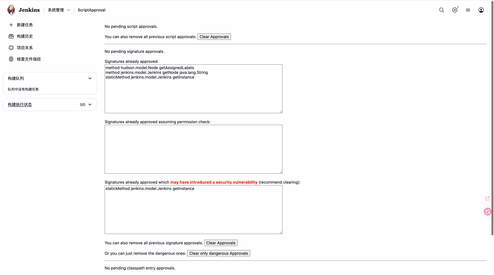

:::

### 3.9 运行流水线

保存 Jenkinsfile 后，KubeSphere 会自动在图形编辑面板上创建所有阶段和步骤。点击**运行**来运行该流水线。如果一切运行正常，Jenkins 将推送镜像至您的 Harbor 仓库。

## 4 Sonatype Nexus Repository仓库管理工具

### 4.1 安装（镜像：310M左右）

- 安装

```bash
# 添加仓库（如果还没添加）
$ helm repo add sonatype https://sonatype.github.io/helm3-charts/
# 从 Helm 仓库服务器获取最新的索引文件，更新本地的仓库缓存
$ helm repo update sonatype
# 查看可用版本
$ helm search repo sonatype -l
# 查看values.yaml
$ helm show values sonatype/nexus-repository-manager > nexus-values.yaml

# 安装（--set service.nodePort=30081不支持指定）
$ helm upgrade --install nexus3 sonatype/nexus-repository-manager \
  --version 64.2.0 \
  --namespace devops-system \
  --create-namespace \
  --set persistence.enabled=true \
  --set persistence.storageSize=20Gi \
  --set persistence.storageClass="nfs-csi-retain" \
  --set image.repository="klo2k/nexus3" \
  --set image.tag="3.68.1-02" \
  --set service.type=NodePort
```

:::details 安装详情

```bash
# 不指定 service.type=NodePort
WARNING: This chart is deprecated
NAME: nexus3
LAST DEPLOYED: Fri Mar 20 21:01:36 2026
NAMESPACE: devops-system
STATUS: deployed
REVISION: 1
NOTES:
1. Get the application URL by running these commands:
  export POD_NAME=$(kubectl get pods --namespace devops-system -l "app.kubernetes.io/name=nexus-repository-manager,app.kubernetes.io/instance=nexus3" -o jsonpath="{.items[0].metadata.name}")
  kubectl --namespace devops-system port-forward $POD_NAME 8081:80
  Your application is available at http://127.0.0.1
  
# 指定 service.type=NodePort
WARNING: This chart is deprecated
Release "nexus3" has been upgraded. Happy Helming!
NAME: nexus3
LAST DEPLOYED: Fri Mar 20 21:20:10 2026
NAMESPACE: devops-system
STATUS: deployed
REVISION: 2
NOTES:
1. Get the application URL by running these commands:
  export NODE_PORT=$(kubectl get --namespace devops-system -o jsonpath="{.spec.ports[0].nodePort}" services nexus3-nexus-repository-manager)
  export NODE_IP=$(kubectl get nodes --namespace devops-system -o jsonpath="{.items[0].status.addresses[0].address}")
  Your application is available at http://$NODE_IP:$NODE_PORT
```

:::

- 验证，确保所有 pod 都running

```bash
$ kubectl get po -n devops-system
```

- 卸载

```bash
$ helm uninstall nexus3 -n devops-system
```

- 修改nodePort端口并获得访问地址

由于无法指定nodePort的端口，若想使用 30081 端口，可以修改。

```bash
$ kubectl patch svc nexus3-nexus-repository-manager -n devops-system -p '{"spec":{"type":"NodePort","ports":[{"port":8081,"targetPort":8081,"nodePort":30081}]}}'
```

```bash
# 获取访问地址
export NODE_PORT=$(kubectl get svc --namespace devops-system -o jsonpath="{.spec.ports[0].nodePort}" nexus3-nexus-repository-manager)
export NODE_IP=$(kubectl get no --namespace devops-system -o jsonpath="{.items[0].status.addresses[0].address}")
echo http://$NODE_IP:$NODE_PORT

# 获取密码
export POD_NAME=$(kubectl get pods --namespace devops-system -l "app.kubernetes.io/name=nexus-repository-manager,app.kubernetes.io/instance=nexus3" -o jsonpath="{.items[0].metadata.name}")
kubectl exec -it -n devops-system $POD_NAME -- cat /nexus-data/admin.password
# 输出密码，首次登录是会修改
aa614da4-3aaf-4d5c-a5c3-83a6383329f3
```

http://192.168.200.116:30081

### 4.2 配置

#### 4.2.1 **基本信息**

| 项目     | 信息                                  |
| :------- | :------------------------------------ |
| 访问地址 | `http://192.168.200.116:30081`        |
| 管理员   | `admin` / 你修改后的密码              |
| 部署位置 | Kubernetes namespace: `devops-system` |
| 存储类   | `nfs-csi-retain` (20Gi)               |

------

#### 4.2.2 **已完成的配置**

1. 匿名访问

- **路径**：Administration → Security → Anonymous Access
- **状态**：已开启，允许匿名用户下载（上传仍需登录）

2. Blob Store（存储后端）

| 名称         | 用途             | 路径                         |
| :----------- | :--------------- | :--------------------------- |
| `default`    | 系统默认         | /nexus-data/blobs/default    |
| `npm-blob`   | npm 包存储       | /nexus-data/blobs/npm-blob   |
| `maven-blob` | Maven jar 包存储 | /nexus-data/blobs/maven-blob |

3. 仓库配置

**npm 仓库**

| 配置项     | 值                                                     |
| :--------- | :----------------------------------------------------- |
| 名称       | `npm-private`                                          |
| 类型       | npm (hosted)                                           |
| Blob store | `npm-blob`                                             |
| 部署策略   | Allow redeploy                                         |
| 访问地址   | `http://192.168.200.116:30081/repository/npm-private/` |

另外，再创建2个npm仓库，分别是 `npm-central` proxy类型 和 `npm-public` group类型。并把`npm-central`和`npm-private`假如`npm-public`中。其中proxy类型的代理地址是 https://registry.npmjs.org/ 。

`npm-central`和`npm-public`的Blob 都是 `default`。

**Maven 仓库**

| 配置项         | 值                                                       |
| :------------- | :------------------------------------------------------- |
| 名称           | `maven-private`                                          |
| 类型           | maven2 (hosted)                                          |
| Version policy | `Mixed`（同时支持 SNAPSHOT 和 RELEASE）                  |
| Layout policy  | `Permissive`                                             |
| Blob store     | `maven-blob`                                             |
| 部署策略       | Allow redeploy                                           |
| 访问地址       | `http://192.168.200.116:30081/repository/maven-private/` |

另外，`maven-private`需要加入`maven-public`中。

------

#### 4.2.3 **客户端配置** 

**npm 配置**

```bash
# 设置 registry
npm set registry http://192.168.200.116:30081/repository/npm-private/

# 登录（上传时需要）
npm login --registry=http://192.168.200.116:30081/repository/npm-private/

# 发布包
npm publish
```

**Maven 配置**

编辑 `~/.m2/settings.xml`：

```xml
<settings>
  <servers>
    <server>
      <id>nexus</id>
      <username>admin</username>
      <password>你的密码</password>
    </server>
  </servers>

  <mirrors>
    <mirror>
      <id>nexus-mirror</id>
      <url>http://192.168.200.116:30081/repository/maven-private/</url>
      <mirrorOf>*</mirrorOf>
    </mirror>
  </mirrors>
</settings>
```

在项目的 `pom.xml` 中添加：

```xml
<distributionManagement>
  <repository>
    <id>nexus</id>
    <url>http://192.168.200.116:30081/repository/maven-private/</url>
  </repository>
</distributionManagement>
```

发布命令：

```bash
mvn deploy
```

### 4.3 常用管理操作

| 操作         | 方法                                               |
| :----------- | :------------------------------------------------- |
| 查看仓库列表 | 登录 Web → Repository → Repositories               |
| 查看存储用量 | Repository → Blob Stores → 点击对应 Blob           |
| 清理旧版本   | Repository → Cleanup Policies → 创建策略并关联仓库 |
| 备份数据     | 备份 NFS 后端目录（路径见 PV）                     |

### 4.4 快速验证

**验证 npm 仓库：**

```bash
$ npm info lodash --registry=http://192.168.200.116:30081/repository/npm-public/
```

**验证 Maven 仓库：**

```bash
$ curl http://192.168.200.116:30081/repository/maven-public/
```

### 4.5 配置结果图

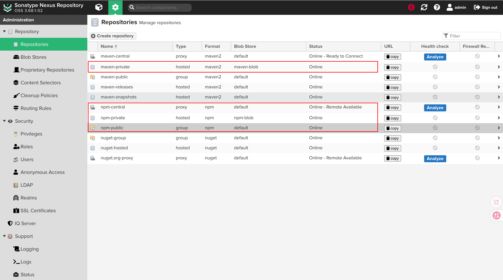

## 5 YouTrack基于网页的项目管理与问题跟踪系统

[Deploy YouTrack with Kubernetes](https://www.jetbrains.com/help/youtrack/server/deploy-youtrack-kubernetes.html) **twenty20 是 JetBrains 官方认证的咨询合作伙伴**

[A Helm chart for deploying Youtrack on Kubernetes](https://artifacthub.io/packages/helm/twenty20-helm-charts/youtrack/) twenty20提供的Helm安装方式

### 5.1 安装（镜像：1.98G）

- 安装

```bash
# 添加仓库（如果还没添加）
$ helm repo add twenty20-helm-charts https://twenty-20.github.io/helm-charts
# 从 Helm 仓库服务器获取最新的索引文件，更新本地的仓库缓存
$ helm repo update twenty20-helm-charts
# 查看可用版本
$ helm search repo twenty20-helm-charts -l
# 查看values.yaml
$ helm show values twenty20-helm-charts/youtrack > youtrack-values.yaml
# 拉取 Chart 到本地查看模板
$ helm pull twenty20-helm-charts/youtrack --untar

# 安装（charts中的ingress强制开启tls，安装时禁用）
$ helm upgrade --install youtrack twenty20-helm-charts/youtrack \
  --version 1.1.30 \
  --namespace devops-system --create-namespace \
  --set persistence.data.storageClassName=nfs-csi-retain \
  --set persistence.data.storageSize=20Gi \
  --set persistence.logs.storageClassName=nfs-csi-retain \
  --set persistence.logs.storageSize=5Gi \
  --set persistence.conf.storageClassName=nfs-csi-retain \
  --set persistence.conf.storageSize=1Gi \
  --set persistence.temp.enabled=true \
  --set persistence.temp.storageClassName=nfs-csi-retain \
  --set persistence.temp.storageSize=100Gi \
  --set persistence.backups.backupType=volumeStorage \
  --set persistence.backups.volumeStorage.storageClassName=nfs-csi-retain \
  --set persistence.backups.volumeStorage.storageSize=20Gi \
  --set config.baseUrl="http://youtrack.flyin.devops:30080" \
  --set ingress.enabled=false \
  --set service.name=youtrack
# 单独安装ingress
$ cat <<EOF | kubectl apply -f -
apiVersion: networking.k8s.io/v1
kind: Ingress
metadata:
  name: youtrack-ingress
  namespace: devops-system
spec:
  ingressClassName: traefik
  rules:
  - host: youtrack.flyin.devops
    http:
      paths:
      - path: /
        pathType: Prefix
        backend:
          service:
            name: youtrack
            port:
              number: 8080
EOF
```

:::details安装详情

```bash
Release "youtrack" does not exist. Installing it now.
NAME: youtrack
LAST DEPLOYED: Sun Mar 22 22:36:07 2026
NAMESPACE: devops-system
STATUS: deployed
REVISION: 1
TEST SUITE: None
```

:::

- 验证，确保所有 pod 都running

```bash
$ kubectl get po -n devops-system
```

- 卸载

```bash
$ helm uninstall youtrack -n devops-system
$ kubectl delete pvc youtrack-backup youtrack-config youtrack-data youtrack-logs youtrack-temp -n devops-system
```

### 5.2 检索令牌并登录

- 配置本地 hosts 并访问

在你的电脑上配置 hosts 文件，然后就可以访问仪表盘了。

```bash
# 编辑 /etc/hosts 文件，添加一行：
192.168.200.116 youtrack.flyin.devops
```

- 获取token

```bash
$ kubectl exec -n devops-system -it youtrack-0 -- cat /opt/youtrack/conf/internal/services/configurationWizard/wizard_token.txt
```

http://youtrack.flyin.devops:30080/?wizard_token=R37wGenvE0MIVuNzW9aj


## 99 扩展服务登录信息

| 登录地址                           | 描述      | 用户名 | 密码         | 原密码                               |
| ---------------------------------- | --------- | ------ | ------------ | ------------------------------------ |
| http://192.168.200.116:30002       | Harbor    | admin  | Harbor12345  | Harbor12345                          |
| http://192.168.200.116:30681       | SonarQube | admin  | P@88word1234 | admin                                |
| http://192.168.200.116:30081       | Nexus3    | admin  | P@88word1234 | aa614da4-3aaf-4d5c-a5c3-83a6383329f3 |
| http://traefik.flyin.devops:30080  | traefik   | admin  | P@88word1234 |                                      |
| http://youtrack.flyin.devops:30080 | YouTrack  | admin  | P@88word1234 | - - -                                |
