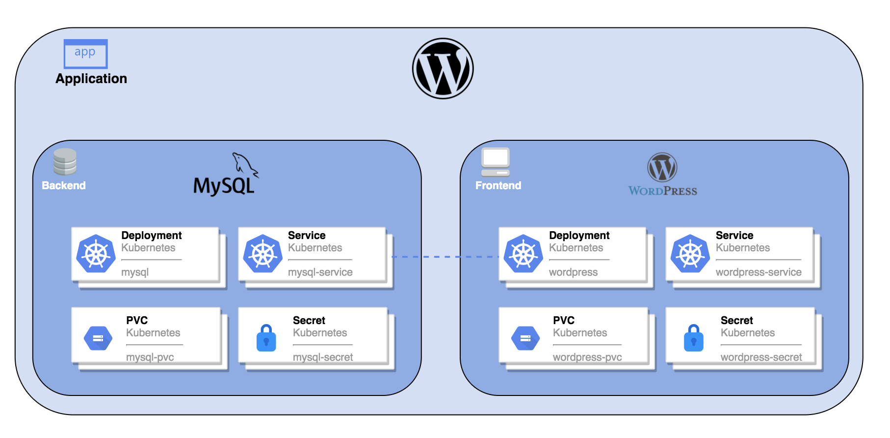

# 第6章 KubeSphere服务

## 2 创建并部署 WordPress

本节以安装 WordPress 为例，演示如何在 KubeSphere Web 控制台部署应用程序，并在集群外进行访问。

### 2.1 WordPress 简介

WordPress 是一款基于 PHP 的免费、开源内容管理系统，您可以使用 WordPress 搭建自己的网站。完整的 WordPress 应用程序包括以下 Kubernetes 对象，由 MySQL 作为后端数据库。



### 2.2 前提条件

- 准备一个项目（例如 **demo-project**）和一个已邀请到该项目的用户（例如 **project-regular**）。该用户在项目中应具有 **operator** 角色。有关更多信息，请参阅[控制用户权限](/devops/new/KubeSphere/01-%E7%AC%AC1%E7%AB%A0%20KubeSphere%E5%AE%89%E8%A3%85.html#_9-%E5%A6%82%E4%BD%95%E6%8E%A7%E5%88%B6%E7%94%A8%E6%88%B7%E6%9D%83%E9%99%90-%E3%80%90%E5%BF%AB%E9%80%9F%E4%BA%86%E8%A7%A3%E3%80%91)。
- KubeSphere 平台需要安装并启用 **KubeSphere 服务网格** 扩展组件。

### 2.3 操作步骤

#### 1. 创建保密字典

创建两个保密字典，分别用于设置 MySQL 和 WordPress 的 root 密码。

1. 使用 **project-regular** 用户登录 KubeSphere Web 控制台。
2. 点击**企业空间管理**，并进入项目所在的企业空间。
3. 在左侧导航栏，选择**配置** > **保密字典**。
4. 在页面左上角的下拉列表中选择项目 **demo-project**，然后点击**创建**。
5. 在**基本信息**页签，输入保密字典的基本信息（例如，将**名称**设置为 **mysql-secret**），点击**下一步**。
6. 在**数据配置**页签，点击**添加数据**添加键值对。
7. 将**键**和**值**分别设置为 **MYSQL_ROOT_PASSWORD** 和 **123456**，在页面右下角点击保存设置。
8. 点击**创建**以创建保密字典，用于为 MySQL 提供 root 密码。
9. 重复以上步骤创建一个名为 **wordpress-secret** 的保密字典，将**键**和**值**分别设置为 **WORDPRESS_DB_PASSWORD** 和 **123456**，用于为 WordPress 提供 root 密码。

#### 2. 创建持久卷声明

创建持久卷声明用于存储 WordPress 应用数据。

1. 在左侧导航栏，选择**存储** > **持久卷声明**，在页面右侧点击**创建**。
2. 在**基本信息**页签，输入持久卷声明的基本信息（例如，将**名称**设置为 **wordpress-pvc**），点击**下一步**。
3. 在**存储设置**页签，点击**下一步**。（创建方式：通过存储类创建 存储类：local 访问模式：RWO 卷容量：10G）
4. 在**高级设置**页签，点击**创建**即可。

```bash
$ kubectl get sc
NAME              PROVISIONER        RECLAIMPOLICY   VOLUMEBINDINGMODE      ALLOWVOLUMEEXPANSION   AGE
local (default)   openebs.io/local   Delete          WaitForFirstConsumer   false                  33d
nfs-csi-delete    nfs.csi.k8s.io     Delete          Immediate              true                   30d
nfs-csi-retain    nfs.csi.k8s.io     Retain          Immediate              true                   30d
```

#### 3 创建 MySQL 应用

创建 MySQL 应用为 WordPress 提供数据库服务。

1. 在左侧导航栏，选择**服务网格** > **自制应用**，在页面右侧点击**创建**。

2. 在**基本信息**页面，输入应用基本信息（例如，将**名称**设置为 **wordpress**），点击**下一步**。

3. 在**服务设置**页面，点击**创建服务**为自制应用创建一个服务。

4. 在**创建服务**对话框，点击**有状态服务**。

5. 在弹出的**创建有状态服务**对话框，输入有状态服务的名称（例如 **mysql**）并点击**下一步**。

6. 在**容器组设置**页签，点击**添加容器**。

7. 在搜索框中输入 **mysql:8.4**，按下回车键，向下滚动鼠标，点击**使用默认镜像端口**。

   :::danger

   此时配置还未完成，请不要在页面右下角点击。

   :::

8. 在**容器组设置**页签的**高级设置**区域，将内存上限设置为 1000 Mi 或以上，否则 MySQL 可能因内存不足而无法启动。

| CPU预留        | CPU限制        | 内存预留     | 内存上限   |
| :------------- | :------------- | :----------- | :--------- |
| 无预留（Core） | 无上限（Core） | 无预留（Mi） | 1000（Mi） |

9. 在**容器组设置**页签的**端口设置**区域，设置如下：

| 协议 | 名称     | 容器端口 | 服务端口 |
| :--- | :------- | :------- | :------- |
| TCP  | tcp-3306 | 3306     | 3306     |


10. 向下滚动鼠标到**环境变量**区域，选择**环境变量**，在下拉框中选择**来自保密字典**。参数设置如下：

| 来源   | 键              | 资源         | 资源中的键          |
| :----- | :-------------- | :----------- | ------------------- |
| 自定义 | MYSQL_ROOT_HOST | mysql-secret | MYSQL_ROOT_PASSWORD |

11. 点击保存配置，然后点击**下一步**。

12. 在**存储设置**页签，点击**添加持久卷声明模板**。

13. 输入 PVC 名称前缀（例如，**mysql**），并指定挂载路径（存储类：基于OpenEBS的**LocalPV**，模式：**RWO-读写**，路径：**/var/lib/mysql**）。

14. 点击保存配置，然后点击**下一步**。

15. 在**高级设置**页签，点击**创建**以创建 MySQL 应用。

#### 4 创建 WordPress 应用

1. 再次点击**创建服务**。在弹出的**创建服务**对话框，点击**无状态服务**。

2. 在弹出的**创建无状态服务**对话框，输入无状态服务的名称（例如，**wordpress**）并点击**下一步**。

3. 在**容器组设置**页签，点击**添加容器**。

4. 在搜索框中输入 **wordpress:4.8-apache**，按下回车键，向下滚动鼠标，点击**使用默认镜像端口**。

   | 说明                                                         |
      | :----------------------------------------------------------- |
   | 此时配置还未完成，请不要在页面右下角点击。 |

5. 向下滚动鼠标到**环境变量**区域，选择**环境变量**。此处需要添加两个环境变量，请按如下信息设置：

    - 在下拉框中选择**来自保密字典**，输入键名称 **WORDPRESS_DB_PASSWORD**，选择资源 **wordpress-secret** 和资源值 **WORDPRESS_DB_PASSWORD**。

    - 点击**添加环境变量**，分别输入键名称 **WORDPRESS_DB_HOST** 和值 **mysql**。

      | 说明                                                         |
           | :----------------------------------------------------------- |
      | **WORDPRESS_DB_HOST** 环境变量的值必须与[创建 MySQL 应用](https://www.kubesphere.io/zh/docs/v4.1/02-quickstart/05-deploy-wordpress/#_3_创建_mysql_应用)中创建的 MySQL 有状态服务的名称完全相同。否则，WordPress 将无法连接到 MySQL 数据库。 |

6. 点击保存配置，然后点击**下一步**。

7. 在**存储设置**页签，点击**挂载卷**。

8. 在**持久卷**页签，点击**选择持久卷声明**。

9. 选择已创建的 **wordpress-pvc**，将模式设置为**读写**，并输入挂载路径 **/var/www/html**。

10. 点击保存配置，再点击**下一步**。

11. 在**高级设置**页签，点击**创建**。

12. 在**服务**页面，点击**下一步**。

13. 在**路由设置**页面，点击**创建**以创建 WordPress。您可以在**自制应用**页面查看已创建的应用。

## 3 部署并访问 Bookinfo