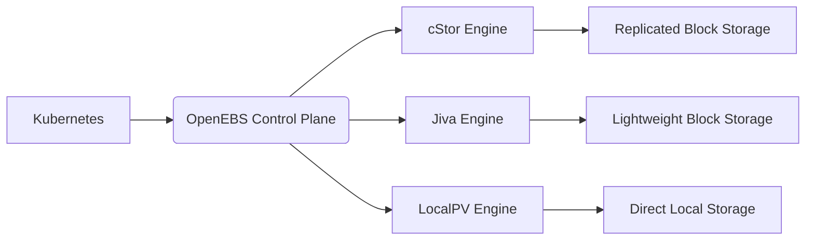

# kvd第1章 Kubeadmin安装K8S V1.23

单点版本：https://blog.csdn.net/Josh_scott/article/details/121961369?utm_medium=distribute.pc_relevant.none-task-blog-2~default~baidujs_title~default-0.pc_relevant_default&spm=1001.2101.3001.4242.1&utm_relevant_index=3

高可用版本：https://blog.csdn.net/qq_16538827/article/details/120175489

Kubeadm是一个K8s部署工具，提供kubeadm init和kubeadm join，用于快速部署Kubernetes集群。

## 0 先决条件

- 一台兼容的Linux主机。Kubernetes项目为基于Debian和Red Hat的Linux发行版一级一些不提供包管理器的发行版提供通用的指令。
- 每台机器 2GB 或更多的 RAM（如果少于这个数字将会影响你应用的运行内存）。
- 2CPU核心或更多
- 集群中的所有机器的网络彼此均能相互连接（公网和内网都可以）
  - **设置防火墙放行规则**
- 节点之中不可以有重复的主机名、MAC地址或product_uuid。请参考[这里](https://v1-29.docs.kubernetes.io/zh-cn/docs/setup/production-environment/container-runtimes/)了解更多详细信息。
  - **设置不同hostname**
- 开启机器上的某些端口。请参考[这里](https://v1-29.docs.kubernetes.io/zh-cn/docs/setup/production-environment/container-runtimes/)了解更多详细信息。
  - **内网互信**
- 禁用交换分区。为了保证 kubelet 正常工作，你**必须**禁用交换分区。
  - **永久关闭**
- <span style="color:red;font-weight:bold;font-size:20px;">若无特殊说明，下面都是使用root用户执行命令</span>

## 1 基础环境准备

### 1.1 服务器规划

| 机器名 | 系统类型 | IP地址          | CPU  | 内存 | 部署内容 |
| ------ | -------- | --------------- | ---- | ---- | -------- |
| emon   | Rocky9.5 | 192.168.200.116 | 2核  | >=2G | master   |
| emon2  | Rocky9.5 | 192.168.200.117 | 2核  | >=2G | worker   |
| emon3  | Rocky9.5 | 192.168.200.118 | 2核  | >=2G | worker   |

### 1.2 系统安装（所有节点）

[系统安装](http://localhost:8751/devops/new/Linux/01-%E7%AC%AC1%E7%AB%A0%20%E7%B3%BB%E7%BB%9F%E5%AE%89%E8%A3%85.html)

### 1.3 系统设置（所有节点）

#### 1.3.1 主机名

主机名必须每个节点都不一样（建议命名规范：数字+字母+中划线组合，不要包含其他特殊字符）。

```bash
# 查看主机名
$ hostname
# 设置主机名：注意修改为具体的主机名
$ hostnamectl set-hostname emon
```

#### 1.3.2 本地DNS

配置host，使得所有节点之间可以通过hostname互相访问。

```bash
$ sudo cat <<-'EOF' | sudo tee -a /etc/hosts
192.168.200.116	emon
192.168.200.117 emon2
192.168.200.118 emon3
EOF
```

#### 1.3.3 安装依赖包

```bash
# 更新yum
$ dnf update -y
# 安装依赖包
$ dnf install -y socat conntrack ipvsadm ipset jq sysstat curl iptables libseccomp yum-utils
```

#### 1.3.4 关闭防火墙、重置iptables、关闭swap、关闭selinux和dnsmasq

```bash
# 关闭防火墙
$ systemctl stop firewalld && systemctl disable firewalld

# 设置iptables规则
$ iptables -F && iptables -X && iptables -F -t nat && iptables -X -t nat && iptables -P FORWARD ACCEPT

# 关闭swap
$ swapoff -a
# 去掉swap开机启动
$ sed -i '/swap/s/^\(.*\)$/#\1/g' /etc/fstab

# 关闭selinux
$ setenforce 0
# 防止重启恢复
$ sed -i 's/^SELINUX=enforcing$/SELINUX=disabled/' /etc/selinux/config

# 关闭dnsmasq（否则可能导致docker容器无法解析域名）：如果没有该启动单元，可以忽略！
$ systemctl stop dnsmasq && systemctl disable dnsmasq
```

#### 1.3.5 系统参数设置

```bash
# 将桥接的IPv4流量传递到 iptables 的链：
$ cat > /etc/sysctl.d/kubernetes.conf <<EOF
net.bridge.bridge-nf-call-ip6tables = 1
net.bridge.bridge-nf-call-iptables = 1
net.ipv4.ip_nonlocal_bind = 1
net.ipv4.ip_forward = 1
vm.swappiness = 0
vm.overcommit_memory = 1
EOF

# 生效文件
$ sysctl -p /etc/sysctl.d/kubernetes.conf
```

> 如果执行sysctl -p报错：
>
> > sysctl: cannot stat /proc/sys/net/bridge/bridge-nf-call-ip6tables: 没有那个文件或目录
> >
> > sysctl: cannot stat /proc/sys/net/bridge/bridge-nf-call-iptables: 没有那个文件或目录
>
> 可能的原因分析：
>
> 1. **内核模块未加载**：
>    - `bridge` 和 `br_netfilter` 内核模块未激活
>    - 这些模块提供网络桥接和防火墙过滤功能
> 2. **系统配置问题**：
>    - 内核参数未正确设置
>    - 常见于新安装的系统或云服务器
> 3. **容器平台依赖**：
>    - Docker/Kubernetes 需要这些模块实现容器网络
>
> - 步骤一：确保模块持久化（重启后有效）
>
> ```bash
> # 创建模块加载配置文件
> $ cat <<EOF | sudo tee /etc/modules-load.d/br_netfilter.conf
> bridge
> br_netfilter
> EOF
> 
> # 验证配置
> $ sudo systemctl restart systemd-modules-load.service
> ```
>
> - 步骤二：配置后，再重新执行“生效文件”的命令
>
> ```bash
> # 生效文件
> $ sysctl -p /etc/sysctl.d/kubernetes.conf
> ```
>
> - 步骤三：验证
>
> ```bash
> # 检查参数是否生效
> sysctl net.bridge.bridge-nf-call-iptables
> sysctl net.bridge.bridge-nf-call-ip6tables
> 
> # 应返回：
> # net.bridge.bridge-nf-call-iptables = 1
> # net.bridge.bridge-nf-call-ip6tables = 1
> ```

#### 1.3.6 配置SSH免密登录（仅中转节点）

为了方便文件的copy我们选择一个中转节点（随便一个节点，可以是集群中的也可以是非集群中的），配置好跟其他所有节点的免密登录。这里选择emon节点：

```bash
# 看看是否已经存在rsa公钥
$ cat ~/.ssh/id_rsa.pub

# 如果不存在就创建一个新的
$ ssh-keygen -t rsa

# 把id_rsa.pub文件内容copy到其他机器的授权文件中
$ ssh-copy-id -i ~/.ssh/id_rsa.pub emon
$ ssh-copy-id -i ~/.ssh/id_rsa.pub emon2
$ ssh-copy-id -i ~/.ssh/id_rsa.pub emon3
```

#### 1.3.7 移除docker相关软件包（可选）

```bash
$ dnf remove -y docker* container-selinux
$ rm -f /etc/docker/daemon.json
$ rm -rf /var/lib/docker/
```

如果yum报告说以上安装包未安装，未匹配，未删除任何安装包，表示环境干净，没有历史遗留旧版安装。


## 2 安装基础工具（所有节点）

### 2.1 安装Docker

参考：[Docker的安装与配置.md](http://localhost:8751/devops/new/Docker/01-%E7%AC%AC1%E7%AB%A0%20Docker%E7%9A%84%E5%AE%89%E8%A3%85%E4%B8%8E%E9%85%8D%E7%BD%AE.html)


### 2.2 安装kubeadm/kubelet/kubectl

K8S依赖的Docker最佳版本： 20.10

https://github.com/kubernetes/kubernetes/blob/release-1.23/build/dependencies.yaml

1. 设置k8s源

参考：https://mirrors.aliyun.com/kubernetes/yum/repos/

:::code-group

```bash [CentOS7.5]
$ cat > /etc/yum.repos.d/kubernetes.repo << EOF
[kubernetes] 
name=Kubernetes
baseurl=https://mirrors.aliyun.com/kubernetes/yum/repos/kubernetes-el7-x86_64 
enabled=1 
gpgcheck=0 
repo_gpgcheck=0 
gpgkey=https://mirrors.aliyun.com/kubernetes/yum/doc/yum-key.gpg https://mirrors.aliyun.com/kubernetes/yum/doc/rpm-package-key.gpg 
EOF

# 可以更新/缓存，也可以忽略
$ yum clean all && yum makecache
```

```bash [Rocky9.5]
# 此操作会覆盖 /etc/yum.repos.d/kubernetes.repo 中现存的所有配置
$ cat > /etc/yum.repos.d/kubernetes.repo << EOF
[kubernetes] 
name=Kubernetes ARM
baseurl=https://mirrors.aliyun.com/kubernetes/yum/repos/kubernetes-el7-aarch64 
enabled=1 
gpgcheck=0 
repo_gpgcheck=0 
gpgkey=https://mirrors.aliyun.com/kubernetes/yum/doc/yum-key.gpg https://mirrors.aliyun.com/kubernetes/yum/doc/rpm-package-key.gpg 
EOF

# 可以更新/缓存，也可以忽略
$ dnf clean all && dnf makecache
```

:::

2. 可以查看所有仓库中所有k8s版本，并选择安装特定的版本

```bash
$ dnf list kubelet --showduplicates |sort -r
```

3. 安装kubeadm/kubelet/kubectl

```bash
# 某些 Linux 发行版（如 RHEL/CentOS/Rocky）的 YUM/DNF 配置中默认排除了 Kubernetes 相关包，这里临时禁用针对 Kubernetes 的排除规则，允许安装 kube* 开头的包
$ dnf install -y kubelet-1.23.17 kubeadm-1.23.17 kubectl-1.23.17 --disableexcludes=kubernetes
# kubeadm init 和 kubeadm join 都会触发启动 kubelet，但会给警告；但若直接启动 kubelet 则每隔几秒就会重启，因为它陷入了一个等待 kubeadm 指令的死循环。（master和worker节点），这里选择仅加入开机启动，并不直接启动。
$ systemctl enable kubelet
```

## 3 kubeadm创建集群（仅master节点）

### 3.0 预下载镜像（开启Docker代理可忽略）

- 查看依赖镜像

```bash
$ kubeadm config images list
```

- 配置并执行脚本

```bash
$ vim master_images.sh
```

```bash
#!/bin/bash

images=(
	kube-apiserver:v1.23.17
	kube-controller-manager:v1.23.17
	kube-scheduler:v1.23.17
	kube-proxy:v1.23.17
	pause:3.6
	etcd:3.5.6-0
	coredns/coredns:v1.8.6
)

for imageName in ${images[@]} ; do
    docker pull registry.cn-hangzhou.aliyuncs.com/google_containers/$imageName
#   docker tag registry.cn-hangzhou.aliyuncs.com/google_containers/$imageName  k8s.gcr.io/$imageName
done
# 若不希望制定kubeadm init的镜像--image-repository，这里可以放开docker tag到k8s.gcr.io
```

```bash
$ chmod +x master_images.sh
```

- 执行

```bash
$ sh master_images.sh
```

### 3.1 kubeadm init

- 初始化

```bash
# 在Master上执行，由于默认拉取镜像地址 k8s.gcr.io 国内无法访问，这里指定阿里云镜像仓库地址。
# 执行该步骤之前，也可以执行 kubeadm config images pull 预下载镜像
# 查看镜像 kubeadm config images list 查看默认配置 kubeadm config print init-defaults
# Classless Inter-Domain Routing (CIDR)，中文译为无类别域间路由，是互联网中用于更有效分配和路由 IP 地址（主要是 IPv4）的一种方法。
# --image-repository registry.cn-hangzhou.aliyuncs.com/google_containers 指定镜像地址，默认是 k8s.gcr.io
# 镜像地址也可以是 registry.aliyuncs.com/google_containers 请注意：没有开启Docker代理服务器时必须指定
# --control-plane-endpoint 是部署 Kubernetes HA 控制平面的关键步骤，单master节点时可以不配置，多master节点时必须指定，而且要有负载均衡器来解析该配置项到具体master节点。
$ kubeadm init \
--apiserver-advertise-address=192.168.200.116 \
--control-plane-endpoint=emon \
--kubernetes-version v1.23.17 \
--service-cidr=10.96.0.0/16 \
--pod-network-cidr=10.244.0.0/16

# 使用 kubectl 工具（Master&&Node节点）
$ mkdir -p $HOME/.kube 
$ sudo cp -i /etc/kubernetes/admin.conf $HOME/.kube/config 
$ sudo chown $(id -u):$(id -g) $HOME/.kube/config

# 【二选一】如果是root用户，可以使用如下配置替换上面：（与上面二选一）
export KUBECONFIG=/etc/kubernetes/admin.conf

# 【临时】无需执行，仅做记录参考
# ==============================初始化部分日志==============================
Your Kubernetes control-plane has initialized successfully!

To start using your cluster, you need to run the following as a regular user:

  mkdir -p $HOME/.kube
  sudo cp -i /etc/kubernetes/admin.conf $HOME/.kube/config
  sudo chown $(id -u):$(id -g) $HOME/.kube/config

Alternatively, if you are the root user, you can run:

  export KUBECONFIG=/etc/kubernetes/admin.conf

You should now deploy a pod network to the cluster.
Run "kubectl apply -f [podnetwork].yaml" with one of the options listed at:
  https://kubernetes.io/docs/concepts/cluster-administration/addons/

You can now join any number of control-plane nodes by copying certificate authorities
and service account keys on each node and then running the following as root:

  kubeadm join emon:6443 --token ldsakh.zkzpetkutui6ypmp \
        --discovery-token-ca-cert-hash sha256:7268baf811b3f1f2ca1e657fe90db99b8d3ed3f9efb8be03811b809d8efa5c5e \
        --control-plane 

Then you can join any number of worker nodes by running the following on each as root:

kubeadm join emon:6443 --token ldsakh.zkzpetkutui6ypmp \
        --discovery-token-ca-cert-hash sha256:7268baf811b3f1f2ca1e657fe90db99b8d3ed3f9efb8be03811b809d8efa5c5e
```

> 带有`–control-plane`的命令，是添加一个主节点；
>
> 不带有`–control-plane`的命令，是添加一个工作点；

- 等待一小会后，查看当前pods

```bash
$ kubectl get pods -n kube-system
NAME                           READY   STATUS    RESTARTS   AGE
coredns-bd6b6df9f-llqtt        0/1     Pending   0          10m
coredns-bd6b6df9f-lsj6h        0/1     Pending   0          10m
etcd-emon                      1/1     Running   0          10m
kube-apiserver-emon            1/1     Running   0          10m
kube-controller-manager-emon   1/1     Running   0          10m
kube-proxy-r2jpz               1/1     Running   0          10m
kube-scheduler-emon            1/1     Running   0          10m

$ kubectl get pods -n kube-system -o wide
NAME                           READY   STATUS    RESTARTS   AGE   IP                NODE     NOMINATED NODE   READINESS GATES
coredns-bd6b6df9f-llqtt        0/1     Pending   0          11m   <none>            <none>   <none>           <none>
coredns-bd6b6df9f-lsj6h        0/1     Pending   0          11m   <none>            <none>   <none>           <none>
etcd-emon                      1/1     Running   0          11m   192.168.200.116   emon     <none>           <none>
kube-apiserver-emon            1/1     Running   0          11m   192.168.200.116   emon     <none>           <none>
kube-controller-manager-emon   1/1     Running   0          11m   192.168.200.116   emon     <none>           <none>
kube-proxy-r2jpz               1/1     Running   0          11m   192.168.200.116   emon     <none>           <none>
kube-scheduler-emon            1/1     Running   0          11m   192.168.200.116   emon     <none>           <none>

$ kubectl get all
NAME                 TYPE        CLUSTER-IP   EXTERNAL-IP   PORT(S)   AGE
service/kubernetes   ClusterIP   10.96.0.1    <none>        443/TCP   12m

$ kubectl get nodes
NAME   STATUS     ROLES                  AGE   VERSION
emon   NotReady   control-plane,master   13m   v1.23.17
```

分析：coredns是Pending状态，表示缺少网络插件，下面开始安装网络插件！

网络插件列表： https://kubernetes.io/zh-cn/docs/concepts/cluster-administration/addons/

### 3.2 网络插件多选1-[Calico](https://www.tigera.io/project-calico/)（仅master节点）

GitHub： https://github.com/projectcalico/calico

官网：https://docs.tigera.io/archive

系统需求： https://docs.tigera.io/calico/latest/getting-started/kubernetes/requirements

#### 3.2.1 切换目录

```bash
$ cd
$ mkdir -pv /root/k8s_soft/k8s_v1.23.17 && cd /root/k8s_soft/k8s_v1.23.17
```

这部分我们部署kubernetes的网络查件 CNI。

文档地址：https://docs.projectcalico.org/getting-started/kubernetes/self-managed-onprem/onpremises

#### 3.2.2 下载文件与配置调整

文档中有两个配置，50以下节点和50以上节点，它们的主要区别在于这个：typha。
当节点数比较多的情况下，Calico 的 Felix组件可通过 Typha 直接和 Etcd 进行数据交互，不通过 kube-apiserver，降低kube-apiserver的压力。大家根据自己的实际情况选择下载。
下载后的文件是一个all-in-one的yaml文件，我们只需要在此基础上做少许修改即可。

```bash
# 下载calico.yaml文件
# $ curl https://projectcalico.docs.tigera.io/manifests/calico.yaml -O 会加载最新版本，对K8S版本V1.23.17不再适合。
# 兼容k8s v1.23.17版本，支持多架构的网络插件版本是 v3.24.5，可以如下执行；但若需要修改一些配置，可以先下载
# kubectl apply -f https://raw.githubusercontent.com/projectcalico/calico/v3.24.5/manifests/calico.yaml
$ curl https://docs.tigera.io/archive/v3.24/manifests/calico.yaml -O
```

修改IP自动发现：

> 当kubelet的启动参数中存在--node-ip的时候，以host-network模式启动的pod的status.hostIP字段就会自动填入kubelet中指定的ip地址。

```js
- name: IP
  value: "autodetect" // [!code --]
  valueFrom: // [!code ++]
    fieldRef: // [!code ++]
      fieldPath: status.hostIP // [!code ++]
```

修改CIDR：修改成你自己的pod-network-cidr网段的value，我这里是10.244.0.0/16

```js
# - name: CALICO_IPV4POOL_CIDR // [!code --]
#   value: "192.168.0.0/16" // [!code --]
- name: CALICO_IPV4POOL_CIDR // [!code ++]
  value: "10.244.0.0/16" // [!code ++]
```

#### 3.2.3 执行安装

```bash
# 生效之前查看
$ kubectl get nodes
NAME   STATUS     ROLES                  AGE     VERSION
emon   NotReady   control-plane,master   5m31s   v1.23.17
# 使之生效
$ kubectl apply -f calico.yaml
# 查看pod
$ kubectl get po -n kube-system
NAME                                       READY   STATUS    RESTARTS   AGE
calico-kube-controllers-577f77cb5c-g78c7   1/1     Running   0          13h
calico-node-hxvx8                          1/1     Running   0          13h
coredns-7f89b7bc75-8ks6f                   1/1     Running   0          14h
coredns-7f89b7bc75-kfdbm                   1/1     Running   0          14h
etcd-emon                                  1/1     Running   0          14h
kube-apiserver-emon                        1/1     Running   0          14h
kube-controller-manager-emon               1/1     Running   0          14h
kube-proxy-f2r8l                           1/1     Running   0          14h
kube-scheduler-emon                        1/1     Running   0          14h
# 查看node
$ kubectl get nodes
NAME    STATUS     ROLES                  AGE    VERSION
emon    Ready      control-plane,master   7m2s   v1.23.17
```

### 3.2 网络插件多选2-[Flannel](https://github.com/flannel-io/flannel#deploying-flannel-manually)（仅master节点）

#### 3.2.1 切换目录

```bash
$ cd
$ mkdir -pv /root/k8s_soft/k8s_v1.23.17 && cd /root/k8s_soft/k8s_v1.23.17
```

#### 3.2.2 下载文件

Flannel是配置为Kubernetes设计的第3层网络结构的一种简单易行的方法。

For Kubernetes v1.17+

```bash
$ wget https://github.com/flannel-io/flannel/releases/download/v0.25.4/kube-flannel.yml
```

#### 3.2.3 执行安装

```bash
# 查看nodes
$ kubectl get nodes
NAME   STATUS     ROLES                  AGE   VERSION
emon   NotReady   control-plane,master   16m   v1.23.17
# 安装
$ kubectl apply -f kube-flannel.yml
# 查看pods
$ kubectl get po -n kube-system -o wide
NAME                           READY   STATUS    RESTARTS   AGE     IP               NODE   NOMINATED NODE   READINESS GATES
coredns-bd6b6df9f-72cb6        1/1     Running   0          3m3s    10.244.0.3       emon   <none>           <none>
coredns-bd6b6df9f-nqfn5        1/1     Running   0          3m3s    10.244.0.2       emon   <none>           <none>
etcd-emon                      1/1     Running   0          3m17s   192.168.32.116   emon   <none>           <none>
kube-apiserver-emon            1/1     Running   0          3m18s   192.168.32.116   emon   <none>           <none>
kube-controller-manager-emon   1/1     Running   0          3m15s   192.168.32.116   emon   <none>           <none>
kube-proxy-cbb2x               1/1     Running   0          3m3s    192.168.32.116   emon   <none>           <none>
kube-scheduler-emon            1/1     Running   0          3m17s   192.168.32.116   emon   <none>           <none>
$ kubectl get nodes
NAME   STATUS   ROLES                  AGE     VERSION
emon   Ready    control-plane,master   4m29s   v1.23.17
```

### 3.3 加入节点到集群（仅worker节点）

- 加入集群

```bash
# kubeadm init的执行结果中有如下命令，在各个worker节点执行加入即可
$ kubeadm join emon:6443 --token ldsakh.zkzpetkutui6ypmp \
        --discovery-token-ca-cert-hash sha256:7268baf811b3f1f2ca1e657fe90db99b8d3ed3f9efb8be03811b809d8efa5c5e
```

- 查看节点

```bash
# 等节点加入成功，过一会查看得到
$ kubectl get nodes
NAME    STATUS   ROLES                  AGE   VERSION
emon    Ready    control-plane,master   19m   v1.23.17
emon2   Ready    <none>                 82s   v1.23.17
emon3   Ready    <none>                 45s   v1.23.17
# 此时，worker节点上的容器实例如下：
$ docker images
REPOSITORY                   TAG        IMAGE ID       CREATED        SIZE
hello-world                  latest     f1f77a0f96b7   4 months ago   5.2kB # docker测试产生的
registry.k8s.io/kube-proxy   v1.23.17   d3c3d806adc6   2 years ago    107MB
calico/cni                   v3.24.5    efd8ebfc4b4f   2 years ago    190MB
registry.k8s.io/pause        3.6        7d46a07936af   3 years ago    484kB
```

### 3.4 虚拟机挂起并恢复后k8s网络问题（所有节点）

问题描述：虚拟机挂起并恢复后，各个节点通信会出问题，设置“未托管”后解决。

<span style="color:red;font-weight:bold;">解决前查看网络如下效果：</span>

```bash
# 主节点网络
$ nmcli device status
DEVICE           TYPE      STATE         CONNECTION 
ens160           ethernet  已连接        ens160     
docker0          bridge    连接（外部）  docker0    
lo               loopback  连接（外部）  lo         
tunl0            iptunnel  已断开        --         
cali4969f0a9f96  ethernet  未托管        --         
cali67f6c4be37a  ethernet  未托管        --         
cali6cd2b22a701  ethernet  未托管        --   
# 子节点网络
$ nmcli device status
DEVICE   TYPE      STATE         CONNECTION 
ens160   ethernet  已连接        ens160     
docker0  bridge    连接（外部）  docker0    
lo       loopback  连接（外部）  lo         
tunl0    iptunnel  已断开        --  
```

<span style="color:#32CD32;font-weight:bold;">解决后查看网络如下效果：</span>

```bash
# 主节点网络
$ nmcli device status
DEVICE           TYPE      STATE         CONNECTION 
ens160           ethernet  已连接        ens160     
lo               loopback  连接（外部）  lo         
docker0          bridge    未托管        --         
cali4969f0a9f96  ethernet  未托管        --         
cali67f6c4be37a  ethernet  未托管        --         
cali6cd2b22a701  ethernet  未托管        --         
tunl0            iptunnel  未托管        -- 
# 子节点网络
$ nmcli device status
DEVICE   TYPE      STATE         CONNECTION 
ens160   ethernet  已连接        ens160     
lo       loopback  连接（外部）  lo         
docker0  bridge    未托管        --         
tunl0    iptunnel  未托管        --  
```

- 查看设备状态

```bash
$ nmcli device status
```

- 永久unmanaged

```bash
$ tee /etc/NetworkManager/conf.d/99-unmanaged-devices.conf << EOF
[keyfile]
unmanaged-devices=interface-name:docker*;interface-name:veth*;interface-name:br-*;interface-name:vmnet*;interface-name:vboxnet*;interface-name:cni0;interface-name:cali*;interface-name:flannel*;interface-name:tun*
EOF
```

- 重启NetworkManager

```bash
$ systemctl restart NetworkManager
```

## 4 部署dashboard（在master节点执行）

[kubernetes官方提供的可视化界面](https://github.com/kubernetes/dashboard)

### 4.1 部署

版本兼容性：https://github.com/kubernetes/dashboard/releases 

可以得知dashboard v2.5.1 兼容 kubernetes v1.23 版本

[dashboard v2.5.1文档](https://github.com/kubernetes/dashboard/tree/v2.5.1)

1. 安装

```bash
$ kubectl apply -f https://raw.githubusercontent.com/kubernetes/dashboard/v2.5.1/aio/deploy/recommended.yaml
```

> 若无法下载文件，先执行下载 `curl https://raw.githubusercontent.com/kubernetes/dashboard/v2.5.1/aio/deploy/recommended.yaml -O` 再执行 `kubectl apply -f recommended.yaml`

2. 设置访问端口

  - 方式一：手工编辑

  ```bash
$ kubectl edit svc kubernetes-dashboard -n kubernetes-dashboard
  ```

  显示变更的部分：

  ```js
spec:
  clusterIP: 10.96.11.88
  clusterIPs:
  - 10.96.11.88
  internalTrafficPolicy: Cluster
  ipFamilies:
  - IPv4
  ipFamilyPolicy: SingleStack
  ports:
  - port: 443
    protocol: TCP
    targetPort: 8443
  selector:
    k8s-app: kubernetes-dashboard
  sessionAffinity: None
  type: ClusterIP // [!code --] [!code focus:2]
  type: NodePort // [!code ++]
status:
  loadBalancer: {}
  ```

  访问地址：`kubectl get svc -n kubernetes-dashboard` 查看暴露的随机端口。

  > 示例：
  >
  > ```bash
  > $ kubectl get svc -n kubernetes-dashboard
  > NAME                        TYPE        CLUSTER-IP    EXTERNAL-IP   PORT(S)         AGE
  > dashboard-metrics-scraper   ClusterIP   10.96.40.11   <none>        8000/TCP        19m
  > kubernetes-dashboard        NodePort    10.96.11.88   <none>        443:30443/TCP   19m
  > ```
  >
  > 可以看到端口 30443

  - 方式二：命令调整

  ```bash
$ kubectl patch svc kubernetes-dashboard -n kubernetes-dashboard \
  -p '{"spec": {"type": "NodePort", "ports": [{"port": 443, "nodePort": 30443}]}}'
  ```

  访问地址：
  https://<节点IP>:30443

---


<span style="color:red;font-weight:bold;">chrome不让访问无效证书的https网站，如何处理？</span>

⚠️ 方法一：直接输入忽略命令（最简单快速）

当看到 **`您的连接不是私密连接`** 或 **`NET::ERR_CERT_INVALID`** 错误页面时：

1. **将光标点击到错误页面空白处**（确保地址栏未激活）。

2. **直接输入**（无需粘贴）以下英文单词：

   ```
   thisisunsafe
   ```

3. 页面会自动刷新并允许访问。

> ✅ **优点**：无需重启浏览器或修改配置。
> ❌ **缺点**：每次访问新端口或重启服务后需重新输入。


---


访问通过后，可以看到如下界面：


---

3. 创建访问账号

[创建访问账号](https://github.com/kubernetes/dashboard/blob/v2.5.1/docs/user/access-control/creating-sample-user.md)

```bash
$ tee dashboard-adminuser.yaml <<EOF
# 我们首先在命名空间 kubernetes-dashboard 中创建名为 admin-user 的服务账户。
apiVersion: v1
kind: ServiceAccount
metadata:
  name: admin-user
  namespace: kubernetes-dashboard
---
# 在大多数情况下，使用 kops 、 kubeadm 或其他流行工具配置集群后， ClusterRole cluster-admin 在集群中已经存在。我们可以使用它，并仅为我们的 ServiceAccount 创建一个 ClusterRoleBinding 。如果不存在，则需要首先创建此角色，并手动授予所需权限。
apiVersion: rbac.authorization.k8s.io/v1
kind: ClusterRoleBinding
metadata:
  name: admin-user
roleRef:
  apiGroup: rbac.authorization.k8s.io
  kind: ClusterRole
  name: cluster-admin
subjects:
- kind: ServiceAccount
  name: admin-user
  namespace: kubernetes-dashboard
EOF
```

```bash
$ kubectl apply -f dashboard-adminuser.yaml
```

4. 获取 Bearer 令牌

```bash
$ kubectl -n kubernetes-dashboard get secret $(kubectl -n kubernetes-dashboard get sa/admin-user -o jsonpath="{.secrets[0].name}") -o go-template="{{.data.token | base64decode}}"
```

它应该会打印出类似以下内容：

```bash
eyJhbGciOiJSUzI1NiIsImtpZCI6InAxYVVVQWpYTFBZbzVianl5c1VKOUt1MGFtT25GNjFxTDlMOV9md09sYlkifQ.eyJpc3MiOiJrdWJlcm5ldGVzL3NlcnZpY2VhY2NvdW50Iiwia3ViZXJuZXRlcy5pby9zZXJ2aWNlYWNjb3VudC9uYW1lc3BhY2UiOiJrdWJlcm5ldGVzLWRhc2hib2FyZCIsImt1YmVybmV0ZXMuaW8vc2VydmljZWFjY291bnQvc2VjcmV0Lm5hbWUiOiJhZG1pbi11c2VyLXRva2VuLWp2MnRrIiwia3ViZXJuZXRlcy5pby9zZXJ2aWNlYWNjb3VudC9zZXJ2aWNlLWFjY291bnQubmFtZSI6ImFkbWluLXVzZXIiLCJrdWJlcm5ldGVzLmlvL3NlcnZpY2VhY2NvdW50L3NlcnZpY2UtYWNjb3VudC51aWQiOiI2YmFjZTU0YS0zNTliLTRhNjYtOTFiMi04MWEyODMzZDI1MDciLCJzdWIiOiJzeXN0ZW06c2VydmljZWFjY291bnQ6a3ViZXJuZXRlcy1kYXNoYm9hcmQ6YWRtaW4tdXNlciJ9.T1UTl_dlX1zW09VAI3lGIYmqQI3b3Sy194KKO2HxcR7zUuf_8P8HrXivcvva3U8r7BdrKmo4aSoh-12CdjY6tui5jvg_Wmp9n212AZOhI47mQzDW4IiDRU-37Iv6yg-FRc4OnGJipYOnoAWHUxSwiVAhiCtL9PgZ9vIIde0z8EcwTWGJ896S6ugN0wBrPJHwCH3IkPRVwloPkLX9A1UQnEiSZOTHzJvvr_cAc3D95XjBT9NIvmjgHXcve74LnEE_SngJ-b-9fyqxYdzyknrGmnwNrhwle30rlr9lBSby_4x51_a7V7fK8EzgIoafNYcdIVWSE1iLtA4x-Qw-NBTvNQ
```

现在复制该令牌，并将其粘贴到登录界面的 `Enter token` 字段中。


点击 `Sign in` 按钮，搞定。你现在已以管理员身份登录。

5. 界面


### 4.2 卸载

- 删除管理员 `ServiceAccount` 和 `ClusterRoleBinding` 

```bash
$ kubectl -n kubernetes-dashboard delete serviceaccount admin-user
$ kubectl -n kubernetes-dashboard delete clusterrolebinding admin-user
```

- 卸载dashboard组件

```bash
$ kubectl delete -f https://raw.githubusercontent.com/kubernetes/dashboard/v2.5.1/aio/deploy/recommended.yaml
```

### 4.3 同类型软件核心对比表

| **特性**          | **Kubernetes Dashboard** | **KubeSphere**                            | **Rancher**                     |
| :---------------- | :----------------------- | :---------------------------------------- | :------------------------------ |
| **项目背景**      | Kubernetes 官方项目      | 青云开源 (CNCF 项目)                      | Rancher Labs (现属 SUSE)        |
| **定位**          | 单集群 Web UI            | **全栈容器平台**                          | **企业级多集群管理**            |
| **多集群管理**    | ❌ 仅单集群               | ✅ 支持                                    | ✅ **核心优势** (混合云/多云)    |
| **部署复杂度**    | ⭐ 简单 (`kubectl apply`) | ⭐⭐⭐ 中等 (需规划存储/网络)                | ⭐⭐ 中等 (Helm 部署)             |
| **应用商店**      | ❌ 无                     | ✅ **内置** (300+ Helm Charts)             | ✅ **内置** (支持自定义 Catalog) |
| **DevOps 流水线** | ❌ 无                     | ✅ **完整集成** (Jenkins/SonarQube/GitOps) | ✅ 支持 (需集成外部工具)         |
| **监控告警**      | ❌ 基础指标               | ✅ **开箱即用** (Prometheus+Grafana+告警)  | ✅ 集成 (需额外配置)             |
| **日志管理**      | ❌ 仅 Pod 日志            | ✅ **ELK/Fluentd 集成**                    | ❌ 需自行搭建                    |
| **服务网格**      | ❌ 无                     | ✅ **内置 Istio**                          | ❌ 需手动集成                    |
| **多租户隔离**    | ⭐ RBAC 基础控制          | ✅ **企业级租户体系**                      | ✅ **细粒度 RBAC+项目隔离**      |
| **边缘计算支持**  | ❌ 无                     | ✅ **KubeEdge 集成**                       | ✅ **K3s 轻量集群**              |
| **UI 体验**       | ⭐ 功能导向 (简洁)        | ⭐⭐⭐ **现代化控制台** (多模块集成)         | ⭐⭐ 功能丰富 (学习曲线稍陡)      |
| **最佳适用场景**  | 开发调试/单集群运维      | **企业级全栈平台** (DevOps+微服务+监控)   | **混合云/大规模集群舰队管理**   |

**总结建议**

- **选 Kubernetes Dashboard 如果**：
  需要轻量级 K8s 操作界面，且仅管理单个集群。
- **选 KubeSphere 如果**：
  构建 **一体化企业平台**（尤其需要开箱即用的 DevOps/微服务/监控）。
- **选 Rancher 如果**：
  管理 **跨云/混合云集群舰队** 或专注 **集群生命周期管理**。

> 💡 **组合策略**：大型企业可同时使用 Rancher（多集群治理） + KubeSphere（集群内应用平台），通过 Rancher 纳管部署了 KubeSphere 的集群。

## 5 安装ingress-nginx（在master节点执行）

[ingress-nginx GitHub查看与K8S版本兼容性](https://github.com/kubernetes/ingress-nginx)

ingress-nginx官网部署：https://kubernetes.github.io/ingress-nginx/deploy/

ingress-nginx官网用户指南：https://kubernetes.github.io/ingress-nginx/user-guide/nginx-configuration/

### 5.1 切换目录

```bash
$ cd
$ mkdir -pv /root/k8s_soft/k8s_v1.23.17 && cd /root/k8s_soft/k8s_v1.23.17
```

### 5.2 下载文件与配置调整

```bash
# 下载 https://github.com/kubernetes/ingress-nginx/blob/controller-v1.6.4/deploy/static/provider/cloud/deploy.yaml 到 ingress-nginx.yaml
# 若 raw.githubusercontent.com 无法访问，可以通过 https://www.ipaddress.com 查询其ip地址并配置本地dns
$ curl https://raw.githubusercontent.com/kubernetes/ingress-nginx/controller-v1.6.4/deploy/static/provider/cloud/deploy.yaml -o ingress-nginx.yaml
```

#### 5.2.1 调整镜像

若不调整，下载后可能是这样的镜像：

```bash
registry.k8s.io/ingress-nginx/controller   <none>     81a20af4ae3c   2 years ago   282MB
registry.k8s.io/ingress-nginx/kube-webhook-certgen   <none>     7650062bc6ee   2 years ago     44.9MB
```

- 调整镜像名称

```bash
$ sed -i.bak 's/image: registry.k8s.io\/ingress-nginx\/controller:v1.6.3@sha256:b92667e0afde1103b736e6a3f00dd75ae66eec4e71827d19f19f471699e909d2/image: registry.k8s.io\/ingress-nginx\/controller:v1.6.3/g;s/image: registry.k8s.io\/ingress-nginx\/kube-webhook-certgen:v20220916-gd32f8c343@sha256:39c5b2e3310dc4264d638ad28d9d1d96c4cbb2b2dcfb52368fe4e3c63f61e10f/image: registry.k8s.io\/ingress-nginx\/kube-webhook-certgen:v20220916-gd32f8c343/g' ingress-nginx.yaml
```

> 说明：源文件备份到 ingress-nginx.yaml.bak

#### 5.2.2 调整Service

- 调整Service的type为 NodePort 并固定 nodePort 为80和443

显示变更的部分：

```js
apiVersion: v1
kind: Service
metadata: 
  labels:
    app.kubernetes.io/component: controller
    app.kubernetes.io/instance: ingress-nginx
    app.kubernetes.io/name: ingress-nginx
    app.kubernetes.io/part-of: ingress-nginx
    app.kubernetes.io/version: 1.6.3
  name: ingress-nginx-controller
  namespace: ingress-nginx
spec:
  externalTrafficPolicy: Local
  ipFamilies:
  - IPv4
  ipFamilyPolicy: SingleStack
  ports:
  - appProtocol: http
    name: http
    port: 80
    protocol: TCP
    targetPort: http
    nodePort: 80 // [!code ++] [!code focus]
  - appProtocol: https
    name: https
    port: 443
    protocol: TCP
    targetPort: https
    nodePort: 443 // [!code ++] [!code focus]
  selector:
    app.kubernetes.io/component: controller
    app.kubernetes.io/instance: ingress-nginx
    app.kubernetes.io/name: ingress-nginx
  type: LoadBalancer // [!code --] [!code focus:2]
  type: NodePort // [!code ++]
```

- 调整nodePort允许的端口范围（在master节点）

上面直接设置为80和443会报错：nodePort: Invalid value valid ports is 30000-32767

> 使用`kubectl apply`安装时报错：
>
> <span style="color:red;font-weight:bold;">The Service "ingress-nginx-controller" is invalid: spec.ports[0].nodePort: Invalid value: 80: provided port is not in the valid range. The range of valid ports is 30000-32767</span>

是因为k8s的node节点的端口默认被限制在30000-32767的范围。

修改node节点的允许范围：

```bash
$ vim /etc/kubernetes/manifests/kube-apiserver.yaml 
```

在 spec.containers.command 中找到`- --service-cluster-ip-range`，并在其后增加一行：

```bash
    - --service-node-port-range=1-65535
```

- 重启

```bash
$ systemctl daemon-reload && systemctl restart kubelet
```

#### 5.2.3 调整Deployment

修改kind模式 Deployment ==> DaemonSet

```js
apiVersion: apps/v1
kind: Deployment // [!code --] [!code focus:2]
kind: DaemonSet // [!code ++]
metadata:
  labels:
    app.kubernetes.io/component: controller
    app.kubernetes.io/instance: ingress-nginx
    app.kubernetes.io/name: ingress-nginx
    app.kubernetes.io/part-of: ingress-nginx
    app.kubernetes.io/version: 1.6.3
  name: ingress-nginx-controller
```

### 5.3 安装ingress-nginx

- 安装插件（master节点）

```bash
# 配置资源
$ kubectl apply -f ingress-nginx.yaml
# 查看
$ kubectl get all -n ingress-nginx -o wide
NAME                                       READY   STATUS      RESTARTS   AGE   IP               NODE    NOMINATED NODE   READINESS GATES
pod/ingress-nginx-admission-create-b7mrj   0/1     Completed   0          70s   10.244.161.5     emon3   <none>           <none>
pod/ingress-nginx-admission-patch-rcgvw    0/1     Completed   0          70s   10.244.108.111   emon2   <none>           <none>
pod/ingress-nginx-controller-52dd7         1/1     Running     0          70s   10.244.161.7     emon3   <none>           <none>
pod/ingress-nginx-controller-n4mwx         1/1     Running     0          70s   10.244.108.112   emon2   <none>           <none>

NAME                                         TYPE        CLUSTER-IP     EXTERNAL-IP   PORT(S)                 AGE   SELECTOR
service/ingress-nginx-controller             NodePort    10.96.217.34   <none>        80:80/TCP,443:443/TCP   71s   app.kubernetes.io/component=controller,app.kubernetes.io/instance=ingress-nginx,app.kubernetes.io/name=ingress-nginx
service/ingress-nginx-controller-admission   ClusterIP   10.96.60.43    <none>        443/TCP                 71s   app.kubernetes.io/component=controller,app.kubernetes.io/instance=ingress-nginx,app.kubernetes.io/name=ingress-nginx

NAME                                      DESIRED   CURRENT   READY   UP-TO-DATE   AVAILABLE   NODE SELECTOR            AGE   CONTAINERS   IMAGES                                            SELECTOR
daemonset.apps/ingress-nginx-controller   2         2         2       2            2           kubernetes.io/os=linux   71s   controller   registry.k8s.io/ingress-nginx/controller:v1.6.3   app.kubernetes.io/component=controller,app.kubernetes.io/instance=ingress-nginx,app.kubernetes.io/name=ingress-nginx

NAME                                       COMPLETIONS   DURATION   AGE   CONTAINERS   IMAGES                                                                    SELECTOR
job.batch/ingress-nginx-admission-create   1/1           4s         71s   create       registry.k8s.io/ingress-nginx/kube-webhook-certgen:v20220916-gd32f8c343   controller-uid=59ba2850-e57d-4ed5-9968-c37aefd14a32
job.batch/ingress-nginx-admission-patch    1/1           2s         70s   patch        registry.k8s.io/ingress-nginx/kube-webhook-certgen:v20220916-gd32f8c343   controller-uid=144e3f71-16fe-4837-bf3a-e17a759e655e
```

### 5.4 测试服务

#### 5.5.1 ingress-test.yaml配置

:::details ingress-test.yaml配置

```bash
$ tee ingress-test.yaml << EOF
#deploy
apiVersion: apps/v1
kind: Deployment
metadata:
  name: nginx-deploy
spec:
  selector:
    matchLabels:
      app: nginx-pod
  replicas: 1
  template:
    metadata:
      labels:
        app: nginx-pod
    spec:
      containers:
      - name: nginx
        image: nginx:1.25.4
        ports:
        - containerPort: 80

---      
#deploy
apiVersion: apps/v1
kind: Deployment
metadata:
  name: tomcat-deploy
spec:
  selector:
    matchLabels:
      app: tomcat-pod
  replicas: 1
  template:
    metadata:
      labels:
        app: tomcat-pod
    spec:
      containers:
      - name: tomcat
        image: tomcat:8.5-jre8-slim
        ports:
        - containerPort: 8080
        
---
#service
apiVersion: v1
kind: Service
metadata:
  name: nginx-service
spec:
  selector:
    app: nginx-pod
  type: ClusterIP
  ports:
  - protocol: TCP
    port: 80
    targetPort: 80

---
#service
apiVersion: v1
kind: Service
metadata:
  name: tomcat-service
spec:
  selector:
    app: tomcat-pod
  type: ClusterIP
  ports:
  - protocol: TCP
    port: 80
    targetPort: 8080

---
#ingress
#old version: extensions/v1beta1
apiVersion: networking.k8s.io/v1
kind: Ingress
metadata:
  name: ingress-http
spec:
  ingressClassName: nginx
  rules:
  - host: nginx.fsmall.com
    http:
      paths:
      - path: /
        pathType: Prefix
        backend:
          service:
            name: nginx-service
            port:
              number: 80
  - host: tomcat.fsmall.com
    http:
      paths:
      - path: /
        pathType: Prefix
        backend:
          service:
            name: tomcat-service
            port:
              number: 80
EOF
```

:::

配置资源生效：

:::code-group

```bash [创建]
$ kubectl apply -f ingress-test.yaml
```

```bash [在集群内通过目标scv访问]
# 查看service
$ kubectl get svc
NAME             TYPE        CLUSTER-IP      EXTERNAL-IP   PORT(S)   AGE
kubernetes       ClusterIP   10.96.0.1       <none>        443/TCP   5d
nginx-service    ClusterIP   10.96.236.244   <none>        80/TCP    9m43s
tomcat-service   ClusterIP   10.96.8.65      <none>        80/TCP    9m43s

# 命令行访问service
$ curl 10.96.236.244:80
$ curl 10.96.8.65:80
```

```bash [在集群内通过ing的svc访问]
# 查看ingress的NodePort地址
$ kubectl get svc -n ingress-nginx
NAME                                 TYPE        CLUSTER-IP     EXTERNAL-IP   PORT(S)                 AGE
ingress-nginx-controller             NodePort    10.96.217.34   <none>        80:80/TCP,443:443/TCP   15m
ingress-nginx-controller-admission   ClusterIP   10.96.60.43    <none>        443/TCP                 15m
# 命令行访问service
$ curl  -H "Host: nginx.fsmall.com" 10.96.217.34:80
$ curl  -H "Host: tomcat.fsmall.com" 10.96.217.34:80
```

```bash [在集群外通过ing域名访问]
$ kubectl get ing
NAME           CLASS   HOSTS                                ADDRESS        PORTS   AGE
ingress-http   nginx   nginx.fsmall.com,tomcat.fsmall.com   10.96.217.34   80      11m

# 配置本地DNS：访问emon2或emon3的DNS
$ vim /etc/hosts
192.168.200.117 nginx.fsmall.com
192.168.200.118 tomcat.fsmall.com
192.168.200.117 api.fsmall.com

# 访问
http://nginx.fsmall.com # 看到正常nginx界面
http://tomcat.fsmall.com # 看到正常tomcat界面
http://api.fsmall.com # 看到 nginx 的 404 页面
```

```bash [删除]
$ kubectl delete -f ingress-test.yaml
```

:::

### 5.5 其他

- ingress服务安装后，确保集群中存在名为 `nginx` 的 IngressClass：

```bash
$ kubectl get ingressclass -n ingress-nginx
```

- 若`kind: Ingress`创建后，查看`<ingress-pod-name>`是否生成规则

```bash
# 查看ingress-pod-name，确认 Nginx Ingress Controller 已安装且 Pod 正常运行：
$ kubectl get po -n ingress-nginx|grep ingress-nginx-controller
# 查看生成的Nginx配置
$ kubectl exec -n ingress-nginx -it <ingress-pod-name> -- cat /etc/nginx/nginx.conf
```

- 若并没有生成规则，检查 Ingress Controller 日志是否有错误：

```bash
$ kubectl logs -n ingress-nginx <ingress-pod-name>
```


## 6 集群冒烟测试（在master节点执行）

### 6.1 创建nginx-ds

:::details nginx-ds.yaml配置

```bash
$ tee nginx-ds.yaml << EOF
apiVersion: v1
kind: Service
metadata:
  name: nginx-ds
  labels:
    app: nginx-ds
spec:
  type: NodePort
  selector:
    app: nginx-ds
  ports:
  - name: http
    port: 80
    targetPort: 80
---
apiVersion: apps/v1
kind: DaemonSet
metadata:
  name: nginx-ds
spec:
  selector:
    matchLabels:
      app: nginx-ds
  template:
    metadata:
      labels:
        app: nginx-ds
    spec:
      containers:
      - name: my-nginx
        image: nginx:1.25.4
        ports:
        - containerPort: 80
EOF
```

:::

- 创建

```bash
$ kubectl apply -f nginx-ds.yaml
```

### 6.2 检查各种ip连通性

```bash
# 检查各 Node 上的 Pod IP 连通性
$ kubectl get pods -o wide

# 在每个worker节点上ping pod ip
# 主节点： kubectl get pods -o wide|grep nginx-ds|awk '{print $6}'| xargs -I {} ping -c 1 "{}"
$ ping <pod-ip>

# 检查service可达性
$ kubectl get svc

# 在每个worker节点上访问服务，这里的<port>表示集群内（非NodePort端口）
$ curl <service-ip>:<port>

# 在每个节点检查node-port可用性
$ curl <node-ip>:<port>
```

### 6.3 检查dns可用性

:::code-group

```bash [配置]
$ cat > nginx-pod.yaml <<EOF
apiVersion: v1
kind: Pod
metadata:
  name: nginx
spec:
  containers:
  - name: nginx
    image: docker.io/library/nginx:1.25.4
    ports:
    - containerPort: 80
EOF
```

```bash [创建]
$ kubectl apply -f nginx-pod.yaml
```

```bash [进入pod查看dns]
$ kubectl exec nginx -it -- cat /etc/resolv.conf
```

```bash [验证解析]
$ kubectl exec nginx -it -- curl nginx-ds
```

```bash [删除]
$ kubectl delete -f nginx-pod.yaml
```

:::

### 6.4 日志功能

测试使用kubectl查看pod的容器日志

```bash
$ kubectl get pods
# 命令行输出结果
NAME             READY   STATUS    RESTARTS   AGE
nginx            1/1     Running   0          54s
nginx-ds-dkfjm   1/1     Running   0          2m54s
nginx-ds-rx6mj   1/1     Running   0          2m54s

# 查看日志
$ kubectl logs <pod-name>
```

### 6.5 Exec功能

测试kubectl的exec功能

```bash
# 查询指定标签的pod
$ kubectl get pods -l app=nginx-ds
$ kubectl exec -it <nginx-pod-name> -- nginx -v
```

### 6.6 删除nginx-ds

```bash
$ kubectl delete -f nginx-ds.yaml
```

## 7 存储方案

<span style="color:red;font-weight:bold;">在docker中，以前是将docker内部目录挂载到机器上，但是在k8s中如果将目录挂载到机器上，如果某个节点的容器挂了，比如MySQL，k8s的自愈机制会在其它节点再拉起一份，那就会导致原来的数据丢失了，所以在k8s中需要应用到存储层：比如NFS、OpenEBS，k8s会将这些容器的数据全部存在存储层，而这个存储层会在所有节点都有一份。</span>

### 7.1 部署NFS

#### 7.1.1 安装 NFS 服务端软件包（所有节点）

```bash
$ dnf install -y nfs-utils
```

#### 7.1.2 创建共享数据根目录（在master节点执行）

```bash
$ mkdir -pv /data/nfs/local
$ chown nobody:nobody /data/nfs/local
```

#### 7.1.3 编辑服务配置文件（在master节点执行）

配置 NFS 服务器数据导出目录及访问 NFS 服务器的客户端机器权限。

编辑配置文件 `vim /etc/exports`，添加如下内容：

```bash
# nfs服务端
$ echo "/data/nfs/local 192.168.200.0/24(rw,sync,all_squash,anonuid=65534,anongid=65534,no_subtree_check)" > /etc/exports
```

- /data/nfs/local：NFS 导出的共享数据目录
- 192.168.200.0/24：可以访问 NFS 存储的客户端 IP 地址
- rw：读写操作，客户端机器拥有对卷的读写权限。
- sync：内存数据实时写入磁盘，性能会有所限制
- all_squash：NFS 客户端上的所有用户在使用共享目录时都会被转换为一个普通用户的权限
- anonuid：转换后的用户权限 ID，对应的操作系统的 nobody 用户
- anongid：转换后的组权限 ID，对应的操作系统的 nobody 组
- no_subtree_check：不检查客户端请求的子目录是否在共享目录的子树范围内，也就是说即使输出目录是一个子目录，NFS 服务器也不检查其父目录的权限，这样可以提高效率。

#### 7.1.4 启动服务并设置开机自启（在master节点执行）

```bash
$ systemctl enable --now rpcbind && systemctl enable --now nfs-server
# 重新加载 NFS 共享配置（无需重启服务）
$ exportfs -r
# 查看共享目录导出情况
$ exportfs -v
/data/nfs/local       192.168.200.0/24(sync,wdelay,hide,no_subtree_check,sec=sys,rw,secure,root_squash,all_squash)
# 验证
$ exportfs
/data/nfs/local       192.168.200.0/24
```

> **分解说明**：
>
> | 命令部分   | 功能                              |
> | :--------- | :-------------------------------- |
> | `exportfs` | NFS 共享管理工具                  |
> | `-r`       | 重新导出所有共享（re-export all） |

#### 7.1.5 配置NFS从节点（仅worker节点）

- 查看可以挂载的目录

```bash
$ showmount -e 192.168.200.116
```

```bash
Export list for 192.168.200.116:
/data/nfs/local *
```

- 执行以下命令挂载nfs服务器上的共享目录到本机路径 /data/nfs/local

```bash
$ mkdir -p /data/nfs/local && mount -t nfs 192.168.200.116:/data/nfs/local /data/nfs/local
```

- 写入一个测试文件（在NFS服务端）

```bash
# 执行完成后，查看NFS从节点同步目录，已经生成了 test.txt 文件
$ echo "hello nfs server" > /data/nfs/local/test.txt
```

#### 7.1.6 原生方式数据挂载

##### 7.1.6.1 一个静态配置测试

静态配置是指直接指定nfs；动态配置是指通过StorageClass自动创建pvc，绑定到pod。

- 配置nfs-test.yaml

```yaml
tee nfs-test.yaml << EOF
apiVersion: apps/v1
kind: Deployment
metadata:
  labels:
    app: nfs-nginx-pv
  name: nfs-nginx-pv
spec:
  replicas: 2
  selector:
    matchLabels:
      app: nfs-nginx-pv
  template:
    metadata:
      labels:
        app: nfs-nginx-pv
    spec:
      containers:
      - image: nginx:1.25.4
        name: nginx
        volumeMounts:
        - name: html
          mountPath: /usr/share/nginx/html
      volumes:
      - name: html
        nfs:
          server: 192.168.200.116
          path: /data/nfs/local/nginx-pv
EOF
```

- 创建

```bash
# 在任何NFS节点创建目录，若不创建，在Pod的Events会报错： mounting 192.168.200.116:/data/nfs/local/nginx-pv failed, reason given by server: No such file or directory
$ mkdir -p /data/nfs/local/nginx-pv && echo 111222 > /data/nfs/local/nginx-pv/index.html
$ kubectl apply -f nfs-test.yaml
# 验证
$ curl <nfs-nginx-pv-pod-ip>:<pod-nginx-port>
```

- 删除

```bash
$ kubectl delete -f nfs-test.yaml
```

##### 7.1.6.2 原生方式数据挂载的问题

- 被挂载的nfs目录，要先创建。
- 删除部署后，并不会自动清理被挂载的目录及其下的文件。
- 每个被挂载的目录大小等资源并不被限制


### 7.2 安装Kubernetes NFS Subdir External Provisioner

https://github.com/kubernetes-sigs/nfs-subdir-external-provisioner

#### 7.2.1 获取 NFS Subdir External Provisioner 部署文件（在master节点执行）

- 下载

```bash
$ wget https://github.com/kubernetes-sigs/nfs-subdir-external-provisioner/archive/refs/tags/nfs-subdir-external-provisioner-4.0.18.tar.gz
$ tar -zxvf nfs-subdir-external-provisioner-4.0.18.tar.gz
$ cd nfs-subdir-external-provisioner-nfs-subdir-external-provisioner-4.0.18/
```

#### 7.2.2 创建 NameSpace

**默认的 NameSpace 为 default**，为了便于资源区分管理，可以创建一个新的命名空间。

- 创建Namespace

```bash
$ kubectl create ns nfs-system
```

- 替换资源清单中的命名空间名称

```bash
$ sed -i'' "s/namespace:.*/namespace: nfs-system/g" ./deploy/rbac.yaml ./deploy/deployment.yaml
```

#### 7.2.3 配置并部署 RBAC authorization

- 创建RBAC资源

```bash
$ kubectl create -f deploy/rbac.yaml
```

#### 7.2.4 配置并部署 NFS subdir external provisioner

请使用 `vi` 编辑器，编辑文件 `deploy/deployment.yaml`，请用实际 NFS 服务端配置修改以下内容：

1. **image:** 默认使用 registry.k8s.io 镜像仓库的镜像 `nfs-subdir-external-provisioner:v4.0.2`，网络受限时需要想办法下载并上传到自己的镜像仓库

2. **192.168.200.116：** NFS 服务器的主机名或是 IP 地址

3. **/data/nfs/local:** NFS 服务器导出的共享数据目录的路径（exportfs）

- 配置

```js
apiVersion: apps/v1
kind: Deployment
metadata:
  name: nfs-client-provisioner
  labels:
    app: nfs-client-provisioner
  # replace with namespace where provisioner is deployed
  namespace: nfs-system
spec:
  replicas: 1
  strategy:
    type: Recreate
  selector:
    matchLabels:
      app: nfs-client-provisioner
  template:
    metadata:
      labels:
        app: nfs-client-provisioner
    spec:
      serviceAccountName: nfs-client-provisioner
      containers:
        - name: nfs-client-provisioner
          image: registry.k8s.io/sig-storage/nfs-subdir-external-provisioner:v4.0.2 // [!code focus:1]
          volumeMounts:
            - name: nfs-client-root
              mountPath: /persistentvolumes
          env:
            - name: PROVISIONER_NAME
              value: k8s-sigs.io/nfs-subdir-external-provisioner
            - name: NFS_SERVER
              value: 192.168.200.116 // [!code focus:1]
            - name: NFS_PATH
              value: /data/nfs/local // [!code focus:1]
      volumes:
        - name: nfs-client-root
          nfs:
            server: 192.168.200.116 // [!code focus:1]
            path: /data/nfs/local // [!code focus:1]
```

- 部署

```bash
$ kubectl apply -f deploy/deployment.yaml
```

- 查看 deployment、pod 部署结果

```bash
$ kubectl get deploy,po -n nfs-system
NAME                                     READY   UP-TO-DATE   AVAILABLE   AGE
deployment.apps/nfs-client-provisioner   1/1     1            1           17m

NAME                                          READY   STATUS        RESTARTS   AGE
pod/nfs-client-provisioner-5cd44d94b5-ftqr7   1/1     Running       0          3m53s
```

#### 7.2.5 部署 Storage Class

**Step 1:** 编辑 NFS subdir external provisioner 定义 Kubernetes Storage Class 的配置文件  `deploy/class.yaml`，重点修改以下内容：

- 存储类名称
- 存储卷删除后的默认策略

```js
apiVersion: storage.k8s.io/v1
kind: StorageClass
metadata:
  name: nfs-client // [!code --]
  name: nfs-storage // [!code ++]
  annotations: // [!code ++]
    storageclass.kubernetes.io/is-default-class: "false" # 不设为默认 // [!code ++]
provisioner: k8s-sigs.io/nfs-subdir-external-provisioner # or choose another name, must match deployment's env PROVISIONER_NAME'
parameters:
  archiveOnDelete: "false" // [!code --]
  archiveOnDelete: "true" // [!code ++]
  pathPattern: "${.PVC.namespace}/${.PVC.name}" # 自动创建目录结构 // [!code ++]
```

重点说说 Parameters archiveOnDelete 的配置。

- 该值为 false 时，存储卷删除时，在 NFS 上直接删除对应的数据目录
- 该值为 true 时，存储卷删除时，在 NFS 上以 `archived-<volume.Name>` 的命名规则，归档保留原有的数据目录
- **具体如何设置请一定结合自己的实际环境酌情处理**，数据量小的场景下，个人喜欢设置为 true，手动或自动定时清理归档数据。

**Step 2:** 执行部署命令，部署 Storage Class。

```bash
$ kubectl apply -f deploy/class.yaml
```

- 查看 Storage Class 部署结果。

```bash
$ kubectl get sc
NAME          PROVISIONER                                   RECLAIMPOLICY   VOLUMEBINDINGMODE   ALLOWVOLUMEEXPANSION   AGE
nfs-storage   k8s-sigs.io/nfs-subdir-external-provisioner   Delete          Immediate           false                  14s
# 若无法创建pvc可以查看 NFS Provisioner 日志
$ kubectl logs -n nfs-system deploy/nfs-client-provisioner
```

### 7.3 部署OpenEBS（推荐）

https://openebs.io/

首先，请确保安装了helm。

- 添加helm仓库

```bash
$ helm repo add openebs https://openebs.github.io/charts
# 更新仓库索引
$ helm repo update
```

- 安装openebs

```bash
$ helm install openebs openebs/openebs \
  --namespace openebs \
  --create-namespace \
  --version 3.10.0
```

- 查看

```bash
$ helm ls -n openebs
NAME    NAMESPACE       REVISION        UPDATED                                 STATUS          CHART           APP VERSION
openebs openebs         1               2025-07-12 05:26:57.179546135 +0800 CST deployed        openebs-3.10.0  3.10.0 

$ kubectl get pods -n openebs
NAME                                           READY   STATUS    RESTARTS   AGE
openebs-localpv-provisioner-668c7d88f6-rdc8r   1/1     Running   0          2m37s
openebs-ndm-operator-57fbd6b955-nhbfn          1/1     Running   0          24m
openebs-ndm-xmxh9                              1/1     Running   0          24m
openebs-ndm-zbbnl                              1/1     Running   0          24m

$ kubectl get sc
NAME               PROVISIONER                                   RECLAIMPOLICY   VOLUMEBINDINGMODE      ALLOWVOLUMEEXPANSION   AGE
nfs-storage        k8s-sigs.io/nfs-subdir-external-provisioner   Delete          Immediate              false                  111m
openebs-device     openebs.io/local                              Delete          WaitForFirstConsumer   false                  24m
openebs-hostpath   openebs.io/local                              Delete          WaitForFirstConsumer   false                  24m
```

- 设置默认存储类

**必须要设置默认存储类，不然安装kubesphere的时候，会报错，找不到默认存储类**

```bash
$ kubectl patch storageclass openebs-hostpath -p '{"metadata": {"annotations":{"storageclass.kubernetes.io/is-default-class":"true"}}}'

$ kubectl get sc
NAME                         PROVISIONER                                   RECLAIMPOLICY   VOLUMEBINDINGMODE      ALLOWVOLUMEEXPANSION   AGE
nfs-storage                  k8s-sigs.io/nfs-subdir-external-provisioner   Delete          Immediate              false                  117m
openebs-device               openebs.io/local                              Delete          WaitForFirstConsumer   false                  30m
openebs-hostpath (default)   openebs.io/local                              Delete          WaitForFirstConsumer   false                  30m
```


| **场景**              | **推荐存储类**     |
| :-------------------- | :----------------- |
| 开发/测试环境         | `openebs-hostpath` |
| 生产环境 - 高性能需求 | `openebs-device`   |

### 7.3 存储方案对比与选择

#### 7.3.1 OpenEBS：云原生存储解决方案



**核心特性**：

- **容器原生架构**：每个卷都有自己的存储控制器（Container Attached Storage）
- **多存储引擎**：
  - cStor：企业级存储（快照、克隆、精简配置）
  - Jiva：轻量级基于容器的存储
  - LocalPV：直接使用本地磁盘
- **完全开源**：CNCF 沙箱项目
- **Kubernetes 原生集成**：通过 StorageClass 动态配置存储

#### 7.3.2 NFS：传统网络文件系统


**核心特性**：

- **标准化协议**：RFC 定义的标准网络文件系统
- **共享存储**：多个客户端同时访问相同存储
- **简单易用**：成熟的生态系统和工具链
- **跨平台兼容**：支持所有主流操作系统

**关键维度对比：**

| **特性**       | **OpenEBS**               | **NFS**                               |
| :------------- | :------------------------ | :------------------------------------ |
| **架构模型**   | 容器附加存储 (CAS)        | 客户端-服务器模型                     |
| **存储类型**   | 块存储 (iSCSI)            | 文件存储 (NAS)                        |
| **数据一致性** | 强一致性 (cStor)          | 最终一致性 (NFSv3) / 强一致性 (NFSv4) |
| **性能**       | 高 (本地磁盘访问)         | 中 (网络依赖)                         |
| **部署复杂度** | 中 (Kubernetes Operator)  | 低 (独立服务器)                       |
| **扩展性**     | 水平扩展 (添加存储节点)   | 垂直扩展 (升级服务器)                 |
| **高可用性**   | 内置 (cStor 副本)         | 需额外配置 (DRBD+Keepalived)          |
| **快照/克隆**  | 原生支持                  | 需存储设备支持                        |
| **适用场景**   | 有状态应用、数据库、AI/ML | 共享存储、内容管理                    |

#### 7.33 混合模式

**结论与推荐：**

| **场景**                  | **推荐方案**       | **理由**                        |
| :------------------------ | :----------------- | :------------------------------ |
| **高性能数据库**          | OpenEBS cStor      | 低延迟、高 IOPS、数据一致性保证 |
| **共享文件存储**          | NFS                | 成熟协议、多客户端访问          |
| **边缘计算/资源受限环境** | OpenEBS LocalPV    | 轻量级、零管理开销              |
| **企业内容管理系统**      | NFS                | 简单共享存储需求                |
| **多集群/混合云部署**     | OpenEBS + NFS 混合 | 灵活应对不同需求                |
| **开发测试环境**          | NFS                | 快速部署、低成本                |

**最终建议**：

1. **新部署有状态应用**：首选 OpenEBS cStor
2. **共享存储需求**：使用 NFS 或考虑 CephFS
3. **性能敏感型工作负载**：OpenEBS LocalPV
4. **混合环境**：组合使用 OpenEBS 和 NFS
5. **长期演进**：逐步将关键应用迁移到 OpenEBS

> 在 Kubernetes 生态中，OpenEBS 代表了存储的未来方向，而 NFS 则是成熟的传统解决方案。根据实际需求选择或组合两者，可以实现最优的存储架构。

## 8 Harbor镜像私服（在emon主机root用户安装）

### 8.1 安装docker-compose

1：下载

```bash
$ curl -L "https://github.com/docker/compose/releases/download/1.29.2/docker-compose-$(uname -s)-$(uname -m)" -o /usr/local/bin/docker-compose
```

2：添加可执行权限

```bash
$ chmod +x /usr/local/bin/docker-compose
# 创建软连，避免安装Harbor时报错：? Need to install docker-compose(1.18.0+) by yourself first and run this script again.
$ ln -snf /usr/local/bin/docker-compose /usr/bin/docker-compose
```

33：测试

```bash
$ docker-compose --version
# 命令行输出结果
docker-compose version 1.29.2, build 5becea4c
```

### 8.2 安装Harbor镜像私服

Harbor镜像私服（在emon主机root用户安装）

0. 切换目录

```bash
$ cd
$ mkdir -pv /root/k8s_soft/k8s_v1.20.15 && cd /root/k8s_soft/k8s_v1.20.15
```

1. 下载地址

https://github.com/goharbor/harbor/releases

```bash
$ wget https://github.com/goharbor/harbor/releases/download/v2.2.4/harbor-offline-installer-v2.2.4.tgz
```

2. 创建解压目录

```bash
# 创建Harbor解压目录
$ mkdir /usr/local/Harbor
# 创建Harbor的volume目录
$ mkdir -p /usr/local/dockerv/harbor_home
```

3. 解压

```bash
# 推荐v2.2.4版本，更高版本比如2.3和2.4有docker-compose down -v ==> down-compose up -d时postgresql服务启动不了的bug，数据库重启失败！
$ tar -zxvf harbor-offline-installer-v2.2.4.tgz -C /usr/local/Harbor/
$ ls /usr/local/Harbor/harbor
common.sh  harbor.v2.2.4.tar.gz  harbor.yml.tmpl  install.sh  LICENSE  prepare
```

4. 创建自签名证书【参考实现，建议走正规渠道的CA证书】【缺少证书无法浏览器登录】

- 创建证书存放目录

```bash
# 切换目录
$ mkdir /usr/local/Harbor/cert && cd /usr/local/Harbor/cert
```

- 创建CA根证书

```bash
# 其中C是Country，ST是State，L是local，O是Origanization，OU是Organization Unit，CN是common name(eg, your name or your server's hostname)
$ openssl req -newkey rsa:4096 -nodes -sha256 -keyout ca.key -x509 -days 3650 -out ca.crt \
-subj "/C=CN/ST=ZheJiang/L=HangZhou/O=HangZhou emon Technologies,Inc./OU=IT emon/CN=emon"
# 查看结果
$ ls
ca.crt  ca.key
```

- 生成一个证书签名，设置访问域名为 emon

```bash
$ openssl req -newkey rsa:4096 -nodes -sha256 -keyout emon.key -out emon.csr \
-subj "/C=CN/ST=ZheJiang/L=HangZhou/O=HangZhou emon Technologies,Inc./OU=IT emon/CN=emon"
# 查看结果
$ ls
ca.crt  ca.key  emon.csr  emon.key
```

- 生成主机的证书

```bash
$ openssl x509 -req -days 3650 -in emon.csr -CA ca.crt -CAkey ca.key -CAcreateserial -out emon.crt
# 查看结果
$ ls
ca.crt  ca.key  ca.srl  emon.crt  emon.csr  emon.key
```

5. 编辑配置

```bash
$ cp /usr/local/Harbor/harbor/harbor.yml.tmpl /usr/local/Harbor/harbor/harbor.yml
$ vim /usr/local/Harbor/harbor/harbor.yml
```

```yaml
# 修改
# hostname: reg.mydomain.com
hostname: 192.168.32.116
# 修改
  # port: 80
  port: 5080
# 修改
https:
  # https port for harbor, default is 443
  port: 5443
  # The path of cert and key files for nginx
  # certificate: /your/certificate/path
  # private_key: /your/private/key/path
  # 修改：注意，这里不能使用软连接目录 /usr/loca/harbor替换/usr/local/Harbor/harbor-2.2.4
  # 否则会发生证书找不到错误：FileNotFoundError: [Errno 2] No such file or directory: 
  certificate: /usr/local/Harbor/cert/emon.crt
  private_key: /usr/local/Harbor/cert/emon.key
# 修改
# data_volume: /data
data_volume: /usr/local/dockerv/harbor_home
```

6. 安装

```bash
# 安装时，确保 /usr/bin/docker-compose 存在，否则会报错：? Need to install docker-compose(1.18.0+) by yourself first and run this script again.
$ /usr/local/Harbor/harbor/install.sh --with-chartmuseum --with-trivy
# 切换目录
$  cd /usr/local/Harbor/harbor/
# 查看服务状态
$ docker-compose ps
# 命令行输出结果
      Name                     Command                  State                           Ports                     
------------------------------------------------------------------------------------------------------------------
chartmuseum         ./docker-entrypoint.sh           Up (healthy)                                                 
harbor-core         /harbor/entrypoint.sh            Up (healthy)                                                 
harbor-db           /docker-entrypoint.sh 96 13      Up (healthy)                                                 
harbor-jobservice   /harbor/entrypoint.sh            Up (healthy)                                                 
harbor-log          /bin/sh -c /usr/local/bin/ ...   Up (healthy)   127.0.0.1:1514->10514/tcp                     
harbor-portal       nginx -g daemon off;             Up (healthy)                                                 
nginx               nginx -g daemon off;             Up (healthy)   0.0.0.0:5080->8080/tcp, 0.0.0.0:5443->8443/tcp
redis               redis-server /etc/redis.conf     Up (healthy)                                                 
registry            /home/harbor/entrypoint.sh       Up (healthy)                                                 
registryctl         /home/harbor/start.sh            Up (healthy)                                                 
trivy-adapter       /home/scanner/entrypoint.sh      Up (healthy)
```

8. 登录

访问：http://192.168.32.116:5080 （会被跳转到http://192.168.32.116:5443）

用户名密码： admin/Harbor12345

harbor数据库密码： root123

登录后创建了用户：emon/Emon@123

登录后创建了命名空间：devops-learning 并将emon用户用于该命名空间

9. 修改配置重启

```bash
$ cd /usr/local/Harbor/harbor/
$ docker-compose down -v
# 如果碰到 postgresql 服务不是UP状态，导致登录提示：核心服务不可用。 请执行下面命令（根据data_volume配置调整路径），这个是该版本的bug。目前，v2.2.4版本可以正确重启，无需删除pg13
# [emon@emon harbor]$ sudo rm -rf /usr/local/dockerv/harbor_home/database/pg13
$ docker-compose up -d
```

10. 私服安全控制

- 对文件 `/etc/docker/daemon.json` 追加 `insecure-registries`内容：

```bash
$ vim /etc/docker/daemon.json
```

```bash
{
  "registry-mirrors": ["https://pyk8pf3k.mirror.aliyuncs.com","https://dockerproxy.com","https://mirror.baidubce.com","https://docker.nju.edu.cn","https://docker.mirrors.sjtug.sjtu.edu.cn","https://docker.mirrors.ustc.edu.cn"],
  "graph": "/usr/local/lib/docker",
  "exec-opts": ["native.cgroupdriver=cgroupfs"],
  "insecure-registries": ["192.168.32.116:5080"]
}
```

- 对文件 `/lib/systemd/system/docker.service` 追加`EnvironmentFile`：【可省略】

```bash
$ vim /lib/systemd/system/docker.service 
```

```bash
# 在ExecStart后面一行追加：经验证daemon.json配置了insecure-registries即可，无需这里再配置
EnvironmentFile=-/etc/docker/daemon.json
```

重启Docker服务：

```bash
$ systemctl daemon-reload
$ systemctl restart docker
```

10. 推送镜像

登录harbor后，先创建devops-learning项目，并创建emon用户。

```bash
# 下载
$ docker pull openjdk:8-jre
# 打标签
$ docker tag openjdk:8-jre 192.168.32.116:5080/devops-learning/openjdk:8-jre
# 登录
$ docker login -u emon -p Emon@123 192.168.32.116:5080
# 上传镜像
$ docker push 192.168.32.116:5080/devops-learning/openjdk:8-jre
# 退出登录
$ docker logout 192.168.32.116:5080

机器人账户：
token：  
XsttKM4zpuFWcchUmEhJErmiRRRfBu0A
```

## 9 新令牌与证书

### 9.1 kubeadm如何加入节点（在master节点执行）

- 重新生成新的token

```bash
$ kubeadm token create --print-join-command
```

```bash
kubeadm join emon:6443 --token yslydb.mkmtnbjpfkuaa85n --discovery-token-ca-cert-hash sha256:7268baf811b3f1f2ca1e657fe90db99b8d3ed3f9efb8be03811b809d8efa5c5e 
```

> - 查看所有token列表
>
> ```bash
> $ kubeadm token list
> ```
>
> - 获取ca证书sha256编码hash值
>
> ```bash
> $ openssl x509 -pubkey -in /etc/kubernetes/pki/ca.crt | openssl rsa -pubin -outform der 2>/dev/null | openssl dgst -sha256 -hex | sed 's/^.* //'
> ```
>


- 生成一个永不过期的token

```bash
$ token=$(kubeadm token generate)
$ kubeadm token create $token --print-join-command --ttl=0
```

说明：`--ttl=0`,表示永不失效


- 删除token

```bash
$ kubeadm delete [token-value] ...
```

> 示例：`kubeadm token delete yslydb.mkmtnbjpfkuaa85n nbdvuh.whaq4d2xm5vr6cih`

### 9.2 查看kubeadm搭建集群的证书过期时间（所有节点皆可）

```bash
$ cd /etc/kubernetes/pki/ && for i in $(ls *.crt); do echo "===== $i ====="; openssl x509 -in $i -text -noout | grep -A 3 'Validity' ; done
```

- 使用 **kubeadm** 查看

```bash
$ kubeadm certs check-expiration
```

- 使用 **kk** 查看

```bash
$ ./kk certs check-expiration -f ksp-k8s-v1306.yaml
```


# 补充 演练与理解

## 1 常规命令部署一个tomcat

```bash
# 部署一个tomcat
$ kubectl create deployment tomcat8 --image=tomcat:8.5-jre8-slim
# 暴露nginx访问，Pod的80映射容器的8080；service会代理Pod的80.
$ kubectl expose deployment tomcat8 --port=80 --target-port=8080 --type=NodePort
# 查询NodePort端口
$ kubectl get svc|grep tomcat8
tomcat8      NodePort    10.96.82.16   <none>        80:3736/TCP   86s
# 访问 http://192.168.32.116:3736
# 查看所有
$ kubectl get all

# 扩容：扩容了多份，所以无论访问哪个node的指定端口，都可以访问到tomcat6
$ kubectl scale --replicas=3 deployment tomcat8
# 删除
$ kubectl delete deployment.apps/tomcat8 service/tomcat8
```

- 查看部署一个tomcat对应的yaml信息

```bash
$ kubectl create deployment tomcat8 --image=tomcat:8.5-jre8-slim --dry-run=client -o yaml > tomcat8-deploy.yml
```

```yaml
apiVersion: apps/v1
kind: Deployment
metadata:
  creationTimestamp: null
  labels:
    app: tomcat8
  name: tomcat8
spec:
  replicas: 1
  selector:
    matchLabels:
      app: tomcat8
  strategy: {}
  template:
    metadata:
      creationTimestamp: null
      labels:
        app: tomcat8
    spec:
      containers:
      - image: tomcat:8.5-jre8-slim
        name: tomcat
        resources: {}
status: {}
```

```bash
$ kubectl apply -f tomcat8.yml
```

- 查看暴露nginx访问对应的yaml信息

```bash
$ kubectl expose deployment tomcat8 --port=80 --target-port=8080 --type=NodePort --dry-run=client -o yaml > tomcat8-svc.yml
```

```yaml
apiVersion: v1
kind: Service
metadata:
  creationTimestamp: null
  labels:
    app: tomcat8
  name: tomcat8
spec:
  ports:
  - port: 80
    protocol: TCP
    targetPort: 8080
  selector:
    app: tomcat8
  type: NodePort
status:
  loadBalancer: {}
```

- 查看暴露pod对应的yaml信息

```bash
$ kubectl get pods tomcat8-5796df556f-rzdf6 -o yaml > pod.yaml
```

## 2 通过yaml部署一个tomcat

- 准备一个部署

```bash
$ vim tomcat8.yml
```

```yaml
apiVersion: apps/v1
kind: Deployment
metadata:
  labels:
    app: tomcat8
  name: tomcat8-deploy
spec:
  replicas: 3
  selector:
    matchLabels:
      app: tomcat8-pod
  template:
    metadata:
      labels:
        app: tomcat8-pod
    spec:
      containers:
      - image: tomcat:8.5-jre8-slim
        name: tomcat
---
apiVersion: v1
kind: Service
metadata:
  labels:
    app: tomcat8
  name: tomcat8-service
spec:
  ports:
  - port: 80
    protocol: TCP
    targetPort: 8080
  selector:
    app: tomcat8-pod
  type: NodePort

---
#ingress
#old version: extensions/v1beta1
apiVersion: networking.k8s.io/v1
kind: Ingress
metadata:
  name: ingress-http
spec:
  ingressClassName: nginx
  rules:
  - host: tomcat.fsmall.com
    http:
      paths:
      - path: /
        pathType: Prefix
        backend:
          service:
            name: tomcat8-service
            port:
              number: 80
```

```bash
$ kubectl apply -f tomcat8.yaml
```


