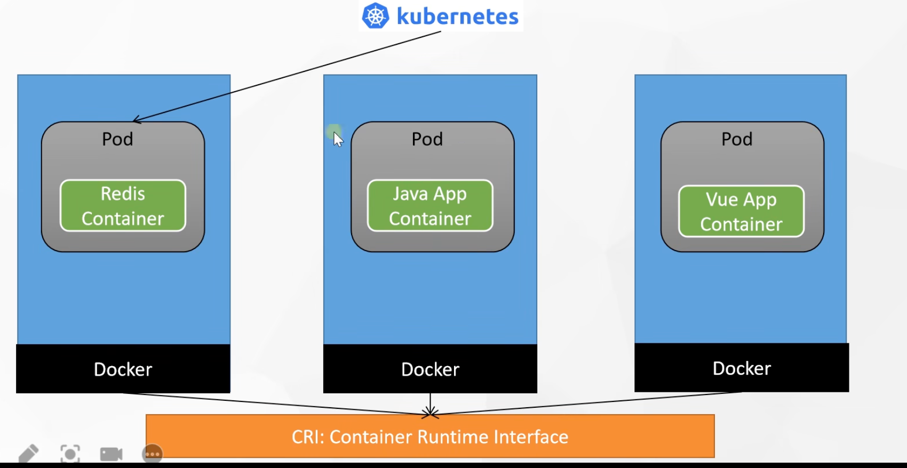
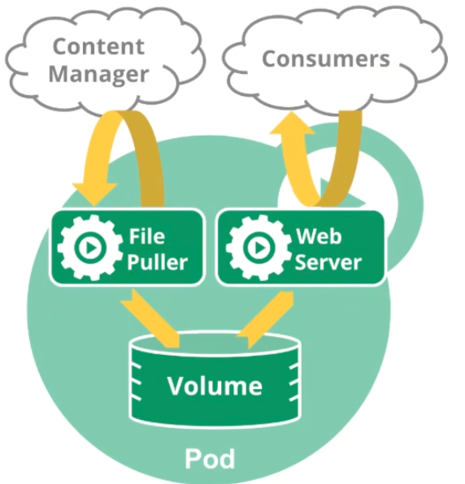

# 第2章 Kubernetes核心实战

## 写在前面

<span style="color:red;font-weight:bold;font-size:28px">标题后面的 (N) 表示与命名空间有关</span>

## 0 资源创建方式

- 命令行
- YAML

## 1 namespace 命名空间

用来对集群资源进行隔离划分。默认只隔离资源，不隔离网络。

- 创建命名空间

:::code-group

```bash [命令行]
$ kubectl create ns hello
```

```bash [YAML]
$ cat <<EOF | kubectl apply -f -
apiVersion: v1
kind: Namespace
metadata:
  name: hello
EOF
```

:::

- 删除命名空间

:::code-group

```bash [命令行]
$ kubectl delete ns hello
```

```bash [YAML]
$ cat <<EOF | kubectl delete -f -
apiVersion: v1
kind: Namespace
metadata:
  name: hello
EOF
```

:::

- 查看命名空间

```bash
$ kubectl get ns
```

## 2 工作负载 `N`

### 2.1 pod

运行中的一组容器，pod是kubernetes中应用的最小单位。

:::details 查看图示





:::

- 创建一个pod

:::code-group

```bash [命令行]
$ kubectl run mynginx --image=nginx
```

```bash [YAML]
$ cat <<EOF | kubectl apply -f -
apiVersion: v1
kind: Pod
metadata:
  name: mynginx
  labels:
    run: mynginx
spec:
  containers:
  - image: nginx
    name: mynginx
EOF
```

```bash [YAML-单Pod多容器]
$ cat <<EOF | kubectl apply -f -
apiVersion: v1
kind: Pod
metadata:
  name: myapp
  labels:
    run: myapp
spec:
  containers:
  - image: nginx
    name: mynginx
  - image: tomcat:8.5-jre8-slim
    name: tomcat
EOF
```

:::

语法：`kubectl run name --image=(镜像名) --replicas=(备份数) --port=(容器要暴露的端口) --labels=(设定自定义标签) `


- 删除pod

:::code-group

```bash [命令行]
$ kubectl delete po mynginx
```

```bash [YAML]
$ cat <<EOF | kubectl delete -f -
apiVersion: v1
kind: Pod
metadata:
  name: mynginx
  labels:
    run: mynginx
spec:
  containers:
  - image: nginx
    name: mynginx
EOF
```

:::


- 查看pod

  - 查看默认命名空间下的pod

  ```bash
  $ kubectl get po
  ```

  - 查看指定命名空间的pod

  ```bash
  $ kubectl get po -n kube-system
  ```

  - 查看所有的pod

  ```bash
  $ kubectl get po -A
  ```

  - 查看pod运行详情

  ```bash
  $ kubeclt describe po mynginx
  ```

  - 查看pod的ip地址等更详细信息

  ```bash
  $ kubectl get po -o wide
  ```

  > 注意，得到的IP，可以访问pod：`curl ip:port`

  - 查看pod的标签

  ```bash
  $ kubectl get pod --show-labels
  ```

- 监控pod

```bash
$ kubectl get po -o wide -w
```

- 查看pods日志

:::code-group

```bash [单Pod单容器]
$ kubectl logs -f mynginx
```

```bash [单Pod多容器]
$ kubectl logs -f myapp -c tomcat
```

:::

- 进入pod内部

:::code-group

```bash [单Pod多容器]
$ kubectl exec -it mynginx -- /bin/bash
```

```bash [单Pod多容器]
$ kubectl exec -it myapp -c tomcat -- /bin/bash
# 进入Pod后，在tomcat容器访问nginx容器： curl 127.0.0.1:80
$ curl 127.0.0.1:80
```

:::


### 2.2 Deployment

控制Pod，使Pod拥有多副本，自愈，扩缩容等能力。

- 清除其他Pod，比较下面两个命令有何不同效果！

```bash
$ kubectl run mynginx --image=nginx
$ kubectl create deploy mytomcat --image=tomcat:8.5-jre8-slim
```

> 说明：
>
> 1. deployment方式部署，Pod具有自愈能力，被删除Pod后，会重新启动一个新的Pod。
> 2. 只有通过删除deployment，才能真正删除！

#### 2.2.1 多副本

- 创建deployment

:::code-group

```bash [命令行]
$ kubectl create deploy my-dep --image=nginx --replicas=3
```

```bash [YAML]
$ cat <<EOF | kubectl apply -f -
apiVersion: apps/v1
kind: Deployment
metadata:
  name: my-dep
  labels:
    app: my-dep
spec:
  replicas: 3
  selector:
    matchLabels:
      app: my-dep
  template:
    metadata:
      labels:
        app: my-dep
    spec:
      containers:
      - image: nginx
        name: mynginx
EOF
```

:::

- 删除deployment

:::code-group

```bash [命令行]
$ kubectl delete deploy my-dep
```

```bash [YAML]
$ cat <<EOF | kubectl delete -f -
apiVersion: apps/v1
kind: Deployment
metadata:
  name: my-dep
  labels:
    app: my-dep
spec:
  replicas: 3
  selector:
    matchLabels:
      app: my-dep
  template:
    metadata:
      labels:
        app: my-dep
    spec:
      containers:
      - image: nginx
        name: mynginx
EOF
```

:::

- 查看

  - 查看部署

  ```bash
  $ kubectl get deploy
  ```

  - 以yaml格式查看部署

  ```bash
  $ kubectl get deploy -oyaml
  ```

  - 使用标签检索Pod

  ```bash
  $ kubectl get pod -l app=my-dep
  ```

#### 2.2.2 扩缩容

:::code-group

```bash [命令行]
$ kubectl scale --replicas=3 deploy/my-dep
```

```bash [直接编辑deploy]
# 修改 spec.replicas: n
$ kubectl edit deploy my-dep
```

:::

#### 2.2.3 自愈

- 停掉某个pod验证，会发现比较快的重启新的pod
- 对某个节点关机验证，会发现5m后会停掉不可用pod，重新启动pod

#### 2.2.4 滚动更新

:::code-group

```bash [命令行]
$ kubectl set image deploy/my-dep mynginx=nginx:1.25.4 --record
# 查看更新进度详情
$ kubectl rollout status deploy/my-dep
```

```bash [直接编辑deploy]
$ kubectl edit deploy/my-dep
```

:::

#### 2.2.5 版本回退

- 查看部署历史

```bash
$ kubectl rollout history deploy/my-dep
```

- 查看某个部署历史详情

```bash
$ kubectl rollout history deploy/my-dep --revision=2
```

- 回滚到上一版

```bash
$ kubectl rollout undo deploy/my-dep
```

- 回滚到指定版

```bash
$ kubectl rollout undo deploy/my-dep --to-revision=1
```


#### 2.2.6 其他工作负载

> 更多：
>
> 除了 `Pod` 和 `Deployment` ， K8S还有 `StatefulSet` 、 `DaemonSet` 、 `Job` 、`CronJob` 等类型资源。我们都称为 `工作负载`。
>
> 有状态应用使用 `StatefulSet` 部署，无状态应用使用 `Deployment` 部署。
>
> https://kubernetes.io/zh/docs/concepts/workloads/controllers/

| 工作负载类型 | 工作负载名称  | 作用                                                     |
| ------------ | ------------- | -------------------------------------------------------- |
| Deployment   | 无状态        | 无状态应用部署。比如微服务，提供多副本等功能             |
| StatefulSet  | 有状态副本集  | 有状态应用部署。比如Redis，提供稳定的存储、网络等功能    |
| DaemonSet    | 守护进程集    | 守护型应用部署。比如日志收集组件，在每个机器上都运行一份 |
| Job/CronJob  | 任务/定时任务 | 定时任务部署。比如垃圾清理组件，可以在指定时间运行。     |


## 3 服务 `N`

### 3.1 Service

> 将一组 Pods 公开为网络服务的抽象方法。
>
> Service是Pod的服务发现与负载均衡。

- 创建Service

:::code-group

```bash [命令行-集群内访问]
# 暴露Deploy，集群内使用 http://<service-ip>:<port> 即可负载均衡的访问
# 也可以在pod的容器内部 http://<service-name>.<namespace>.svc:<port> 访问，比如： curl my-dep.default.svc:8000
$ kubectl expose deploy my-dep --port=8000 --target-port=80 --type=ClusterIP
```

```bash [YAML]
$ cat <<EOF | kubectl apply -f -
apiVersion: v1
kind: Service
metadata:
  name: my-dep 
  labels:
    app: my-dep
spec:
  selector:
    app: my-dep
  ports:
  - port: 8000
    protocol: TCP
    targetPort: 80
EOF
```

```bash [命令行-集群外访问]
$ kubectl expose deploy my-dep --port=8000 --target-port=80 --type=NodePort
```

:::


> 在Pod内测试访问Service时DNS解析时间
>
> 语法：`kubectl exec -it <pod-name> -- /bin/bash -c time nslookup <service-name>.<namespace>.svc`
>
> 示例：
>
> ```bash
> $ kubectl exec -it mytomcat-769875c4c-wpxkq -- /bin/bash -c time nslookup my-dep.default.svc
> ```
>
> 或者：
>
> ```bash
> $ kubectl exec -it mytomcat-769875c4c-wpxkq -- /bin/bash -c ' \
>   start=$(date +%s); \
>   time nslookup my-dep.default.svc; \
>   end=$(date +%s); \
>   echo "Duration: $((end - start)) seconds" \
> '
> ```

- 删除Service

```bash
$ kubectl delete svc my-dep
```

- 查看Service端点状态

```bash
# $ kubectl get endpoints <service-name> -n <namespace>
$ kubectl get endpoints my-dep -n default
```

- 查看Service

```bash
$ kubectl get svc
```

### 3.2 Ingress

参考：[安装ingress-nginx](http://localhost:8751/devops/new/Kubernetes/01-%E7%AC%AC1%E7%AB%A0%20Kubeadmin%E5%AE%89%E8%A3%85K8S%20V1.23.html#_5-%E5%AE%89%E8%A3%85ingress-nginx-%E5%9C%A8master%E8%8A%82%E7%82%B9%E6%89%A7%E8%A1%8C)

#### 3.2.1 域名访问

:::details ingress-domain.yaml配置

```bash
$ tee ingress-domain.yaml << EOF
#deploy
apiVersion: apps/v1
kind: Deployment
metadata:
  name: domain-deploy
spec:
  selector:
    matchLabels:
      app: domain-pod
  replicas: 1
  template:
    metadata:
      labels:
        app: domain-pod
    spec:
      containers:
      - name: nginx
        image: nginx:1.25.4
        ports:
        - containerPort: 80
---
#service
apiVersion: v1
kind: Service
metadata:
  name: domain-service
spec:
  selector:
    app: domain-pod
  type: ClusterIP
  ports:
  - protocol: TCP
    port: 80
    targetPort: 80
---
#ingress
apiVersion: networking.k8s.io/v1
kind: Ingress
metadata:
  name: domain-ingress
spec:
  ingressClassName: nginx
  rules:
  - host: nginx.fsmall.com
    http:
      paths:
      # /nginx 表示把请求转发给pod处理，若有映射但无资源则404；若pod无映射则ingress自身处理，找不到则（404）。
      - path: /
        pathType: Prefix
        backend:
          service:
            name: domain-service
            port:
              number: 80
EOF
```

:::

配置资源生效：

:::code-group

```bash [创建]
$ kubectl apply -f ingress-domain.yaml
```

```bash [在集群外通过ing域名访问]
$ kubectl get ing
NAME           CLASS   HOSTS              ADDRESS   PORTS   AGE
ingress-http   nginx   nginx.fsmall.com             80      19s

# 配置本地DNS：访问emon2或emon3的DNS
$ vim /etc/hosts
192.168.200.117 nginx.fsmall.com

# 访问
http://nginx.fsmall.com # 看到正常nginx界面
```

```bash [删除]
$ kubectl delete -f ingress-domain.yaml
```

:::

#### 3.2.2 路径重写

:::details ingress-rewrite.yaml配置

```js
tee ingress-rewrite.yaml << EOF
#deploy
apiVersion: apps/v1
kind: Deployment
metadata:
  name: rewrite-deploy
spec:
  selector:
    matchLabels:
      app: rewrite-pod
  replicas: 1
  template:
    metadata:
      labels:
        app: rewrite-pod
    spec:
      containers:
      - name: nginx
        image: nginx:1.25.4
        ports:
        - containerPort: 80
---
#service
apiVersion: v1
kind: Service
metadata:
  name: rewrite-service
spec:
  selector:
    app: rewrite-pod
  type: ClusterIP
  ports:
  - protocol: TCP
    port: 80
    targetPort: 80
---
#ingress
apiVersion: networking.k8s.io/v1
kind: Ingress
metadata:
  annotations: // [!code focus:3] [!code ++]
    nginx.ingress.kubernetes.io/use-regex: "true" // [!code ++]
    nginx.ingress.kubernetes.io/rewrite-target: /\$1 // [!code ++]
  name: rewrite-ingress
spec:
  ingressClassName: nginx
  rules:
  - host: nginx.fsmall.com
    http:
      paths:
      - path: / // [!code focus:4] [!code --]
        pathType: Prefix // [!code --]
      - path: "/something$" // [!code ++]
        pathType: ImplementationSpecific // [!code ++]
        backend:
          service:
            name: rewrite-service
            port:
              number: 80
      - path: "/something/(.*)" // [!code focus:7] [!code ++]
        pathType: ImplementationSpecific // [!code ++]
        backend: // [!code ++]
          service: // [!code ++]
            name: rewrite-service // [!code ++]
            port: // [!code ++]
              number: 80 // [!code ++]
EOF
```

> ingress-nginx v1.6.4对正则表达式中的`|`不支持，需要转换为等效的2个正则。
> `/something(/|$)(.*)` ==> `/something$` 和 `/something/(.*)`

效果：

http://nginx.fsmall.com ingress返回404

http://nginx.fsmall.com/something 有效

http://nginx.fsmall.com/something/ 有效

http://nginx.fsmall.com/something/abc rewrite-pod返回404

:::

配置资源生效：

:::code-group

```bash [创建]
$ kubectl apply -f ingress-rewrite.yaml
```

```bash [在集群外通过ing域名访问]
$ kubectl get ing
NAME           CLASS   HOSTS                                ADDRESS        PORTS   AGE
ingress-http   nginx   nginx.fsmall.com,tomcat.fsmall.com   10.96.217.34   80      11m

# 配置本地DNS：访问emon2或emon3的DNS
$ vim /etc/hosts
192.168.200.117 nginx.fsmall.com

# 访问
http://nginx.fsmall.com # 看到正常nginx界面
```

```bash [删除]
$ kubectl delete -f ingress-rewrite.yaml
```

:::


