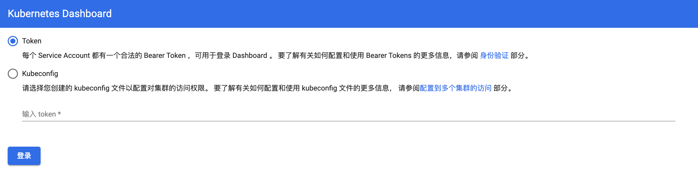
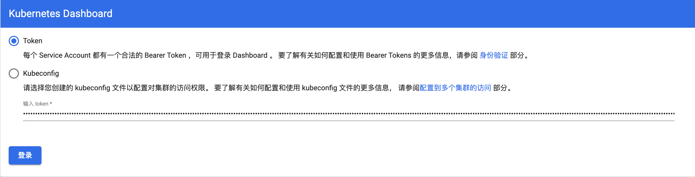
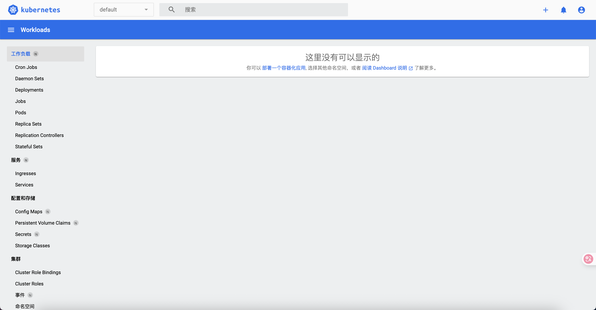

# 第5章 Kubernetes扩展服务安装

## 1 部署dashboard（在master节点执行）

[kubernetes官方提供的可视化界面](https://github.com/kubernetes/dashboard)

### 1.1 部署

版本兼容性：https://github.com/kubernetes/dashboard/releases 

可以得知dashboard v2.5.1 兼容 kubernetes v1.23 版本

[dashboard v2.5.1文档](https://github.com/kubernetes/dashboard/tree/v2.5.1)

1. 安装

```bash
$ kubectl apply -f https://raw.githubusercontent.com/kubernetes/dashboard/v2.5.1/aio/deploy/recommended.yaml
```

> 若无法下载文件，先执行下载 `curl https://raw.githubusercontent.com/kubernetes/dashboard/v2.5.1/aio/deploy/recommended.yaml -O` 再执行 `kubectl apply -f recommended.yaml`

2. 设置访问端口

  - 方式一：手工编辑

  ```bash
$ kubectl edit svc kubernetes-dashboard -n kubernetes-dashboard
  ```

  显示变更的部分：

  ```js
spec:
  clusterIP: 10.96.11.88
  clusterIPs:
  - 10.96.11.88
  internalTrafficPolicy: Cluster
  ipFamilies:
  - IPv4
  ipFamilyPolicy: SingleStack
  ports:
  - port: 443
    protocol: TCP
    targetPort: 8443
  selector:
    k8s-app: kubernetes-dashboard
  sessionAffinity: None
  type: ClusterIP // [!code --] [!code focus:2]
  type: NodePort // [!code ++]
status:
  loadBalancer: {}
  ```

  访问地址：`kubectl get svc -n kubernetes-dashboard` 查看暴露的随机端口。

  > 示例：
  >
  > ```bash
  > $ kubectl get svc -n kubernetes-dashboard
  > NAME                        TYPE        CLUSTER-IP    EXTERNAL-IP   PORT(S)         AGE
  > dashboard-metrics-scraper   ClusterIP   10.96.40.11   <none>        8000/TCP        19m
  > kubernetes-dashboard        NodePort    10.96.11.88   <none>        443:30443/TCP   19m
  > ```
  >
  > 可以看到端口 30443

  - 方式二：命令调整

  ```bash
$ kubectl patch svc kubernetes-dashboard -n kubernetes-dashboard \
  -p '{"spec": {"type": "NodePort", "ports": [{"port": 443, "nodePort": 30443}]}}'
  ```

  访问地址：
  https://<节点IP>:30443

---


<span style="color:red;font-weight:bold;">chrome不让访问无效证书的https网站，如何处理？</span>

⚠️ 方法一：直接输入忽略命令（最简单快速）

当看到 **`您的连接不是私密连接`** 或 **`NET::ERR_CERT_INVALID`** 错误页面时：

1. **将光标点击到错误页面空白处**（确保地址栏未激活）。

2. **直接输入**（无需粘贴）以下英文单词：

   ```
   thisisunsafe
   ```

3. 页面会自动刷新并允许访问。

> ✅ **优点**：无需重启浏览器或修改配置。
> ❌ **缺点**：每次访问新端口或重启服务后需重新输入。


---


访问通过后，可以看到如下界面：



---

3. 创建访问账号

[创建访问账号](https://github.com/kubernetes/dashboard/blob/v2.5.1/docs/user/access-control/creating-sample-user.md)

```bash
$ tee dashboard-adminuser.yaml <<EOF
# 我们首先在命名空间 kubernetes-dashboard 中创建名为 admin-user 的服务账户。
apiVersion: v1
kind: ServiceAccount
metadata:
  name: admin-user
  namespace: kubernetes-dashboard
---
# 在大多数情况下，使用 kops 、 kubeadm 或其他流行工具配置集群后， ClusterRole cluster-admin 在集群中已经存在。我们可以使用它，并仅为我们的 ServiceAccount 创建一个 ClusterRoleBinding 。如果不存在，则需要首先创建此角色，并手动授予所需权限。
apiVersion: rbac.authorization.k8s.io/v1
kind: ClusterRoleBinding
metadata:
  name: admin-user
roleRef:
  apiGroup: rbac.authorization.k8s.io
  kind: ClusterRole
  name: cluster-admin
subjects:
- kind: ServiceAccount
  name: admin-user
  namespace: kubernetes-dashboard
EOF
```

```bash
$ kubectl apply -f dashboard-adminuser.yaml
```

4. 获取 Bearer 令牌

```bash
$ kubectl -n kubernetes-dashboard get secret $(kubectl -n kubernetes-dashboard get sa/admin-user -o jsonpath="{.secrets[0].name}") -o go-template="{{.data.token | base64decode}}"
```

它应该会打印出类似以下内容：

```bash
eyJhbGciOiJSUzI1NiIsImtpZCI6InAxYVVVQWpYTFBZbzVianl5c1VKOUt1MGFtT25GNjFxTDlMOV9md09sYlkifQ.eyJpc3MiOiJrdWJlcm5ldGVzL3NlcnZpY2VhY2NvdW50Iiwia3ViZXJuZXRlcy5pby9zZXJ2aWNlYWNjb3VudC9uYW1lc3BhY2UiOiJrdWJlcm5ldGVzLWRhc2hib2FyZCIsImt1YmVybmV0ZXMuaW8vc2VydmljZWFjY291bnQvc2VjcmV0Lm5hbWUiOiJhZG1pbi11c2VyLXRva2VuLWp2MnRrIiwia3ViZXJuZXRlcy5pby9zZXJ2aWNlYWNjb3VudC9zZXJ2aWNlLWFjY291bnQubmFtZSI6ImFkbWluLXVzZXIiLCJrdWJlcm5ldGVzLmlvL3NlcnZpY2VhY2NvdW50L3NlcnZpY2UtYWNjb3VudC51aWQiOiI2YmFjZTU0YS0zNTliLTRhNjYtOTFiMi04MWEyODMzZDI1MDciLCJzdWIiOiJzeXN0ZW06c2VydmljZWFjY291bnQ6a3ViZXJuZXRlcy1kYXNoYm9hcmQ6YWRtaW4tdXNlciJ9.T1UTl_dlX1zW09VAI3lGIYmqQI3b3Sy194KKO2HxcR7zUuf_8P8HrXivcvva3U8r7BdrKmo4aSoh-12CdjY6tui5jvg_Wmp9n212AZOhI47mQzDW4IiDRU-37Iv6yg-FRc4OnGJipYOnoAWHUxSwiVAhiCtL9PgZ9vIIde0z8EcwTWGJ896S6ugN0wBrPJHwCH3IkPRVwloPkLX9A1UQnEiSZOTHzJvvr_cAc3D95XjBT9NIvmjgHXcve74LnEE_SngJ-b-9fyqxYdzyknrGmnwNrhwle30rlr9lBSby_4x51_a7V7fK8EzgIoafNYcdIVWSE1iLtA4x-Qw-NBTvNQ
```

现在复制该令牌，并将其粘贴到登录界面的 `Enter token` 字段中。



点击 `Sign in` 按钮，搞定。你现在已以管理员身份登录。

5. 界面



### 1.2 卸载

- 删除管理员 `ServiceAccount` 和 `ClusterRoleBinding` 

```bash
$ kubectl -n kubernetes-dashboard delete serviceaccount admin-user
$ kubectl -n kubernetes-dashboard delete clusterrolebinding admin-user
```

- 卸载dashboard组件

```bash
$ kubectl delete -f https://raw.githubusercontent.com/kubernetes/dashboard/v2.5.1/aio/deploy/recommended.yaml
```

### 1.3 同类型软件核心对比表

| **特性**          | **Kubernetes Dashboard** | **KubeSphere**                            | **Rancher**                     |
| :---------------- | :----------------------- | :---------------------------------------- | :------------------------------ |
| **项目背景**      | Kubernetes 官方项目      | 青云开源 (CNCF 项目)                      | Rancher Labs (现属 SUSE)        |
| **定位**          | 单集群 Web UI            | **全栈容器平台**                          | **企业级多集群管理**            |
| **多集群管理**    | ❌ 仅单集群               | ✅ 支持                                    | ✅ **核心优势** (混合云/多云)    |
| **部署复杂度**    | ⭐ 简单 (`kubectl apply`) | ⭐⭐⭐ 中等 (需规划存储/网络)                | ⭐⭐ 中等 (Helm 部署)             |
| **应用商店**      | ❌ 无                     | ✅ **内置** (300+ Helm Charts)             | ✅ **内置** (支持自定义 Catalog) |
| **DevOps 流水线** | ❌ 无                     | ✅ **完整集成** (Jenkins/SonarQube/GitOps) | ✅ 支持 (需集成外部工具)         |
| **监控告警**      | ❌ 基础指标               | ✅ **开箱即用** (Prometheus+Grafana+告警)  | ✅ 集成 (需额外配置)             |
| **日志管理**      | ❌ 仅 Pod 日志            | ✅ **ELK/Fluentd 集成**                    | ❌ 需自行搭建                    |
| **服务网格**      | ❌ 无                     | ✅ **内置 Istio**                          | ❌ 需手动集成                    |
| **多租户隔离**    | ⭐ RBAC 基础控制          | ✅ **企业级租户体系**                      | ✅ **细粒度 RBAC+项目隔离**      |
| **边缘计算支持**  | ❌ 无                     | ✅ **KubeEdge 集成**                       | ✅ **K3s 轻量集群**              |
| **UI 体验**       | ⭐ 功能导向 (简洁)        | ⭐⭐⭐ **现代化控制台** (多模块集成)         | ⭐⭐ 功能丰富 (学习曲线稍陡)      |
| **最佳适用场景**  | 开发调试/单集群运维      | **企业级全栈平台** (DevOps+微服务+监控)   | **混合云/大规模集群舰队管理**   |

**总结建议**

- **选 Kubernetes Dashboard 如果**：
  需要轻量级 K8s 操作界面，且仅管理单个集群。
- **选 KubeSphere 如果**：
  构建 **一体化企业平台**（尤其需要开箱即用的 DevOps/微服务/监控）。
- **选 Rancher 如果**：
  管理 **跨云/混合云集群舰队** 或专注 **集群生命周期管理**。

> 💡 **组合策略**：大型企业可同时使用 Rancher（多集群治理） + KubeSphere（集群内应用平台），通过 Rancher 纳管部署了 KubeSphere 的集群。

## 2 安装ingress-nginx（在master节点执行）

[ingress-nginx GitHub查看与K8S版本兼容性](https://github.com/kubernetes/ingress-nginx)

ingress-nginx官网部署：https://kubernetes.github.io/ingress-nginx/deploy/

ingress-nginx官网用户指南：https://kubernetes.github.io/ingress-nginx/user-guide/nginx-configuration/

### 2.1 切换目录

```bash
$ cd
$ mkdir -pv /root/k8s_soft/k8s_v1.23.17 && cd /root/k8s_soft/k8s_v1.23.17
```

### 2.2 下载文件与配置调整

```bash
# 下载 https://github.com/kubernetes/ingress-nginx/blob/controller-v1.6.4/deploy/static/provider/cloud/deploy.yaml 到 ingress-nginx.yaml
# 若 raw.githubusercontent.com 无法访问，可以通过 https://www.ipaddress.com 查询其ip地址并配置本地dns
$ curl https://raw.githubusercontent.com/kubernetes/ingress-nginx/controller-v1.6.4/deploy/static/provider/cloud/deploy.yaml -o ingress-nginx.yaml
```

#### 2.2.1 调整镜像

若不调整，下载后可能是这样的镜像：

```bash
registry.k8s.io/ingress-nginx/controller   <none>     81a20af4ae3c   2 years ago   282MB
registry.k8s.io/ingress-nginx/kube-webhook-certgen   <none>     7650062bc6ee   2 years ago     44.9MB
```

- 调整镜像名称

```bash
$ sed -i.bak 's/image: registry.k8s.io\/ingress-nginx\/controller:v1.6.3@sha256:b92667e0afde1103b736e6a3f00dd75ae66eec4e71827d19f19f471699e909d2/image: registry.k8s.io\/ingress-nginx\/controller:v1.6.3/g;s/image: registry.k8s.io\/ingress-nginx\/kube-webhook-certgen:v20220916-gd32f8c343@sha256:39c5b2e3310dc4264d638ad28d9d1d96c4cbb2b2dcfb52368fe4e3c63f61e10f/image: registry.k8s.io\/ingress-nginx\/kube-webhook-certgen:v20220916-gd32f8c343/g' ingress-nginx.yaml
```

> 说明：源文件备份到 ingress-nginx.yaml.bak

#### 2.2.2 调整Service

- 调整Service的type为 NodePort 并固定 nodePort 为80和443

显示变更的部分：

```js
apiVersion: v1
kind: Service
metadata: 
  labels:
    app.kubernetes.io/component: controller
    app.kubernetes.io/instance: ingress-nginx
    app.kubernetes.io/name: ingress-nginx
    app.kubernetes.io/part-of: ingress-nginx
    app.kubernetes.io/version: 1.6.3
  name: ingress-nginx-controller
  namespace: ingress-nginx
spec:
  externalTrafficPolicy: Local
  ipFamilies:
  - IPv4
  ipFamilyPolicy: SingleStack
  ports:
  - appProtocol: http
    name: http
    port: 80
    protocol: TCP
    targetPort: http
    nodePort: 80 // [!code ++] [!code focus]
  - appProtocol: https
    name: https
    port: 443
    protocol: TCP
    targetPort: https
    nodePort: 443 // [!code ++] [!code focus]
  selector:
    app.kubernetes.io/component: controller
    app.kubernetes.io/instance: ingress-nginx
    app.kubernetes.io/name: ingress-nginx
  type: LoadBalancer // [!code --] [!code focus:2]
  type: NodePort // [!code ++]
```

- 调整nodePort允许的端口范围（在master节点）

上面直接设置为80和443会报错：nodePort: Invalid value valid ports is 30000-32767

> 使用`kubectl apply`安装时报错：
>
> <span style="color:red;font-weight:bold;">The Service "ingress-nginx-controller" is invalid: spec.ports[0].nodePort: Invalid value: 80: provided port is not in the valid range. The range of valid ports is 30000-32767</span>

是因为k8s的node节点的端口默认被限制在30000-32767的范围。

修改node节点的允许范围：

```bash
$ vim /etc/kubernetes/manifests/kube-apiserver.yaml 
```

在 spec.containers.command 中找到`- --service-cluster-ip-range`，并在其后增加一行：

```bash
    - --service-node-port-range=1-65535
```

- 重启

```bash
$ systemctl daemon-reload && systemctl restart kubelet
```

#### 2.2.3 调整Deployment

修改kind模式 Deployment ==> DaemonSet

```js
apiVersion: apps/v1
kind: Deployment // [!code --] [!code focus:2]
kind: DaemonSet // [!code ++]
metadata:
  labels:
    app.kubernetes.io/component: controller
    app.kubernetes.io/instance: ingress-nginx
    app.kubernetes.io/name: ingress-nginx
    app.kubernetes.io/part-of: ingress-nginx
    app.kubernetes.io/version: 1.6.3
  name: ingress-nginx-controller
```

### 2.3 安装ingress-nginx

- 安装插件（master节点）

```bash
# 配置资源
$ kubectl apply -f ingress-nginx.yaml
# 查看
$ kubectl get all -n ingress-nginx -o wide
NAME                                       READY   STATUS      RESTARTS   AGE   IP               NODE    NOMINATED NODE   READINESS GATES
pod/ingress-nginx-admission-create-b7mrj   0/1     Completed   0          70s   10.244.161.5     emon3   <none>           <none>
pod/ingress-nginx-admission-patch-rcgvw    0/1     Completed   0          70s   10.244.108.111   emon2   <none>           <none>
pod/ingress-nginx-controller-52dd7         1/1     Running     0          70s   10.244.161.7     emon3   <none>           <none>
pod/ingress-nginx-controller-n4mwx         1/1     Running     0          70s   10.244.108.112   emon2   <none>           <none>

NAME                                         TYPE        CLUSTER-IP     EXTERNAL-IP   PORT(S)                 AGE   SELECTOR
service/ingress-nginx-controller             NodePort    10.96.217.34   <none>        80:80/TCP,443:443/TCP   71s   app.kubernetes.io/component=controller,app.kubernetes.io/instance=ingress-nginx,app.kubernetes.io/name=ingress-nginx
service/ingress-nginx-controller-admission   ClusterIP   10.96.60.43    <none>        443/TCP                 71s   app.kubernetes.io/component=controller,app.kubernetes.io/instance=ingress-nginx,app.kubernetes.io/name=ingress-nginx

NAME                                      DESIRED   CURRENT   READY   UP-TO-DATE   AVAILABLE   NODE SELECTOR            AGE   CONTAINERS   IMAGES                                            SELECTOR
daemonset.apps/ingress-nginx-controller   2         2         2       2            2           kubernetes.io/os=linux   71s   controller   registry.k8s.io/ingress-nginx/controller:v1.6.3   app.kubernetes.io/component=controller,app.kubernetes.io/instance=ingress-nginx,app.kubernetes.io/name=ingress-nginx

NAME                                       COMPLETIONS   DURATION   AGE   CONTAINERS   IMAGES                                                                    SELECTOR
job.batch/ingress-nginx-admission-create   1/1           4s         71s   create       registry.k8s.io/ingress-nginx/kube-webhook-certgen:v20220916-gd32f8c343   controller-uid=59ba2850-e57d-4ed5-9968-c37aefd14a32
job.batch/ingress-nginx-admission-patch    1/1           2s         70s   patch        registry.k8s.io/ingress-nginx/kube-webhook-certgen:v20220916-gd32f8c343   controller-uid=144e3f71-16fe-4837-bf3a-e17a759e655e
```

### 2.4 测试服务

#### 2.5.1 ingress-test.yaml配置

:::details ingress-test.yaml配置

```bash
$ tee ingress-test.yaml << EOF
#deploy
apiVersion: apps/v1
kind: Deployment
metadata:
  name: nginx-deploy
spec:
  selector:
    matchLabels:
      app: nginx-pod
  replicas: 1
  template:
    metadata:
      labels:
        app: nginx-pod
    spec:
      containers:
      - name: nginx
        image: nginx:1.25.4
        ports:
        - containerPort: 80

---      
#deploy
apiVersion: apps/v1
kind: Deployment
metadata:
  name: tomcat-deploy
spec:
  selector:
    matchLabels:
      app: tomcat-pod
  replicas: 1
  template:
    metadata:
      labels:
        app: tomcat-pod
    spec:
      containers:
      - name: tomcat
        image: tomcat:8.5-jre8-slim
        ports:
        - containerPort: 8080
        
---
#service
apiVersion: v1
kind: Service
metadata:
  name: nginx-service
spec:
  selector:
    app: nginx-pod
  type: ClusterIP
  ports:
  - protocol: TCP
    port: 80
    targetPort: 80

---
#service
apiVersion: v1
kind: Service
metadata:
  name: tomcat-service
spec:
  selector:
    app: tomcat-pod
  type: ClusterIP
  ports:
  - protocol: TCP
    port: 80
    targetPort: 8080

---
#ingress
#old version: extensions/v1beta1
apiVersion: networking.k8s.io/v1
kind: Ingress
metadata:
  name: ingress-http
spec:
  ingressClassName: nginx
  rules:
  - host: nginx.fsmall.com
    http:
      paths:
      - path: /
        pathType: Prefix
        backend:
          service:
            name: nginx-service
            port:
              number: 80
  - host: tomcat.fsmall.com
    http:
      paths:
      - path: /
        pathType: Prefix
        backend:
          service:
            name: tomcat-service
            port:
              number: 80
EOF
```

:::

配置资源生效：

:::code-group

```bash [创建]
$ kubectl apply -f ingress-test.yaml
```

```bash [在集群内通过目标scv访问]
# 查看service
$ kubectl get svc
NAME             TYPE        CLUSTER-IP      EXTERNAL-IP   PORT(S)   AGE
kubernetes       ClusterIP   10.96.0.1       <none>        443/TCP   5d
nginx-service    ClusterIP   10.96.236.244   <none>        80/TCP    9m43s
tomcat-service   ClusterIP   10.96.8.65      <none>        80/TCP    9m43s

# 命令行访问service
$ curl 10.96.236.244:80
$ curl 10.96.8.65:80
```

```bash [在集群内通过ing的svc访问]
# 查看ingress的NodePort地址
$ kubectl get svc -n ingress-nginx
NAME                                 TYPE        CLUSTER-IP     EXTERNAL-IP   PORT(S)                 AGE
ingress-nginx-controller             NodePort    10.96.217.34   <none>        80:80/TCP,443:443/TCP   15m
ingress-nginx-controller-admission   ClusterIP   10.96.60.43    <none>        443/TCP                 15m
# 命令行访问service
$ curl  -H "Host: nginx.fsmall.com" 10.96.217.34:80
$ curl  -H "Host: tomcat.fsmall.com" 10.96.217.34:80
```

```bash [在集群外通过ing域名访问]
$ kubectl get ing
NAME           CLASS   HOSTS                                ADDRESS        PORTS   AGE
ingress-http   nginx   nginx.fsmall.com,tomcat.fsmall.com   10.96.217.34   80      11m

# 配置本地DNS：访问emon2或emon3的DNS
$ vim /etc/hosts
192.168.200.117 nginx.fsmall.com
192.168.200.118 tomcat.fsmall.com
192.168.200.117 api.fsmall.com

# 访问
http://nginx.fsmall.com # 看到正常nginx界面
http://tomcat.fsmall.com # 看到正常tomcat界面
http://api.fsmall.com # 看到 nginx 的 404 页面
```

```bash [删除]
$ kubectl delete -f ingress-test.yaml
```

:::

### 2.5 其他

- ingress服务安装后，确保集群中存在名为 `nginx` 的 IngressClass：

```bash
$ kubectl get ingressclass -n ingress-nginx
```

- 若`kind: Ingress`创建后，查看`<ingress-pod-name>`是否生成规则

```bash
# 查看ingress-pod-name，确认 Nginx Ingress Controller 已安装且 Pod 正常运行：
$ kubectl get po -n ingress-nginx|grep ingress-nginx-controller
# 查看生成的Nginx配置
$ kubectl exec -n ingress-nginx -it <ingress-pod-name> -- cat /etc/nginx/nginx.conf
```

- 若并没有生成规则，检查 Ingress Controller 日志是否有错误：

```bash
$ kubectl logs -n ingress-nginx <ingress-pod-name>
```


## 3 集群冒烟测试（在master节点执行）

### 3.1 创建nginx-ds

:::details nginx-ds.yaml配置

```bash
$ tee nginx-ds.yaml << EOF
apiVersion: v1
kind: Service
metadata:
  name: nginx-ds
  labels:
    app: nginx-ds
spec:
  type: NodePort
  selector:
    app: nginx-ds
  ports:
  - name: http
    port: 80
    targetPort: 80
---
apiVersion: apps/v1
kind: DaemonSet
metadata:
  name: nginx-ds
spec:
  selector:
    matchLabels:
      app: nginx-ds
  template:
    metadata:
      labels:
        app: nginx-ds
    spec:
      containers:
      - name: my-nginx
        image: nginx:1.25.4
        ports:
        - containerPort: 80
EOF
```

:::

- 创建

```bash
$ kubectl apply -f nginx-ds.yaml
```

### 3.2 检查各种ip连通性

```bash
# 检查各 Node 上的 Pod IP 连通性
$ kubectl get pods -o wide

# 在每个worker节点上ping pod ip
# 主节点： kubectl get pods -o wide|grep nginx-ds|awk '{print $6}'| xargs -I {} ping -c 1 "{}"
$ ping <pod-ip>

# 检查service可达性
$ kubectl get svc

# 在每个worker节点上访问服务，这里的<port>表示集群内（非NodePort端口）
$ curl <service-ip>:<port>

# 在每个节点检查node-port可用性
$ curl <node-ip>:<port>
```

### 3.3 检查dns可用性

:::code-group

```bash [配置]
$ cat > nginx-pod.yaml <<EOF
apiVersion: v1
kind: Pod
metadata:
  name: nginx
spec:
  containers:
  - name: nginx
    image: docker.io/library/nginx:1.25.4
    ports:
    - containerPort: 80
EOF
```

```bash [创建]
$ kubectl apply -f nginx-pod.yaml
```

```bash [进入pod查看dns]
$ kubectl exec nginx -it -- cat /etc/resolv.conf
```

```bash [验证解析]
$ kubectl exec nginx -it -- curl nginx-ds
```

```bash [删除]
$ kubectl delete -f nginx-pod.yaml
```

:::

### 3.4 日志功能

测试使用kubectl查看pod的容器日志

```bash
$ kubectl get pods
# 命令行输出结果
NAME             READY   STATUS    RESTARTS   AGE
nginx            1/1     Running   0          54s
nginx-ds-dkfjm   1/1     Running   0          2m54s
nginx-ds-rx6mj   1/1     Running   0          2m54s

# 查看日志
$ kubectl logs <pod-name>
```

### 3.5 Exec功能

测试kubectl的exec功能

```bash
# 查询指定标签的pod
$ kubectl get pods -l app=nginx-ds
$ kubectl exec -it <nginx-pod-name> -- nginx -v
```

### 3.6 删除nginx-ds

```bash
$ kubectl delete -f nginx-ds.yaml
```

## 4 存储方案

<span style="color:red;font-weight:bold;">在docker中，以前是将docker内部目录挂载到机器上，但是在k8s中如果将目录挂载到机器上，如果某个节点的容器挂了，比如MySQL，k8s的自愈机制会在其它节点再拉起一份，那就会导致原来的数据丢失了，所以在k8s中需要应用到存储层：比如NFS、OpenEBS，k8s会将这些容器的数据全部存在存储层，而这个存储层会在所有节点都有一份。</span>

为了扩展 K8s 集群的存储能力，我们将快速对接 NFS 作为 OpenEBS 之外的另一种持久化存储。

本文只介绍 K8s 集群上的操作，NFS 服务器的部署和更多细节请参阅[探索 Kubernetes 持久化存储之 NFS 终极实战指南](https://mp.weixin.qq.com/s/FRZppup6W_AS2O-_CR1KFg) 。

### 4.0 K8S 访问模式（Access Modes）

| 模式 | 全称          | 含义       | 典型用途                                  |
| ---- | ------------- | ---------- | ----------------------------------------- |
| RWO  | ReadWriteOnce | 单节点读写 | 数据库（MySQL、PostgreSQL）、Redis 主节点 |
| ROX  | ReadOnlyMany  | 多节点只读 | 配置文件、静态资源、模板                  |
| RWX  | ReadWriteMany | 多节点读写 | Jenkins 构建缓存、CMS 上传目录、日志聚合  |

> ⚠️ 注意：**“节点” ≠ “Pod”**。RWO 允许同一节点上的多个 Pod 共享卷，但不能跨节点。


### 4.1 部署NFS

#### 4.1.0 NFS 存储方案

 **✅ 功能特点**

- 基于 **网络文件系统协议**（POSIX 兼容）
- 支持 **RWX**（多节点并发读写）
- 由 **外部 NFS Server** 提供服务（需独立部署维护）
- 无内置快照、复制、加密等企业级功能（依赖底层实现）

**📌 适用场景**

- **内容管理系统**（如 WordPress 多实例共享 uploads）
- **DevOps 工具链**（Jenkins、GitLab Runner 共享 workspace）
- **媒体处理流水线**（公共素材库）
- **开发测试环境** 的低成本共享存储

**🔧 访问模式支持**

- **RWX**（主要优势）
- ROX（自然支持）
- RWO（可模拟，但非典型）

**⚠️ 局限性**

- 性能受 **网络延迟** 和 **NFS Server 负载** 影响（小文件性能差）
- **单点故障风险**（若 NFS Server 无 HA）
- **一致性模型较弱**：close-to-open 语义，不适合强一致性数据库
- 安全性需手动加固（如 Kerberos、IP 白名单）

#### 4.1.1 安装 NFS 服务端软件包（所有节点）

```bash
$ sudo dnf install -y nfs-utils
```

#### 4.1.2 创建共享数据根目录（在NFS服务节点执行）

```bash
$ sudo mkdir -pv /data/nfs/local
$ sudo chown nobody:nobody /data/nfs/local
```

#### 4.1.3 编辑服务配置文件（在NFS服务节点执行）

配置 NFS 服务器数据导出目录及访问 NFS 服务器的客户端机器权限。

编辑配置文件 `vim /etc/exports`，添加如下内容：

```bash
# nfs服务端
$ echo "/data/nfs/local 192.168.200.0/24(rw,sync,all_squash,anonuid=65534,anongid=65534,no_subtree_check)" | sudo tee /etc/exports
```

- /data/nfs/local：NFS 导出的共享数据目录
- 192.168.200.0/24：可以访问 NFS 存储的客户端 IP 地址
- rw：读写操作，客户端机器拥有对卷的读写权限。
- sync：内存数据实时写入磁盘，性能会有所限制
- all_squash：NFS 客户端上的所有用户在使用共享目录时都会被转换为一个普通用户的权限
- anonuid：转换后的用户权限 ID，对应的操作系统的 nobody 用户
- anongid：转换后的组权限 ID，对应的操作系统的 nobody 组
- no_subtree_check：不检查客户端请求的子目录是否在共享目录的子树范围内，也就是说即使输出目录是一个子目录，NFS 服务器也不检查其父目录的权限，这样可以提高效率。

#### 4.1.4 启动服务并设置开机自启（在NFS服务节点执行）

```bash
$ sudo systemctl enable --now rpcbind && sudo systemctl enable --now nfs-server
# 重新加载 NFS 共享配置（热加载 /etc/expots 配置而无需重启服务，每次涉及到该配置文件修改后都建议执行一下）
$ sudo exportfs -r
# 查看共享目录导出情况
$ sudo exportfs -v
/data/nfs/local       192.168.200.0/24(sync,wdelay,hide,no_subtree_check,sec=sys,rw,secure,root_squash,all_squash)
# 验证
$ sudo exportfs
/data/nfs/local       192.168.200.0/24
# 查看NFS版本
$ sudo cat /proc/fs/nfsd/versions
+3 +4 +4.1 +4.2
```

> **分解说明**：
>
> | 命令部分   | 功能                              |
> | :--------- | :-------------------------------- |
> | `exportfs` | NFS 共享管理工具                  |
> | `-r`       | 重新导出所有共享（re-export all） |

#### 4.1.5 配置NFS从节点（仅NFS客户端节点）

- 查看NFS版本

```bash
$ mount |grep nfs
sunrpc on /var/lib/nfs/rpc_pipefs type rpc_pipefs (rw,relatime)
192.168.200.116:/data/nfs/local on /data/nfs/local type nfs4 (rw,relatime,vers=4.2,rsize=1048576,wsize=1048576,namlen=255,hard,proto=tcp,timeo=600,retrans=2,sec=sys,clientaddr=192.168.200.117,local_lock=none,addr=192.168.200.116)
```

- 查看可以挂载的目录

```bash
$ showmount -e 192.168.200.116
```

```bash
Export list for 192.168.200.116:
/data/nfs/local 192.168.200.0/24
```

- 执行以下命令挂载nfs服务器上的共享目录到本机路径 /data/nfs/local

```bash
$ sudo mkdir -p /data/nfs/local && sudo mount -t nfs 192.168.200.116:/data/nfs/local /data/nfs/local
```

- 写入一个测试文件（在NFS服务端）

```bash
# 执行完成后，查看NFS从节点同步目录，已经生成了 test.txt 文件
$ echo "hello from nfs server" | sudo tee -a /data/nfs/local/test.txt
```

#### 4.1.6 原生方式数据挂载

##### 4.1.6.1 一个静态配置测试

静态配置是指直接指定nfs；动态配置是指通过StorageClass自动创建pvc，绑定到pod。

- 配置nfs-test.yaml

```yaml
tee nfs-test.yaml << EOF
apiVersion: apps/v1
kind: Deployment
metadata:
  labels:
    app: nfs-nginx-pv
  name: nfs-nginx-pv
spec:
  replicas: 2
  selector:
    matchLabels:
      app: nfs-nginx-pv
  template:
    metadata:
      labels:
        app: nfs-nginx-pv
    spec:
      containers:
      - image: nginx:1.25.4
        name: nginx
        volumeMounts:
        - name: html
          mountPath: /usr/share/nginx/html
      volumes:
      - name: html
        nfs:
          server: 192.168.200.116
          path: /data/nfs/local/nginx-pv
EOF
```

- 创建

```bash
# 在任何NFS节点创建目录，若不创建，在Pod的Events会报错： mounting 192.168.200.116:/data/nfs/local/nginx-pv failed, reason given by server: No such file or directory
$ mkdir -p /data/nfs/local/nginx-pv && echo 111222 > /data/nfs/local/nginx-pv/index.html
$ kubectl apply -f nfs-test.yaml
# 验证
$ curl <nfs-nginx-pv-pod-ip>:<pod-nginx-port>
```

- 删除

```bash
$ kubectl delete -f nfs-test.yaml
```

##### 4.1.6.2 原生方式数据挂载的问题

- 被挂载的nfs目录，要先创建。
- 删除部署后，并不会自动清理被挂载的目录及其下的文件。
- 每个被挂载的目录大小等资源并不被限制


### 4.2 安装Kubernetes NFS Subdir External Provisioner（过时）

| 项目                                                         | 类型                        | 状态               | 推荐度           |
| ------------------------------------------------------------ | --------------------------- | ------------------ | ---------------- |
| [`kubernetes-sigs/nfs-subdir-external-provisioner`](https://github.com/kubernetes-sigs/nfs-subdir-external-provisioner) | Legacy External Provisioner | 维护中，功能冻结   | ⚠️ 仅限简单场景   |
| [`kubernetes-csi/csi-driver-nfs`](https://github.com/kubernetes-csi/csi-driver-nfs) | CSI Driver（标准）          | 活跃维护，持续更新 | ✅ 推荐用于新集群 |

https://github.com/kubernetes-sigs/nfs-subdir-external-provisioner

#### 4.2.1 获取 NFS Subdir External Provisioner 部署文件（在master节点执行）

- 下载

```bash
$ wget https://github.com/kubernetes-sigs/nfs-subdir-external-provisioner/archive/refs/tags/nfs-subdir-external-provisioner-4.0.18.tar.gz
$ tar -zxvf nfs-subdir-external-provisioner-4.0.18.tar.gz
$ cd nfs-subdir-external-provisioner-nfs-subdir-external-provisioner-4.0.18/
```

#### 4.2.2 创建 NameSpace

**默认的 NameSpace 为 default**，为了便于资源区分管理，可以创建一个新的命名空间。

- 创建Namespace

```bash
$ kubectl create ns nfs-system
```

- 替换资源清单中的命名空间名称

```bash
$ sed -i'' "s/namespace:.*/namespace: nfs-system/g" ./deploy/rbac.yaml ./deploy/deployment.yaml
```

#### 4.2.3 配置并部署 RBAC authorization

- 创建RBAC资源

```bash
$ kubectl create -f deploy/rbac.yaml
```

#### 4.2.4 配置并部署 NFS subdir external provisioner

请使用 `vi` 编辑器，编辑文件 `deploy/deployment.yaml`，请用实际 NFS 服务端配置修改以下内容：

1. **image:** 默认使用 registry.k8s.io 镜像仓库的镜像 `nfs-subdir-external-provisioner:v4.0.2`，网络受限时需要想办法下载并上传到自己的镜像仓库

2. **192.168.200.116：** NFS 服务器的主机名或是 IP 地址

3. **/data/nfs/local:** NFS 服务器导出的共享数据目录的路径（exportfs）

- 配置

```js
apiVersion: apps/v1
kind: Deployment
metadata:
  name: nfs-client-provisioner
  labels:
    app: nfs-client-provisioner
  # replace with namespace where provisioner is deployed
  namespace: nfs-system
spec:
  replicas: 1
  strategy:
    type: Recreate
  selector:
    matchLabels:
      app: nfs-client-provisioner
  template:
    metadata:
      labels:
        app: nfs-client-provisioner
    spec:
      serviceAccountName: nfs-client-provisioner
      containers:
        - name: nfs-client-provisioner
          image: registry.k8s.io/sig-storage/nfs-subdir-external-provisioner:v4.0.2
          volumeMounts:
            - name: nfs-client-root
              mountPath: /persistentvolumes
          env:
            - name: PROVISIONER_NAME
              value: k8s-sigs.io/nfs-subdir-external-provisioner
            - name: NFS_SERVER
              value: 192.168.200.116 // [!code focus:1]
            - name: NFS_PATH
              value: /data/nfs/local // [!code focus:1]
      volumes:
        - name: nfs-client-root
          nfs:
            server: 192.168.200.116 // [!code focus:1]
            path: /data/nfs/local // [!code focus:1]
```

- 部署

```bash
$ kubectl apply -f deploy/deployment.yaml
```

- 查看 deployment、pod 部署结果

```bash
$ kubectl get deploy,po -n nfs-system
NAME                                     READY   UP-TO-DATE   AVAILABLE   AGE
deployment.apps/nfs-client-provisioner   1/1     1            1           17m

NAME                                          READY   STATUS        RESTARTS   AGE
pod/nfs-client-provisioner-5cd44d94b5-ftqr7   1/1     Running       0          3m53s
```

#### 4.2.5 部署 Storage Class

**Step 1:** 编辑 NFS subdir external provisioner 定义 Kubernetes Storage Class 的配置文件  `deploy/class.yaml`，重点修改以下内容：

- 存储类名称
- 存储卷删除后的默认策略

```js
apiVersion: storage.k8s.io/v1
kind: StorageClass
metadata:
  name: nfs-client // [!code --]
  name: nfs-storage // [!code ++]
  annotations: // [!code ++]
    storageclass.kubernetes.io/is-default-class: "false" # 不设为默认 // [!code ++]
provisioner: k8s-sigs.io/nfs-subdir-external-provisioner # or choose another name, must match deployment's env PROVISIONER_NAME'
parameters:
  archiveOnDelete: "false" // [!code --]
  archiveOnDelete: "true" // [!code ++]
  pathPattern: "${.PVC.namespace}/${.PVC.name}" # 自动创建目录结构 // [!code ++]
```

重点说说 Parameters archiveOnDelete 的配置。

- 该值为 false 时，存储卷删除时，在 NFS 上直接删除对应的数据目录
- 该值为 true 时，存储卷删除时，在 NFS 上以 `archived-<volume.Name>` 的命名规则，归档保留原有的数据目录
- **具体如何设置请一定结合自己的实际环境酌情处理**，数据量小的场景下，个人喜欢设置为 true，手动或自动定时清理归档数据。

**Step 2:** 执行部署命令，部署 Storage Class。

```bash
$ kubectl apply -f deploy/class.yaml
```

- 查看 Storage Class 部署结果。

```bash
$ kubectl get sc
NAME          PROVISIONER                                   RECLAIMPOLICY   VOLUMEBINDINGMODE   ALLOWVOLUMEEXPANSION   AGE
nfs-storage   k8s-sigs.io/nfs-subdir-external-provisioner   Delete          Immediate           false                  14s
# 若无法创建pvc可以查看 NFS Provisioner 日志
$ kubectl logs -n nfs-system deploy/nfs-client-provisioner
```

### 4.3 NFS CSI Driver（v4.3+）

https://github.com/kubernetes-csi/csi-driver-nfs

| 特性           | `nfs-subdir-external-provisioner`                            | NFS CSI Driver                                               |
| -------------- | ------------------------------------------------------------ | ------------------------------------------------------------ |
| 工作原理       | Controller 监听 PVC → 在 NFS server 上 `mkdir /share/pvc-<id>` → 创建 PV 指向该子目录 | CSI Node/Controller 插件，按需 mount NFS 路径                |
| 动态供给       | ✅ 自动创建子目录                                             | ✅ 可挂载固定路径，或配合 `subdir` 动态生成子目录（需 v4.3+） |
| 子目录隔离     | ✅ 每个 PVC 独立子目录                                        | ⚠️ 默认所有 PVC 共享同一路径（除非显式配置 `subdir`）         |
| 删除行为       | 可配置 `onDelete: delete` 删除子目录                         | v4.3+ 支持 `onDelete: delete`（[PR #478](https://github.com/kubernetes-csi/csi-driver-nfs/pull/478)） |
| K8s 版本兼容性 | v1.20 ～ v1.28（v1.29+ 可能有 RBAC 问题）                    | ✅ 官方支持 v1.20 ～ v1.32+                                   |
| 架构标准       | Legacy external provisioner                                  | ✅ CSI（Kubernetes 存储未来标准）                             |
| 多租户隔离     | 弱（靠目录名隔离）                                           | 同左                                                         |
| volume 扩容    | ❌ 不支持                                                     | ❌ 不支持（NFS 协议限制）                                     |
| 快照/克隆      | ❌                                                            | ❌                                                            |
| ARM64 支持     | ✅（需自己构建镜像）                                          | ✅（官方镜像含 multi-arch）                                   |
| Helm Chart     | 社区维护                                                     | ✅ 官方提供                                                   |

#### 4.3.1 Helm安装 CSI Driver（无 SC）

https://github.com/kubernetes-csi/csi-driver-nfs/tree/master/charts

- 添加资源库

```bash
$ HTTP_PROXY=http://192.168.200.1:7890 \
HTTPS_PROXY=http://192.168.200.1:7890 \
helm repo add csi-driver-nfs https://raw.githubusercontent.com/kubernetes-csi/csi-driver-nfs/master/charts
```

- 查询所有可用版本

```bash
$ helm search repo -l csi-driver-nfs
```

- 安装

```bash
# 注意访问 lb.emon.local （控制面板域名） 不要使用代理
$ HTTP_PROXY=http://192.168.200.1:7890 \
HTTPS_PROXY=http://192.168.200.1:7890 \
NO_PROXY="lb.emon.local" \
helm install csi-driver-nfs csi-driver-nfs/csi-driver-nfs \
  --namespace kube-system \
  --version v4.12.1 \
  -f <(cat <<'EOF'
storageClasses:
  - name: nfs-csi-delete
    annotations:
      storageclass.kubernetes.io/is-default-class: "false"
    parameters:
      server: 192.168.200.116
      share: /data/nfs/local
      subdir: "" # 指定为空，或不指定该参数，都是自动生成nfs隔离文件
    reclaimPolicy: Delete
    volumeBindingMode: Immediate
    mountOptions:
      - nfsvers=4.2
      - proto=tcp
  - name: nfs-csi-retain
    parameters:
      server: 192.168.200.116
      share: /data/nfs/local
    reclaimPolicy: Retain
    volumeBindingMode: Immediate
    mountOptions:
      - nfsvers=4.2
      - proto=tcp
EOF
)
```

```bash
# 执行结果，若错误（Error: INSTALLATION FAILED: Get "https://raw.githubusercontent.com/kubernetes-csi/csi-driver-nfs/master/charts/v4.12.1/csi-driver-nfs-4.12.1.tgz": EOF），请重试
NAME: csi-driver-nfs
LAST DEPLOYED: Sat Jan 24 23:22:50 2026
NAMESPACE: kube-system
STATUS: deployed
REVISION: 1
TEST SUITE: None
NOTES:
The CSI NFS Driver is getting deployed to your cluster.

To check CSI NFS Driver pods status, please run:

  kubectl --namespace=kube-system get pods --selector="app.kubernetes.io/instance=csi-driver-nfs" --watch
```

- 查看 Pod 信息

```bash
$ kubectl --namespace=kube-system get pods --selector="app.kubernetes.io/instance=csi-driver-nfs" 
NAME                                 READY   STATUS    RESTARTS   AGE
csi-nfs-controller-94796c4b7-27xdl   5/5     Running   0          5h10m
csi-nfs-node-bx4sk                   3/3     Running   0          5h10m
csi-nfs-node-h2bjz                   3/3     Running   0          5h10m
csi-nfs-node-mvsnm                   3/3     Running   0          5h10m
# 查询controller
$ kubectl -n kube-system get pod -o wide -l app=csi-nfs-controller
# 查询node
$ kubectl -n kube-system get pod -o wide -l app=csi-nfs-node
# 查询sc
$ kubectl get sc
NAME              PROVISIONER        RECLAIMPOLICY   VOLUMEBINDINGMODE      ALLOWVOLUMEEXPANSION   AGE
local (default)   openebs.io/local   Delete          WaitForFirstConsumer   false                  2d21h
nfs-csi-delete    nfs.csi.k8s.io     Delete          Immediate              true                   2m59s
nfs-csi-retain    nfs.csi.k8s.io     Retain          Immediate              true                   2m59s
```

#### 4.3.2 Helm卸载CSI驱动

```bash
$ helm uninstall csi-driver-nfs -n kube-system
```

### 4.4 部署OpenEBS（推荐）

#### 4.4.0 OpenEBS 存储方案

OpenEBS 是 CNCF 沙箱项目，提供 **容器原生存储**，支持多种后端引擎：

| 引擎类型       | 特点                                | 访问模式 | 适用场景                                   |
| -------------- | ----------------------------------- | -------- | ------------------------------------------ |
| cStor          | 块存储 + 快照 + 复制                | RWO      | 生产级有状态应用（MySQL、ETCD）            |
| Jiva           | 基于 iSCSI 的轻量块存储             | RWO      | 小规模集群、边缘计算                       |
| LocalPV        | 直接使用本地磁盘（HostPath 增强版） | RWO      | 高性能、低延迟场景（如 Kafka、ClickHouse） |
| Mayastor（新） | 基于 SPDK/NVMe 的高性能引擎         | RWO      | 超低延迟、高 IOPS（金融交易、AI训练）      |

**✅ 功能特点**

- **完全运行在 K8S 内部**（Operator + CSI 驱动）
- 支持 **快照、克隆、QoS、监控**
- cStor/Jiva 支持 **跨节点复制**（提升可用性）
- LocalPV 性能接近裸金属

**📌 适用场景**

- **数据库持久化**（MySQL、PostgreSQL、MongoDB）
- **ETCD 集群**（推荐 LocalPV + SSD）
- **边缘/私有云环境**（无云厂商依赖）
- **需要快照与备份能力** 的业务

**🔧 访问模式支持**

- **仅 RWO**（所有 OpenEBS 引擎均不支持 RWX）
  - 因其本质是 **块存储** 或 **本地卷**

**⚠️ 局限性**

- 不支持 RWX → 无法用于多 Pod 共享写入场景
- cStor/Jiva 有额外 CPU/内存开销
- LocalPV **绑定节点**，Pod 迁移受限（需配合调度器策略）

#### 4.4.1 安装

https://openebs.io/

首先，请确保安装了helm。

- 添加helm仓库

```bash
$ helm repo add openebs https://openebs.github.io/charts
# 更新仓库索引
$ helm repo update
```

- 安装openebs

```bash
$ helm install openebs openebs/openebs \
  --namespace openebs \
  --create-namespace \
  --version 3.10.0
```

- 查看

```bash
$ helm ls -n openebs
NAME    NAMESPACE       REVISION        UPDATED                                 STATUS          CHART           APP VERSION
openebs openebs         1               2025-07-12 05:26:57.179546135 +0800 CST deployed        openebs-3.10.0  3.10.0 

$ kubectl get pods -n openebs
NAME                                           READY   STATUS    RESTARTS   AGE
openebs-localpv-provisioner-668c7d88f6-rdc8r   1/1     Running   0          2m37s
openebs-ndm-operator-57fbd6b955-nhbfn          1/1     Running   0          24m
openebs-ndm-xmxh9                              1/1     Running   0          24m
openebs-ndm-zbbnl                              1/1     Running   0          24m

$ kubectl get sc
NAME               PROVISIONER                                   RECLAIMPOLICY   VOLUMEBINDINGMODE      ALLOWVOLUMEEXPANSION   AGE
nfs-storage        k8s-sigs.io/nfs-subdir-external-provisioner   Delete          Immediate              false                  111m
openebs-device     openebs.io/local                              Delete          WaitForFirstConsumer   false                  24m
openebs-hostpath   openebs.io/local                              Delete          WaitForFirstConsumer   false                  24m
```

- 设置默认存储类

**必须要设置默认存储类，不然安装kubesphere的时候，会报错，找不到默认存储类**

```bash
$ kubectl patch storageclass openebs-hostpath -p '{"metadata": {"annotations":{"storageclass.kubernetes.io/is-default-class":"true"}}}'

$ kubectl get sc
NAME                         PROVISIONER                                   RECLAIMPOLICY   VOLUMEBINDINGMODE      ALLOWVOLUMEEXPANSION   AGE
nfs-storage                  k8s-sigs.io/nfs-subdir-external-provisioner   Delete          Immediate              false                  117m
openebs-device               openebs.io/local                              Delete          WaitForFirstConsumer   false                  30m
openebs-hostpath (default)   openebs.io/local                              Delete          WaitForFirstConsumer   false                  30m
```

### 4.5 CephFS

暂无

### 4.6 存储方案对比与选择

<span style="color:#32CD32;font-weight:bold;">**“OpenEBS 专注高性能 RWO 场景（如数据库），NFS 覆盖共享 RWX 需求（如 CMS），二者互补组成 Kubernetes 存储的黄金搭档。”**</span>

#### 4.6.1 能力对比表

| 维度         | NFS                | OpenEBS (cStor) | OpenEBS (LocalPV) | Longhorn     | CephFS                               |
| ------------ | ------------------ | --------------- | ----------------- | ------------ | ------------------------------------ |
| 存储类型     | 文件               | 块              | 块/文件（本地）   | 块           | 文件（分布式）                       |
| RWX 支持     | ✅✅✅                | ❌               | ❌                 | ❌            | ✅✅✅                                  |
| RWO 性能     | 中（网络瓶颈）     | 中高            | 极高（本地 SSD）  | 中高         | 中高（优于 NFS，依赖网络与 OSD）     |
| 高可用       | 依赖 NFS Server HA | 内置副本        | 无（节点绑定）    | 内置副本     | ✅✅✅（多 MDS + 多副本/EC）            |
| 快照/备份    | ❌                  | ✅               | ❌/有限            | ✅✅           | ✅（支持卷级快照）                    |
| 运维复杂度   | 中（需维护 NFS）   | 中              | 低                | 低           | 高（需部署 MON/OSD/MDS，调优 CRUSH） |
| 适用环境     | 混合云/私有云      | 私有云/边缘     | 高性能私有云      | 中小生产集群 | 大规模私有云、需要 RWX + 企业级能力  |
| 是否开源免费 | 是（NFS 协议）     | 是              | 是                | 是           | 是（Ceph 完全开源）                  |

#### 4.6.2 常见场景推荐表

- **Kubernetes 存储方案对比总结表**

| 使用场景                | 推荐方案                     | 支持的访问模式（Access Modes）                               | 关键理由                                                |
| ----------------------- | ---------------------------- | ------------------------------------------------------------ | ------------------------------------------------------- |
| 高性能数据库            | OpenEBS (LocalPV / cStor)    | LocalPV: RWO cStor (块设备): RWO                             | 低延迟、高 IOPS；本地直通或可控副本；不依赖网络文件系统 |
| 共享文件存储            | NFS / CephFS                 | RWX, ROX, RWO（三者均支持）                                  | 多 Pod 同时读写同一卷；NFS 简单，CephFS 可扩展          |
| 边缘计算 / 资源受限环境 | OpenEBS (LocalPV)            | RWO                                                          | 零外部依赖、轻量、资源开销极小                          |
| 企业内容管理系统（CMS） | NFS                          | RWX, ROX, RWO                                                | 易集成、稳定、支持多实例共享上传目录                    |
| 多集群 / 混合云部署     | OpenEBS (cStor/Jiva/LocalPV) | Jiva/cStor: RWO LocalPV: RWO （注：OpenEBS 默认不支持 RWX，除非使用 Mayastor + NVMe-oF 或第三方方案） | 云原生、可随应用部署到任意集群；无需共享存储基础设施    |
| 开发测试环境            | NFS / OpenEBS (LocalPV)      | NFS: RWX, ROX, RWO LocalPV: RWO                              | NFS 快速共享数据；LocalPV 适合临时、隔离测试            |

- **各方案对访问模式的原生支持**

| 存储方案                   | RWO  | ROX                     | RWX                         | 说明                                                     |
| -------------------------- | ---- | ----------------------- | --------------------------- | -------------------------------------------------------- |
| NFS                        | ✅    | ✅                       | ✅                           | 所有模式天然支持，最常用的 RWX 方案之一                  |
| CephFS                     | ✅    | ✅                       | ✅                           | 完整 POSIX 兼容，三者均支持，RWX 性能取决于 MDS 扩展能力 |
| OpenEBS - LocalPV          | ✅    | ❌                       | ❌                           | 绑定单节点，仅支持 RWO                                   |
| OpenEBS - cStor / Jiva     | ✅    | ❌（CSI 通常不暴露 ROX） | ❌                           | 基于 iSCSI/iSCSI-like 块设备，仅支持 RWO                 |
| OpenEBS - Mayastor（高级） | ✅    | ❌                       | ⚠️（实验性 RWX via NVMe-oF） | 高性能但部署复杂，尚未主流                               |

> 📌 **注意**：Kubernetes 中 **ROX（ReadOnlyMany）** 实际使用较少，多数“只读共享”场景可通过 ConfigMap/Secret 或初始化容器实现。

#### 4.6.3 **结论**

- 若需要 **RWX** → 优先考虑 **NFS**（简单）或 **CephFS**（大规模/高可用）。
- 若追求 **极致性能或轻量化** → **OpenEBS LocalPV（RWO）** 是首选。
- **CephFS 虽全能，但因复杂度高，在非必要场景常被更简单的方案替代**。


## 5 Harbor镜像私服

[Harbor官网](https://goharbor.io/)

[Harbor Github](https://github.com/goharbor/harbor)

[为 arm 架构构建 Harbor](https://github.com/goharbor/harbor-arm)

### 5.1 在docker上安装

#### 5.1.1 安装docker-compose

1：下载

```bash
$ curl -L "https://github.com/docker/compose/releases/download/v2.38.2/docker-compose-$(uname -s)-$(uname -m)" -o /usr/local/bin/docker-compose
```

2：添加可执行权限

```bash
$ chmod +x /usr/local/bin/docker-compose
# 创建软连，避免安装Harbor时报错：? Need to install docker-compose(1.18.0+) by yourself first and run this script again.
$ ln -snf /usr/local/bin/docker-compose /usr/bin/docker-compose
```

33：测试

```bash
$ docker-compose --version
# 命令行输出结果
Docker Compose version v2.38.2
```

#### 5.1.2 安装Harbor镜像私服(docker+amd64版）

Harbor镜像私服（<span style="color:#9400D3;font-weight:bold;">在emon主机root用户安装</span>）

1. 下载地址

https://github.com/goharbor/harbor/releases

```bash
$ wget https://github.com/goharbor/harbor/releases/download/v2.2.4/harbor-offline-installer-v2.2.4.tgz
```

2. 创建解压目录

```bash
# 创建Harbor解压目录
$ mkdir /usr/local/Harbor
# 创建Harbor的volume目录
$ mkdir -p /usr/local/dockerv/harbor_home
```

3. 解压

```bash
# 推荐v2.2.4版本，更高版本比如2.3和2.4有docker-compose down -v ==> down-compose up -d时postgresql服务启动不了的bug，数据库重启失败！
$ tar -zxvf harbor-offline-installer-v2.2.4.tgz -C /usr/local/Harbor/
$ ls /usr/local/Harbor/harbor
common.sh  harbor.v2.2.4.tar.gz  harbor.yml.tmpl  install.sh  LICENSE  prepare
```

4. 创建自签名证书【参考实现，建议走正规渠道的CA证书】【缺少证书无法浏览器登录】

- 创建证书存放目录

```bash
# 切换目录
$ mkdir /usr/local/Harbor/cert && cd /usr/local/Harbor/cert
```

- 创建CA根证书

```bash
# 其中C是Country，ST是State，L是local，O是Origanization，OU是Organization Unit，CN是common name(eg, your name or your server's hostname)
$ openssl req -newkey rsa:4096 -nodes -sha256 -keyout ca.key -x509 -days 3650 -out ca.crt \
-subj "/C=CN/ST=ZheJiang/L=HangZhou/O=HangZhou emon Technologies,Inc./OU=IT emon/CN=emon"
# 查看结果
$ ls
ca.crt  ca.key
```

- 生成一个证书签名，设置访问域名为 emon

```bash
$ openssl req -newkey rsa:4096 -nodes -sha256 -keyout emon.key -out emon.csr \
-subj "/C=CN/ST=ZheJiang/L=HangZhou/O=HangZhou emon Technologies,Inc./OU=IT emon/CN=emon"
# 查看结果
$ ls
ca.crt  ca.key  emon.csr  emon.key
```

- 生成主机的证书

```bash
$ openssl x509 -req -days 3650 -in emon.csr -CA ca.crt -CAkey ca.key -CAcreateserial -out emon.crt
# 查看结果
$ ls
ca.crt  ca.key  ca.srl  emon.crt  emon.csr  emon.key
```

5. 编辑配置

```bash
$ cp /usr/local/Harbor/harbor/harbor.yml.tmpl /usr/local/Harbor/harbor/harbor.yml
$ vim /usr/local/Harbor/harbor/harbor.yml
```

```yaml
# 修改
# hostname: reg.mydomain.com
hostname: 192.168.200.116
# 修改
  # port: 80
  port: 5080
# 修改
https:
  # https port for harbor, default is 443
  port: 5443
  # The path of cert and key files for nginx
  # certificate: /your/certificate/path
  # private_key: /your/private/key/path
  # 修改：注意，这里不能使用软连接目录 /usr/loca/harbor替换/usr/local/Harbor/harbor-2.2.4
  # 否则会发生证书找不到错误：FileNotFoundError: [Errno 2] No such file or directory: 
  certificate: /usr/local/Harbor/cert/emon.crt
  private_key: /usr/local/Harbor/cert/emon.key
# 修改
# data_volume: /data
data_volume: /usr/local/dockerv/harbor_home
```

6. 安装

```bash
# 安装时，确保 /usr/bin/docker-compose 存在，否则会报错：? Need to install docker-compose(1.18.0+) by yourself first and run this script again.
$ /usr/local/Harbor/harbor/install.sh --with-chartmuseum --with-trivy
# 切换目录
$ cd /usr/local/Harbor/harbor/
```

```bash
# 查看服务状态
$ docker-compose ps
# 命令行输出结果
      Name                     Command                  State                           Ports                     
------------------------------------------------------------------------------------------------------------------
chartmuseum         ./docker-entrypoint.sh           Up (healthy)                                                 
harbor-core         /harbor/entrypoint.sh            Up (healthy)                                                 
harbor-db           /docker-entrypoint.sh 96 13      Up (healthy)                                                 
harbor-jobservice   /harbor/entrypoint.sh            Up (healthy)                                                 
harbor-log          /bin/sh -c /usr/local/bin/ ...   Up (healthy)   127.0.0.1:1514->10514/tcp                     
harbor-portal       nginx -g daemon off;             Up (healthy)                                                 
nginx               nginx -g daemon off;             Up (healthy)   0.0.0.0:5080->8080/tcp, 0.0.0.0:5443->8443/tcp
redis               redis-server /etc/redis.conf     Up (healthy)                                                 
registry            /home/harbor/entrypoint.sh       Up (healthy)                                                 
registryctl         /home/harbor/start.sh            Up (healthy)                                                 
trivy-adapter       /home/scanner/entrypoint.sh      Up (healthy)
```

7. 更新harbor.yml配置

```bash
# 若harbor.yml更新后，如下执行才生效
# 切换目录
$ cd /usr/local/Harbor/harbor/
# 重新生成docker-compose.yaml
$ sh prepare
# 移除容器和关联资源；-v 表示删除Compose文件的volumes部分中声明的命名卷和附加到容器的匿名卷，推荐用 -v，除非有特殊匿名卷数据需保留
$ nerdctl compose down -v
# 创建并启动容器
$ nerdctl compose up -d
```

8. 登录

访问：http://192.168.200.116:5080 （会被跳转到http://192.168.200.116:5443）

用户名密码： admin/Harbor12345

<span style="color:red;font-weight:bold;">登录时如果提示：用户名或者密码不正确，在确认用户名密码正确的情况下，请清理浏览器缓存！！！</span>

harbor数据库密码： root123

登录后创建了用户：emon/Emon@123

登录后创建了命名空间：devops-learning 并将emon用户用于该命名空间

9. 修改配置重启

```bash
$ cd /usr/local/Harbor/harbor/
$ docker-compose down -v
# 如果碰到 postgresql 服务不是UP状态，导致登录提示：核心服务不可用。 请执行下面命令（根据data_volume配置调整路径），这个是该版本的bug。目前，v2.2.4版本可以正确重启，无需删除pg13
# [emon@emon harbor]$ sudo rm -rf /usr/local/dockerv/harbor_home/database/pg13
$ docker-compose up -d
```

10. 私服安全控制

- 对文件 `/etc/docker/daemon.json` 追加 `insecure-registries`内容：

```bash
$ vim /etc/docker/daemon.json
```

```bash
{
  "registry-mirrors": ["https://pyk8pf3k.mirror.aliyuncs.com","https://dockerproxy.com","https://mirror.baidubce.com","https://docker.nju.edu.cn","https://docker.mirrors.sjtug.sjtu.edu.cn","https://docker.mirrors.ustc.edu.cn"],
  "graph": "/usr/local/lib/docker",
  "exec-opts": ["native.cgroupdriver=cgroupfs"],
  "insecure-registries": ["192.168.200.116:5080"]
}
```

- 对文件 `/lib/systemd/system/docker.service` 追加`EnvironmentFile`：【可省略】

```bash
$ vim /lib/systemd/system/docker.service 
```

```bash
# 在ExecStart后面一行追加：经验证daemon.json配置了insecure-registries即可，无需这里再配置
EnvironmentFile=-/etc/docker/daemon.json
```

重启Docker服务：

```bash
$ systemctl daemon-reload
$ systemctl restart docker
```

10. 推送镜像

登录harbor后，先创建devops-learning项目，并创建emon用户。

```bash
# 下载
$ docker pull openjdk:8-jre
# 打标签
$ docker tag openjdk:8-jre 192.168.200.116:5080/devops-learning/openjdk:8-jre
# 登录
$ docker login -u emon -p Emon@123 192.168.200.116:5080
# 上传镜像
$ docker push 192.168.200.116:5080/devops-learning/openjdk:8-jre
# 退出登录
$ docker logout 192.168.200.116:5080

机器人账户：
token：  
XsttKM4zpuFWcchUmEhJErmiRRRfBu0A
```

### 5.2 在containerd上安装

#### 5.2.1 安装nerdctl（隐含nerdctl compose)

<span style="color:red;font-weight:bold;">系统使用的containerd，而不是docker，请安装nerdctl</span>（**containerd 的 Docker CLI 替代工具**）

```bash
# 下载 ARM64 版 nerdctl（兼容 containerd 1.7.13）
$ wget https://github.com/containerd/nerdctl/releases/download/v2.1.3/nerdctl-2.1.3-linux-arm64.tar.gz
$ tar Cxzvf /usr/local/bin nerdctl-2.1.3-linux-arm64.tar.gz
# 验证安装
$ nerdctl --version
nerdctl version 2.1.3
$ nerdctl compose version
nerdctl Compose version v2.1.3
```

#### 5.2.2 安装Harbor镜像私服（containerd+arm64版）

Harbor镜像私服（<span style="color:#9400D3;font-weight:bold;">在emon主机root用户安装</span>）

1. 下载地址

https://github.com/IabSDocker/harbor/releases

```bash
$ wget https://github.com/IabSDocker/harbor/releases/download/v2.13.1/harbor-offline-installer-v2.13.1_arm64.tgz
```

2. 创建解压目录

```bash
# 创建Harbor解压目录
$ mkdir /usr/local/Harbor
# 创建Harbor的volume目录
$ mkdir -p /usr/local/dockerv/harbor_home
```

3. 解压

```bash
$ tar -zxvf harbor-offline-installer-v2.13.1_arm64.tgz -C /usr/local/Harbor/
$ ls /usr/local/Harbor/harbor
common.sh  harbor.v2.13.1.tar.gz  harbor.yml.tmpl  install.sh  LICENSE  prepare
```

4. 准备配置文件

```bash
$ cp /usr/local/Harbor/harbor/harbor.yml.tmpl /usr/local/Harbor/harbor/harbor.yml
```

5. 创建自签名证书【参考实现，建议走正规渠道的CA证书】【缺少证书无法浏览器登录】

- 创建证书存放目录

```bash
# 切换目录
$ mkdir /usr/local/Harbor/cert && cd /usr/local/Harbor/cert
```

- 创建CA根证书

```bash
# 其中C是Country，ST是State，L是local，O是Origanization，OU是Organization Unit，CN是common name(eg, your name or your server's hostname)
$ openssl req -newkey rsa:4096 -nodes -sha256 -keyout ca.key -x509 -days 3650 -out ca.crt \
-subj "/C=CN/ST=ZheJiang/L=HangZhou/O=HangZhou emon Technologies,Inc./OU=IT emon/CN=emon"
# 查看结果
$ ls
ca.crt  ca.key
```

- 生成一个证书签名，设置访问域名为 emon

```bash
$ openssl req -newkey rsa:4096 -nodes -sha256 -keyout emon.key -out emon.csr \
-subj "/C=CN/ST=ZheJiang/L=HangZhou/O=HangZhou emon Technologies,Inc./OU=IT emon/CN=emon"
# 查看结果
$ ls
ca.crt  ca.key  emon.csr  emon.key
```

- 生成主机的证书

```bash
$ openssl x509 -req -days 3650 -in emon.csr -CA ca.crt -CAkey ca.key -CAcreateserial -out emon.crt
# 查看结果
$ ls
ca.crt  ca.key  ca.srl  emon.crt  emon.csr  emon.key
```

##### 5.2.2.1 仅http模式【内网推荐】

1. 编辑配置，仅http模式

```bash
$ vim /usr/local/Harbor/harbor/harbor.yml
```

```yml
# Configuration file of Harbor

# The IP address or hostname to access admin UI and registry service.
# DO NOT use localhost or 127.0.0.1, because Harbor needs to be accessed by external clients.
hostname: reg.mydomain.com # [!code --] [!code focus:2]
hostname: 192.168.200.116 # [!code ++]

# http related config
http:
  # port for http, default is 80. If https enabled, this port will redirect to https port
  port: 80 # [!code --] [!code focus:2]
  port: 5080

# https related config
https: # [!code --] [!code focus:1]
  # https port for harbor, default is 443
  port: 443 # [!code --] [!code focus:1]
  # The path of cert and key files for nginx
  certificate: /your/certificate/path # [!code --] [!code focus:2]
  private_key: /your/private/key/path # [!code --] 
  # enable strong ssl ciphers (default: false)
  # strong_ssl_ciphers: false
......
# The default data volume
data_volume: /data # [!code --] [!code focus:2]
data_volume: /usr/local/dockerv/harbor_home # [!code ++]
......
```

2. 安装

```bash
# 切换目录
$ cd /usr/local/Harbor/harbor/
# 加载 ARM 架构的 Harbor 镜像
$ nerdctl load -i harbor.v2.13.1.tar.gz
# 替换docker命令到nerdctl
$ sed -i.bak s/docker/nerdctl/ prepare 
# 生成docker-compose.yaml
$ sh prepare
# 若不是第一次启动，移除容器和关联资源
# -v 表示删除Compose文件的volumes部分中声明的命名卷和附加到容器的匿名卷，推荐用 -v，除非有特殊匿名卷数据需保留
$ nerdctl compose down -v
# 创建并启动容器
$ nerdctl compose up -d
```

访问：http://192.168.200.116:5080

用户名密码： admin/Harbor12345

<span style="color:red;font-weight:bold;">登录时如果提示：用户名或者密码不正确，在确认用户名密码正确的情况下，请清理浏览器缓存！！！</span>

3. containerd配置（所有节点）

<span style="color:#9400D3;font-weight:bold;">这个配置对ctr、nerdctl无效，但对crictl生效</span>（所有节点）

- 配置

```bash
$ vim /etc/containerd/config.toml
```

```toml
[plugins]
  [plugins."io.containerd.grpc.v1.cri".containerd.runtimes.runc]
    runtime_type = "io.containerd.runc.v2"
    [plugins."io.containerd.grpc.v1.cri".containerd.runtimes.runc.options]
      SystemdCgroup = true
  [plugins."io.containerd.grpc.v1.cri"]
    sandbox_image = "registry.cn-beijing.aliyuncs.com/kubesphereio/pause:3.9"
    [plugins."io.containerd.grpc.v1.cri".cni]
      bin_dir = "/opt/cni/bin"
      conf_dir = "/etc/cni/net.d"
      max_conf_num = 1
      conf_template = ""
    [plugins."io.containerd.grpc.v1.cri".registry]
        [plugins."io.containerd.grpc.v1.cri".registry.mirrors] // [!code --] [!code focus:2]
      [plugins."io.containerd.grpc.v1.cri".registry.mirrors] // [!code ++]
        [plugins."io.containerd.grpc.v1.cri".registry.mirrors."docker.io"]
          endpoint = ["https://registry-1.docker.io"]
        [plugins."io.containerd.grpc.v1.cri".registry.mirrors."192.168.200.116:5080"] // [!code ++] [!code focus:2]
          endpoint = ["http://192.168.200.116:5080"] // [!code ++]
```

- 重启

```bash
$ sudo systemctl restart containerd
```

4. 推送镜像

- 使用nerdctl

```bash
# 下载
$ https_proxy=http://192.168.200.1:7890 nerdctl pull openjdk:8-jre
# 打标签
$ nerdctl tag openjdk:8-jre 192.168.200.116:5080/library/openjdk:8-jre
# 登录，登录后信息存储在用户目录下的 .docker/config.json
# --insecure-registry 告诉 nerdctl 允许使用 HTTP 连接（否则默认强制 HTTPS）。
$ echo "Harbor12345" | nerdctl login --insecure-registry -u admin --password-stdin 192.168.200.116:5080
# 上传镜像
$ nerdctl push --insecure-registry 192.168.200.116:5080/library/openjdk:8-jre
# 退出登录
$ nerdctl logout 192.168.200.116:5080
```

- 使用crictl

```bash
# 查看镜像
$ crictl images | grep openjdk
# 拉取镜像
$ crictl pull 192.168.200.116:5080/library/openjdk:8-jre
# 删除镜像
$ crictl rmi 192.168.200.116:5080/library/openjdk:8-jre
```

##### 5.2.2.2 仅https模式【外网推荐】

1. 编辑配置，仅https模式

```bash
$ vim /usr/local/Harbor/harbor/harbor.yml
```

```bash
# Configuration file of Harbor

# The IP address or hostname to access admin UI and registry service.
# DO NOT use localhost or 127.0.0.1, because Harbor needs to be accessed by external clients.
hostname: reg.mydomain.com # [!code --] [!code focus:2]
hostname: 192.168.200.116 # [!code ++]

# http related config
http: # [!code --] [!code focus:1]
  # port for http, default is 80. If https enabled, this port will redirect to https port
  port: 80 # [!code --] [!code focus:1]

# https related config
https:
  # https port for harbor, default is 443
  port: 443 # [!code --] [!code focus:2]
  port: 5443 # [!code ++] [!code focus:1]
  # The path of cert and key files for nginx
  certificate: /your/certificate/path # [!code --] [!code focus:2]
  private_key: /your/private/key/path # [!code --] 
  # 修改：注意，这里不能使用软连接目录 /usr/loca/harbor替换/usr/local/Harbor/harbor-2.13.1
  # 否则会发生证书找不到错误：FileNotFoundError: [Errno 2] No such file or directory: 
  certificate: /usr/local/Harbor/cert/emon.crt # [!code ++] [!code focus:2]
  private_key: /usr/local/Harbor/cert/emon.key # [!code ++]
  # enable strong ssl ciphers (default: false)
  # strong_ssl_ciphers: false
......
# The default data volume
data_volume: /data # [!code --] [!code focus:2]
data_volume: /usr/local/dockerv/harbor_home # [!code ++]
......
```

2. 安装

```bash
# 切换目录
$ cd /usr/local/Harbor/harbor/
# 加载 ARM 架构的 Harbor 镜像
$ nerdctl load -i harbor.v2.13.1.tar.gz
# 替换docker命令到nerdctl
$ sed -i.bak s/docker/nerdctl/ prepare 
# 生成docker-compose.yaml
$ sh prepare
# 若不是第一次启动，移除容器和关联资源
# -v 表示删除Compose文件的volumes部分中声明的命名卷和附加到容器的匿名卷，推荐用 -v，除非有特殊匿名卷数据需保留
$ nerdctl compose down -v
# 创建并启动容器
$ nerdctl compose up -d
```

访问：https://192.168.200.116:5443 

用户名密码： admin/Harbor12345

<span style="color:red;font-weight:bold;">登录时如果提示：用户名或者密码不正确，在确认用户名密码正确的情况下，请清理浏览器缓存！！！</span>

3. containerd配置（所有节点）

<span style="color:#9400D3;font-weight:bold;">这个配置对ctr、nerdctl无效，但对crictl生效</span>（所有节点）

- 配置

```bash
$ vim /etc/containerd/config.toml
```

```toml
[plugins]
  [plugins."io.containerd.grpc.v1.cri".containerd.runtimes.runc]
    runtime_type = "io.containerd.runc.v2"
    [plugins."io.containerd.grpc.v1.cri".containerd.runtimes.runc.options]
      SystemdCgroup = true
  [plugins."io.containerd.grpc.v1.cri"]
    sandbox_image = "registry.cn-beijing.aliyuncs.com/kubesphereio/pause:3.9"
    [plugins."io.containerd.grpc.v1.cri".cni]
      bin_dir = "/opt/cni/bin"
      conf_dir = "/etc/cni/net.d"
      max_conf_num = 1
      conf_template = ""
    [plugins."io.containerd.grpc.v1.cri".registry]
        [plugins."io.containerd.grpc.v1.cri".registry.mirrors] // [!code --] [!code focus:2]
      [plugins."io.containerd.grpc.v1.cri".registry.mirrors] // [!code ++]
        [plugins."io.containerd.grpc.v1.cri".registry.mirrors."docker.io"]
          endpoint = ["https://registry-1.docker.io"]
      [plugins."io.containerd.grpc.v1.cri".registry.configs] // [!code ++] [!code focus:3]
        [plugins."io.containerd.grpc.v1.cri".registry.configs."192.168.200.116:5443".tls] // [!code ++]
          insecure_skip_verify = true // [!code ++]
        # 若是私有库，必须配置这个
        [plugins."io.containerd.grpc.v1.cri".registry.configs."192.168.200.116:5443".auth] // [!code ++] [!code focus:3]
          username = "admin" // [!code ++]
          password = "Harbor12345" # [!code ++]          
```

- 重启

```bash
$ sudo systemctl restart containerd
```

4. 推送镜像

- 使用nerdctl

```bash
# 下载
$ https_proxy=http://192.168.200.1:7890 nerdctl pull openjdk:8-jre
# 打标签
$ nerdctl tag openjdk:8-jre 192.168.200.116:5443/library/openjdk:8-jre
# 登录，登录后信息存储在用户目录下的 .docker/config.json
# --insecure-registry 告诉 nerdctl 允许使用 HTTP 连接（否则默认强制 HTTPS）。
$ echo "Harbor12345" | nerdctl login --insecure-registry -u admin --password-stdin 192.168.200.116:5443
# 上传镜像
$ nerdctl push --insecure-registry 192.168.200.116:5443/library/openjdk:8-jre
# 退出登录
$ nerdctl logout 192.168.200.116:5443
```

- 使用crictl

```bash
# 查看镜像
$ crictl images | grep openjdk
# 拉取镜像
$ crictl pull 192.168.200.116:5443/library/openjdk:8-jre
# 删除镜像
$ crictl rmi 192.168.200.116:5443/library/openjdk:8-jre
```

##### 5.2.2.3 http与https模式都开启【不必要】

1. 编辑配置，开启http和https模式

```bash
$ vim /usr/local/Harbor/harbor/harbor.yml
```

```bash
# Configuration file of Harbor

# The IP address or hostname to access admin UI and registry service.
# DO NOT use localhost or 127.0.0.1, because Harbor needs to be accessed by external clients.
hostname: reg.mydomain.com # [!code --] [!code focus:2]
hostname: 192.168.200.116 # [!code ++]

# http related config
http:
  # port for http, default is 80. If https enabled, this port will redirect to https port
  port: 80 # [!code --] [!code focus:2]
  port: 5080 # [!code ++] 

# https related config
https:
  # https port for harbor, default is 443
  port: 443 # [!code --] [!code focus:2]
  port: 5443 # [!code ++] [!code focus:1]
  # The path of cert and key files for nginx
  certificate: /your/certificate/path # [!code --] [!code focus:2]
  private_key: /your/private/key/path # [!code --] 
  # 修改：注意，这里不能使用软连接目录 /usr/loca/harbor替换/usr/local/Harbor/harbor-2.13.1
  # 否则会发生证书找不到错误：FileNotFoundError: [Errno 2] No such file or directory: 
  certificate: /usr/local/Harbor/cert/emon.crt # [!code ++] [!code focus:2]
  private_key: /usr/local/Harbor/cert/emon.key # [!code ++]
  # enable strong ssl ciphers (default: false)
  # strong_ssl_ciphers: false
......
# The default data volume
data_volume: /data # [!code --] [!code focus:2]
data_volume: /usr/local/dockerv/harbor_home # [!code ++]
......
```

2. 安装

```bash
# 切换目录
$ cd /usr/local/Harbor/harbor/
# 加载 ARM 架构的 Harbor 镜像
$ nerdctl load -i harbor.v2.13.1.tar.gz
# 替换docker命令到nerdctl
$ sed -i.bak s/docker/nerdctl/ prepare 
# 生成docker-compose.yaml
$ sh prepare
# 若不是第一次启动，移除容器和关联资源
# -v 表示删除Compose文件的volumes部分中声明的命名卷和附加到容器的匿名卷，推荐用 -v，除非有特殊匿名卷数据需保留
$ nerdctl compose down -v
# 创建并启动容器
$ nerdctl compose up -d
```

访问：http://192.168.200.116:5080 （会被跳转到http://192.168.200.116:5443）<span style="color:red;font-weight:bold;">注意：无法直接访问5443端口</span>

用户名密码： admin/Harbor12345

<span style="color:red;font-weight:bold;">登录时如果提示：用户名或者密码不正确，在确认用户名密码正确的情况下，请清理浏览器缓存！！！</span>

3. containerd配置（所有节点）

<span style="color:#9400D3;font-weight:bold;">这个配置对ctr、nerdctl无效，但对crictl生效</span>（所有节点）

- 配置

```bash
$ vim /etc/containerd/config.toml
```

```toml
[plugins]
  [plugins."io.containerd.grpc.v1.cri".containerd.runtimes.runc]
    runtime_type = "io.containerd.runc.v2"
    [plugins."io.containerd.grpc.v1.cri".containerd.runtimes.runc.options]
      SystemdCgroup = true
  [plugins."io.containerd.grpc.v1.cri"]
    sandbox_image = "registry.cn-beijing.aliyuncs.com/kubesphereio/pause:3.9"
    [plugins."io.containerd.grpc.v1.cri".cni]
      bin_dir = "/opt/cni/bin"
      conf_dir = "/etc/cni/net.d"
      max_conf_num = 1
      conf_template = ""
    [plugins."io.containerd.grpc.v1.cri".registry]
        [plugins."io.containerd.grpc.v1.cri".registry.mirrors] // [!code --] [!code focus:2]
      [plugins."io.containerd.grpc.v1.cri".registry.mirrors] // [!code ++]
        [plugins."io.containerd.grpc.v1.cri".registry.mirrors."docker.io"]
          endpoint = ["https://registry-1.docker.io"]
        # 增加该配置，crictl访问5080会被转发到5443
        [plugins."io.containerd.grpc.v1.cri".registry.mirrors."192.168.200.116:5080"] // [!code ++] [!code focus:2]
          endpoint = ["https://192.168.200.116:5443"] // [!code ++]
      [plugins."io.containerd.grpc.v1.cri".registry.configs] // [!code ++] [!code focus:3]
        [plugins."io.containerd.grpc.v1.cri".registry.configs."192.168.200.116:5443".tls] // [!code ++]
          insecure_skip_verify = true // [!code ++]
        # 若是私有库，必须配置这个
        [plugins."io.containerd.grpc.v1.cri".registry.configs."192.168.200.116:5443".auth] // [!code ++] [!code focus:3]
          username = "admin" // [!code ++]
          password = "Harbor12345" # [!code ++]          
```

- 重启

```bash
$ sudo systemctl restart containerd
```

4. 推送镜像

- 使用nerdctl

<span style="color:#9400D3;font-weight:bold;">http和https都开启，nerdctl只认5443端口</span>

```bash
# 下载
$ https_proxy=http://192.168.200.1:7890 nerdctl pull openjdk:8-jre
# 打标签
$ nerdctl tag openjdk:8-jre 192.168.200.116:5443/library/openjdk:8-jre
# 登录，登录后信息存储在用户目录下的 .docker/config.json
# --insecure-registry 告诉 nerdctl 允许使用 HTTP 连接（否则默认强制 HTTPS）。
$ echo "Harbor12345" | nerdctl login --insecure-registry -u admin --password-stdin 192.168.200.116:5443
# 上传镜像
$ nerdctl push --insecure-registry 192.168.200.116:5443/library/openjdk:8-jre
# 退出登录
$ nerdctl logout 192.168.200.116:5443
```

- 使用crictl

<span style="color:#9400D3;font-weight:bold;">http和https都开启,crictl在containerd转发5080到5443情况下，可以认得5080和5443两个端口</span>

```bash
# 查看镜像
$ crictl images | grep openjdk
# 拉取镜像
$ crictl pull 192.168.200.116:5443/library/openjdk:8-jre
$ crictl pull 192.168.200.116:5080/library/openjdk:8-jre
# 删除镜像
$ crictl rmi 192.168.200.116:5443/library/openjdk:8-jre
$ crictl rmi 192.168.200.116:5080/library/openjdk:8-jre
```

### 5.3 在K8S上安装

#### 5.3.1 安装nerdctl

[安装nerdctl](/devops/new/Kubernetes/05-%E7%AC%AC5%E7%AB%A0%20Kubernetes%E6%89%A9%E5%B1%95%E5%AE%89%E8%A3%85.html#_5-2-1-%E5%AE%89%E8%A3%85nerdctl-%E9%9A%90%E5%90%ABnerdctl-compose)

#### 5.3.2 安装Harbor镜像私服（helm+arm64版）

1. 解决镜像不支持arm64架构的情况

<span style="color:#9400D3;font-weight:bold;">在emon主机root用户安装</span>

```bash
# 下载 ARM64 版 nerdctl（兼容 containerd 1.7.13）
$ wget https://github.com/containerd/nerdctl/releases/download/v2.1.3/nerdctl-2.1.3-linux-arm64.tar.gz
$ tar Cxzvf /usr/local/bin nerdctl-2.1.3-linux-arm64.tar.gz
# 下载 ARM64 版 harbor镜像
$ wget https://github.com/IabSDocker/harbor/releases/download/v2.13.1/harbor-offline-installer-v2.13.1_arm64.tgz
# 查看包内文件
$ tar -ztvf harbor-offline-installer-v2.13.1_arm64.tgz
# 加载镜像到 k8s.io 命名空间
$ tar -xOzf harbor-offline-installer-v2.13.1_arm64.tgz harbor/harbor.v2.13.1.tar.gz | nerdctl -n k8s.io load
```

> 其他节点，如上处理：
>
> ```bash
> # 拷贝到集群中其他节点
> $ kubectl get nodes -o name | awk -F'/' '{print $2}' | grep -v '^emon$' | xargs -I {} scp harbor-offline-installer-v2.13.1_arm64.tgz nerdctl-2.1.3-linux-arm64.tar.gz root@{}:/root
> ```

2. 安装

执行以下命令，使用 Helm 3 安装 Harbor。

- 通过heml安装

```bash
$ helm repo add harbor https://helm.goharbor.io
$ helm install harbor harbor/harbor -n harbor-system --create-namespace --set expose.type=nodePort,externalURL=http://192.168.200.116:30002,expose.tls.enabled=false
```

- 验证，确保所有 pod 都running

```bash
$ kubectl get po -n harbor-system
```

访问： http://192.168.200.116:30002

用户名密码：admin/Harbor12345

<span style="color:red;font-weight:bold;">登录时如果提示：用户名或者密码不正确，在确认用户名密码正确的情况下，请清理浏览器缓存！！！</span>

- 卸载

```bash
$ helm uninstall harbor -n harbor-system
# 删除K8S命名空间（间接删除配置等仍被保留的资源）
$ kubectl delete ns harbor-system
```

3. containerd配置（所有节点）

<span style="color:#9400D3;font-weight:bold;">这个配置对ctr、nerdctl无效，但对crictl生效</span>（所有节点）

- 配置

```bash
$ vim /etc/containerd/config.toml
```

```toml
[plugins]
  [plugins."io.containerd.grpc.v1.cri".containerd.runtimes.runc]
    runtime_type = "io.containerd.runc.v2"
    [plugins."io.containerd.grpc.v1.cri".containerd.runtimes.runc.options]
      SystemdCgroup = true
  [plugins."io.containerd.grpc.v1.cri"]
    sandbox_image = "registry.cn-beijing.aliyuncs.com/kubesphereio/pause:3.9"
    [plugins."io.containerd.grpc.v1.cri".cni]
      bin_dir = "/opt/cni/bin"
      conf_dir = "/etc/cni/net.d"
      max_conf_num = 1
      conf_template = ""
    [plugins."io.containerd.grpc.v1.cri".registry]
        [plugins."io.containerd.grpc.v1.cri".registry.mirrors] // [!code --] [!code focus:2]
      [plugins."io.containerd.grpc.v1.cri".registry.mirrors] // [!code ++]
        [plugins."io.containerd.grpc.v1.cri".registry.mirrors."docker.io"]
          endpoint = ["https://registry-1.docker.io"]
        [plugins."io.containerd.grpc.v1.cri".registry.mirrors."192.168.200.116:30002"] // [!code ++] [!code focus:2]
          endpoint = ["http://192.168.200.116:30002"] // [!code ++]
```

- 重启

```bash
$ sudo systemctl restart containerd
```

4. 推送镜像

- 使用nerdctl

```bash
# 下载
$ https_proxy=http://192.168.200.1:7890 nerdctl pull openjdk:8-jre
# 打标签
$ nerdctl tag openjdk:8-jre 192.168.200.116:30002/library/openjdk:8-jre
# 登录，登录后信息存储在用户目录下的 .docker/config.json
# --insecure-registry 告诉 nerdctl 允许使用 HTTP 连接（否则默认强制 HTTPS）。
$ echo "Harbor12345" | nerdctl login --insecure-registry -u admin --password-stdin 192.168.200.116:30002
# 上传镜像
$ nerdctl push --insecure-registry 192.168.200.116:30002/library/openjdk:8-jre
# 退出登录
$ nerdctl logout 192.168.200.116:30002
```

- 使用crictl

```bash
# 查看镜像
$ crictl images | grep openjdk
# 拉取镜像
$ crictl pull 192.168.200.116:30002/library/openjdk:8-jre
# 删除镜像
$ crictl rmi 192.168.200.116:30002/library/openjdk:8-jre
```


## 9 新令牌与证书

### 9.1 kubeadm如何加入节点（在master节点执行）

- 重新生成新的token

```bash
$ kubeadm token create --print-join-command
```

```bash
kubeadm join emon:6443 --token yslydb.mkmtnbjpfkuaa85n --discovery-token-ca-cert-hash sha256:7268baf811b3f1f2ca1e657fe90db99b8d3ed3f9efb8be03811b809d8efa5c5e 
```

> - 查看所有token列表
>
> ```bash
> $ kubeadm token list
> ```
>
> - 获取ca证书sha256编码hash值
>
> ```bash
> $ openssl x509 -pubkey -in /etc/kubernetes/pki/ca.crt | openssl rsa -pubin -outform der 2>/dev/null | openssl dgst -sha256 -hex | sed 's/^.* //'
> ```


- 生成一个永不过期的token

```bash
$ token=$(kubeadm token generate)
$ kubeadm token create $token --print-join-command --ttl=0
```

说明：`--ttl=0`,表示永不失效


- 删除token

```bash
$ kubeadm delete [token-value] ...
```

> 示例：`kubeadm token delete yslydb.mkmtnbjpfkuaa85n nbdvuh.whaq4d2xm5vr6cih`

### 9.2 查看kubeadm搭建集群的证书过期时间（所有节点皆可）

```bash
$ cd /etc/kubernetes/pki/ && for i in $(ls *.crt); do echo "===== $i ====="; openssl x509 -in $i -text -noout | grep -A 3 'Validity' ; done
```

- 使用 **kubeadm** 查看

```bash
$ kubeadm certs check-expiration
```

- 使用 **kk** 查看

```bash
$ ./kk certs check-expiration -f ksp-k8s-v1306.yaml
```

