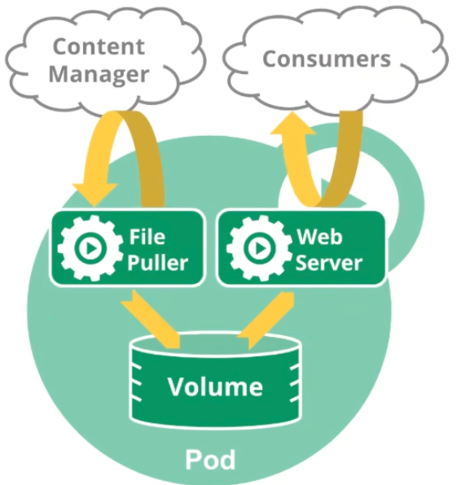

# 第2章 Kubernetes核心实战

## 写在前面

<span style="color:red;font-weight:bold;font-size:28px">标题后面的 (N) 表示与命名空间有关</span>


## 0 资源创建方式

- 命令行
- YAML

## 1 工作负载 `N`

### 1.1 Pod

运行中的一组容器，pod是kubernetes中应用的最小单位。

:::details 查看图示




:::

- 创建一个pod

:::code-group

```bash [命令行]
$ kubectl run mynginx --image=nginx
```

```bash [YAML]
$ cat <<EOF | kubectl apply -f -
apiVersion: v1
kind: Pod
metadata:
  name: mynginx
  labels:
    run: mynginx
spec:
  containers:
  - image: nginx
    name: mynginx
EOF
```

```bash [YAML-单Pod多容器]
$ cat <<EOF | kubectl apply -f -
apiVersion: v1
kind: Pod
metadata:
  name: myapp
  labels:
    run: myapp
spec:
  containers:
  - image: nginx
    name: mynginx
  - image: tomcat:8.5-jre8-slim
    name: tomcat
EOF
```

:::

语法：`kubectl run name --image=(镜像名) --replicas=(备份数) --port=(容器要暴露的端口) --labels=(设定自定义标签) `


- 删除pod

:::code-group

```bash [命令行]
$ kubectl delete po mynginx
```

```bash [YAML]
$ cat <<EOF | kubectl delete -f -
apiVersion: v1
kind: Pod
metadata:
  name: mynginx
  labels:
    run: mynginx
spec:
  containers:
  - image: nginx
    name: mynginx
EOF
```

:::


- 查看pod

  - 查看默认命名空间下的pod

  ```bash
  $ kubectl get po
  ```

  - 查看指定命名空间的pod

  ```bash
  $ kubectl get po -n kube-system
  ```

  - 查看所有的pod

  ```bash
  $ kubectl get po -A
  ```

  - 查看pod运行详情

  ```bash
  $ kubeclt describe po mynginx
  ```

  - 查看pod的ip地址等更详细信息

  ```bash
  $ kubectl get po -o wide
  ```

  > 注意，得到的IP，可以访问pod：`curl ip:port`

  - 查看pod的标签

  ```bash
  $ kubectl get pod --show-labels
  ```

  <span style="color:#9400D3;font-weight:bold;">查看容器组内部有多少容器</span>

  ```bash
  # 方式一
  $ kubectl get pod <pod-name> -n <namespace> -o jsonpath='{.spec.initContainers[*].name} {.spec.containers[*].name}'
  # 方式二
  $ kubectl get pod <pod-name> -n <namespace> -o json | jq -r '[.spec.initContainers[].name, .spec.containers[].name] | join(" ")'
  ```

- 监控pod

```bash
$ kubectl get po -o wide -w
```

- 查看pods日志

:::code-group

```bash [单Pod单容器]
$ kubectl logs -f mynginx
```

```bash [单Pod多容器]
$ kubectl logs -f myapp -c tomcat
```

:::

- 进入pod内部

:::code-group

```bash [单Pod单容器]
$ kubectl exec -it mynginx -- /bin/bash
```

```bash [单Pod多容器]
$ kubectl exec -it myapp -c tomcat -- /bin/bash
# 进入Pod后，在tomcat容器访问nginx容器： curl 127.0.0.1:80
$ curl 127.0.0.1:80
```

:::


### 1.2 Deployment

控制Pod，使Pod拥有多副本，自愈，扩缩容等能力。

- 清除其他Pod，比较下面两个命令有何不同效果！

```bash
$ kubectl run mynginx --image=nginx
$ kubectl create deploy mytomcat --image=tomcat:8.5-jre8-slim
```

> 说明：
>
> 1. deployment方式部署，Pod具有自愈能力，被删除Pod后，会重新启动一个新的Pod。
> 2. 只有通过删除deployment，才能真正删除！

#### 1.2.1 多副本

- 创建deployment

:::code-group

```bash [命令行]
$ kubectl create deploy my-dep --image=nginx --replicas=3
```

```bash [YAML]
$ cat <<EOF | kubectl apply -f -
apiVersion: apps/v1
kind: Deployment
metadata:
  name: my-dep
  labels:
    app: my-dep
spec:
  replicas: 3
  selector:
    matchLabels:
      app: my-dep
  template:
    metadata:
      labels:
        app: my-dep
    spec:
      containers:
      - image: nginx
        name: mynginx
EOF
```

:::

- 删除deployment

:::code-group

```bash [命令行]
$ kubectl delete deploy my-dep
```

```bash [YAML]
$ cat <<EOF | kubectl delete -f -
apiVersion: apps/v1
kind: Deployment
metadata:
  name: my-dep
  labels:
    app: my-dep
spec:
  replicas: 3
  selector:
    matchLabels:
      app: my-dep
  template:
    metadata:
      labels:
        app: my-dep
    spec:
      containers:
      - image: nginx
        name: mynginx
EOF
```

:::

- 查看

  - 查看部署

  ```bash
  $ kubectl get deploy
  ```

  - 以yaml格式查看部署

  ```bash
  $ kubectl get deploy -oyaml
  ```

  - 使用标签检索Pod

  ```bash
  $ kubectl get pod -l app=my-dep
  ```

#### 1.2.2 扩缩容

:::code-group

```bash [命令行]
$ kubectl scale --replicas=3 deploy/my-dep
```

```bash [直接编辑deploy]
# 修改 spec.replicas: n
$ kubectl edit deploy my-dep
```

:::

#### 1.2.3 自愈

- 停掉某个pod验证，会发现比较快的重启新的pod
- 对某个节点关机验证，会发现5m后会停掉不可用pod，重新启动pod

#### 1.2.4 滚动更新

:::code-group

```bash [命令行]
$ kubectl set image deploy/my-dep mynginx=nginx:1.25.4 --record
# 查看更新进度详情
$ kubectl rollout status deploy/my-dep
```

```bash [直接编辑deploy]
$ kubectl edit deploy/my-dep
```

:::

#### 1.2.5 版本回退

- 查看部署历史

```bash
$ kubectl rollout history deploy/my-dep
```

- 查看某个部署历史详情

```bash
$ kubectl rollout history deploy/my-dep --revision=2
```

- 回滚到上一版

```bash
$ kubectl rollout undo deploy/my-dep
```

- 回滚到指定版

```bash
$ kubectl rollout undo deploy/my-dep --to-revision=1
```


#### 1.2.6 其他工作负载

> 更多：
>
> 除了 `Pod` 和 `Deployment` ， K8S还有 `StatefulSet` 、 `DaemonSet` 、 `Job` 、`CronJob` 等类型资源。我们都称为 `工作负载`。
>
> 有状态应用使用 `StatefulSet` 部署，无状态应用使用 `Deployment` 部署。
>
> https://kubernetes.io/zh/docs/concepts/workloads/controllers/

| 工作负载类型 | 工作负载名称  | 作用                                                     |
| ------------ | ------------- | -------------------------------------------------------- |
| Deployment   | 无状态        | 无状态应用部署。比如微服务，提供多副本等功能             |
| StatefulSet  | 有状态副本集  | 有状态应用部署。比如Redis，提供稳定的存储、网络等功能    |
| DaemonSet    | 守护进程集    | 守护型应用部署。比如日志收集组件，在每个机器上都运行一份 |
| Job/CronJob  | 任务/定时任务 | 定时任务部署。比如垃圾清理组件，可以在指定时间运行。     |


## 2 服务 `N`

### 2.1 Service

> 将一组 Pods 公开为网络服务的抽象方法。
>
> Service是Pod的服务发现与负载均衡。

- 创建Service

:::code-group

```bash [命令行-集群内访问]
# 暴露Deploy，集群内使用 http://<service-ip>:<port> 即可负载均衡的访问
# 也可以在pod的容器内部 http://<service-name>.<namespace>.svc:<port> 访问，比如： curl my-dep.default.svc:8000
$ kubectl expose deploy my-dep --port=8000 --target-port=80 --type=ClusterIP
```

```bash [YAML]
$ cat <<EOF | kubectl apply -f -
apiVersion: v1
kind: Service
metadata:
  name: my-dep 
  labels:
    app: my-dep
spec:
  selector:
    app: my-dep
  ports:
  - port: 8000
    protocol: TCP
    targetPort: 80
EOF
```

```bash [命令行-集群外访问]
$ kubectl expose deploy my-dep --port=8000 --target-port=80 --type=NodePort
```

:::


> 在Pod内测试访问Service时DNS解析时间
>
> 语法：`kubectl exec -it <pod-name> -- /bin/bash -c time nslookup <service-name>.<namespace>.svc`
>
> 示例：
>
> ```bash
> $ kubectl exec -it mytomcat-769875c4c-wpxkq -- /bin/bash -c time nslookup my-dep.default.svc
> ```
>
> 或者：
>
> ```bash
> $ kubectl exec -it mytomcat-769875c4c-wpxkq -- /bin/bash -c ' \
> start=$(date +%s); \
> time nslookup my-dep.default.svc; \
> end=$(date +%s); \
> echo "Duration: $((end - start)) seconds" \
> '
> ```

- 删除Service

```bash
$ kubectl delete svc my-dep
```

- 查看Service端点状态

```bash
# $ kubectl get endpoints <service-name> -n <namespace>
$ kubectl get endpoints my-dep -n default
```

- 查看Service

```bash
$ kubectl get svc
```

### 2.2 Ingress

参考：[安装ingress-nginx](/devops/new/Kubernetes/01-%E7%AC%AC1%E7%AB%A0%20Kubeadmin%E5%AE%89%E8%A3%85K8S%20V1.23.html#_5-%E5%AE%89%E8%A3%85ingress-nginx-%E5%9C%A8master%E8%8A%82%E7%82%B9%E6%89%A7%E8%A1%8C)

#### 2.2.1 域名访问

:::details ingress-domain.yaml配置

```bash
tee ingress-domain.yaml << EOF
#deploy
apiVersion: apps/v1
kind: Deployment
metadata:
  name: domain-deploy
spec:
  selector:
    matchLabels:
      app: domain-pod
  replicas: 1
  template:
    metadata:
      labels:
        app: domain-pod
    spec:
      containers:
      - name: nginx
        image: nginx:1.25.4
        ports:
        - containerPort: 80
---
#service
apiVersion: v1
kind: Service
metadata:
  name: domain-service
spec:
  selector:
    app: domain-pod
  type: ClusterIP
  ports:
  - protocol: TCP
    port: 80
    targetPort: 80
---
#ingress
apiVersion: networking.k8s.io/v1
kind: Ingress
metadata:
  name: domain-ingress
spec:
  ingressClassName: nginx
  rules:
  - host: nginx.fsmall.com
    http:
      paths:
      # /nginx 表示把请求转发给pod处理，若有映射但无资源则404；若pod无映射则ingress自身处理，找不到则（404）。
      - path: /
        pathType: Prefix
        backend:
          service:
            name: domain-service
            port:
              number: 80
EOF
```

:::

配置资源生效：

:::code-group

```bash [创建]
$ kubectl apply -f ingress-domain.yaml
```

```bash [在集群外通过ing域名访问]
$ kubectl get ing
NAME           CLASS   HOSTS              ADDRESS   PORTS   AGE
ingress-http   nginx   nginx.fsmall.com             80      19s

# 配置本地DNS：访问emon2或emon3的DNS
$ vim /etc/hosts
192.168.200.117 nginx.fsmall.com

# 访问
http://nginx.fsmall.com # 看到正常nginx界面
```

```bash [删除]
$ kubectl delete -f ingress-domain.yaml
```

:::

#### 2.2.2 路径重写

:::details ingress-rewrite.yaml配置

```js
tee ingress-rewrite.yaml << EOF
#deploy
apiVersion: apps/v1
kind: Deployment
metadata:
  name: rewrite-deploy
spec:
  selector:
    matchLabels:
      app: rewrite-pod
  replicas: 1
  template:
    metadata:
      labels:
        app: rewrite-pod
    spec:
      containers:
      - name: nginx
        image: nginx:1.25.4
        ports:
        - containerPort: 80
---
#service
apiVersion: v1
kind: Service
metadata:
  name: rewrite-service
spec:
  selector:
    app: rewrite-pod
  type: ClusterIP
  ports:
  - protocol: TCP
    port: 80
    targetPort: 80
---
#ingress
apiVersion: networking.k8s.io/v1
kind: Ingress
metadata:
  annotations: // [!code focus:3] [!code ++]
    nginx.ingress.kubernetes.io/use-regex: "true" // [!code ++]
    nginx.ingress.kubernetes.io/rewrite-target: /\$1 // [!code ++]
  name: rewrite-ingress
spec:
  ingressClassName: nginx
  rules:
  - host: nginx.fsmall.com
    http:
      paths:
      - path: / // [!code focus:4] [!code --]
        pathType: Prefix // [!code --]
      - path: "/something$" // [!code ++]
        pathType: ImplementationSpecific // [!code ++]
        backend:
          service:
            name: rewrite-service
            port:
              number: 80
      - path: "/something/(.*)" // [!code focus:7] [!code ++]
        pathType: ImplementationSpecific // [!code ++]
        backend: // [!code ++]
          service: // [!code ++]
            name: rewrite-service // [!code ++]
            port: // [!code ++]
              number: 80 // [!code ++]
EOF
```

> ingress-nginx v1.6.4对正则表达式中的`|`不支持，需要转换为等效的2个正则。
> `/something(/|$)(.*)` ==> `/something$` 和 `/something/(.*)`

效果：

http://nginx.fsmall.com ingress返回404

http://nginx.fsmall.com/something 有效

http://nginx.fsmall.com/something/ 有效

http://nginx.fsmall.com/something/abc rewrite-pod返回404

:::

配置资源生效：

:::code-group

```bash [创建]
$ kubectl apply -f ingress-rewrite.yaml
```

```bash [在集群外通过ing域名访问]
$ kubectl get ing
NAME           CLASS   HOSTS                                ADDRESS        PORTS   AGE
ingress-http   nginx   nginx.fsmall.com,tomcat.fsmall.com   10.96.217.34   80      11m

# 配置本地DNS：访问emon2或emon3的DNS
$ vim /etc/hosts
192.168.200.117 nginx.fsmall.com

# 访问
http://nginx.fsmall.com # 看到正常nginx界面
```

```bash [删除]
$ kubectl delete -f ingress-rewrite.yaml
```

:::

#### 2.2.3 流量限制

:::details ingress-limit.yaml配置

```js
tee ingress-limit.yaml << EOF
#deploy
apiVersion: apps/v1
kind: Deployment
metadata:
  name: limit-deploy
spec:
  selector:
    matchLabels:
      app: limit-pod
  replicas: 1
  template:
    metadata:
      labels:
        app: limit-pod
    spec:
      containers:
      - name: nginx
        image: nginx:1.25.4
        ports:
        - containerPort: 80
---
#service
apiVersion: v1
kind: Service
metadata:
  name: limit-service
spec:
  selector:
    app: limit-pod
  type: ClusterIP
  ports:
  - protocol: TCP
    port: 80
    targetPort: 80
---
#ingress
apiVersion: networking.k8s.io/v1
kind: Ingress
metadata:
  name: limit-ingress
  annotations: // [!code focus:2] [!code ++]
    nginx.ingress.kubernetes.io/limit-rps: "1" // [!code ++]
spec:
  ingressClassName: nginx
  rules:
  - host: nginx.fsmall.com
    http:
      paths:
      - path: /
        pathType: Prefix
        backend:
          service:
            name: limit-service
            port:
              number: 80
EOF
```

> 访问过快，会提示：503 Service Temporarily Unavailable

:::

配置资源生效：

:::code-group

```bash [创建]
$ kubectl apply -f ingress-limit.yaml
```

```bash [在集群外通过ing域名访问]
$ kubectl get ing
NAME           CLASS   HOSTS              ADDRESS   PORTS   AGE
ingress-http   nginx   nginx.fsmall.com             80      19s

# 配置本地DNS：访问emon2或emon3的DNS
$ vim /etc/hosts
192.168.200.117 nginx.fsmall.com

# 访问
http://nginx.fsmall.com # 看到正常nginx界面
```

```bash [删除]
$ kubectl delete -f ingress-limit.yaml
```

:::


## 3 配置和存储

参考：[安装NFS存储抽象](/devops/new/Kubernetes/01-%E7%AC%AC1%E7%AB%A0%20Kubeadmin%E5%AE%89%E8%A3%85K8S%20V1.23.html#_7-%E5%AD%98%E5%82%A8%E6%8A%BD%E8%B1%A1)

### 3.1 Persisten Persistent Volume Claims 存储卷声明`N`

> PV：持久卷（Persistent Volume），将应用需要持久化的数据保存到指定位置。
>
> PVC：持久卷声明（Persistent Volume Claim），申明需要使用的持久卷规格。

#### 3.1.1 创建PV池

参考：[创建PV池](/devops/new/Kubernetes/02-%E7%AC%AC2%E7%AB%A0%20Kubernetes%E6%A0%B8%E5%BF%83%E5%AE%9E%E6%88%98.html#%E5%88%9B%E5%BB%BApv%E6%B1%A0)

#### 3.1.2 PVC创建与绑定 `N`

- 创建PVC

```yaml
tee nfs-pvc.yaml << EOF
apiVersion: v1
kind: PersistentVolumeClaim
apiVersion: v1
metadata:
  name: nginx-pvc
spec:
  accessModes:
    - ReadWriteMany
  resources:
    requests:
      storage: 200Mi
  storageClassName: nfs
EOF
```

- 创建Pod绑定PVC

```yaml
tee nfs-deploy.yaml << EOF
apiVersion: apps/v1
kind: Deployment
metadata:
  labels:
    app: nginx-deploy-pvc
  name: nginx-deploy-pvc
spec:
  replicas: 2
  selector:
    matchLabels:
      app: nginx-deploy-pvc
  template:
    metadata:
      labels:
        app: nginx-deploy-pvc
    spec:
      containers:
      - image: nginx:1.25.4
        name: nginx
        volumeMounts:
        - name: html
          mountPath: /usr/share/nginx/html
      volumes:
        - name: html
          persistentVolumeClaim:
            claimName: nginx-pvc
EOF
```

- 验证

```bash
$ kubectl get pv,pvc,po -owide
NAME                        CAPACITY   ACCESS MODES   RECLAIM POLICY   STATUS      CLAIM               STORAGECLASS   REASON   AGE   VOLUMEMODE
persistentvolume/pv01-10m   10M        RWX            Retain           Available                       nfs                     37m   Filesystem
persistentvolume/pv02-1gi   1Gi        RWX            Retain           Bound       default/nginx-pvc   nfs                     37m   Filesystem
persistentvolume/pv03-3gi   3Gi        RWX            Retain           Available                       nfs                     37m   Filesystem

NAME                              STATUS   VOLUME     CAPACITY   ACCESS MODES   STORAGECLASS   AGE   VOLUMEMODE
persistentvolumeclaim/nginx-pvc   Bound    pv02-1gi   1Gi        RWX            nfs            17m   Filesystem

NAME                                   READY   STATUS    RESTARTS   AGE    IP               NODE    NOMINATED NODE   READINESS GATES
pod/nginx-deploy-pvc-58dd6c57f-4976v   1/1     Running   0          5m7s   10.244.161.2     emon3   <none>           <none>
pod/nginx-deploy-pvc-58dd6c57f-lt8wb   1/1     Running   0          5m7s   10.244.108.117   emon2   <none>           <none>

# ------------------------------------------------------------------------
$ echo 222222 > /nfs/data/02/index.html
$ curl 10.244.161.2
222222
$ curl 10.244.108.117
222222
```


### 3.2 ConfigMap

> 抽取应用配置，并且可以自动更新。

#### 3.2.1 Redis示例

- 创建cm

```bash
# 创建配置，redis保存到K8S的etcd；
$ echo "appendonly yes" > redis.conf
$ kubectl create cm redis-conf --from-file=redis.conf
# 查看
$ kubectl get cm redis-conf -oyaml
```

```yaml
apiVersion: v1
# 配置文件真正的数据，key是文件名，value是内容
data:
  redis.conf: |
    appendonly yes
kind: ConfigMap
metadata:
  name: redis-conf
  namespace: default
```

- 创建Pod

```yaml
tee redis.yaml << EOF
apiVersion: v1
kind: Pod
metadata:
  name: redis
spec:
  containers:
  - name: redis
    image: redis:7.0
    command:
    - redis-server
    - "/redis-master/redis.conf" # 指的是redis容器内部的位置
    ports:
    - containerPort: 6379
    volumeMounts:
    - mountPath: /data
      name: data
    - mountPath: /redis-master
      name: config
  volumes:
  - name: data
    emptyDir: {}
  - name: config
    configMap:
      name: redis-conf
      items:
      - key: redis.conf
        path: redis.conf
EOF
```


- 验证

```bash
$ kubectl exec -it redis -- redis-cli
127.0.0.1:6379> config get appendonly
1) "appendonly"
2) "yes"
```

- 修改cm

```bash
$ kubectl edit cm redis-conf
```

```js
apiVersion: v1
data:
  redis.conf: |
    appendonly yes
    requirepass redis123 // [!code ++] [!code focus]
kind: ConfigMap
metadata:
  creationTimestamp: "2025-06-08T14:32:17Z"
  name: redis-conf
  namespace: default
  resourceVersion: "430742"
  uid: c78cf129-9d62-436f-a1f2-bb1e69f27b35
```

- 检查cm配置在pod中是否感知到（能感知到刷新，但并未生效，除非重启Pod）

```bash
$ kubectl exec -it redis -- cat /redis-master/redis.conf
appendonly yes
requirepass redis123
```


### 3.3 Secrets 密码 `N`

> Secret对象类型用来保存敏感信息，例如密码、OAuth令牌和SSH秘钥。将这些信息放在`secret`中比方在Pod的定义或者容器镜像中来说更加安全和灵活。

- 创建secrets

:::code-group

```bash [命令格式]
$ kubectl create secret docker-registry regcred \
--docker-server=<你的镜像仓库服务器> \
--docker-username=<你的用户名> \
--docker-password=<你的密码> \
--docker-email=<你的邮箱地址>
```

```bash [示例]
$ kubectl create secret docker-registry rushing-docker \
--docker-username=rushing \
--docker-password=rushing123 \
--docker-email=123@qq.com
```

:::

> - **`docker-registry`**：指定创建的 Secret 类型为 Docker 镜像仓库认证专用（存储 `~/.docker/config.json` 格式的认证信息）。
> - **`rushing-docker`**：自定义的 Secret 名称，后续在 Pod 中需通过此名称引用。


- 创建Pod

```yaml
tee secret.yaml << EOF
apiVersion: v1
kind: Pod
metadata:
  name: private-nginx
spec:
  containers:
  - name: private-nginx
    image: rushing/zkui-arm64:latest
  imagePullSecrets:
  - name: rushing-docker
EOF
```

### 3.4 Storage Classes

#### 3.4.1 pv&pvc&sc的关系

##### <span style="color:blue;font-weight:bold;">核心关系总结</span>

1. **用户通过 PVC 申请存储资源**
2. **PV 提供实际的存储资源**
3. **StorageClass 实现 PV 的动态创建**
4. **PVC 与 PV 通过匹配条件绑定**

##### <span style="color:blue;font-weight:bold;">详细解析三者的关系</span>

1. PersistentVolume (PV) - **存储资源的抽象**

- **是什么**：集群中的一块**实际存储**（如 NFS 卷、云磁盘等）
- **谁创建**：管理员手动创建 **或** StorageClass 动态创建
- **特点**：
  - 独立于 Pod 生命周期（Pod 删除后数据保留）
  - 包含存储细节（容量、访问模式、存储类型等）

2. PersistentVolumeClaim (PVC) - **用户存储需求的声明**

- **是什么**：用户对存储的**请求声明**（指定容量、访问模式等）
- **谁创建**：应用开发者（在 Deployment/StatefulSet 中定义）
- **核心作用**：
  - 描述应用需要的存储特性
  - 寻找匹配的 PV 并与之绑定
  - 被 Pod 挂载后作为卷使用

3. StorageClass (SC) - **动态供给的模板**

- **是什么**：定义**如何动态创建 PV 的模板**
- **谁创建**：管理员（配置供应商参数）
- **核心能力**：
  - 按 PVC 请求自动创建匹配的 PV
  - 关联存储供应商（如 AWS EBS, GCE PD, Ceph RBD）
  - 支持参数化配置（磁盘类型、IOPS 等）

##### <span style="color:blue;font-weight:bold;">三者的关键关联点</span>

| 组件         | 绑定依据                            | 生命周期管理               |
| :----------- | :---------------------------------- | :------------------------- |
| **PV & PVC** | 容量、AccessModes、storageClassName | PVC 删除后 PV 可保留或回收 |
| **PVC & SC** | PVC 中指定的 storageClassName       | SC 删除不影响已创建的 PV   |
| **SC & PV**  | SC 的 provisioner 决定 PV 创建方式  | SC 控制 PV 的动态生成      |

#### 3.4.2 pvc使用pv的两种方式

- 静态供给 (Static Provisioning)


1. 管理员预创建多个 PV
2. PVC 根据容量/访问模式匹配 PV
3. 绑定后 Pod 使用 PVC

- 动态供给 (Dynamic Provisioning) - **主流方式**


1. PVC 中指定 `storageClassName`
2. SC 监听到 PVC 请求，调用存储插件创建 PV
3. 自动将 PVC 与新 PV 绑定
4. Pod 挂载 PVC 使用存储

#### 3.4.3 如何动态使用pv？通过默认sc！

##### 1 创建默认sc需要哪些组件？

千万不要以为，创建默认sc很简单，其实需要：

- 创建 Service Account 和 RBAC 权限

  - ServiceAccount

  - ClusterRole

  - ClusterRoleBinding
- 部署 NFS Provisioner
- 创建默认 StorageClass

##### 2 为什么需要这么多组件配合？

- 为什么需要这么多组件？架构解析


1. **Service Account (服务账户) - 身份认证**

- **为什么需要**：Kubernetes 采用 RBAC 安全模型，所有 Pod 操作 API 都需要身份认证
- **作用**：为 Provisioner Pod 创建专用身份 `nfs-provisioner`
- **类比**：就像给一个工作人员办理工作证，没有工作证无法进入办公区操作设备

2. **RBAC (基于角色的访问控制) - 权限管理**

- **为什么需要**：Provisioner 需要特定权限来管理 PV/PVC 等资源

- **核心权限**：

  - `persistentvolumes`：创建/删除 PV
  - `persistentvolumeclaims`：更新 PVC 状态
  - `storageclasses`：读取存储类配置
  - `events`：记录操作事件

- **关键配置**：

  ```yaml
  rules:
  - apiGroups: [""]
    resources: ["persistentvolumes"]
    verbs: ["get", "list", "watch", "create", "delete"]
  ```

- **类比**：给持有工作证的工作人员分配具体工作权限（如操作存储设备的权限）

3. **NFS Provisioner (供给器) - 动态创建引擎**

- **为什么需要**：Kubernetes 本身没有内置 NFS 动态供给能力

- **核心功能**：

  - 监听 PVC 创建事件
  - 根据 StorageClass 规则在 NFS 服务器创建目录
  - 自动生成 PV 并绑定到 PVC

- **关键组件**：

  ```yaml
  env:
  - name: PROVISIONER_NAME
    value: k8s-sigs.io/nfs-subdir-external-provisioner
  - name: NFS_SERVER
    value: 192.168.1.100
  ```

- **类比**：自动化工厂机器人，接到订单（PVC）后自动生产产品（PV）

4. **StorageClass (存储类) - 供给规则模板**

- **为什么需要**：定义动态供给的行为规则

- **关键配置**：

  ```yaml
  provisioner: k8s-sigs.io/nfs-subdir-external-provisioner
  parameters:
    archiveOnDelete: "false"
  mountOptions:
    - nfsvers=4.1
  ```

- **设为默认的重要性**：

  - 使未指定 `storageClassName` 的 PVC 能自动使用
  - 解决你遇到的 `no storage class is set` 错误

##### 3 完整工作流程解析


##### 4 各组件关系总结表

| 组件            | 必须性 | 作用         | 是否可复用                |
| :-------------- | :----- | :----------- | :------------------------ |
| Service Account | 必需   | 提供身份认证 | 是 (可多SC共享)           |
| RBAC            | 必需   | 授予操作权限 | 是                        |
| NFS Provisioner | 必需   | 执行动态创建 | 是 (可服务多SC)           |
| StorageClass    | 必需   | 定义供给规则 | 否 (每个存储类型需独立SC) |
| NFS Server      | 必需   | 实际存储后端 | 是                        |

> ⚠️ **生产环境警告**：虽然静态供给简单，但长期管理成本高。当有多个 PVC 时，动态方案能减少 90% 的管理工作。

## 4 集群

### Namespace 命名空间

用来对集群资源进行隔离划分。默认只隔离资源，不隔离网络。

- 创建命名空间

:::code-group

```bash [命令行]
$ kubectl create ns hello
```

```bash [YAML]
$ cat <<EOF | kubectl apply -f -
apiVersion: v1
kind: Namespace
metadata:
  name: hello
EOF
```

:::

- 删除命名空间

:::code-group

```bash [命令行]
$ kubectl delete ns hello
```

```bash [YAML]
$ cat <<EOF | kubectl delete -f -
apiVersion: v1
kind: Namespace
metadata:
  name: hello
EOF
```

:::

- 查看命名空间

```bash
$ kubectl get ns
```

### Persistent Volumes 存储卷

#### 创建PV池

- 静态供应

```bash
# nfs主节点
$ mkdir -p /nfs/data/{01,02,03}
```

- 创建PV

:::details 创建PV

```yaml
tee nfs-pv.yaml << EOF
apiVersion: v1
kind: PersistentVolume
metadata:
  name: pv01-10m
spec:
  capacity:
    storage: 10M
  accessModes:
    - ReadWriteMany
  storageClassName: nfs
  nfs:
    path: /nfs/data/01
    server: 192.168.200.116
---
apiVersion: v1
kind: PersistentVolume
metadata:
  name: pv02-1gi
spec:
  capacity:
    storage: 1Gi
  accessModes:
    - ReadWriteMany
  storageClassName: nfs
  nfs:
    path: /nfs/data/02
    server: 192.168.200.116
---
apiVersion: v1
kind: PersistentVolume
metadata:
  name: pv03-3gi
spec:
  capacity:
    storage: 3Gi
  accessModes:
    - ReadWriteMany
  storageClassName: nfs
  nfs:
    path: /nfs/data/03
    server: 192.168.200.116
EOF
```

:::

## 集群中控制节点的污点查询

```bash
$ kubectl describe node emon | grep Taints
Taints:             node-role.kubernetes.io/master:NoSchedule
# 若是高版本K8S得到：
Taints:             node-role.kubernetes.io/control-plane:NoSchedule
```

## 为节点添加标签

```bash
$ kubectl label nodes emon node-role.kubernetes.io/worker=ci --overwrite
```


