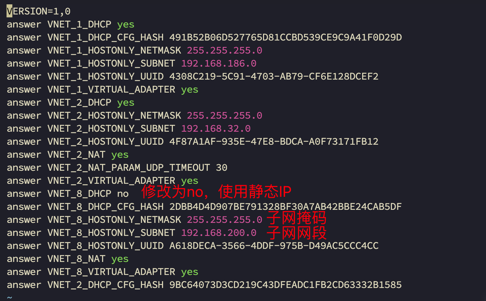
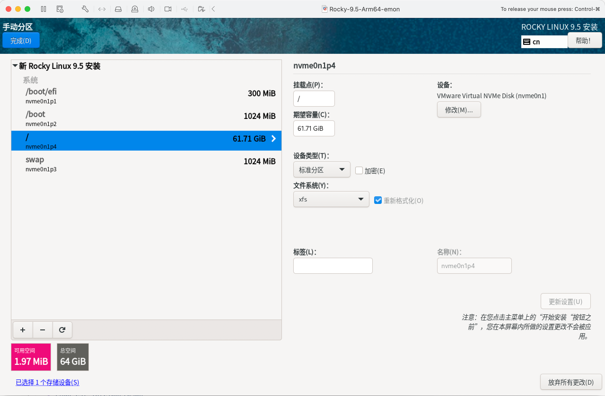
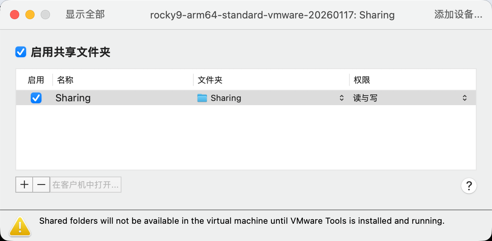
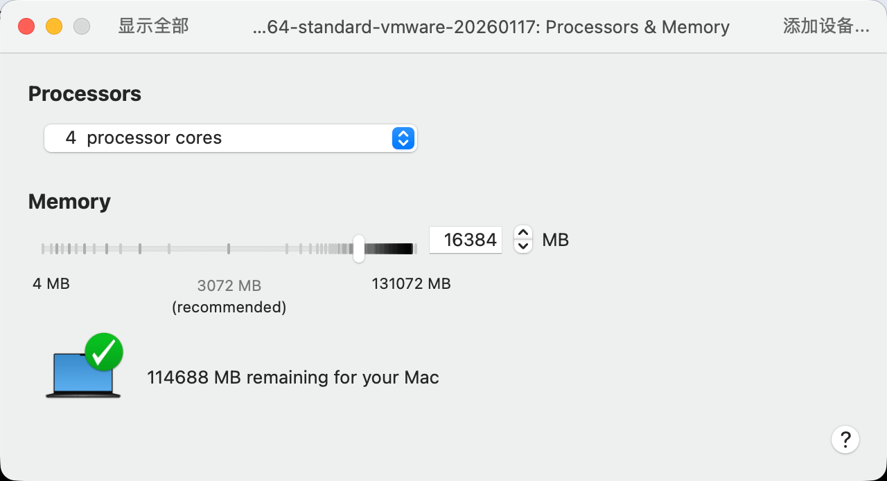
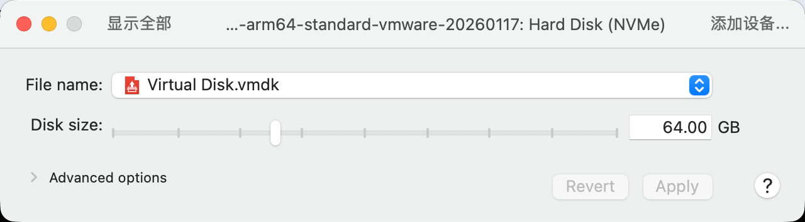
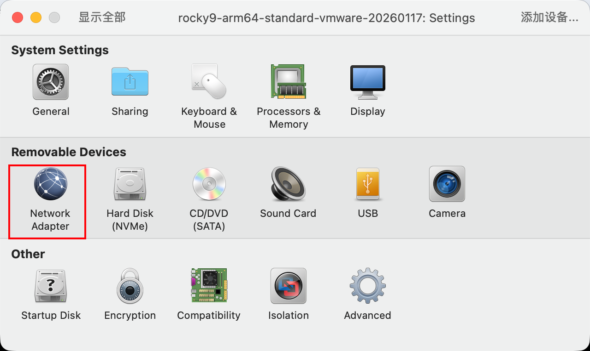
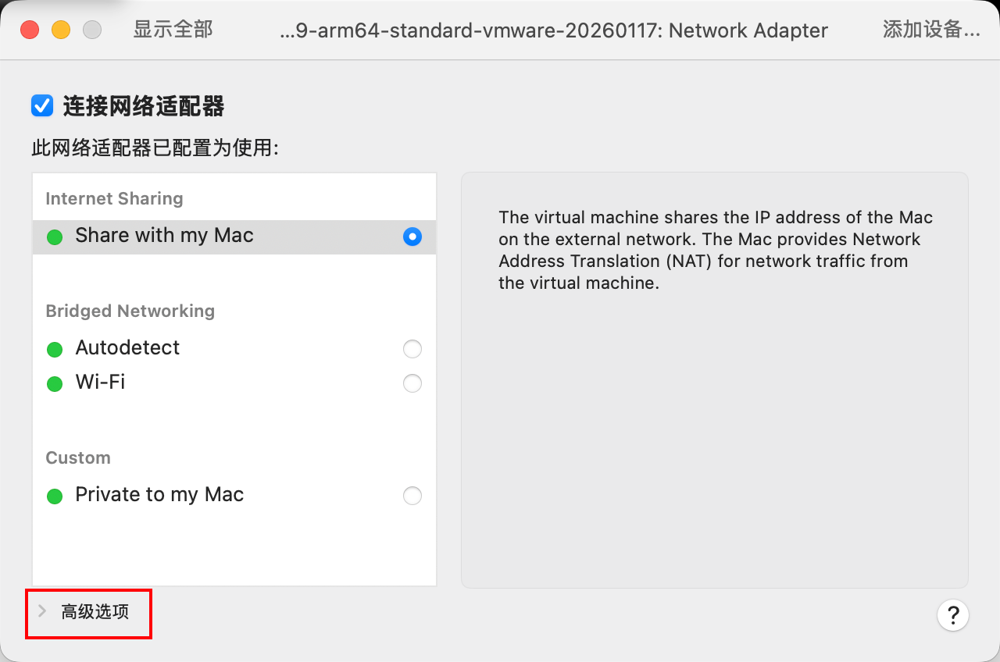
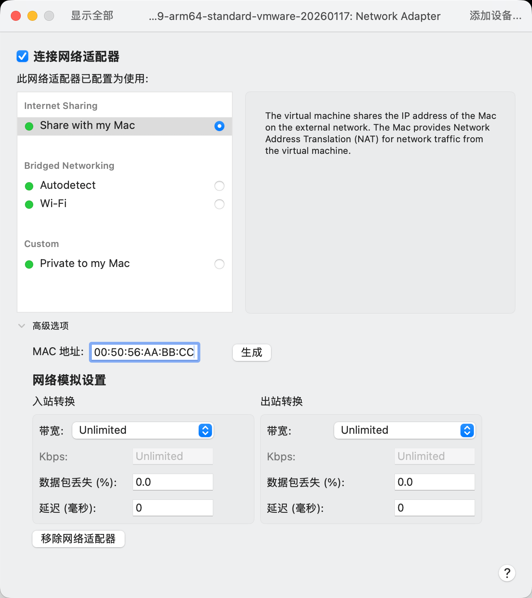
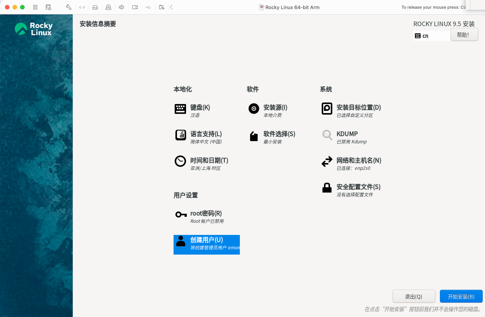
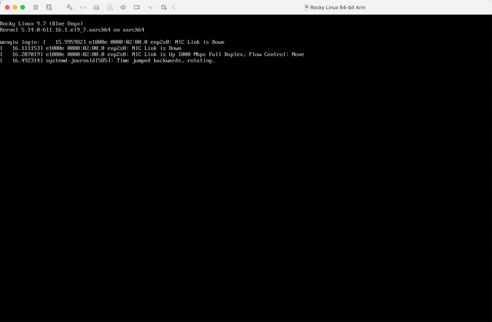

# 第1章 系统安装

## 1  系统安装

本文基于CentOS7最小化安装，主机名`wenqiu`。

### 1.1 分区规划

由于安装目的是学习演练，可能会安装很多软件，保存很多安装包，所以分配300G用来使用（我试过100G不够用的情况），如果是一般性系统安装，分配50G也就够了。分区格式RHEL7开始采用`XSF`格式。

| 挂载点 | 说明                                                         |
| ------ | ------------------------------------------------------------ |
| /boot  | 主分区，存放Linux启动所需的核心文件，推荐大小200M足够，分配1G |
| /      | 逻辑分区，分配50G                                            |
| /home  | 逻辑分区，分配50G                                            |
| swap   | 逻辑分区，虚拟内存，分区格式swap，分配5G                     |
| /var   | 逻辑分区，分配70G                                            |
| /tmp   | 逻辑分区，分配20G                                            |
| /usr   | 逻辑分区，剩下全部空间（大约105G左右）                       |

<span style="color:red;font-weight:bold;">多年使用心得：如果没有特殊需要，建议分3个区（或4个分区，包含/boot/efi分区）即可：</span>

| 挂载点    | 说明                                                         |
| --------- | ------------------------------------------------------------ |
| /boot/efi | 为使用EFI固件的系统设置的特定目录，用于存放EFI启动加载器等内容。分配300MiB |
| /boot     | 存放Linux启动所需的核心文件，推荐大小200M足够。分配1024MiB   |
| swap      | 虚拟内存，分区格式swap，分配大小与内存相关。分配1024MiB      |
| /         | 剩余所有可分配内存，比如100G基本很多场景都够用。             |

其中`swap`分区的大小说明如下：

| 物理内存 | 之前交换分区方案（swap）  | 现在交换分区方案（swap） |
| :------- | :------------------------ | ------------------------ |
| <=4G     | 至少4G，或者物理内存的2倍 | 4GB                      |
| 4~16G    | 至少8G，或者物理内存的1倍 | 2GB                      |
| 16~64G   | 至少16G                   | 1GB                      |
| 64~256G  | 至少32G                   | 1GB                      |

<span style="color:#1E90FF;font-weight:bold;">来源：Red Hat/Oracle/SUSE等企业发行版的旧文档</span> <span style="color:red;font-weight:bold;">但这些指南在SSD和现代内存管理下已经过时！</span>

### 1.2 IP规划

#### 1.2.1 修改vmnet8配置

- 查看vmnet8配置

```bash
$ cat /Library/Preferences/VMware\ Fusion/vmnet8/nat.conf | grep gateway -A 15
# NAT gateway address
ip = 192.168.38.2
netmask = 255.255.255.0

# VMnet device if not specified on command line
device = vmnet8

# Allow PORT/EPRT FTP commands (they need incoming TCP stream ...)
activeFTP = 1

# Allows the source to have any OUI.  Turn this on if you change the OUI
# in the MAC address of your virtual machines.
allowAnyOUI = 1

# VMnet host IP address
hostIp = 192.168.38.1
```

- 查看networking

```bash
$ cat /Library/Preferences/VMware\ Fusion/networking | grep VNET_8
answer VNET_8_DHCP yes
answer VNET_8_DHCP_CFG_HASH 2DBB4D4D907BE791328BF30A7AB42BBE24CAB5DF
answer VNET_8_HOSTONLY_NETMASK 255.255.255.0
answer VNET_8_HOSTONLY_SUBNET 192.168.38.0
answer VNET_8_HOSTONLY_UUID A618DECA-3566-4DDF-975B-D49AC5CCC4CC
answer VNET_8_NAT yes
answer VNET_8_VIRTUAL_ADAPTER yes
```

- 修改vmnet8配置

```bash
# vim打开，命令模式下替换 :1,%s/192.168.38/192.168.200/g
$ sudo vim /Library/Preferences/VMware\ Fusion/vmnet8/nat.conf
```

- 修改networking关于VNET_8的配置

```bash
$ sudo vim /Library/Preferences/VMware\ Fusion/networking 
```



<span style="color:red;font-weight:bold;">注意：这里 answer VNET_8_DHCP no 建议为 yes</span>

<span style="color:red;font-weight:bold;">修改后重启VMware Fusion，确保子网网段能ping通（旧网段应该就不通了）</span>

```bash
$ ping 192.168.200.0
PING 192.168.200.0 (192.168.200.0): 56 data bytes
64 bytes from 192.168.200.2: icmp_seq=0 ttl=128 time=0.221 ms
```

#### 1.2.2 为黄金镜像 VM 的 MAC 地址保留 IP

- 在 `dhcpd.conf` 文件末尾添加保留IP

```bash
$ sudo vim /Library/Preferences/VMware\ Fusion/vmnet8/dhcpd.conf
```

```bash
# 黄金镜像固定IP配置
host golden-vm {
    hardware ethernet 00:50:56:AA:BB:CC;  # ← 替换为你的 VM MAC
    fixed-address 192.168.200.100;
}
# 下面的不必要
host node1-vm {
    hardware ethernet 00:50:56:33:CF:6E;
    fixed-address 192.168.200.116;
}
host node2-vm {
    hardware ethernet 00:50:56:2E:DD:56;
    fixed-address 192.168.200.117;
}
host node3-vm {
    hardware ethernet 00:50:56:22:DA:59;
    fixed-address 192.168.200.118;
}
host other-vm {
    hardware ethernet 00:50:56:2B:B8:3D;
    fixed-address 192.168.200.119;
}
```

- 重启 VMware 网络服务

```bash
$ sudo /Applications/VMware\ Fusion.app/Contents/Library/vmnet-cli --stop
$ sudo /Applications/VMware\ Fusion.app/Contents/Library/vmnet-cli --start
```

或直接重启 Fusion 应用。

### 1.3 MacBook安装配置

- <span style="color:red;font-weight:bold;">概述：4CPU+16G内存+64G硬盘+标准分区，非必要不使用root用户！！！</span>

- 分区

| 挂载点    | 大小         | 说明                                                         | 设备类型 | 文件系统             |
| --------- | ------------ | ------------------------------------------------------------ | -------- | -------------------- |
| /boot/efi | 300MiB       | 为使用EFI固件的系统设置的特定目录，<br />用于存放EFI启动加载器等内容。分配300MiB | 标准分区 | EFI System Partition |
| /boot     | 1024MiB      | 存放Linux启动所需的核心文件，<br />推荐大小200M足够，分配1024MiB | 标准分区 | xfs                  |
| swap      | 1024MiB      | 虚拟内存，分区格式swap，分配大小与内存相关                   | LVM      | swap                 |
| /         | 剩下全部空间 | 剩下全部空间                                                 | LVM      | Xfs                  |

<div style="height:620px;overflow-y:auto;">
  
  
  
  
  
  
  
  
</div>

- 软件
  - 软件选择(S)
    - 最小安装
- 系统
  - 安装目标位置(D)
    - 自定义标准分区
  - KDUMP
    - 已禁用Kdump
  - 网络和主机名(N)
    - 主机名：standard
    - 以太网–连接名称：eth0（<span style="color:red;font-weight:bold;">不要修改设备名</span>）

- 用户设置
  - ROOT密码(R)：
    - 锁定root账户 ✅
    - 允许root用户使用密码进行SSH登录 ❎
  - 创建用户(U)
    - 全名(F)：emon
    - 用户名(U)：emon
      - 将此用户设为管理员(M) ✅
      - 需要密码才能使用改账户(R) ✅

- 最小化安装完成后默认服务情况

```bash
[emon@standard ~]$ nmcli conn show
NAME  UUID                                  TYPE      DEVICE 
eth0  ff3922c5-c880-3f88-a35f-27133ce5de5d  ethernet  enp2s0 
lo    4b0f421b-9d44-4a56-853b-d45e118b3b72  loopback  lo     
[emon@standard ~]$ df -h
文件系统        容量  已用  可用 已用% 挂载点
devtmpfs        4.0M     0  4.0M    0% /dev
tmpfs           7.8G     0  7.8G    0% /dev/shm
tmpfs           3.2G  8.8M  3.2G    1% /run
efivarfs        256K   34K  223K   14% /sys/firmware/efi/efivars
/dev/nvme0n1p4   62G  1.9G   60G    4% /
/dev/nvme0n1p2  960M  166M  795M   18% /boot
/dev/nvme0n1p1  300M  7.4M  293M    3% /boot/efi
tmpfs           1.6G     0  1.6G    0% /run/user/1000
[emon@standard ~]$ free -h
               total        used        free      shared  buff/cache   available
Mem:            15Gi       413Mi        15Gi       8.0Mi       177Mi        15Gi
Swap:          1.0Gi          0B       1.0Gi
[emon@standard ~]$ systemctl list-unit-files --type=service --state=enabled
UNIT FILE                          STATE   PRESET  
auditd.service                     enabled enabled 
chronyd.service                    enabled enabled 
crond.service                      enabled enabled 
dbus-broker.service                enabled enabled 
firewalld.service                  enabled enabled 
getty@.service                     enabled enabled 
irqbalance.service                 enabled enabled 
kdump.service                      enabled enabled 
mdmonitor.service                  enabled enabled 
NetworkManager-dispatcher.service  enabled enabled 
NetworkManager-wait-online.service enabled disabled
NetworkManager.service             enabled enabled 
nis-domainname.service             enabled enabled 
nvmefc-boot-connections.service    enabled enabled 
rsyslog.service                    enabled enabled 
selinux-autorelabel-mark.service   enabled enabled 
sshd.service                       enabled enabled 
sssd.service                       enabled enabled 
systemd-boot-update.service        enabled enabled 
systemd-network-generator.service  enabled enabled 
udisks2.service                    enabled enabled 

21 unit files listed.
```

## 2 基础配置（黄金镜像）

<span style="color: #FFD700; font-weight: bold; font-size: 30px; font-family: monospace; background: linear-gradient(90deg, #b8860b, #ffd700); -webkit-background-clip: text; -webkit-text-fill-color: transparent;">🏆 黄金镜像：rocky9-arm64-standard-vmware-20260118</span>

### 2.1 修改vim的缩进为4个空格

打开文件后，在最后一行追加如下内容：

```bash
$ sudo tee -a /etc/vimrc  <<'EOF'
" 个人配置
set tabstop=4
set softtabstop=4
set shiftwidth=4
set expandtab
" 如下设置，在vim的插入模式下，点击F9可以进入“插入(粘贴)”模式，再执行粘贴时不会混乱格式；再次点击F9退出“插入(粘贴)”模式。
set pastetoggle=<F9>
EOF
```

### 2.2 配置虚拟机共享文件夹

- 更新系统包

```bash
$ sudo dnf update -y
```

- 安装`open-vm-tools`

```bash
$ sudo dnf install -y open-vm-tools
```

```bash
# 查看共享文件名称
$ vmware-hgfsclient
```

- 安装桌面增强组件（如果使用图形界面）

```bash
$ sudo dnf install -y open-vm-tools-desktop
```

- 临时挂载共享文件夹（重启失效）

```bash
# .host:Sharing 表示虚拟机共享文件夹Sharing
$ sudo vmhgfs-fuse .host:/Sharing /mnt/hgfs -o subtype=vmhgfs-fuse,allow_other,uid=1000,gid=1000,noatime
```

```bash
# 查看共享文件夹
$ ls /mnt/hgfs
# 卸载
$ sudo umount /mnt/hgfs
```

### 2.3 使用系统镜像文件配置本地yum源

1. 基于共享文件创建dnf源

:::details 详情

```bash
# 在子Shell中执行
(
#!/bin/bash
set -euo pipefail

HGFS_MOUNT="/mnt/hgfs"
LOCAL_REPO_MOUNT="/mnt/localrepo"
REPO_NAME="Rocky9"
ISO_NAME="Rocky-9.7-aarch64-dvd.iso"
ISO_PATH="${HGFS_MOUNT}/${ISO_NAME}"

sudo mkdir -p "${HGFS_MOUNT}" "${LOCAL_REPO_MOUNT}"

# -------------------------------------------------------------------
# HGFS service — 注意：此处使用 <<EOF（无引号）以展开 HGFS_MOUNT
# -------------------------------------------------------------------
sudo tee /etc/systemd/system/mnt-hgfs.service > /dev/null <<EOF
[Unit]
Description=Mount VMware HGFS Shared Folder
After=vmtoolsd.service
Requires=vmtoolsd.service

[Service]
Type=oneshot
ExecStart=/bin/sh -c '/usr/bin/vmhgfs-fuse .host:/Sharing ${HGFS_MOUNT} -o subtype=vmhgfs-fuse,allow_other,uid=1000,gid=1000,noatime'
ExecStop=/bin/umount ${HGFS_MOUNT}
RemainAfterExit=yes

[Install]
WantedBy=multi-user.target
EOF

# -------------------------------------------------------------------
# ISO automount — mnt-localrepo.mount 需要展开 ISO_PATH，也用 <<EOF
# -------------------------------------------------------------------
sudo tee /etc/systemd/system/mnt-localrepo.automount > /dev/null <<'EOF'
[Unit]
Description=Auto-mount Local ISO Repository
[Automount]
Where=/mnt/localrepo
TimeoutIdleSec=300
[Install]
WantedBy=multi-user.target
EOF

sudo tee /etc/systemd/system/mnt-localrepo.mount > /dev/null <<EOF
[Unit]
Description=Local ISO Repository for ${REPO_NAME}
After=mnt-hgfs.service
Wants=mnt-hgfs.service
[Mount]
What=${ISO_PATH}
Where=/mnt/localrepo
Type=iso9660
Options=loop,ro,nosuid,nodev
[Install]
WantedBy=multi-user.target
EOF

# -------------------------------------------------------------------
# DNF repos — 同样需要变量展开
# -------------------------------------------------------------------
sudo tee /etc/yum.repos.d/${REPO_NAME}-BaseOS.repo > /dev/null <<EOF
[${REPO_NAME}-BaseOS]
name=${REPO_NAME} BaseOS
baseurl=file://${LOCAL_REPO_MOUNT}/BaseOS
enabled=1
gpgcheck=0
EOF

sudo tee /etc/yum.repos.d/${REPO_NAME}-AppStream.repo > /dev/null <<EOF
[${REPO_NAME}-AppStream]
name=${REPO_NAME} AppStream
baseurl=file://${LOCAL_REPO_MOUNT}/AppStream
enabled=1
gpgcheck=0
EOF

# -------------------------------------------------------------------
# VMware resume script — 内容固定，用 'EOF'
# -------------------------------------------------------------------
VMWARE_SCRIPT_DIR="/etc/vmware-tools/scripts/vmware"
sudo mkdir -p "${VMWARE_SCRIPT_DIR}"
sudo tee "${VMWARE_SCRIPT_DIR}/resume" > /dev/null <<'EOF'
#!/bin/bash
systemctl restart mnt-hgfs.service
EOF
sudo chmod +x "${VMWARE_SCRIPT_DIR}/resume"

# -------------------------------------------------------------------
# Enable services
# -------------------------------------------------------------------
sudo systemctl daemon-reload
sudo systemctl enable --now mnt-hgfs.service
sudo systemctl enable --now mnt-localrepo.automount

echo "✅ Deployment completed."
echo "📁 HGFS share: ${HGFS_MOUNT}"
echo "📦 Local repo: ${LOCAL_REPO_MOUNT}"
echo "💡 The ISO will be mounted automatically on first access."
)
```

:::

2. 更换yum源配置为阿里云配置

   1. 备份

   ```bash
   $ cd /etc/yum.repos.d/ && \
   sudo cp rocky-addons.repo rocky-addons.repo.bak && \
   sudo cp rocky-devel.repo rocky-devel.repo.bak && \
   sudo cp rocky-extras.repo rocky-extras.repo.bak && \
   sudo cp rocky.repo rocky.repo.bak && \
   sudo tar -zcvf Rocky.repo.bak.tar.gz rocky*.bak && \
   sudo rm -rf rocky*.bak
   ```

   2. 执行以下命令替换默认源

   ```bash
   $ sudo sed -e 's|^mirrorlist=|#mirrorlist=|g' \
       -e 's|^#baseurl=http://dl.rockylinux.org/$contentdir|baseurl=https://mirrors.aliyun.com/rockylinux|g' \
       -i.bak \
       /etc/yum.repos.d/rocky*.repo
   ```

   3. 删除sed产生的备份文件

   ```bash
   $ sudo rm -rf rocky*.bak
   ```

5. 查看可用的yum

```bash
$ sudo dnf repolist all
```

4. 缓存服务器包信息，之后配合`yum -C search xxx`可用不用联网即可检索软件信息

```bash
# 清理所有旧缓存
$ sudo dnf clean all
# 生成新仓库的元数据缓存
$ sudo dnf makecache
```

### 2.4 安装常用命令

安装之前，请先使用`whereis <cmd>`命令或者`yum list <cmd>`命令进行检查，是否已经安装。

```bash
# 在子Shell中执行
(
# 启用 EPEL 第三方软件仓库
sudo dnf install -y epel-release
# 清理旧元数据并重建新仓库缓存（确保 EPEL 包可被发现）
sudo dnf clean all && sudo dnf makecache
# 安装编辑器、Shell 增强与基础工具
sudo dnf install -y vim git curl wget bash-completion tree unzip tar psmisc
# 安装终端复用、文件同步与进程/文件查看工具
sudo dnf install -y tmux rsync lsof
# 安装基础网络诊断与配置工具（含传统与现代命令）
sudo dnf install -y net-tools iproute bind-utils socat nmap-ncat ethtool
# 安装防火墙、连接跟踪与网络策略管理工具
sudo dnf install -y conntrack-tools ipset ebtables nftables
# 安装时间同步、容器运行时与 SELinux 管理工具
sudo dnf install -y chrony policycoreutils-python-utils
# 安装系统资源实时监控工具（CPU/内存/磁盘/IO/网络）
sudo dnf install -y htop glances ncdu iotop iftop sysstat smartmontools
# 安装网络抓包、扫描、路由追踪与带宽测试工具
sudo dnf install -y tcpdump nmap mtr iperf3
# 安装开发编译与系统调试工具
sudo dnf install -y gcc make jq yq strace skopeo
# 安装压缩解压、磁盘性能测试与分区管理工具
sudo dnf install -y p7zip unrar fio parted gdisk
# 审计日志工具（排查安全事件）
sudo dnf install -y audit audit-libs

# === 清理安装缓存与临时文件（构建阶段）===
sudo dnf clean all
sudo rm -rf /var/log/dnf.* /var/log/yum.*
sudo rm -rf /tmp/* /var/tmp/*
sudo restorecon -R /tmp /var/tmp /var/log 2>/dev/null || true
)
```

::: details 各命令/包功能简述

当然可以！以下是对你脚本中 **每个软件包** 的**逐项详细说明**，按安装顺序分组，清晰列出其核心用途，便于你理解为何需要它。

------

**📦 第一组：基础工具**

| 软件包            | 详细用途                                                     |
| :---------------- | :----------------------------------------------------------- |
| `vim`             | 强大的命令行文本编辑器（比 vi 功能更丰富）                   |
| `git`             | 分布式版本控制系统，用于代码/配置管理                        |
| `curl`            | 传输数据的命令行工具（支持 HTTP/HTTPS/FTP 等，常用于 API 调用） |
| `wget`            | 从网络下载文件（支持断点续传，适合批量下载）                 |
| `bash-completion` | 为 Bash 提供智能 Tab 补全（如命令、选项、文件名自动补全）    |
| `tree`            | 以树状图形式列出目录结构，便于查看文件层级                   |
| `unzip`           | 解压 `.zip` 格式的压缩文件                                   |
| `tar`             | 打包和解包 `.tar`、`.tar.gz`、`.tar.xz` 等归档文件（Linux 最常用） |
| `psmisc`          | 包含 `pstree`（进程树）、`killall`（按名称杀进程）等实用工具 |

------

**📦 第二组：终端与文件同步**
| 软件包  | 详细用途                                                     |
| :------ | :----------------------------------------------------------- |
| `tmux`  | 终端复用器：可创建会话、分屏、后台运行任务（SSH 断连不中断） |
| `rsync` | 高效同步文件/目录（增量传输，常用于备份或部署）              |
| `lsof`  | 列出打开的文件（包括网络连接、设备、普通文件），排查“文件被占用”问题 |

------

**📦 第三组：网络诊断（传统 + 现代）**

| 软件包       | 详细用途                                                     |
| :----------- | :----------------------------------------------------------- |
| `net-tools`  | 传统网络工具包：包含 `ifconfig`, `netstat`, `route`（已逐步被 `ip` 替代，但兼容旧脚本） |
| `iproute`    | 现代网络工具包：提供 `ip`（替代 ifconfig/route）、`ss`（替代 netstat）等 |
| `bind-utils` | DNS 查询工具：`nslookup`, `dig`, `host`（排查域名解析问题）  |
| `socat`      | “网络瑞士军刀”：双向数据转发（TCP/UDP/Unix socket 等），比 `nc` 更强大 |
| `nmap-ncat`  | `ncat` 是 Nmap 项目下的增强版 `netcat`，用于端口扫描、监听、代理等 |
| `ethtool`    | 查看/配置网卡参数（如速率、双工、驱动信息）                  |

------

**📦 第四组：防火墙与网络策略**

| 软件包            | 详细用途                                                     |
| :---------------- | :----------------------------------------------------------- |
| `conntrack-tools` | 管理内核连接跟踪表（`conntrack` 命令），常用于排查 NAT 或容器网络问题 |
| `ipset`           | 高效 IP 地址集合管理（配合 iptables/nftables 实现大批量 IP 规则） |
| `ebtables`        | 管理以太网桥接层的过滤规则（用于虚拟化/容器网络底层控制）    |
| `nftables`        | 新一代 Linux 包过滤框架（替代 iptables），语法更简洁、性能更高 |

------

**📦 第五组：系统服务与安全**

| 软件包                         | 详细用途                                                     |
| :----------------------------- | :----------------------------------------------------------- |
| `chrony`                       | 高精度时间同步服务（比 ntpd 更适合虚拟机和间歇性联网环境）   |
| `policycoreutils-python-utils` | SELinux 管理工具（包含 `semanage`，用于修改文件/端口安全上下文） |

------

**📦 第六组：系统监控**

| 软件包                                                       | 详细用途                                                     |
| :----------------------------------------------------------- | :----------------------------------------------------------- |
| `htop`                                                       | 交互式进程查看器（比 top 更直观，支持鼠标、颜色、树状视图）  |
| `glances`                                                    | 全能系统监控工具（CPU/内存/磁盘/网络/进程/传感器等一体化展示） |
| `ncdu`                                                       | 磁盘使用分析器（交互式查看大文件/目录，类似 `du -sh *` 的升级版） |
| `iotop`                                                      | 实时监控磁盘 I/O 使用情况（找出高 IO 进程）                  |
| `iftop`                                                      | 实时监控网络带宽使用（按连接显示流量，类似 top for network） |
| <span style="color:#32CD32;font-weight:bold;">`sysstat`</span> | 包含 `sar`、`iostat`、`mpstat` 等，用于历史性能数据采集与分析（会增加sysstat.service服务） |
| <span style="color:#32CD32;font-weight:bold;">`smartmontools`</span> | 读取硬盘 SMART 信息（预测磁盘故障，检查健康状态）            |

------

📦 第七组：网络测试

| 软件包    | 详细用途                                                     |
| :-------- | :----------------------------------------------------------- |
| `tcpdump` | 抓取网络数据包（用于深度分析协议、排查连接问题）             |
| `nmap`    | 网络发现与安全扫描工具（主机发现、端口扫描、服务识别）       |
| `mtr`     | 结合 `ping` 和 `traceroute` 的网络诊断工具（实时显示路由路径和延迟） |
| `iperf3`  | 网络带宽性能测试（测量 TCP/UDP 吞吐量，验证链路质量）        |

------

📦 第八组：开发与调试

| 软件包   | 详细用途                                                     |
| :------- | :----------------------------------------------------------- |
| `gcc`    | GNU C/C++ 编译器（编译源码、安装某些 Python/Ruby 扩展必需）  |
| `make`   | 自动化构建工具（根据 Makefile 编译项目）                     |
| `jq`     | 命令行 JSON 处理器（解析、过滤、格式化 JSON，脚本中极常用）  |
| `yq`     | 命令行 YAML 处理器（解析、过滤、格式化YAML，脚本中极常用）   |
| `strace` | 跟踪进程的系统调用和信号（调试程序崩溃、权限问题等）         |
| skopeo   | **轻量级、无需 root、无需守护进程**的命令行工具，专门用于**操作和管理容器镜像（Container Images）** —— 而且**不需要先拉取整个镜像到本地**！ |

------

**📦 第九组：存储与分区**

| 软件包   | 详细用途                                                     |
| :------- | :----------------------------------------------------------- |
| `p7zip`  | 支持 `.7z` 格式的高压缩率解压工具                            |
| `unrar`  | 解压 `.rar` 格式文件（常见于 Windows 共享文件）              |
| `fio`    | 灵活的磁盘 I/O 性能测试工具（模拟随机/顺序读写，评估存储性能） |
| `parted` | 命令行分区工具（支持大于 2TB 的磁盘，操作 MBR 分区表）       |
| `gdisk`  | GPT 分区表专用工具（用于 UEFI 系统的大容量磁盘分区）         |

**📦 第十组：审计日志工具**

| 软件包       | 详细用途                                                     |
| :----------- | :----------------------------------------------------------- |
| `audit`      | 记录系统安全相关事件（如文件访问、权限变更、系统调用等）     |
| `audit-libs` | 提供审计功能所需的共享库，供应用程序和内核模块与审计子系统交互。 |

------

✅ **总结**：
软件包覆盖了 **运维、开发、网络、安全、监控、存储** 六大核心场景，**无冗余、无 GUI 依赖**，非常适合构建一个**轻量但功能完备**的 Linux 基础镜像。

:::

### 2.5 配置公网DNS解析

- 验证是否需要配置公网DNS

```bash
# 测试当前dns能否解析
$ nslookup registry.cn-beijing.aliyuncs.com|grep Server|awk '{print $2}'|xargs -I {} dig @{} registry.cn-beijing.aliyuncs.com +short
```

```bash
# 无法解析的结果
;; Warning: Message parser reports malformed message packet.
10 8 VpBQqM8S8rk=
# 正常解析的结果
47.95.181.38
```

- 配置公网DNS

```bash
# 1. 查看当前 IP 配置方式
CURRENT_METHOD=$(nmcli -g ipv4.method con show eth0)
echo "当前 IP 配置方式: $CURRENT_METHOD"

# 2. 禁用自动 DNS（适用于 DHCP 和静态 IP）
sudo nmcli con mod eth0 ipv4.ignore-auto-dns yes

# 3. 设置可靠 DNS（国内优先使用阿里云DNS）
sudo nmcli con mod eth0 ipv4.dns "223.5.5.5,223.6.6.6"
# sudo nmcli con mod eth0 ipv4.dns "114.114.114.114,8.8.8.8"

# 4. 如果是静态 IP，确保 method 为 manual（可选但推荐）
if [ "$CURRENT_METHOD" = "manual" ]; then
    echo "检测到静态 IP，保持 method=manual"
    # 可在此补充 addresses/gateway（如果尚未配置）
fi

# 5. 重启连接生效
sudo nmcli con down eth0 && sudo nmcli con up eth0
```

## 3 镜像封存与链接克隆

### 3.1 镜像封存

```bash
sudo tee /usr/local/bin/seal-template.sh > /dev/null <<'EOF'
#!/bin/bash
set -euo pipefail

echo "ℹ️  Cleaning up for snapshot (requires sudo)..."

# 清理包缓存
sudo dnf clean all 2>/dev/null || sudo yum clean all 2>/dev/null || true

# 卸载挂载点
for mnt in /mnt/hgfs /mnt/localrepo; do
    if mountpoint -q " $ mnt" 2>/dev/null; then
        sudo umount -l " $ mnt" 2>/dev/null || true
    fi
done

# 停止 automount 服务
sudo systemctl stop mnt-hgfs.service mnt-localrepo.automount 2>/dev/null || true

# 清理临时文件和日志
sudo find /tmp -mindepth 1 -delete 2>/dev/null || true # 清理临时目录（安全方式）
sudo find /var/tmp -mindepth 1 -delete 2>/dev/null || true
sudo journalctl --vacuum-size=1M 2>/dev/null || true # 清理 systemd journal
sudo find /var/log -type f -exec truncate -s 0 {} \; 2>/dev/null || true # 清空所有日志文件内容（保留目录结构）
sudo find /var/log -type f   $  -name "*.gz" -o -name "*.bz2" -o -name "*.old" -o -name "*.?[0-9]"  $   -delete 2>/dev/null || true # 删除压缩/轮转的日志

# === 清理并禁用 swap（仅用于快照，不影响原始镜像配置）===
if command -v swapon >/dev/null 2>&1 && swapon --show > /dev/null 2>&1; then
    echo "🧹 Disabling and wiping swap..."
    sudo swapoff -a
    while IFS= read -r line; do
        NAME=$(echo "$line" | awk '{print $1}')
        TYPE=$(echo "$line" | awk '{print $2}')
        if [ "$TYPE" = "partition" ]; then
            sudo dd if=/dev/zero of="$NAME" bs=1M status=none 2>/dev/null
        elif [ "$TYPE" = "file" ]; then
            sudo rm -f "$NAME"
        fi
    done < <(swapon --show=NAME,TYPE --noheadings 2>/dev/null)
fi

# === 归零空闲空间（用于精简磁盘压缩）===
echo "🪄 Zeroing free space (for thin disk optimization)..."
FREE_BLOCKS=$(df / | awk 'NR==2 {print $4}')
if [ "$FREE_BLOCKS" -gt 0 ]; then
    FREE_MB=$((FREE_BLOCKS / 1024))
    WRITE_MB=$((FREE_MB * 95 / 100))
    [ $WRITE_MB -gt 4096 ] && WRITE_MB=4096
    [ $WRITE_MB -gt 0 ] && {
        # 归零磁盘空闲空间（关键！便于 VMware 精简磁盘）
        sudo dd if=/dev/zero of=/EMPTY bs=1M count=$WRITE_MB status=none 2>/dev/null
        sudo sync # 确保数据真正写入磁盘再删除
        sudo rm -f /EMPTY # 删除归零文件
    }
fi

echo ""
echo "✅ Cleanup done."

# Ask for poweroff
read -r -p "Would you like to power off now? [Y/n]: " response
case "${response:-Y}" in
    [yY][eE][sS]|[yY]|"")
        echo "🛑 Powering off..."
        sudo systemctl poweroff
        ;;
    *)
        echo "ℹ️  Skipping poweroff. Remember to shut down before taking the VM snapshot!"
        ;;
esac
EOF

sudo chmod +x /usr/local/bin/seal-template.sh

echo "🔧 使用方法："
echo "说明：快照前清理: /usr/local/bin/seal-template.sh"
```

### 3.2 链接克隆

```bash
sudo tee /usr/local/bin/unseal-template.sh > /dev/null <<'EOF'
#!/bin/bash
set -euo pipefail

echo "🔧 Running first-boot cleanup for linked clone (requires sudo)..."

# Reset machine-id properly
if command -v systemd-machine-id-setup >/dev/null 2>&1; then
    # 清空内容（比删除更安全，避免目录缺失等问题）
    sudo truncate -s 0 /etc/machine-id 2>/dev/null || sudo touch /etc/machine-id
    sudo systemd-machine-id-setup
    # Ensure dbus symlink
    sudo ln -sf /etc/machine-id /var/lib/dbus/machine-id 2>/dev/null || true
else
    # Fallback for non-systemd systems (unlikely on Rocky 9)
    sudo truncate -s 0 /etc/machine-id 2>/dev/null || sudo touch /etc/machine-id
    sudo ln -sf /etc/machine-id /var/lib/dbus/machine-id 2>/dev/null || true
fi

# Regenerate SSH host keys
if sudo test -d /etc/ssh 2>/dev/null; then
    sudo rm -f /etc/ssh/ssh_host_*_key* 2>/dev/null || true
    if ! sudo ssh-keygen -A -q 2>/dev/null; then
        sudo ssh-keygen -t rsa -b 4096 -f /etc/ssh/ssh_host_rsa_key -N "" -q
        sudo ssh-keygen -t ecdsa -f /etc/ssh/ssh_host_ecdsa_key -N "" -q
        sudo ssh-keygen -t ed25519 -f /etc/ssh/ssh_host_ed25519_key -N "" -q
    fi
fi

# 清理临时文件和日志
sudo find /tmp -mindepth 1 -delete 2>/dev/null || true # 清理临时目录（安全方式）
sudo find /var/tmp -mindepth 1 -delete 2>/dev/null || true
sudo journalctl --vacuum-size=1M 2>/dev/null || true # 清理 systemd journal
sudo find /var/log -type f -exec truncate -s 0 {} \; 2>/dev/null || true # 清空所有日志文件内容（保留目录结构）
sudo find /var/log -type f   $  -name "*.gz" -o -name "*.bz2" -o -name "*.old" -o -name "*.?[0-9]"  $   -delete 2>/dev/null || true # 删除压缩/轮转的日志

# Self-destruct
sudo rm -f -- "$0" 2>/dev/null || true

echo ""
echo "✅ Cleanup complete! This VM is now unique."

# Ask for reboot
read -r -p "Would you like to reboot now? [Y/n]: " response
case "${response:-Y}" in
    [yY][eE][sS]|[yY]|"")
        echo "🔁 Rebooting..."
        sudo systemctl reboot
        ;;
    *)
        echo "ℹ️  Skipping reboot. Remember to restart later if needed."
        ;;
esac
EOF

sudo chmod +x /usr/local/bin/unseal-template.sh

echo "🔧 使用方法："
echo "说明：克隆后首次启动: sudo /usr/local/bin/unseal-template.sh"
```

## 9 特殊问题

### 9.0 关于软件端口访问的说明

​	关于软件端口访问，如果防火墙开启(`systemctl start firewalld`)，且需要外部环境访问，那么可以开放端口(`firewalld-cmd`命令)，如果不需要外部访问，只需要在本机内访问，通过`127.0.0.1`方式访问即可。如果防火墙关闭(`systemctl stop firewalld`)，那么外部与本机都可以直接通过IP地址访问。

​	在本文以下的安装中，默认是防火墙开启状态，且需要外部通过IP地址访问的，所以需要开放端口的软件，会开放端口。比如vsftpd的21端口，Nginx的80端口等等。

### 9.1 虚拟机挂起后恢复无法登录

- 表象

虚拟机挂起恢复后，在虚拟机真实终端无法登录，回车也无反应，但伪终端可以ssh访问时。



- 临时解决

```bash
# 查看哪些getty服务被启用
$ sudo systemctl list-units | grep getty 
# 输出
  getty@tty1.service                                                                               loaded active     running   Getty on tty1
  system-getty.slice                                                                               loaded active     active    Slice /system/getty
  getty.target                                                                                     loaded active     active    Login Prompts
# 重启tty1的getty服务即可解决
$ sudo systemctl restart getty@tty1
```

- 永久解决

```bash
# 创建配置文件，设置内核只输出严重错误到 console
sudo tee /etc/sysctl.d/99-quiet-console.conf <<'EOF'
# Reduce kernel messages on console (avoid spam during VM resume)
kernel.printk = 3 4 1 7
EOF

# 立即应用
sudo sysctl -p /etc/sysctl.d/99-quiet-console.conf
```

### 9.2 如何配置本地DNS解析

#### 9.2.1 配置本地DNS解析

打开文件后，在最后一行追加如下内容：

```bash
$ sudo vim /etc/hosts
```

```bash
192.168.200.116   wenqiu
```

#### 9.2.2 配置公网DNS解析

```bash
$ sudo vim /etc/resolv.conf
```

```bash
# 主DNS：VMware网关（继承宿主机设置）
nameserver 192.168.200.2

# 备用DNS：公共DNS（防止网关故障）
nameserver 114.114.114.114
nameserver 8.8.8.8
```

- 两种配置的对比分析

| **配置方案**                 | 优点                                                         | 缺点                                                     | 适用场景                   |
| :--------------------------- | :----------------------------------------------------------- | :------------------------------------------------------- | :------------------------- |
| `nameserver 192.168.200.2`   | 1. 自动继承宿主机 DNS 设置 2. 支持内网域名解析 3. 可访问宿主机 VPN 的内部资源 | 依赖 VMware NAT 服务的稳定性                             | **推荐作为首选方案**       |
| `nameserver 114.114.114.114` | 1. 不依赖宿主机网络 2. 直接公网解析                          | 1. 无法解析内网资源 2. 宿主机 VPN 失效时无法访问内部系统 | 宿主机网络异常时的备用方案 |

- 为什么 `192.168.200.2` 更合适？


### 9.3 如何配置服务器时区

- 查询服务器时区

```bash
$ timedatectl
               Local time: 五 2025-07-11 10:22:14 CST
           Universal time: 五 2025-07-11 02:22:14 UTC
                 RTC time: 五 2025-07-11 02:22:15
                Time zone: Asia/Shanghai (CST, +0800)
System clock synchronized: yes
              NTP service: active
          RTC in local TZ: no
```

- 配置服务器时区为 **Asia/Shanghai**。

```bash
$ timedatectl set-timezone Asia/Shanghai
```

### 9.4 Rocky9时间同步问题（针对虚拟机场景）

<span style="color:red;font-weight:bold;">Rocky Linux 9 默认使用 `chrony` 作为 NTP 客户端，若发现恢复快照后，或MacOS恢复工作状态后，虚拟机系统时钟不同步，表现为：</span>

```bash {6}
$ timedatectl 
               Local time: 四 2025-05-29 15:00:27 CST
           Universal time: 四 2025-05-29 07:00:27 UTC
                 RTC time: 五 2025-05-30 22:36:01
                Time zone: Asia/Shanghai (CST, +0800)
System clock synchronized: no
              NTP service: active
          RTC in local TZ: no
```

`timedatectl` 显示 `System clock synchronized: no`，即使 NTP 服务是 active 状态。这是因为恢复快照后时间偏差太大，chronyd 服务不会自动大幅调整时间（出于安全考虑）。

- 启用并启动服务

```bash
$ sudo systemctl enable --now vmtoolsd
```

[配置时间同步](http://localhost:8751/devops/new/Linux/05-%E7%AC%AC5%E7%AB%A0%20%E5%AE%9E%E7%94%A8%E6%8C%87%E4%BB%A4.html#_4-4-%E6%97%B6%E9%97%B4%E5%90%8C%E6%AD%A5%E6%9C%8D%E5%8A%A1)

### 9.5 如何修改主机名

- 第一步

```bash
$ sudo hostnamectl set-hostname wenqiu
```

- 第二步：验证

```bash
$ sudo cat /etc/hostname
wenqiu
$ sudo hostname
wenqiu
```

- 第三步：配置

```bash
$ sudo vim /etc/hosts
```

```bash
# 这里也可以是某个具体的IP地址
192.168.200.116	wenqiu
```

- 第四部：退出Shell，重新登录即可

### 9.6 如何配置网络

```bash
# 一条命令写完所有配置【推荐】
$ sudo nmcli conn add type ethernet ifname enp2s0 con-name enp2s0 \
    ipv4.addresses 192.168.200.116/24 \
    ipv4.gateway 192.168.200.2 \
    ipv4.dns 192.168.200.2 \
    ipv4.method manual \
    autoconnect yes
```

### 9.7 如何创建具有sudo权限的普通用户

0. 测试是否可以使用sudo

```bash
# 输出root表示可以；xxx is not in the sudoers file. This incident will be reported. 表示不可以
$ sudo whoami
```

1. 创建普通用户

```bash
$ sudo useradd -c "Web Site User" emon
```

2. 修改密码

```bash
$ sudo passwd emon
```

3. 赋权sudo

   1. 方案一：配置`visudo`

   root用户以`visudo`命令打开文件，找到`## Allow root to run any commands anywhere`，在之后追加：

   ```bash
   $ sudo visudo
   ## Allow root to run any commands anywhere
   root    ALL=(ALL)       ALL
   emon    ALL=(ALL)       ALL
   ```

   2. 方案二：添加到wheel组

   Rocky Linux 默认启用了一个非常方便的机制：

   > **任何属于 `wheel` 组的用户，都可以使用 `sudo`**
   >
   > 这是由 `/etc/sudoer` 文件中的配置启用的。
   >
   > ```bash
   > ## Allows people in group wheel to run all commands
   > %wheel  ALL=(ALL)       ALL
   > ```

   所以，最简单的方法不是改 sudoers，而是：

   ```bash
   # 将用户加入 wheel 组
   sudo usermod -aG wheel 你的用户名
   ```

### 9.8 CentOS7配置本地yum源

如果本地安装了Git Bash，或者可以使用scp命令，使用scp传输到系统的`/usr/local/src`目录即可。

如果本地没有安装Git Bash，或者无法使用scp命令，可以使用xftp传输到系统的`/usr/local/src`目录。

1. 基于本地文件创建yum源

:::details 详情

```bash
# 在子Shell中执行
(
#!/bin/bash

# 定义变量（便于维护）
ISO_PATH="/usr/local/src/CentOS-7-x86_64-DVD-2009.iso"
MOUNT_POINT="/mnt/localrepo"
REPO_FILE="/etc/yum.repos.d/CentOS-7.9.repo"

# 1. 创建挂载目录
sudo mkdir -p "$MOUNT_POINT"

# 2. 检查 /etc/fstab 是否已包含该挂载项，避免重复
if ! grep -qF "$ISO_PATH" /etc/fstab; then
    echo "$ISO_PATH $MOUNT_POINT iso9660 defaults,ro,loop 0 0" | sudo tee -a /etc/fstab >/dev/null
    echo "Added mount entry to /etc/fstab"
else
    echo "Mount entry already exists in /etc/fstab"
fi

# 3. 创建 YUM 仓库文件
cat <<EOF | sudo tee "$REPO_FILE" >/dev/null
[CentOS7.9]
name=CentOS7.9
baseurl=file://$MOUNT_POINT
enabled=1
gpgcheck=1
gpgkey=file://$MOUNT_POINT/RPM-GPG-KEY-CentOS-7
EOF

echo "Created YUM repo file: $REPO_FILE"

# 4. （可选）立即挂载 ISO 并清理 yum 缓存
if mountpoint -q "$MOUNT_POINT"; then
    echo "Already mounted: $MOUNT_POINT"
else
    if [ -f "$ISO_PATH" ]; then
        sudo mount -a
        echo "Mounted ISO to $MOUNT_POINT"
    else
        echo "ERROR: ISO file not found at $ISO_PATH" >&2
        exit 1
    fi
fi

# 5. 清理 yum 缓存（确保使用新 repo）
sudo yum clean all
echo "Local CentOS 7.9 repository setup completed!"
)
```

:::

2. 更换yum源配置为阿里云源配置

   1. 备份

   ```bash
   $ sudo mv /etc/yum.repos.d/CentOS-Base.repo /etc/yum.repos.d/CentOS-Base.repo.bak
   ```

   2. 下载新的CentOS-Base.repo到/etc/yum.repos.d/目录

   ```bash
   $ sudo wget -O /etc/yum.repos.d/CentOS-Base.repo http://mirrors.aliyun.com/repo/Centos-7.repo
   ```

   【备注】如果提示无法解析`mirrors.aliyun.com`，应该是当前会话的DNS属于内网IP，只需要再增加`8.8.8.8`这个DNS即可。

5. 查看可用的yum

```bash
$ sudo yum repolist all
```

4. 缓存服务器包信息，之后配合`yum -C search xxx`可用不用联网即可检索软件信息

```bash
# 清理所有旧缓存
$ sudo yum clean all
# 生成新仓库的元数据缓存
$ sudo yum makecache
```
