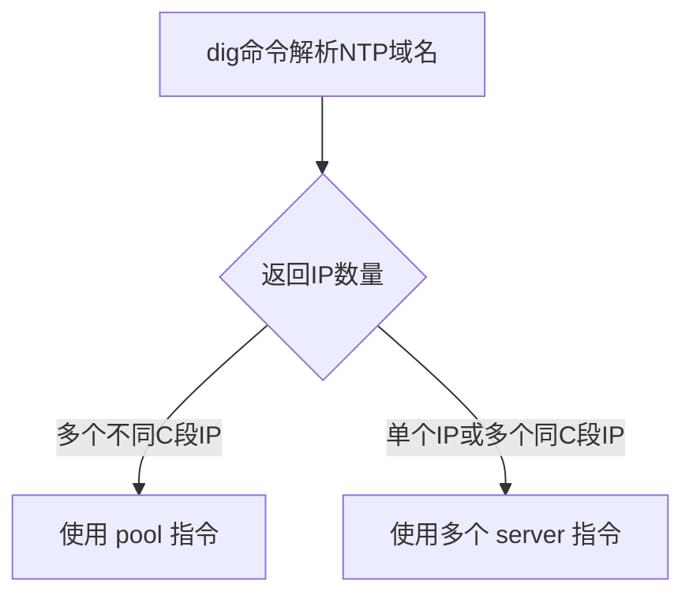

# 第5章 基本常用指令

## 1 用户管理命令

### 1.1 基本介绍

Linux系统是一个多用户多任务的操作系统，任何一个要使用系统资源的用户，都必须首先向系统管理员申请一个账号，然后以这个账号的身份进入系统。

### 1.2 添加用户

- 基本语法

```bash
% useradd 用户名
```

- 细节说明

1. 当创建用户成功后，会自动的创建和用户同名的家目录
2. 也可以通过 `useradd -d 指定目录 新的用户名`，给新创建的用户指定家目录

- 选项说明

| 选项       | 功能                           |
|----------|------------------------------|
| -c 备注    | 加上备注文字。备注文字会保存在passwd的备注栏位中； |
| -d 登入目录  | 指定用户登入时的起始目录；                |
| -e 有效期   | 指定账户的有效期限；                   |
| -f 缓冲天数  | 指定在密码过期后多少天即关闭该账号；           |
| -g 群组    | 指定用户所属的群组；                   |
| -G 群组    | 指定用户所属的附加群组；                 |
| -m       | 自动建立用户的登入目录；                 |
| -M       | 不要自动建立用户的登入目录；               |
| -n       | 取消建立以用户名称为名的群组；              |
| -r       | 建立系统账号；                      |
| -s shell | 指定用户登入后所使用的shell；            |
| -u uid   | 指定用户id。                      |

### 1.3  修改用户密码

- 基本语法

```bash
% passwd 用户名
```

### 1.4 删除用户

- 基本语法

```bash
# 默认保留家目录 
% userdel 用户名
# 删除用户及其家目录
% userdel -r 用户名
```

### 1.5 查询用户信息指令

- 基本语法

```bash
% id 用户名
```

- 细节说明

当用户不存在时，返回无此用户。

### 1.6 切换用户

- 介绍

在操作Linux中，如果当前用户的权限不够，可以通过 `su - 指令`，切换到高权限用户，比如：root。

- 基本语法

```bash
% su - 切换用户名
```

- 细节说明

1. 从权限高的用户切换到权低的用户，不需要输入密码，反之需要。
2. 当需要返回到原来用户时，使用 exit/logout 指令

### 1.7 查看当前用户/登录用户

- 基本语法

```bash
# 查询当前是什么用户身份
% whoami 
# 查询是什么用户身份登录的，以及登录时间
% who am i
# 查看当前登录中的用户有哪些
% who
```

### 1.8 用户组

- 介绍

类似于角色，系统可以对有共性的多个用户进行统一的管理。

- 新增组

```bash
% groupadd 组名
```

- 删除组

```bash
% groupdel 组名
```

- 增加用户时直接加上组

```bash
% useradd -g 用户组 用户名
```

- 修改用户的组

```bash
% usermod -g 用户组 用户名 
```

### 1.9 用户和组相关文件

- /etc/passwd 文件

用户（user）的配置文件，记录用户的各种信息。

每行的含义：<span style="color:#1E90FF;">用户名:口令:用户标识号:组标识号:注释性描述:主目录:登录Shell</span>

- /etc/shadow 文件

口令的配置文件

每行的含义：<span style="color:#1E90FF;">登录名:加密口令:最后一次修改时间:最小时间间隔:最大时间间隔:警告时间:不活动时间:
失效时间:标志
</span>

- /etc/group 文件

组（group）的配置文件，记录Linux包含的组的信息

每行含义：<span style="color:#1E90FF;">组名:口令:组标识号:组内用户列表
</span>

## 2 帮助指令

### 2.1 man 获得帮助信息

基本语法：man [命令或配置文件] (功能描述：获得帮助信息)

案例：查看 ls 命令的帮助信息

```bash
% man ls
```

### 2.2 Help 指令

基本语法：help 命令 （功能描述：获得shell内置命令的帮助信息）

```bash
% help cd
```

## 3 文件目录类

### 3.1 pwd 指令

基本语法：pwd （功能描述：显示当前工作目录的绝对路径）

### 3.2 ls 指令

基本语法：ls [选项] [目录或文件]

常用选项：

-l ：以列表的方式显示信息。

-a ：显示当前目录所有的文件和目录，包括隐藏的。

-h ：以人类宜读的方式显示大小尺寸。

-R ：递归处理。

### 3.3 cd 指令

基本语法：cd [参赛] (功能描述：切换到指定目录)

理解：绝对路径和相对路径。

```bash
# 回到自己的家目录
% cd ~ 或 cd
# 回到当前目录的上级目录
% cd ..
```

### 3.4 mkdir 指令

基本语法：mkdir [选项] 要创建的目录

常用选项：-p 创建多级目录。

```bash
% mkdir /home/dog
% mkdir -p /home/animal/tiger
% mkdir /home/animal/{lion,leopard}
```

### 3.5 rmdir 指令

基本语法：rmdir [选项] 要删除的空目录。

使用细节：rmdir 删除的是空目录，如果目录下有内容时无法删除。若要删除非空目录，需要 rm -rf 要删除的目录。

```bash
% rmdir /home/dog
% rm -rf /home/animal
```

### 3.6 touch 指令

基本语法：touch 文件名称

```bash
% touch /home/ hello.txt
```

### 3.7 cp 指令

基本语法：cp [选项] source dest

常用选项：-r 递归复制整个文件夹

```bash
% cp /home/hello.txt /home/bbb
# 递归复制
% cp -r /home/bbb /opt
# 递归复制，遇到同名直接覆盖不用提示
% \cp -r /home/bbb /opt
```

### 3.8 rm指令

说明：rm指令移除文件或目录。

- 基本语法：

rm [选项] 要删除的文件或目录

- 常用选项：

-r ：递归删除整个文件夹

-f ：强制删除不提示

```bash
% rm /home/hello.txt 
% rm -rf /opt/bbb/
```

### 3.9 mv 指令

说明：mv指令移动文件与目录或重命名

- 基本语法

```bash
# 重命名
% mv oldNameFile newNameFile
# 移动文件
% mv /temp/movefile /targetFolder
```

### 3.10 cat 指令

cat 查看文件内容。

- 基本语法

cat [选项] 要查看的文件

- 常用选项

-n ：显示行号

- 使用细节

cat 只能浏览文件，而不能修改文件，为了浏览方便，一般会带上管道命令 | more

```bash
% cat -n /etc/profile | more
```

### 3.11 more 指令

more 指令是一个基于VI编辑器的文本过滤器，它以全屏幕的方式按页显示文本文件的内容。more指令中内置了若干快捷键，详见操作说明：

- 基本语法

more 要查看的文件

- 操作说明

| 操作         | 功能说明                 |
|------------|----------------------|
| 空白键(space) | 代表向下翻一页              |
| Enter      | 代表向下翻【一行】            |
| q          | 代表立刻离开more，不再显示该文件内容 |
| Ctrl+F     | 向下滚动一屏               |
| Ctrl+B     | 返回上一屏                |
| =          | 输出当前行的行号             |
| :f         | 输出文件名和当前行的行号         |

- 应用案例

案例：采用 more 查看文件 /etc/profile

### 3.12 less 指令

less 指令用来分屏查看文件内容，它的功能与more命令类似，但是比more指令更加强大，支持各种显示终端。less指令在显式文件内容时，并不是一次将整个文件加载之后才显示，而是根据显示需要加载内容，对于显示大型文件具有较高的效率。

- 基本语法

```bash
% less 要查看的文件
```

- 操作说明

| 操作         | 功能说明                        |
|------------|-----------------------------|
| 空白键        | 向下翻动一页                      |
| [pagedown] | 向下翻动一页                      |
| [pageup]   | 向上翻动一页                      |
| /子串        | 向下搜寻【字典】的功能；n：向下查看；N：向上查找   |
| ?子串        | 向上搜寻【字典】的功能；n : 向上查找；N：向下查找 |
| q          | 离开less这个程序                  |

### 3.13 echo 指令

echo输出内容到控制台。

- 基本语法

echo [选项] [输出内容]

```bash
% echo $PATH
% echo hello,world!
% echo "hello,world\!"
```

### 3.14 head 指令

head用于显示文件的开头部分内容，默认情况下head指令显示文件的前10行内容。

- 基本语法

    - `head 文件` （功能描述：查看文件头10行内容）

    - `head -n 5 文件` （功能描述：查看文件头5行内容，5可以是任意行数）

```bash
% head -n 5 /etc/profile
```

### 3.15 tail 指令

tail用于输出文件中尾部的内容，默认情况下tail指令显示文件的前10行内容。

- 基本语法

    - `tail 文件` （功能描述：查看文件尾10行内容）

    - `tail -n 5 文件` （功能描述：查看文件尾5行内容，5可以是任意行数）

    - `tail -f 文件` （功能描述：实时追踪该文件的所有更新）

```bash
% tail -n 5 /etc/profile
```

### 3.16 > 指令 和 >> 指令

`>` 输出重定向

`>>` 追加

- 基本语法

    - `ls -l > 文件` （功能描述：列表的内容写入文件a.txt中（覆盖写））

    - `ls -la >> 文件` （功能描述：列表的内容追加到文件aa.txt的末尾）

    - `cat 文件1 > 文件2` （功能描述：将文件1的内容覆盖到文件2）

    - `echo "内容" >> 文件` （功能描述：将“内容”追加到文件）

### 3.17 ln 指令

软连接也称为符号链接，类似于windows里的快捷方式，主要存放了链接其他文件的路径。

- 基本语法

`ln -s [原文件或目录] [软连接名] `（功能描述：给原文件创建一个软连接）

```bash
% ln -s /root/ myroot
```

### 3.18 history 指令

history 查看已经执行过的历史命令，也可以执行历史命令

- 基本语法

history （功能描述：查看已经执行过的历史命令）

```bash
% history
# 显示最近使用过的10个指令
% history 10
# 执行历史编号为5的指令
% !5
```

## 4 时间日期类

### 4.1 date指令

- 基本语法

1. `date` （功能描述：显示当前日期）
2. `date +%Y` （功能描述：显示当前年份）
3. `date +%m` （功能描述：显示当前月份）
4. `date +%d`（功能描述：显示当前是哪一天）
5. `date "+%Y-%m-%d %H:%M:%S"` （功能描述：显示年月日时分秒）

6. `date -s 字符串时间` （功能描述：设置系统当前时间，比如：2024-12-27 12:42:50）

### 4.2 cal 指令

查看日历指令。

- 基本语法

cal [选项] （功能描述：不加选项，显示本月日历）

 ```bash
 % cal
 % cal 2020
 ```

### 4.3 timedatectl 指令

（1）查看当前时间。

- 基本语法

```bash
% timedatectl
               Local time: 三 2025-03-05 13:27:39 CST
           Universal time: 三 2025-03-05 05:27:39 UTC
                 RTC time: 三 2025-03-05 05:27:40
                Time zone: Asia/Shanghai (CST, +0800)
System clock synchronized: yes
              NTP service: active
          RTC in local TZ: no
```

- **输出关键信息**：
    - `Local time`：本地时间
    - `Universal time`：UTC 时间
    - `Time zone`：时区（如 `Asia/Shanghai`）
    - `System clock synchronized`：是否已同步（`yes` 或 `no`）
    - `NTP service`：NTP 服务状态（`active` 或 `inactive`）

（2）修正时区（如不正确）

```bash
# 列出所有可用时区
% timedatectl list-timezones | grep -i shanghai

# 设置时区（例如 Asia/Shanghai）
% sudo timedatectl set-timezone Asia/Shanghai
```

### 4.4 时间同步服务

#### 4.4.1 如何检查并更换同步源

Rocky Linux 9 默认使用 `chrony` 作为 NTP 客户端。

（1）安装并启动 Chrony （如未安装）

```bash
sudo dnf install chrony -y
sudo systemctl enable --now chronyd
```

（2）检查 Chrony 状态

```bash
systemctl status chronyd
```

- 确保服务状态为 `active (running)`。

（3）查看同步服务状态

```bash
$ systemctl status chronyd
● chronyd.service - NTP client/server
     Loaded: loaded (/usr/lib/systemd/system/chronyd.service; enabled; preset: enabled)
     Active: active (running) since Thu 2025-05-29 11:54:28 CST; 3h 4min ago
       Docs: man:chronyd(8)
             man:chrony.conf(5)
   Main PID: 809 (chronyd)
      Tasks: 1 (limit: 50448)
     Memory: 4.6M
        CPU: 438ms
     CGroup: /system.slice/chronyd.service
             └─809 /usr/sbin/chronyd -F 2

5月 29 14:43:03 emon chronyd[809]: Source 108.59.2.24 replaced with 211.68.71.26 (2.rocky.pool.ntp.org)
5月 29 14:46:17 emon chronyd[809]: Can't synchronise: no majority
5月 29 14:47:12 emon chronyd[809]: Detected falseticker 95.111.202.5 (2.rocky.pool.ntp.org)
5月 29 14:47:12 emon chronyd[809]: Selected source 193.182.111.12 (2.rocky.pool.ntp.org)
5月 29 14:47:12 emon chronyd[809]: System clock wrong by 308.202625 seconds
5月 29 14:47:22 emon chronyd[809]: Detected falseticker 95.111.202.5 (2.rocky.pool.ntp.org)
5月 29 14:48:17 emon chronyd[809]: Selected source 202.118.1.130 (2.rocky.pool.ntp.org)
5月 29 14:48:27 emon chronyd[809]: Detected falseticker 95.111.202.5 (2.rocky.pool.ntp.org)
5月 29 14:54:33 emon chronyd[809]: Selected source 211.68.71.26 (2.rocky.pool.ntp.org)
5月 29 14:54:46 emon chronyd[809]: Can't synchronise: no majority
```

（4）检查NTP源

查看当前使用的NTP服务器：

```bash
# 显示当前活动的 NTP 时间源及其实时状态:实时状态（秒级）
$ chronyc sources -v

  .-- Source mode  '^' = server, '=' = peer, '#' = local clock.
 / .- Source state '*' = current best, '+' = combined, '-' = not combined,
| /             'x' = may be in error, '~' = too variable, '?' = unusable.
||                                                 .- xxxx [ yyyy ] +/- zzzz
||      Reachability register (octal) -.           |  xxxx = adjusted offset,
||      Log2(Polling interval) --.      |          |  yyyy = measured offset,
||                                \     |          |  zzzz = estimated error.
||                                 |    |           \
MS Name/IP address         Stratum Poll Reach LastRx Last sample               
===============================================================================
^? 202.118.1.130                 2   6   377    25   -2430m[ -2430m] +/-   24ms
^? 95.111.202.5                  3   6   163    18   -2430m[ -2430m] +/-  124ms
^~ 211.68.71.26                  3   6   377     7   -2430m[ -2430m] +/-   80ms
^? 193.182.111.12                2   6   377    14   -2430m[ -2430m] +/-  157ms
```

输出示例：

1. **`MS`** (Mode State)：源状态符号
   - `^*` : 当前同步的主源
   - `^+` : 候选源（可接受）
   - `^-` : 被排除的源
   - `^?` : 状态未知
2. **`Stratum`**：时间源层级（0=原子钟，1=一级服务器，值越大精度越低）
3. **`Poll`**：轮询间隔（秒的对数值，如6=2⁶=64秒）
4. **`Reach`**：最近8次查询的成功率（八进制，377=全成功）
5. **`LastRx`**：上次响应时间（秒/分/小时）
6. **`Last sample`**：最后一次测量的时间偏差
   - `[+123us]`：原始测量值
   - `+368us`：调整后的偏移值
   - `+/- 0.5ms`：误差范围

<span style="color:red;">若存在 `?`（未同步）或 `-`（无效源），需优化配置。</span>

```bash
# 显示时间源的长期统计性能数据:长期统计（分钟/小时级）
$ chronyc sourcestats -v
                             .- Number of sample points in measurement set.
                            /    .- Number of residual runs with same sign.
                           |    /    .- Length of measurement set (time).
                           |   |    /      .- Est. clock freq error (ppm).
                           |   |   |      /           .- Est. error in freq.
                           |   |   |     |           /         .- Est. offset.
                           |   |   |     |          |          |   On the -.
                           |   |   |     |          |          |   samples. \
                           |   |   |     |          |          |             |
Name/IP Address            NP  NR  Span  Frequency  Freq Skew  Offset  Std Dev
==============================================================================
stratum2-1.ntp.mow01.ru.>  21   9   46m   +225.684     32.258   +166ms    28ms
81.168.83.93               22  10   44m   +207.553     56.691   +125ms    50ms
119.28.183.184              9   8   843     -0.012     23.769    -20ns  3947us
a.chl.la                    9   5   905    +72.365    141.518    +49ms    24ms
```

1. **`NP`**：已处理的样本点数
2. **`NR`**：有效样本点数（排除异常值）
3. **`Span`**：样本覆盖的时间范围（分钟）
4. **`Frequency`**：本地时钟频率偏差（ppm，百万分之一）
5. **`Freq Skew`**：频率偏差的不确定性（ppm）
6. **`Offset`**：平均时间偏移（长期校准值）
7. **`Std Dev`**：偏移的标准差（稳定性指标）

（5）优化NTP服务器配置

编辑配置文件，更换更稳定的NTP源（如国内或企业内网源）：

在配置文件中找到 `pool` 或 `server` 开头的行，修改/添加为以下内容（推荐国内稳定源）：

```bash
$ sudo vim /etc/chrony.conf
```

```bash
# 使用阿里云 NTP 服务器
server ntp.aliyun.com iburst
# 使用腾讯云 NTP 服务器
server time1.cloud.tencent.com iburst
# 使用清华大学 NTP 服务器
server ntp.tuna.tsinghua.edu.cn iburst
# 使用中国国家授时中心
pool ntp.ntsc.ac.cn iburst
# 增加国内的 ntp 服务器，或是指定其他常用的时间服务器
pool cn.pool.ntp.org iburst
```

> 使用 `iburst` 加速初始同步。



比如：

```bash
# 安装dig命令
$ dnf install -y bind-utils
# pool
$ dig pool.ntp.org +short
119.28.206.193
84.16.67.12
162.159.200.1
202.118.1.130
# pool
$ dig cn.pool.ntp.org +short
162.159.200.1
202.118.1.130
193.182.111.142
119.28.206.193
# server
$ dig ntp.aliyun.com +short
203.107.6.88
```


（6）重启服务并验证

```bash
$ sudo systemctl restart chronyd        	# 重启服务
$ chronyc tracking                      	# 检查同步状态
$ chronyc sources -v                    	# 确认源状态
```

> - **关键指标**：
>   - `System time` 显示偏差接近0秒。
>   - `Source` 状态为 `^*`（当前最佳源）。

#### 4.4.2 手工同步时间

- 如何同步时间？

```bash
$ sudo chronyc -a makestep
```

### 4.5 查看硬件时钟时间

```bash
# 查看硬件时钟时间
sudo hwclock --show
```

## 5 查找类

### 5.1 find 指令

find指令将从指定目录向下递归地遍历其各个子目录，将满足条件的文件或者目录显示在终端。

- 基本语法

find [搜索范围] [选项]

- 选项说明

| 选项           | 功能                          |
|--------------|-----------------------------|
| -name <查询方式> | 按照指定的文件名查找模式查找文件            |
| -user <用户名>  | 查找属于指定用户名所有文件               |
| -size <文件大小> | 按照指定的文件大小查找文件，+n大于 -n小于 n等于 |

- 应用实例

```bash
% find /home -name hello.txt 
% find /opt -user nobody
% find / -size +200M
```

### 5.2 locate 指令

locate指令可以快速定位文件路径。locate指令利用事先建立的系统中所有文件名称及路径的locate数据库实现快速定位给定的文件。locate指令无需遍历整个文件系统，查询速度较快。为了保证查询结果的准确度，管理员必须定期更新locate时刻。

**基本语法**

locate 搜索文件

**特别说明**

由于locate指令基于数据库进行查询，所以第一次运行前，必须使用 updatedb 指令创建 locate 数据库。

**应用实例**

- 案例1：请使用locate指令快速定位 hello.txt 文件所在目录。

```bash
% locate hello.txt
```

### 5.3 which 指令

which 查看指令所在的位置。

```bash
% which ls
```

### 5.4 whereis 指令

### 5.5 grep 指令和管道符号 |

grep 过滤查找，管道符 `|` 表示将前一个命令的处理结果输出传递给后面的命令处理。

**基本语法**

grep [选项] 查找内容 源文件

**常用选项**

| 选项 | 功能        |
|----|-----------|
| -n | 显示匹配行及行号。 |
| -i | 忽略字母大小写。  |

**应用实例**

- 案例1：请在hello.txt文件中，查找 ”yes“ 所在行，并显示行号。

```bash
% grep -n yes hello.txt
```

### 5.6 sed命令常用方式

## 6 压缩和解压类

### 6.1 gzip/gunzip 指令

gzip 用于压缩文件， gunzip 用于解压文件。

**基本语法**

gzip 文件 （功能描述：压缩文件，只能将文件压缩为*.gz文件）

gunzip 文件.gz （功能描述：解压缩文件）

**应用实例**

- 案例1：gzip压缩，将/home下的hello.txt文件进行压缩。

```bash
% gzip hello.txt
```

- 案例2：gunzip解压缩，将 /hom下的hello.txt.gz 文件进行解压缩。

```bash
% gunzip hello.txt.gz 
```

### 6.2 zip/unzip指令

zip用于压缩文件，unzip用于解压缩，这个在项目打包发布中很有用。

**基本语法**

`zip [选项] xxx.zip 将要压缩的内容` （功能描述：压缩文件和目录的命令）

`unzip [选项] xxx.zip` （功能描述：解压缩文件）

**zip常用选项**

-r ：递归压缩，即压缩目录。

**unzip常用选项**

-d <目录> ：指定解压后文件的存放目录。

**应用实例**

- 案例1：将 /home 下的所有文件进行压缩成 myhome.zip

```bash
# 压缩/home目录及其下的内容
% zip -r myhome.zip /home/
```

- 案例2：将 myhome.zip 解压到 /opt/tmp 目录下

```bash
% unzip -d /opt/tmp myhome.zip
```

### 6.3 tar指令

tar指令是打包指令，最后打包后的文件是.tar.gz的文件

**基本语法**

`tar [选项] xxx.tar.gz 打包的内容` （功能描述：打包目录，压缩后的文件格式.tar.gz）

**选项说明**

| 选项 | 功能                       |
|----|--------------------------|
| -c | create；产生.tar打包文件        |
| -v | verbose；显示详细信息           |
| -f | filename；指定压缩后的文件名       |
| -z | 打包同时压缩，使用gzip算法来实现压缩/解压  |
| -x | extract；解包.tar文件         |
| -C | 指定解压目录                   |
| -j | 打包同时压缩，使用bzip2算法来实现压缩/解压 |
| -J | 打包同时压缩，使用xz算法来实现压缩/解压    |
| -t | 列出归档内容                   |

#### 1 *.tar 格式【仅归档不压缩】

- 打包

```bash
tar -cvf [目标文件名].tar [原文件名/目录名]
```

- 解包

```bash
tar -xvf [原文件名].tar
```

- 查看归档包列表

```bash
tar -tvf [原文件名].tar
```

- 指定解包目录

```bash
tar -xvf [原文件名].tar -C [目标目录]
```

#### 2 *.tar.gz 格式【快速压缩】

##### 1 基于tar压缩/解压缩

- 压缩

```bash
gzip [原文件名].tar
```

- 解压

```bash
gunzip [原文件名].tar.gz
```

##### 2 一次性打包并压缩、解压并解包

- 打包并压缩

```bash
tar -zcvf [目标文件名].tar.gz [原文件名/目录名]
```

- 解压并解包

```bash
tar -zxvf [原文件名].tar.gz
```

- 查看压缩包列表

```bash
tar -tvf [原文件名].tar
```

#### 3 *.tar.bz2 格式【中等压缩】

- 安装bzip2

```bash
sudo dnf install bzip2
```

##### 1 基于tar压缩/解压缩

- 压缩

```bash
bzip2 [原文件名].tar
```

- 解压：

```bash
bunzip2 [原文件名].tar.bz2
```

##### 2 一次性打包并压缩、解压并解包

- 打包并压缩

```bash
tar -jcvf [目标文件名].tar.bz2 [原文件名/目录名]
```

- 解压并解包

```bash
tar -jxvf [原文件名].tar.bz2
```

#### 4 *.tar.xz格式【高压缩率】

##### 1 基于tar压缩/解压缩

- 压缩

```bash
xz [元文件名].tar
```

- 解压

```bash
unxz [原文件名].tar.xz
```

- 查看压缩包文件内容

```bash
xzcat [原文件名].tar.xz|more
```

##### 2 一次性打包并压缩、解压并解包

- 打包并压缩

```bash
tar -Jcvf [目标文件名].tar.xz [原文件名/目录名]
```

- 解压并解包

```bash
tar -Jxvf [原文件名].tar.xz
```

### 6.4 *.7z格式【最大压缩率】

- 安装p7zip

```bash
# Rocky Linux 默认仓库可能不包含 p7zip，需先启用 EPEL 仓库：
sudo dnf install epel-release
# 安装p7zip
sudo dnf install p7zip p7zip-plugins
```

- `p7zip`：提供 `7z` 命令行工具。
- `p7zip-plugins`：支持更多压缩格式（如 RAR）。


- 压缩

```bash
7z a [目标文件名].7z [原文件名/目录名]
```

- 解压

```bash
7z x [原文件名].7z
```

- 查看压缩内容列表

```bash
 7z l [原文件名].7z
```

- 解压到指定目录

```bash
# 注意-o后不要指定空格
7z x [原文件名].7z -o[目标目录]
```

注意：这个7z解压命令支持rar格式，即：
7z x [原文件名].rar

### 场景推荐

| **需求**        | **推荐格式**          | **理由**                 |
|:--------------|:------------------|:-----------------------|
| 快速压缩/解压       | `.tar.gz` 或 `.gz` | 速度快，兼容性强               |
| 节省存储空间（不介意时间） | `.tar.xz` 或 `.7z` | 压缩率最高                  |
| 跨平台共享         | `.zip` 或 `.7z`    | Windows/macOS/Linux 通用 |
| 长期备份          | `.tar.xz`         | 高压缩率，节省磁盘空间            |
| 处理大量小文件       | `.tar` + 任意压缩格式   | 避免单独压缩文件的开销            |

## 7 下载 curl/wget

cURL 更适合 **API 调试**、**复杂 HTTP 请求** 和 **灵活数据传输**。

### 7.1 curl

#### 1 基础下载

```bash
# 下载文件并保存为原文件名
curl -O https://example.com/file.zip

# 下载文件并指定保存路径
curl -o custom_name.zip https://example.com/file.zip
```

#### 2 发送HTTP请求

```bash
# GET 请求
curl https://api.example.com/data

# POST 请求（JSON 数据）
curl -X POST -H "Content-Type: application/json" -d '{"key":"value"}' https://api.example.com/endpoint

# 带表单数据的 POST
curl -X POST -d "username=admin&password=123" https://example.com/login
```

#### 3 设置请求头与Cookie

```bash
# 添加自定义请求头
curl -H "Authorization: Bearer token123" https://api.example.com/protected

# 从文件加载 Cookie 并发送
curl -b cookies.txt https://example.com/dashboard
```

#### 4 处理重定向与代理

```bash
# 跟随重定向（默认不跟随）
curl -L https://example.com/redirect

# 使用代理
curl -x http://proxy-server:8080 https://example.com
```

#### 5 高级功能

```bash
# 上传文件（PUT/POST）
curl -F "file=@localfile.txt" https://example.com/upload

# 断点续传（需服务器支持）
curl -C - -O https://example.com/largefile.iso

# 忽略 SSL 证书验证（不安全）
curl -k https://example.com

# -s静默模式（不显示进度或错误信息），-f请求失败时快速报错（不返回 HTML 错误页面）
curl -sfL https://get-kk.kubesphere.io | sh -
```

### 7.2 wget

Wget 更适合 **批量下载**、**递归抓取** 和 **离线存储**。

#### 1 基础下载

```bash
# 下载文件到当前目录
wget https://example.com/file.zip

# 指定保存路径
wget -O /path/to/save/file.zip https://example.com/file.zip
```

#### 2 批量与递归下载

```bash
# 下载多个文件（URL 列表在文件中）
wget -i urls.txt

# 递归下载整个网站（谨慎使用！）
wget -r -l 5 --convert-links https://example.com
```

#### 3 后台下载与限速

```bash
# 后台下载（日志保存到 wget-log）
wget -b https://example.com/largefile.iso

# 限制下载速度（KB/s）
wget --limit-rate=100k https://example.com/file.iso
```

#### 4 断点续传与重试

```bash
# 断点续传（自动检测未完成的任务）
wget -c https://example.com/interrupted.iso

# 失败后重试（默认 20 次）
wget --tries=50 https://example.com/unstable.file
```

#### 5 镜像与认证

```bash
# 镜像站点（保持目录结构）
wget -m https://example.com

# 带用户名密码认证
wget --user=admin --password=123 https://example.com/secure
```

### **对比与选择建议**

| **特性**     | **cURL**           | **Wget**        |
|:-----------|:-------------------|:----------------|
| **主要用途**   | API 调试、复杂 HTTP 交互  | 批量下载、网站抓取       |
| **输出默认行为** | 输出到终端（需 `-O` 保存文件） | 直接保存到文件         |
| **递归下载**   | 不支持                | 支持（`-r` 或 `-m`） |
| **协议支持**   | 更广泛（如 SFTP、SMTP）   | HTTP/HTTPS/FTP  |
| **脚本友好性**  | 灵活，适合自动化 HTTP 请求   | 简单，适合批量下载任务     |
| **断点续传**   | 需手动指定（`-C -`）      | 自动支持（`-c`）      |

## 8 网络命令

### 8.1 dig

dig命令是常用的域名查询工具，可以用来测试域名系统工作是否正常。

- 安装

```bash
$ sudo dnf install bind-utils -y
```

- 用法1

```bash
# 解析百度域名（观察返回的 IP 是否为中国大陆节点）
$ dig www.baidu.com +short
# 正常应返回类似 220.181.38.150（北京）或 14.215.177.39（广东）的国内 IP

# 解析谷歌域名
$ dig www.google.com +short
```

### 8.2 traceroute

- 安装

```bash
$ sudo dnf install traceroute -y
```

- 用法1

```bash
# 跟踪到百度的路由
$ traceroute -n www.baidu.com

# 跟踪到谷歌的路由
$ traceroute -n www.google.com
```

## 9 查看CPU、内存、系统等信息

### 9.1 查看CPU信息

在 Linux 虚拟机中查询 CPU 核数（包括物理核、逻辑核/线程数），可以使用以下几个常用命令：

- 仅显示逻辑处理器数量

```bash
$ nproc
2
```

**说明：** 直接显示当前可用的**逻辑处理器（Logical Processor）** 的总数。在虚拟化环境中，这就是分配给该虚拟机的 **vCPU 数量**。

- 显示最全面的 CPU 架构信息

```bash
$ lscpu
架构：                    aarch64
  CPU 运行模式：          64-bit
  字节序：                Little Endian
CPU:                      2
  在线 CPU 列表：         0,1
......
```

- 查看 `/proc/cpuinfo` (原始信息)

```bash
$ cat /proc/cpuinfo | grep "processor" | wc -l
2
```

- 查看Linux是32位还是64位

:::code-group

```bash [uname -m]
$ uname -m
aarch64
```

```bash [getconf]
$ getconf LONG_BIT
64
```

```bash [arch]
$ arch
aarch64
```

:::

### 9.2 查看Linux内核版本的2个方法

- 查看系统内核版本号及系统名称

```bash
$ uname -a
Linux wenqiu 5.14.0-503.40.1.el9_5.aarch64 #1 SMP PREEMPT_DYNAMIC Wed Apr 30 16:27:32 EDT 2025 aarch64 aarch64 aarch64 GNU/Linux
```

- 查看目录"/proc"下的version信息，也可以得到当前系统的内核版本号及系统名称

```bash
$ cat /proc/version
Linux version 5.14.0-503.40.1.el9_5.aarch64 (mockbuild@iad1-prod-build-aarch001.bld.equ.rockylinux.org) (gcc (GCC) 11.5.0 20240719 (Red Hat 11.5.0-5), GNU ld version 2.35.2-54.el9) #1 SMP PREEMPT_DYNAMIC Wed Apr 30 16:27:32 EDT 2025
```

> /proc文件系统，它不是普通的文件系统，而是系统内核的映像，也就是说，该目录中的文件是存放在系统内存中的。

- redhat-release

```bash
$ cat /etc/redhat-release
Rocky Linux release 9.5 (Blue Onyx)
```


