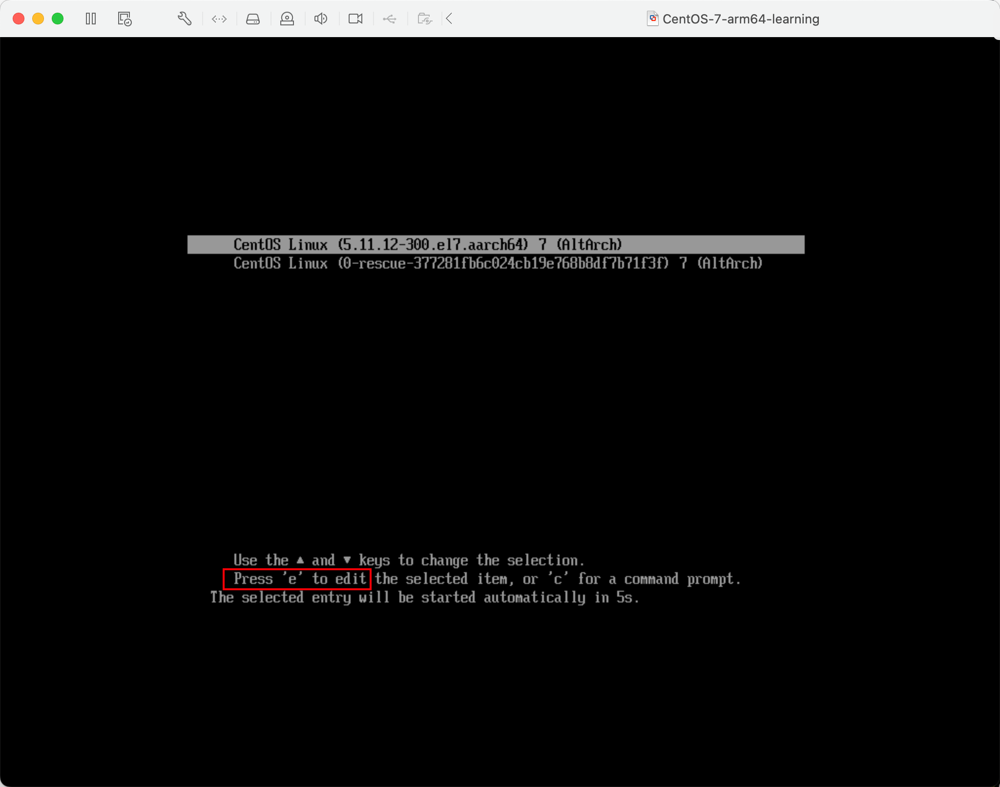
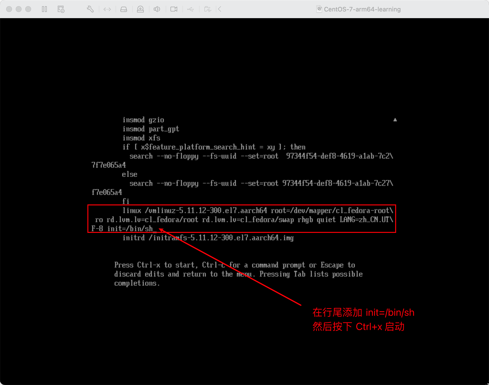
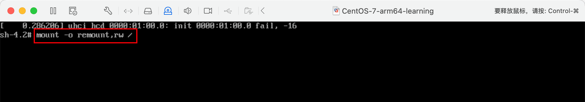
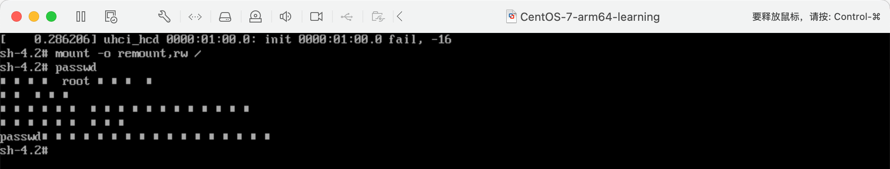
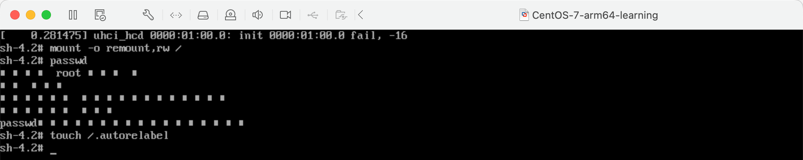
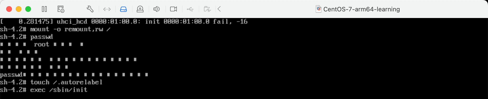

# 第7章 如何找回root密码

1. 首先，启动系统，进入开机界面，在界面中按“e”进入编辑界面。（可以先上下箭头选择内核，阻止倒计时，然后从容输入 e 进入编辑界面）。

2. 进入编辑界面，使用键盘上的上下键把光标往下移动，找到如下图所示的行，在行的最后面输入： `init=/bin/sh`

3. 接着，输入完成后，直接按快捷键：Ctrl+x进入单用户模式。
4. 接着，在光标闪烁的位置中输入：`mount -o remount,rw /`（注意：各个单词之间有空格），完成后按键盘的回车键（Enter）。如下图。

5. 在新的一行最后面输入：passwd，完成后按键盘的回车键（Enter）。输入密码，然后再次确认密码即可），密码修改成功后，会显示 passwd
   的字样，说明密码修改成功。

6. 接着，在鼠标闪烁的位置中（最后一行中）输入：`touch /.autorelabel`（注意：touch与 、 之间有一个空格），完成后按键盘的回车键（Enter）。

7. 继续在光标闪烁的位置中，输入：`exec /sbin/init`（注意：exec 与 /
   之间有一个空格），完成后按键盘的回车键（Enter），等待系统自动修改密码（
   这个过程时间可能有点长，耐心等待，不要以为死机了。），完成后，系统会自动重启，新的密码生效了。

