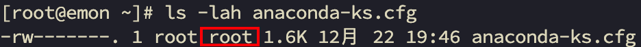

# 第8章 Linux实操篇-组管理和权限管理

## 8.1 Linxu组基本介绍

在linux中的每个用户必须属于一个组，不能独立于组外。在linux中每个文件有所有者、所在组、其它组的概念。

## 8.2 文件/目录 所有者

一般为文件的创建者，谁创建了该文件，就自然的成为该文件的所有者。

- 查看文件的所有者

```bash
% ls -lah
```


- 修改文件所有者

`chown 用户名 文件名`

```bash
% chown tom apple.txt 
```

## 8.3 文件/目录 所在组

当某个用户创建了一个文件后，这个文件的所在组就是该用户所在的组。

- 查看文件/目录所在组

```bash
% ls -lah
```



- 修改文件所在的组

`chgrp 组名 文件名`

```bash
% chgrp tom apple.txt
```

## 8.4 文件/目录 其他组

除文件的所有者和所在组的用户外，系统的其它用户都是文件的其它组。

**如何改变用户所在组？**

在添加用户时，可以指定该用户添加到哪一个组，同样的用root的管理权限可以改变某个用户所在的组。

- 改变用户所在组

1. usermod -g 组名 用户名

- 应用实例

将zwj这个用户从原来所在组，修改到wudang组。

```bash
% usermod -g wudang zwj
```

## 8.5 权限的基本介绍

ls -l 中显示的内容如下：

```bash
-rw-------. 1 root root 1606 12月 22 19:46 anaconda-ks.cfg
```

0-9位说明：

- 第0位确定文件类型（d,-,l,c,b）
    - l是链接，相当于windows的快捷方式。
    - d是目录，相当于windows的文件夹。
    - c是字符设备文件，鼠标，键盘。
    - b是块设备，比如硬盘。
- 第1-3位确定所有者（该文件的所有者）拥有该文件的权限。--user
- 第4-6位确定所属组（同用户组的）拥有该文件的权限。--group
- 第7-9位确定其他用户拥有该文件的权限。--other

## 8.6 rwx权限详解

- rwx作用到文件
    1. r 代表可读：可以读取、查看
    2. w 代表可写：可以修改，但是不代表可以删除该文件，删除一个文件的前提条件是对该文件所在的目录有写权限，才能删除该文件。
    3. x 代表可执行：可以被执行。
- rwx作用到目录
    1. r 代表可读：可以读取，ls查看目录内容。
    2. w 代表可写：可以修改，对目录内创建+删除+重命名目录。
    3. x 代表可执行：可以进入该目录。

## 8.7 文件及目录权限实际案例

- ls -l中显示的内容如下

```bash
-rwxrw-r--. 1 root root   80 12月 28 01:28 abc
```

1. 10个字符确定不同用户能对文件干什么。

第一个字符代表文件类型：- l d c b

其余字符每3个一组（rwx）读（r）写（w）执行（x）

第一组rwx：文件拥有者的权限是读、写和执行。

第二组rw-：与文件拥有者同一组的用户的权限是读、写但不能执行。

第三组r--：不与文件拥有者同组的其它用户的权限是读，不能写和执行。

2. 可用数字表示为：r=4,w=2,x=1 因此rwx=4+2+1=7
3. 其他说明

1 文件：硬链接数 或目录：子目录数

root 用户

root 组

80 文件大小（字节），如果是文件夹，显示4096字节

12月 28 01:28 最后修改日期

abc 文件名

## 8.8 修改权限-chmod

- 基本说明：

通过chmod指令，可以修改文件或者目录的权限。

**第一种方式：+、-、=变更权限**

u:所有者 g:所有组 o:其他人 a:所有人（u、g、o的总和）

1）chmod u=rwx,g=rx,o=x 文件/目录名

2）chmod o+w 文件/目录名

3）chmod a-x 文件/目录名

- 案例演示

1. 给abc文件的所有者读写执行的权限，给所在组读执行权限，给其他组读执行权限。

```bash
% chmod u=rwx,g=rx,o=rx abc
```

2. 给abc文件的所有者除去执行的权限，增加组写的权限。

```bash
% chmod u-x,g+w abc
```

3. 给abc文件的所有用户添加读的权限

```bash
% chmod a+r abc
```

**第二种方式：通过数字变更权限**

r=4,w=2,x=1 因此rwx=4+2+1=7

chmod u=rwx,g=rx,o=x 文件目录名

相当于 chmod 751 文件目录名

- 案例演示

1. 要求：将 /home/abc.txt 文件的权限修改成 rwxr-xr-x，使用数字方式实现。

```bash
% chmod 755 /home/abc.txt 
```

## 8.9 修改文件所有者-chown

- 基本介绍

`chown newowner 文件/目录 改变所有者`

`chown newowner:newgroup 文件/目录 改变所有者和所在组`

-R 如果是目录，则使其下所有子文件或目录递归生效。

- 案例演示

1. 请将 /home/abc.txt 文件的所有者修改成 tom

```bash
% chown tom /home/abc.txt
```

2. 请将 /home/kkk 目录下所有的文件和目录的所有者都修改成tom

```bash
% chown -R tom /home/kkk
```

## 8.10 修改文件/目录所在组-chgrp

- 基本介绍

`chgrp newgroup 文件/目录` 改变所在组

- 案例演示

1. 请将 /home/abc.txt 文件的所在组修改成 shaolin（少林）

```bash
% chgrp shaolin /home/abc.txt
```

2. 请将 /home/kkk 目录下所有的文件和目录的所在组都修改成 shaolin（少林）

```bash
% chgrp -R shaolin /home/kkk
```

## 8.11 最佳实践-警察和土匪游戏

police, bandit

jack,jerry:警察

xh,xq:土匪

1. 创建组

```bash
% groupadd police
% groupadd bandit
```

2. 创建用户

```bash
% useradd -g police jack
% useradd -g police jerry
% useradd -g bandit xh
% useradd -g bandit xq
```

3. jack创建一个文件，自己可以读写，本组人可以读，其它组没任何权限。

```bash
% jack登录
% vim jack.txt 
% chmod 640 jack.txt
```

4. jack修改该文件，让其它组人可以读，本小组人可以读写。

```bash
% chmod g+rw,o+r jack.txt
```

5. xh投靠警察，看看是否可以读写。

```bash
% usermod -g police xh
```