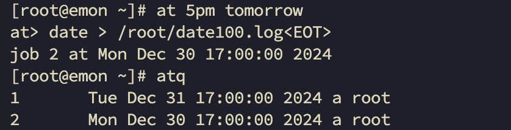

# 第9章 Linux实操篇-定时任务调度

## 9.1 crond 任务调度

crontab 进行定时任务的设置

- 概述

任务调度：是指系统在某个时间执行的特定的命令或程序。

任务调度分类：1.系统工作；有些重要的工作必须周而复始地执行。如病毒扫描等。

个别用户工作：个别用户可能希望执行某些程序，比如对mysql数据库的备份。

- 基本语法

`crontab [选项]`

- 常用选项

| 选项 | 功能                 |
|----|--------------------|
| -e | 编辑crontab定时任务      |
| -l | 查询crontab任务        |
| -r | 删除当前用户所有的crontab任务 |

- 快速入门

设置任务调度文件：/etc/crontab

设置个人任务调度。执行`crontab -e`命令。

接着输入任务到调度文件，如：

```bash
*/1 * * * * ls -l /etc/ > /tmp/to.txt
*/1 * * * * /home/time.sh
```

- 参数细节说明

5个占位符的说明。

| 项目      | 含义         | 范围             |
|---------|------------|----------------|
| 第一个 "*" | 一小时当中的第几分钟 | 0-59           |
| 第二个 "*" | 一天当中的第几小时  | 0-23           |
| 第三个 "*" | 一个月当中的第几天  | 1-31           |
| 第四个 "*" | 一年当中的第几月   | 1-12           |
| 第五个 "*" | 一周当中的星期几   | 0-7（0和7都代表星期日） |

- 特殊符号的说明

| 特殊符号 | 含义                                                              |
|------|-----------------------------------------------------------------|
| *    | 代表任何时间。比如第一个 "*" 就代表一小时中每分钟都执行一次的意思。                            |
| ,    | 代表不连续的时间。比如 "0 8,12,16 * * * 命令"，就代表在每天的8点0分、12点0分、16点0分都执行一次命令 |
| -    | 代表连续的时间范围，比如"0 5 * * 1-6 命令"，代表在周一到周六的凌晨5点0分执行命令。               |
| */n  | 代表每隔多久执行一次。比如 "*/10 * * * * 命令",代表每隔10分钟就执行一遍命令。                |

- 重启任务调度

```bash
% service crond restart
```

## 9.2 at定时任务

- 基本介绍

1. at命令是一次性定时计划任务，at的守护进程atd会以后台模式运行，检查作业队列来运行。
2. 默认情况下，atd守护进程每60秒检查作业队列，有作业时，会检查作业运行时间，如果时间与当前时间匹配，则运行此作业。
3. at命令是一次性定时计划任务，执行完一个任务后不再执行此任务了。

4. 在使用at命令的时候，一定要保证atd进程的启动，可以使用相关指令来查看。

```bash
% ps -ef|grep atd
root      1548     1  0 12月28 ?      00:00:00 /usr/sbin/atd -f
root     14306 11352  0 22:55 pts/1    00:00:00 grep --color=auto atd
```

- at命令格式

`at [选项] [时间]`

执行2次 `Ctrl + D` 结束at命令的输入。

- at命令选项

| 选项        | 含义                            |
|-----------|-------------------------------|
| -m        | 当指定的任务被完成后，将给用户发送邮件，即使没有标准输出。 |
| -l        | 小写字母L，atq的别名。                 |
| -d        | atrm的别名。                      |
| -v        | 显示任务将被执行的时间。                  |
| -c        | 打印任务的内容到标准输出。                 |
| -V        | 显示版本信息。                       |
| -q <队列>   | 使用指定的队列.                      |
| -f <文件>   | 从指定文件读入任务而不是从标准输入读入。          |
| -t <时间参赛> | 以时间参赛的形式提交要运行的任务。             |

- at时间定义

at指定时间的方法：

1. 接受在当天的hh:mm （小时:分钟) 式的时间指定。假如该时间已经过去，那么就放在第二天执行。例如：04:00
2. 使用midnight（深夜），noon（中午），teatime（饮茶时间，一般是下午4点）等比较模糊的词语来指定时间。
3. 采用12小时计时制，即在时间后面加上AM（上午）或PM（下午）来说明是上午还是下午。例如：12pm
4. 指定命令执行的具体日期，指定格式为month
   day（月日）或mm/dd/yy（月/日/年）或dd.mm.yy（日.月.年），指定的日期必须跟在指定时间的后面。例如：04:00 2021-03-1

5. 使用相对计时法。指定格式为：now + count
   time-units，now就是当前时间，time-units是时间单位，这里能够是minutes（分钟）、hours（小时）、days（天）、weeks（星期）。count是时间的数量，几天，几小时。例如：now +
   5 minutes
6. 直接使用today（今天）、tomorrow（明天）来指定完成命令的时间。

- 应用实例

1. 案例1：2天后的下午5点执行 /bin/ls /home

```bash
# 编写完成后，输入2次Ctrl+D（在/home后面，输入2次Ctrl+D后得到<EOT>）
% at 5pm + 2 days
at> /bin/ls /home<EOT>
job 1 at Tue Dec 31 17:00:00 2024 
```

2. 案例2：`atq`命令来检查系统中没有执行的工作任务

```bash
% atq
1       Tue Dec 31 17:00:00 2024 a root
% at -l
1       Tue Dec 31 17:00:00 2024 a root
```

3. 案例3：明天17点钟，输出时间到指定文件内，比如 /root/date100.log



4. 案例4:2分钟后，输出时间到指定文件内，比如 /root/date200.log

```bash
% at now + 2 minutes
at> date > /root/date200.log<EOT>
job 3 at Sun Dec 29 23:36:00 2024
```

5. 案例5：删除已经设置的任务，`atrm 编号`

```bash
% atrm 2
% at -d 1
```