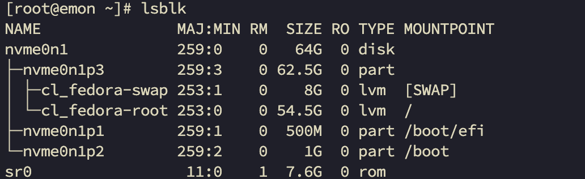
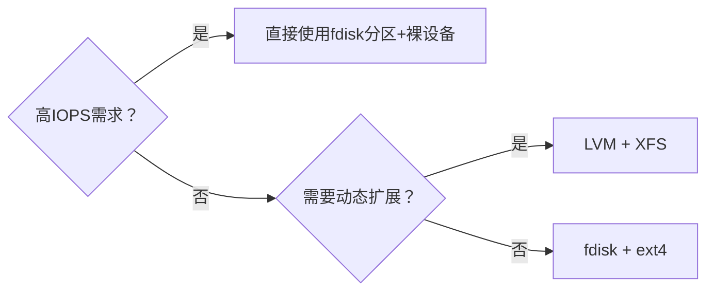
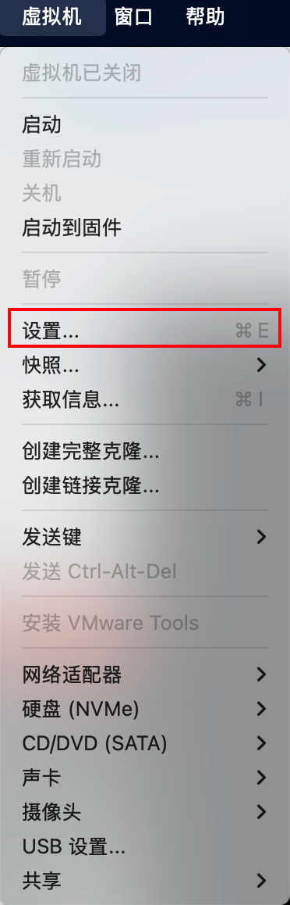
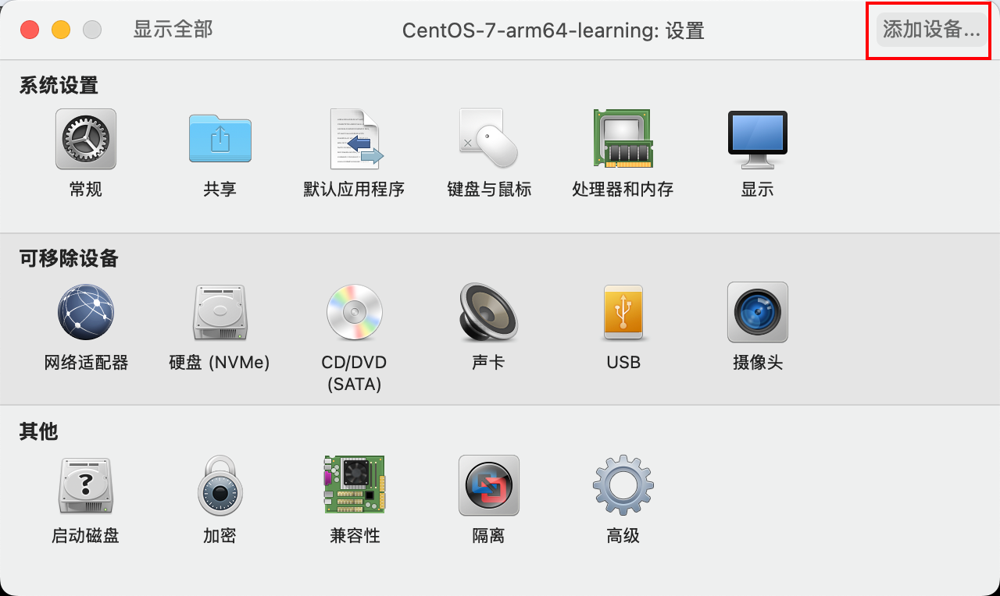
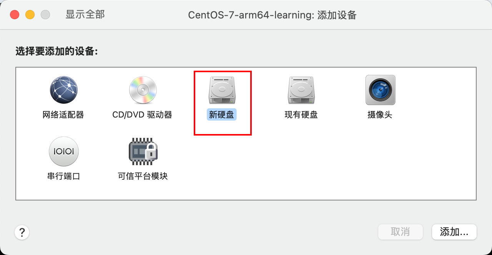
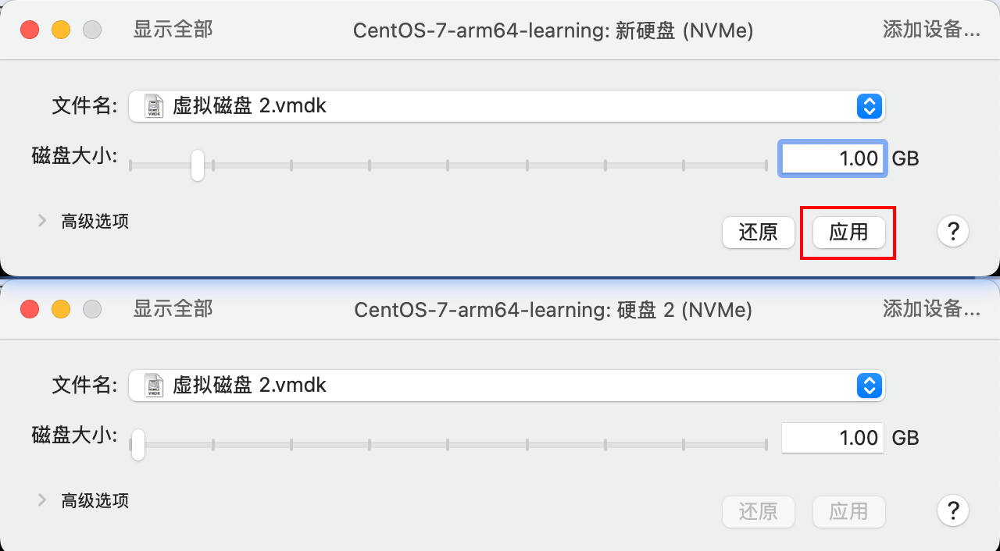
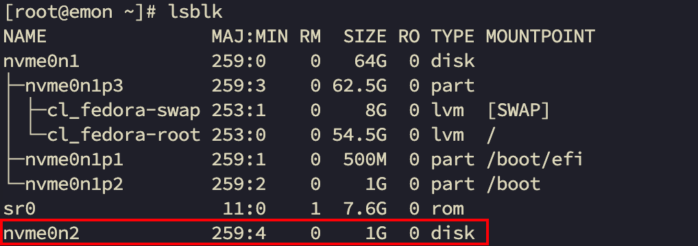
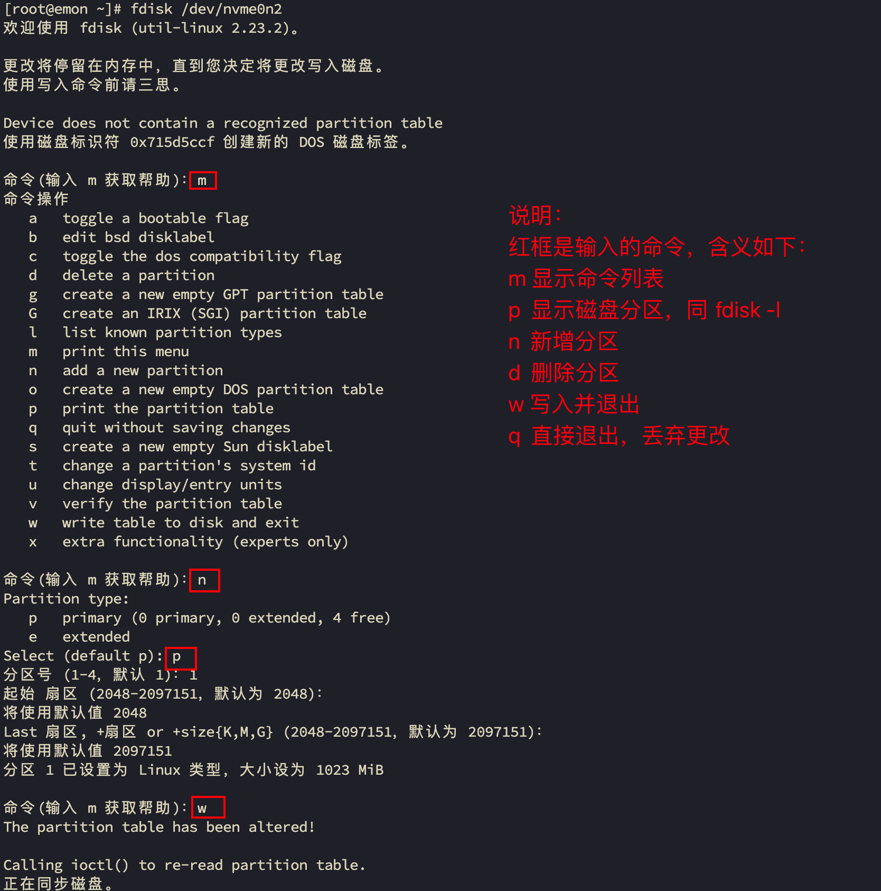
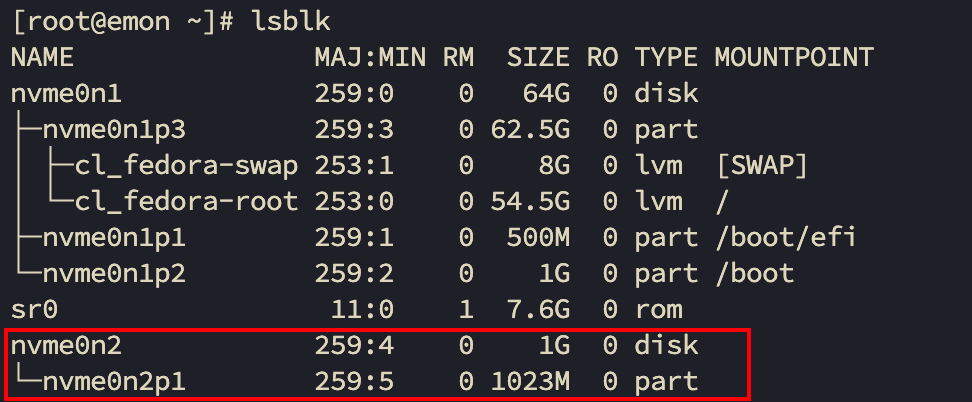

# 第10章 Linux磁盘分区、挂载

## 10.1 lsblk查看Linux分区

- 原理介绍

1. Linux来说无论有几个分区，分给哪一个目录使用，它归根结底就只有一个目录，一个独立且唯一的文件结构，Linux中每个分区都是用来组成整个文件系统的一部分。
2. Linux采用了一种叫做”载入“的处理方法，它的整个文件系统中包含了一整套的文件和目录，且将一个分区和一个目录联系起来。这时要载入的一个分区将使它的存储空间在一个目录下获得。

- 查看所有设备挂载情况

命令：`lsblk`或`lsblk -f`



- 硬盘说明

1. Linux硬盘分IDE硬盘和SCSI硬盘，目前基本上是SCSI硬盘。
2. 对于IDE硬盘，驱动器标识符为”hdx~
   “，其中”hd“表明分区所在设备的类型，这里是指IDE硬盘了。”x“为盘号（a为基本盘，b为基本从属盘，c为辅助主盘，d为辅助从属盘），”~
   “代表分区，前四个分区用数字1到4表示，它们是主分区或扩展分区，从5开始就是逻辑分区。例，hda3表示为第一个IDE硬盘上的第三个主分区或扩展分区，hdb2表示为第二个IDE硬盘上的第二个主分区或扩展分区。
3. 对于SCSI硬盘则标识为”sdx~“，SCSI硬盘是用”sd“来表示分区所在设备的类型的，其余则和IDE硬盘的表示方法一样。
4. NVMe 硬盘，nvme0n1 这个磁盘名是 NVMe Disk 0 Namespace 1 的缩写，意思是第一个 NVMe 硬盘的第一个命名空间1。每个 NVMe
   硬盘上的分区通过在磁盘名后面加上一个 p 和一个十进制数字表示，例如 nvme0n1p1 和 nvme0n1p2 表示系统中第一个 NVMe
   硬盘的第一个命名空间的第一个和第二个分区。

## 10.2 使用 LVM 配置磁盘

LVM（Logical Volume Manager 逻辑卷管理器）是 Linux 系统的一种**高级磁盘管理技术**，它通过抽象层将物理存储设备与逻辑存储分离，提供比传统分区更灵活的磁盘管理方案。

### 10.2.1 LVM核心概念图解


1. 物理卷 (PV - Physical Volume)

- **物理存储单元**：硬盘、分区或 RAID 设备
- 初始化命令：`pvcreate /dev/sdb`
- 查看命令：`pvs` 或 `pvdisplay`

2. 卷组 (VG - Volume Group）

- **存储池**：由多个 PV 组成的逻辑存储池
- 创建命令：`vgcreate vg_data /dev/sdb /dev/sdc`
- 扩展命令：`vgextend vg_data /dev/sdd`

3. 逻辑卷 (LV - Logical Volume)

- **虚拟分区**：从 VG 划分出的可动态调整的逻辑存储
- 创建命令：`lvcreate -n lv_app -L 100G vg_data`
- 扩展命令：`lvextend -L +50G /dev/vg_data/lv_app`

### 10.2.2 创建LVM磁盘

1. 查看根分区大小

```bash
df -h
```

2. 在虚拟中<span style="color:red;font-weight:bold;">添加一块物理的磁盘，重启虚拟机</span>
3. 查看磁盘编号

```bash
$ ls /dev/sd*
/dev/sda  /dev/sda1  /dev/sda2  /dev/sdb
# /dev/sdb 是新的虚拟磁盘
```
4. 创建PV

```bash
$ pvcreate /dev/sdb
```

5.  创建VG

```bash
$ vgcreate data /dev/sdb
```

6.  创建LV

```bash
# 使用所有空间，VG 名字为 data，LV 名字为 lvdata
$ lvcreate -n lvdata -L 50G data
```

### 10.2.3 格式化磁盘

```bash
$ mkfs.xfs /dev/mapper/data-lvdata
```

### 10.2.4 磁盘挂载

- 手工挂载

```bash
$ mkdir /data
$ mount /dev/mapper/data-lvdata /data
```
- 开机自动挂载

```bash
$ tail -1 /etc/mtab >> /etc/fstab
```

## 10.3 动态扩展LVM分区

1. 查看根分区大小

```bash
df -h
```

2. 在虚拟中<span style="color:red;font-weight:bold;">添加一块物理的磁盘，重启虚拟机</span>
3. 查看磁盘编号

```bash
$ ls /dev/sd*
/dev/sda  /dev/sda1  /dev/sda2  /dev/sdb
# /dev/sdb 是新的虚拟磁盘
```

4. 创建pv

```bash
$ pvcreate /dev/sdb
  Physical volume "/dev/sdb" successfully created.
```

5. 把pv加入vg中，相当于扩充vg的大小

- 先使用vgs查看vg组

```bash
[root@localhost ~]# vgs
  VG     #PV #LV #SN Attr   VSize   VFree
  centos   1   6   0 wz--n- <49.00g    0 
```

- 扩展vg，使用vgextend命令

```bash
[root@localhost ~]# vgextend centos /dev/sdb
  Volume group "centos" successfully extended
```

- 我们成功把vg卷扩展了，再用vgs查看一下

```bash
vgs
```

6. 扩充lv的大小

- 查看lv

```bash
[root@localhost ~]# lvs
  LV   VG     Attr       LSize  Pool Origin Data%  Meta%  Move Log Cpy%Sync Convert
  home centos -wi-ao---- <5.00g                                                    
  root centos -wi-ao---- <5.00g                                                    
  swap centos -wi-ao----  5.00g                                                    
  tmp  centos -wi-ao----  2.00g                                                    
  usr  centos -wi-ao---- 30.00g                                                    
  var  centos -wi-ao----  2.00g 
```

- 扩展lv，使用lvextend命令

```bash
[root@localhost ~]# lvextend -L +20G /dev/mapper/centos-root
  Insufficient free space: 5120 extents needed, but only 5119 available
# 发现错误，修改为+19G
[root@localhost ~]# lvextend -L +19G /dev/mapper/centos-root
  Size of logical volume centos/root changed from <5.00 GiB (1279 extents) to <24.00 GiB (6143 extents).
  Logical volume centos/root successfully resized.
```

7. 命令使系统重新读取大小

```bash
[root@localhost ~]# xfs_growfs /dev/mapper/centos-root 
meta-data=/dev/mapper/centos-root isize=512    agcount=4, agsize=327424 blks
         =                       sectsz=512   attr=2, projid32bit=1
         =                       crc=1        finobt=0 spinodes=0
data     =                       bsize=4096   blocks=1309696, imaxpct=25
         =                       sunit=0      swidth=0 blks
naming   =version 2              bsize=4096   ascii-ci=0 ftype=1
log      =internal               bsize=4096   blocks=2560, version=2
         =                       sectsz=512   sunit=0 blks, lazy-count=1
realtime =none                   extsz=4096   blocks=0, rtextents=0
data blocks changed from 1309696 to 6290432
```

8. 最后查看根分区大小

```bash
df -h
```

## 10.4 fdisk配置磁盘

### 10.4.1 fdisk和lvm

- 核心概念对比

| **特性**     | `fdisk` (分区工具)                    | `LVM` (逻辑卷管理器)             |
| :----------- | :------------------------------------ | :------------------------------- |
| **功能定位** | 物理磁盘分区管理                      | 逻辑存储虚拟化管理               |
| **操作对象** | 物理磁盘 (`/dev/sda`, `/dev/nvme0n1`) | 逻辑卷 (`/dev/mapper/vg-lv`)     |
| **管理粒度** | 固定大小的分区                        | 动态调整的逻辑卷                 |
| **核心优势** | 简单直接、引导兼容性好                | 灵活扩展、存储池化、高级功能     |
| **典型场景** | 创建引导分区、简单磁盘划分            | 数据库存储、云环境、动态扩展需求 |

- 性能关键场景选择




### 10.4.2 挂载经典案例

- 说明

下面我们以增加一块硬盘为例来熟悉下磁盘的相关指令和深入理解磁盘分区、挂载、卸载的概念。

**如何增加一块硬盘**

1. <span style="color:red;font-weight:bold;">虚拟机添加硬盘</span>

    1. 关闭虚拟机
    1. 在【虚拟机】菜单中，选择【设置】，然后设备列表里添加硬盘，然后一路【下一步】，中间只有选择硬盘大小的地方需要修改，直到完成。然后<span style="color:red;font-weight:bold;">
   重启系统</span>（才能识别）！
   
   
   
   
   
   
   
   
   
2. 分区

    1. 查看挂载的硬盘

   

    2. 分区命令

   ```bash
   % fdisk /dev/nvme0n2
   ```

   

    3. 查看挂载信息

   

3. 格式化

格式化磁盘

```bash
# xfs是分区类型
% mkfs -t xfs /dev/nvme0n2p1
meta-data=/dev/nvme0n2p1         isize=512    agcount=4, agsize=65472 blks
         =                       sectsz=512   attr=2, projid32bit=1
         =                       crc=1        finobt=0, sparse=0
data     =                       bsize=4096   blocks=261888, imaxpct=25
         =                       sunit=0      swidth=0 blks
naming   =version 2              bsize=4096   ascii-ci=0 ftype=1
log      =internal log           bsize=4096   blocks=855, version=2
         =                       sectsz=512   sunit=0 blks, lazy-count=1
realtime =none                   extsz=4096   blocks=0, rtextents=0
```

4. 挂载

挂载：将一个分区和一个目录联系起来。

```bash
[root@emon ~]# mkdir /newdisk
[root@emon ~]# mount /dev/nvme0n2p1 /newdisk/
[root@emon ~]# lsblk
NAME               MAJ:MIN RM  SIZE RO TYPE MOUNTPOINT
nvme0n1            259:0    0   64G  0 disk 
├─nvme0n1p3        259:3    0 62.5G  0 part 
│ ├─cl_fedora-swap 253:1    0    8G  0 lvm  [SWAP]
│ └─cl_fedora-root 253:0    0 54.5G  0 lvm  /
├─nvme0n1p1        259:1    0  500M  0 part /boot/efi
└─nvme0n1p2        259:2    0    1G  0 part /boot
sr0                 11:0    1  7.6G  0 rom  
nvme0n2            259:4    0    1G  0 disk 
└─nvme0n2p1        259:5    0 1023M  0 part /newdisk
```

说明：如何卸载？

```bash
# 卸载方式一
% umount /dev/nvme0n2p1
# 卸载方式二
% unmount /newdisk
```

<span style="color:red;font-weight:bold;">注意：用命令行挂载重启后会失效！</span>

5. 设置虚拟机启动后自动挂载

通过修改 /etc/fstab 实现自动挂载。添加完成后，执行 mount -a 即刻生效。

```bash
% vim /etc/fstab
# 个人配置
/dev/nvme0n2p1          /newdisk                xfs     defaults        0 0
```


## 10.5 df磁盘情况查询

- 查询系统整体磁盘使用情况

```bash
% df -Th
```

- 查询指定目录磁盘占用情况

```bash
% du -sh
```

查询指定目录的磁盘占用情况，默认为当前目录。

| 选项            | 含义            |
|---------------|---------------|
| -s            | 指定目录占用大小汇总    |
| -h            | 带计量单位         |
| -a            | 含文件           |
| --max-depth=1 | 子目录深度（与-s互斥）  |
| -c            | 列出明细的同时，增加汇总值 |

- 应用实例

```bash
% du -h --max-depth=1 /home
```

## 10.6 磁盘情况-工作实用指令

**统计/opt文件夹下文件的个数**

```bash
% ls -l /opt/ | grep "^-" | wc -l
```

**统计/opt文件夹下目录的个数**

```bash
% ls -l /opt/ | grep "^d" | wc -l
```

**统计/opt文件夹下文件的个数，包括子文件夹里的**

```bash
% ls -lR /opt/ | grep "^-" | wc -l
```

**统计/opt文件夹下目录的个数，包括子文件夹里的**

```bash
% ls -lR /opt/ | grep "^d" | wc -l
```

**以树状显示目录结构**

```bash
# 若没有tree命令，则 yum install -y --nogpgcheck tree 安装即可
% tree /root
% tree -L 1 /root
```