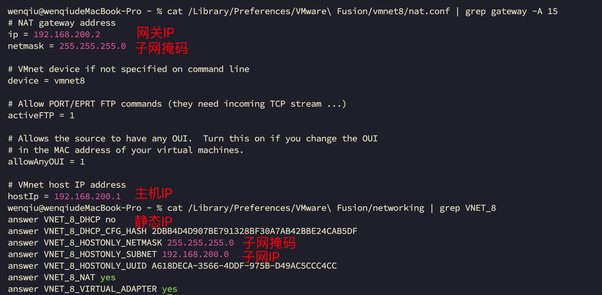
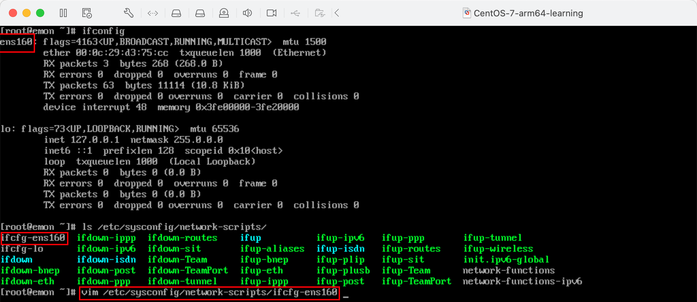
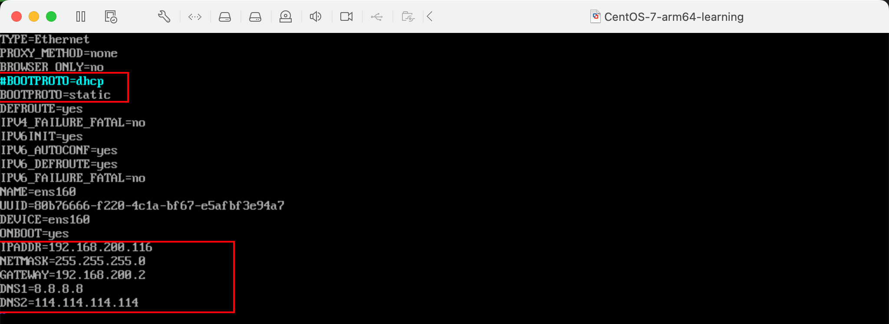
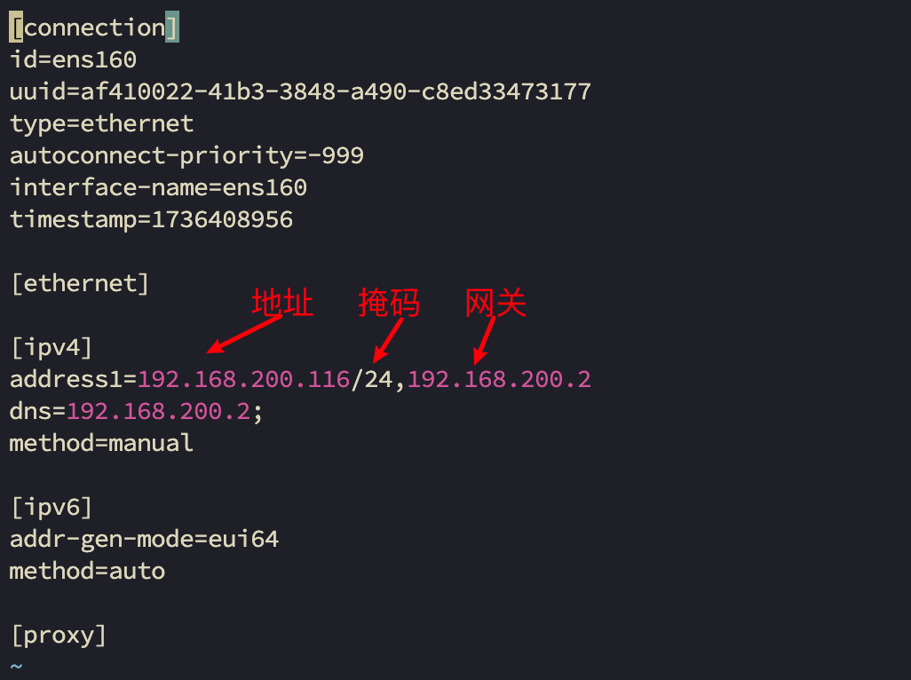
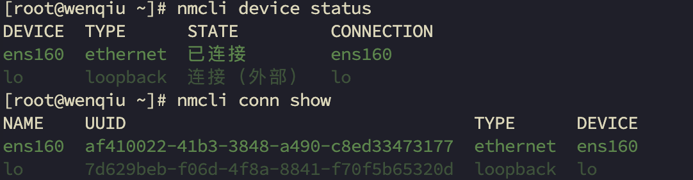
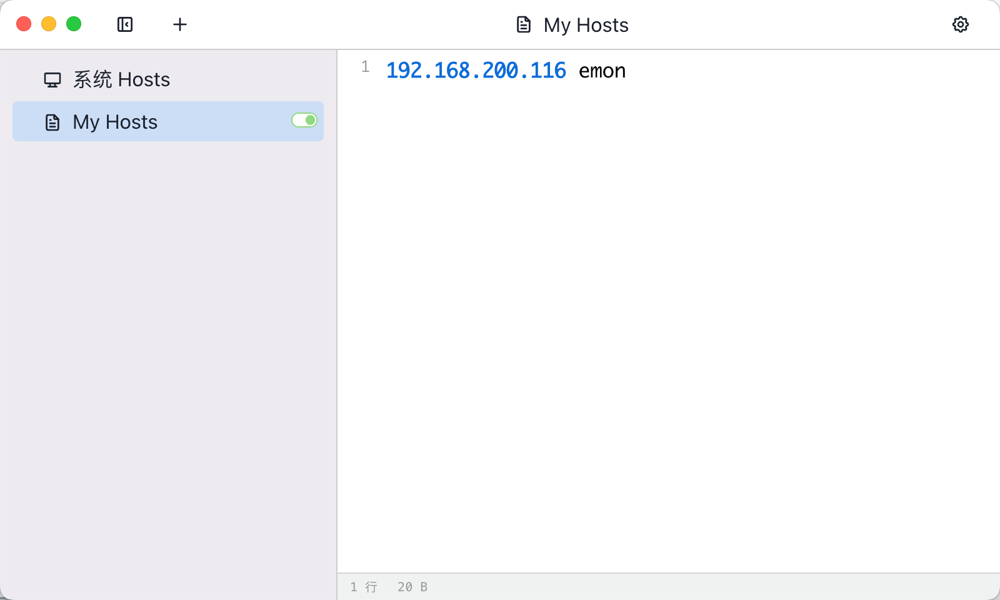

# 第11章 网络配置

## 11.1 Linux网络环境配置

- Mac下查看虚拟机的子网IP和子网掩码



### 11.1.1 CentOS7网卡配置

- 虚拟机修改网卡配置文件



- 虚拟机修改内容如下



注意：

1. DNS1 表示域名解析器，值也可以是192.168.200.2

2. BOOTPROTO 表示IP的配置方法[none|static|bootp|dhcp]（引导时不使用协议|静态分配IP|BOOTP协议|DHCP协议）

3. TYPE=Ethernet 表示网络类型
4. DEVICE=ens160 表示接口名（设备，网卡）
5. ONBOOT=yes 表示系统启动的时候网络接口是否有效

- 重启网络

```bash
% systemctl restart network
# 或者
% service network restart
# 或者
% reboot
```

### 11.1.2 Rocky9网卡配置

```bash
% vim /etc/NetworkManager/system-connections/ens160.nmconnection
```





| 命令                                                          | 说明                                                |
|-------------------------------------------------------------|---------------------------------------------------|
| nmcli n                                                     | 查看NM托管状态，<br />如果是disabled会导致无法nmcli conn up XX成功 |
| nmcli n on                                                  | 开启NM托管状态                                          |
| nmcli conn show                                             | 查询网卡的配置信息                                         |
| nmcli device status                                         | 查询网卡的连接状态                                         |
| nmcli device disconnect ens160                              | 断开设备连接                                            |
| nmcli device connect ens160                                 | 打开连接                                              |
| nmcli                                                       | 查询所有网卡信息                                          |
| nmcli device show ens160                                    | 查看ens160网卡信息                                      |
| nmcli conn show ens160                                      | 查看ens160网卡配置                                      |
| nmcli conn modify ens160 ipv4.method manual                 | 设置IP地址为手动指定                                       |
| nmcli conn modify ens160 connection.autoconnect yes         | 设置网卡开机自启动                                         |
| nmcli conn modify ens160 ipv4.addreses '192.168.200.116/24' | 设置网卡IP                                            |
| nmcli conn modify ens160 ipv4.gateway '192.168.200.2'       | 设置网关                                              |
| nmcli conn modify ens160 ipv4.dns '192.168.200.2'           | 设置DNS                                             |

<span style="color:red;font-weight:bold;">注意：DNS还可以是
`nmcli conn modify ens160 ipv4.dns '192.168.200.2,223.5.5.5,8.8.8.8,114.114.114.114'`</span>

- 重新加载配置文件

```bash
% nmcli conn reload
```

- 不重启系统，让网卡生效

```bash
% nmcli conn up ens160
```

## 11.2 设置主机名和hosts映射

### 11.2.1 设置主机名

为了方便记忆，可以给linux系统设置主机名，也可以根据需要修改主机名

- 第一步

```bash
[root@emon ~]# hostnamectl set-hostname emon
```

- 第二步：验证

```bash
[root@emon ~]# cat /etc/hostname
emon
[root@emon ~]# hostname
emon
```

- 第三步：配置

```bash
[root@emon ~]# vim /etc/hosts
```

```bash
# 这里也可以是某个具体的IP地址
127.0.0.1   emon
```

- 第四部：退出Shell，重新登录即可

### 11.2.2 设置hosts映射

DNS解析过程分析 ：用户在浏览器输入了www.baidu.com

Hosts是什么？一个文本文件，用来记录IP和Hostname（主机名）的映射关系。

DNS是什么？就是Domain Name System的缩写，翻译过来就是域名系统，是互联网上作为域名和IP地址相互映射的一个分布式数据库。

1. 浏览器先检查浏览器缓存中有没有该域名解析IP地址，有就先调用这个IP完成解析；如果没有，就检查DNS解析器缓存，如果有直接返回IP完成解析。这两个缓存，可以理解为本地解析器缓存。
2. 一般来说，当电脑第一次成功访问某一网站后在一定时间内，浏览器或操作系统会缓存他的IP地址（DNS解析记录）。如在cmd窗口中输入。

ipconfig /displaydns // DNS域名解析缓存

ipconfig /flushdns // 手动清理DNS缓存

3. 如果本地解析器缓存没有找到对应映射，检查系统中hosts文件中有没有配置对应的域名IP映射，如果有，则完成解析并返回。
4. 如果本地DNS解析器缓存和hosts文件中均没有找到对应的IP，则到域名服务DNS进行解析域。


- 使用SwitchHosts软件配置本地Mac的hosts。



- 编辑 /etc/hosts 修改虚拟机的hosts

```bash
vim /etc/hosts
```

```bash
# 添加下面一行
192.168.200.1 wenqiu
```
