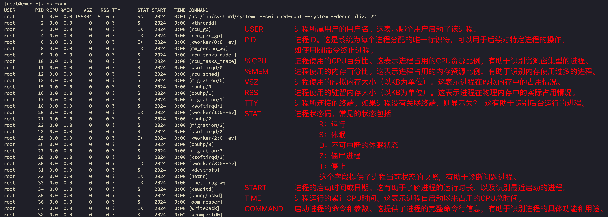
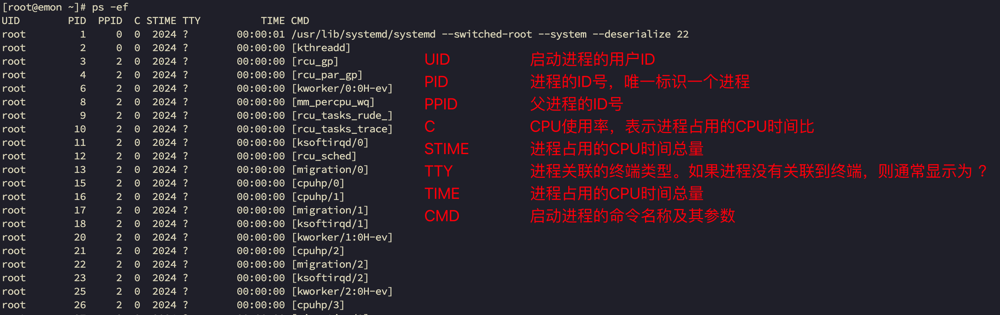
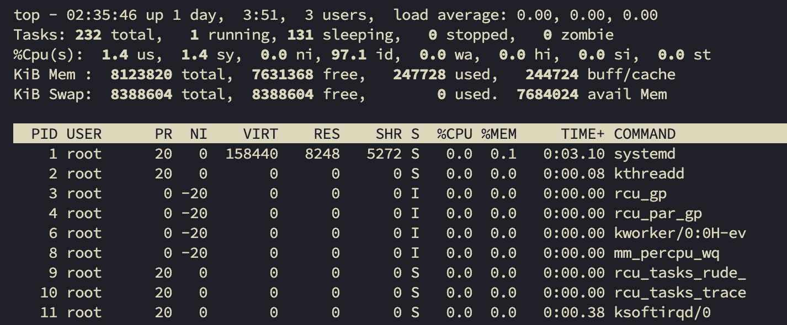
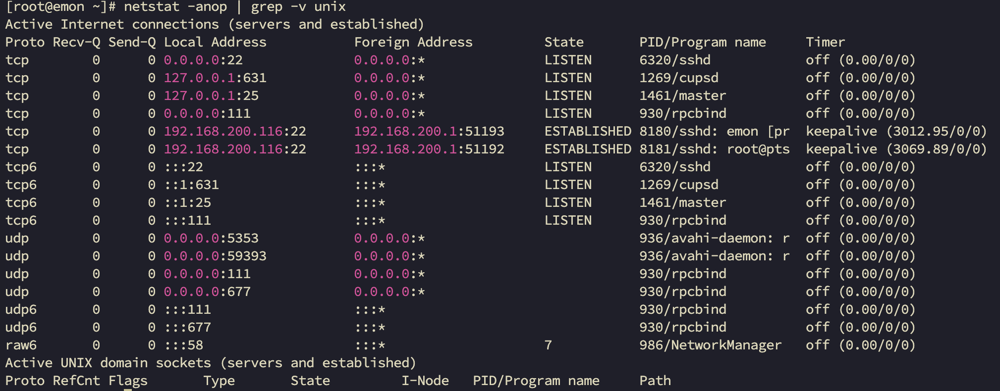

# 第12章 进程管理

## 12.1 基本介绍

1. 在Linux中，每个执行的程序都成为一个进程。每一个进程都分配一个ID号（pid，进程号）。
2. 每个进程都可能以两种方式存在的。前台与后台，所谓前台进程就是用户目前的屏幕上可以进行操作的。后台进程则是实际在操作，但由于屏幕上无法看到的进程，通常使用后台方式执行。
3. 一般系统的服务都是以后台进程的方式存在，而且都会常驻在系统中。直到关机才结束。

## 12.2 ps显示系统执行的进程

**基本介绍**

ps命令是用来查看目前系统中，有哪些正在执行，以及它们执行的状况。可以不加任何参数。

ps显示的信息选项：

| 字段   | 说明          |
|------|-------------|
| PID  | 进程识别号       |
| TTY  | 终端机号        |
| TIME | 此进程所消耗CPU时间 |
| CMD  | 正在执行的命令或进程名 |

```bash
% ps
  PID TTY          TIME CMD
 4811 pts/1    00:00:00 bash
 5073 pts/1    00:00:00 ps
```

| 命令      | 含义                       |
|---------|--------------------------|
| ps -a   | 显示当前终端的所有进程信息            |
| ps -u   | 显示与指定用户相关的进程信息           |
| ps -x   | 显示后台进程运行的参数              |
| ps -aux | 显示所有进程信息，包括所有用户的进程和无终端进程 |
| -A 或 -e | 显示所有进程信息                 |
| ps -ef  | 显示所有进程的完整信息，包括命令行参数      |

**ps -aux命令的输出内容解释 **



**ps -ef命令的输出内容解释**



## 12.3 终止进程kill和killall

- 介绍：

若是某个进程执行一半需要停止时，或是已消耗了很大的系统资源时，此时可以考虑停止该进程。使用kill命令来完成此项任务。

- 基本语法

`kill [选项] 进程号` （功能描述：通过进程号杀死进程）

`killall 进程名称` （功能描述：通过进程名称杀死进程，也支持通配符，这在系统因负载过大而变得很慢）

- 常用选项

-9 ：表示强迫进程立即停止

- 最佳实践

1. 案例1：踢掉某个非法登录用户

```bash
# 查找 emon 用户的登录进程ID
% ps -aux | grep sshd
% kill 6070
```

2. 案例2：终止远程登录服务sshd，在适当时候再次重启sshd服务。

```bash
# 查找 /usr/sbin/sshd 的进程ID
% ps -aux | grep sshd
# 杀掉之后，新的用户无法登入了，但已经登录的用户还可以使用
% kill 1268
% systemctl start sshd
```

3. 案例3：终止多个gedit

```bash
% killall gedit
```

4. 案例4：强制杀掉一个终端

```bash
% ps -aux | grep bash
% kill -9 ps -aux | grep bash
```

## 12.4 查看进程树pstree

- 基本语法

`pstree [选项]` 可以更加直观的来看进程信息

- 常用选项

-p ：显示进程的PID

-u ：显示进程的所属用户

- 应用实例

1. 案例1：请以树状的形式显示进程的pid

```bash
% pstree -p
```

2. 案例2：请以树状的形式进程的用户

```bash
% pstree -u
```

## 12.5 服务（service）管理

### 12.5.1 service管理指令

- 介绍

服务（service）本质就是进程，但是是运行在后台的，通常都会监听某个端口，等待其他程序的请求，比如（mysql、sshd防火墙等），因此我们又称为守护进程，是Linux中非常重要的知识点。

- service管理指令

1. service 服务名 [start | stop | restart | reload | status]

2. 在CentOS7.0后，<span style="color:red;font-weight:bold;">很多服务不再使用service，而是systemctl代替</span>。
3. service指令管理的服务在 /etc/init.d 查看

```bash
% ls -l /etc/init.d/
总用量 40
-rw-r--r--. 1 root root 18281 5月  22 2020 functions
-rwxr-xr-x. 1 root root  4569 5月  22 2020 netconsole
-rwxr-xr-x. 1 root root  7928 5月  22 2020 network
-rw-r--r--. 1 root root  1160 10月  2 2020 README
```

- service管理指令案例

请使用service指令，查看、关闭、启动 network 【注意：在虚拟系统演示，因为网络连接会关闭】

### 12.5.2 setup查看服务名

- 查看服务名

方式1：使用 setup -> 系统服务 就可以看到全部。

```bash
% setup
```

说明：服务名前面带有星号[*]表示开机启动。

方式2：/etc/init.d 看到service指令管理的服务。

```bash
% ls -l /etc/init.d/
总用量 40
-rw-r--r--. 1 root root 18281 5月  22 2020 functions
-rwxr-xr-x. 1 root root  4569 5月  22 2020 netconsole
-rwxr-xr-x. 1 root root  7928 5月  22 2020 network
-rw-r--r--. 1 root root  1160 10月  2 2020 README
```

### 12.5.3 服务的运行级别（runlevel）

- 服务的运行级别（runlevel）

Linux系统有7种运行级别（runlevel），常用的是级别3和5。

运行级别0：系统停机状态，系统默认运行级别不能设为0，否则不能正常启动。

运行级别1：单用户工作状态，root权限，用于系统维护，禁止远程登录。

运行级别2：多用户工作状态（没有NFS），不支持网络。

运行级别3：完全的多用户状态（有NFS），登录后进入控制台命令行模式。

运行级别4：系统未使用，保留。

运行级别5：X11控制台，登录后进入图形GUI模式。

运行级别6：系统正常关闭并重启，默认运行级别不能设为6，否则不能正常启动。

开机的流程说明：

开机=>BIOS=>/boot=>systemd进程=>运行级别=>运行级对应的服务。

- CentOS7之前如何指定运行级别？

在CentOS7之前，在 /etc/inittab 文件中。

- CentOS7及之后如何指定运行级别？

    - 默认级别说明
        - <span style="color:blue;">multi-user.target</span> : analogous to runlevel 3
        - <span style="color:blue;">graphical.target</span> : analogous to runlevel 5


- 查看默认级别

  ```bash
  % systemctl get-default
  ```

- 设置默认级别为 3

  ```bash
  % systemctl set-default multi-user.target
  ```

### 12.5.4 chkconfig指令

- 介绍

1. 通过chkconfig命令可以给服务的各个运行级别设置自启动/关闭。
2. chkconfig指令管理的服务在 /etc/init.d 查看。
3. 注意：CentOS7.0后，很多服务<span style="color:red;font-weight:bold;">使用 systemctl</span>管理。

- chkconfig基本语法

```bash
# 查看服务
% chkconfig --list
% chkconfig network --list
```

```bash
# 设置服务在5级别下自启动/关闭，这种设置需要重启生效
% chkconfig --level 5 network on/off 
```

### 12.5.5 systemctl管理指令

- 管理指令基本语法

1. 基本语法

```bash
% systemctl [start | stop | restart | status] 服务名
```

2. systemctl指令管理的服务在 `/usr/lib/systemd/system` 查看

```bash
% ls -l /usr/lib/systemd/system
```

- systemctl设置服务的自启动状态

1. `systemctl list-unit-files [| grep 服务名]`（查看服务开机启动状态，grep可以进行过滤）

   ```bash
   % systemctl list-unit-files  --type=service
   ```
2. `systemctl enable 服务名` （设置服务开机启动）
3. `systemctl disable 服务名` （关闭服务开机启动）
4. `systemctl is-enabled 服务名` （查看某个服务是否自启动的）

- 应用案例

1. 查看当前防火墙的状况，关闭防火墙和重启防火墙。

```bash
# 这种方式只是临时生效，当重启系统后，还是回归以前对服务的设置。
% systemctl stop firewalld
# 永久生效命令
% systemctl disable firewalld
```

### 12.5.6 firewall-cmd打开或者关闭指定端口

在真正的生产环境，往往需要将防火墙打开，但问题来了，如果我们把防火墙打开，那么外部请求数据包就不能跟服务器监听端口通讯。这时，需要打开制定的端口。比如80、22、8080等，这个又怎么做呢？

- firewall指令

打开端口：`firewall-cmd --permanent --add-port=端口号/协议`

关闭端口：`firewall-cmd --permanent --remove-port=端口号/协议`

重新载入，才能生效：`firewall-cmd --reload`

查询端口是否开放：`firewall-cmd --query-port=端口/协议`

- 应用案例

1. 启用防火墙，测试111端口是否能telnet

```bash
% telnet 192.168.200.116 111
```

2. 开放111端口

```bash
% firewall-cmd --permanent --add-port=111/tcp
% firewall-cmd --reload
```

此时，telnet能通：

```bash
% telnet emon 111
Trying 192.168.200.116...
Connected to emon.
Escape character is '^]'.
^]
telnet> quit
Connection closed.
```

3. 再次关闭111端口

```bash
# 特殊说明：关闭的操作，在reload之前已经生效了
% firewall-cmd --permanent --remove-port=111/tcp
% firewall-cmd --reload
```

## 12.6 动态监控进程

### 12.6.1 top命令详解

- 介绍

top与ps命令很相似。它们都用来显示正在执行的进程。top与ps最大的不同之处，在于top在执行一段时间可以更新正在运行的进程。

- 基本语法

```bash
% top [选项]
```

- 选项说明

| 选项    | 功能                              |
|-------|---------------------------------|
| -d 秒数 | 指定top命令每隔几秒更新。默认是3秒。比如：top -d 5 |
| -i    | 使top不显示任何闲置或者僵死进程。              |
| -p    | 通过指定监控进程ID来仅仅监控某个进程的状态。         |

- top命令输出结果解释

默认top命令进入时是按照CPU占用来排序的。



<span style="color:#1E90FF;font-weight:bold;">第一行：</span>

```bash
top - 02:36:46 up 1 day,  3:52,  3 users,  load average: 0.00, 0.00, 0.00
```

当前时间 02:36:46

系统运行时间 up 1 day, 3:52

用户数量 3 users

CPU负载情况 load average: 0.00, 0.00, 0.00 3个值累加除以3，若小于0.7表示压力不大。

<span style="color:#1E90FF;font-weight:bold;">第二行</span>

```bash
Tasks: 232 total,   1 running, 131 sleeping,   0 stopped,   0 zombie
```

任务数量 Tasks: 232 total

运行数量 1 running

睡眠数量 131 sleeping

停止数量 0 stopped

僵死数量 0 zombie

<span style="color:#1E90FF;font-weight:bold;">第三行：</span>

```bash
%Cpu(s):  0.0 us,  0.0 sy,  0.0 ni,100.0 id,  0.0 wa,  0.0 hi,  0.0 si,  0.0 st
```

用户空间占用CPU百分比 0.0 us

内核空间占用CPU百分比 0.0 sy

用户进程空间内改变过优先级的进程占用CPU百分比 0.0 ni

空闲CPU百分比 100.0 id

等待输入输出的CPU时间百分比 0.0 wa

硬中断（Hardware IRQ）占用CPU的百分比 0.0 hi

软中断（Software Interrupts）占用CPU的百分比 0.0 si

用于有虚拟cpu的情况，用来指示被虚拟机偷掉的cpu时间 0.0 st

<span style="color:#1E90FF;font-weight:bold;">第四行：</span>

```bash
KiB Mem :  8123820 total,  7631400 free,   247432 used,   244988 buff/cache
```

物理总内存 8123820 total

物理空闲内存 7631400 free

物理使用内存 247432 used

缓存内存 244988 buff/cache

<span style="color:#1E90FF;font-weight:bold;">第五行：</span>

```bash
KiB Swap:  8388604 total,  8388604 free,        0 used.  7684272 avail Mem 
```

Swap总内存 8388604 total

Swap空闲内存 8388604 free

Swap使用内存 0 used

swap可用内存 7684272 avail Mem

<span style="color:#1E90FF;font-weight:bold;">进程结果解释</span>

```bash
  PID USER      PR  NI    VIRT    RES    SHR S  %CPU %MEM     TIME+ COMMAND                                   
    1 root      20   0  158440   8248   5272 S   0.0  0.1   0:03.10 systemd                                   
    2 root      20   0       0      0      0 S   0.0  0.0   0:00.08 kthreadd  
```

| 列名      | 含义                                        |
|---------|-------------------------------------------|
| PID     | 进程ID                                      |
| USER    | 进程拥有者的用户名                                 |
| PR      | 进程优先级                                     |
| NI      | 进程优先级值。正常为0， 负值表示优先级越高，正值表示优先级越低          |
| VIRT    | 进程使用的虚拟内存总量，单位KB。                         |
| RES     | 进程使用的物理内存大小，单位KB。                         |
| SHR     | 进程使用的共享内存大小，单位KB。                         |
| S       | 进程的状态，通常是'S'-休眠、'R'-运行中、'Z'-僵尸、'N'-低优先级任务 |
| %CPU    | 进程使用的CPU时间百分比。                            |
| %MEM    | 进程使用的物理内存百分比。                             |
| TIME+   | 进程运行的总CPU时间。                              |
| COMMAND | 启动进程的命令名称                                 |

### 12.6.2 top命令交互

- 交互操作说明

| 操作 | 功能               |
|----|------------------|
| P  | 以CPU使用率排序，默认就是此项 |
| M  | 以内存的使用率排序        |
| N  | 以PID排序           |
| q  | 退出top            |

- 应用实例

案例1.监视特定用户

top ：输入此命令，按回车键，查看执行的进程。

u ：然后输入“u”回车，再输入用户名即可。

案例2.终止指定的进程。

top ：输入此命令，按回车键，查看执行的进程。

k ：然后输入“k”按回车，再输入要结束的进程ID号。

案例3.指定系统状态更新的时间（每隔10秒自动更新）

top -d 10

## 12.7 监控网络状态

### 12.7.1 查看系统网络情况netstat

- 基本语法

`netstat [选项]`

- 选项说明

| 选项    | 功能                                           |
|-------|----------------------------------------------|
| -t    | 仅显示TCP连接                                     |
| -u    | 进现实UDP连接                                     |
| -a    | 显示所有连线中的Socket，包括监听的。                        |
| -n    | 直接使用IP地址，不通过域名服务器。                           |
| -o    | 显示socket定时器（比如保活定时器）的信息                      |
| -p    | 显示正在使用Socket的程序识别码和程序名称。                     |
| -anop | 以数字形式显示所有连接和监听端口、保活定时器信息及其对应的进行信息。           |
| -l    | 显示处于监听状态的服务端口                                |
| -c    | 每隔1s输出一次                                     |
| -tnlp | 以数字形式显示所有TCP监听端口及其对应的进程信息‌。                  |
| -tnop | 以数字形式显示所有TCP监听端口及其对应的进程信息‌。（仅显示keepalive的数据） |

- 应用案例

请查看服务名尾sshd的服务的信息。

```bash
% netstat -anop | grep -v unix
```



### 12.7.2 检测主机连接命令ping

ping是一种网络检测工具，它主要是用于检测远程主机是否正常，或是两部主机间的网线或网卡故障。

如：ping对方ip地址

```bash
% ping 192.168.200.1
```

