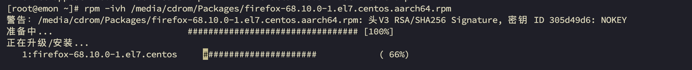

# 第13章 RPM、YUM、DNF

## 13.1 rpm包的管理

### 13.1.1 查询rpm包

- 介绍

rpm用于互联网下载包的打包及安装工具，它包含在某些Linux分发版中。它生成具有`.rpm`扩展名的文件。rpm是RedHat Package
Manager（RedHat软件包管理工具）的缩写，类似windows的setup.exe，这一文件格式名称虽然打上了RedHat的标志，但理念是通用的。

Linux的分发版本都有采用（suse、redhat、centos等等），可以算是公认的行业标准了。

- rpm包的简单查询指令

查询已安装的rpm列表：`rpm -qa|grep xx`

```bash
# 看看当前系统是否安装了firefox
% rpm -qa|grep firefox
firefox-68.10.0-1.el7.centos.aarch64
```

- rpm包名基本格式

一个rpm包名：firefox-60.2.2-1.el7.centos.x86_64

名称：firefox

版本号：60.2.2-1

适用操作系统：el7.centos.x86_64

表示centos7.x的64位操作系统

如果是i686、i368表示32位系统，noarch表示通用。

- rpm包的其它查询指令

    - `rpm -qa` 查询所安装的所有rpm软件包

  ```bash
  % rpm -qa | more
  % rpm -qa | grep firefox
  ```

    - `rpm -q 软件包名` 查询软件包是否安装

  如果软件包已经安装，该命令会输出软件包的版本信息；如果未安装，则会输出“package <package_name> is not installed”

  ```bash
  % rpm -q firefox
  firefox-68.10.0-1.el7.centos.aarch64
  # 如果命令的输出为空，则说明所有列出的软件包都已安装；如果输出包含“not installed”，则说明至少有一个软件包未安装。
  % rpm -q wget curl git | grep "not installed"
  ```

    - `rpm -qi 软件包名` 查询软件包信息

  ```bash
  % rpm -qi firefox
  Name        : firefox
  Version     : 68.10.0
  Release     : 1.el7.centos
  Architecture: aarch64
  Install Date: 2024年12月22日 星期日 19时44分25秒
  Group       : Unspecified
  Size        : 225389870
  License     : MPLv1.1 or GPLv2+ or LGPLv2+
  Signature   : RSA/SHA256, 2020年07月09日 星期四 00时26分19秒, Key ID 6c7cb6ef305d49d6
  Source RPM  : firefox-68.10.0-1.el7.centos.src.rpm
  Build Date  : 2020年07月08日 星期三 07时21分07秒
  Build Host  : aarch64-02.bsys.centos.org
  Relocations : (not relocatable)
  Packager    : CentOS BuildSystem <http://bugs.centos.org>
  Vendor      : CentOS
  URL         : https://www.mozilla.org/firefox/
  Summary     : Mozilla Firefox Web browser
  Description :
  Mozilla Firefox is an open-source web browser, designed for standards
  compliance, performance and portability.
  ```

    - `rpm -ql 软件包名` 查询软件包中的文件

  ```bash
  % rpm -ql firefox
  /etc/firefox
  /etc/firefox/pref
  /usr/bin/firefox
  ......
  ```

    - `rpm -qf 文件全路径名` 查询文件所属的软件包

  ```bash
  % rpm -qf /etc/passwd
  setup-2.8.71-11.el7.noarch
  % rpm -qf /root/install.log
  错误：文件 /root/install.log：没有那个文件或目录
  % rpm -qf /root/anaconda-ks.cfg 
  文件 /root/anaconda-ks.cfg 不属于任何软件包
  ```

    - `rpm -qc 软件包名` 显示已安装的指定软件的配置文件

  ```bash
  % rpm -qc wget
  /etc/wgetrc
  % rpm -qc yum
  /etc/logrotate.d/yum
  /etc/yum.conf
  /etc/yum/version-groups.conf
  ```

    - `rpm -qd 软件包名` 显示已安装的指定软件的软件包文档所在位置

  ```bash
  % rpm -qd yum
  /usr/share/doc/yum-3.4.3/AUTHORS
  /usr/share/doc/yum-3.4.3/COPYING
  /usr/share/doc/yum-3.4.3/ChangeLog
  /usr/share/doc/yum-3.4.3/INSTALL
  /usr/share/doc/yum-3.4.3/PLUGINS
  /usr/share/doc/yum-3.4.3/README
  /usr/share/doc/yum-3.4.3/TODO
  /usr/share/doc/yum-3.4.3/comps.rng
  /usr/share/man/man5/yum.conf.5
  /usr/share/man/man8/yum-shell.8
  /usr/share/man/man8/yum.8
  ```

    - `rpm -qR 软件包名` 显示已安装的指定软件的依赖的软件包及文件

  ```bash
  % rpm -qR yum
  /usr/bin/python
  config(yum) = 3.4.3-168.el7.centos
  cpio
  diffutils
  pygpgme
  pyliblzma
  python >= 2.4
  python(abi) = 2.7
  python-iniparse
  python-sqlite
  python-urlgrabber >= 3.10-8
  pyxattr
  rpm >= 0:4.11.3-22
  rpm-python
  rpmlib(CompressedFileNames) <= 3.0.4-1
  rpmlib(FileDigests) <= 4.6.0-1
  rpmlib(PayloadFilesHavePrefix) <= 4.0-1
  yum-metadata-parser >= 1.1.0
  yum-plugin-fastestmirror
  rpmlib(PayloadIsXz) <= 5.2-1
  ```

### 13.1.2 卸载rpm包

- 基本语法

`rpm -e RPM包的名称`

- 应用案例

1. 案例1：删除firefox软件包

```bash
% rpm -e firefox
```

- 细节讨论

1. 如果其他软件包依赖于你要卸载的软件包，卸载时会产生错误信息。

```bash
% rpm -e cpio
错误：依赖检测失败：
        cpio 被 (已安裝) yum-3.4.3-168.el7.centos.noarch 需要
        cpio 被 (已安裝) dracut-033-572.el7.aarch64 需要
        cpio 被 (已安裝) initscripts-9.49.53-1.el7.aarch64 需要
        cpio 被 (已安裝) plymouth-scripts-0.8.9-0.34.20140113.el7.centos.aarch64 需要
        cpio 被 (已安裝) abrt-addon-ccpp-2.1.11-60.el7.centos.aarch64 需要
        cpio 被 (已安裝) rpm-build-4.11.3-45.el7.aarch64 需要
        /usr/bin/cpio 被 (已安裝) kmod-20-28.el7.aarch64 需要
        /usr/bin/cpio 被 (已安裝) file-roller-3.28.1-2.el7.aarch64 需要
```

2. 如果我们就是要删除 cpio 这个rpm包，可以增加参数 -nodeps ，就可以强制删除，但是一般不推荐这样做，因为依赖于该软件包的程序可能无法运行。

比如：`rpm -e --nodeps cpio`

### 13.1.3 安装rpm包

- 基本语法

`rpm -ivh RPM包全路径名称`

- 参数说明

| 参数        | 功能  |
|-----------|-----|
| i=install | 安装  |
| v=verbose | 提示  |
| h=hash    | 进度条 |

- 应用实例

1. 案例1：演示卸载和安装firefox浏览器



## 13.2 yum与dnf

### 13.2.1 介绍

- yum (Yellowdog Updater,Modified)

YUM 是基于 RPM（Red Hat Package Manager）的 Linux 发行版（如 CentOS、RHEL、Fedora）的包管理工具，用于安装、更新、删除软件包，并自动处理依赖关系。

- dnf （Dandified YUM）

DNF 是 YUM 的改进版本，旨在解决 YUM 的性能和设计问题。现为 Fedora、CentOS 8+、RHEL 8+ 等系统的默认包管理器。

### 13.2.2 基本用法

- 清理缓存

::: code-group

```bash [yum]
$ sudo yum clean all
```

```bash [dnf]
$ sudo dnf clean all
```

:::

- 更新本地软件仓库的元数据缓存

`dnf makecache` 用于 **更新本地软件仓库的元数据缓存**。它会从配置的仓库（repo）中下载最新的软件包列表、依赖关系等元数据，并存储在本地，以加速后续操作（如搜索、安装、更新等）。

::: code-group

```bash [yum]
$ sudo yum makecache
```

```bash [dnf]
$ sudo dnf makecache
```

:::

- 更新软件包

::: code-group

```bash [yum]
$ sudo yum update
```

```bash [dnf]
$ sudo dnf upgrade
```

:::

::: tip

- **更新指定包**：`sudo dnf upgrade package_name`

:::

------


- 清理缓存并更新本地软件仓库的元数据缓存

```bash
# 请注意，若不需要更新全部，可以单独指定更新某些，或者不更新
$ sudo dnf clean all && sudo dnf makecache && sudo dnf update
```

:::warning

非必要，不要执行更新，因为可能把一些不需要更新的软件包升级。

比如：你安装了指定版本的docker，更新后会升级到最新。

:::

------

 

- 查看仓库列表

::: code-group

```bash [yum]
$ yum repolist
```

```bash [dnf]
$ dnf repolist
```

:::

::: tip

```bash
$ dnf repolist all
```

可以查看所有仓库（含禁用的）

:::

- 安装软件包

::: code-group

```bash [yum]
$ sudo yum install package_name
```

```bash [dnf]
$ sudo dnf install package_name
```

:::

::: tip

- **自动确认**：添加 `-y` 参数（如 `sudo dnf install -y httpd`）。

:::

- 删除软件包

::: code-group

```bash [yum]
sudo yum remove package_name
```

```bash [dnf]
sudo dnf remove package_name
```

:::

- 搜索软件包

::: code-group

```bash [yum]
$ yum search keyword
```

```bash [dnf]
$ dnf search keyword
```

:::

- 查看软件包信息

::: code-group

```bash [yum]
$ yum info package_name
```

```bash [dnf]
$ dnf info package_name
```

:::

- 列出已经安装的软件包

::: code-group

```bash [yum]
$ yum list installed
```

```bash [dnf]
$ dnf list installed
```

:::

- 查看是否安装过指定软件包

```bash
$ sudo dnf list installed open-vm-tools
```

- 安装本地 RPM 包（自动解决依赖）

::: code-group

```bash [yum]
$ sudo yum localinstall path/to/file.rpm
```

```bash [dnf]
$ sudo dnf install path/to/file.rpm
```

:::

- 软件包组管理

::: code-group

```bash [yum]
$ sudo groupinstall "Development Tools"
```

```bash [dnf]
$ sudo dnf group install "Development Tools"
# 或使用@语法
$ sudo dnf install @development-tools
```

:::

- 查看历史操作

::: code-group

```bash [yum]
$ yum history
```

```bash [dnf]
$ dnf history
```

:::

### 13.2.3 dnf特有功能

- 回滚操作（dnf）特有

```bash
# 回滚操作（dnf 特有）
$ sudo dnf history undo <事务ID>
```

- 模块化管理（适用于RHEL/CentOS 8+）：

```bash
$ dnf module list                 # 列出可用模块
$ dnf module enable nodejs:14     # 启用指定模块流
$ dnf module install postgresql   # 安装模块
```

- 自动删除无用依赖

```bash
$ sudo dnf autoremove             # 删除不再需要的依赖
```

- 更快的依赖解析

```bash
$ dnf 使用现代依赖解析算法，处理复杂依赖关系更高效。
```


