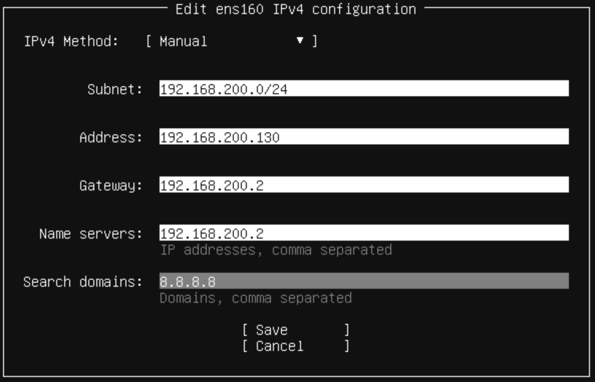
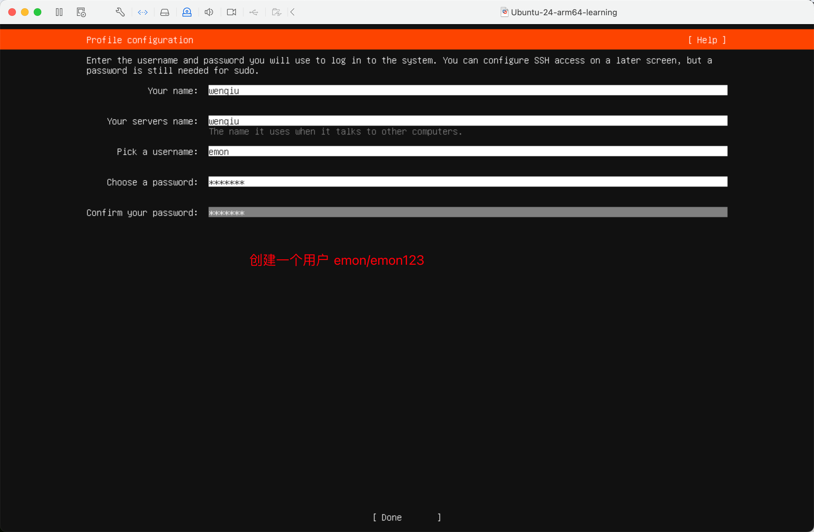
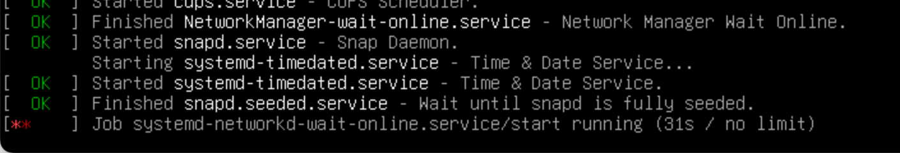
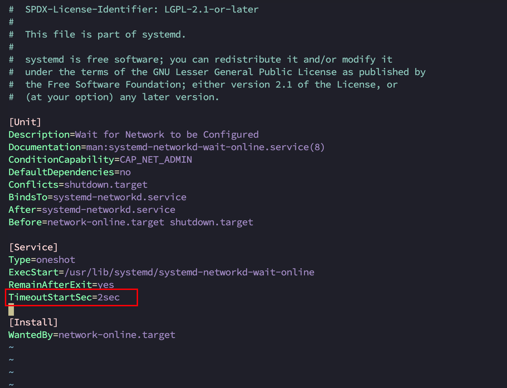

# 第15章 Ubuntu安装

## 15.1 安装

[Ubuntu安装参考](https://www.bilibili.com/video/BV1V4421D7Gt/?spm_id_from=333.337.search-card.all.click&vd_source=b850b3a29a70c8eb888ce7dff776a5d1)

- 手动配置网络



说明：

Search domains也可以是`192.168.200.2,8.8.8.8`

- 创建一个用户



- 注意，安装OpenSSH服务。

- 安装ifconfig命令

```bash
% sudo apt install -y net-tools
```

- 更新

```bash
% sudo apt update
```

- 安装图形界面

```bash
% sudo apt install -y ubuntu-desktop
```

- 问题：安装图形界面启动时，会提示：



ubuntu不连接网线的情况下，开机后卡在网络等待界面，预计会等待3-5分钟，一直显示

`Job system-networkd-wait-online.service/start runnning (31s /no limint)`

解决办法：

先登录，然后配置网络如下：

```bash
% sudo vim /etc/systemd/system/network-online.target.wants/systemd-networkd-wait-online.service
```



然后，重启。

```bash
% shutdown -r now
```

## 15.2 中文支持

默认安装的Ubuntu中只有英文语言，因此是不能显示汉字的。要正确显示汉字，需要安装中文语言包。

安装中文支持步骤：

1. 单击左侧图标栏打开 Language Support 菜单，点击打开 Language Support（语言支持）选项卡。
2. 点击 Install/Remove Languages，在弹出的选项卡种下拉找到 Chinese(Simplified)，即中文简体，在后面的选项框中打勾。然后点击Apply
   Changes提交，系统会自动联网下载中文语言包。（保证Ubuntu是联网的）。
    3.
   这时”汉语（中国）“在最后一位因为当前第一位是”English“，所以默认显示都是英文。我们如果希望默认显示中文，则应该将”汉语（中国）“设置为第一位。设置方法是拖动，鼠标单击”汉语（中国）”，当底色变化（表示选中了）后，按住鼠标左键不松手，向上拖动放置到第一位。
4. 设置后不会立即生效，需要下次登录时才会生效。

## 15.3 Ubuntu的root用户

安装Ubuntu成功后，都是普通用户权限，并没有最高root权限。

虽然命令前面加上 sudo 可以使用root权限，但如果每次都这样也比较麻烦。

可以给root初始密码，然后su切换到root更方便。

```bash
% sudo passwd
```

## 15.4 Ubuntu软件操作命令apt

apt是Advanced Packaging Tool的简称，是一卷安装包管理工具。在Ubuntu下，我们可以使用apt命令进行软件包的安装、删除、清理等，类似于Windows中的软件管理工具。

Ubuntu软件管理的原理示意图：

Ubuntu下的apt源在哪里？

```bash
% cat /etc/apt/sources.list.d/ubuntu.sources
Types: deb
URIs: http://ports.ubuntu.com/ubuntu-ports/
Suites: noble noble-updates noble-backports
Components: main restricted universe multiverse
Signed-By: /usr/share/keyrings/ubuntu-archive-keyring.gpg

Types: deb
URIs: http://ports.ubuntu.com/ubuntu-ports/
Suites: noble-security
Components: main restricted universe multiverse
Signed-By: /usr/share/keyrings/ubuntu-archive-keyring.gpg
```

命令如下：

| 命令                                                                        | 作用                  |
|---------------------------------------------------------------------------|---------------------|
| <span style="color:red;font-weight:bold;">sudo apt update</span>          | 更新源                 |
| <span style="color:red;font-weight:bold;">sudo apt install package</span> | 安装包                 |
| <span style="color:red;font-weight:bold;">sudo apt remove package</span>  | 删除包                 |
| sudo apt search package                                                   | 搜索软件包               |
| <span style="color:red;font-weight:bold;">sudo apt show package</span>    | 获取包的相关信息，如说明、大小、版本等 |
| sudo apt install package --reinstall                                      | 重新安装包               |
| sudo apt -f install                                                       | 修复安装                |
| sudo apt remove package --purge                                           | 删除包，包括配置文件等         |
| sudo apt build-dep package                                                | 安装相关的编译环境           |
| sudo apt upgrade                                                          | 更新已安装的包             |
| sudo apt dist-upgrade                                                     | 升级系统                |
| sudo apt depends package                                                  | 了解使用该包依赖哪些包         |
| sudo apt rdepends package                                                 | 查看该包被哪些包依赖          |
| <span style="color:red;font-weight:bold;">sudo apt source package</span>  | 下载该包的源代码            |
| sudo apt list                                                             | 查看已安装软件             |
|                                                                           |                     |

## 15.5 如何切换apt源？【24版不需要】

参考：https://mirrors.tuna.tsinghua.edu.cn/help/ubuntu/