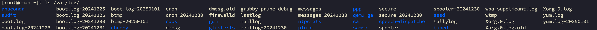
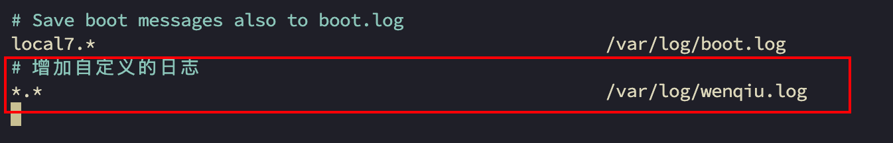
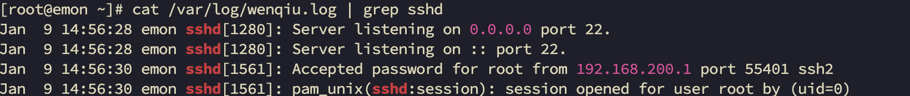
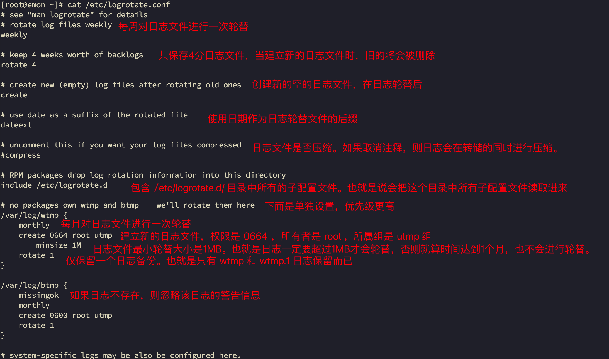

# 第16章 日志管理

- 基本介绍

1. 日志文件是重要的系统信息文件，其中记录了<span style="color:red;font-weight:bold;">重要的系统事件</span>
   ，包括用户的登录信息、系统的启动信息、系统的安全信息、邮箱相关信息、各种服务相关信息等。
2. 日志对于<span style="color:red;font-weight:bold;">安全来说也很重要</span>
   ，它记录了系统每天发生的各种事情，通过日志来检查错误发生的原因或者受到攻击时攻击者留下的痕迹。
3. 可以这样理解，日志是用来记录重大事件的工具。

## 18.1 系统常用的日志

`/var/log`目录就是系统日志文件的保存位置，如下图：

```bash
% ls /var/log/
```



- 系统常用的日志

| 日志文件                                                               | 说明                                                                                    |
|--------------------------------------------------------------------|---------------------------------------------------------------------------------------|
| <span style="color:red;font-weight:bold;">/var/log/boot.log</span> | 系统启动日志                                                                                |
| <span style="color:red;font-weight:bold;">/var/log/corn</span>     | 记录与系统定时任务相关的日志                                                                        |
| /var/log/cups/                                                     | 记录打印信息的日志                                                                             |
| /var/log/dmesg                                                     | 记录了系统在开机时内核自检的信息。也可以使用dmesg命令直接查看内核自检信息。                                              |
| /var/log/btmp                                                      | 记录错误登录的日志。这个文件是二进制文件，不能直接用vi查看，而要使用`lsatb`命令查看。                                       |
| <span style="color:red;font-weight:bold;">/var/log/lasllog</span>  | 记录系统中所有用户最后一次的登录时间的日志。这个文件也是二进制文件，要使用`lastlog`命令查看。                                   |
| <span style="color:red;font-weight:bold;">/var/log/mailog</span>   | 记录邮件信息的日志。                                                                            |
| <span style="color:red;font-weight:bold;">/var/log/message</span>  | 记录系统重要消息的日志，这个日志文件中会记录Linux系统的绝大多数重要信息。如果系统出现问题，首先要检查的应该就是这个日志文件。                     |
| <span style="color:red;font-weight:bold;">/var/log/secure</span>   | 记录验证和授权方面的信息，只要涉及账户和密码的程序都会记录，比如系统的登录、ssh的登录、su切换账户、sudo授权，甚至添加用户和修改用户密码都会记录在这个日志文件中。 |
| /var/log/wtmp                                                      | 永久记录所有用户的登录、注销信息，同时记录系统的启动、重启、关机事件。是二进制文件，需要使用`last`命令查看。                             |
| <span style="color:red;font-weight:bold;">/var/log/ulmp</span>     | 记录当前已经登录的用户的信息。这个文件会随着用户的登录和注销二不断变化，只记录当前登录用户的信息。这个文件不能用vi查看，而是要使用w、who、users等命令查看。   |

## 18.2 日志管理服务 rsyslogd

CentOS7.6日志服务是 rsyslogd，CentOS6.x日志服务是 syslogd。rsyslogd功能更强大。

rsyslogd的使用、日志文件的格式和syslogd服务兼容的。

- 查询Linux中的rsyslogd服务是否启动

```bash
% ps aux | grep "rsyslog" | grep -v "grep"
```

- 查询rsyslogd服务的自启动状态

```bash
% systemctl list-unit-files | grep rsyslog
```

- rsyslogd服务的配置文件

```bash
% cat /etc/rsyslog.conf | more
```

- 配置文件：/etc/rsyslog.conf

编辑文件时的格式为：`*.*` 存放日志文件

其中第一个`*`代表日志类型，第二个`*`代表日志级别。

1. 日志类型分为：

| 日志类型                 | 说明                         |
|----------------------|----------------------------|
| auth                 | pam产生的日志                   |
| authpriv             | ssh、ftp等登录信息的验证信息          |
| corn                 | 时间任务相关                     |
| kern                 | 内核                         |
| lpr                  | 打印                         |
| mail                 | 邮件                         |
| mark(syslog)-rsyslog | 服务内部的信息，时间标识               |
| news                 | 新闻组                        |
| user                 | 用户程序产生的相关信息                |
| uucp                 | unix to nuix copy主机之间相关的通信 |
| local 1-7            | 自定义的日志设备                   |

2. 日志级别分为

| 日志级别    | 说明                         |
|---------|----------------------------|
| debug   | 有调试信息的，日志通信最多              |
| info    | 一般日志信息，最常用                 |
| notice  | 最具有重要性的普通条件的信息             |
| warning | 警告级别                       |
| err     | 错误级别，阻止某个功能或者模块不能正常工作的信息   |
| crit    | 严重级别，阻止整个系统或者整个软件不能正常工作的信息 |
| alert   | 需要立刻修改的信息                  |
| emerg   | 内核崩溃等重要信息                  |
| none    | 什么都不记录                     |

注意：从上到下，级别从低到高，记录信息越来越少。

- 日志文件格式

由日志服务rsyslogd记录的日志文件，日志文件的格式包含以下4列。

1. 事件产生的时间

2. 产生时间的服务的主机名

3. 产生时间的服务名或程序名

4. 事件的具体信息

日志如何查看实例？

查看一下 `/var/log/secure` 日志，这个日志中记录的是用户验证和授权方面的信息，来分析如何查看。

## 18.3 自定义日志服务

在 /etc/rsyslog.conf 中添加一个日志文件 /var/log/wenqiu.log，当有事件发送时（比如sshd服务相关事件），该文件会接收到信息并保存。

```bash
% vim /etc/rsyslog.conf
```



重启系统，然后观察日志文件。

```bash
% reboot
```



## 18.4 自定义日志轮替

- 基本介绍

日志轮替就是把旧的日志文件移动并改名，同时建立新的空日志文件，当旧日志文件超出保存的范围之后，就会进行删除。

- 日志轮替文件命名

1. centos7使用logrotate进行日志轮替管理，要想改变日志轮替文件名字，通过 /etc/logrotate.conf 配置文件中“dateext”参数。
2. 如果配置文件中有“dateext”参数，那么日志会用<span style="color:red;font-weight:bold;">日期</span>
   来作为日志文件的后缀，例如：“secure-20201010“。这样日志文件名不会重叠，也就不需要日志文件的改名，只需要指定保存日志个数，删除多余的日志文件即可。
    3.
   如果配置文件中没有”dateext“参数，日志文件就需要进行改名了。当第一次进行日志轮替时，<span style="color:red;font-weight:bold;">
   当前的”secure“日志会自动改名为”scure.1“，然后新建”secure“日志，用来保存新的日志。</span>
   当第二次进行日志轮替时，”secure.1“会自动改名为”secure.2“，当前的”secure“日志会自动改名为”secure.1“，然后也会新建”secure“日志，用来保存新的日志，以此类推。



- 日志轮替参数说明

| 参数                      | 参数说明                                                                 |
|-------------------------|----------------------------------------------------------------------|
| daily                   | 日志的轮替周期是每天                                                           |
| weekly                  | 日志的轮替周期是每周                                                           |
| monthly                 | 日志的轮替周期是每月                                                           |
| copytruncate            | 用于还在打开中的日志文件，把当前日志备份并截断；是先拷贝再清空的方式，拷贝和清空之间有一个时间差，可能会丢失部分日志数据。        |
| nocopytruncate          | 备份日志文件不过不截断                                                          |
| rotate 数字               | 保留的日志文件的个数。0指没有备份                                                    |
| compress                | 日志轮替时，旧的日志进行压缩；通过gzip 压缩转储以后的日志                                      |
| nocompress              | 不做gzip压缩处理                                                           |
| delaycompress           | 和compress 一起使用时，转储的日志文件到下一次转储时才压缩                                    |
| nodelaycompress         | 覆盖 delaycompress 选项，转储同时压缩。                                          |
| create mode owner group | 建立新日志，同时指定新日志的权限与所有者和所属组                                             |
| mail address            | 当日志轮替时，输出内容通过邮件发送到指定的邮件地址                                            |
| nomail                  | 转储时不发送日志文件                                                           |
| olddir directory        | 转储后的日志文件放入指定的目录，必须和当前日志文件在同一个文件系统                                    |
| noolddir                | 转储后的日志文件和当前日志文件放在同一个目录下                                              |
| missingok               | 如果日志不存在，则忽略该日志的警告信息                                                  |
| ifempty                 | 即使日志文件为空文件也做轮转，这个是logrotate的缺省选项。                                    |
| notifempty              | 当日志文件为空时，不进行轮转                                                       |
| minsize 大小              | 日志轮替的最小值。也就是日志一定要达到这个最小值才会轮替，否则就算时间达到也不轮替                            |
| size 大小                 | 日志只有大于指定大小才进行日志轮替，而不是按照时间轮替。                                         |
| dateext                 | 使用日期作为日志轮替文件的后缀。                                                     |
| dateformat .%s          | 配合dateext使用，紧跟在下一行出现，定义文件切割后的文件名，必须配合dateext使用，只支持 %Y %m %d %s 这四个参数 |
| sharedscripts           | 运行postrotate脚本，作用是在所有日志都轮转后统一执行一次脚本。如果没有配置这个，那么每个日志轮转后都会执行一次脚本       |
| prerotate/endscript     | 在日志轮替之前执行脚本命令。                                                       |
| postrotate/endscript    | 在日志轮替之后执行脚本命令。                                                       |

- 把自己的日志加入日志轮替

第一种方法：直接在 /etc/logrotate.conf 配置文件中写入该日志的轮替策略。

第二种方法：在 /etc/logrotate.d/ 目录中新建立该日志的轮替文件，在该轮替文件中写入正确的轮替策略，因为该目录中的文件都会被”include“到主配置文件中，所以也可以把日志加入轮替。

推荐使用第二种方法，因为系统中需要轮替的日志非常多，如果全部直接写入 /etc/logrotate.conf 配置文件，那么这个文件的可管理性就会非常差，不利于此文件的维护。

```bash
% cat /etc/logrotate.d/wenqiulog 
```

```bash
/var/log/wenqiu.log
{
    missingok
    daily
    copytruncate
    rotate 7
    notifempty
}
```

## 18.5 日志轮替机制原理

日志轮替之所以可以在指定的时间备份日志，是依赖系统定时任务。在 /etc/cron.daily/目录 ，就会发现这个目录中是有 logrotate
文件（可执行），logrotate通过这个文件依赖定时任务执行的。

```bash
% ls -l /etc/cron.daily/
总用量 12
-rwx------. 1 root root 219 4月   1 2020 logrotate
-rwxr-xr-x. 1 root root 618 10月 30 2018 man-db.cron
-rwx------. 1 root root 208 4月  11 2018 mlocate
```

## 18.6 查看内存日志

- journalctl 可以查看内存日志，这里我们看看常用的指令

| 命令                                        | 说明                   |
|-------------------------------------------|----------------------|
| journalctl                                | 查看全部                 |
| journalctl -n 3                           | 查看最新3条               |
| journalctl --since 19:00 --until 19:10:10 | 查看起始时间到结束时间的日志       |
| journalctl -p err                         | 报错日志                 |
| journalctl -o verbose                     | 日志详细内容               |
| journalctl _PID=1245 _COMM=sshd           | 查看包含这些参数的日志（在详细日志查看） |
| journalctl \| grep sshd                   | 同上                   |

<span style="color:red;font-weight:bold;">注意：journalctl 查看的是内存日志，重启清空。</span>