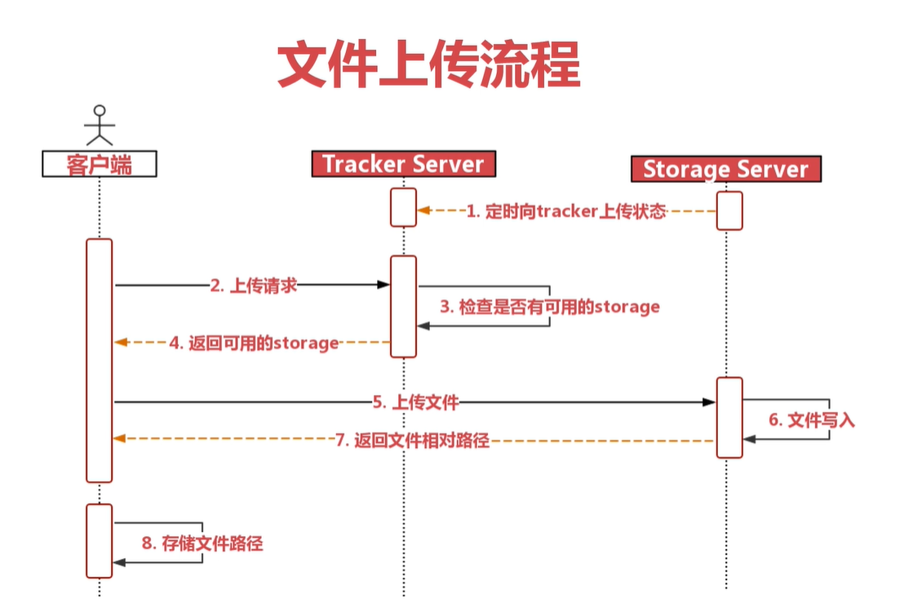
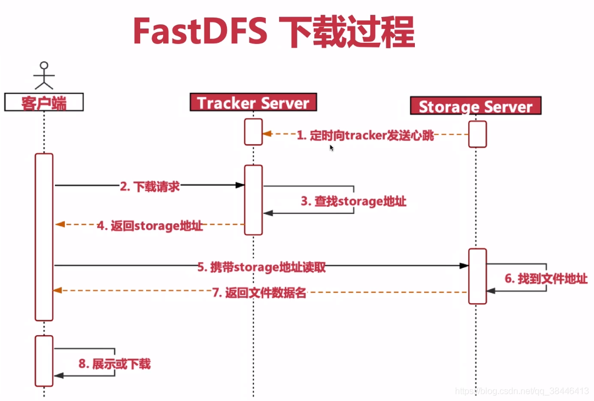

# 第44章 安装FastDFS

### 14.1、什么是FastDFS

​		FastDFS 是一个开源的分布式文件系统，它对文件进行管理，功能包括：文件存储、文件同步、文件访问（文件上传、文件下载）等，解决了大容量存储和负载均衡的问题。特别适合以文件为载体的在线服务，如相册网站、视频网站等等。

​		FastDFS 服务端有两个角色：跟踪器（tracker）和存储节点（storage）。跟踪器主要做调度工作，在访问上起负载均衡的作用。

- 常见术语
    - tracker：追踪者服务器，主要用于协调调度，可以起到负载均衡的作用，记录storage的相关状态信息。
    - storage：存储服务器，用于保存文件以及文件的元数据信息。
    - group：组，同组节点提供冗余备份，不同组用于扩容。
    - mata data：文件的元数据信息，比如长宽信息，图片后缀，视频的帧数等。
- 上传过程



- 下载过程



### 14.2、安装

#### 14.2.1、安装环境准备

```bash
$ yum list gcc libevent libevent-devel
$ yum install -y gcc libevent libevent-devel
```


- 下载安装文件

下载地址：https://sourceforge.net/projects/fastdfs/files/

1. 下载libfastcommon文件

https://github.com/happyfish100/libfastcommon/tags

libfastcommon-1.0.59.tar.gz

2. 下载fastdfs文件

https://github.com/happyfish100/fastdfs/tags

fastdfs-6.08.tar.gz

3. 下载fastdfs-nginx-module

下载地址：https://github.com/happyfish100/fastdfs-nginx-module/tags

fastdfs-nginx-module-1.22.tar.gz


#### 14.2.2、安装libfastcommon

```bash
$ mkdir /usr/local/FastDFS
$ tar -zxvf /usr/local/src/libfastcommon-1.0.59.tar.gz -C /usr/local/FastDFS/
$ cd /usr/local/FastDFS/libfastcommon-1.0.59/
$ ./make.sh
# 执行安装，会安装到/usr/lib64 、 /usr/lib 、 /usr/include/fastcommon
$ ./make.sh install
$ ll /usr/lib/libfast*
```

#### 14.2.3、安装fastdfs

```bash
$ tar -zxvf /usr/local/src/fastdfs-6.08.tar.gz -C /usr/local/FastDFS/
$ cd /usr/local/FastDFS/fastdfs-6.08/
$ ./make.sh
# 执行安装，会安装到/usr/bin 、 /etc/fdfs 、 /usr/lib64 、 /usr/lib
$ ./make.sh install
$ ll /usr/bin/fdfs*
$ ll /etc/fdfs/
# 拷贝文件
$ cp conf/* /etc/fdfs/
```

- 配置并启动tracker服务

```bash
$ vim /etc/fdfs/tracker.conf
```

```properties
# 修改
base_path = /home/yuqing/fastdfs => base_path = /fastdfs/tracker
```

```bash
# 创建目录
$ mkdir -pv /fastdfs/{tracker,storage,client,tmp}
# 启动
$ fdfs_trackerd /etc/fdfs/tracker.conf
# 重启
$ fdfs_trackerd /etc/fdfs/tracker.conf restart
# 查看状态
$ fdfs_trackerd /etc/fdfs/tracker.conf status
```

- 配置并启动storage服务

```bash
vim /etc/fdfs/storage.conf
```

```properties
# 修改
group_name = group1 => group_name = emon
# 修改
base_path = /home/yuqing/fastdfs => base_path = /fastdfs/storage
# 修改
store_path0 = /home/yuqing/fastdfs => store_path0 = /fastdfs/storage
# 修改
$ tracker_server = 192.168.209.121:22122 = >tracker_server = 192.168.32.116:22122
```

```bash
# 启动
$ fdfs_storaged /etc/fdfs/storage.conf
# 重启
$ fdfs_storaged /etc/fdfs/storage.conf restart
# 查看状态
$ fdfs_storaged /etc/fdfs/storage.conf status
```

- 配置并测试client

```bash
vim /etc/fdfs/client.conf
```

```properties
# 修改
base_path = /home/yuqing/fastdfs => base_path = /fastdfs/client
# 修改
tracker_server = 192.168.209.121:22122 = >tracker_server = 192.168.32.116:22122
```

```bash
# 上传测试
$ fdfs_test /etc/fdfs/client.conf upload zhuxiantoushibeijingtu.jpg
# 结果
# http://192.168.32.116/emon/M00/00/00/wKjIdGMA8k2AbLKjANyAzWMPc9A151.jpg
```

#### 14.2.4、安装fastdfs-nginx-module

```bash
$ tar -zxvf /usr/local/src/fastdfs-nginx-module-1.22.tar.gz -C /usr/local/FastDFS/
$ cd /usr/local/FastDFS/fastdfs-nginx-module-1.22/
# 编辑config文件,主要是修改路径，把local删除，因为fastdfs安装的时候我们没有修改路径，原路径是/usr
$ vim src/config
```

```bash
# 修改1
ngx_module_incs="/usr/local/include" => ngx_module_incs="/usr/include"
# 修改2
CORE_INCS="$CORE_INCS /usr/local/include" => CORE_INCS="$CORE_INCS /usr/include"
```

#### 14.2.5、安装Nginx

参考本文档中 `二、软件安装 ==> 7、安装Nginx`

注意几点：

1. 编译时追加 `--add-module=/usr/local/FastDFS/fastdfs-nginx-module-1.22/src`

```bash
$ ./configure --prefix=/usr/local/Nginx/nginx1.22.0 --with-http_ssl_module --add-module=/usr/local/FastDFS/fastdfs-nginx-module-1.22/src
```

2. 配置mod_fastdfs.conf

```bash
$ cp /usr/local/FastDFS/fastdfs-nginx-module-1.22/src/mod_fastdfs.conf /etc/fdfs/
$ vim /etc/fdfs/mod_fastdfs.conf
```

```properties
# 修改
base_path=/tmp => base_path = /fastdfs/tmp
# 修改
tracker_server=tracker:22122 = >tracker_server = 192.168.32.116:22122
# 修改
group_name = group1 => group_name = emon
# 修改 在url上拼接组名
url_have_group_name = false => url_have_group_name = true
# 修改
store_path0 = /home/yuqing/fastdfs => store_path0 = /fastdfs/storage
```

3. 配置nginx.conf

```bash
vim /usr/local/nginx/conf/vhost/fastdfs.conf
```

```nginx
server {
    listen 88;
    server_name 192.168.32.116;
    # 如果自己修改组名了，这块配自己修改的组名
    location /emon/M00 {
        ngx_fastdfs_module;
    }
}
```

```bash
# 对配置测试并启动
$ nginx -t -c /usr/local/nginx/conf/nginx.conf
$ nginx
# 访问
# http://192.168.32.116:88/emon/M00/00/00/wKjIdGMA8k2AbLKjANyAzWMPc9A151.jpg
```

4. Java客户端使用

原作者版本：https://github.com/happyfish100/fastdfs-client-java

淘宝版本：https://github.com/tobato/FastDFS_Client