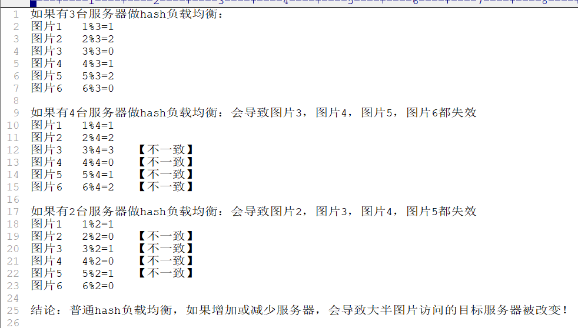

# 第9章 upstream负载均衡

## 3台tomcat演示upstream

- 配置Nginx的vhost

```bash
$ vim /usr/local/nginx/conf/vhost/tomcates_upstream.conf 
```

```bash
#配置上游服务器，weight=1是默认值，越大权重越高
upstream tomcats {
    server 127.0.0.1:8080;
    server 127.0.0.1:8080 weight=2;
    server 127.0.0.1:8080 weight=5;
}

server {
    listen 80;
    server_name www.tomcats.com;

    location / {
        proxy_pass http://tomcats;
    }
}

# 若需要增加路径，比如customPath
server {
    listen 80;
    server_name www.tomcats.com;

    location / {
        if ($request_uri ~/(.+)) {
        	set $P $1;
        }
        proxy_pass http://tomcats/customPath/$P;
    }
}
```

- 加载Nginx配置

```bash
$ sudo nginx -s reload
```

- 配置本地DNS

```bash
10.0.0.116		www.tomcats.com
```

其中，10.0.0.116是Nginx所在服务器的ip地址。

- 在浏览器访问

http://www.tomcats.com/


## upstream指令参数

指令参数包含：

- max_conns

  - 限制每台server的连接数，用于保护避免过载，可起到限流作用。
  - 默认值0，不限制

  ```bash
  upstream tomcats {
  	server 192.168.1.66:8080 max_conns=2;
      server 127.0.0.1:8080 max_conns=2;
      server 127.0.0.1:8080 max_conns=5;
  }
  ```

- slow_start

  - 注意：仅商业版付费可用；

  - 默认值0，表示关闭！在指定的时间里，逐步提高服务的权重，到配置的权重值。
  - 该参数不能使用`hash`和`random load balancing`中。
  - 如果在upstream中只有一台server，则该参数失效。

  ```bash
  #至少配置2个及以上的服务，才可用，普通版报错： nginx: [emerg] invalid parameter "slow_start=60s"
  upstream tomcats {
      server 192.168.1.66:8080 weight=6 slow_start=60s;
      server 127.0.0.1:8080 weight=2;
      server 127.0.0.1:8080 weight=2;
  }
  ```

- down

  - 用于标记服务节点不可用；

  ```bash
  upstream tomcats {
      server 192.168.1.66:8080 down;
      server 127.0.0.1:8080 weight=2;
      server 127.0.0.1:8080 weight=2;
  }
  ```

- backup

  - 表示当前服务器节点是备用机，只有在其他的服务器都宕机以后，自己才会加入到集群中，被用户访问到。

  - 该参数不能使用`hash`和`random load balancing`中。

  ```bash
  upstream tomcats {
      server 192.168.1.66:8080 backup;
      server 127.0.0.1:8080 weight=2;
      server 127.0.0.1:8080 weight=2;
  }
  ```

- max_fails 和 fail_timeout

  - max_fails：表示失败几次，则标记server已宕机，剔除上游服务。

  - fail_timeout：表示失败的重试时间。

    - 比如`max_fails=2 fail_timeout=15s`

    则代表在15秒内请求某一个server失败达到2次以后，则认为该server已经挂了或者宕机了，随后再过15秒，这15秒内不会有新的请求到达该服务，而是会请求到正常运作的server，15秒后会再有新请求尝试连接到挂掉的server，如果还是失败，重复上一个过程，直到恢复。

    也可描述为：限定时间内满足了最大失败次数，会断开为该服务提供请求；时间过后会再次派发请求，如果在新的限定时间内还是达到最大失败次数，会再次断开为该服务提供请求；如此循环往复！

  ```bash
  upstream tomcats {
      server 192.168.1.66:8080 max_fails=2 fail_timeout=1s;
      server 127.0.0.1:8080 weight=2;
      server 127.0.0.1:8080 weight=2;
  }
  ```


## Keepalived提高吞吐量

`keepalived`：设置长连接处理的数量

`proxy_http_version`：设置长连接http版本为1.1

`proxy_set_header`：清除connection header信息

```bash
upstream tomcats {
    server 127.0.0.1:8080;

    keepalive 32;
}

server {
    listen 80;
    server_name www.tomcats.com;

    location / {
        proxy_pass http://tomcats;

        proxy_http_version 1.1;
        proxy_set_header Connection "";
    }
}
```


## 负载均衡 ip_hash

**负载均衡ip_hash**

`ip_hash`可以保证用户访问可以请求到上游服务中的固定的服务器，前提是用户ip没有发生更改。

使用`ip_hash`的注意点：不能把后台服务器直接移除，只能标记 `down`。

```bash
upstream tomcats {
    ip_hash;

    server 127.0.0.1:8080;
    server 127.0.0.1:8080 down;
    server 127.0.0.1:8080;
}
```

普通hash负载均衡是有弊端的：



为了避免普通hash的缺点，可以采用一致性哈希算法。

## 一致性哈希算法

如果把对服务器的数量取模，变成对2^32取模，就可以避免由于服务器数量的变化，带来的影响了。

[一致性哈希算法的基本概念](https://www.zsythink.net/archives/1182)

## 负载均衡 url_hash

根据每次请求的url地址，hash后访问到固定的服务器节点。

```bash
upstream tomcats {
	# url hash
    hash $request_uri;

    server 127.0.0.1:8080;
    server 127.0.0.1:8080 down;
    server 127.0.0.1:8080;
}
```


## 负载均衡least_conn

least_conn会路由到当前最小链接的服务上。

```bash
upstream tomcats {
	# 最少连接数
	least_conn
	
    server 127.0.0.1:8080;
    server 127.0.0.1:8080 down;
    server 127.0.0.1:8080;
}
```
