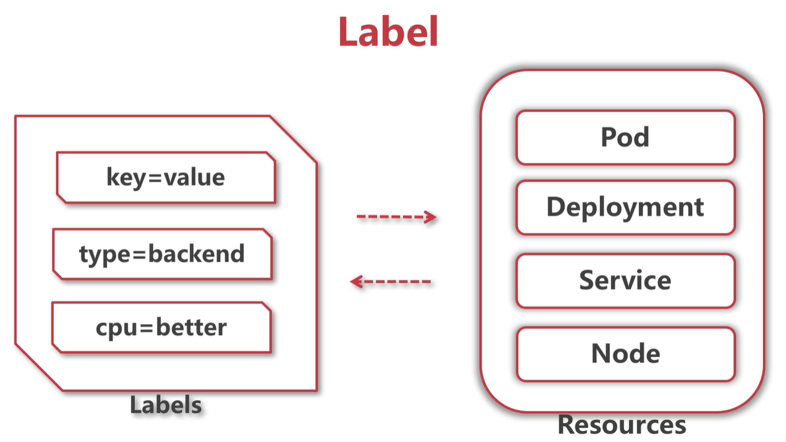

# 六、Kubernetes的服务发现


## 0、切换目录

```bash
$ cd
$ mkdir -pv k8s_soft/k8s_v1.20.2 && cd k8s_soft/k8s_v1.20.2
```

## 1、安装ingress-nginx

- 安装插件（master节点）

```bash
# 由于mandatory.yaml添加了 nodeSelector，对node进行了label选择，这里必须添加标签，否则：
# Warning  FailedScheduling  6m19s  default-scheduler  0/2 nodes are available: 2 node(s) didn't match Pod's node affinity.
$ kubectl label node emon3 app=ingress

# 配置资源
$ kubectl apply -f mandatory.yaml
# 查看
$ kubectl get all -n ingress-nginx
```

- 关于镜像：建议先下载，后执行上面的命令（worker节点）

```bash
# 镜像下载一直是老大难问题，先下载吧
# 查看所需镜像
$ grep image mandatory.yaml
# 手工下载所需镜像：注意第一个镜像本来应该是 k8s.gcr.io/defaultbackend-amd64:1.5
$ crictl pull registry.cn-hangzhou.aliyuncs.com/liuyi01/defaultbackend-amd64:1.5
$ crictl pull quay.io/kubernetes-ingress-controller/nginx-ingress-controller:0.19.0
# 对第一个镜像重新打标签才能使用
$ ctr -n k8s.io i tag registry.cn-hangzhou.aliyuncs.com/liuyi01/defaultbackend-amd64:1.5 k8s.gcr.io/defaultbackend-amd64:1.5
```

## 2、测试服务

### 2.1、ingress-demo.yaml配置

```yaml
#deploy
apiVersion: apps/v1
kind: Deployment
metadata:
  name: tomcat-demo
spec:
  selector:
    matchLabels:
      app: tomcat-demo
  replicas: 1
  template:
    metadata:
      labels:
        app: tomcat-demo
    spec:
      containers:
      - name: tomcat-demo
        image: registry.cn-hangzhou.aliyuncs.com/liuyi01/tomcat:8.0.51-alpine
        ports:
        - containerPort: 8080
---
#service
apiVersion: v1
kind: Service
metadata:
  name: tomcat-demo
spec:
  ports:
  - port: 80
    protocol: TCP
    targetPort: 8080
  selector:
    app: tomcat-demo

---
#ingress
#old version: extensions/v1beta1
apiVersion: networking.k8s.io/v1
kind: Ingress
metadata:
  name: tomcat-demo
spec:
  rules:
  - host: tomcat.mooc.com
    http:
      paths:
      - path: /
        pathType: Prefix
        backend:
          service:
            name: tomcat-demo
            port:
              number: 80
```

配置资源生效：

```bash
# 应用资源：仅创建并使用，可调整为 create -> apply  具有使用和创建并使用的效果
$ kubectl create -f ingress-demo.yaml
# 查看发现ingress启动在emon3上
$ kubectl get po -n ingress-nginx -o wide
# 查看ingress-demo的pod状态
$ kubectl get pod -o wide

# 配置本地DNS：访问emon3的DNS
$ vim /etc/hosts
192.168.32.118 tomcat.mooc.com
192.168.32.118 api.mooc.com

# 访问
http://tomcat.mooc.com # 看到正常tomcat界面
http://api.mooc.com # 看到 default backend - 404

# 删除资源
$  kubectl delete -f ingress-demo.yaml
```


## 99、配置附件

### 99.1、mandatory.yaml

```yaml
apiVersion: v1
kind: Namespace
metadata:
  name: ingress-nginx

---

apiVersion: apps/v1
kind: Deployment
metadata:
  name: default-http-backend
  labels:
    app.kubernetes.io/name: default-http-backend
    app.kubernetes.io/part-of: ingress-nginx
  namespace: ingress-nginx
spec:
  replicas: 1
  selector:
    matchLabels:
      app.kubernetes.io/name: default-http-backend
      app.kubernetes.io/part-of: ingress-nginx
  template:
    metadata:
      labels:
        app.kubernetes.io/name: default-http-backend
        app.kubernetes.io/part-of: ingress-nginx
    spec:
      terminationGracePeriodSeconds: 60
      containers:
        - name: default-http-backend
          # Any image is permissible as long as:
          # 1. It serves a 404 page at /
          # 2. It serves 200 on a /healthz endpoint
          image: k8s.gcr.io/defaultbackend-amd64:1.5
          livenessProbe:
            httpGet:
              path: /healthz
              port: 8080
              scheme: HTTP
            initialDelaySeconds: 30
            timeoutSeconds: 5
          ports:
            - containerPort: 8080
          resources:
            limits:
              cpu: 10m
              memory: 20Mi
            requests:
              cpu: 10m
              memory: 20Mi

---
apiVersion: v1
kind: Service
metadata:
  name: default-http-backend
  namespace: ingress-nginx
  labels:
    app.kubernetes.io/name: default-http-backend
    app.kubernetes.io/part-of: ingress-nginx
spec:
  ports:
    - port: 80
      targetPort: 8080
  selector:
    app.kubernetes.io/name: default-http-backend
    app.kubernetes.io/part-of: ingress-nginx

---

kind: ConfigMap
apiVersion: v1
metadata:
  name: nginx-configuration
  namespace: ingress-nginx
  labels:
    app.kubernetes.io/name: ingress-nginx
    app.kubernetes.io/part-of: ingress-nginx

---

kind: ConfigMap
apiVersion: v1
metadata:
  name: tcp-services
  namespace: ingress-nginx
  labels:
    app.kubernetes.io/name: ingress-nginx
    app.kubernetes.io/part-of: ingress-nginx

---

kind: ConfigMap
apiVersion: v1
metadata:
  name: udp-services
  namespace: ingress-nginx
  labels:
    app.kubernetes.io/name: ingress-nginx
    app.kubernetes.io/part-of: ingress-nginx

---

apiVersion: v1
kind: ServiceAccount
metadata:
  name: nginx-ingress-serviceaccount
  namespace: ingress-nginx
  labels:
    app.kubernetes.io/name: ingress-nginx
    app.kubernetes.io/part-of: ingress-nginx

---
apiVersion: rbac.authorization.k8s.io/v1
kind: ClusterRole
metadata:
  name: nginx-ingress-clusterrole
  labels:
    app.kubernetes.io/name: ingress-nginx
    app.kubernetes.io/part-of: ingress-nginx
rules:
  - apiGroups:
      - ""
    resources:
      - configmaps
      - endpoints
      - nodes
      - pods
      - secrets
    verbs:
      - list
      - watch
  - apiGroups:
      - ""
    resources:
      - nodes
    verbs:
      - get
  - apiGroups:
      - ""
    resources:
      - services
    verbs:
      - get
      - list
      - watch
  - apiGroups:
      - "extensions"
    resources:
      - ingresses
    verbs:
      - get
      - list
      - watch
  - apiGroups:
      - ""
    resources:
      - events
    verbs:
      - create
      - patch
  - apiGroups:
      - "extensions"
    resources:
      - ingresses/status
    verbs:
      - update

---
apiVersion: rbac.authorization.k8s.io/v1
kind: Role
metadata:
  name: nginx-ingress-role
  namespace: ingress-nginx
  labels:
    app.kubernetes.io/name: ingress-nginx
    app.kubernetes.io/part-of: ingress-nginx
rules:
  - apiGroups:
      - ""
    resources:
      - configmaps
      - pods
      - secrets
      - namespaces
    verbs:
      - get
  - apiGroups:
      - ""
    resources:
      - configmaps
    resourceNames:
      # Defaults to "<election-id>-<ingress-class>"
      # Here: "<ingress-controller-leader>-<nginx>"
      # This has to be adapted if you change either parameter
      # when launching the nginx-ingress-controller.
      - "ingress-controller-leader-nginx"
    verbs:
      - get
      - update
  - apiGroups:
      - ""
    resources:
      - configmaps
    verbs:
      - create
  - apiGroups:
      - ""
    resources:
      - endpoints
    verbs:
      - get

---
apiVersion: rbac.authorization.k8s.io/v1
kind: RoleBinding
metadata:
  name: nginx-ingress-role-nisa-binding
  namespace: ingress-nginx
  labels:
    app.kubernetes.io/name: ingress-nginx
    app.kubernetes.io/part-of: ingress-nginx
roleRef:
  apiGroup: rbac.authorization.k8s.io
  kind: Role
  name: nginx-ingress-role
subjects:
  - kind: ServiceAccount
    name: nginx-ingress-serviceaccount
    namespace: ingress-nginx

---
apiVersion: rbac.authorization.k8s.io/v1
kind: ClusterRoleBinding
metadata:
  name: nginx-ingress-clusterrole-nisa-binding
  labels:
    app.kubernetes.io/name: ingress-nginx
    app.kubernetes.io/part-of: ingress-nginx
roleRef:
  apiGroup: rbac.authorization.k8s.io
  kind: ClusterRole
  name: nginx-ingress-clusterrole
subjects:
  - kind: ServiceAccount
    name: nginx-ingress-serviceaccount
    namespace: ingress-nginx

---

apiVersion: apps/v1
kind: Deployment
metadata:
  name: nginx-ingress-controller
  namespace: ingress-nginx
  labels:
    app.kubernetes.io/name: ingress-nginx
    app.kubernetes.io/part-of: ingress-nginx
spec:
  replicas: 1
  selector:
    matchLabels:
      app.kubernetes.io/name: ingress-nginx
      app.kubernetes.io/part-of: ingress-nginx
  template:
    metadata:
      labels:
        app.kubernetes.io/name: ingress-nginx
        app.kubernetes.io/part-of: ingress-nginx
      annotations:
        prometheus.io/port: "10254"
        prometheus.io/scrape: "true"
    spec:
      serviceAccountName: nginx-ingress-serviceaccount
      hostNetwork: true
      nodeSelector:
        app: ingress
      containers:
        - name: nginx-ingress-controller
          image: quay.io/kubernetes-ingress-controller/nginx-ingress-controller:0.19.0
          args:
            - /nginx-ingress-controller
            - --default-backend-service=$(POD_NAMESPACE)/default-http-backend
            - --configmap=$(POD_NAMESPACE)/nginx-configuration
            - --tcp-services-configmap=$(POD_NAMESPACE)/tcp-services
            - --udp-services-configmap=$(POD_NAMESPACE)/udp-services
            - --publish-service=$(POD_NAMESPACE)/ingress-nginx
            - --annotations-prefix=nginx.ingress.kubernetes.io
          securityContext:
            capabilities:
              drop:
                - ALL
              add:
                - NET_BIND_SERVICE
            # www-data -> 33
            runAsUser: 33
          env:
            - name: POD_NAME
              valueFrom:
                fieldRef:
                  fieldPath: metadata.name
            - name: POD_NAMESPACE
              valueFrom:
                fieldRef:
                  fieldPath: metadata.namespace
          ports:
            - name: http
              containerPort: 80
            - name: https
              containerPort: 443
          livenessProbe:
            failureThreshold: 3
            httpGet:
              path: /healthz
              port: 10254
              scheme: HTTP
            initialDelaySeconds: 10
            periodSeconds: 10
            successThreshold: 1
            timeoutSeconds: 1
          readinessProbe:
            failureThreshold: 3
            httpGet:
              path: /healthz
              port: 10254
              scheme: HTTP
            periodSeconds: 10
            successThreshold: 1
            timeoutSeconds: 1

---
```

# 七、Namespace

## 0、切换目录

```bash
$ mkdir -pv /root/dockerdata/deep-in-kubernetes/1-namespace
$ cd /root/dockerdata/deep-in-kubernetes/1-namespace/
```

## 1、创建命名空间

- 创建yaml

```bash
vim namespace-dev.yaml
```

```yaml
apiVersion: v1
kind: Namespace
metadata:
  name: dev
```

- 应用yaml

```bash
$ kubectl create -f namespace-dev.yaml
# 查看命名空间
$ kubectl get namespaces
```

## 2、部署服务到命名空间

- 创建yaml

```bash
$ vim web-dev.yaml
```

```yaml
#deploy
apiVersion: apps/v1
kind: Deployment
metadata:
  name: sbt-web-demo
  namespace: dev
spec:
  selector:
    matchLabels:
      app: sbt-web-demo
  replicas: 1
  template:
    metadata:
      labels:
        app: sbt-web-demo
    spec:
      containers:
      - name: sbt-web-demo
        image: 192.168.32.116:5080/devops-learning/springboot-web-demo:latest
        ports:
        - containerPort: 8080
---
#service
apiVersion: v1
kind: Service
metadata:
  name: sbt-web-demo
  namespace: dev
spec:
  ports:
  - port: 80
    protocol: TCP
    targetPort: 8080
  selector:
    app: sbt-web-demo
  type: ClusterIP

---
#ingress
apiVersion: networking.k8s.io/v1
kind: Ingress
metadata:
  name: sbt-web-demo
  namespace: dev
spec:
  rules:
  - host: sbt-dev.emon.vip
    http:
      paths:
      - path: /
        pathType: Prefix
        backend:
          service: 
            name: sbt-web-demo
            port:
              number: 80
```

- 部署

如果部署成功，可访问：

http://sbt-dev.emon.vip/hello?name=emon

```bash
$ kubectl create -f web-dev.yaml
# 查看dev命名空间下内容
$ kubectl get all -n dev
# 查看deploy详情
$ kubectl get deploy sbt-web-demo -o yaml -n dev
```

## 3、命名空间特性

### 3.1、命名空间下通过服务名的访问规则

- 同一个命名空间下的pod通过服务名可以互相访问
- 不同命名空间下的pod通过服务名不可以互相访问

```bash
$ kubectl get pods -o wide
NAME                                      READY   STATUS    RESTARTS   AGE   IP               NODE    NOMINATED NODE   READINESS GATES
k8s-springboot-web-demo-7689b896d-pz9mh   1/1     Running   0          71m   10.200.108.119   emon2   <none>           <none>
tomcat-demo-54cbbcffdb-z9jl5              1/1     Running   0          22m   10.200.161.18    emon3   <none>           <none>

$ kubectl get pods -n dev
NAME                            READY   STATUS    RESTARTS   AGE
sbt-web-demo-756b64bb8b-qqp5x   1/1     Running   0          26m

# 查看解析规则：请注意 search default.svc.cluster.local 和 search dev.svc.cluster.local 的区别
$ kubectl exec -it k8s-springboot-web-demo-7689b896d-pz9mh -- cat /etc/resolv.conf
search default.svc.cluster.local svc.cluster.local cluster.local
nameserver 169.254.25.10
options ndots:5
$ kubectl exec -it sbt-web-demo-756b64bb8b-qqp5x -n dev -- cat /etc/resolv.conf
search dev.svc.cluster.local svc.cluster.local cluster.local
nameserver 169.254.25.10
options ndots:5
```

### 3.2、命名空间下通过IP的访问规则

- 不同命名空间下的service和pod通过IP是可以互相访问

```bash
$ kubectl get svc
NAME                      TYPE        CLUSTER-IP      EXTERNAL-IP   PORT(S)   AGE
k8s-springboot-web-demo   ClusterIP   10.233.31.78    <none>        80/TCP    11h
kubernetes                ClusterIP   10.233.0.1      <none>        443/TCP   3d22h
tomcat-demo               ClusterIP   10.233.60.100   <none>        80/TCP    14m
$ kubectl get svc -n dev
NAME           TYPE        CLUSTER-IP      EXTERNAL-IP   PORT(S)   AGE
sbt-web-demo   ClusterIP   10.233.175.91   <none>        80/TCP    29m

# dev命名空间下pod可以访问default命名空间下的tomcat-demo服务IP是通的
$ kubectl exec -it sbt-web-demo-756b64bb8b-qqp5x bash -n dev
# dev命名空间下pod访问default命名空间下的tomcat-demo的pods的IP也通
root@sbt-web-demo-756b64bb8b-qqp5x:/# wget 10.233.60.100
root@sbt-web-demo-756b64bb8b-qqp5x:/# wget 10.200.161.18:8080
```

## 4、调整用户的默认命名空间

- 备份`.kube/config`

```bash
$ cp .kube/config .kube/config.bak
```

- 调整admin用户的默认命名空间

```bash
# 设置上下文参数：写入并更新文件
$ kubectl config set-context ctx-dev \
  --cluster=kubernetes \
  --user=admin \
  --namespace=dev \
  --kubeconfig=/root/.kube/config
# 设置默认上下文
$ kubectl config use-context ctx-dev --kubeconfig=/root/.kube/config

# 复原
$ cp .kube/config.bak .kube/config
$ kubectl config use-context default --kubeconfig=/root/.kube/config


# 查看当前默认命名空间
$ kubectl config get-contexts
CURRENT   NAME      CLUSTER      AUTHINFO   NAMESPACE
*         default   kubernetes   admin 
```

## 5、命名空间划分方式

- 按环境划分：dev、test、prod
- 按团队划分
- 自定义多级划分
  - 第一级：环境
  - 第二级：团队

# 八、Resources

## 0、切换目录

```bash
$ mkdir -pv /root/dockerdata/deep-in-kubernetes/2-resource
$ cd /root/dockerdata/deep-in-kubernetes/2-resource
```

## 1、初识

- CPU
- GPU
- 内存
- 持久化存储


## 2、核心设计

- Requests：请求的资源
- Limits：限制的资源

## 3、部署服务

- 创建一个部署

```bash
$ vim web-dev.yaml
```

```yaml
#deploy
apiVersion: apps/v1
kind: Deployment
metadata:
  name: sbt-web-demo
  namespace: dev
spec:
  selector:
    matchLabels:
      app: sbt-web-demo
  replicas: 1
  template:
    metadata:
      labels:
        app: sbt-web-demo
    spec:
      containers:
      - name: sbt-web-demo
        image: 192.168.32.116:5080/devops-learning/k8s-springboot-web-demo:latest
        ports:
        - containerPort: 8080
        resources:
          requests:
            memory: 100Mi
            # 1核心的CPU=1000m
            cpu: 100m
          limits:
            memory: 100Mi
            cpu: 200m
---
#service
apiVersion: v1
kind: Service
metadata:
  name: sbt-web-demo
  namespace: dev
spec:
  ports:
  - port: 80
    protocol: TCP
    targetPort: 8080
  selector:
    app: sbt-web-demo
  type: ClusterIP

---
#ingress
apiVersion: networking.k8s.io/v1
kind: Ingress
metadata:
  name: sbt-web-demo
  namespace: dev
spec:
  rules:
  - host: sbt-dev.emon.vip
    http:
      paths:
      - path: /
        pathType: Prefix
        backend:
          service: 
            name: sbt-web-demo
            port:
              number: 80
```

- 部署

```bash
$ kubectl apply -f web-dev.yaml
# 查看dev命名空间下内容
$ kubectl get all -n dev
# 查看nodes
$ kubectl get nodes -n dev
# 查看节点上可用资源
$ kubectl describe node emon2 -n dev
```

## 4、Requests&Limits的设置与安全等级

- Requests==Limits：安全等级最高
- 不设置（不建议）
- Limits > Requests：比较可靠

### 4.0、创建test命名空间用于演示

```bash
$ kubectl create ns test
```

### 4.1、创建LimitRange：限制Pod和Container的内存和CPU

- 创建LimitRange

```bash
$ vim limits-test.yaml
```

```yaml
apiVersion: v1
kind: LimitRange
metadata:
  name: test-limits
spec:
  limits:
    - max:
        cpu: 4000m
        memory: 2Gi
      min:
        cpu: 100m
        memory: 100Mi
      maxLimitRequestRatio:
        cpu: 3
        memory: 2
      type: Pod
    - default:
        cpu: 300m
        memory: 200Mi
      defaultRequest:
        cpu: 200m
        memory: 100Mi
      max:
        cpu: 2000m
        memory: 1Gi
      min:
        cpu: 100m
        memory: 100Mi
      maxLimitRequestRatio:
        cpu: 5
        memory: 4
      type: Container
```

- 应用LimitRange

```bash
$ kubectl create -f limits-test.yaml -n test
# 查看test命名空间下的limits
$ kubectl describe limits -n test
Name:       test-limits
Namespace:  test
Type        Resource  Min    Max  Default Request  Default Limit  Max Limit/Request Ratio
----        --------  ---    ---  ---------------  -------------  -----------------------
Pod         memory    100Mi  2Gi  -                -              2
Pod         cpu       100m   4    -                -              3
Container   cpu       100m   2    200m             300m           5
Container   memory    100Mi  1Gi  100Mi            200Mi          4
```

### 4.2、测试LimitRange

- 创建一个部署

```bash
$ vim web-test.yaml
```

```yaml
#deploy
apiVersion: apps/v1
kind: Deployment
metadata:
  name: sbt-web-demo
  namespace: test
spec:
  selector:
    matchLabels:
      app: sbt-web-demo
  replicas: 1
  template:
    metadata:
      labels:
        app: sbt-web-demo
    spec:
      containers:
      - name: sbt-web-demo
        image: 192.168.32.116:5080/devops-learning/k8s-springboot-web-demo:latest
        ports:
        - containerPort: 8080
```

- 部署

```bash
$ kubectl apply -f web-test.yaml
# 查看dev命名空间下内容
$ kubectl get all -n test
# 查看部署
$ kubectl get deploy -n test
# 查看部署详情
$ kubectl get deploy -n test sbt-web-demo -o yaml
# 查看pods详情
$ kubectl get pods -n test sbt-web-demo-756b64bb8b-pmvmd -o yaml
```

- 调整部署资源

```bash
$ vim web-test.yaml
```

```yaml
#deploy
apiVersion: apps/v1
kind: Deployment
metadata:
  name: sbt-web-demo
  namespace: test
spec:
  selector:
    matchLabels:
      app: sbt-web-demo
  replicas: 1
  template:
    metadata:
      labels:
        app: sbt-web-demo
    spec:
      containers:
      - name: sbt-web-demo
        image: 192.168.32.116:5080/devops-learning/k8s-springboot-web-demo:latest
        ports:
        - containerPort: 8080
        # LimitRange超过限定
        resources:
          requests:
            memory: 100Mi
            # 1核心的CPU=1000m
            cpu: 100m
          limits:
            memory: 1000Mi
            cpu: 2000m
```

- 刷新部署

```bash
$ kubectl apply -f web-test.yaml
# 查看dev命名空间下内容
$ kubectl get all -n test
# 查看部署
$ kubectl get deploy -n test
# 查看部署状态
$ kubectl describe deploy -n test sbt-web-demo
# 查看部署详情：可以看到 message: 'pods "sbt-web-demo-dcc47d586-7wwbz" is forbidden: 
$ kubectl get deploy -n test sbt-web-demo -o yaml
# 查看pods详情
$ kubectl get pods -n test sbt-web-demo-756b64bb8b-pmvmd -o yaml
```


### 4.3、创建ResourceQuota：限制其他资源总量

#### 4.3.1、创建pod以及CPU与内存总配额

- 创建pod以及CPU与内存总配额

```bash
$ vim compute-resource.yaml
```

```yaml
apiVersion: v1
kind: ResourceQuota
metadata:
  name: resource-quota
spec:
  hard:
    pods: 4
    requests.cpu: 2000m
    requests.memory: 4Gi
    limits.cpu: 4000m
    limits.memory: 8Gi
```

#### 4.3.2、创建其他资源总配额

- 创建其他资源总配额

```bash
$ vim object-count.yaml
```

```yaml
apiVersion: v1
kind: ResourceQuota
metadata:
  name: object-counts
spec:
  hard:
    configmaps: 10
    persistentvolumeclaims: 4
    replicationcontrollers: 20
    secrets: 10
    services: 10
```

#### 4.3.3、应用与查看配额

```bash
$ kubectl apply -f compute-resource.yaml -n test
$ kubectl apply -f object-count.yaml -n test

$ kubectl get quota -n test
NAME             AGE   REQUEST                                                                                                      LIMIT
object-counts    77s   configmaps: 1/10, persistentvolumeclaims: 0/4, replicationcontrollers: 0/20, secrets: 1/10, services: 0/10   
resource-quota   83s   pods: 1/4, requests.cpu: 1/2, requests.memory: 500Mi/4Gi                                                     limits.cpu: 2/4, limits.memory: 1000Mi/8Gi
```

### 4.4、测试ResourceQuota

- 创建一个部署

```bash
$ vim web-test.yaml
```

```yaml
#deploy
apiVersion: apps/v1
kind: Deployment
metadata:
  name: sbt-web-demo
  namespace: test
spec:
  selector:
    matchLabels:
      app: sbt-web-demo
  replicas: 5
  template:
    metadata:
      labels:
        app: sbt-web-demo
    spec:
      containers:
      - name: sbt-web-demo
        image: 192.168.32.116:5080/devops-learning/k8s-springboot-web-demo:latest
        ports:
        - containerPort: 8080
        resources:
          requests:
            memory: 100Mi
            # 1核心的CPU=1000m
            cpu: 100m
          limits:
            memory: 100Mi
            cpu: 200m
```

- 部署

```bash
$ kubectl apply -f web-test.yaml
# 查看部署
$ kubectl get deploy -n test
# 查看部署详情
$ kubectl get deploy -n test sbt-web-demo -o yaml
# 查看quota
$ kubectl describe quota resource-quota -n test
Name:            resource-quota
Namespace:       test
Resource         Used    Hard
--------         ----    ----
limits.cpu       2600m   4
limits.memory    1300Mi  8Gi
pods             4       4
requests.cpu     1300m   2
requests.memory  800Mi   4Gi
```

## 4.5、Pod驱逐 - Eviction

### 4.5.1、常见驱逐策略配置

```bash
# 如果内存小于1.5Gi且持续1m30s以上
--eviction-soft=memory.availabel<1.5Gi
--eviction-soft-grace-period=memory.availabel=1m30s
# 如果内存小于100Mi或者磁盘小于1Gi或者inodes不足5%，立即驱逐
--eviction-hard=memory.availabel<100Mi,nodefs.availabel<1Gi,nodefs.inodesFree<5%
```

- 磁盘紧缺时处理逻辑

  - 删除死掉的pod、容器

  - 删除没用的镜像
  - 按优先级、资源占用情况驱逐pod

- 内存紧缺

  - 驱逐不可靠的pod
  - 驱逐基本可靠的pod
  - 驱逐可靠的pod

# 九、Label




## 9.0、切换目录

```bash
$ mkdir -pv /root/dockerdata/deep-in-kubernetes/3-label
$ cd /root/dockerdata/deep-in-kubernetes/3-label
```


## 9.1、演示标签的作用

- 创建一个部署

```bash
$ vim web-dev.yaml
```

```yaml
#deploy
apiVersion: apps/v1
kind: Deployment
metadata:
  name: sbt-web-demo
  namespace: dev
spec:
  selector:
    matchLabels:
      # 本 deploy只负责具有标签 app=sbt-web-demo 标签的pod
      app: sbt-web-demo
    matchExpressions:
      - {key: group, operator: In, values: [dev, test]}
  replicas: 1
  # 本 deploy 根据如下配置创建pod
  template:
    metadata:
      labels:
        group: dev
        app: sbt-web-demo
    spec:
      containers:
      - name: sbt-web-demo
        image: 192.168.32.116:5080/devops-learning/k8s-springboot-web-demo:latest
        ports:
        - containerPort: 8080
      # 选择指定 node 部署该 pod
      nodeSelector:
        disktype: ssd
---
#service
apiVersion: v1
kind: Service
metadata:
  name: sbt-web-demo
  namespace: dev
spec:
  ports:
  # service端口，即k8s中服务之间的访问端口
  - port: 80
    protocol: TCP
    # pod （也就是容器）端口
    targetPort: 8080
  selector:
    # 发现 app=sbt-web-demo 标签的pod
    app: sbt-web-demo
  type: ClusterIP

---
#ingress
apiVersion: networking.k8s.io/v1
kind: Ingress
metadata:
  name: sbt-web-demo
  namespace: dev
spec:
  rules:
  - host: sbt-dev.emon.vip
    http:
      paths:
      - path: /
        # 匹配类型：Prefix-前缀匹配，还有Exact-精确匹配
        pathType: Prefix
        backend:
          service: 
            name: sbt-web-demo
            port:
              number: 80
```

- 部署

```bash
$ kubectl apply -f web-dev.yaml
# 根据标签过滤pod
$ kubectl get pods -l group=dev -n dev
```

# 十、健康检查——高可用的守护者

## 10.0、切换目录

```bash
$ mkdir -pv /root/dockerdata/deep-in-kubernetes/4-health-check
$ cd /root/dockerdata/deep-in-kubernetes/4-health-check
```

## 10.1、CMD方式【SpringBoot不适用】

- 创建部署文件

```bash
$ vim web-dev-cmd.yaml
```

```bash
#deploy
apiVersion: apps/v1
kind: Deployment
metadata:
  name: sbt-web-demo
  namespace: dev
spec:
  selector:
    matchLabels:
      app: sbt-web-demo
  replicas: 1
  template:
    metadata:
      labels:
        app: sbt-web-demo
    spec:
      containers:
        - name: sbt-web-demo
          image: 192.168.32.116:5080/devops-learning/k8s-springboot-web-demo:latest
          ports:
            - containerPort: 8080
          # 存活状态检查
          livenessProbe:
            exec:
              command:
                - /bin/sh
                - -c
                - ps -ef|grep java|grep -v grep
            # pod 创建10s后启动第一次探测
            initialDelaySeconds: 10
            # 每隔10s启动一次探测
            periodSeconds: 10
            # 超时时间3s
            timeoutSeconds: 3
            # 成功1次即表示容器健康
            successThreshold: 1
            # 连续5次失败，则判定容器不健康，默认3次
            failureThreshold: 5
```


## 10.2、HTTP方式

- 创建部署文件

```bash
$ vim web-dev-http.yaml
```

```yaml
#deploy
apiVersion: apps/v1
kind: Deployment
metadata:
  name: sbt-web-demo
  namespace: dev
spec:
  selector:
    matchLabels:
      app: sbt-web-demo
  replicas: 1
  template:
    metadata:
      labels:
        app: sbt-web-demo
    spec:
      containers:
        - name: sbt-web-demo
          image: 192.168.32.116:5080/devops-learning/k8s-springboot-web-demo:latest
          ports:
            - containerPort: 8080
          # 存活状态检查
          livenessProbe:
            httpGet:
              path: /actuator/health/liveness
              port: 8080
              scheme: HTTP
            # pod 创建10s后启动第一次探测
            initialDelaySeconds: 10
            # 每隔10s启动一次探测
            periodSeconds: 10
            # 超时时间3s
            timeoutSeconds: 3
            # 成功1次即表示容器健康
            successThreshold: 1
            # 连续5次失败，则判定容器不健康，默认3次
            failureThreshold: 5
          # 就绪状态检查
          readinessProbe:
            httpGet:
              path: /actuator/health/readiness
              port: 8080
			  scheme: HTTP
            initialDelaySeconds: 10
            periodSeconds: 10
            timeoutSeconds: 3
```

- 部署

```bash
$ kubectl apply -f web-dev-cmd.yaml
# 查看pods列表
$ kubectl get pods -o wide -n dev
# 查看pods详情：多了Liveness 和 Readiness
$ kubectl describe pods sbt-web-demo-7cfcdddcc5-7ht6x -n dev
```

## 10.3、TCP方式【SpringBoot不适用】

- 创建部署文件

```bash
$ vim web-dev-tcp.yaml
```

```bash
#deploy
apiVersion: apps/v1
kind: Deployment
metadata:
  name: sbt-web-demo
  namespace: dev
spec:
  selector:
    matchLabels:
      app: sbt-web-demo
  replicas: 1
  template:
    metadata:
      labels:
        app: sbt-web-demo
    spec:
      containers:
        - name: sbt-web-demo
          image: 192.168.32.116:5080/devops-learning/k8s-springboot-web-demo:latest
          ports:
            - containerPort: 8080
          # 存活状态检查
          livenessProbe:
            tcpSocket:
              port: 8080
            # pod 创建10s后启动第一次探测
            initialDelaySeconds: 10
            # 每隔10s启动一次探测
            periodSeconds: 10
            # 超时时间3s
            timeoutSeconds: 3
            # 成功1次即表示容器健康
            successThreshold: 1
            # 连续5次失败，则判定容器不健康，默认3次
            failureThreshold: 5
```

# 十一、Scheduler


## 11.0、切换目录

```bash
$ mkdir -pv /root/dockerdata/deep-in-kubernetes/5-scheduler
$ cd /root/dockerdata/deep-in-kubernetes/5-scheduler
```

## 11.1、节点调度

- 创建部署文件

```bash
$ vim web-dev-node.yaml
```

```yaml
apiVersion: apps/v1
kind: Deployment
metadata:
  name: sbt-web-demo-node
  namespace: dev
spec:
  selector:
    matchLabels:
      app: sbt-web-demo-node
  replicas: 1
  template:
    metadata:
      labels:
        app: sbt-web-demo-node
    spec:
      containers:
        - name: sbt-web-demo-node
          image: 192.168.32.116:5080/devops-learning/k8s-springboot-web-demo:latest
          ports:
            - containerPort: 8080
      # 亲和性
      affinity:
        # 节点亲和性
        nodeAffinity:
          # 必须满足
          requiredDuringSchedulingIgnoredDuringExecution:
            nodeSelectorTerms:
              - matchExpressions:
                  - key: beta.kubernetes.io/arch
                    operator: In
                    values:
                      - amd64
          # 最好满足
          preferredDuringSchedulingIgnoredDuringExecution:
            - weight: 1
              preference:
                matchExpressions:
                  - key: disktype
                    operator: NotIn
                    values:
                      - ssd
```

- 部署

```bash
# 查看节点标签详情：发现emon2具有 disktype=ssd 标签
$ kubectl get node --show-labels
NAME    STATUS   ROLES    AGE     VERSION   LABELS
emon2   Ready    <none>   4d19h   v1.20.2   app=ingress,beta.kubernetes.io/arch=amd64,beta.kubernetes.io/os=linux,disktype=ssd,kubernetes.io/arch=amd64,kubernetes.io/hostname=emon2,kubernetes.io/os=linux
emon3   Ready    <none>   4d19h   v1.20.2   app=ingress,beta.kubernetes.io/arch=amd64,beta.kubernetes.io/os=linux,kubernetes.io/arch=amd64,kubernetes.io/hostname=emon3,kubernetes.io/os=linux

$ kubectl apply -f web-dev-node.yaml
# 查看pod部署到的节点：发现pod部署到了emon3节点
$ kubectl get pods -o wide -n dev
# 命令行输出结果
NAME                                 READY   STATUS    RESTARTS   AGE     IP              NODE    NOMINATED NODE   READINESS GATES
sbt-web-demo-node-74bdc75d4f-mhrfw   1/1     Running   0          1s      10.200.161.23   emon3   <none>           <none>
```

## 11.2、pod调度

- 创建部署文件

```bash
$ vim web-dev-pod.yaml
```

```bash
apiVersion: apps/v1
kind: Deployment
metadata:
  name: sbt-web-demo-pod
  namespace: dev
spec:
  selector:
    matchLabels:
      app: sbt-web-demo-pod
  replicas: 1
  template:
    metadata:
      labels:
        app: sbt-web-demo-pod
    spec:
      containers:
        - name: sbt-web-demo-pod
          image: 192.168.32.116:5080/devops-learning/k8s-springboot-web-demo:latest
          ports:
            - containerPort: 8080
      # 亲和性
      affinity:
        # pod亲和性：podAntiAffinity-反亲和性
        podAffinity:
          # 必须满足：这个pod和app=sbt-web-demo的pod运行在同一个节点上
          requiredDuringSchedulingIgnoredDuringExecution:
            - labelSelector:
                matchExpressions:
                  - key: app
                    operator: In
                    values:
                      - sbt-web-demo
              topologyKey: kubernetes.io/hostname
          # 最好满足
          preferredDuringSchedulingIgnoredDuringExecution:
            - weight: 100
              podAffinityTerm:
                labelSelector:
                  matchExpressions:
                    - key: app
                      operator: In
                      values:
                        - sbt-web-demo-node
                topologyKey: kubernetes.io/hostname
```

- 部署

```bash
$ kubectl apply -f web-dev-pod.yaml
# 查看pod部署到的节点：发现pod部署到了emon2节点，因为sbt-web-demo这个pod也在emon2节点
$ kubectl get pods -o wide -n dev
# 命令行输出结果
NAME                                 READY   STATUS    RESTARTS   AGE   IP              NODE    NOMINATED NODE   READINESS GATES
sbt-web-demo-7cfcdddcc5-ll89j        1/1     Running   0          8h    10.200.108.73   emon2   <none>           <none>
sbt-web-demo-node-74bdc75d4f-srf9f   1/1     Running   0          6m    10.200.161.24   emon3   <none>           <none>
sbt-web-demo-pod-cd78fb5cf-sglbj     1/1     Running   0          3s    10.200.108.75   emon2   <none>           <none>
```

## 11.3、taint调度（污点）

- 创建部署文件

```bash
$ vim web-dev-taint.yaml
```

```bash
apiVersion: apps/v1
kind: Deployment
metadata:
  name: sbt-web-demo-taint
  namespace: dev
spec:
  selector:
    matchLabels:
      app: sbt-web-demo-taint
  replicas: 2
  template:
    metadata:
      labels:
        app: sbt-web-demo-taint
    spec:
      containers:
        - name: sbt-web-demo-taint
          image: 192.168.32.116:5080/devops-learning/k8s-springboot-web-demo:latest
          ports:
            - containerPort: 8080
      tolerations:
        - key: "gpu"
          operator: "Equal"
          value: "true"
          effect: "NoSchedule"
```

- 部署

```bash
# 添加节点的污点：NoSchedule-不要调度；PreferNoSchedule-最好不要调度；NoExecute-不要调度，并驱逐该节点上的pod
$ kubectl taint nodes emon3 gpu=true:NoSchedule

$ kubectl apply -f web-dev-taint.yaml
# 查看pod部署到的节点：虽然emon3有污点，但副本2个pod，还是上了emon3了，对其选择了容忍
$ kubectl get pods -o wide -n dev
$  kubectl get pods -o wide -n dev
NAME                                  READY   STATUS    RESTARTS   AGE     IP              NODE    NOMINATED NODE   READINESS GATES
sbt-web-demo-taint-7d69cf4fff-pq8pf   1/1     Running   0          5s      10.200.108.83   emon2   <none>           <none>
sbt-web-demo-taint-7d69cf4fff-t95cx   1/1     Running   0          5s      10.200.161.33   emon3   <none>           <none>
```

# 十二、部署策略实践

## 12.0、切换目录

```bash
$ mkdir -pv /root/dockerdata/deep-in-kubernetes/6-deployment
$ cd /root/dockerdata/deep-in-kubernetes/6-deployment
```

## 12.1、滚动部署RollingUpdate：滚动更新【默认方式】

- 创建部署文件

```bash
$ vim web-rollingupdate.yaml
```

```bash
#deploy
apiVersion: apps/v1
kind: Deployment
metadata:
  name: sbt-web-rollingupdate
  namespace: dev
spec:
  strategy: # 默认策略是RollingUpdate，滚动配置是 maxSurge:25%和 maxUnavailable:25%
    rollingUpdate:
      # 最大超出服务实例数的百分比，如果有4个服务，25%表示最多只能超出1个示例；也可以设设置为数字，比如1表示最多1个超出
      maxSurge: 25%
      # 最大不可用服务实例数的百分比，如果有4个服务，至少有3个是可用的
      maxUnavailable: 25%
    type: RollingUpdate
  selector:
    matchLabels:
      app: sbt-web-rollingupdate
  replicas: 2
  template:
    metadata:
      labels:
        app: sbt-web-rollingupdate
    spec:
      containers:
        - name: sbt-web-rollingupdate
          image: 192.168.32.116:5080/devops-learning/springboot-web-demo:latest
          ports:
            - containerPort: 8080
          resources:
            requests:
              memory: 1024Mi
              cpu: 500m
            limits:
              memory: 2048Mi
              cpu: 2000m
          livenessProbe:
            tcpSocket:
              port: 8080
            initialDelaySeconds: 20
            periodSeconds: 10
            failureThreshold: 3
            successThreshold: 1
            timeoutSeconds: 5
          readinessProbe:
            httpGet:
              path: /hello?name=test
              port: 8080
              scheme: HTTP
            initialDelaySeconds: 20
            periodSeconds: 10
            failureThreshold: 1
            successThreshold: 1
            timeoutSeconds: 5
---
#service
apiVersion: v1
kind: Service
metadata:
  name: sbt-web-rollingupdate
  namespace: dev
spec:
  ports:
    - port: 80
      protocol: TCP
      targetPort: 8080
  selector:
    app: sbt-web-rollingupdate
  type: ClusterIP

---
#ingress
# apiVersion: extensions/v1beta1
apiVersion: networking.k8s.io/v1
kind: Ingress
metadata:
  name: sbt-web-rollingupdate
  namespace: dev
spec:
  rules:
    - host: sbt-web-rollingupdate.emon.vip
      http:
        paths:
          - path: /
            pathType: Prefix
            backend:
              service:
                name: sbt-web-rollingupdate
                port:
                  number: 80
```

- 部署

如果部署成功，可访问：

http://sbt-web-rollingupdate.emon.vip/hello?name=emon
```bash
$ kubectl apply -f web-rollingupdate.yaml
# 查看pods
$ kubectl get pods -o wide -n dev
# 暂停发布
$ kubectl rollout pause deploy sbt-web-rollingupdate -n dev
# 恢复发布
$ kubectl rollout resume deploy sbt-web-rollingupdate -n dev
# 回滚发布
$ kubectl rollout undo deploy sbt-web-rollingupdate -n dev
```

## 12.2、重建部署Recreate【使用场景不多】

- 创建部署文件

```bash
$ vim web-recreate.yaml
```

```yaml
#deploy
apiVersion: apps/v1
kind: Deployment
metadata:
  name: sbt-web-recreate
  namespace: dev
spec:
  strategy:
    type: Recreate
  selector:
    matchLabels:
      app: sbt-web-recreate
  replicas: 2
  template:
    metadata:
      labels:
        app: sbt-web-recreate
    spec:
      containers:
        - name: sbt-web-recreate
          image: 192.168.32.116:5080/devops-learning/springboot-web-demo:latest
          ports:
            - containerPort: 8080
          # 存活状态检查
          livenessProbe:
            httpGet:
              path: /actuator/health/liveness
              port: 8080
              scheme: HTTP
            # pod 创建10s后启动第一次探测
            initialDelaySeconds: 10
            # 每隔10s启动一次探测
            periodSeconds: 10
            # 超时时间3s
            timeoutSeconds: 3
            # 成功1次即表示容器健康
            successThreshold: 1
            # 连续5次失败，则判定容器不健康，默认3次
            failureThreshold: 5
          # 就绪状态检查
          readinessProbe:
            httpGet:
              path: /actuator/health/readiness
              port: 8080
			  scheme: HTTP
            initialDelaySeconds: 10
            periodSeconds: 10
            timeoutSeconds: 3
---
#service
apiVersion: v1
kind: Service
metadata:
  name: sbt-web-recreate
  namespace: dev
spec:
  ports:
    - port: 80
      protocol: TCP
      targetPort: 8080
  selector:
    app: sbt-web-recreate
  type: ClusterIP

---
#ingress
# apiVersion: extensions/v1beta1
apiVersion: networking.k8s.io/v1
kind: Ingress
metadata:
  name: sbt-web-recreate
  namespace: dev
spec:
  rules:
    - host: sbt-web-recreate.emon.vip
      http:
        paths:
          - path: /
            pathType: Prefix
            backend:
              service:
                name: sbt-web-recreate
                port:
                  number: 80
```

- 部署

如果部署成功，可访问：

http://sbt-web-recreate.emon.vip/hello?name=emon

```bash
$ kubectl apply -f web-recreate.yaml
# 查看pods
$ kubectl get pods -o wide -n dev
```

## 12.3、蓝绿部署

### 12.3.1、部署V1版本

- 创建部署文件

```bash
$ vim web-bluegreen.yaml
```

```yaml
#deploy
apiVersion: apps/v1
kind: Deployment
metadata:
  name: sbt-web-bluegreen-v1.0
  namespace: dev
spec:
  strategy:
    rollingUpdate:
      maxSurge: 25%
      maxUnavailable: 25%
    type: RollingUpdate
  selector:
    matchLabels:
      app: sbt-web-bluegreen
  replicas: 2
  template:
    metadata:
      labels:
        app: sbt-web-bluegreen
        version: v1.0
    spec:
      containers:
        - name: sbt-web-bluegreen
          image: 192.168.32.116:5080/devops-learning/springboot-web-demo:v1.0
          ports:
            - containerPort: 8080
          resources:
            requests:
              memory: 1024Mi
              cpu: 500m
            limits:
              memory: 2048Mi
              cpu: 2000m
          livenessProbe:
            tcpSocket:
              port: 8080
            initialDelaySeconds: 20
            periodSeconds: 10
            failureThreshold: 3
            successThreshold: 1
            timeoutSeconds: 5
          readinessProbe:
            httpGet:
              path: /hello?name=test
              port: 8080
              scheme: HTTP
            initialDelaySeconds: 20
            periodSeconds: 10
            failureThreshold: 1
            successThreshold: 1
            timeoutSeconds: 5
```

- 创建service文件

```bash
$ vim bluegreen-service.yaml
```

```yaml
---
#service
apiVersion: v1
kind: Service
metadata:
  name: sbt-web-bluegreen
  namespace: dev
spec:
  ports:
    - port: 80
      protocol: TCP
      targetPort: 8080
  selector:
    app: sbt-web-bluegreen
    version: v1.0
  type: ClusterIP

---
#ingress
# apiVersion: extensions/v1beta1
apiVersion: networking.k8s.io/v1
kind: Ingress
metadata:
  name: sbt-web-bluegreen
  namespace: dev
spec:
  rules:
    - host: sbt-web-bluegreen.emon.vip
      http:
        paths:
          - path: /
            pathType: Prefix
            backend:
              service:
                name: sbt-web-bluegreen
                port:
                  number: 80
```

- 部署

如果部署成功，可访问：

http://sbt-web-bluegreen.emon.vip/hello?name=emon
```bash
$ kubectl apply -f web-bluegreen.yaml
$ kubectl apply -f bluegreen-service.yaml
```

### 12.3.2、部署V2版本

- 调整部署文件

```bash
# 修改V1版本几处地方
$ vim web-bluegreen.yaml
```

```bash
# 第一处：Deployment名称
name: sbt-web-bluegreen-v1.0 
==> 
name: sbt-web-bluegreen-v2.0
# 第二次：Pod标签
version: v2.0
# 第三次：镜像版本
image: 192.168.32.116:5080/devops-learning/springboot-web-demo:v1.0
==>
image: 192.168.32.116:5080/devops-learning/springboot-web-demo:v2.0
```

- 调整service文件

```bash
# 修改V1版本几处地方
$ vim bluegreen-service.yaml
```

```bash
# 第一处：匹配的pod版本
version: v1.0
==>
version: v2.0
```

- 部署

如果部署成功，可访问：

http://sbt-web-bluegreen.emon.vip/hello?name=emon

```bash
$ kubectl apply -f web-bluegreen.yaml
$ kubectl apply -f bluegreen-service.yaml
```

## 12.4、金丝雀

在蓝绿部署基础上，调整service文件，去掉version: v2.0标签，重新发布service，得到的结果就是金丝雀发布！！！

# 十三、深入Pod【未完待续】

## 13.0、切换目录

```bash
$ mkdir -pv /root/dockerdata/deep-in-kubernetes/7-pod
$ cd /root/dockerdata/deep-in-kubernetes/7-pod
```

## 13.1、设计思想

- Pod是最小调度单位
- 本质还是容器的隔离
- Pause容器

# 13.2、network

- 创建部署文件

```bash
$ vim pod-network.yaml
```

```yaml
 apiVersion: v1
kind: Pod
metadata:
  name: pod-network
spec:
  containers:
    - name: sbt-v1
      image: 192.168.32.116:5080/devops-learning/springboot-web-demo:v1.0
      ports:
        - containerPort: 8080
    - name: sbt-v2
      image: 192.168.32.116:5080/devops-learning/springboot-web-demo:v2.0
      args: [ "--server.port=8081" ]
      ports:
        - containerPort: 8081
```

- 部署

```bash
$ kubectl apply -f pod-network.yaml
$ kubectl get pods -o wide
```

# 十四、深入Ingress-Nginx

## 14.0、切换目录

```bash
$ mkdir -pv /root/dockerdata/deep-in-kubernetes/8-ingress
$ cd /root/dockerdata/deep-in-kubernetes/8-ingress
```

## 14.1、重新安装Ingress-Nginx（调整Ingress-Nginx）

安装方式：DaemonSet

安装版本：0.23.0

- 安装之前删除旧的Ingress-Nginx

```bash
# 【重点】请先删除mandatory.yaml对应的资源
$ kubectl delete -f mandatory.yaml
```

- 调整mandatory.yaml

```bash
# 然后基于第六章，调整2处
$ vim /root/dockerdata/deep-in-kubernetes/8-ingress/mandatory.yaml
```

```yaml
apiVersion: v1
kind: Namespace
metadata:
  name: ingress-nginx

---

apiVersion: apps/v1
kind: Deployment
metadata:
  name: default-http-backend
  labels:
    app.kubernetes.io/name: default-http-backend
    app.kubernetes.io/part-of: ingress-nginx
  namespace: ingress-nginx
spec:
  replicas: 1
  selector:
    matchLabels:
      app.kubernetes.io/name: default-http-backend
      app.kubernetes.io/part-of: ingress-nginx
  template:
    metadata:
      labels:
        app.kubernetes.io/name: default-http-backend
        app.kubernetes.io/part-of: ingress-nginx
    spec:
      terminationGracePeriodSeconds: 60
      containers:
        - name: default-http-backend
          # Any image is permissible as long as:
          # 1. It serves a 404 page at /
          # 2. It serves 200 on a /healthz endpoint
          image: k8s.gcr.io/defaultbackend-amd64:1.5
          livenessProbe:
            httpGet:
              path: /healthz
              port: 8080
              scheme: HTTP
            initialDelaySeconds: 30
            timeoutSeconds: 5
          ports:
            - containerPort: 8080
          resources:
            limits:
              cpu: 10m
              memory: 20Mi
            requests:
              cpu: 10m
              memory: 20Mi

---
apiVersion: v1
kind: Service
metadata:
  name: default-http-backend
  namespace: ingress-nginx
  labels:
    app.kubernetes.io/name: default-http-backend
    app.kubernetes.io/part-of: ingress-nginx
spec:
  ports:
    - port: 80
      targetPort: 8080
  selector:
    app.kubernetes.io/name: default-http-backend
    app.kubernetes.io/part-of: ingress-nginx

---

kind: ConfigMap
apiVersion: v1
metadata:
  name: nginx-configuration
  namespace: ingress-nginx
  labels:
    app.kubernetes.io/name: ingress-nginx
    app.kubernetes.io/part-of: ingress-nginx

---

kind: ConfigMap
apiVersion: v1
metadata:
  name: tcp-services
  namespace: ingress-nginx
  labels:
    app.kubernetes.io/name: ingress-nginx
    app.kubernetes.io/part-of: ingress-nginx

---

kind: ConfigMap
apiVersion: v1
metadata:
  name: udp-services
  namespace: ingress-nginx
  labels:
    app.kubernetes.io/name: ingress-nginx
    app.kubernetes.io/part-of: ingress-nginx

---

apiVersion: v1
kind: ServiceAccount
metadata:
  name: nginx-ingress-serviceaccount
  namespace: ingress-nginx
  labels:
    app.kubernetes.io/name: ingress-nginx
    app.kubernetes.io/part-of: ingress-nginx

---
apiVersion: rbac.authorization.k8s.io/v1
kind: ClusterRole
metadata:
  name: nginx-ingress-clusterrole
  labels:
    app.kubernetes.io/name: ingress-nginx
    app.kubernetes.io/part-of: ingress-nginx
rules:
  - apiGroups:
      - ""
    resources:
      - configmaps
      - endpoints
      - nodes
      - pods
      - secrets
    verbs:
      - list
      - watch
  - apiGroups:
      - ""
    resources:
      - nodes
    verbs:
      - get
  - apiGroups:
      - ""
    resources:
      - services
    verbs:
      - get
      - list
      - watch
  - apiGroups:
      - "extensions"
    resources:
      - ingresses
    verbs:
      - get
      - list
      - watch
  - apiGroups:
      - ""
    resources:
      - events
    verbs:
      - create
      - patch
  - apiGroups:
      - "extensions"
    resources:
      - ingresses/status
    verbs:
      - update

---
apiVersion: rbac.authorization.k8s.io/v1
kind: Role
metadata:
  name: nginx-ingress-role
  namespace: ingress-nginx
  labels:
    app.kubernetes.io/name: ingress-nginx
    app.kubernetes.io/part-of: ingress-nginx
rules:
  - apiGroups:
      - ""
    resources:
      - configmaps
      - pods
      - secrets
      - namespaces
    verbs:
      - get
  - apiGroups:
      - ""
    resources:
      - configmaps
    resourceNames:
      # Defaults to "<election-id>-<ingress-class>"
      # Here: "<ingress-controller-leader>-<nginx>"
      # This has to be adapted if you change either parameter
      # when launching the nginx-ingress-controller.
      - "ingress-controller-leader-nginx"
    verbs:
      - get
      - update
  - apiGroups:
      - ""
    resources:
      - configmaps
    verbs:
      - create
  - apiGroups:
      - ""
    resources:
      - endpoints
    verbs:
      - get

---
apiVersion: rbac.authorization.k8s.io/v1
kind: RoleBinding
metadata:
  name: nginx-ingress-role-nisa-binding
  namespace: ingress-nginx
  labels:
    app.kubernetes.io/name: ingress-nginx
    app.kubernetes.io/part-of: ingress-nginx
roleRef:
  apiGroup: rbac.authorization.k8s.io
  kind: Role
  name: nginx-ingress-role
subjects:
  - kind: ServiceAccount
    name: nginx-ingress-serviceaccount
    namespace: ingress-nginx

---
apiVersion: rbac.authorization.k8s.io/v1
kind: ClusterRoleBinding
metadata:
  name: nginx-ingress-clusterrole-nisa-binding
  labels:
    app.kubernetes.io/name: ingress-nginx
    app.kubernetes.io/part-of: ingress-nginx
roleRef:
  apiGroup: rbac.authorization.k8s.io
  kind: ClusterRole
  name: nginx-ingress-clusterrole
subjects:
  - kind: ServiceAccount
    name: nginx-ingress-serviceaccount
    namespace: ingress-nginx

---

apiVersion: apps/v1
# 第一处：调整 Deployment ==> DaemonSet
kind: DaemonSet
metadata:
  name: nginx-ingress-controller
  namespace: ingress-nginx
  labels:
    app.kubernetes.io/name: ingress-nginx
    app.kubernetes.io/part-of: ingress-nginx
spec:
  selector:
    matchLabels:
      app.kubernetes.io/name: ingress-nginx
      app.kubernetes.io/part-of: ingress-nginx
  template:
    metadata:
      labels:
        app.kubernetes.io/name: ingress-nginx
        app.kubernetes.io/part-of: ingress-nginx
      annotations:
        prometheus.io/port: "10254"
        prometheus.io/scrape: "true"
    spec:
      serviceAccountName: nginx-ingress-serviceaccount
      hostNetwork: true
      nodeSelector:
        app: ingress
      containers:
        - name: nginx-ingress-controller
          # 第二处：调整 0.19.0 ==> 0.23.0
          image: quay.io/kubernetes-ingress-controller/nginx-ingress-controller:0.23.0
          args:
            - /nginx-ingress-controller
            - --default-backend-service=$(POD_NAMESPACE)/default-http-backend
            - --configmap=$(POD_NAMESPACE)/nginx-configuration
            - --tcp-services-configmap=$(POD_NAMESPACE)/tcp-services
            - --udp-services-configmap=$(POD_NAMESPACE)/udp-services
            - --publish-service=$(POD_NAMESPACE)/ingress-nginx
            - --annotations-prefix=nginx.ingress.kubernetes.io
          securityContext:
            capabilities:
              drop:
                - ALL
              add:
                - NET_BIND_SERVICE
            # www-data -> 33
            runAsUser: 33
          env:
            - name: POD_NAME
              valueFrom:
                fieldRef:
                  fieldPath: metadata.name
            - name: POD_NAMESPACE
              valueFrom:
                fieldRef:
                  fieldPath: metadata.namespace
          ports:
            - name: http
              containerPort: 80
            - name: https
              containerPort: 443
          livenessProbe:
            failureThreshold: 3
            httpGet:
              path: /healthz
              port: 10254
              scheme: HTTP
            initialDelaySeconds: 10
            periodSeconds: 10
            successThreshold: 1
            timeoutSeconds: 1
          readinessProbe:
            failureThreshold: 3
            httpGet:
              path: /healthz
              port: 10254
              scheme: HTTP
            periodSeconds: 10
            successThreshold: 1
            timeoutSeconds: 1

---
```

- 部署

```bash
$  kubectl apply -f mandatory.yaml

# 查看deploy的部署信息
$ kubectl get ds -n ingress-nginx
# 查看pods
$ kubectl get pods -n ingress-nginx -o wide
# 获取 ConfigMap 配置列表
$ kubectl get cm -n ingress-nginx
# 命令行输出结果
NAME                              DATA   AGE
ingress-controller-leader-nginx   0      3d21h
kube-root-ca.crt                  1      3d21h
nginx-configuration               0      3d21h
tcp-services                      1      3d21h
udp-services                      0      3d21h
# 获取 ConfigMap 配置数据情况
$ kubectl get cm -n ingress-nginx tcp-services
# 获取 ConfigMap 配置数据情况，yaml格式
$ kubectl get cm -n ingress-nginx tcp-services -o yaml
```

## 14.2、四层代理(对应cm=tcp-services）

- 创建部署文件

```bash
$ vim tcp-config.yaml
```

```yaml
apiVersion: v1
kind: ConfigMap
metadata:
  name: tcp-services
  namespace: ingress-nginx
# 配置要暴露四层代理的服务  
data:
  "30000": dev/sbt-web-demo:80
```

- 部署

如果部署成功，可访问：

http://sbt-web-bluegreen.emon.vip/hello?name=emon

http://sbt-web-bluegreen.emon.vip:30000/hello?name=emon

```bash
# =====在master节点所在服务器=====
$ kubectl apply -f tcp-config.yaml
# 查看服务的yaml详情
$ kubectl get svc -n dev sbt-web-demo -o yaml

# =====在 nginx-ingress-controller 节点所在服务器=====
# 查看 nginx-ingress-controller 所在服务器是否有30000端口暴露出来
$ netstat -tnlp|grep 30000

# 查看 nginx-ingress-controller 容器ID
$ crictl ps|grep nginx-ingress-controller 
# 进入 nginx-ingress-controller 容器
$ crictl exec -it <containerId> /bin/bash
# 查看在容器内nginx实际配置文件位置为 /etc/nginx/nginx.conf
www-data@emon3:/etc/nginx$ more /etc/nginx/nginx.conf
```

## 14.3、Ingress-Nginx配置文件

### 14.3.1、基本专属配置演示

- 创建部署文件

data的可配置下参考：https://kubernetes.github.io/ingress-nginx/user-guide/nginx-configuration/configmap/

```bash
$ vim nginx-config.yaml
```

```yaml
kind: ConfigMap
apiVersion: v1
metadata:
  name: nginx-configuration
  namespace: ingress-nginx
  labels:
    app: ingress-nginx
data:
  proxy-body-size: "64m"
  proxy-read-timeout: "180"
  proxy-send-timeout: "180"
```

- 部署

```bash
# 配置后可在 nginx-ingress-controller 容器中对应的nginx配置文件查看到
$ kubectl apply -f nginx-config.yaml
```

### 14.3.2、全局配置

- 创建部署文件

```bash
$ vim custom-header-global.yaml
```

```yaml
apiVersion: v1
kind: ConfigMap
data:
  # ingress-nginx/custom-headers:表示把 ingress-nginx 下面的名字为 custom-headers 的配置内容引入作为header设置
  proxy-set-headers: "ingress-nginx/custom-headers"
metadata:
  name: nginx-configuration
  namespace: ingress-nginx
  labels:
    app.kubernetes.io/name: ingress-nginx
    app.kubernetes.io/part-of: ingress-nginx
---
apiVersion: v1
kind: ConfigMap
data:
  X-Different-Name: "true"
  X-Request-Start: t=${msec}
  X-Using-Nginx-Controller: "true"
metadata:
  name: custom-headers
  namespace: ingress-nginx
```

- 部署

```bash
$ kubectl apply -f custom-header-global.yaml
```

### 14.3.3、专属配置

- 创建部署文件

```bash
$ vim custom-header-spec-ingress.yaml
```

```yaml
# apiVersion: extensions/v1beta1
apiVersion: networking.k8s.io/v1
kind: Ingress
metadata:
  annotations:
    nginx.ingress.kubernetes.io/configuration-snippet: |
      more_set_headers "Request-Id: $req_id";
  name: sbt-web-demo
  namespace: dev
# 该配置仅在 sbt-dev.emon.vip 下生效
spec:
  rules:
    - host: sbt-dev.emon.vip
      http:
        paths:
          - path: /
            pathType: Prefix
            backend:
              service:
                name: sbt-web-demo
                port:
                  number: 80
```

- 部署

```bash
$ kubectl apply -f custom-header-spec-ingress.yaml
```

### 14.3.4、自定义Nginx模板（调整Ingress-Nginx）

参考：https://kubernetes.github.io/ingress-nginx/user-guide/nginx-configuration/custom-template/

- 调整mandatory.yaml

```bash
# 然后基于 14.1 ，调整2处
$ vim /root/dockerdata/deep-in-kubernetes/8-ingress/mandatory.yaml
```

```yaml
apiVersion: v1
kind: Namespace
metadata:
  name: ingress-nginx

---

apiVersion: apps/v1
kind: Deployment
metadata:
  name: default-http-backend
  labels:
    app.kubernetes.io/name: default-http-backend
    app.kubernetes.io/part-of: ingress-nginx
  namespace: ingress-nginx
spec:
  replicas: 1
  selector:
    matchLabels:
      app.kubernetes.io/name: default-http-backend
      app.kubernetes.io/part-of: ingress-nginx
  template:
    metadata:
      labels:
        app.kubernetes.io/name: default-http-backend
        app.kubernetes.io/part-of: ingress-nginx
    spec:
      terminationGracePeriodSeconds: 60
      containers:
        - name: default-http-backend
          # Any image is permissible as long as:
          # 1. It serves a 404 page at /
          # 2. It serves 200 on a /healthz endpoint
          image: k8s.gcr.io/defaultbackend-amd64:1.5
          livenessProbe:
            httpGet:
              path: /healthz
              port: 8080
              scheme: HTTP
            initialDelaySeconds: 30
            timeoutSeconds: 5
          ports:
            - containerPort: 8080
          resources:
            limits:
              cpu: 10m
              memory: 20Mi
            requests:
              cpu: 10m
              memory: 20Mi

---
apiVersion: v1
kind: Service
metadata:
  name: default-http-backend
  namespace: ingress-nginx
  labels:
    app.kubernetes.io/name: default-http-backend
    app.kubernetes.io/part-of: ingress-nginx
spec:
  ports:
    - port: 80
      targetPort: 8080
  selector:
    app.kubernetes.io/name: default-http-backend
    app.kubernetes.io/part-of: ingress-nginx

---

kind: ConfigMap
apiVersion: v1
metadata:
  name: nginx-configuration
  namespace: ingress-nginx
  labels:
    app.kubernetes.io/name: ingress-nginx
    app.kubernetes.io/part-of: ingress-nginx

---

kind: ConfigMap
apiVersion: v1
metadata:
  name: tcp-services
  namespace: ingress-nginx
  labels:
    app.kubernetes.io/name: ingress-nginx
    app.kubernetes.io/part-of: ingress-nginx

---

kind: ConfigMap
apiVersion: v1
metadata:
  name: udp-services
  namespace: ingress-nginx
  labels:
    app.kubernetes.io/name: ingress-nginx
    app.kubernetes.io/part-of: ingress-nginx

---

apiVersion: v1
kind: ServiceAccount
metadata:
  name: nginx-ingress-serviceaccount
  namespace: ingress-nginx
  labels:
    app.kubernetes.io/name: ingress-nginx
    app.kubernetes.io/part-of: ingress-nginx

---
apiVersion: rbac.authorization.k8s.io/v1
kind: ClusterRole
metadata:
  name: nginx-ingress-clusterrole
  labels:
    app.kubernetes.io/name: ingress-nginx
    app.kubernetes.io/part-of: ingress-nginx
rules:
  - apiGroups:
      - ""
    resources:
      - configmaps
      - endpoints
      - nodes
      - pods
      - secrets
    verbs:
      - list
      - watch
  - apiGroups:
      - ""
    resources:
      - nodes
    verbs:
      - get
  - apiGroups:
      - ""
    resources:
      - services
    verbs:
      - get
      - list
      - watch
  - apiGroups:
      - "extensions"
    resources:
      - ingresses
    verbs:
      - get
      - list
      - watch
  - apiGroups:
      - ""
    resources:
      - events
    verbs:
      - create
      - patch
  - apiGroups:
      - "extensions"
    resources:
      - ingresses/status
    verbs:
      - update

---
apiVersion: rbac.authorization.k8s.io/v1
kind: Role
metadata:
  name: nginx-ingress-role
  namespace: ingress-nginx
  labels:
    app.kubernetes.io/name: ingress-nginx
    app.kubernetes.io/part-of: ingress-nginx
rules:
  - apiGroups:
      - ""
    resources:
      - configmaps
      - pods
      - secrets
      - namespaces
    verbs:
      - get
  - apiGroups:
      - ""
    resources:
      - configmaps
    resourceNames:
      # Defaults to "<election-id>-<ingress-class>"
      # Here: "<ingress-controller-leader>-<nginx>"
      # This has to be adapted if you change either parameter
      # when launching the nginx-ingress-controller.
      - "ingress-controller-leader-nginx"
    verbs:
      - get
      - update
  - apiGroups:
      - ""
    resources:
      - configmaps
    verbs:
      - create
  - apiGroups:
      - ""
    resources:
      - endpoints
    verbs:
      - get

---
apiVersion: rbac.authorization.k8s.io/v1
kind: RoleBinding
metadata:
  name: nginx-ingress-role-nisa-binding
  namespace: ingress-nginx
  labels:
    app.kubernetes.io/name: ingress-nginx
    app.kubernetes.io/part-of: ingress-nginx
roleRef:
  apiGroup: rbac.authorization.k8s.io
  kind: Role
  name: nginx-ingress-role
subjects:
  - kind: ServiceAccount
    name: nginx-ingress-serviceaccount
    namespace: ingress-nginx

---
apiVersion: rbac.authorization.k8s.io/v1
kind: ClusterRoleBinding
metadata:
  name: nginx-ingress-clusterrole-nisa-binding
  labels:
    app.kubernetes.io/name: ingress-nginx
    app.kubernetes.io/part-of: ingress-nginx
roleRef:
  apiGroup: rbac.authorization.k8s.io
  kind: ClusterRole
  name: nginx-ingress-clusterrole
subjects:
  - kind: ServiceAccount
    name: nginx-ingress-serviceaccount
    namespace: ingress-nginx

---

apiVersion: apps/v1
kind: DaemonSet
metadata:
  name: nginx-ingress-controller
  namespace: ingress-nginx
  labels:
    app.kubernetes.io/name: ingress-nginx
    app.kubernetes.io/part-of: ingress-nginx
spec:
  selector:
    matchLabels:
      app.kubernetes.io/name: ingress-nginx
      app.kubernetes.io/part-of: ingress-nginx
  template:
    metadata:
      labels:
        app.kubernetes.io/name: ingress-nginx
        app.kubernetes.io/part-of: ingress-nginx
      annotations:
        prometheus.io/port: "10254"
        prometheus.io/scrape: "true"
    spec:
      serviceAccountName: nginx-ingress-serviceaccount
      hostNetwork: true
      nodeSelector:
        app: ingress
	  # 第一处：调整 Deployment ==> DaemonSet
      volumes:
        - name: nginx-template-volume
          configMap:
            name: nginx-template
            items:
            - key: nginx.tmpl
              path: nginx.tmpl
      containers:
        - name: nginx-ingress-controller
          image: quay.io/kubernetes-ingress-controller/nginx-ingress-controller:0.23.0
          # 第二处：增加 volumeMounts
          volumeMounts:
            - mountPath: /etc/nginx/template
              name: nginx-template-volume
              readOnly: true
          args:
            - /nginx-ingress-controller
            - --default-backend-service=$(POD_NAMESPACE)/default-http-backend
            - --configmap=$(POD_NAMESPACE)/nginx-configuration
            - --tcp-services-configmap=$(POD_NAMESPACE)/tcp-services
            - --udp-services-configmap=$(POD_NAMESPACE)/udp-services
            - --publish-service=$(POD_NAMESPACE)/ingress-nginx
            - --annotations-prefix=nginx.ingress.kubernetes.io
          securityContext:
            capabilities:
              drop:
                - ALL
              add:
                - NET_BIND_SERVICE
            # www-data -> 33
            runAsUser: 33
          env:
            - name: POD_NAME
              valueFrom:
                fieldRef:
                  fieldPath: metadata.name
            - name: POD_NAMESPACE
              valueFrom:
                fieldRef:
                  fieldPath: metadata.namespace
          ports:
            - name: http
              containerPort: 80
            - name: https
              containerPort: 443
          livenessProbe:
            failureThreshold: 3
            httpGet:
              path: /healthz
              port: 10254
              scheme: HTTP
            initialDelaySeconds: 10
            periodSeconds: 10
            successThreshold: 1
            timeoutSeconds: 1
          readinessProbe:
            failureThreshold: 3
            httpGet:
              path: /healthz
              port: 10254
              scheme: HTTP
            periodSeconds: 10
            successThreshold: 1
            timeoutSeconds: 1

---
```

- 部署之前先创建ConfigMap

```bash
# 查看 nginx-ingress-controller 的pods
$ kubectl get pods -n ingress-nginx|grep nginx-ingress-controller
# 命令行输出结果
nginx-ingress-controller-68tms          1/1     Running   0          49m

# 从容器中拷贝出或向容器拷贝入文件
$ kubectl cp nginx-ingress-controller-68tms:/etc/nginx/template/nginx.tmpl -n ingress-nginx nginx.tmpl

# 创建ConfigMap
$ kubectl create cm nginx-template --from-file nginx.tmpl -n ingress-nginx
# 查看ConfigMap
$ kubectl get cm -n ingress-nginx nginx-template
# 查看ConfigMap的yaml描述
$ kubectl get cm -n ingress-nginx nginx-template -o yaml
```

- 部署

```bash
# 使调整生效
$ kubectl apply -f mandatory.yaml
# 查看deploy的部署信息
$ kubectl get ds -n ingress-nginx
# 查看pods
$ kubectl get pods -n ingress-nginx -o wide

# 修改 ConfigMap 配置
$ kubectl edit cm -n ingress-nginx nginx-template
# 搜索并调整 types_hash_max_size 的值为 4096

# 查找 nginx-ingress-controller 这个pods，并进入该容器
$ kubectl get pods -n ingress-nginx -o wide|grep nginx-ingress-controller
# 命令行输出结果
nginx-ingress-controller-mswq2          1/1     Running   0          96s

# 进入容器查看
$ kubectl exec -it nginx-ingress-controller-mswq2 -n ingress-nginx -- bash
# 在容器内查看 types_hash_max_size 的值是否正确：验证得到4096，但宿主机的nginx.tmpl不变，切记！区分！
www-data@emon3:/etc/nginx$ more /etc/nginx/template/nginx.tmpl 
```

## 14.4、Https证书：配置tls（调整Ingress-Nginx）

### 14.4.0、切换目录

```bash
$ mkdir -pv /root/dockerdata/deep-in-kubernetes/8-ingress/tls
$ cd /root/dockerdata/deep-in-kubernetes/8-ingress/tls
```

### 14.4.1、配置tls与验证

- 生成证书

```bash
$ openssl req -x509 -nodes -days 3650 -newkey rsa:2048 -keyout emon.key -out emon.crt \
-subj "/C=CN/ST=ZheJiang/L=HangZhou/O=HangZhou emon Technologies,Inc./OU=IT emon/CN=*.emon.vip"
```

- 创建secret

```bash
$ kubectl create secret tls emon-tls --key emon.key --cert emon.crt -n dev
# 查看secret
$ kubectl get secret emon-tls -n dev
$ kubectl get secret emon-tls -o yaml -n dev
```

- 配置证书，调整mandatory.yaml

```bash
# 然后基于 14.3.4 ，调整1处
$ vim /root/dockerdata/deep-in-kubernetes/8-ingress/mandatory.yaml
```

```yaml
# 第一处调整结果：指定证书
            - --annotations-prefix=nginx.ingress.kubernetes.io
            - --default-ssl-certificate=dev/emon-tls
```

- 配置Ingress

```bash
$ vim web-ingress.yaml
```

```yaml
#ingress
# apiVersion: extensions/v1beta1
apiVersion: networking.k8s.io/v1
kind: Ingress
metadata:
  name: sbt-web-demo
  namespace: dev
spec:
  rules:
    - host: sbt-dev.emon.vip
      http:
        paths:
          - path: /
            pathType: Prefix
            backend:
              service:
                name: sbt-web-demo
                port:
                  number: 80
  tls:
    - hosts:
        - sbt-dev.emon.vip
      secretName: emon-tls
```

- 部署

如果部署成功，可访问：

https://sbt-dev.emon.vip/hello?name=emon

```bash
# 配置Ingress
$ kubectl apply -f web-ingress.yaml
$ kubectl apply -f ../nginx-ingress-controller.yaml

# 查看deploy的部署信息
$ kubectl get ds -n ingress-nginx
# 查看pods
$ kubectl get pods -n ingress-nginx -o wide
```

## 14.5、Session保持

### 14.5.0、切换目录

```bash
$ mkdir -pv /root/dockerdata/deep-in-kubernetes/8-ingress/session
$ cd /root/dockerdata/deep-in-kubernetes/8-ingress/session
```

### 14.5.1、多版本环境准备

目标：一个域名访问的pods有多种，得到的结果也有多种！！！

- 创建yaml

```bash
$ vim web-dev.yaml
```

```yaml
#deploy
apiVersion: apps/v1
kind: Deployment
metadata:
  name: sbt-web-demo-v1
  namespace: dev
spec:
  selector:
    matchLabels:
      app: sbt-web-demo
  replicas: 1
  template:
    metadata:
      labels:
        app: sbt-web-demo
        version: v1.0
    spec:
      containers:
      - name: sbt-web-demo
        image: 192.168.32.116:5080/devops-learning/springboot-web-demo:v1.0
        ports:
        - containerPort: 8080
---
apiVersion: apps/v1
kind: Deployment
metadata:
  name: sbt-web-demo-v2
  namespace: dev
spec:
  selector:
    matchLabels:
      app: sbt-web-demo
  replicas: 1
  template:
    metadata:
      labels:
        app: sbt-web-demo
        version: v1.0
    spec:
      containers:
      - name: sbt-web-demo
        image: 192.168.32.116:5080/devops-learning/springboot-web-demo:v2.0
        ports:
        - containerPort: 8080
---
#service
apiVersion: v1
kind: Service
metadata:
  name: sbt-web-demo
  namespace: dev
spec:
  ports:
  - port: 80
    protocol: TCP
    targetPort: 8080
  selector:
    app: sbt-web-demo
  type: ClusterIP

---
#ingress
apiVersion: networking.k8s.io/v1
kind: Ingress
metadata:
  name: sbt-web-demo
  namespace: dev
spec:
  rules:
  - host: sbt-dev.emon.vip
    http:
      paths:
      - path: /
        pathType: Prefix
        backend:
          service: 
            name: sbt-web-demo
            port:
              number: 80
  tls:
    - hosts:
        - sbt-dev.emon.vip
      secretName: emon-tls
```

- 部署

如果部署成功，可访问：

https://sbt-dev.emon.vip/hello?name=emon

```bash
$ kubectl apply -f web-dev.yaml
# 查看dev命名空间下内容
$ kubectl get all -n dev
# 查看deploy详情
$ kubectl get deploy sbt-web-demo -o yaml -n dev
```

- 说明

由于两台服务版本不一致，访问时会反复出现不同的内容：
https://sbt-dev.emon.vip/hello?name=emon

### 14.5.2、如何让session保持？

- 创建Ingress文件

```bash
$ vim ingress-session.yaml
```

```yaml
#ingress
apiVersion: networking.k8s.io/v1
kind: Ingress
metadata:
  annotations:
    # 启用会话保持
    nginx.ingress.kubernetes.io/affinity: cookie
    nginx.ingress.kubernetes.io/session-cookie-hash: sha1
    nginx.ingress.kubernetes.io/session-cookie-name: route
  name: sbt-web-demo
  namespace: dev
spec:
  rules:
  - host: sbt-dev.emon.vip
    http:
      paths:
      - path: /
        pathType: Prefix
        backend:
          service: 
            name: sbt-web-demo
            port:
              number: 80
  tls:
    - hosts:
        - sbt-dev.emon.vip
      secretName: emon-tls
```

- 部署

部署成功后，再次访问发现不再反复了，因为请求里面带有名称为route的cookie保持了Session！！！

https://sbt-dev.emon.vip/hello?name=emon

```bash
$ kubectl apply -f ingress-session.yaml
```

## 14.6、流量控制

### 14.6.0、切换目录

```bash
$ mkdir -pv /root/dockerdata/deep-in-kubernetes/8-ingress/canary
$ cd /root/dockerdata/deep-in-kubernetes/8-ingress/canary
```

### 14.6.1、限流环境准备

- 创建canary命名空间

```bash
$ kubectl create ns canary
```

- 创建部署文件A

```bash
$ vim web-canary-a.yaml
```

```yaml
#deploy
apiVersion: apps/v1
kind: Deployment
metadata:
  name: web-canary-a
  namespace: canary
spec:
  strategy:
    rollingUpdate:
      maxSurge: 25%
      maxUnavailable: 25%
    type: RollingUpdate
  selector:
    matchLabels:
      app: web-canary-a
  replicas: 1
  template:
    metadata:
      labels:
        app: web-canary-a
    spec:
      containers:
        - name: web-canary-a
          image: 192.168.32.116:5080/devops-learning/springboot-web-demo:v1.0
          ports:
            - containerPort: 8080
          livenessProbe:
            tcpSocket:
              port: 8080
            initialDelaySeconds: 20
            periodSeconds: 10
            failureThreshold: 3
            successThreshold: 1
            timeoutSeconds: 5
          readinessProbe:
            httpGet:
              path: /hello?name=test
              port: 8080
              scheme: HTTP
            initialDelaySeconds: 20
            periodSeconds: 10
            failureThreshold: 1
            successThreshold: 1
            timeoutSeconds: 5
---
#service
apiVersion: v1
kind: Service
metadata:
  name: web-canary-a
  namespace: canary
spec:
  ports:
    - port: 80
      protocol: TCP
      targetPort: 8080
  selector:
    app: web-canary-a
  type: ClusterIP
```

- 部署A

```bash
$ kubectl apply -f web-canary-a.yaml
```

- 创建部署文件B

```bash
$ vim web-canary-b.yaml
```

```yaml
#deploy
apiVersion: apps/v1
kind: Deployment
metadata:
  name: web-canary-b
  namespace: canary
spec:
  strategy:
    rollingUpdate:
      maxSurge: 25%
      maxUnavailable: 25%
    type: RollingUpdate
  selector:
    matchLabels:
      app: web-canary-b
  replicas: 1
  template:
    metadata:
      labels:
        app: web-canary-b
    spec:
      containers:
        - name: web-canary-b
          image: 192.168.32.116:5080/devops-learning/springboot-web-demo:v2.0
          ports:
            - containerPort: 8080
          livenessProbe:
            tcpSocket:
              port: 8080
            initialDelaySeconds: 20
            periodSeconds: 10
            failureThreshold: 3
            successThreshold: 1
            timeoutSeconds: 5
          readinessProbe:
            httpGet:
              path: /hello?name=test
              port: 8080
              scheme: HTTP
            initialDelaySeconds: 20
            periodSeconds: 10
            failureThreshold: 1
            successThreshold: 1
            timeoutSeconds: 5
---
#service
apiVersion: v1
kind: Service
metadata:
  name: web-canary-b
  namespace: canary
spec:
  ports:
    - port: 80
      protocol: TCP
      targetPort: 8080
  selector:
    app: web-canary-b
  type: ClusterIP
```

- 部署B

```yaml
$ kubectl apply -f web-canary-b.yaml
```

### 14.6.2、ingress-common.yaml

- 创建部署文件

```bash
$ vim ingress-common.yaml
```

```yaml
#ingress
# apiVersion: extensions/v1beta1
apiVersion: networking.k8s.io/v1
kind: Ingress
metadata:
  name: web-canary-a
  namespace: canary
spec:
  rules:
    - host: canary.emon.vip
      http:
        paths:
          - path: /
            pathType: Prefix
            backend:
              service:
                name: web-canary-a
                port:
                  number: 80
```

- 部署

部署成功后，访问：全部是v1.0版本的应答

https://sbt-dev.emon.vip/hello?name=emon

```bash
$ kubectl apply -f ingress-common.yaml
```

### 14.6.3、分流Ingress：ingress-weight.yaml

- 创建部署文件

```bash
$ vim ingress-common.yaml
```

```yaml
#ingress
# apiVersion: extensions/v1beta1
apiVersion: networking.k8s.io/v1
kind: Ingress
metadata:
  name: web-canary-b
  namespace: canary
  annotations:
    nginx.ingress.kubernetes.io/canary: "true"
    nginx.ingress.kubernetes.io/canary-weight: "90"
spec:
  rules:
    - host: canary.emon.vip
      http:
        paths:
          - path: /
            pathType: Prefix
            backend:
              service:
                name: web-canary-b
                port:
                  number: 80
```

- 部署

部署成功后，访问：发现有大概率是v2.0版本的应答

https://sbt-dev.emon.vip/hello?name=emon

```bash
$ kubectl apply -f ingress-common.yaml
```

### 14.6.4、定向流量控制：ingress-cookie.yaml

- 创建部署文件

```bash
$ vim ingress-cookie.yaml
```

```yaml
#ingress
# apiVersion: extensions/v1beta1
apiVersion: networking.k8s.io/v1
kind: Ingress
metadata:
  name: web-canary-b
  namespace: canary
  annotations:
    nginx.ingress.kubernetes.io/canary: "true"
    nginx.ingress.kubernetes.io/canary-by-cookie: "web-canary"
spec:
  rules:
    - host: canary.emon.vip
      http:
        paths:
          - path: /
            pathType: Prefix
            backend:
              service:
                name: web-canary-b
                port:
                  number: 80
```

- 部署

部署成功后，访问：未设置cookies时应答v1.0，设置cookie信息web-canary=always后，应答v2.0

https://sbt-dev.emon.vip/hello?name=emon

```bash
$ kubectl apply -f ingress-cookie.yaml
```

### 14.6.5、定向流量控制：ingress-header.yaml

- 创建部署文件

```bash
$ vim ingress-header.yaml
```

```yaml
#ingress
# apiVersion: extensions/v1beta1
apiVersion: networking.k8s.io/v1
kind: Ingress
metadata:
  name: web-canary-b
  namespace: canary
  annotations:
    nginx.ingress.kubernetes.io/canary: "true"
    nginx.ingress.kubernetes.io/canary-by-header: "web-canary"
spec:
  rules:
    - host: canary.emon.vip
      http:
        paths:
          - path: /
            pathType: Prefix
            backend:
              service:
                name: web-canary-b
                port:
                  number: 80

```

- 部署

部署成功后，访问：未设置cookies时应答v1.0，设置header信息web-canary=always后，应答v2.0

`curl -H 'web-canary:always' http://canary.emon.vip/hello?name=emon`

```bash
$ kubectl apply -f ingress-header.yaml
```

### 14.6.6、定向流量控制：ingress-compose.yaml

- 创建部署文件

```bash
$ vim  ingress-compose.yaml
```

```yaml
#ingress
# apiVersion: extensions/v1beta1
apiVersion: networking.k8s.io/v1
kind: Ingress
metadata:
  name: web-canary-b
  namespace: canary
  annotations:
    nginx.ingress.kubernetes.io/canary: "true"
    nginx.ingress.kubernetes.io/canary-by-header: "web-canary"
    nginx.ingress.kubernetes.io/canary-by-cookie: "web-canary"
    nginx.ingress.kubernetes.io/canary-weight: "90"
spec:
  rules:
    - host: canary.emon.vip
      http:
        paths:
          - path: /
            pathType: Prefix
            backend:
              service:
                name: web-canary-b
                port:
                  number: 80
```

- 部署

控制优先级：header>cookie>权重

```bash
$ kubectl apply -f ingress-compose.yaml
```

# 十五、共享存储【未完待续】

# 十六、StatefulSet【未完待续】

# 十七、K8S中的日志处理

在部署完成后 虽然我们能正常的运行我们的服务了 。 但是我们查看日志却是一个很麻烦的事情 ， 我们只能去容器当中查看已经打印好的日志 。这很明显非常的不友好 ， 而且容器中的日志肯定要定时删除的 。 不利于我们日后去查找对应的日志。

目前很主流的是elk的解决方案 ， 但是 l 却有很多不同 这里我使用的是 aliyun的 log-pilot

[log-pilot 官方文档](https://github.com/AliyunContainerService/log-pilot) 这上面有很详细的解释 以及 log-pilot 的优点。

[log-pilot阿里云帮助中心](https://help.aliyun.com/document_detail/208235.html?spm=5176.21213303.J_6704733920.7.312153c9dHMU2p&scm=20140722.S_help%40%40%E6%96%87%E6%A1%A3%40%40208235.S_0%2Bos.ID_208235-RL_logDASpilot-LOC_helpmain-OR_ser-V_2-P0_0)

## 17.0、切换目录

```bash
$ mkdir -pv /root/k8s_soft/k8s_v1.20.15
$ cd/root/k8s_soft/k8s_v1.20.15
```

## 17.1、创建命名空间

```bash
# 创建 drill 命名空间，表示训练的空间
$ kubectl create ns drill
```

## 17.2、创建外部ES服务【忽略】

特殊说明：如果集群网络到ES服务器可直达，该服务可省略！！！

```bash
$ vim external-es.yaml
```

```yaml
apiVersion: v1
kind: Service
metadata:
  name: external-es
  namespace: drill
spec:
  ports:
  - port: 80
---
apiVersion: v1
kind: Endpoints
metadata:
  # 和 svc 相同的名称
  name: external-es
  namespace: drill
subsets:
  - addresses:
    # es 端口
    - ip: 192.168.1.66
    # 还要指定端口号
    ports:
    - port: 9200
```

```bash
$ kubectl apply -f external-es.yaml
# 查看
$ kubectl get all -n drill
```

## 17.3、创建log-pilot

官方不支持ES7版本，使用这个重新构造镜像使用。

https://gitee.com/Rushing0711/log-pilot

或者：

https://github.com/40kuai/log-pilot/tree/filebeat7.x 【推荐】

对应镜像：dockerhub：heleicool/log-pilot:7.x-filebeat

个人备份：dockerhub：rushing/log-pilot:7.x-filebeat

```bash
$ vim log-pilot.yaml
```

```yaml
apiVersion: apps/v1
kind: DaemonSet
metadata:
  name: log-pilot
  labels:
    app: log-pilot
  # 设置期望部署的namespace
  namespace: kube-system
spec:
  selector:
    matchLabels:
      app: log-pilot
  updateStrategy:
    type: RollingUpdate
  template:
    metadata:
      labels:
        app: log-pilot
      annotations:
        scheduler.alpha.kubernetes.io/critical-pod: ''
    spec:
      # 是否允许部署到Master节点上
      tolerations:
      - key: node-role.kubernetes.io/master
        effect: NoSchedule
      containers:
      - name: log-pilot
        # 版本请参考https://github.com/AliyunContainerService/log-pilot/releases
        # image: registry.cn-hangzhou.aliyuncs.com/acs/log-pilot:0.9.7-filebeat
        # image: 192.168.32.116:5080/devops-learning/log-pilot:0.9.7-filebeat-7.6.1
        # image: heleicool/log-pilot:7.x-filebeat
        image: rushing/log-pilot:7.x-filebeat
        resources:
          limits:
            memory: 500Mi
          requests:
            cpu: 200m
            memory: 200Mi
        env:
          - name: "NODE_NAME"
            valueFrom:
              fieldRef:
                fieldPath: spec.nodeName
          - name: "LOGGING_OUTPUT"
            value: "elasticsearch"
          # 请确保集群到ES网络可达
          - name: "ELASTICSEARCH_HOSTS"
            value: "192.168.1.66:9200"
          # 配置ES访问权限
          #- name: "ELASTICSEARCH_USER"
          #  value: "{es_username}"
          #- name: "ELASTICSEARCH_PASSWORD"
          #  value: "{es_password}"
        volumeMounts:
        - name: sock
          mountPath: /var/run/docker.sock
        - name: root
          mountPath: /host
          readOnly: true
        - name: varlib
          mountPath: /var/lib/filebeat
        - name: varlog
          mountPath: /var/log/filebeat
        - name: localtime
          mountPath: /etc/localtime
          readOnly: true
        livenessProbe:
          failureThreshold: 3
          exec:
            command:
            - /pilot/healthz
          initialDelaySeconds: 10
          periodSeconds: 10
          successThreshold: 1
          timeoutSeconds: 2
        securityContext:
          capabilities:
            add:
            - SYS_ADMIN
      terminationGracePeriodSeconds: 30
      volumes:
      - name: sock
        hostPath:
          path: /var/run/docker.sock
      - name: root
        hostPath:
          path: /
      - name: varlib
        hostPath:
          path: /var/lib/filebeat
          type: DirectoryOrCreate
      - name: varlog
        hostPath:
          path: /var/log/filebeat
          type: DirectoryOrCreate
      - name: localtime
        hostPath:
          path: /etc/localtime
```

```bash
$ kubectl apply -f log-pilot.yaml
# 查看
$ kubectl get po -n kube-system

# 查看日志确认是否部署完成生效
$ kubectl logs -f log-pilot-27p5w -n kube-system
# 命令行输出结果
......省略......
time="2022-04-13T13:57:53+08:00" level=debug msg="9c4e8aa84be485d59706f4dc84951324ba0500bd16d253fea8f7cc2d749ffbf9 has not log config, skip" 
```

## 17.4、部署服务查看日志

```bash
$ vim web-drill.yaml
```

```yaml
#deploy
apiVersion: apps/v1
kind: Deployment
metadata:
  name: sbt-web-demo
  namespace: drill
spec:
  selector:
    matchLabels:
      app: sbt-web-demo
  replicas: 1
  template:
    metadata:
      labels:
        app: sbt-web-demo
    spec:
      containers:
        - name: sbt-web-demo
          image: 192.168.32.116:5080/devops-learning/springboot-web-demo:vlog
          ports:
            - containerPort: 8080
          env:
            # 1、stdout为约定关键字，表示采集标准输出日志
            # 2、配置标准输出日志采集到ES的catalina索引下
            - name: aliyun_logs_catalina
              value: "stdout"
            # 1、配置采集容器内文件日志，支持通配符
            # 2、配置该日志采集到ES的access索引下
            - name: aliyun_logs_access
              value: "/home/saas/devops/k8s-demo/logs/*.log"
          # 容器内文件日志路径需要配置emptyDir
          volumeMounts:
            - name: log-volume
              mountPath: /home/saas/devops/k8s-demo/logs
      volumes:
        - name: log-volume
          emptyDir: {}
---
#service
apiVersion: v1
kind: Service
metadata:
  name: sbt-web-demo
  namespace: drill
spec:
  ports:
    - port: 80
      protocol: TCP
      targetPort: 8080
  selector:
    app: sbt-web-demo
  type: ClusterIP

---
#ingress
apiVersion: networking.k8s.io/v1
kind: Ingress
metadata:
  name: sbt-web-demo
  namespace: drill
spec:
  rules:
    - host: sbt-drill.emon.vip
      http:
        paths:
          - path: /
            pathType: Prefix
            backend:
              service:
                name: sbt-web-demo
                port:
                  number: 80
```

```bash
$ kubectl apply -f web-drill.yaml
# 查看
$ kubectl get po -n drill
```

## 17.5、Kibana

- 通过cerebro插件查看ES索引：地址需要替换cerebro地址和ES地址

http://192.168.1.66:9000/#/overview?host=http:%2F%2F192.168.1.66:9200

- 在Kibana创建索引

【Management】==>【Kibana】==>【Index Patterns】==>access-*

【Management】==>【Kibana】==>【Index Patterns】==>catalina-*

- 在Kibana查看

【Discover】==>【选择刚创建的Index Patterns】查看

# 十八、K8S中的监控kubectl top

kubectl top 是基础命令，但是需要部署配套的组件才能获取到监控值。

- 1.8以上：部署 [metrics-server](https://github.com/kubernetes-sigs/metrics-server)

0：切换目录

```bash
$ cd
$ mkdir -pv /root/k8s_soft/k8s_v1.20.15 && cd /root/k8s_soft/k8s_v1.20.15
```


1：下载

```bash
$ wget https://github.com/kubernetes-sigs/metrics-server/releases/download/v0.6.1/components.yaml -O metrics-server-v0.6.1.yaml

$ vim metrics-server-v0.6.1.yaml
# 配置metrics-server-v0.6.1.yaml，跳过证书
# 找到 - --metric-resolution=15s 在其后添加
- --kubelet-insecure-tls
```

2：安装

```bash
# ===== 如果是containerd容器 =====
$ crictl pull registry.cn-hangzhou.aliyuncs.com/google_containers/metrics-server:v0.6.1
$ ctr -n k8s.io i tag  registry.cn-hangzhou.aliyuncs.com/google_containers/metrics-server:v0.6.1 k8s.gcr.io/metrics-server/metrics-server:v0.6.1

# ===== 如果是docker容器 =====
$ docker pull registry.cn-hangzhou.aliyuncs.com/emon-k8s/metrics-server:v0.6.1
$ docker tag registry.cn-hangzhou.aliyuncs.com/emon-k8s/metrics-server:v0.6.1 k8s.gcr.io/metrics-server/metrics-server:v0.6.1

$ kubectl apply -f metrics-server-v0.6.1.yaml
```

3：测试

```bash
# 查看节点的使用情况
$ kubectl top node
# 查看pod的使用情况
$ kubectl top pod
# 查看具体pod使用情况，--containers可以显示pod内所有的container
$ kubectl top pod nginx --containers
```


# 九十、Containerd全面上手实践

## 90.1、ctr命令讲解

containerd提供的工具

```bash
# 查看ctr命令帮助
$ ctr -h
# 查看镜像操作帮助
$ ctr i -h
# 查看镜像列表
$ ctr i ls
# 查看指定命令空间下镜像列表
$ ctr -n default i ls
# 下载镜像
$ ctr i pull docker.io/library/redis:alpine
# 查看命名空间帮助
$ ctr ns -h
# 查看命名空间
$ ctr ns ls
# 启动容器，指定容器ID
$ ctr run -t -d docker.io/library/redis:alpine redis
# 查看容器列表
$ ctr c ls
# 查看容器任务列表
$ ctr t ls
# 停掉容器任务
$ ctr t kill redis
# 删除容器任务（不是容器）
$ ctr t rm redis
# 删除容器
$ ctr c rm redis
```

## 90.2、crictl

k8s提供的工具

```bash
# 查看crictl命令帮助
$ crictl -h
# 查看镜像
$ crictl images
# 查看pod
$ crictl pods
```

## 90.3、kubectl

https://kubernetes.io/zh-cn/docs/reference/kubectl/introduction/

### 90.3.1、资源类型

| 资源        | 简写    | 是否需指定命名空间 |
| ----------- | ------- | ------------------ |
| namespaces  | ns      | false              |
| nodes       | node/no | false              |
| service     | svc     | false              |
| pods        | pod/po  | true               |
| deployments | deploy  | true               |
| ingress     | ing     | false              |

- 版本

```bash
# 查看客户端和服务器侧版本信息
$ kubectl version
# 以group/version的格式显示服务器侧所支持的API版本
$ kubectl api-versions
```

- 显示资源文档信息

```bash
$ kubectl explain svc
```

- 查看对象信息

```bash
# 显示node的信息
$ kubectl get nodes
# 显示service的信息
$ kubectl get service
$ kubectl get svc
# 显示deployment信息
$ kubectl get deployment
$ kubectl get deploy
# 查看命名空间
$ kubectl get namespaces
$ kubectl get ns
```

- 查看node详细信息

```bash
# 获取node对应yaml详情
$ kubectl get node emon2 -o yaml
```

- 取得确定对象的详细信息

```bash
# 描述node详细信息
$ kubectl describe node emon2
# 列出某一个pod详细信息：-n指定命名空间
$ kubectl describe pod ingress-nginx-admission-patch-kpnds -n ingress-nginx
# 列出某一个deployment详细信息
$ kubectl describe deployment ingress-nginx-controller -n ingress-nginx
```

- 标签

```bash
# 给节点打标签
$ kubectl label nodes emon2 disktype=ssd
# 查看节点上的标签
$ kubectl get nodes emon2 --show-labels
# 查看所有节点上的标签列表，按标签分组
$ kubectl get nodes --show-labels
# 删除标签：注意标签名后面跟上 - 表示删除
$ kubectl label node emon2 disktype-
```

- 日志

```bash
# 取得pod中容器的log信息
$ kubectl logs nginx-ds-tbtkz
```

- 污点

```bash
# 添加节点的污点：NoSchedule-不要调度；PreferNoSchedule-最好不要调度；NoExecute-不要调度，并驱逐该节点上的pod
$ kubectl taint nodes emon3 gpu=true:NoSchedule
# 查看污点
$ kubectl describe nodes emon3
# 删除污点
$ kubectl taint nodes emon3 gpu=true:NoSchedule-
```


```bash
# 在容器中执行一条命令
$ kubectl exec < xxx >
# 进入pods
$ kubectl exec -it nginx-ingress-controller-82mlt -n ingress-nginx -- bash
# 不进入直接执行命令
$ kubectl exec -it nginx-ds-tbtkz -- nginx -v

# 从容器中拷贝出或向容器拷贝入文件
$ kubectl cp nginx-ingress-controller-82mlt:/etc/nginx/template/nginx.tmpl -n ingress-nginx nginx.tmpl
# Attach到一个运行中的容器上
$ kubectl attach

# 查看某个命名空间所有信息
$ kubectl get all -n ingress-nginx
# 查看某个命名空间下指定类型信息
$ kubectl get po,svc -n kube-system -o wide
# 配置资源
$ kubectl apply -f < xxx.yaml >
# 删除资源
$ kubectl delete -f < xxx.yaml >

# 查看默认命名空间下所有资源
$ kubectl get all
# 查看指定命名空间下所有资源
$ kubectl get all -n kube-system
# 查看集群秘钥
$ kubectl get secret -n default
# 创建秘钥：注意emon.key和emon.crt要存在
$ kubectl create secret tls emon-tls --key emon.key --cert emon.crt -n default
# 删除秘钥
$ kubectl delete secret emon-tls -n default
# 查看deploy对应yaml详情
$ kubectl get deploy k8s-springboot-web-demo -o yaml
# 编辑deploy
$ kubectl edit deploy sbt-web-demo -n dev
# 查看quota列表
$ kubectl get quota -n test
# 查看quota
$ kubectl describe quota resource-quota -n test
# 根据标签过滤pod
$ kubectl get pods -l group=dev -n dev
$ kubectl get pods -l 'group in (dev,test)' -n dev
# 查询所有命名空间中的pods
$ kubectl get pods -A
$ kubectl get pods --all-namespaces
# 查询所有命名空间中的svc
$ kubectl get svc -A
# 查询所有命名空间中的deploy
$ kubectl get deploy -A
# 查看当前默认命名空间
$ kubectl config get-contexts

# 重新部署
$ kubectl replace --force -f course-service.yaml

# 查看 DaemonSet 部署列表
$ kubectl get ds -n ingress-nginx
# 导出 nginx-ingress-controller 的yaml描述文件
$ kubectl get ds -n ingress-nginx nginx-ingress-controller -o yaml > nginx-ingress-controller.yaml

# 获取 ConfigMap 配置列表
$ kubectl get cm -n ingress-nginx
# 获取 ConfigMap 配置数据情况
$ kubectl get cm -n ingress-nginx tcp-services
# 获取 ConfigMap 配置数据情况，yaml格式
$ kubectl get cm -n ingress-nginx tcp-services -o yaml
# 修改 ConfigMap 配置
$ kubectl edit cm -n ingress-nginx nginx-template

# 查看所有的api-versions
$ kubectl api-versions

# 查看集群状态
kubectl version --short=true 查看客户端及服务端程序版本信息
kubectl cluster-info 查看集群信息

# 创建资源对象
kubectl run name --image=(镜像名) --replicas=(备份数) --port=(容器要暴露的端口) --labels=(设定自定义标签)
kubectl create -f **.yaml  陈述式对象配置管理方式
kubectl apply -f **.yaml  声明式对象配置管理方式（也适用于更新等）

# 删除资源对象
kubectl delete [pods/services/deployments/...] name 删除指定资源对象
kubectl delete [pods/services/deployments/...] -l key=value -n kube-system  删除kube-system下指定标签的资源对象
kubectl delete [pods/services/deployments/...] --all -n kube-system 删除kube-system下所有资源对象
kubectl delete [pods/services/deployments/...] source_name --force --grace-period=0 -n kube-system 强制删除Terminating的资源对象
kubectl delete -f xx.yaml
kubectl apply -f xx.yaml --prune -l <labels>(一般不用这种方式删除)
kubectl delete rs rs_name --cascade=fale(默认删除控制器会同时删除其管控的所有Pod对象，加上cascade=false就只删除rs)

# 查看ingress配置
$ kubectl get ing -n lishi-recruitment

# kubctl如何把文件拷贝出来？
#语法： kubectl cp <some-namespace>/<some-pod>:/path /local/path
# 假如命名空间是 nbms，容器名称是 nbms-admin
$ kubectl cp nbms/nbms-admin-xxxxx:/home/app/logs -c nbms-admin .
```

- iptables

```bash
# 可以通过 iptables-save 命令打印出当前节点的 iptables 规则
$ iptables-save
```

## 90.4、kubeadm如何加入节点

```bash
# 1. 重新生成新的token:
[root@host1 flannel]# kubeadm  token create
W0514 10:44:17.973722   26813 configset.go:202] WARNING: kubeadm cannot validate components configs for API groups [kubelet.config.k8s.io kubeproxy.config.k8s.io]
38lqh5.w6csafdt0cqkxz4e
[root@host1 flannel]# kubeadm  token list
TOKEN                     TTL         EXPIRES                     USAGES                   DESCRIPTION                                                EXTRA GROUPS
38lqh5.w6csafdt0cqkxz4e   23h         2021-05-15T10:44:17+08:00   authentication,signing   <none>                                                     system:bootstrappers:kubeadm:default-node-token

# 2. 获取ca证书sha256编码hash值:
[root@host1 flannel]# openssl x509 -pubkey -in /etc/kubernetes/pki/ca.crt | openssl rsa -pubin -outform der 2>/dev/null | openssl dgst -sha256 -hex | sed 's/^.* //'
84b0d7e02994966eb529731e85809f451f81efbb802a8d2f113ac8ce42770a5d


# 3. 节点加入集群:
  kubeadm join 10.0.0.17:6443 --token 38lqh5.w6csafdt0cqkxz4e --discovery-token-ca-cert-hash sha256:84b0d7e02994966eb529731e85809f451f81efbb802a8d2f113ac8ce42770a5d
# 几秒钟后，您应该注意到kubectl get nodes在主服务器上运行时输出中的此节点。


# 上面的方法比较繁琐，一步到位：
kubeadm token create --print-join-command

# 第二种方法：
token=$(kubeadm token generate)
kubeadm token create $token --print-join-command --ttl=0	#--ttl=0,表示永不失效
```

## 90.5、kubeadm如何删除节点

```bash
kubeadm reset -f
modprobe -r ipip
lsmod
rm -rf ~/.kube/
rm -rf /etc/kubernetes/
rm -rf /etc/systemd/system/kubelet.service.d
rm -rf /etc/systemd/system/kubelet.service
rm -rf /usr/bin/kube*
rm -rf /etc/cni
rm -rf /opt/cni
rm -rf /var/lib/etcd
rm -rf /var/etcd
yum clean all
yum remove kube*
```

## 90.6、查看kubeadm搭建集群的证书过期时间

```bash
cd /etc/kubernetes/pki/ && for i in $(ls *.crt); do echo "===== $i ====="; openssl x509 -in $i -text -noout | grep -A 3 'Validity' ; done
```


# 九十一、科学上网

## 91.1、购买在人间

https://dashboard.zrj222.xyz/#/register?code=WQuqlN4W

登录后购买，并获取SS协议：

登录”在人间“网站 -> 左侧菜单树点击”使用文档“ -> 常见问题中“单独获取某个节点的SS/V2的协议连接” -> 复制“SS协议”下的链接地址，并在浏览器中打开，会显示出所有的地址，随便复制一个。

> 比如我的：
> ss://Y2hhY2hhMjAtaWV0Zi1wb2x5MTMwNTpiZmU5NmVlNS0xZWU5LTRhN2EtYmEyZS1kZWQwZmM3OTgxNDg@ngzyd-1.lovefromgelifen.xyz:30001#%F0%9F%87%AD%F0%9F%87%B0%20%E9%A6%99%E6%B8%AF-2%20%7C%20SS%20%7C%20%E5%B9%BF%E7%A7%BB
>
> 其中： ss协议的格式是：`ss://method:password@server:port`
>
> 对 `method:password`部分进行解析：
>
> Y2hhY2hhMjAtaWV0Zi1wb2x5MTMwNTpiZmU5NmVlNS0xZWU5LTRhN2EtYmEyZS1kZWQwZmM3OTgxNDg
>
> base64解码得到：
>
> chacha20-ietf-poly1305:bfe96ee5-1ee9-4a7a-ba2e-ded0fc798148
>
> 信息解读：
>
> 综上，可以得到我的ss服务信息：
>
> server: ngzyd-1.lovefromgelifen.xyz
> server_port: 30001
> password: bfe96ee5-1ee9-4a7a-ba2e-ded0fc798148 
> method: chacha20-ietf-poly1305

## 91.2、搞定shadowsocks客户端

```bash
$ yum install -y libsodium  autoconf  python36
$ pip3.6 install https://github.com/shadowsocks/shadowsocks/archive/master.zip -U
$ vim /etc/shadowsocks.json
```

```bash
{
    "server": "ngzyd-1.lovefromgelifen.xyz",
    "server_port": 30001,
    "local_address": "127.0.0.1",
    "local_port": 8118,
    "password": "bfe96ee5-1ee9-4a7a-ba2e-ded0fc798148",
    "timeout": 300,
    "method": "chacha20-ietf-poly1305",
    "workers": 1
}
```

```bash
# 启动客户端
$ nohup sslocal -c /etc/shadowsocks.json /dev/null 2>&1 &

# 验证客户端
$ curl --socks5 127.0.0.1:8118 http://httpbin.org/ip
# 测试成功：
{
  "origin": "203.175.12.131"
}
```

## 91.3、搞定本地http代理

上一步有了socks5服务，并不是直接使用，因为我们需要的是http、https代理，所以还需要部署一个代理服务，一头连接socks5服务，一端提供http、https代理

```bash
# 先下载privoxy
# 链接: https://pan.baidu.com/s/1OoM-uVpf1jyyb8dRjNDfvg?pwd=aqtf 提取码: aqtf 

$ tar -zxvf privoxy-3.0.26-stable-src.tar.gz
$ cd privoxy-3.0.26-stable
# Privoxy 强烈不建议使用 root 用户运行，所以我们使用 useradd privoxy 新建一个用户.
$ useradd privoxy
$ autoheader && autoconf
$ ./configure
$ make && make install

# 配置
$ vi /usr/local/etc/privoxy/config
listen-address 0.0.0.0:8118   # 8118 是默认端口，不用改，下面会用到
forward-socks5t / 127.0.0.1:8118 . # 这里的端口写 shadowsocks 的本地端口（注意最后那个 . 不要漏了

# 启动
$ privoxy --user privoxy /usr/local/etc/privoxy/config
```

## 91.4、愉快的用起来

经过上面的转换，我们就在自己的服务器上有了一个可以提供http/https代理的服务，其他服务器想要访问外网就非常简单了，直接设置两个环境变量就好：

```bash
$ export http_proxy=http://192.168.32.1:8118
$ export https_proxy=http://192.168.32.1:8118
# 测试
$ curl www.google.com
```

# 九十二、比科学上网更科学的上网

https://www.kchuhai.com/report/view-6052.html

谷歌云：https://console.cloud.google.com

阿里云：https://cr.console.aliyun.com/cn-hangzhou/instance/dashboard

- 如何下载一个 k8s 镜像？

```bash
# 前提是浏览器能科学上网，登录谷歌云，并激活 cloud shell，然后在cloud shell下操作
$ docker pull k8s.gcr.io/metrics-server/metrics-server:v0.6.1
$ docker login --username=18767188240 --password aliyunk8s123 registry.cn-hangzhou.aliyuncs.com
$ docker tag k8s.gcr.io/metrics-server/metrics-server:v0.6.1 registry.cn-hangzhou.aliyuncs.com/emon-k8s/metrics-server:v0.6.1
$ docker push registry.cn-hangzhou.aliyuncs.com/emon-k8s/metrics-server:v0.6.1
```


# 九十五、安装其他依赖环境

## 1、安装Git

1. 检查安装情况

```bash
$ yum list git|tail -n 2
可安装的软件包
git.x86_64                       1.8.3.1-13.el7                        CentOS7.5
```

2. 下载

下载地址：  https://www.kernel.org/pub/software/scm/git/

```bash
$ wget -cP /usr/local/src/ https://mirrors.edge.kernel.org/pub/software/scm/git/git-2.42.0.tar.gz
```

3. 依赖检查与安装

```bash
$ yum list gettext-devel openssl-devel perl-CPAN perl-devel zlib-devel gcc gcc-c+ curl-devel expat-devel perl-ExtUtils-MakeMaker perl-ExtUtils-CBuilder cpio
$ yum install -y gettext-devel openssl-devel perl-CPAN perl-devel zlib-devel gcc gcc-c+ curl-devel expat-devel perl-ExtUtils-MakeMaker perl-ExtUtils-CBuilder cpio
```

4. 创建解压目录

```bash
$ mkdir /usr/local/Git
```

5. 解压

```bash
$ tar -zxvf /usr/local/src/git-2.42.0.tar.gz -C /usr/local/Git/
```

6. 执行配置脚本，并编译安装

- 切换目录并执行脚本

```bash
$ cd /usr/local/Git/git-2.42.0/
$ ./configure --prefix=/usr/local/Git/git2.42.0
```

- 编译

```bash
$ make
```

- 安装

```bash
$ make install
$ cd
$ ls /usr/local/Git/git2.42.0/
bin  libexec  share
```

7. 创建软连接

```bash
$ ln -snf /usr/local/Git/git2.42.0/ /usr/local/git
```

8. 配置环境变量

```bash
$ vim /etc/profile.d/git.sh
```

```bash
export GIT_HOME=/usr/local/git
export GIT_EDITOR=vim
export PATH=$GIT_HOME/bin:$PATH
```

使之生效：

```bash
$ source /etc/profile
```

9. 设置账户信息

```bash
$ git config --global user.name "emon"
$ git config --global user.email "[邮箱]"
```

10. 配置SSH信息

- 检查SSH keys是否存在：

```bash
$ ls -a ~/.ssh/
.  ..  known_hosts
```

- 如果不存在，生成SSH keys：

```bash
$ ssh-keygen -t rsa -b 4096 -C "[邮箱]"
Generating public/private rsa key pair.
Enter file in which to save the key (/home/emon/.ssh/id_rsa): `[默认]`
Enter passphrase (empty for no passphrase): `[输入口令，其他用户切换到emon会提示输入]`
Enter same passphrase again: `[确认口令]`
Your identification has been saved in /home/emon/.ssh/id_rsa.
Your public key has been saved in /home/emon/.ssh/id_rsa.pub.
The key fingerprint is:
SHA256:+hdO9yUj/Cm0IAaJcUqkPgXNY50lXZFIkdKZH7LhKIs liming20110711@163.com
The key's randomart image is:
+---[RSA 4096]----+
|  .+...*+Boo     |
|   oB =.X o      |
|  .o.* = = .     |
| . .+ + o .      |
|  o. o .S  .     |
|  E..  .o + = o .|
|      .. + = = = |
|       .  o o +  |
|        ..   .   |
+----[SHA256]-----+
```

- 拷贝公钥到GitHub上【需要有GitHub账户才可以配置】

```bash
$ cat ~/.ssh/id_rsa.pub
```

拷贝了公钥，打开GitHub配置SSH keys的页面： https://github.com/settings/keys 【Settings->SSH and GPG keys->New SSH key->写入Title，粘贴Key】

| Title           | Key                |
| --------------- | ------------------ |
| centos-emon-rsa | 【刚才拷贝的公钥】 |

点击Add SSH key，确定添加。

- 验证SSH连接

```bash
$ ssh -T git@github.com
The authenticity of host 'github.com (13.250.177.223)' can't be established.
RSA key fingerprint is SHA256:nThbg6kXUpJWGl7E1IGOCspRomTxdCARLviKw6E5SY8.
RSA key fingerprint is MD5:16:27:ac:a5:76:28:2d:36:63:1b:56:4d:eb:df:a6:48.
Are you sure you want to continue connecting (yes/no)? yes
Warning: Permanently added 'github.com,13.250.177.223' (RSA) to the list of known hosts.
Enter passphrase for key '/home/emon/.ssh/id_rsa': `[生成SSH keys时设置的口令]`
Hi Rushing0711! You've successfully authenticated, but GitHub does not provide shell access.
$ ls -a ~/.ssh/
.  ..  id_rsa  id_rsa.pub  known_hosts
```

11. 校验

```bash
$ git --version
git version 2.42.0
```

## 2、安装JDK

1. 检查是否已安装

```bash
$ rpm -qa|grep jdk
```

2. 下载

下面的下载地址，可以通过ORACLE官网下载页，登录后获取：

官网下载页地址： http://www.oracle.com/technetwork/java/javase/downloads/index.html

```bash
$ wget -cP /usr/local/src/ http://111.1.50.18/files/3104000006BC77D6/download.oracle.com/otn-pub/java/jdk/8u171-b11/512cd62ec5174c3487ac17c61aaa89e8/jdk-8u251-linux-x64.tar.gz
```

3. 创建安装目录

```bash
$ mkdir /usr/local/Java
```

4. 解压安装

```bash
$ tar -zxvf /usr/local/src/jdk-8u251-linux-x64.tar.gz -C /usr/local/Java/
```

5. 创建软连接

```bash
$ ln -snf /usr/local/Java/jdk1.8.0_251/ /usr/local/java
```

6. 配置环境变量

在`/etc/profile.d`目录创建`jdk.sh`文件：

```bash
$ vim /etc/profile.d/jdk.sh
```

```bash
export JAVA_HOME=/usr/local/java
export CLASSPATH=.:$JAVA_HOME/jre/lib/rt.jar:$JAVA_HOME/lib/dt.jar:$JAVA_HOME/lib/tools.jar
export PATH=$JAVA_HOME/bin:$PATH
```

使之生效：

```bash
$ source /etc/profile
```

7. 校验

```bash
$ java -version
java version "1.8.0_171"
Java(TM) SE Runtime Environment (build 1.8.0_171-b11)
Java HotSpot(TM) 64-Bit Server VM (build 25.171-b11, mixed mode)
```

## 3、安装Maven

1. 下载

下载地址获取页面： https://maven.apache.org/download.cgi

```bash
$ wget -cP /usr/local/src/ https://dlcdn.apache.org/maven/maven-3/3.8.6/binaries/apache-maven-3.8.6-bin.tar.gz
```

2. 创建安装目录

```bash
$ mkdir /usr/local/Maven
```

3. 解压安装

```bash
$ tar -zxvf /usr/local/src/apache-maven-3.8.6-bin.tar.gz -C /usr/local/Maven/
```

4. 创建软连接

```bash
$ ln -snf /usr/local/Maven/apache-maven-3.8.6/ /usr/local/maven
```

5. 配置环境变量

在`/etc/profile.d`目录创建`mvn.sh`文件：

```bash
$ vim /etc/profile.d/mvn.sh
```

```bash
export M2_HOME=/usr/local/maven
export PATH=$M2_HOME/bin:$PATH
```

使之生效：

```bash
$ source /etc/profile
```

6. 校验

```bash
$ mvn -v
```

7. 配置

- 创建repo存放目录

```bash
$ mkdir /usr/local/maven/repository
```

- 配置存放repo

  ```bash
  $ vim /usr/local/maven/conf/settings.xml 
  ```

  - 配置`localRepository`【多用户访问不建议配置】

  ```xml
    <!-- localRepository
     | The path to the local repository maven will use to store artifacts.
     |
     | Default: ${user.home}/.m2/repository
    <localRepository>/path/to/local/repo</localRepository>
    -->
    <localRepository>/usr/local/maven/repository</localRepository>
  ```

  **说明：**需要修改`/usr/local/maven/repository`为`jenkins`用户权限。

  > $ sudo chown jenkins.jenkins /usr/local/maven/repository
  
  - 配置`mirror`
  
  ```xml
    <mirrors>
      <!-- mirror
       | Specifies a repository mirror site to use instead of a given repository. The repository that
       | this mirror serves has an ID that matches the mirrorOf element of this mirror. IDs are used
       | for inheritance and direct lookup purposes, and must be unique across the set of mirrors.
       |
      <mirror>
        <id>mirrorId</id>
        <mirrorOf>repositoryId</mirrorOf>
        <name>Human Readable Name for this Mirror.</name>
        <url>http://my.repository.com/repo/path</url>
      </mirror>
       -->
      <mirror>
          <id>nexus</id>
          <mirrorOf>*,!cloudera</mirrorOf>
          <name>nexus maven</name>
          <url>http://maven.aliyun.com/nexus/content/groups/public</url>
          <!--<url>http://localhost:8081/repository/maven-public/</url>-->
      </mirror>
    </mirrors>
  ```

## 4、Zookeeper单节点（Apache版）

1. 下载

官网地址： https://zookeeper.apache.org/index.html

下载地址： https://mirrors.tuna.tsinghua.edu.cn/apache/zookeeper/

```bash
$ wget -cP /usr/local/src/ https://mirrors.tuna.tsinghua.edu.cn/apache/zookeeper/zookeeper-3.5.9/apache-zookeeper-3.5.9-bin.tar.gz --no-check-certificate
```

2. 创建安装目录

```bash
$ mkdir /usr/local/ZooKeeper
```

3. 解压安装

```bash
$ tar -zxvf /usr/local/src/apache-zookeeper-3.5.9-bin.tar.gz -C /usr/local/ZooKeeper/
```

4. 创建软连接

```bash
$ ln -snf /usr/local/ZooKeeper/apache-zookeeper-3.5.9-bin/ /usr/local/zoo
```

5. 配置环境变量

在`/etc/profile.d`目录创建`zoo.sh`文件：

```bash
$ sudo vim /etc/profile.d/zoo.sh
```

```bash
export ZK_HOME=/usr/local/zoo
export PATH=$ZK_HOME/bin:$PATH
```

使之生效：

```bash
$ source /etc/profile
```

6. 配置文件

- 复制`zoo_sample.cfg`到`zoo.cfg`

```bash
$ cp /usr/local/zoo/conf/zoo_sample.cfg /usr/local/zoo/conf/zoo.cfg
```

- 编辑`zoo.cfg`文件

```bash
$ vim /usr/local/zoo/conf/zoo.cfg
```

```bash
# [修改]
dataDir=/tmp/zookeeper => dataDir=/usr/local/zoo/data
```

7. 启动与停止

- 启动（端口号2181）

```bash
$ zkServer.sh start
```

- 校验

```bash
$ jps
44611 QuorumPeerMain
```

- 停止

```bash
$ zkServer.sh stop
```

- 状态

```bash
$ zkServer.sh status
```

8. 连接

- 远程链接

```bash
$ zkCli.sh -server emon:2181
```

- 本地连接

```bash
$ zkCli.sh
```

- 退出（连接成功后，使用命令quit退出）

```bash
[zk: localhost:2181(CONNECTED) 0] quit
```

- 查看根节点下内容

```bash
[zk: localhost:2181(CONNECTED) 1] ls /
```

- 创建节点test并存储数据hello

```bash
[zk: localhost:2181(CONNECTED) 2] create /test hello
```

- 查看节点test内容

```bash
[zk: localhost:2181(CONNECTED) 6] get /test
# 命令行输出结果
hello
```

- 删除节点

```bash
# 递归删除
[zk: localhost:2181(CONNECTED) 7] deleteall /test
# 普通删除
[zk: localhost:2181(CONNECTED) 7] delete /test
```

## 5、Maven仓库预留位置


## 6、搭建Jenkins

[Jenkins Pipeline文档](https://www.jenkins.io/doc/book/pipeline/)

[Jenkins Pipeline#parameters语法](https://www.jenkins.io/doc/book/pipeline/syntax/#parameters)

### 6.1、安装

#### 6.1.1、使用Docker

注意，在hub.docker.com上搜索jenkins时，点击官方版本后看到提示：

DEPRECATED; use "jenkins/jenkins:lts" instead

```bash
# 创建宿主机挂载点
$ mkdir /usr/local/dockerv/jenkins_home
# 调整jenkins_home目录的属主，避免问题：
# touch: cannot touch '/var/jenkins_home/copy_reference_file.log': Permission denied
# Can not write to /var/jenkins_home/copy_reference_file.log. Wrong volume permissions?
# $ chown -R 1000:1000 /usr/local/dockerv/jenkins_home/
# -v /usr/local/dockerv/jenkins_home:/var/jenkins_home 指定宿主机目录为Jenkins工作目录
# -v /etc/localtime:/etc/localtime 让容器使用和服务器同样的时间设置
# -v /usr/local/maven:/usr/local/maven 映射宿主机的maven
# -v /usr/local/java:/usr/local/java 映射宿主机的java
# 也可以使用 jenkins/jenkins:lts-centos7-jdk8 镜像
$ docker run --name jenkins --user=root \
-d -p 8080:8080 -p 50000:50000 \
-v /usr/local/dockerv/jenkins_home:/var/jenkins_home \
-v /etc/localtime:/etc/localtime \
-v /usr/local/maven:/usr/local/maven \
-v /usr/local/java:/usr/local/java \
-v /root/jenkins:/root/jenkins \
-v /usr/bin/docker:/bin/docker -v /var/run/docker.sock:/var/run/docker.sock \
-v /usr/local/bin/kubectl:/usr/local/bin/kubectl \
jenkins/jenkins:lts
```

#### 6.1.2、使用docker-compose

```bash
# 创建宿主机挂载点
$ mkdir /usr/local/dockerv/jenkins_home
# 创建docker-compose目录
$ mkdir /usr/local/Jenkins
$ vim /usr/local/Jenkins/docker-compose.yml
```

```yaml
version: '3'
services:
  jenkins:
    image: 'jenkins/jenkins:lts'
    container_name: jenkins
    restart: always
    user: root
    ports:
      - 80:8080
      - 50000:50000
    environment:
      TZ: Asia/Shanghai
    volumes:
      - '/usr/local/dockerv/jenkins_home:/var/jenkins_home'
      - '/etc/localtime:/etc/localtime'
      - '/usr/local/maven:/usr/local/maven'
      - '/usr/local/java:/usr/local/java'
      - '/root/jenkins:/root/jenkins'
      - '/usr/bin/docker:/bin/docker'
      - '/var/run/docker.sock:/var/run/docker.sock'
```

```bash
# 后台启动
$ docker-compose -f /usr/local/Jenkins/docker-compose.yml up -d
# 停止
$ docker-compose -f /usr/local/Jenkins/docker-compose.yml down -v
# 重启：建议走down -v再up -d，而不是restart
$ docker-compose -f /usr/local/Jenkins/docker-compose.yml restart
```

- 查看密码

```bash
$ docker exec -it jenkins cat /var/jenkins_home/secrets/initialAdminPassword
# 命令行输出结果
b273ae2aadaf491e834d1fce52b90e65
```

- 解决jenkins容器访问宿主机docker报错

> 错误：docker: error while loading shared libraries: libltdl.so.7: cannot open shared object file: No such file or directory
>
> 解决：
>
> $ docker exec -it jenkins /bin/bash
>
> 在打开的命令行中，执行命令安装：
>
> root@eab33185950a:/# apt-get update && apt-get install -y libltdl7
>
> 顺便执行下harbor登录，避免脚本中登录：
>
> root@eab33185950a:/# docker login -u emon -p Emon@123 192.168.32.116:5080


#### 6.1.3、war安装【推荐】

官网地址：https://www.jenkins.io/

快速安装：

1. 下载war

```bash
# 创建jenkins安装目录
$ mkdir /usr/local/Jenkins/
$ wget https://get.jenkins.io/war-stable/2.332.2/jenkins.war -O /usr/local/Jenkins/jenkins-2.332.2.war
```

2. 编写启动脚本

- jenkins.sh

```bash
$ vim /usr/local/Jenkins/jenkins.sh
```

```bash
#!/bin/bash
JAVA_HOME=/usr/local/java
JENKINS_WAR_NAME=jenkins-2.332.2.war
JENKINS_WAR=/usr/local/Jenkins/${JENKINS_WAR_NAME}
JENKINS_LOG=/usr/local/Jenkins/jenkins.log
pid=$(ps -ef | grep ${JENKINS_WAR_NAME} | grep -v 'grep' | awk '{print $2}' | wc -l)
if [ "$1" = "start" ]; then
  if [ $pid -gt 0 ]; then
    echo 'jenkins is running...'
  else
    echo 'jenkins is starting...'
    nohup $JAVA_HOME/bin/java -jar -Dorg.jenkinsci.plugins.gitclient.Git.timeOut=60 ${JENKINS_WAR} --enable-future-java --httpPort=8080 &>>${JENKINS_LOG} &
  fi
elif [ "$1" = "stop" ]; then
  pid=$(ps -ef | grep ${JENKINS_WAR_NAME} | grep -v grep | awk '{print $2}')
  if [ -z $pid ]; then
    echo 'jenkins has stoped'
  else
    exec echo $pid | xargs kill -9
    echo 'jenkins is stop...'
  fi
else
  echo "Please input like this:"./jenkins.sh start" or "./jenkins stop""
fi
```

```bash
$ chmod u+x /usr/local/Jenkins/jenkins.sh
```

- 创建systemd的service服务文件

```bash
$ vim /usr/lib/systemd/system/jenkins.service
```

```bash
[Unit]
Description=Jenkins
After=network.target

[Service]
Type=forking
ExecStart=/usr/local/Jenkins/jenkins.sh start
ExecReload=
ExecStop=/usr/local/Jenkins/jenkins.sh stop
PrivateTmp=false
User=root
Group=root

[Install]
WantedBy=multi-user.target
```

- 加载服务并设置开机启动

```bash
$ systemctl daemon-reload && systemctl enable jenkins && systemctl start jenkins
```

- 查看初始密码

```bash
$ cat /root/.jenkins/secrets/initialAdminPassword
dd56c6ccb54a48c285f3f40546726bfb
```

#### 6.1.4、安装推荐插件

访问：http://emon:8080

输出初始密码并安装推荐插件！


- 创建用户

访问：http://emon:8080

安装推荐的插件==>创建用户：jenkins/jenkins123

- 重启Jenkins

http://emon:8080/restart


### 6.2、环境配置

#### 6.2.1、常用插件安装

- Git Parameter

安装完成后，点击【安装完成后重启Jenkins】，触发重启操作。

#### 6.2.2、环境配置

##### Global Tool Configuration（全局工具配置）【war安装可忽略】

- 配置JDK

配置路径：Manage Jenkins==>Global Tool Configuration==>JDK==>勾掉自动安装==>

JDK别名=java1.8

JAVA_HOME=/usr/local/java

- 配置Maven

配置路径：Manage Jenkins==>Global Tool Configuration==>Maven==>勾掉自动安装==>

JDK别名=maven3.6.3

MAVEN_HOME=/usr/local/maven

##### Configure System（系统配置）

- 全局属性==>环境变量

配置路径：Manage Jenkins==>Configure System==>全局属性==>勾选环境变量==>添加键值对列表==>

JAVA_HOME=/usr/local/java

M2_HOME=/usr/local/maven

PATH+EXTRA=$M2_HOME/bin:$JAVA_HOME/bin

注意：

1：M2_HOME 环境变量名字是固定的，不允许写其他的变量名; 标识Maven在系统内的家目录；

2：PATH+EXTRA 引用上面Maven家目录，变量名固定，不能更改。

3：如果需要其他变量，比如npm，可以如下：

PATH+EXTRA=$M2_HOME/bin:$JAVA_HOME/bin:/root/.nvm/versions/node/v12.22.12/bin

其他的类似配置。


### 6.3、Pipeline任务演示

- 创建脚本目录

```bash
$ mkdir -pv /root/jenkins/script
```

#### 6.3.1、创建env检查脚本

- 创建脚本文件

```bash
$ vim /root/jenkins/script/check-env.sh
```

```bash
#!/bin/bash

# 校验依赖的Pipeline环境变量是否已定义
BUILD_TYPE_SCOPE=(
"mvn"
"npm"
)
if [ "${BUILD_TYPE}" == "" ];then
    echo "env 'BUILD_TYPE' is not set, the support value is mvn or npm"
    exit 1
elif [[ ! "${BUILD_TYPE_SCOPE[@]}" =~ "${BUILD_TYPE}" ]];then 
    echo "env 'BUILD_TYPE' must in mvn or npm"
    exit 1
fi
# 确定制作镜像的工作目录
if [ "${BUILD_BASE_DIR}" == "" ];then
    echo "env 'BUILD_BASE_DIR' is not set"
    exit 1
fi
# 覆盖默认的${JOB_NAME}【可选】
if [ "${BUILD_JOB_NAME}" == "" ];then
    echo "env 'BUILD_JOB_NAME' is not set, use default value '${JOB_NAME}'"
fi
# 镜像的资源目录，如果不存在，则使用项目根目录下的k8s目录替代【可选】
if [ "${K8S_DIR}" == "" ];then
    if [ "${MODULE}" == "" ];then
        K8S_DIR=${WORKSPACE}/k8s
    else
        K8S_DIR=${WORKSPACE}/${MODULE}/k8s
    fi 
    echo "env 'K8S_DIR' is not set, use default value '$K8S_DIR'"
fi

# 如果是mvn类型，必须指定MODULE
if [ "${BUILD_TYPE}" == "mvn" ];then
    # 打包镜像时使用的模块
    if [ "${MODULE}" == "" ];then
        echo "env 'MODULE' is not set"
        exit 1
    fi
fi
# 镜像仓库地址
if [ "${IMAGE_REPO}" == "" ];then
    echo "env 'IMAGE_REPO' is not set"
    exit 1
fi


# 服务发布后，暴露出来的域名
if [ "${HOST}" == "" ];then
    echo "env 'HOST' is not set, if you need it, please set!"
fi
echo "env.HOST=$HOST"
# 服务发布使用的命名空间 default/drill/dev/test/prod 等等
if [ "${NS}" == "" ];then
    NS="default"
    echo "env 'NS' is not set, use default"
fi
echo "env.NS=$NS"
# 如果不指定，默认使用 web.yaml 否则使用指定的配置文件发布k8s服务
if [ "${DEPLOY_YAML}" == "" ];then
    DEPLOY_YAML="web.yaml"
    echo "env 'DEPLOY_YAML' is not set, use web.yaml"
fi
echo "env.DEPLOY_YAML=$DEPLOY_YAML"


# 初始化参数
# 准备镜像制作文件，镜像的资源目录，如果不存在，则使用项目根目录下的k8s目录替代；如果也不存在，则退出！
if [ ! -d ${K8S_DIR} ];then
    echo "env 'K8S_DIR' is not exists, please ensure k8s dir in your project"
    exit 1
fi

DEPLOY_NAME=${JOB_NAME}
if [ -f "${K8S_DIR}/job_name_copy_to_build_dist" ];then
    echo "file job_name_copy_to_build_dist exists in ${K8S_DIR}, enable custom resource copy"
    if [ "${BUILD_JOB_NAME}" == "" ];then
        BUILD_JOB_NAME=${K8S_DIR##*/}
        echo "env 'BUILD_JOB_NAME' is not set, but file job_name_build_dist is exists, set BUILD_JOB_NAME=$BUILD_JOB_NAME'"
    fi
    DEPLOY_NAME=${BUILD_JOB_NAME}
    if [ -z "${DEPLOY_NAME}" ];then
        DEPLOY_NAME=${K8S_DIR##*/}
    fi
fi

# 确定制作镜像的工作目录
DOCKER_DIR=${BUILD_BASE_DIR}/${JOB_NAME}
# 覆盖默认的${JOB_NAME}
if [ -n "${BUILD_JOB_NAME}" ];then
    DOCKER_DIR=${BUILD_BASE_DIR}/${BUILD_JOB_NAME}
fi
if [ ! -d ${DOCKER_DIR} ];then
    mkdir -p ${DOCKER_DIR}
fi
echo "docker workspace: ${DOCKER_DIR}"

# 存放项目编译结果的目录，默认在构建镜像所在的目录
WEB_ROOT=$DOCKER_DIR
if [ -n "${BUILD_DIST}" ];then
    WEB_ROOT=$DOCKER_DIR/$BUILD_DIST
fi
echo "web root in the image will be:"$WEB_ROOT

# 确定Jenkins中模块的位置
JENKINS_DIR=${WORKSPACE}/${MODULE}
echo "jenkins workspace: ${JENKINS_DIR}"
```

#### 6.3.2、创建资源收集脚本

- 创建脚本文件

```bash
$ vim /root/jenkins/script/collect-resource.sh
```

```bash
#!/bin/bash

ENTRY_PATH=$(pwd)
ENTRY_BASE_PATH=$(dirname "$WORKSPACE")
SCRIPT_BASE_PATH=$(dirname "$0")
echo "==========开始执行collect-resource.sh脚本：ENTRY_PATH=$ENTRY_PATH, WORKSPACE=$WORKSPACE, ENTRY_BASE_PATH=$ENTRY_BASE_PATH, SCRIPT_BASE_PATH=$SCRIPT_BASE_PATH=========="
source $SCRIPT_BASE_PATH/check-env.sh

# 校验资源是否存在
if [ "${BUILD_TYPE}" == "mvn" ];then
    # 判断目标jar是否存在
    if [ ! -f ${JENKINS_DIR}/target/*.jar ];then
        echo "target jar file not found ${JENKINS_DIR}/target/*.jar"
        exit 1
    fi
elif [ "${BUILD_TYPE}" == "npm" ];then    
    # 判断目标dist目录是否包含内容
    if [ ! "$(ls -A ${JENKINS_DIR}dist)" ];then
        echo "content is empty in dir ${JENKINS_DIR}dist"
        exit 1
    fi
fi


# 清理制作镜像的工作目录
echo "==========切换目录到：${DOCKER_DIR}=========="
cd ${DOCKER_DIR}

echo "copy k8s resource from $K8S_DIR to $DOCKER_DIR"
cp -rv ${K8S_DIR}/* .

if [ "${BUILD_TYPE}" == "mvn" ];then
    mkdir -p $WEB_ROOT
    cp ${JENKINS_DIR}/target/*.jar $WEB_ROOT
elif [ "${BUILD_TYPE}" == "npm" ];then
    if [ -f job_name_copy_to_build_dist ];then
        for line in `cat job_name_copy_to_build_dist`
        do
            array=(`echo $line | tr '' ' '`)
            JOB_NAME=${array[0]}
            BUILD_DIST=${array[1]}
            JENKINS_DIR=${ENTRY_BASE_PATH}/$JOB_NAME
            WEB_ROOT=$DOCKER_DIR/$BUILD_DIST
            echo "JOB_NAME=$JOB_NAME, BUILD_DIST=$BUILD_DIST, JENKINS_DIR=$JENKINS_DIR, WEB_ROOT=$WEB_ROOT"

            if [ -d "${JENKINS_DIR}/dist" ];then
                echo "cp -rv $JENKINS_DIR/dist/* $WEB_ROOT"
                mkdir -p $WEB_ROOT
                cp -rv $JENKINS_DIR/dist/* $WEB_ROOT
            else
                echo "dir $JENKINS_DIR/dist does not exists, ignore copy!!!"
            fi
        done
    else
        mkdir -p $WEB_ROOT
        cp -rv ${JENKINS_DIR}dist/* $WEB_ROOT
    fi
fi

# 保存本次执行进度
echo "collect-resource" > ${DOCKER_DIR}/PROGRESS
```

#### 6.3.3、创建镜像构造脚本

- 创建脚本文件

```bash
$ vim /root/jenkins/script/build-image.sh
```

```bash
#!/bin/bash

ENTRY_PATH=$(pwd)
ENTRY_BASE_PATH=$(dirname "$WORKSPACE")
SCRIPT_BASE_PATH=$(dirname "$0")
echo "==========开始执行build-image.sh脚本：ENTRY_PATH=$ENTRY_PATH, WORKSPACE=$WORKSPACE, ENTRY_BASE_PATH=$ENTRY_BASE_PATH, SCRIPT_BASE_PATH=$SCRIPT_BASE_PATH=========="
source $SCRIPT_BASE_PATH/check-env.sh

echo "==========切换目录到：${DOCKER_DIR}=========="
cd ${DOCKER_DIR}

# 开始制作并上传镜像文件
VERSION=`date +%Y%m%d%H%M%S`
#IMAGE_NAME=192.168.32.116:5080/devops-learning/${JOB_NAME}:${VERSION}
IMAGE_NAME=${IMAGE_REPO}/${JOB_NAME}:${VERSION}

echo "building image: ${IMAGE_NAME}"
#docker login -u emon -p Emon@123 192.168.32.116:5080
docker build -t ${IMAGE_NAME} .

docker push ${IMAGE_NAME}

# 上传后删除本地镜像
docker rmi ${IMAGE_NAME}

# 保存本次镜像名称
echo "${IMAGE_NAME}" > ${DOCKER_DIR}/IMAGE

# 保存本次执行进度
echo "build-image" > ${DOCKER_DIR}/PROGRESS
```

#### 6.3.4、创建k8s模板脚本

- 简单模板

```bash
$ mkdir -pv /root/jenkins/script/template
$ vim /root/jenkins/script/template/web.yaml
```

```yaml
#deploy
apiVersion: apps/v1
kind: Deployment
metadata:
  name: {{name}}
  namespace: {{ns}}
spec:
  selector:
    matchLabels:
      app: {{name}}
  replicas: 1
  template:
    metadata:
      labels:
        app: {{name}}
    spec:
      containers:
      - name: {{name}}
        image: {{image}}
        ports:
        - containerPort: 8080
---
#service
apiVersion: v1
kind: Service
metadata:
  name: {{name}}
  namespace: {{ns}}
spec:
  ports:
  - port: 80
    protocol: TCP
    targetPort: 8080
  selector:
    app: {{name}}
  type: ClusterIP

---
#ingress
#apiVersion: extensions/v1beta1
apiVersion: networking.k8s.io/v1
kind: Ingress
metadata:
  name: {{name}}
  namespace: {{ns}}
spec:
  rules:
  - host: {{host}}
    http:
      paths:
      - path: /
        pathType: Prefix
        backend:
          service:
            name: {{name}}
            port:
              number: 80
```

- SpringBoot模板【该模板放到项目中根目录的k8s目录下使用，这里仅仅是保存一下】

```yaml
# web-custom.yaml 或者 k8s-deploy-drill.yaml 或其他名字
#deploy
apiVersion: apps/v1
kind: Deployment
metadata:
  name: {{name}}
  namespace: {{ns}}
spec:
  selector:
    matchLabels:
      app: {{name}}
  replicas: 1
  template:
    metadata:
      labels:
        app: {{name}}
    spec:
      containers:
        - name: {{name}}
          image: {{image}}
          ports:
            - containerPort: 38751
          resources:
            requests:
              memory: 768Mi
              # 1核心的CPU=1000m
              cpu: 700m
            limits:
              memory: 1024Mi
              cpu: 1000m
          # 存活状态检查
          livenessProbe:
            httpGet:
              path: /actuator/health/liveness
              port: 38751
              scheme: HTTP
            # pod 创建10s后启动第一次探测
            initialDelaySeconds: 50
            # 每隔10s启动一次探测
            periodSeconds: 10
            # 超时时间3s
            timeoutSeconds: 3
            # 成功1次即表示容器健康
            successThreshold: 1
            # 连续5次失败，则判定容器不健康，默认3次
            failureThreshold: 5
          # 就绪状态检查
          readinessProbe:
            httpGet:
              path: /actuator/health/readiness
              port: 38751
              scheme: HTTP
            initialDelaySeconds: 50
            periodSeconds: 10
            timeoutSeconds: 3
          env:
            - name: JAVA_TOOL_OPTIONS
              value: "-Xmx768m -Xms768m -Xmn256m -Xss228k -XX:MetaspaceSize=256m -Djasypt.encryptor.password=EbfYkLpulv58S2mFmXzmyJMXoaxZTDK7 -Dspring.profiles.active=uat"
            # 1、stdout为约定关键字，表示采集标准输出日志
            # 2、配置标准输出日志采集到ES的catalina索引下
            - name: aliyun_logs_catalina
              value: "stdout"
            # 1、配置采集容器内文件日志，支持通配符
            # 2、配置该日志采集到ES的access索引下
            - name: aliyun_logs_access
              value: "/home/saas/huiba/gaia/huiba-gaia-admin/logs/*.log"
          # 容器内文件日志路径需要配置emptyDir
          volumeMounts:
            - name: log-volume
              mountPath: /home/saas/huiba/gaia/huiba-gaia-admin/logs
      volumes:
        - name: log-volume
          emptyDir: { }
---
#service
apiVersion: v1
kind: Service
metadata:
  name: {{name}}
  namespace: {{ns}}
spec:
  ports:
    - port: 80
      protocol: TCP
      targetPort: 38751
  selector:
    app: {{name}}
  type: ClusterIP

---
#ingress
#apiVersion: extensions/v1beta1
#kind: Ingress
#metadata:
#  name: {{name}}
#  namespace: {{ns}}
#spec:
#  rules:
#    - host: {{host}}
#      http:
#        paths:
#          - path: /
#            pathType: Prefix
#            backend:
#              serviceName: {{name}}
#              servicePort: 80
```


#### 6.3.5、创建k8s部署脚本

```bash
$ vim /root/jenkins/script/deploy.sh
```

```bash
#!/bin/bash

ENTRY_PATH=$(pwd)
ENTRY_BASE_PATH=$(dirname "$WORKSPACE")
SCRIPT_BASE_PATH=$(dirname "$0")
echo "==========开始执行deploy.sh脚本：ENTRY_PATH=$ENTRY_PATH, WORKSPACE=$WORKSPACE, ENTRY_BASE_PATH=$ENTRY_BASE_PATH, SCRIPT_BASE_PATH=$SCRIPT_BASE_PATH=========="
source $SCRIPT_BASE_PATH/check-env.sh

# 打印出BASH_DIR路径
BASH_DIR=$(dirname "${BASH_SOURCE[0]}")
echo "BASH_DIR=${BASH_DIR}"

# 为模板脚本准备变量
name=${DEPLOY_NAME}
image=$(cat ${DOCKER_DIR}/IMAGE)
host=${HOST}
ns=${NS}

echo "deploying ... name: ${name}, image: ${image}, host: ${host}, ns: ${ns}, deploy_yaml: ${DEPLOY_YAML}"

# 如果是默认模板，从模板库拷贝；否则认为是项目提供了，在项目的k8s目录下，已存在
if [ "${DEPLOY_YAML}" == "web.yaml" ];then
    rm -f ${DOCKER_DIR}/${DEPLOY_YAML}
    cp ${BASH_DIR}/template/web.yaml ${DOCKER_DIR}
fi

sed -i "s,{{name}},${name},g" ${DOCKER_DIR}/${DEPLOY_YAML}
sed -i "s,{{image}},${image},g" ${DOCKER_DIR}/${DEPLOY_YAML}
sed -i "s,{{host}},${host},g" ${DOCKER_DIR}/${DEPLOY_YAML}
sed -i "s,{{ns}},${ns},g" ${DOCKER_DIR}/${DEPLOY_YAML}

echo "kubectl apply -f ${DOCKER_DIR}/${DEPLOY_YAML}"
kubectl apply -f ${DOCKER_DIR}/${DEPLOY_YAML}

# 打印本次部署的web.yaml内容
echo "web.yaml content as follows:"
cat ${DOCKER_DIR}/${DEPLOY_YAML}

# 健康检查
echo "begin health check..."
success=0
count=60
IFS=","
sleep 5
while [ ${count} -gt 0 ]
do
    replicas=$(kubectl -n ${ns} get deploy ${name} -o go-template='{{.status.replicas}},{{.status.updatedReplicas}},{{.status.readyReplicas}},{{.status.availableReplicas}}')
    echo "replicas: ${replicas}"
    arr=(${replicas})
    if [ "${arr[0]}" == "${arr[1]}" -a "${arr[1]}" == "${arr[2]}" -a "${arr[2]}" == "${arr[3]}" ];then
        echo "health check success!"
        success=1
        break
    fi
    ((count--))
    sleep 2
done

if [ ${success} -ne 1 ];then
    echo "health check failed!"
    exit 1
fi

# 保存本次执行进度
echo "deploy" > ${DOCKER_DIR}/PROGRESS
```


#### 6.3.3、创建Pipeline script任务

Jenkins登录==>新建任务==>输入名称 k8s-springboot-web-demo 然后选择“流水线”类型==>点击确定创建成功！

- Git分支配置：如果下面使用到${params.BRANCH}，这里需要配置，否则不需要【非必须】


- Pipeline script【SpringBoot项目示例】

```bash
node {
    env.BUILD_TYPE="mvn"
    // 确定制作镜像的工作目录
    env.BUILD_BASE_DIR = "/root/jenkins/build_workspace"
    
    // 打包镜像时使用的模块
    env.MODULE = "huiba-gaia-admin/huiba-gaia-admin-server"
    // 镜像仓库地址
    env.IMAGE_REPO = "gaia-e2-01-registry.cn-shanghai.cr.aliyuncs.com/lishi"
    
	// 服务发布后，暴露出来的域名
    env.HOST = "gyls.gaiaworks.cn"
    // 服务发布使用的命名空间 default/drill/dev/test/prod 等等
    env.NS = "lishi-recruitment"
    // 如果不指定，默认使用 web.yaml 否则使用指定的配置文件发布k8s服务
    env.DEPLOY_YAML = "k8s-deploy-uat.yaml"
    
    stage('Preparation') {
        sh 'printenv'
        // git 'git@github.com:EmonCodingBackEnd/backend-devops-learning.git'
        // git branch: "${params.BRANCH}", url: 'git@github.com:EmonCodingBackEnd/backend-devops-learning.git'
        git branch: "develop", url: 'http://git.ishanshan.com/huiba-backend/huiba-gaia.git'
    }
    
    stage('Maven Build') {
        sh "mvn -pl ${MODULE} -am clean package -Dmaven.test.skip=true"
    }
    
    stage('Collect Resource'){
        sh "/root/jenkins/script/collect-resource.sh"
    }
    
    stage('Build Image') {
        sh "/root/jenkins/script/build-image.sh"
    }
    
    stage('Deploy') {
        sh "/root/jenkins/script/deploy.sh"
    }
}
```

- Pipeline script【Vue项目示例】

```bash
// 常规单项目，可选项都不必填写；如果需要多个项目的编译结果打入同一个镜像，可选项的配置可以做到这一点；示例代码即是这种复杂情况！
node {
    env.BUILD_TYPE="npm"
    // 确定制作镜像的工作目录
    env.BUILD_BASE_DIR = "/root/jenkins/build_workspace"
    // 镜像的资源目录，如果不存在，则使用项目根目录下的k8s目录替代【可选】
    env.K8S_DIR = "/root/jenkins/k8s/gaia-web"
    
    // 打包镜像时使用的模块
    env.MODULE = ""
    // 镜像仓库地址
    env.IMAGE_REPO = "gaia-e2-01-registry.cn-shanghai.cr.aliyuncs.com/lishi"
    
	// 服务发布后，暴露出来的域名
    env.HOST = "gyls.gaiaworks.cn"
    // 服务发布使用的命名空间 default/drill/dev/test/prod 等等
    env.NS = "lishi-recruitment"
    // 如果不指定，默认使用 web.yaml 否则使用指定的配置文件发布k8s服务
    env.DEPLOY_YAML = "k8s-deploy-uat.yaml"
    
    stage('Preparation') {
        sh 'printenv'
        // git 'git@github.com:EmonCodingBackEnd/backend-devops-learning.git'
        // git branch: "${params.BRANCH}", url: 'git@github.com:EmonCodingBackEnd/backend-devops-learning.git'
        git branch: "develop", url: 'http://git.ishanshan.com/huiba-frontend/huiba-gaia-web.git'
    }
    
    stage('Npm Install') {
        sh "npm install"
    }
    
    stage('Npm Build') {
        sh "npm run build:prod"
    }
    
    stage('Collect Resource'){
        sh "/root/jenkins/script/collect-resource.sh"
    }
    
    stage('Build Image') {
        sh "/root/jenkins/script/build-image.sh"
    }
    
    stage('Deploy') {
        sh "/root/jenkins/script/deploy.sh"
    }
}
```


#### 6.3.4、创建Pipeline script from SCM任务


### 6.3.5、多项目共享镜像的配置

在部署K8S服务时，前端项目有多个，我这里是管理台端和手机端，这两个需要部署到同一个域名下，所以需要打包到同一个镜像下。

管理台项目：huiba-scrm-web

手机端项目：huiba-scrm-h5

- 创建共享项目配置的文件夹

```bash
$ mkdir -pv /root/jenkins/k8s
```

- 创建huiba-scrm-web和huiba-scrm-h5的文件夹

```bash
$ mkdir -pv /root/jenkins/k8s/gaia-web
```

- 创建Dockerfile

```bash
$ vim /root/jenkins/k8s/gaia-web/Dockerfile
```

```dockerfile
# FROM 192.168.32.116:5080/devops-learning/nginx:1.21
FROM nginx:1.21
MAINTAINER 问秋 liming2011071@163.com

COPY mgr/ /usr/share/nginx/html/mgr
COPY h5/ /usr/share/nginx/html/h5
COPY dockerfiles/default.conf /etc/nginx/conf.d/default.conf
```

- 创建k8s-deploy-uat.yaml

```bash
$ vim /root/jenkins/k8s/gaia-web/k8s-deploy-uat.yaml
```

```yaml
# web-custom.yaml 或者 k8s-deploy-drill.yaml 或其他名字
#deploy
apiVersion: apps/v1
kind: Deployment
metadata:
  name: {{name}}
  namespace: {{ns}}
spec:
  selector:
    matchLabels:
      app: {{name}}
  replicas: 1
  template:
    metadata:
      labels:
        app: {{name}}
    spec:
      containers:
        - name: {{name}}
          image: {{image}}
          ports:
            - containerPort: 8808
          resources:
            requests:
              memory: 100Mi
              # 1核心的CPU=1000m
              cpu: 100m
            limits:
              memory: 300Mi
              cpu: 300m
#          # 存活状态检查
#          livenessProbe:
#            httpGet:
#              path: /actuator/health/liveness
#              port: 8808
#              scheme: HTTP
#            # pod 创建10s后启动第一次探测
#            initialDelaySeconds: 35
#            # 每隔10s启动一次探测
#            periodSeconds: 10
#            # 超时时间3s
#            timeoutSeconds: 3
#            # 成功1次即表示容器健康
#            successThreshold: 1
#            # 连续5次失败，则判定容器不健康，默认3次
#            failureThreshold: 5
#          # 就绪状态检查
#          readinessProbe:
#            httpGet:
#              path: /actuator/health/readiness
#              port: 8808
#              scheme: HTTP
#            initialDelaySeconds: 30
#            periodSeconds: 10
#            timeoutSeconds: 3
#          env:
#            - name: JAVA_TOOL_OPTIONS
#              value: "-Xmx512m -Xms512m -Xmn256m -Xss228k -XX:MetaspaceSize=256m -Djasypt.encryptor.password=EbfYkLpulv58S2mFmXzmyJMXoaxZTDK7 -Dspring.profiles.active=uat"
#            # 1、stdout为约定关键字，表示采集标准输出日志
#            # 2、配置标准输出日志采集到ES的catalina索引下
#            - name: aliyun_logs_catalina
#              value: "stdout"
#            # 1、配置采集容器内文件日志，支持通配符
#            # 2、配置该日志采集到ES的access索引下
#            - name: aliyun_logs_access
#              value: "/home/saas/huiba/gaia/huiba-gaia-admin/logs/*.log"
#          # 容器内文件日志路径需要配置emptyDir
#          volumeMounts:
#            - name: log-volume
#              mountPath: /home/saas/huiba/gaia/huiba-gaia-admin/logs
#      volumes:
#        - name: log-volume
#          emptyDir: { }

---
#service
apiVersion: v1
kind: Service
metadata:
  name: {{name}}
  namespace: {{ns}}
spec:
  ports:
    - port: 80
      protocol: TCP
      targetPort: 8808
  selector:
    app: {{name}}
  type: ClusterIP

---
#ingress
apiVersion: extensions/v1beta1
kind: Ingress
metadata:
  name: {{name}}
  namespace: {{ns}}
spec:
  rules:
    - host: {{host}}
      http:
        paths:
          - path: /
            pathType: Prefix
            backend:
              serviceName: {{name}}
              servicePort: 80
```

- 创建job_name_copy_to_build_dist

**默认的列分隔符是`\001`，在linux输入是Ctrl+V和Ctrl+A等效于`\001`，该分隔符显示为^A**

该文件对于多个项目打包一个镜像时，收集资源的自定义配置。如下内容表示：

huiba-gaia-web项目的输出结果，收集到gaia-web/mgr目录；

huiba-gaia-h5项目的输出结果，收集到gaia-web/h5目录；

**mgr和h5目录必须存在**

```bash
$ vim /root/jenkins/k8s/gaia-web/job_name_copy_to_build_dist
```

```bash
huiba-gaia-web^Amgr
huiba-gaia-h5^Ah5
```

- 创建dockerfiles文件及其内容

```bash
$ mkdir -pv /root/jenkins/k8s/gaia-web/dockerfiles
$ vim /root/jenkins/k8s/gaia-web/dockerfiles/default.conf
```

```nginx
proxy_cache_path /tmp/nginx levels=1:2 keys_zone=my_zone:200m inactive=3d;

server {
    listen 8808;
    server_name localhost gyls.gaiaworks.cn;
    proxy_cache_key "$scheme$proxy_host$request_uri";
    access_log  /var/log/nginx/scrm.access.log  main;
    error_log  /var/log/nginx/scrm.error.log  error;

    location ~ .*\.txt$ {
          root /home/saas/huiba/scrm/huiba-scrm-web/webroot/;
    }

    location ^~ /mg/ {
            rewrite ^/(.*)$  /wx.html last;
    }
    location /wx.html {
        #root html/dist;
        root /usr/share/nginx/html/h5/;
        index wx.html wx.htm;
    }
    location ^~ /h5/ {
            rewrite ^/(.*)$  /index.html last;
    }
    location /index.html {
        #root html/dist;
        root /usr/share/nginx/html/h5/;
        index index.html index.htm;
    }
    location /hs/ {
        #rewrite ^/(.*)$  /index.html last;
        alias /usr/share/nginx/html/h5/;
        index index.html index.htm;
        try_files $uri $uri/ /hs/index.html;
    }

    location ^~ /static {
        #root html/h5create;
        root /usr/share/nginx/html/mgr/;
        index index.html index.htm;
    }

    location ^~ /m {
        if ($request_uri ~* /static/(js|css|fonts|img)) {
            rewrite /m/(.*?)/static/(.*) /static/$2 last;
        }
        #root   html/h5create;
        root /usr/share/nginx/html/mgr/;
        default_type text/html;
        # access_by_lua_file lua/h5auth_access.lua;
        # header_filter_by_lua_file lua/h5auth_header.lua;
        #content_by_lua_block {
            #local r = require('read_static')
            #r.readStaticRoot("/h5.html")
        #}
    }

    location ^~ /api/hbscrm/ {
      # add_header Access-Control-Allow-Origin *;
      # add_header Access-Control-Allow-Methods 'GET, POST, OPTIONS';
      #add_header Access-Control-Allow-Headers 'DNT,X-Mx-ReqToken,Keep-Alive,User-Agent,X-Requested-With,If-Modified-Since,Cache-Control,Content-Type,Authorization';
    
      #if ($request_method = 'OPTIONS') {
      #    return 204;
      #}
    
          proxy_set_header X-Forwarded-For $proxy_add_x_forwarded_for;
      proxy_set_header X-Forwarded-Proto  $scheme;
      #proxy_set_header Host $host;
      proxy_set_header X-Real-IP $remote_addr;
          proxy_pass http://huiba-gaia-gateway;
          proxy_http_version 1.1;
      proxy_read_timeout 7200s;
      proxy_set_header Upgrade $http_upgrade;
      proxy_set_header Connection "upgrade";
    }

    location ^~ /jsapi/pay/ {
        proxy_set_header X-Forwarded-For $proxy_add_x_forwarded_for;
        proxy_set_header X-Forwarded-Proto  $scheme;
        #proxy_set_header Host $host;
        proxy_set_header X-Real-IP $remote_addr;
        proxy_pass http://huiba-gaia-gateway/api/hbscrm/huiba-scrm-game-provider/jsapi/pay/;
    }

    location ^~ /jsapi/ {
        proxy_set_header X-Forwarded-For $proxy_add_x_forwarded_for;
        proxy_set_header X-Forwarded-Proto  $scheme;
        #proxy_set_header Host $host;
        proxy_set_header X-Real-IP $remote_addr;
        proxy_pass http://huiba-gaia-gateway/api/hbscrm/huiba-scrm-game-provider/;
    }

    location / {
        rewrite ^/(.*)$  /mgr/scrm.html last;
    }
    location ^~ /mgr/ {
        #rewrite ^/(.*)$  /index.html last;
        root /usr/share/nginx/html/;
        index index.html index.htm;
        add_header Access-Control-Allow-Origin *;
    }
    location ^~ /yd/ {
        #rewrite ^/(.*)$  /index.html last;
        root /home/saas/huiba/scrm/huiba-scrm-mall-web/webroot/;
        index index.html index.htm;
        add_header Access-Control-Allow-Origin *;
    }
    location ^~ /wecom/ {
        proxy_set_header X-Forwarded-For $proxy_add_x_forwarded_for;
        proxy_set_header X-Forwarded-Proto  $scheme;
        proxy_set_header X-Real-IP $remote_addr;
        proxy_pass http://huiba-wecom-helper-inner/;
    }
    location ^~ /eurekaweb/ {
        proxy_set_header X-Forwarded-For $proxy_add_x_forwarded_for;
        proxy_set_header X-Forwarded-Proto  $scheme;
        proxy_set_header X-Real-IP $remote_addr;
        proxy_pass http://huiba-gaia-eureka/;
    }
    location ^~ /eureka/ {
        proxy_set_header X-Forwarded-For $proxy_add_x_forwarded_for;
        proxy_set_header X-Forwarded-Proto  $scheme;
        proxy_set_header X-Real-IP $remote_addr;
        proxy_pass http://huiba-gaia-eureka;
    }

   location ^~ /gimg {
      proxy_set_header X-Forwarded-Proto $scheme;
      proxy_set_header X-Forwarded-For $proxy_add_x_forwarded_for;
      proxy_set_header Host $host;
      proxy_set_header X-Real-IP $remote_addr;
      proxy_pass http://huiba-gimg;
   }
   location ^~ /gimg/img/ {
      proxy_cache my_zone;
      add_header X-Proxy-Cache $upstream_cache_status;
      add_header 'Access-Control-Allow-Headers' 'X-Requested-With';
      add_header 'Access-Control-Allow-Origin' '*';
      proxy_set_header X-Forwarded-Proto $scheme;
      proxy_set_header X-Forwarded-For $proxy_add_x_forwarded_for;
      proxy_set_header Host $host;
      proxy_set_header X-Real-IP $remote_addr;
      proxy_pass http://huiba-gimg;
   }

   location ^~ /gimg/upload {
      add_header 'Access-Control-Allow-Headers' 'X-Requested-With';
      add_header 'Access-Control-Allow-Origin' '*';
      add_header Access-Control-Allow-Methods POST;
      if ($request_method = 'OPTIONS') {
        return 204;
      }
      proxy_set_header X-Forwarded-Proto $scheme;
      proxy_set_header X-Forwarded-For $proxy_add_x_forwarded_for;
      proxy_set_header Host $host;
      proxy_set_header X-Real-IP $remote_addr;
      proxy_pass http://huiba-gimg;
   }

   location ^~ /gimg/user/upload {
      add_header 'Access-Control-Allow-Headers' 'X-Requested-With';
      add_header 'Access-Control-Allow-Origin' '*';
      add_header Access-Control-Allow-Methods POST;
      if ($request_method = 'OPTIONS') {
        return 204;
      }
      proxy_set_header X-Forwarded-Proto $scheme;
      proxy_set_header X-Forwarded-For $proxy_add_x_forwarded_for;
      proxy_set_header Host $host;
      proxy_set_header X-Real-IP $remote_addr;
      proxy_pass http://huiba-gimg;
   }
}
```

# 九十九、各种软件的k8s部署


## 99.1、准备

### 创建项目

- <span style="color:green;font-weight:bold;">登录 ws-manager 创建企业空间</span>

企业空间： fsmall-workspace 邀请管理员 ws-admin

- 登录 ws-admin 邀请 project-admin/project-regular 进入企业空间，分别授予 fsmall-workspace-self-provisioner 和 fsmall-workspace-viewer 角色。<span style="color:red;font-weight:bold;">可编辑项目配额、默认容器配额</span>

> 备注：
>
> 实际角色名称的格式：`<workspace name>-<role name>`。例如，在名为 fsmall-workspace 的企业空间中，角色viewer的实际角色名称为 fsmall-workspace-viewer 

| 用户名          | 角色             | 企业空间角色                      |                                                              |
| --------------- | ---------------- | --------------------------------- | ------------------------------------------------------------ |
| ws-admin        | platform-regular | fsmall-workspace-admin            | 管理指定企业空间中的所有资源（在此示例中，此用户用于邀请新成员加入企业空间）。 |
| project-admin   | platform-regular | fsmall-workspace-self-provisioner | 创建和管理项目以及 DevOps 项目，并邀请新成员加入项目。       |
| project-regular | platform-regular | fsmall-workspace-viewer           | `project-regular` 将由 `project-admin` 邀请至项目或 DevOps 项目。该用户将用于在指定项目中创建工作负载、流水线和其他资源。 |

- <span style="color:green;font-weight:bold;">登录 project-admin  创建项目 fsmall-project</span>，邀请 project-regular 进入项目，并授权 operator 角色。<span style="color:red;font-weight:bold;">可编辑项目配额（仅1次）、默认容器配额</span>

| 用户名          | 角色             | 企业空间角色                      | 项目角色 |
| --------------- | ---------------- | --------------------------------- | -------- |
| project-admin   | platform-regular | fsmall-workspace-self-provisioner | admin    |
| project-regular | platform-regular | fsmall-workspace-viewer           | operator |

- <span style="color:green;font-weight:bold;">登录 project-admin  创建项目 fsmall-devops</span>，邀请 project-regular 进入项目，并授权 operator 角色。<span style="color:red;font-weight:bold;">可编辑项目配额（仅1次）、默认容器配额</span>

| 用户名          | 角色             | 企业空间角色                      | 项目角色 |
| --------------- | ---------------- | --------------------------------- | -------- |
| project-admin   | platform-regular | fsmall-workspace-self-provisioner | admin    |
| project-regular | platform-regular | fsmall-workspace-viewer           | operator |

### Docker容器下各组件资源占用情况


### 创建镜像仓库【非Docker官方时添加镜像库】

#### docker官方镜像仓库

project-regular账户fsmall-test项目

- 配置=>保密字典

  - 基本信息：
    - 名称：docker
    - 描述：docker官方镜像仓库
  - 数据设置
    - 类型：镜像服务信息
    - 镜像服务地址：docker.io
    - 用户名：rushing
    - 密码：xxx

  然后点击“创建”按钮，验证用户名密码通过后，点击“创建"按钮完成创建。

#### aliyun镜像仓库

project-regular账户fsmall-test项目

- 配置=>保密字典

  - 基本信息：
    - 名称：aliyun-docker
    - 描述：阿里云镜像仓库
  - 数据设置
    - 类型：镜像服务信息
    - 镜像服务地址：registry.cn-hangzhou.aliyuncs.com
    - 用户名：18767188240
    - 密码：xxx

  然后点击“创建”按钮，验证用户名密码通过后，点击“创建"按钮完成创建。

### 创建流水线

project-regular账户fsmall-devops项目

## 99.2、MySQL主从复制

### 1、创建MySQL秘钥

1. 使用 `project-regular` 帐户登录 KubeSphere 控制台，访问 `fsmall-project` 的详情页并导航到**配置**。在**保密字典**中，点击右侧的**创建**。
2. 在**基本信息**页面，名称为 ：`mysql-secret`，别名为：`MySQL秘钥`；点击下一步进入**数据设置**页面，选择类型为**Opaque（默认）**，然后点击添加数据来添加键值对。输入键（Key）`MYSQL_ROOT_PASSWORD`和值（Value）`root123`，点击右下角的**√** 进行确认。完成后，点击**创建**按钮以继续。

### 2、创建MySQL主配置文件

1. 使用 `project-regular` 帐户登录 KubeSphere 控制台，访问 `fsmall-project` 的详情页并导航到**配置**。在**配置字典**中，点击右侧的**创建**。

2. 在**基本信息**页面，名称为：`mysql-master-cnf` ，别名为：`master配置`；点击下一步进入**数据设置**页面，添加数据，

   - 键（Key）

   ```bash
   my.cnf
   ```

   - 值（Value）是：

   ```properties
   [client]
   default-character-set='utf8'
   
   [mysql]
   default-character-set='utf8'
   
   [mysqld]
   init_connect='SET collation_connectioin=utf8_unicode_ci'
   init_connect='SET NAMES utf8'
   skip-character-set-client-handshake
   skip-name-resolve
   #========主从复制设置========
   #设置server_id，同一局域网中需要唯一
   server_id=1
   #开启二进制日志功能
   log-bin=mysql-bin
   # 在主服务器上允许写入数据，仅对普通用户生效，若限制root请使用super_read_only
   read_only=0
   #设置使用的二进制日志格式（mixed,statement,row）
   binlog_format=row
   # 对于binlog_format = ROW模式时，减少记录日志的内容，只记录受影响的列
   binlog_row_image=minimal
   
   #二进制日志过期清理时间。默认值为0，表示不自动清理。
   expire_logs_days=7
   # 每个日志文件大小
   max_binlog_size=100m
   # binlog缓存大小
   binlog_cache_size=4m
   # 最大binlog缓存大小
   max_binlog_cache_size=512m
   
   #指定不需要同步的数据库名称
   binlog_ignore_db=information_schema
   binlog_ignore_db=mysql
   binlog_ignore_db=performance_schema
   binlog_ignore_db=sys
   ```

点击右下角的**√** 进行确认。完成后，点击**创建**按钮以继续。

### 3、创建MySQL主存储

1. 使用 `project-regular` 帐户登录 KubeSphere 控制台，访问 `fsmall-project` 的详情页并导航到**存储**。在**持久卷声明**中，点击右侧的**创建**。
2. 在**基本信息**页面，名称为：`mysql-master-pvc` ，别名为：`master存储`；点击下一步进入**存储设置**页面，添加数据：
   - 创建方式：通过存储类创建
   - 存储类：local
   - 访问模式：ReadWriteOnce
   - 卷容量：10G
3. 点击下一步**高级设置**，默认；点击**创建**完成。

### 4、创建MySQL主服务

1. 使用 `project-regular` 帐户登录 KubeSphere 控制台，访问 `fsmall-project` 的详情页并导航到**应用负载**。在**服务**中，点击右侧的**创建**。

2. 在**创建服务**窗口中，选择**有状态服务**，打开**创建有状态服务**窗口。

3. 在**基本信息**页面，名称为：`mysql-master`，别名为：`MySQL主节点`；点击下一步进入**容器组设置**页面，

   - 容器组副本数量： 1
   - 添加容器： mysql/mysql-server:5.7
   - 容器资源限制：

   | CPU预留 | CPU值 | 内存预留 | 内存上限 |
   | ------- | ----- | -------- | -------- |
   | 0.01    | 0.5   | 200Mi    | 500Mi    |

   - 端口设置：

   | 协议 | 名称     | 容器端口 | 服务端口 |
   | ---- | -------- | -------- | -------- |
   | TCP  | tcp-3306 | 3306     | 3306     |

   - 环境变量

   | 来源   | 键              | 值      |
   | ------ | --------------- | ------- |
   | 自定义 | MYSQL_ROOT_HOST | %.%.%.% |

   > 若没有配置MYSQL_ROOT_HOST，在新增了无状态服务暴露NodePort情况下，还是无法外部链接。
   >
   > 可以 `grant all privileges on *.* to 'root'@'%' identified by 'root123';` 增加授权用户

   | 来源         | 键                  | 资源/值      | 资源中的键          |
   | ------------ | ------------------- | ------------ | ------------------- |
   | 来自保密字典 | MYSQL_ROOT_PASSWORD | mysql-secret | MYSQL_ROOT_PASSWORD |

   点击右下角的**√** 进行确认。完成后，点击**下一步**按钮进入**存储设置**页面。

4. 点击**挂载配置字典或保密字典**并选择`mysql-master-cnf`配置；配置挂载信息：

- 挂载模式： 只读
- 挂载路径： /etc/mysql
- 选择特定键：
  - 键： my.cnf
  - 路径： my.cnf

点击右下角的**√** 进行确认。

5. 点击**挂载卷**并选择`mysql-master-pvc`配置；配置挂载信息：

- 挂载模式： 读写
- 挂载路径： /var/lib/mysql

点击右下角的**√** 进行确认。

6. 点击下一步进入**高级设置**页面，使用默认配置，直接点击**创建**完成。

### 5、创建MySQL副本配置文件

1. 使用 `project-regular` 帐户登录 KubeSphere 控制台，访问 `fsmall-project` 的详情页并导航到**配置**。在**配置字典**中，点击右侧的**创建**。

2. 在**基本信息**页面，名称为：`mysql-slave-cnf` ，别名为：`slave配置`；点击下一步进入**数据设置**页面，添加数据，

   - 键（Key）

   ```bash
   my.cnf
   ```

   - 值（Value）是：

   ```properties
   [client]
   default-character-set='utf8'
   
   [mysql]
   default-character-set='utf8'
   
   [mysqld]
   init_connect='SET collation_connectioin=utf8_unicode_ci'
   init_connect='SET NAMES utf8'
   skip-character-set-client-handshake
   skip-name-resolve
   
   #========主从复制设置========
   #设置server_id，同一局域网中需要唯一
   server_id=2
   #开启二进制日志功能
   log-bin=mysql-bin
   # 在从服务器上禁止任何用户写入任何数据，仅对普通用户生效，若限制root请使用super_read_only
   read_only = 1
   #设置使用的二进制日志格式（mixed,statement,row）
   binlog_format=row
   # 对于binlog_format = ROW模式时，减少记录日志的内容，只记录受影响的列
   binlog_row_image = minimal
   
   #二进制日志过期清理时间。默认值为0，表示不自动清理。
   expire_logs_days=7
   # 每个日志文件大小
   max_binlog_size=100m
   # binlog缓存大小
   binlog_cache_size=4m
   # 最大binlog缓存大小
   max_binlog_cache_size=512m
   
   #指定不需要同步的数据库名称
   replicate_ignore_db=information_schema
   replicate_ignore_db=mysql
   replicate_ignore_db=performance_schema
   replicate_ignore_db=sys
   relay_log=mysql-relay-bin
   # 作为从库时生效，想进行级联复制，则需要此参数
   log_slave_updates=on
   #这两个参数会将master.info和relay.info保存在表中，默认是Myisam引擎
   master_info_repository=TABLE
   relay_log_info_repository=TABLE
   ```

点击右下角的**√** 进行确认。完成后，点击**创建**按钮以继续。

### 6、创建MySQL副本存储

1. 使用 `project-regular` 帐户登录 KubeSphere 控制台，访问 `fsmall-project` 的详情页并导航到**存储**。在**持久卷声明**中，点击右侧的**创建**。
2. 在**基本信息**页面，名称为：`mysql-slave-pvc` ，别名为：`slave存储`；点击下一步进入**存储设置**页面，添加数据：
   - 创建方式：通过存储类创建
   - 存储类：local
   - 访问模式：ReadWriteOnce
   - 卷容量：10G
3. 点击下一步**高级设置**，默认；点击**创建**完成。


### 7、创建MySQL副本服务

1. 使用 `project-regular` 帐户登录 KubeSphere 控制台，访问 `fsmall-project` 的详情页并导航到**应用负载**。在**服务**中，点击右侧的**创建**。

2. 在**创建服务**窗口中，选择**有状态服务**，打开**创建有状态服务**窗口。

3. 在**基本信息**页面，名称为：`mysql-slave`，别名为：`MySQL从节点`；点击下一步进入**容器组设置**页面，

   - 容器组副本数量： 1
   - 添加容器： mysql/mysql-server:5.7
   - 容器资源限制：

   | CPU预留 | CPU值 | 内存预留 | 内存上限 |
   | ------- | ----- | -------- | -------- |
   | 0.01    | 0.5   | 200Mi    | 500Mi    |

   - 端口设置：

   | 协议 | 名称     | 容器端口 | 服务端口 |
   | ---- | -------- | -------- | -------- |
   | TCP  | tcp-3306 | 3306     | 3306     |

   - 环境变量

   | 来源         | 键                  | 资源         | 资源中的键          |
   | ------------ | ------------------- | ------------ | ------------------- |
   | 来自保密字典 | MYSQL_ROOT_PASSWORD | mysql-secret | MYSQL_ROOT_PASSWORD |

   点击右下角的**√** 进行确认。完成后，点击**下一步**按钮进入**存储设置**页面。

4. 点击**挂载配置字典或保密字典**并选择`mysql-slave-cnf`配置；配置挂载信息：

- 挂载模式： 只读
- 挂载路径： /etc/mysql
- 选择特定键：
  - 键： my.cnf
  - 路径： my.cnf

点击右下角的**√** 进行确认。

5. 点击**挂载卷**并选择`mysql-slave-pvc`配置；配置挂载信息：

- 挂载模式： 读写
- 挂载路径： /var/lib/mysql

点击右下角的**√** 进行确认。

6. 点击下一步进入**高级设置**页面，使用默认配置，直接点击**创建**完成。

### 8、配置主从关系

- 进入master容器（通过容器组，进入终端）

```bash
sh-4.2# mysql -uroot -proot123
mysql> create user 'repl'@'%' identified by 'repl123';
mysql> grant replication slave on *.* to 'repl'@'%';
mysql> show master status;
+------------------+----------+--------------+-------------------------------------------------+-------------------+
| File             | Position | Binlog_Do_DB | Binlog_Ignore_DB                                | Executed_Gtid_Set |
+------------------+----------+--------------+-------------------------------------------------+-------------------+
| mysql-bin.000003 |      595 |              | information_schema,mysql,performance_schema,sys |                   |
+------------------+----------+--------------+-------------------------------------------------+-------------------+
1 row in set (0.00 sec)
```

- 进入slave容器（通过容器组，进入终端）

```bash
# 注意：MASTER_LOG_FILE和MASTER_LOG_POS是在主库通过 show master status 得到的
sh-4.2# mysql -uroot -proot123
mysql> change master to \
master_host='mysql-master.fsmall-project', \
master_port=3306, \
master_user='repl', \
master_password='repl123', \
MASTER_LOG_FILE='mysql-bin.000003', \
MASTER_LOG_POS=595; \
mysql> start slave;
mysql> show slave status \G
```

> mysql-master.fsmall-project 是MySQL主节点的DNS，点击进入应用负载=>mysql-master即可查看服务DNS

### 9、验证

- 登录主容器

```bash
sh-4.2# mysql -uroot -proot123
mysql> create database db0;
mysql> use db0;
mysql> create table user(id int,name varchar(20),age tinyint);
mysql> insert into user values(1,'emon',28);
mysql> select * from user;
+------+------+------+
| id   | name | age  |
+------+------+------+
|    1 | emon |   28 |
+------+------+------+
1 row in set (0.00 sec)
```

- 登录从库

```bash
sh-4.2# mysql -uroot -proot123
mysql> select * from db0.user;
+------+------+------+
| id   | name | age  |
+------+------+------+
|    1 | emon |   28 |
+------+------+------+
1 row in set (0.00 sec)
```

### NodePort服务

| 协议 | 名称      | 容器端口 | 服务端口 |
| ---- | --------- | -------- | -------- |
| HTTP | http-3306 | 3306     | 3306     |

## 99.3、Redis单机

project-regular账户fsmall-project项目

- 配置=>配置字典

  - 基本信息：名称：redis-conf

  - 数据设置：添加数据

    - 键：redis.conf
    - 值：

    ```properties
    appendonly yes
    # [增加] 开启访问密码
    requirepass redis123
    ```

- 存储=>持久卷声明

  - 基本信息： 名称：redis-pvc

  - 存储设置

    - 创建方式：通过存储类创建
    - 存储类：local
    - 访问模式：ReadWriteOnce

    - 存储卷容量：5G

  - 高级设置：默认

- 应用负载=>服务=>有状态服务

  - 基本信息：名称：redis

  - 容器组设置

    - 容器组副本数量：1

    - 添加容器

      - 镜像：redis:5.0
      - 容器资源限制：

      | CPU预留 | CPU值 | 内存预留 | 内存上限 |
      | ------- | ----- | -------- | -------- |
      | 0.01    | 0.5   | 10Mi     | 500Mi    |

      - 端口设置：

      | 协议 | 名称     | 容器端口 | 服务端口 |
      | ---- | -------- | -------- | -------- |
      | TCP  | tcp-6379 | 6379     | 6379     |

      - 启动命令：

        - 命令：

        ```bash
        redis-server
        ```

        - 参数：

        ```bash
        /etc/redis/redis.conf
        ```

  - 挂载存储

    - 挂载卷

      - 持久卷：redis-pvc

      - 读写模式：读写
      - 挂载路径：/data

    - 挂载配置字典

      - 配置字典：redis-conf

      - 读写模式：只读

      - 挂载路径：/etc/redis

      - 选择特定键：

        - 键：redis.conf

        - 路径：redis.conf

  - 高级设置：默认

### NodePort服务

| 协议 | 名称      | 容器端口 | 服务端口 |
| ---- | --------- | -------- | -------- |
| HTTP | http-6379 | 6379     | 6379     |


## 99.4、Elasticsearch单机

project-regular账户fsmall-project项目

- 配置=>配置字典

  - 基本信息：名称：es-conf
  - 数据设置：添加数据

  | 键                              | 值               |
  | ------------------------------- | ---------------- |
  | http.host                       | 0.0.0.0          |
  | network.host                    | 0.0.0.0          |
  | ingest.geoip.downloader.enabled | false            |
  | discovery.type                  | single-node      |
  | ES_JAVA_OPTS                    | -Xms64m -Xmx256m |

- 存储=>持久卷声明

  - 基本信息： 名称：es-pvc

  - 存储设置

    - 创建方式：通过存储类创建
    - 存储类：local
    - 访问模式：ReadWriteOnce

    - 存储卷容量：10G

  - 高级设置：默认

- 存储=>持久卷声明

  - 基本信息： 名称：es-plugins-pvc

  - 存储设置

    - 创建方式：通过存储类创建
    - 存储类：local
    - 访问模式：ReadWriteOnce

    - 存储卷容量：5G

  - 高级设置：默认

- 应用负载=>服务=>有状态服务

  - 基本信息：名称：es

  - 容器组设置

    - 容器组副本数量：1

    - 添加容器

      - 镜像：elasticsearch:7.17.18
      - 容器资源限制：

      | CPU预留 | CPU值 | 内存预留 | 内存上限 |
      | ------- | ----- | -------- | -------- |
      | 0.01    | 1     | 500Mi    | 1000Mi   |

      - 端口设置：

      | 协议 | 名称     | 容器端口 | 服务端口 |
      | ---- | -------- | -------- | -------- |
      | TCP  | tcp-9200 | 9200     | 9200     |
      | TCP  | tcp-9300 | 9300     | 9300     |
      
    - 环境变量：
      
    | 来源         | 键                              | 资源    | 资源中的键                      |
      | ------------ | ------------------------------- | ------- | ------------------------------- |
      | 来自配置字典 | ES_JAVA_OPTS                    | es-conf | ES_JAVA_OPTS                    |
      | 来自配置字典 | discovery.type                  | es-conf | discovery.type                  |
    | 来自配置字典 | http.host                       | es-conf | http.host                       |
      | 来自配置字典 | network.host                    | es-conf | network.host                    |
    | 来自配置字典 | ingest.geoip.downloader.enabled | es-conf | ingest.geoip.downloader.enabled |
  
  - 挂载存储
  
    - 挂载卷
  
      - 持久卷：es-pvc
  
      - 读写模式：读写
      - 挂载路径：/usr/share/elasticsearch/data
    - 挂载卷
  
      - 持久卷：es-plugins-pvc
  
      - 读写模式：读写
      - 挂载路径：/usr/share/elasticsearch/plugins
  
  - 高级设置：默认

### NodePort服务

| 协议 | 名称      | 容器端口 | 服务端口 |
| ---- | --------- | -------- | -------- |
| HTTP | http-9200 | 9200     | 9200     |

### 安装ik分词器插件

- 任意节点下载并上传到容器plugins插件解压安装

```bash
# 下载并上传到es容器的plugins目录
$ wget -cP /usr/local/dockerv/es/software/ https://github.com/infinilabs/analysis-ik/releases/download/v7.17.18/elasticsearch-analysis-ik-7.17.18.zip
# 拷贝到容器
$ kubectl cp /usr/local/dockerv/es/software/elasticsearch-analysis-ik-7.17.18.zip fsmall-project/es-v1-0:/usr/share/elasticsearch/plugins -c container-d3ffxd
# 进入容器后解压安装
$ unzip /usr/share/elasticsearch/plugins/elasticsearch-analysis-ik-7.17.18.zip  -d /usr/share/elasticsearch/plugins/analysis-ik
# 重新部署es服务
```

## 99.5、Kibana

project-regular账户fsmall-project项目

- 应用负载=>服务=>无状态服务

  - 基本信息：名称：kibana

  - 容器组设置

    - 容器组副本数量：1

    - 添加容器

      - 镜像：kibana:7.17.18
      - 容器资源限制：

      | CPU预留 | CPU值 | 内存预留 | 内存上限 |
      | ------- | ----- | -------- | -------- |
      | 0.01    | 1     | 300Mi    | 800Mi    |

      - 端口设置：

      | 协议 | 名称     | 容器端口 | 服务端口 |
      | ---- | -------- | -------- | -------- |
      | TCP  | tcp-5601 | 5601     | 5601     |

      - 环境变量：

      | 来源   | 键                  | 值                            |
      | ------ | ------------------- | ----------------------------- |
      | 自定义 | ELASTICSEARCH_HOSTS | http://es.fsmall-project:9200 |

  - 挂载存储

    - 无

  - 高级设置：

    - 外部访问：勾选
      - 访问模式：NodePort

部署完成后，访问（注意：每次创建新服务的NodePort可能不一样）

http://192.168.32.116:31840

## 99.6、RabbitMq单机

project-regular账户fsmall-project项目

- 存储=>持久卷声明

  - 基本信息：名称：rabbitmq-pvc

  - 存储设置

    - 创建方式：通过存储类创建
    - 存储类：local
    - 访问模式：ReadWriteOnce

    - 存储卷容量：10G

  - 高级设置：默认

- 应用负载=>服务=>有状态服务

  - 基本信息：名称：rabbitmq

  - 容器组设置

    - 容器组副本数量：1

    - 添加容器

      - 镜像：rabbitmq:3.13.1-management
      - 容器资源限制：

      | CPU预留 | CPU值 | 内存预留 | 内存上限 |
      | ------- | ----- | -------- | -------- |
      | 0.01    | 0.5   | 10Mi     | 300Mi    |

      - 端口设置：

      | 协议 | 名称      | 容器端口 | 服务端口 |
      | ---- | --------- | -------- | -------- |
      | TCP  | tcp-15671 | 15671    | 15671    |
      | TCP  | tcp-15672 | 15672    | 15672    |
      | TCP  | tcp-25672 | 25672    | 25672    |
      | TCP  | tcp-4369  | 4369     | 4369     |
      | TCP  | tcp-5671  | 5671     | 5671     |
      | TCP  | tcp-5672  | 5672     | 5672     |

      > - 5671/5672 - AMQP端口
      > - 15671/15672 - Web管理后台端口
      > - 4369,25672 - Erlang发现&集群端口
      > - 61613,61614 - STOMP协议端口
      > - 1883,8883 - MQTT协议端口
      > - 默认的用户名密码：guest/guest
      
    - 环境变量

    | 来源   | 键                    | 值        |
    | ------ | --------------------- | --------- |
    | 自定义 | RABBITMQ_DEFAULT_USER | rabbit    |
    | 自定义 | RABBITMQ_DEFAULT_PASS | rabbit123 |

  - 挂载存储

    - 挂载卷

      - 持久卷：rabbitmq-pvc

      - 读写模式：读写
      - 挂载路径：/var/lib/rabbitmq

  - 高级设置：默认

### NodePort服务

| 协议 | 名称       | 容器端口 | 服务端口 |
| ---- | ---------- | -------- | -------- |
| HTTP | http-5672  | 5672     | 5672     |
| HTTP | http-15672 | 15672    | 15672    |

## 99.7、Nacos单机

### Nacos有状态服务

project-regular账户fsmall-project项目

- 存储=>持久卷声明

  - 基本信息： 名称：nacos-pvc

  - 存储设置

    - 创建方式：通过存储类创建
    - 存储类：local
    - 访问模式：ReadWriteOnce

    - 存储卷容量：1G

  - 高级设置：默认

- 应用负载=>服务=>有状态服务

  - 基本信息：名称：nacos

  - 容器组设置

    - 容器组副本数量：1

    - 添加容器

      - 镜像：nacos/nacos-server:v2.2.3
      - 容器资源限制：

      | CPU预留 | CPU值 | 内存预留 | 内存上限 |
      | ------- | ----- | -------- | -------- |
      | 0.01    | 0.5   | 10Mi     | 800Mi    |

      - 端口设置：

      | 协议 | 名称     | 容器端口 | 服务端口 | 作用        |
      | ---- | -------- | -------- | -------- | ----------- |
      | TCP  | tcp-7848 | 7848     | 7848     | asyn-raft   |
      | TCP  | tcp-8848 | 8848     | 8848     | client-port |
      | TCP  | tcp-9848 | 9848     | 9848     | client-rpc  |
      | TCP  | tcp-9849 | 9849     | 9849     | raft-rpc    |
  
      - 环境变量：
  
      | 来源   | 键      | 值         |
      | ------ | ------- | ---------- |
      | 自定义 | MODE    | standalone |
      | 自定义 | JVM_XMS | 256m       |
      | 自定义 | JVM_XMX | 512m       |
  
  - 挂载存储
  
    - 挂载卷
  
      - 持久卷：nacos-pvc

      - 读写模式：读写
      - 挂载路径：/home/nacos/data
  
  - 高级设置：默认

### 如何开放Nacos外部访问？

对于有状态服务，可以如下操作：

1. 删除服务（不要勾选Pod和StatefulSet）

2. 创建自定义服务**指定工作负载**，

   - 基本信息：名称：nacos-nodeport；

   - 服务设置

     - 内部访问模式：虚拟IP地址
     - 工作负载选择器：指定工作负载为有状态副本集：nacos-v1
     - 端口：

     | 协议 | 名称      | 容器端口 | 服务端口 |
     | ---- | --------- | -------- | -------- |
     | HTTP | http-7848 | 7848     | 7848     |
     | HTTP | http-8848 | 8848     | 8848     |
     | HTTP | http-9848 | 9848     | 9848     |
     | HTTP | http-9849 | 9849     | 9849     |
   
     > 记一次nacos部署到K8S，通过nodeport访问的坑：https://blog.csdn.net/qq_39006905/article/details/135936887
     >
     > 注意：指定NodePort时，Nacos要手动指定4个NodePort端口，且有规律，否则虽然浏览器可以方式，但项目内无法使用，报错：com.alibaba.nacos.api.exception.NacosException: Client not connected, current status:STARTING
   
     
   
     部署后，调整服务NodePort即可：
   
     ```yaml
     spec:
       ports:
         - name: http-7848
           protocol: TCP
           port: 7848
           targetPort: 7848
           nodePort: 30748
         - name: http-8848
           protocol: TCP
           port: 8848
           targetPort: 8848
           nodePort: 31748
         - name: http-9848
           protocol: TCP
           port: 9848
           targetPort: 9848
           nodePort: 32748
         - name: http-9849
           protocol: TCP
           port: 9849
           targetPort: 9849
           nodePort: 32749
     ```
   
   - 高级设置：
   
     - 外部访问：勾选
       - 访问模式：NodePort

部署完成后，访问（注意：每次创建新服务的NodePort可能不一样）

http://192.168.32.116:32119/nacos

### 如何开放Nacos内部访问？

对于有状态服务，可以如下操作：

1. 在“如何开放Nacos外部访问？”基础上进行操作。

2. 创建自定义服务**指定工作负载**，

   - 基本信息：名称：nacos;

   - 服务设置

     - 内部访问模式：内部域名
     - 工作负载选择器：指定工作负载为有状态副本集：nacos-v1
     - 端口：

     | 协议 | 名称      | 容器端口 | 服务端口 |
     | ---- | --------- | -------- | -------- |
     | HTTP | http-7848 | 7848     | 7848     |
     | HTTP | http-8848 | 8848     | 8848     |
     | HTTP | http-9848 | 9848     | 9848     |
     | HTTP | http-9849 | 9849     | 9849     |
   
   - 高级设置：无


## 99.8、Sentinel单机

project-regular账户fsmall-project项目

- 配置=>配置字典

  - 基本信息：名称：redis-conf
  - 数据设置：添加数据

    - 键：redis.conf

- 存储=>持久卷声明

  - 基本信息： 名称：redis-pvc

  - 存储设置

    - 创建方式：通过存储类创建
    - 存储类：local
    - 访问模式：ReadWriteOnce

    - 存储卷容量：5G

  - 高级设置：默认

- 应用负载=>服务=>无状态服务

  - 基本信息：名称：sentinel

  - 容器组设置

    - 容器组副本数量：1

    - 添加容器

      - 镜像：rushing/sentinel-dashboard:1.8.6.1
      - 容器资源限制：

      | CPU预留 | CPU值 | 内存预留 | 内存上限 |
      | ------- | ----- | -------- | -------- |
      | 0.01    | 0.5   | 10Mi     | 500Mi    |

      - 端口设置：

      | 协议 | 名称     | 容器端口 | 服务端口 |
      | ---- | -------- | -------- | -------- |
      | TCP  | tcp-6379 | 6379     | 6379     |

      - 环境变量：

      | 来源   | 键                | 值                                                           |
      | ------ | ----------------- | ------------------------------------------------------------ |
      | 自定义 | JAVA_TOOL_OPTIONS | -Dserver.port=8791 -Dcsp.sentinel.dashboard.server=localhost:8791 -Dproject.name=sentinel-dashboard -Dsentinel.datasource.provider=nacos -Dsentinel.datasource.nacos.server-addr=nacos.fsmall-project:8848 |

  - 挂载存储：无

  - 高级设置：

    - 外部访问：勾选
      - 访问模式：NodePort

部署完成后，访问（注意：每次创建新服务的NodePort可能不一样）

http://192.168.32.116:30106

账号密码：sentinel/sentinel


## 99.9、部署Nginx

project-regular账户fsmall-test项目

- 应用负载=>服务=>无状态服务

  - 基本信息：名称：fsmall-nginx

  - 容器组设置

    - 容器组副本数量：1

    - 添加容器

      - 来源：docker（通过保密字典添加的）
      - 镜像：rushing/fsmall-nginx:v1.0.1
      - 容器资源限制：

      | CPU预留 | CPU值 | 内存预留 | 内存上限 |
      | ------- | ----- | -------- | -------- |
      | 0.01    | 0.3   | 10Mi     | 100Mi    |

      - 端口设置：

      | 协议 | 名称    | 容器端口 | 服务端口 |
      | ---- | ------- | -------- | -------- |
      | TCP  | tcp-80  | 80       | 80       |
      | TCP  | tcp-443 | 443      | 443      |

  - 挂载存储

    - 无

  - 高级设置：

    - 外部访问：勾选
      - 访问模式：NodePort

部署完成后，访问（注意：每次创建新服务的NodePort可能不一样）

http://192.168.32.116:32761

## 99.10、为项目开启应用路由

<span style="color:red;font-weight:bold;">前提需要项目开启了网关设置，或者集群的网关设置已开启</span>

project-regular账户fsmall-test项目

- 应用负载=>应用路由=>创建

  - 基本信息：fsmall-com

  - 路由规则

    - 域名：fsmall.com

    - 协议：HTTP

    - 路径：

      | 路径 | 服务                                | 端口 |
      | ---- | ----------------------------------- | ---- |
      | /    | fsmall-nginx（上面部署的Nginx服务） | 80   |

    点击右下角的**√** 进行确认。

    点击下一步，进入路由规则。

  - 高级设置

    - 无

    点击创建。

等待一会可以看到网关地址已经分配了，该网关地址是集群/项目网关设置得到的地址。


