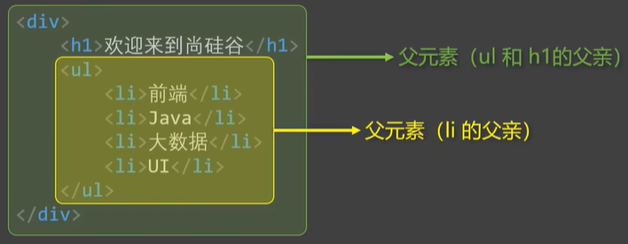
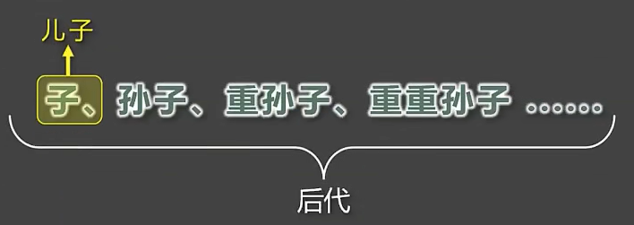

# 第3章 复合选择器

## 3.1 交集选择器

- 作用：选中**同时符合**多个条件的元素。

> 交集有**并且**的含义（通俗理解：**既......又......**的意思），例如：年轻**且**长得帅。

- 语法：<span style="color:red">选择器1</span><span style="color:blue">.选择器2</span><span style="color:orange">
  .选择器3</span>...<span style="color:green">选择器n</span> {}

- 举例：

```css
/* 选中：类名为beauty的p元素，为此种写法用的非常多！！！！！ */
p.beauty {
    color: blue;
}

/* 选中：类名包含rich和beauth的元素 */
.rich.beauty {
    color: green;
}
```

- 注意：

1）有标签名，标签名必须写在前面。

2）id 选择器、理论上可以作为交集的条件，但实际应用中几乎不用——因为没有意义。

3）交集选择器中不可能出现两个元素选择器，因为一个元素，不可能既是p元素又是span元素。

4）用的最多的交集选择器是：元素选择器配合类名选择器，例如：`p.beauty`。

## 3.2 并集选择器

- 作用：选中多个选择器对应的元素，又称：**分组选择器**。

- > 所谓并集就是**或者**的含义（通俗理解：**要么**......**要么**......的意思），例如：给我转10万块钱**或者**我报警。

- 语法：<span style="color:red">选择器1,</span><span style="color:blue">选择器2,</span><span style="color:orange">
  选择器3,</span>...<span style="color:green">选择器n</span> {}

- 举例：

```css
/* 选中：id为peiqi，或者类名为rich，或者类名为beauty的元素 */
#peiqi,
.rich,
.beauty {
    font-size: 40px;
    background-color: gray;
    width: 200px;
}
```

- 注意：

1）并集选择器，我们一般竖着写。

2）任何形式的选择器，都可以作为并集选择器的一部分。

3）并集选择器，通常用于集体声，可以缩小样式表体积。

## 3.4 CSS_HTML元素间的关系

- 父元素：**直接**包裹某个元素的元素，就是该被包裹元素的父元素。



- 子元素：被父元素**直接**包含的元素（简记：儿子元素）。


- 祖先元素：父亲的父亲......，一直往外找，都是祖先。

> 备注：父元素，也算是祖先元素的一种。
>
> 例如：张三的父亲，也算是张三的祖先，但一般还是称呼：父亲。


- 后代元素：儿子的儿子......，一直往里找，都是后代。

> 备注：子元素，也算是后代元素的一种。
>
> 例如：张三的儿子，也算是张三的后代，但一般还是称呼：儿子。


- 兄弟元素：具有相同父元素的元素，互为兄弟元素。


### 3.5、后代选择器

- 作用：选中指定元素中，符合要求的后代元素。
- 语法：<span style="color:red">选择器1</span><span style="color:blue">选择器2</span><span style="color:orange">
  选择器3</span>...<span style="color:green">选择器n</span> {} （先写祖先，再写后代）

> 选择器直接，用空格隔开，空格可以理解为："xxx中的"，其实就是后代的意思。
>
> 选择器123......n，可以使我们之前学习过的任何一种选择器（比如：类选择器、交集选择器等）。

- 举例：

```css
/* 选中ul中的所有li后代 */
ul li {
    color: red;
}

/* 选中ul中的所有li后代中的a */
ul li a {
    color: orange;
}

/* 选中类名为subject元素中的所有li后代 */
.subject li {
    color: blue;
}

/* 选中类名为subject元素中的所有类名为front-end的li后代 */
.subject li.front-end {
    color: blue;
}
```

- 注意：

1）后代选择器，最终选择的是后代，不选中祖先。

2）儿子、孙子、重孙子，都算是后代。

3）**结构一定要符合之前将的HTML嵌套要求**，例如：不能 p 中写 h1~h6。

## 3.6 子代选择器

- 作用：选中指定元素中，符合要求的子元素（儿子元素）。（先写父，再写子）

> 子代选择器又称：子元素选择器、子选择器。

- 语法：<span style="color:red">选择器1></span><span style="color:blue">选择器2></span><span style="color:orange">
  选择器3></span>...<span style="color:green">选择器n</span> {} （先写祖先，再写后代）

> 选择器之间，用 > 隔开， > 可以理解为：“XXX的子代”，其实就是儿子的意思。
>
> 选择器123......n，可以使我们之前学习过的任何一种选择器（比如：类选择器、交集选择器等）。

- 举例：

```css
/* div中的子代a元素 */
div > a {
    color: red;
}

/* 类名为persons的元素中的子代a元素 */
.persons > a {
    color: red;
}
```

- 注意：

1）子代选择器，最终选择的是子代，不是父级。

2）子、孙子、重孙子、重重孙子......统称后代！子就是指儿子。



## 3.7 兄弟选择器

- 相邻兄弟选择器：

    - 作用：选中指定元素后，符合条件的**相邻兄弟**元素。

  > 所谓相邻，就是紧挨着他的下一个，简记：睡在我下铺的兄弟。

    - 语法：<span style="color:red;">选择器1</span>+<span style="color:orange;">选择器2</span> {}。
    - 示例：

  ```css
  /* 选中div后相邻的兄弟p元素 */
  div+p {
      color: red;
  }
  ```
- 通用兄弟选择器：

    - 作用：选中指定元素后，符合条件的**所有兄弟**元素。（简记：睡在我下铺的所有兄弟）

    - 语法：<span style="color:red;">选择器1</span>~<span style="color:orange;">选择器2</span> {}。
    - 示例：

  ```css
  /* 选中div后的所有的兄弟p元素 */
  div~p {
      color: red;
  }
  ```

    - 注意：两种兄弟选择器，选择的是**下面**的兄弟。

## 3.8 属性选择器

- 作用：选中属性值符合一定要求的元素。

- 语法：

    - `[属性名]` 选中**具有**某个属性的元素。
    - `[属性名="值"]` 选中包含某个属性，且属性值**等于**指定值的元素。
    - `[属性名^="值"]` 选中包含某个属性，且属性值以指定的值**开头**的元素。
    - `[属性名$="值"]` 选中包含某个属性，且属性值以指定的值**结尾**的元素。
    - `[属性名*="值"]` 选择包含某个属性，属性值**包含**指定值的元素。

- 举例：

```css
/* 选中具有title属性的元素 */
div[title] {
    color: red;
}

/* 选中具有title属性的元素，且title属性值为sgg */
div[title="sgg"] {
    color: red;
}

/* 选中具有title属性的元素，且title属性值以s开头 */
div[title^="s"] {
    color: red;
}

/* 选中具有title属性的元素，且title属性值以g结尾 */
div[title^="g"] {
    color: red;
}

/* 选中具有title属性的元素，且title属性值包含g */
div[title*="g"] {
    color: red;
}
```

## 3.9 伪类选择器

- 作用：选中特殊状态的元素。

> 如何理解“伪”？——虚假的，不是真的。
>
> 如何理解“伪类”？——像类（class），但不是类，是元素的一种特殊状态。

### 3.9.1 动态伪类

1）`.link` 超链接**未被访问**的状态。

2）`.visited` 超链接**被访问过**的状态。

3）`.hover` 鼠标**悬停**在元素上的状态。

4）`.active` 元素**激活**的状态。

> 什么是激活？——按下鼠标不松开。
>
> 注意点：遵循LVHA的顺序，即：link、visited、hover、active。

5）`:focus`获取焦点的元素。

> 表单类元素才能使用`:focus`伪类。
>
> 当用户：点击元素、触摸元素、或通过键盘的“tab”键等方式，选择元素时，就是获得焦点。

### 3.9.2 结构伪类

- 常用的：

1）`:first-child` 所有兄弟元素中的**第一个**

2）`:last-child` 所有兄弟元素中的**最后一个**

3）`:nth-child(n)` 所有兄弟元素中的**第n个**

4）`:first-of-type` 所有**同类型**兄弟元素中的**第一个**

5）`:last-of-type` 所有**同类型**兄弟元素中的**最后一个**

6）`:nth-of-type(n)` 所有**同类型**兄弟元素中的**第n个**

关于n的值；

> 1、`0`或者`不写`：什么都选不中——几乎不用。
>
>2、`n`：选中所有子元素——几乎不用。
>
>3、`1~正无穷的整数`，选中对应序号的子元素。
>
>4、`2n `或 `even`：选中序号为偶数的子元素。
>
>5、`2n+1` 或 `odd`：选中序号为奇数的子元素。
>
>6、`-n+3`：选中前三个。

- 了解即可

1）`:nth-last-child(n)` 所有兄弟元素中的**倒数第n个**。

2）`:nth-last-of-type(n)` 所有**同类型**兄弟元素中的**倒数第n个**。

3）`:only-child` 选择没有兄弟的元素（独生子女）。

4）`:only-of-type` 选择没有**同类型**兄弟的元素。

5）`:root` 根元素。

6）`:empty` 内容为空的元素（空格也算内容）。

### 3.9.3 否定伪类

`:not(选择器)` 排除满足括号中条件的元素。

### 3.9.4 UI伪类

1）`:checked`被选中的复选框或单选按钮。

2）`:enable` 可用的表单元素（没有disabled属性）。

3） `:disabled` 不可用的表单元素（有disabled属性）。

### 3.9.5 目标伪类（了解）

`:target` 选中锚点指向的元素。

### 3.9.6 语言伪类（了解）

`:lang()` 根据指定的语言选择元素（本质是看lang属性的值）。

## 3.10 伪元素选择器

- 作用：选中元素中的一些特殊位置。

- 常用伪元素：
    - `::first-letter` 选中元素中的**第一个文字**。
    - `::first-line` 选中元素中的**第一行文字**。
    - `::selection` 选中**被鼠标选中**的内容。
    - `::placeholder` 选中输入框的**提示文字**。
    - `::before` 在元素**最开始**的位置，创建一个子元素（必须用 `content` 属性指定内容）。
    - `::after` 在元素**最后**的位置，创建一个子元素（必须用 `content` 属性指定内容）。

## 3.11 选择器的优先级

通过**不同选择器**，选中**相同的元素**，并且为**相同的样式名（比如color）**设置**不同的值**时，就发生了样式的冲突。

到底应用哪个样式，此时就需要看优先级了。

- 简单描述：

> 行内样式 > ID选择器 > 类选择器 > 元素选择器 > 通配选择器

- 详细描述

1）计算方式：每个选择器，都可以计算出一组权重，格式为：`(a,b,c)`

> - `a` : **ID** 选择器的个数。
> - `b` : **类**、**伪类**、**属性** 选择器的个数。
> - `c` : **元素**、**伪元素** 选择器的个数。
>
> 例如：
>
> | 选择器               | 权重    |
> | -------------------- | ------- |
> | ul>li                | (0,0,2) |
> | div ul>li p a span   | (0,0,6) |
> | #ssg .slogan         | (1,1,0) |
> | #sgg .slogan a       | (1,1,1) |
> | #sgg .slogan a:hover | (1,2,1) |

2）比较规则：按照**从左导游**的顺序，依次比较大小，当前位胜出后，后面的不再对比，例如：

> - (1,0,0) > (0,2,2)
> - (1,1,0) > (1,0,3)
> - (1,1,3) > (1,1,2)

3）特殊规则：

1. **行内样式**权重大于**所有选择器**。
2. <span style="color:red;">`!important`</span>权重，大于**行内样式**，大于**所有选择器**，**权重最高！**

