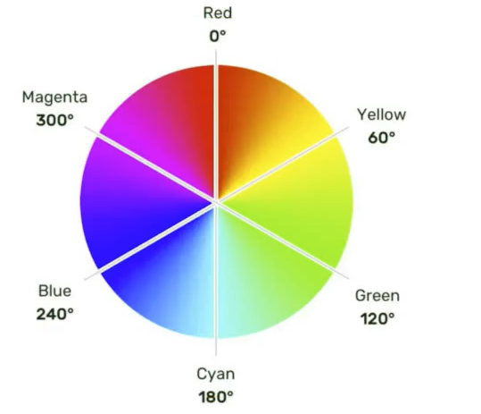

# 第5章 颜色的表示

## 5.1 表示方式一：颜色名

- 编写方式：直接使用颜色对应的英文单词，编写比较简单，例如：

1. 红色：red
2. 绿色：red
3. 蓝色：red
4. 紫色：red
5. 橙色：red
6. 灰色：red

> 1、颜色名这种方式，表达的颜色比较单一，所以用的并不多。
>
> 2、具体颜色名参考 MDN 官方文档
>
> https://developer.mozilla.org/zh-CN/docs/Web/CSS/named-color

## 5.2 表示方式二：RGB和RGBA

- 小规律：

> 1、若三种颜色值相同，呈现的是灰色，值越大，灰色越浅。
>
> 2、rgb(0,0,0)是黑色，rgb(255,255,255)是白色。
>
> 3、对于rgba来说，前三位的rgb形式要保持一致，要么都是0~255的数字，要么都是百分比。

## 5.3 表示方式三：HEX或HEXA

HEX的原理通RGB一样，依然是通过：红、绿、蓝进行组合，只不过要用6个数字，分成3组来表达。

格式为：#rrggbb

> 每一位数字的取值范围是：0~f，即：（0,1,2,3,4,5,6,7,8,9,a,b,c,d,e,f）
>
> 所以每一种光的最小值是：00，最大值是：ff

**注意：**IE浏览器不支持HEXA，但支持HEX。

## 5.4 表达方式四：HSL与HSLA

HSL(hue-色相，saturation-饱和度，lightness-亮度)

- HSL是通过：色相、饱和度、亮度，来标识一个颜色的，格式为：`hsl(色相,饱和度,亮度）`

    - 色相：取值范围是0-360度，具体度数对应的颜色如下图：

  

    - 饱和度：取值范围是`0%~100%`。（向色相中对应颜色中添加灰色，0%全灰，100%没有灰）
    - 亮度：取值范围是`0%~100%`。（0%亮度没了，所以就是黑色。100%亮度太强，所以就是白色了）

- HSLA其实就是在HSL的基础上，添加了透明度。