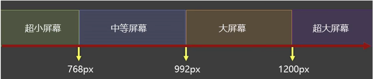

# 26 媒体查询

## 26.1 媒体类型

| 值             | 含义                                                         |
| -------------- | ------------------------------------------------------------ |
| all            | 检测所有设备。                                               |
| screen         | 检测电子屏幕，包括：电脑屏幕、平板屏幕、手机屏幕等。         |
| print          | 检测打印机。                                                 |
| ~~aural~~      | ~~已废弃，用于语音和声音合成器。~~                           |
| ~~braille~~    | ~~已废弃，应用于盲文触摸式反馈设备。~~                       |
| ~~embossed~~   | ~~已废弃，用于打印的盲人印刷设备。~~                         |
| ~~handheld~~   | ~~已废弃，用于厂商设备或更小的装置，比如PAD和小型电话。~~    |
| ~~projection~~ | ~~已废弃，用于投影设备~~                                     |
| ~~tty~~        | ~~已废弃，用于固定的字符网格，如电报、终端设备和对字符有限制的便携设备。~~ |
| ~~tv~~         | ~~已废弃，用于电视和网络电视。~~                             |

> 完整列表请参考： https://developer.mozilla.org/zh-CN/docs/Web/CSS/@media

## 26.2 媒体特性

| 值               | 含义                                                         |
| ---------------- | ------------------------------------------------------------ |
| width            | 检测视口**宽度**                                             |
| max-width        | 检测视口**最大宽度**                                         |
| min-width        | 检测视口**最小宽度**                                         |
| height           | 检测视口**高度**                                             |
| max-height       | 检测视口**最大高度**                                         |
| min-height       | 检测视口**最小高度**                                         |
| device-width     | 检测设备**屏幕的宽度**                                       |
| max-device-width | 检测设备**屏幕的最大宽度**                                   |
| min-device-width | 检测设备**屏幕最小宽度**                                     |
| orientation      | 检测**视口的旋转方向**（是否横屏）<br />1.portrait：视口处于纵向，即高度大于等于宽度。<br />2.landscape：视口处于横向，即宽度大于高度。 |

> 完整列表请参考： https://developer.mozilla.org/zh-CN/docs/Web/CSS/@media

## 26.3 运算符

| 值      | 含义 |
| ------- | ---- |
| and     | 并且 |
| , 或 or | 或   |
| not     | 否定 |
| only    | 肯定 |

## 26.4 常用阈值

在实际开发中，会将屏幕分为几个区间，例如：



## 26.5 结合外部样式的用法

**用法一：**

```css
<link rel="stylesheet" media="screen and (min-width:1200px)" href="./css/huge.css">
```

**用法二：**

```css
/* 大屏幕 */
@media screen and (min-width:992px) and (max-width:1200px) {
    h1 {
        background-color: deepskyblue;
    }
}
```