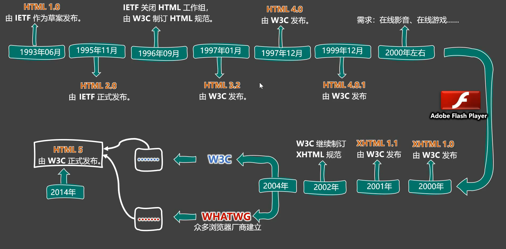

# 第1章 HTML4概念

## 1.1 HTML是什么？

全称：HyperText Markup Language

译为：超文本标记语言

超文本：暂且理解为“超级的文本”，和普通文本比，内容更丰富。

> 超文本：是一种组织信息的方式，通过超链接将不同空间的文字、图片、等各种信息组织在一起，能从当前阅读的内容，跳转到超链接所指向的内容。

标记：文本要变成超文本，就需要用到各种标记符号。

语言：生活中每个汉字的写法、读音、使用规则等等，构成了汉语。



- IETF
  - 全名：Internet Engineering Task Force
  - 译名：国际互联网工程任务组
  - 成立于：1985年
  - 官网：https://www.ietf.org
- W3C
  - 全名：World Wide Web Consortium
  - 译名：万维网联盟
  - 成立于：1994年
  - 官网：https://www.w3.org
- WHATWG
  - 全名：Web Hypertext Application Technology Working Group
  - 译名：网页超文本应用技术工作小组
  - 成立于：2004年
  - 官网：https://whatwg.org

## 1.2 HTML标签

1、**标签**又称**元素**，是HTML的基本组成单位。

2、标签分为：**双标签**与**单标签**（绝大多数都是双标签）。

3、标签名不区分大小写，但推荐小写，因为小写更规范。

4、双标签：

> 
>
> 示例代码：
>
> ```html
> <marquee>我爱你，让天下没有难学的技术！</marquee>
> ```

5、单标签：

> 
>
> 示例代码：
>
> ```html
> <input>
> ```

6、标签直接的关系：并列关系、嵌套关系，可以使用`tab`键进行缩进：

```html
<marquee>
	我爱你，让天喜爱没有难学的技术！
    <input>
</marquee>
```

## 1.3 HTML标签属性

1、用于给标签提供**附加信息**。

2、可以写在：**起始标签**或**单标签中**，形式如下：

> 
>
> ```html
> <marquee loop="1" bgcolor="orange">
>     我爱你，让天下没有难学的技术！<input type="password">
> </marquee>
> <input disabled>
> ```

3、有些特殊的属性，没有属性名，只有属性值，例如：

```html
<input disabled>
```

4、注意点

> 1、不同的标签，有不同的属性；也有一些通用属性（在任何标签内都能写）。
>
> 2、属性名、属性值不能乱写，都是W3C规定好的。
>
> 3、属性名、属性值，都不区分大小写，但推荐小写。
>
> 4、双引号，也可以写成单引号，甚至不写都行，但还是推荐写双引号。
>
> 5、标签中不要出现同名属性，否则后写的会失效（**后来者无立足之地**），例如：
>
> ```html
> <input type="text" type="password">
> ```

## 1.4 HTML基本结构

1、在网页中，如何查看某段结构的具体代码？——点击鼠标右键，选择“检查”。

2、【检查】和【查看网页源代码】的区别：

> 【查看网页源代码】看到的是：程序员编写的源代码。
>
> 【检查】看到的是：经过浏览器“处理”后的源代码。
>
> 备注：日常开发中，【检查】用的最多。

3、网页的**基本结构**如下：

> 1、想要呈现在网页中的内容写在`body`标签中。
>
> 2、`head`标签中的内容不会出现在网页中。
>
> 3、`head`标签中的`title`标签可以指定网页的标题。
>
> 4、图示
>
> ```html
> <!DOCTYPE html>
> <html lang="en">
>     <head>
>     	......
>     </head>
>     <body>
>         ......
>     </body>
> </html>
> ```
>

## 1.5 HTML注释

1、特点：注释的内容会被浏览器所忽略，不会呈现到页面中，但源代码中依然可见。

2、作用：对代码进行解释和说明。

3、写法：

```html
    <!-- 下面的输入框是可以滚动的，且只能滚动一次 -->
    <marquee loop="1">
        我爱你
        <input type="text">
    </marquee>
    <!-- 下面的输入框是不可以滚动的 -->
    <input type="text">
```

4、注释不可用嵌套，以下写法错误（反例）

```html
<!--
	我是一段注释
	<!-- 我是一段注释 -->
-->
```

## 1.6 HTML文档声明

1、作用：告诉浏览器当前网页的版本。

2、写法：

- 旧的写法：需要依赖网页所用的HTML版本而定，写法有很多。

  > 具体有哪些写法，请参考：[W3C官网-文档声明](https://www.w3.org/QA/2002/04/valid-dtd-list.html)

- 新的写法：一切都变得简单了！W3C推荐使用HTML5的写法。

```html
<!DOCTYPE html>
或
<!DOCTYPE HTML>
或
<!doctypye html>
```

3、注意：文档声明，必须在网页的第一行，且在`html`标签的外侧。

## 1.7 字符编码

ASCII => 大写字母、小写字母、数字、一些符号，共计 128 个。

ISO 8859-1 => 在ASCII基础上，扩充了一些希腊字符等，共计是 256 个。

GB2312 => 继续扩充，收录了 6763 个常用汉字、682 个字符。

GBK => 收录了的汉字和符号达到 20000+，支持繁体中文。

UTF-8 => 万国码，包含世界上所有语言的：所有文字与符号。—— 很常用。

```html
<head>
    <meta charset="UTF-8">
    <title>Title</title>
</head>
```

## 1.8 设置语言

1、主要作用：

- 让浏览器显示对应的翻译提示。
- 有利于搜索引擎优化。

2、具体写法：

```html
<html lang="zh-CN">
    
</html>
```

3、扩展只是：`lang`属性的编写规则

> 1、第一种写法（语言-国家/地区）
>
> - zh-CN : 中文-中国大陆（简体中文）
> - zh-TW : 中文-中国台湾（繁体中文）
> - zh : 中文
> - en-US : 英语-美国
> - en-GB : 英语-英国
> - en : 英语
>
> 2、第二种写法（语言-具体种类）已不推荐使用，例如：
>
> - zh-Hans : 中文-简体
> - zh-Hant : 中文-繁体
>
> 3、W3School上的说明：[语言代码参考手册](https://www.w3school.com.cn/tags/html_ref_language_codes.asp) [国家/地区代码参考手册](https://www.w3school.com.cn/tags/html_ref_country_codes.asp) 
>
> 4、W3C官网上的说明： [Language in HTML](https://www.w3.org/International/articles/language-tags/)

## 1.9 HTML标准结构

可以通过Emmet提示，输入`!`得到。

```html
<!DOCTYPE html>
<html lang="zh-CN">

<head>
    <meta charset="UTF-8">
    <title>Document</title>
</head>

<body>
    <input type="text">
</body>

</html>
```
