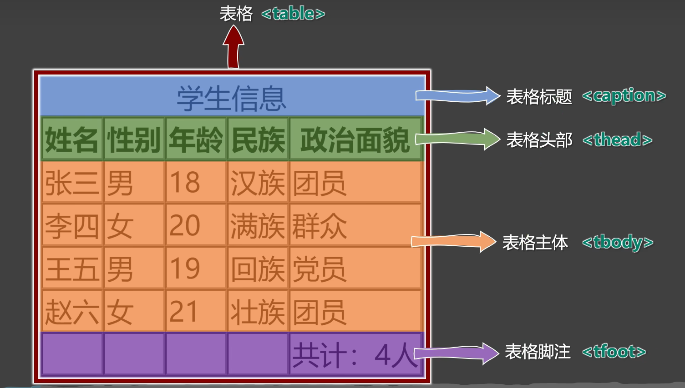
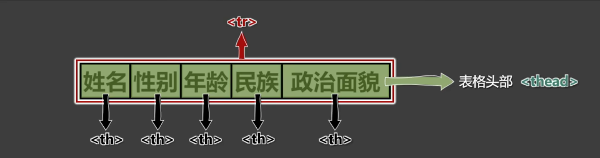
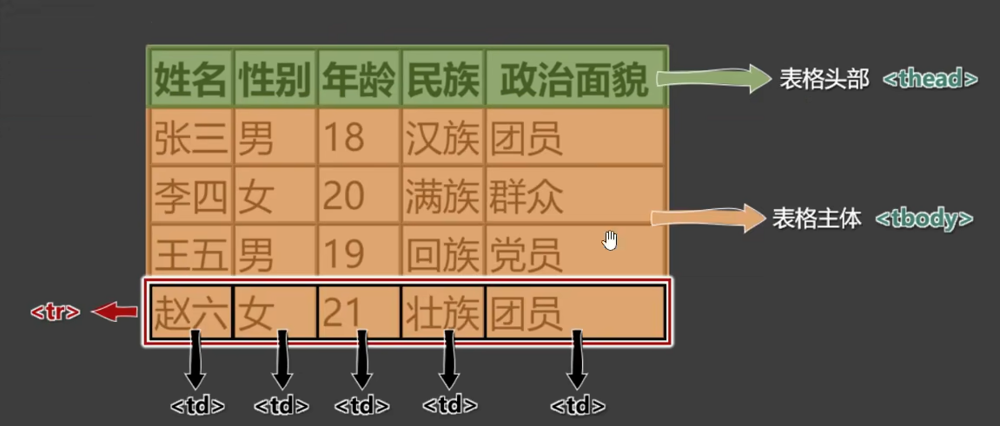
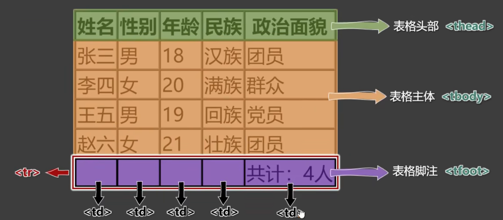

# 第2章 HTML4详解

## 2.1 HTML开发者文档

- W3C官网：https://www.w3.org/
- W3School：https://w3school.com.cn
- MDN：https://developer.mozilla.org 【推荐】

## 2.2 HTML排版标签

| 标签名 | 标签语义                                       | 单/双标签 | 元素类型 |
| ------ | ---------------------------------------------- | --------- | -------- |
| h1~h6  | 标题                                           | 双        | 块级元素 |
| p      | 段落                                           | 双        | 块级元素 |
| div    | 没有任何含义，用于正题布局（生活中的包装袋）。 | 双        | 块级元素 |

1）`h1`最好写一个，`h2~h6`能适当多写。

2）`h1~h6`不能互相嵌套，例如：`h1`标签中最好不要写`h2`标签了。

3）`p`标签很特殊！它里面不能有：`h1~h6`、`p`、`div`标签。

## 2.3 HTML语义化标签

语义化：标签默认的效果不重要，语义最重要！

- 概念：用特定的标签，去表达特定的含义。

- 原则：标签的默认效果不重要（后期可以通过CSS随便控制效果），语义最重要！

- 举例：对于h1标签，效果是文字很大（不重要），语义是网页主要内容（很重要）

- 优势：

    - 代码结构清晰可读性强。
    - 有利于SEO（Search Enging Optimization - 搜索引擎优化） 爬虫 代码 机器人
    - 方便设备解析（屏幕阅读器、盲人阅读器）

  >如果有一天你想结婚了，最好不是因为年龄到了，而是爱情来了！
  >
  >如果有一天你想用h1了，最好不是因为它的默认效果，而是它的语义——网页主要内容
  >
  >如果有一天你想用p了，最好不是因为它的默认效果，而是它的语义——段落解析（屏幕阅读器、盲人阅读器）

## 2.4 块级元素与行内元素

1、**块级元素**：独占一行（排版标签都是块级元素）

2、**行内元素**：不独占一行。

3、**使用规则**：

> 1、**块级元素**中能写**行内元素**和**块级元素**（简单记：块级元素中几乎什么都能写）。
>
> 2、**行内元素**中能写**行内元素**，但不能写**块级元素**。
>
> 3、一些特殊的规则：
>
> - h1~h6 不能互相嵌套。
> - p中不要写块级元素。

4、备注说明

> marquee元素设计的初衷是：让文字有动画效果，但如今我们可以通过CSS来实现了，而且还可以实现的更加炫酷，所以marquee标签已经过时了，不推荐使用。

## 2.5 文本标签

1、用于包裹：词汇、短语等。

2、通常写在排版标签里面。

3、排版标签更宏观（大段的文字），文本标签更微观（词汇、短语）。

4、文本标签通常都是行内元素。

**常用的**：

| 标签名 | 标签语义                         | 单/双标签 | 元素类型 |
| ------ | -------------------------------- | --------- | -------- |
| em     | 要着重阅读的内容                 | 双        | 行内元素 |
| strong | 十分重要的内容（语气比em要强）   | 双        | 行内元素 |
| span   | 没有语义，用于包裹短语的通用容器 | 双        | 行内元素 |

> 生活中的例子：div是大包装袋，span是小包装袋。

**不常用的**：

| 标签名     | 标签语义                                                     | 单/双标签 | 元素类型 |
| ---------- | ------------------------------------------------------------ | --------- | -------- |
| cite       | 作品标题（书籍、歌曲、电影、电视节目、绘画、雕塑）           | 双        | 行内元素 |
| dfn        | 特殊术语，或专属名词                                         | 双        | 行内元素 |
| del与ins   | 删除的文本【与】插入的文本                                   | 双        | 行内元素 |
| sub与sup   | 下标文字【与】上标文字                                       | 双        | 行内元素 |
| code       | 一段代码                                                     | 双        | 行内元素 |
| samp       | 从正常的上下文中，将某些内容提取出来，例如：标识设备输出     | 双        | 行内元素 |
| kbd        | 键盘文本，表示文本是通过键盘输入的，经常用在与计算机相关的手册中 | 双        | 行内元素 |
| abbr       | 缩写，最好配合上title属性                                    | 双        | 行内元素 |
| bdo        | 更改文本方向，要配合dir属性，可选值：ltr（默认值）、rtl      | 双        | 行内元素 |
| var        | 标记变量，可以与code标签一起使用                             | 双        | 行内元素 |
| small      | 附属细则，例如：包括版权、法律文本。——很少使用               | 双        | 行内元素 |
| b          | 摘要中的关键字、评论中的产品名称。——很少使用                 | 双        | 行内元素 |
| i          | 本意是：人物的思想活动、所说的话等等。现在多用于：呈现**字体图标** | 双        | 行内元素 |
| u          | 与正常内容有反差的文本，例如：错误的单词、不合适的描述等。——很少使用 | 双        | 行内元素 |
| q          | 短引用——很少使用                                             | 双        | 行内元素 |
| blockquote | 长引用——很少使用                                             | 双        | 块级元素 |
| address    | 地址信息                                                     | 双        | 块级元素 |

> 备注：
>
> 1、这些不常用的文本标签，编码时不用过于纠结（酌情而定，不用也没毛病）。
>
> 2、`blockquote`与`address`是块级元素，其他的文本标签，都是航安诶元素。
>
> 3、有些语义感不强的标签，我们很少使用，例如：
>
> `small`、`b`、`u`、`q`、`blockquote`
>
> 4、HTML标签太多了！记住那些：重要的、语义感强的标签即可；截止目前，有这些：
>
> `h1~h6`、`p`、`div`、`em`、`strong`、`span`

## 2.6 图片标签

| 标签名 | 标签语义 | 常用属性                                                     | 单/双标签 | 元素类型 |
| ------ | -------- | ------------------------------------------------------------ | --------- | -------- |
| img    | 图片     | src : 图片路径（又称：图片地址）<br />alt : 图片描述<br />width : 图片宽度，单位是像素，例如：200px或200<br />height : 图片高度，单位是像素，例如：200px或200 | 单        | 行内元素 |

总结：

> 1、像素（px）是一种单位。
>
> 2、尽量不同时修改图片的宽和高，可能会造成比例失调。
>
> 3、暂且认为img是行内元素（学到CSS时，会认识一个新的元素分类，目前仅知道：块、行内）
>
> 4、alt属性的作用：
>
> - 搜索引擎通过alt属性，得知图片的内容。——最主要的作用。
> - 当图片无法展示时候，有些浏览器会呈现alt属性的值。
>
> - 盲人阅读器会朗读alt属性的值。

## 2.7 常见图片格式

1、jpg格式

>概述：扩展名为`.jpg`或`.jpeg`，是一种有损的压缩格式（把肉眼不容易观察出来的细节丢弃了）。
>
>主要特点：**支持的颜色丰富**、**占用空间较小**、不支持透明背景、不支持动态图。
>
>使用场景：对图片细节**没有极高要求**的场景，例如：网站的产品宣传图等。——该格式网页中很常见。

2、png格式：

> 概述：扩展名为`.png`，是一种无损的压缩格式，能够更高质量的保存图片。
>
> 主要特点：**支持的颜色丰富**、占用空间略大、**支持透明背景**、不支持动态图。
>
> 使用场景：1）想让图片有透明背景；2）想更高质量的呈现图片；例如：公司logo图、重要配置图等。

3、bmp格式：

> 概述：扩展名为`.bmp`，不进行压缩的一种格式，在最大程度上保留图片更多的细节。
>
> 主要特点：**支持的颜色丰富**、**保留的细节更多**、占用空间极大、不支持透明背景、不支持动态图。
>
> 使用场景：对图片细节**要求极高**的场景，例如：一些大型游戏中的图片。（网页中很少使用）

4、git格式：

> 概述：扩展名为`.git`，仅支持256种颜色，色彩呈现不是很完整。
>
> 主要特点：支持的颜色较少、**支持简单透明背景、支持动态图**。
>
> 使用场景：网页中的动态图片。

5、webp格式：

> 概述：扩展名为`webp`，谷歌推出的一种格式，专门用来在网页中呈现图片。
>
> 主要特点：具备上述几种格式的优点，但兼容性不太好，一旦使用务必要解决兼容性问题。
>
> 使用场景：网页中的各种图片。

6、base64格式

> 1、本质：一串特殊的文本，要通过浏览器打开，传统看图应用通常无法打开。
>
> 2、原理：把图片进行`base64`编码，形成一串文本。
>
> 3、如何生成：靠一些工具或网站。
>
> 4、如何使用：直接作为`img`标签的src属性的值即可，并且不受文件位置的影响。
>
> 5、使用场景：一些较小的图片，或者需要和网页一起加载的图片。

**图片的格式非常多，上面这些，只是一些常见的、我们前端人员常接触到的。**

## 2.8 超链接

主要作用：从当前页面进行跳转。

| 标签名 | 标签语义 | 常用属性                                                     | 单/双标签 | 元素类型 |
| ------ | -------- | ------------------------------------------------------------ | --------- | -------- |
| a      | 超链接   | href : 要跳转的具体位置。<br />target : 跳转时如何打开页面，常用值如下：<br />_self : 在本页签中打开<br />_blank : 在新页签中打开。<br />虽然是行内元素，但可以包含行内元素、块级元素，只要不是a标签自身即可。 | 双        | 行内元素 |

> 注意点：
>
> 1、代码中的**多个空格**、**多个回车**，都会被浏览器解析成一个空格！
>
> 2、虽然a是行内元素，但a元素可以包裹除它自身外的任何元素！

## 2.9 列表

**1.有序列表**

概念：有顺序或侧重顺序的列表。

```html
    <h2>要把大象放冰箱，拢共分几步？</h2>
    <ol>
        <li>把冰箱门打开</li>
        <li>把大象放进去</li>
        <li>把冰箱门关上</li>
    </ol>
```

**2.无序列表**

概念：无顺序或不侧重顺序的列表。

```html
    <h2>我想去的几个城市</h2>
    <ul>
        <li>成都</li>
        <li>上海</li>
        <li>西安</li>
        <li>武汉</li>
    </ul>
```

**3.列表嵌套**

概念：列表汇总的某一项内容，又包含一个列表（注意：嵌套时，请务必把结构写完整）。

```html
    <h2>我想去的几个城市</h2>
    <ul>
        <li>成都</li>
        <li>
            <span>上海</span>
            <ul>
                <li>外滩</li>
                <li>
                    <span>东方明珠</span>
                    <ul>
                        <li>XXXXX</li>
                    </ul>
                </li>
                <li>迪士尼公园</li>
                <li>杜莎夫人蜡像馆</li>
            </ul>
        </li>
        <li>西安</li>
        <li>武汉</li>
    </ul>
```

> 注意：`li`标签最好写在`ul`或`ol`中，不要单独使用。

**4.自定义列表**

1、概念：所谓自定义列表，就是一个包含**术语名称**以及**术语描述**的列表。

2、一个`dl`就是一个自定义列表，一个`dt`就是一个术语名称，一个`dd`就是术语描述（可以由多个）。

```html
    <h2>如何更好的学习</h2>
    <dl>
        <dt>做好笔记</dt>
        <dd>笔记是我们以后复习的一个抓手</dd>
        <dd>笔记可以使电子版，也可以是纸质版</dd>
        <dt>多加练习</dt>
        <dd>只有敲出来的代码，才是自己的</dd>
        <dt>别怕出错</dt>
        <dd>错误真正常，改正后并记住，就是经验</dd>
    </dl>
```

## 2.10 表格

**1.基本结构**

1、一个完整的表格由：**表格标题**、**表格头部**、**表格主体**、**表格脚注**，四部分组成。



2、表格涉及到的标签：

`table`：表格

`caption`：表格标题

`thead`：表格头部

`tbody`：表格主体

`tfoot`：表格脚注

`tr`：每一行

`th`、`td`：每个单元格（备注：表格头部中用`th`，表格主体、表格脚注中用：`td`）








**2.常用属性**

| 标签名 | 标签语义   | 常用属性                                                     | 单/双标签 |
| ------ | ---------- | ------------------------------------------------------------ | --------- |
| table  | 表格       | width : 设置表格宽度。<br />height : 设置表格**最小**高度，表格最终高度可能比设置的值大<br />border : 设置表格边框宽度。<br />cellspacing : 设置单元格直接的间距。 | 双        |
| thead  | 表格头部   | height : 设置表格头部高度。<br />align : 设置单元格的水平对齐方式，可选值：<br />1-left : 左对齐；2-center : 中间对齐；3-right : 右对齐<br />valign : 设置单元格的垂直对齐方式，可选值：<br />1-top : 顶部对齐；2-middle : 中间对齐；3-bottom : 底部对齐 | 双        |
| tbody  | 表格主体   | 常用属性与 thead 相同。                                      | 双        |
| tr     | 行         | 常用属性与 thead 相同。                                      | 双        |
| tfoot  | 表格脚注   | 常用属性与 thead 相同。                                      | 双        |
| td     | 普通单元格 | width : 设置单元格的宽度，同列所有单元格全部都受影响。<br />height : 设置单元格的高度，同行所有单元格全部都受影响。<br />align : 设置单元格的水平对齐方式。<br />valign : 设置单元格的垂直对齐方式。<br />rowspan : 指定要跨的行数。<br />colspan : 指定要跨的列数。 | 双        |
| th     | 表头单元格 | 常用属性与td相同。                                           | 双        |

注意点：

> 1、`<table>`元素的border属性可以控制表格边框，但border值的大小，并不控制单元格边框的宽度，只能控制表格最外侧边框的宽度，这个问题如何解决？——CSS控制。
>
> 2、给某个th或td设置了宽度之后，他们所在的那一列的宽度就确定了。

**3.跨行跨列**

1、rowspan : 指定要跨的行数。

2、colspan : 指定要跨的列数。

## 2.11 常用标签补充

| 标签名 | 标签语义                                     | 单/双标签 | 元素类型 |
| ------ | -------------------------------------------- | --------- | -------- |
| br     | 换行                                         | 单        | 块级元素 |
| hr     | 分割                                         | 单        | 块级元素 |
| pre    | 按照原文显示（一般用于在页面中嵌入大段代码） | 双        | 块级元素 |

> 注意点：
>
> 1、不要用`<br>`来增加文本之间的行间隔，应使后面即将学到的CSS margin属性。
>
> 2、`<hr`的语义是分割，如果不想要语义，只是想画一套水平线，那么应当使用CSS完成。

## 2.12 表单

**1.基本结构**

简单梳理：

| 标签名   | 标签语义         | 常用属性                                                     | 单/双标签 |
| -------- | ---------------- | ------------------------------------------------------------ | --------- |
| form     | 表单             | action : 用于指定表单的提交地址（需要与后端人员沟通后确定）。<br />target : 用于控制表单提交后如何打开页面：_self : 本窗口打开； _blank : 新窗口打开。<br />method : 用于控制表单的提交方式，暂时只需了解，在后面 Ajax 的课程中，会详细讲解。 | 双        |
| input    | 输入框           | type 属性：指定表单控件的类型。<br />可选值：text\|password\|radio\|checkbox\|hidden\|submit\|reset\|button等。<br />name 属性：指定数据名称。<br />value 属性：对于输入框：指定默认输入的值；对于单选和复选框：实际提交的数据；对于按钮：显示的按钮文字。<br />disabled 属性：设置表单控件不可用。<br />maxlength 属性：用于输入框，设置最大可输入长度。<br />checked 属性：用于单选按钮和复选框，默认选中。 | 单        |
| textarea | 文本域           | name 属性：指定数据名称。<br />rows 属性：指定默认显示的行数，影响文本域的高度。<br />cols 属性：指定默认显示的列数，影响文本域的宽度。<br />disabled 属性：设置表单控件不可用。 | 双        |
| select   | 下拉框           | name 属性：指定数据名称。<br />disabled 属性：设置整个下拉框不可用。 | 双        |
| option   | 下拉框选项       | disabled 属性：设置下拉框选项不可用。<br />value 属性：该选项事件提交的数据（不指定value，会把标签中的内容作为提交数据） | 双        |
| button   | 按钮             | disabled 属性：设置按钮不可用。<br />type 属性：设置按钮的类型，值：submit（默认）、reset、button | 双        |
| label    | 与表单控件做关联 | for 属性：值与要关联的表单控件的ID值相同。                   | 双        |
| fieldset | 表单控件分组     |                                                              | 双        |
| legend   | 分组名称         |                                                              | 双        |

**2.常用表单控件**

1）文本输入框

```html
<input type="text">
```

> 常用属性如下：
>
> name 属性：数据的名称。
>
> value 属性：输入框的默认输入值。
>
> maxlength 属性：输入框最大可输入长度。

2）密码输入框

```html
<input type="password">
```

> 常用属性如下：
>
> name 属性：数据的名称。
>
> value 属性：输入框的默认输入值（一般不用，无意义）。
>
> maxlength 属性：输入框最大可输入长度。

**3.单选框**

```html
<input type="radio" name="gender" value="male">男
<input type="radio" name="gender" value="female" checked>女<br>
```

> 常用属性如下：
>
> name 属性：数据的名称，注意：想要单选效果，多个radio的name属性值要保持一致。
>
> value 属性：提交的数据值。
>
> checked 属性：让该单圈按钮默认选中。

**4.复选框**

```html
<input type="checkbox" name="hobby" value="smoke" checked>抽烟
<input type="checkbox" name="hobby" value="drink">喝酒
<input type="checkbox" name="hobby" value="perm" checked>烫头<br>
```

> 常用属性如下：
>
> name 属性：数据的名称。
>
> value 属性：提交的数据值。
>
> checked 属性：让该复选框默认选中。

**5.隐藏域**

```html
<input type="hidden" name="tag" value="180">
```

> 用户不可见的一个输入区域，作用是：提交表单的时候，携带一些固定的数据。
>
> name 属性：指定数据的名称。
>
> value 属性：指定的是真正提交的数据。

**6.提交按钮**

```html
<input type="submit" value="点我提交表单">
<button>点我提交表单</button>
```

> 注意：
>
> 1、button 标签 type 属性的默认值是 submit。
>
> 2、button 不要指定 name 属性。
>
> 3、input 标签编写的按钮，使用 value 属性指定按钮文字。

**7.重置按钮**

```html
<input type="reset" value="点我重置">
<button type="reset">点我重置</button>
```

> 注意点：
>
> 1、button 不要指定 name 属性。
>
> 2、input 标签编写的按钮，使用 value 属性指定按钮文字。

**8.普通按钮**

```html
<input type="button" value="普通按钮">
<button type="button">普通按钮</button>
```

> 注意点：普通按钮的 type 值为 button，若不写 type 值是 submit 会引起表单的提交。

**9.文本域**

```html
<textarea name="msg" rows="22" cols="3">我是文本域</textarea>
```

> 常用属性如下：
>
> 1、rows 属性：指定默认显示的行数，会影响文本域的高度。
>
> 2、cols 属性：指定默认显示的列数，会影响文本域的宽度。
>
> 3、不能编写 type 属性，其他属性，与普通文本输入框一致。

**10下拉框**

```html
<select name="from">
    <option value="黑">黑龙江</option>
    <option value="辽">辽宁</option>
    <option value="吉">吉林</option>
    <option value="粤">广东</option>
</select>
```

> 常用属性即注意事项：
>
> 1、name 属性：指定数据的名称。
>
> 2、option 标签设置 value 属性，如果没有 value 属性，提交的数据是 option 中间的文字；如果设置了 value 属性，提交的数据就是 value 的值（建议设置 value 属性）。
>
> 3、option 标签设置了 selected 属性，表示默认选中。

**11.禁用表单控件**

给表单控件的标签设置 disabled 即可禁用表单控件。

> input|textarea|button|select|option 都可以设置 disabled 属性。

**12.label标签**

label 标签可与表单控件相关联，关联之后点击文字，与之对应的表单控件就会获取焦点。

两种与 label 关联的方式如下：

1、让 label 标签的 for 属性的值等于表单控件的 id。

2、把表单控件套在 label 标签的里面。

## 2.13 框架标签

| 标签名 | 标签语义                     | 常用属性                                                     | 单/双标签 | 元素类型 |
| ------ | ---------------------------- | ------------------------------------------------------------ | --------- | -------- |
| iframe | 框架（在网页中嵌入其他文件） | name : 框架名字，可以与 target 属性配合。<br />width : 框架的宽。<br />height : 框架的高度。<br />frameborder : 是否显示边框，值：0或者1. | 双        | 行内元素 |

> iframe 标签的实际应用：
>
> 1、在网页中嵌入广告。
>
> 2、与超链接或表单的 target 配合，展示不同的内容。

## 2.14 HTML字符实体

在 HTML 中我们可以用一种**特殊的形式**的内容，来标识某个**符号**，这种特殊形式的内容，就是**HTML**实体。比如小于号`<`用于定义 HTML 标签的开始。如果我们希望浏览器正确地显示这些字符，我们必须在 HTML 源码中插入字符实体。

> 字符实体由三部分组成：一个 `&` 和一个实体名称（或者一个 `#` 和一个实体编号），最好加上一个分号`;`。

| 字符 | 说明              | 实体名     | 实体编号  |
| ---- | ----------------- | ---------- | --------- |
| ` `  | 空格              | `&nbsp;`   | `&#160;`  |
| <    | 小于号            | `&lt;`     | `&#60;`   |
| >    | 大于号            | `&gt;`     | `&#62;`   |
| &    | 和号              | `&amp;`    | `&#38;`   |
| "    | 引号              | `&quot;`   | `&#34;`   |
| `    | 反引号            | `&acute;`  | `&#180;`  |
| ¢    | 分（cent）        | `&cent;`   | `&#162;`  |
| £    | 镑（pound）       | `&pound;`  | `&#163;`  |
| ¥    | 元（yen）         | `&yen;`    | `&#165;`  |
| €    | 欧元（euro）      | `&euro;`   | `&#8364;` |
| ©    | 版权（copyright） | `&copy;`   | `&#169;`  |
| ®    | 注册商标          | `&reg;`    | `&#174;`  |
| ™    | 商标              | `&trade;`  | `&#8482;` |
| ×    | 乘号              | `&times;`  | `&#215;`  |
| ÷    | 除号              | `&divide;` | `&#247;`  |

[字符实体官方列表](https://html.spec.whatwg.org/multipage/named-characters.html#named-character-references)

## 2.15 HTML全局属性

常用的全局属性：

| 属性名 | 含义                                                         |
| ------ | ------------------------------------------------------------ |
| id     | 给标签指定唯一标识，注意：id 是不能重复的。<br />作用：可以让 label 标签与表单控件相关联；也可以与 CSS、JavaScript 配合使用。<br />注意：不能在以下 HTML 元素中使用：<br />`<head>`、`<html>`、`<meta>`、`<script>`、`<style>`、`<title>`。 |
| class  | 给标签指定类名，随后通过 CSS 就可以给标签设置样式。          |
| style  | 给标签设置 CSS 样式。                                        |
| dir    | 内容的方向，值：`ltr`、`trl`。<br />注意：不能在以下 HTML 元素周转那个使用：<br />`<head>`、`<html>`、`<meta>`、`<script>`、`<style>`、`<title>`。 |
| title  | 给标签设置一个文字提示，一般超链接和图片用的比较多。         |
| lang   | 给标签指定语言，具体规范和可选值请参考【8.HTML设置语言】<br />注意：不能在以下 HTML 元素中使用：<br />`<head>`、`<html>`、`<meta>`、`<script>`、`<style>`、`<title>`。 |

## 2.16 meta元信息

1、配置字符编码

```html
<meta charset="UTF-8">
```

2、针对 IE 浏览器的兼容性配置

```html
<meta http-equiv="X-UA-Compatible" content="IE=edge">
```

3、针对移动端的配置

```html
<meta name="viewport" content="width=device-width, initial-scale=1.0">
```

4、配置网页关键字

```html
<meta name="keywords" content="8-12个以英文逗号隔开的单词/词语">
```

5、配置网页貌似信息

```html
<meta name="description" content="80字以内的一段话，与网站内容相关">
```

6、针对收缩引擎爬虫配置

```html
<meta name="robots" content="此处可选值键下表">
```

| 值        | 描述                               |
| --------- | ---------------------------------- |
| index     | 允许搜索爬虫索引此页面。           |
| noindex   | 要求搜索爬虫不索引此页面。         |
| follow    | 允许搜索爬虫跟随此页面上的链接。   |
| nofollow  | 要求搜索爬虫不跟随此页面上的链接。 |
| all       | 与 index, follow 等价              |
| none      | 与 noindex, nofollow 等价          |
| noarchive | 要求搜索引擎不缓存页面内容         |
| nocache   | noarchive 的替代名称。             |

7、配置网页作者

```html
<meta name="author" content="tony">
```

8、配置网页生成工具

```html
<meta name=generator" content="Visual Studio Code">
```

9、配置定义网页版权信息

```html
<meta name="copyright" content="2023-2027©版权所有">
```

10、配置网页自动刷新

```html
<meta http-equiv="refresh" content="10;url=http://www.baidu.com">
```

[文档级元数据元素](https://developer.mozilla.org/zh-CN/docs/Web/HTML/Element/meta)

