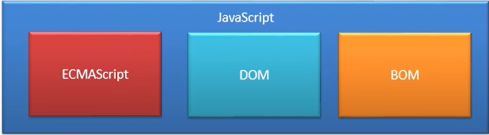

# 第1章 JavaScript介绍

## 1.1、起源

- JavaScript诞生于1995年，它的出现主要是用于处理网页中的前端验证。
- 所谓的前端验证，就是指检查用户输入的内容是否符合一定的规则。
- 比如：用户名的长度，密码的长度，邮箱的格式等。

## 1.2、简史

- JavaScript是由网景公司发明，起初命名LiveScript，后来由于SUN公司的介入更名为JavaScript。
- 1996年微软公司在其最新的IE3浏览器中引入了自己对JavaScript的实现JScript。
- 于是在市面上存在两个版本的JavaScript，一个网景公司的JavaScript和微软的JScript。
- 为了确保不同的浏览器上运行的JavaScript标准一致，所以几个公司共同定制了JS的标准名命名为ECMAScript。

## 1.3、时间表

| 年份 | 事件                                |
| ---- | ----------------------------------- |
| 1995 | 网景公司开发了JavaScript            |
| 1996 | 微软发布了和JavaScript兼容的JScript |
| 1997 | ECMAScript第一版（ECMA-262)         |
| 1998 | ECMAScript第二版                    |
| 1998 | DOM Level1的制定                    |
| 1998 | 新型语言DHTML登场                   |
| 1999 | ECMAScript第三版                    |
| 2000 | DOM Level2的制定                    |
| 2002 | ISO/IEC 16262:2002的确定            |
| 2004 | DOM Level3的制定                    |
| 2005 | 新型语言AJAX登场                    |
| 2009 | ECMAScript第五版                    |
| 2009 | 新型语言HTML5登场                   |

## 1.4、实现

- ECMAScript是一个标准，而这个标准需要由各个厂商去实现。
- 不同的浏览器厂商对该标准会有不同的实现。

| 浏览器            | JavaScript实现方式 |
| ----------------- | ------------------ |
| FireFox           | SpiderMonkey       |
| Internet Explorer | JScript/Chakra     |
| Safari            | JavaScriptCore     |
| **Chrome**        | **v8**             |
| Carakan           | Carakan            |

- 我们已经知道ECMAScript是JavaScript标准，所以一般情况下这两个词我们认为是一个意思。
- 但是实际上JavaScript的含义却要更大一些。
- 一个完整的JavaScript实现应该由以下三个部分构成：

## 1.5、特点

- JS的特点

    - 解释型语言
    - 类似于 C 和 Java 的语法结构
    - 动态语言
    - 基于原型的面向对象

## 1.6、关键字和保留字符

- 关键字

| break    | do      | instanceof | typeof | case    |
| -------- | ------- | ---------- | ------ | ------- |
| else     | new     | var        | catch  | finally |
| return   | void    | continue   | for    | switch  |
| while    | default | if         | throw  | delete  |
| in       | try     | function   | this   | with    |
| debugger | false   | true       | null   |         |

- 保留字符

| class  | enum       | exteneds | super     | const  |
| ------ | ---------- | -------- | --------- | ------ |
| export | implements | let      | private   | public |
| yield  | interface  | package  | protected | static |

- 其他不建议使用的标识符

| abstract  | double     | goto           | native             | static             |
| --------- | ---------- | -------------- | ------------------ | ------------------ |
| boolean   | enum       | implements     | package            | super              |
| byte      | export     | import         | private            | synchronize        |
| char      | extends    | int            | protected          | throws             |
| class     | final      | interface      | public             | transient          |
| const     | float      | long           | short              | volatile           |
| arguments | encodeURI  | Infinity       | Number             | RegExp             |
| undefined | isFinite   | Object         | String             | Boolean            |
| Error     | RangeError | parseFloat     | SyntaxError        | Date               |
| eval      | JSON       | ReferenceError | TypeError          | decodeURI          |
| EvalError | Math       | URIError       | decodeURIComponent | Function           |
| NaN       | isNaN      | parseInt       | Array              | encodeURIComponent |
