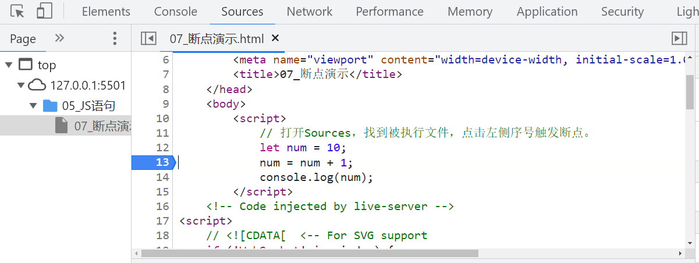

# 第6章 语句

## 6.1、表达式和语句

**目标：**能说出表达式和语句的区别

- 表达式：

表达式是可以被求值的代码，JavaScript引擎会将其计算出一个结果。

```js
x = 7;
3 + 4;
num++;
```

- 语句：

语句是一段可以执行的代码。

比如：prompt()可以弹出一个输入框，还有if语句，for循环语句等等。

- 区别：

表达式：因为表达式可以被求值，所以它可以写在赋值语句的右侧。比如：`num=3+4`

语句：而语句不一定有值，所以比如`alert()` `for`和`break`等语句就不能被用于赋值。比如：`alert()`弹出对话框，`console.log()`控制台打印输出。

## 6.2、分支语句

目标：掌握流程控制，写出能“思考”的程序。

### 6.2.1、程序三大流程控制语句

- **顺序结构：**从上往下执行语句。
- **分支结构：**根据条件选择执行代码。
- **循环结构：**代码被重复执行。

### 6.2.2、分支语句

- 分支语句可以让我们有<span style="color:red;">选择性</span>的执行想要的代码。
- 分支语句包含：
    - <span style="color:red;">if分支语句</span>
    - <span style="color:red;">三元运算符</span>
    - <span style="color:red;">switch语句</span>

**1.if分支语句**

- if语句有三种使用：单分支、双分支、多分支
- 单分支使用语法：
    - 括号内的条件为true时，进入大括号里执行代码
    - 小括号内的结果若不是布尔类型时，会发生隐式转换为布尔类型
    - 如果大括号只有一个语句，大括号可以省略，但是不提倡

```js
if (条件) {
    满足条件要执行的代码
}
```

- 双分支if语法：

```js
if (条件) {
	满足条件要执行的代码
} else {
    不满足条件要执行的代码
}
```

- 多分支if语法

**使用场景：**适合于有多个结果的时候，比如学习成绩可以分为：优、良、中、差。

```js
if (条件1) {
    
} 
else if (条件2) {
    
} 
else if (条件3) {
    
} else {
    
}
```

**2.三元运算符**

**目标：能利用三元运算符执行满足条件的语句。**

- **使用场景：**其实是比if双分支更简单的写法，可以使用三元表达式。
- **符号：**?与:配合使用
- **语法：**

```js
条件 ? 满足条件执行的代码 : 不满足条件执行的代码
```

- 一般用来取值

**3.switch语句**

目标：能利用switch执行满足条件的语句。

```js
switch (数据) {
    case 值1:
        代码1;
        break;
    case 值2:
        代码2;
        break;
    default:
        代码n;
        break;
}
```

- 找到和小括号里数据**全等**的case值，并执行里面对应的代码。
- 若没有**全等`===`**则执行default里的代码。
- switch case语句一般用于等值判断，不适合于区间判断。
- switch case一般需要配合break关键字使用，没有break会造成case逻辑穿透。

## 6.3、循环语句

目标：掌握循环结构，实现一段代码重复执行。

### 6.3.1、断点调试

> 打开Sources，找到被执行文件，点击左侧序号触发断点。



### 6.3.2、while循环

**循环：**重复执行一些操作，**while:**在...期间，所以**while循环**就是在**满足条件**期间，重复执行某些代码。

**1.while循环基本语法：**

```js
whhile (循环条件) {
    要重复执行的代码(循环体)
}
```

- 跟if语句很像，都要满足小括号里的条件为true才会进入**循环体**执行代码。
- while大括号里代码执行完毕后不会跳出，而是继续回到小括号里判断条件是否满足，若满足又执行大括号里的代码，然后再回到小括号判断条件，直到括号内条件不满足，即跳出。

**2.while循环三要素：**

循环的本质就是以某个变量为起始值，然后不断产生变化量，慢慢靠近终止条件的过程。

所以，<span style="color:red;">while循环需要具备三要素：</span>

1. 变量起始值
2. 终止条件（没有终止条件，循环会一直执行，造成死循环）
3. 变量变化量（用自增或者自减）

```js
let i = 1;
while (i <= 3) {
	document.write("我会循环三次<br>");
    i++;
}
```

### 6.3.3、循环的退出

**目标：**能说出 continue 和 break 的区别。

**循环结束：**

- break：退出循环
- continue：结束本次循环，继续下次循环。

### 6.3.4、for循环

目标：掌握for循环重复执行某些代码。

**1.for循环语法**

```js
for (变量起始值; 终止条件; 变量变化量) {
    // 循环体
}
```

**2.for循环嵌套**

```js
for (外部声明记录循环次数的变量; 循环条件; 变化值) {
    for (内部声明记录循环次数的变量; 循环条件; 变化值) {
        // 循环体
    }
}
```

- 一个循环里再套一个循环，一般用在for循环里。


### 6.3.5、for和while区别

- 如果明确了循环次数，推荐for循环。
- 如果不明确循环次数，推荐while循环。

