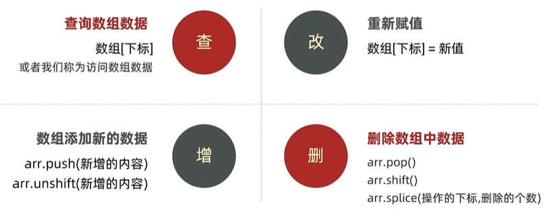

# 第7章 数组

## 7.1、数组是什么

**目标：**能说出数组是什么

- 数组：（Array）是一种可以按顺序保存数据的<span style="color:red;">数据类型</span>
- 为什么要数组？
    - 思考：如果我想保存一个班里所有同学的姓名怎么办？
    - <span style="color:red;">场景：如果有多个数据可以用数组保存起来，然后放到一个变量中，管理非常方便。</span>

## 7.2、数组的基本使用

**目标：**能够声明数组，并且能够获取里面的数据。

**1、声明语法**

```js
let 数组名 = [数据1, 数据2, ..., 数据n]
// 或
let 数组名 = new Array(数据1, 数据2, ..., 数据n);
```

- 例子

```js
let arr = [1, 2, "pink", true];
```

- 数组是按顺序保存，所以每个数据都有自己的编号
- 计算机中的编号从0开始，比如 arr[2]="pink"。
- 在数组中，数据的编号也叫<span style="color:red;">索引或下标</span>。
- 数组可以存储任意类型的数据。


**2、取值语法**

```js
数组名[下标]
// 备注：下标可以是数字，也可以是数字字符串，比如 数组名[0] 和 数组名["0"] 都是OK的。
```

- 例子：

```js
let arr = [1, 2, "pink", true];
arr[0] // 1
arr[3] // true
```

- 通过下标取数据
- 取出来是什么类型的，就根据这种类型特点来访问

**3、一些术语**

- 元素：数组中保存的每个数据都叫数组元素
- 下标：数组中数据的编号
- 长度：数组中数据的个数，通过数组的length属性获得

```js
let names = ['小明', '小刚', '小红', '小丽', '小米'];
console.log(names[0];
console.log(names[1];
console.log(names.length); // 5
```

**4、遍历数组（重点）**

目标：能够遍历输出数组里面的元素

- 用循环把数组中每个元素都访问到，一般会用for循环遍历
- 语法：

```js
for (let i = 0; i < 数组名.length; i++){
    数组名[i]
}
```

```js
let nums = [10, 20, 30, 40, 50];
for (let i = 0; i < nums.length; i++) {
    document.write(nums[i]);
}
```

## 7.3、操作数组

- 数组本质是数据集合，操作数据无非就是<span style="color:red;">增删改查</span>语法：



### 7.3.1、操作数组-新增

**目标：**掌握利用push向数组添加元素（数据）

- <span style="color:red;">数组.push</span>方法将一个或多个元素添加到数组的**末尾**，并返回该数组的新长度（<span style="color:red;">重点</span>）

    - **语法：**

  ```js
  arr.push(元素1, ..., 元素n)
  ```

    - **例如：**

  ```js
  let arr = ["red", "green"];
  arr.push("pink");
  console.log(arr); // ["red", "green", "pink"]
  ```

- <span style="color:red;">arr.unshift(新增的内容)</span>方法将一个或多个元素添加到数组的**开头**，并返回该数组的新长度<span style="color:red;">（<span style="color:red;">重点</span>）</span>

    - **语法：**

  ```js
  arr.unshift()
  ```

### 7.3.2、操作数组-删除

**目标：**能够删除数组元素（数据）

- <span style="color:red;">数组.pop()</span>方法从数组中删除**最后一个**元素，并返回该元素的值。此方法会更改数组的长度。

    - **语法：**

  ```js
  arr.pop()
  ```

    - **例如：**

  ```js
  let arr = ["red", "green"];
  arr.pop();
  console.log(arr); // ["red"]
  ```

- <span style="color:red;">数组.shift()</span> 方法从数组中删除**第一个**元素，并返回该元素的值。此方法更改数组的长度。

    - **语法：**

  ```js
  arr.shift()
  ```

- <span style="color:red;">数组.splice()</span>方法通过**移除**或者**替换**已存在的元素和/或**添加新元素**[就地](https://zh.wikipedia.org/wiki/原地算法)改变一个数组的内容。返回值是一个包含了删除的元素的数组。

    - **语法：**

  ```js
  arr.splice(start, deleteCount);
  arr.splice(起始位置, 删除几个元素);
  ```

    - **解释：**
        - start 起始位置：指定修改的开始位置（从0计数）。
        - deleteCount：表示要移除的数组元素的个数。
            - 可选的，如果省略则默认从指定的起始位置删除到最后。

## 7.4、数组中map方法

- **使用场景：**

map可以遍历数组<span style="color:red;">处理数据</span>，并返<span style="color:red;font-weight:bold;">返回新的数组</span>

```js
const arr = ['red', 'blue', 'green'];
const newArr = arr.map(function(ele, index){
	console.log(ele)   ; // 数组元素
    console.log(index); // 数组索引号
    return ele+'颜色';
});
console.log(newArr); // ['red颜色', 'blue颜色', 'green颜色']
```

<span style="color:red;font-weight:bold;">map也称为映射</span>。映射是一个术语，指两个元素的集之间元素相互“对应”的关系。

<span style="color:red;font-weight:bold;">map重点在于有返回追</span>，forEach没有返回值。

## 7.5、数组中join方法

- **作用：**

  join()方法用于把数组中的所有元素转换一个字符串。

- **语法：**

  ```js
  const arr = ['red颜色', 'blue颜色', 'green颜色'];
  console.log(arr.join('')); // red颜色blue颜色green颜色
  ```


## 7.6、数组的forEach方法（重点）

- forEach()方法用于调用数组的每个元素，并将元素传递给回调函数。
- 主要使用场景：**变量数组的每个元素**
- 语法：

```js
被遍历的数组.forEach(function(当前数组元素,当前元素索引号)){
	// 函数体
   }
```

- 示例：

```js
const arr = ["red", "green", "pink"];
arr.forEach(function (ele, idx) {
    console.log(ele, idx);
});
```

注意：

1. forEach主要是变量数组。
2. 参数当前数组元素是必须的，索引号是可选的。

## 7.7、数组filter方法（重点）

- fiilter()方法创建一个新的数组，新数组中的元素是通过检查指定数组中复合条件的所有元素。
- 主要使用场景：<span style="color:red;font-weight:bold;">筛选数组中复合条件的元素</span>，并返回筛选之后元素的新数组。
- **返回值：**返回数组，包含了符合条件的所有元素。如果没有符合条件的元素则返回空数组。
- **参数：**参数当前数组元素是必须的，索引号是可选。
- **语法：**

```js
const arr = [10, 20, 30];
const newArr = arr.filter(function (item, index) {
    return item >= 20;
});
console.log(newArr); // [20, 30]
```

## 7.8、forin方法

```js
const arr = [10, 20, 30];
for (let i in arr) {
    console.log(i, arr[i]); // 0 10
}
```

