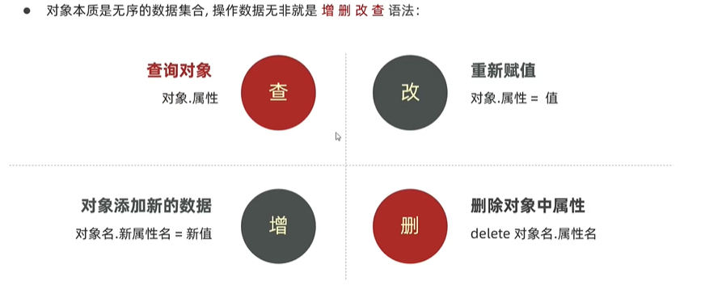

# 第9章 对象

## 9.1、什么是对象

**1.对象是什么**

- 对象（object）：JavaScript里的一种数据类型。

- 可以理解为是一种无序的数据集合，注意属猪是有序的数据集合。

- 用来描述某个事务，例如描述一个人

    - 人有姓名、年龄、性别等信息、还有吃饭睡觉打代码等功能。
    - 如果用多个变量保存则比较散，用对象比较统一。

  ```js
  let obj = {
      uname: 'pink老师',
      age: 18,
      gender: '女'
  }
  ```

## 9.2、对象使用

目标：掌握对象语法，用它保存多个数据

### 9.2.1、对象声明语法

```js
let 对象名 = {};
或
let 对象名 = new Object();
```

例如：

```js
// 声明了一个person的对象
let person = {};
```

实际开发中，我们多用花括号。<span style="color:red;font-weight:bold;">{}是对象字面量</span>

- 对象是由属性和方法组成

    - 属性：信息或叫特征（名词）。比如手机尺寸、颜色、重量等...
    - 方法：功能或叫行为（动词）。比如手机打电话、发短信、玩游戏...

  ```js
  let 属性名 = {
      属性名: 属性值,
      方法名: 函数
  }
  ```

- 属性

    - 数据描述性的信息称为属性，如人的姓名、身高、年龄、性别等，一般是名词性的。

  ```js
  let obj = {
      uname: "pink老师",
      age: 18,
      gender: "女"
  }
  ```

    - 属性都是成对出现的，包括属性名和属性值，它们之间使用英文 `:` 分隔。
    - 多个属性之间使用英文 `,` 分隔。
    - 属性就是依附在对象上的变量（外面是变量，对象内是属性）。
    - 属性名可以使用`""`或者`''`，<span style="color:red;font-weight:bold;">一般情况下省略</span>，除非名称遇到特殊符号，如空格、中横线等。

### 9.2.2、对象使用

- 对象本质是无序的数据集合，操作数据无非就是<span style="color:red;font-weight:bold;">增 删 改 查</span>语法。



**1、属性-查：**

- 声明对象，并添加了若干属性后，可以使用`.`获得对象中属性对应的值，我们称之为属性的访问。
- 语法：
    - <span style="color:red;font-weight:bold;">对象名.属性</span>
    - <span style="color:red;font-weight:bold;">对象名[属性]</span>
- 两种方式有什么区别？
    - 点后面的属性名一定不要加引号；
    - []里面的属性名一定加引号
    - 后期不同使用场景会用到不同的写法
- 简单理解就是获得对象里面的属性值。

```js
let person = {
    uname: 'pink',
    age: 18,
    gender: '女'
}
console.log(person.uname);
console.log(person.age);
console.log(person.gender);
console.log(person["gender"]);
```

**2、属性-改：**

- 语法：<span style="color:red;font-weight:bold;">对象名.属性=新值</span>

**3、属性-增：**

- 语法：<span style="color:red;font-weight:bold;">对象名.属性=新值</span>

**4、属性-删：（了解）**

- 语法：<span style="color:red;font-weight:bold;">delete 对象名.属性</span>

**5、对象中的方法：**

数据行为性的信息称为方法，如跑步、唱歌等，一般是动词性的，其本质是函数。

```js
let person = {
    name: 'andy',
    sayHi: function() {
        document.write("hi");
    }
}
```

- 方法是由方法名和函数两部分构成，它们之间使用`:`分隔。
- 多个属性之间使用英文`,`分隔。
- 方法是衣服在对象中的函数。
- 方法名可以使用`""`或`''`，一般情况下省略，除非名称遇到特殊符号如空格、中横线等。
- 声明对象，并添加了若干方法后，可以使用`.`调用对象中的函数，我们称之为方法调用。
- 也可以添和实参

```js
let person = {
    name: 'andy',
    sayHi: function(uname) {
        document.write("hi:"+uname);
    }
}
```

<span style="color:red;">注意：千万别忘了给方法名后面加小括号</span>

## 9.3、遍历对象forin

目标：能够遍历输出对象里面的元素

- 遍历对象

```js
let obj = {
    uname: 'andy',
    age: 18,
    sex: '男'
}
for (let k in obj) {
    console.log(k); // 打印属性名
    console.log(obj[k]); // 打印属性值
}
```

- 一般不用这种方式遍历数组，主要是用来遍历对象。
- for in语法中的k是一个遍历，在循环的过程中依次代表对象的属性名。
- 由于k是变量，所以必须使用[]语法解析。
- 一定记住：<span style="color:red;font-weight:bold;">k</span>是获得对象的<span style="color:red;font-weight:bold;">属性名</span>，<span style="color:red;font-weight:bold;">对象名[k]</span>是获得<span style="color:red;font-weight:bold;">属性值</span>
- forin枚举对象的属性，包括从原型链中继承而来的属性，可以用obj.hasOwnProperty(k)来判断是不是自身定义的属性。

## 9.4、内置对象

目标：学会调用JavaScript为我们准备好的内置对象。

### 9.4.1、内置对象是什么？

- JavaScript内部提供的对象，包含各种属性和方法给开发者调用。
- 思考：我们之前用过内置对象吗？
    - document.write();
    - console.log();

### 9.4.2、内置对象Math

[标准内置对象在线文档](https://developer.mozilla.org/zh-CN/docs/Web/JavaScript/Reference/Global_Objects)

**介绍：**Math对象是JavaScript提供的一个“数学”对象。

**作用：**提供了一系列做数学运算的方法。

**Math对象包含的方法有：**

- random: 生成0-1之间的随机数（包含0不包含1）[0,1)
- ceil：向上取整
- floor：向下取整
- round：函数返回一个数字四舍五入后最接近的整数。
- max：找最大数
- min：找最小数
- pow：幂运算
- abs：绝对值

### 9.4.3、生成任意范围随机数

```js
// 生成n-m的随机数
function getRandom(n = 0, m = 1) {
    n = n < 0 ? 0 : n;
    m = m < 1 ? 1 : m;
    if (n >= m) {
        throw new Error(`n=${n} must be less than m=${m}!`);
    }
    return Math.floor(Math.random() * (m - n + 1)) + n;
}
console.log(getRandom(5, 10));
```

## 9.5、小结

### 9.5.1、拓展-术语解释

目标：知道一些术语，让自己更专业。

| 术语           | 解释                                                       | 举例                                              |
| -------------- | ---------------------------------------------------------- | ------------------------------------------------- |
| 关键字         | 在JavaScript中有特殊意义的词汇                             | let、var、function、if、else、switch、case、break |
| 保留字         | 在目前的JavaScript中没意义，但未来可能会具有特殊意义的词汇 | int、short、long、char                            |
| 标识（标识符） | 变量名、函数名的另一种叫法                                 | 无                                                |
| 表达式         | 能产生值的代码，一般配合运算符出现                         | 10+3、age>=18                                     |
| 语句           | 一段可执行的代码                                           | if() for()                                        |

### 9.5.2、拓展-基本数据类型和引用数据类型

**目标：**了解基本数据类型和引用数据类型的存储方式。

简单类型又叫做基本数据类型，或者 <span style="color:red;">值类型</span>，复杂数据类型又叫做 <span style="color:red;">引用类型</span>

- 值类型：简单数据类型/基本数据类型，在存储时变量中存储的是值本身，因此叫做值类型。

string,number,boolean,undefined,null

- 引用类型：复杂数据类型，在存储时变量中存储的仅仅是地址（引用），因此叫做引用数据类型。

通过new关键字创建的对象（系统对象、自定义对象），如Object、Array、Date等


**堆栈空间分配区别：**

1、栈（操作系统）：由操作系统自动分配释放，存放函数的参数值、局部变量的值等。其操作方式类似于数据结构中的栈；

<span style="color:red;font-weight:bold;">简单数据类型存放到栈里面</span>

2、堆（操作系统）：存储复杂数据类型（对象），一般由程序员分配释放，若程序员不释放，由垃圾回收机制回收。

<span style="color:red;font-weight:bold;">引用数据类型存放到堆里面</span>