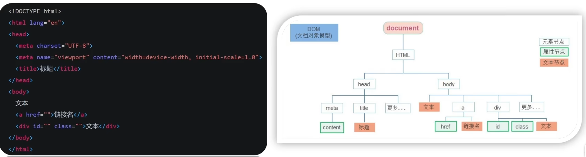

# 第11章 Web API基本认知

## 11.1、作用和分类

- 作用：就是使用JS去操作html和浏览器
- 分类：<span style="color:red;font-weight:bold;">DOM</span>（文档对象模型）、<span style="color:red;font-weight:bold;">BOM</span>（浏览器对象模型）
- JavaScript
    - ECMAScript：JavaScript语言基础
    - Web APIs
        - DOM：文档对象模型
        - BOM：浏览器对象模型


## 11.2、什么是DOM

- DOM（Document Object Model——<span style="color:red;font-weight:bold;">文档对象模型</span>）是用来呈现以及与任意HTML或XML文档交互的API。
- 白话文：DOM是浏览器提供的一套专门用来<span style="color:red;font-weight:bold;">操作网页内容</span>的功能
- DOM作用：
    - 开发网页内容特效和实现用户交互。

## 11.3、DOM树

- DOM树是什么？
    - 将HTML文档以树状结构直观的表现出来，我们称之为文档树或DOM树。
    - 描述网页内容关系的名词。
    - 作用：<span style="color:red;font-weight:bold;">文档树直观的体现了标签与标签之间的关系</span>



## 11.4、DOM对象（重要）

- DOM对象：浏览器根据html标签生成的<span style="color:red;">JS对象</span>
    - 所有的标签属性都可以在这个对象上面找到。
    - 修改这个对象的属性会自动映射到标签身上。
- DOM的核心思想
    - 把网页内容当做<span style="color:red;">对象</span>来处理
- document对象
    - 是DOM里提供的一个<span style="color:red;">对象</span>
    - 所以它提供的属性和方法都是<span style="color:red;font-weight:bold;">用来访问和操作网页内容的</span>
        - 例如：document.write()
    - 网页所有内容都在document里面

### 11.4.1、获取DOM元素

- 根据CSS选择器来获取DOM元素（重点）

    - **语法：**

  ```js
  document.querySelector("css选择器");
  ```

    - **参数：**包含一个或多个有效的CSS选择器<span style="color:red;font-weight:bold;">字符串</span>
    - **返回值：**CSS选择器匹配的<span style="color:red;font-weight:bold;">第一个元素</span>，一个HTMLElement对象。如果没有匹配到，则返回null。

- 选择匹配到多个元素

    - **语法：**

  ```js
  document.querySelectorAll("css选择器");
  ```

    - **参数：**包含一个或多个有效的CSS选择器<span style="color:red;font-weight:bold;">字符串</span>

    - **返回值：**CSS选择器匹配的<span style="color:red;font-weight:bold;"> NodeList 对象集合</span>

    - 得到的是一个<span style="color:red;font-weight:bold;">伪数组</span>

        - 有长度有索引的数组
        - 但是没有pop() push()等数组方法

      **想要得到里面的每一个对象，则需要遍历（for）的方式获得。**

  注意事项：哪怕只有一个元素，通过querySelectAll()获取过来的也是一个<span style="color:red;font-weight:bold;">伪数组</span>，里面只有一个元素而已。

- 其他获取DOM元素方法（了解）

    - 根据id获取一个元素

  ```js
  document.getElementById("nav");
  ```

    - 根据标签获取一类元素，获取页面所有div

  ```js
  document.getElementsByTagName("div");
  ```

    - 根据类名获取元素，获取页面所有类名为w的元素

  ```js
  document.getElementsByClassName("w");
  ```

### 11.4.2、操作元素内容

目标：能够修改元素的文本更换内容

- DOM对象都是根据标签生成的，所以操作标签，本质上就是操作DOM对象。

- 就是操作对象使用的点语法。

- 如果想要修改标签元素里面的<span style="color:red;font-weight:bold;">内容</span>，则可以使用如下几种方式：

    - 对象.innerText 属性

        - 将文本内容添加/更新到任意标签位置
        - 显示纯文本，不解析标签

      ```js
      const info = document.querySelector(".info");
      info.innerText = "哈喽！";
      ```

    - 对象.innerHTML 属性

        - 将文本内容添加/更新到任意标签位置。
        - 会解析标签，多标签建议使用模板字符。

      ```js
      const info = document.querySelector(".info");
      info.innerHTML = `<strong>哈喽</strong>`;
      ```

### 11.4.3、操作元素属性

- 操作元素常用属性

    - **语法：**

  ```js
  对象.属性 = 值
  ```

    - 最常见的属性比如：href、title和src等

  ```js
  img.src = `./imgs/${random}.webp`;
  ```

- 操作元素样式属性

    - 通过style属性操作CSS

      ```js
      box.style.width = "300px";
      box.style.backgroundColor = "hotpink";
      ```

    - 操作类名（className）操作CSS

        - 如果修改的样式比较多，直接通过style属性修改比较繁琐，我们可以通过借助于CSS类名的形式。

        - **语法：**

      ```js
      // active 是一个css类名
      元素.className = "active"
      ```

        - 注意：
            - 由于class是关键字，所以使用className去代替。
            - className是使用新值<span style="color:red;font-weight:bold;">替换</span>旧值，如果需要添加一个类，需要保留之前的类名。

    - 通过classList操作类控制CSS

        - 为了解决className容易覆盖以前的类名的问题，我们可以通过classList方式追加和删除类名。
        - **语法：**

      ```js
      // 追加一个类
      元素.classList.add('类名')
      // 删除一个类
      元素.classList.remove('类名')
      // 切换一个类
      元素.classList.toggle('类名')
      // 查看是否包含某个类，如果包含返回true，否则返回false
      元素.classList.contains()
      ```

- 操作表单元素属性

    - 表单很多情况，也需要修改属性，比如，点击眼睛，看到密码，本质是把表单类型转换为文本框。

    - 正常的有属性有取值的，跟其他的标签属性没任何区别。

        - 获取：DOM对象.属性名
        - 设置：DOM对象.属性名=新值

      ```js
      uname.value = "我要买电脑";
      uname.type = "password";
      ```

    - 表单属性中添加就有效果，移除就没有效果，一律使用布尔值表示，如果true代表添加了该属性，如果是flase，代表移除了该属性。

    - 比如：disabled、checked、selected

- 自定义属性

    - **标准属性：**标签天生自带的属性，比如 class、id、title等，可以直接使用点语法操作，比如：disabled、checked、selected

    - **自定义属性：**

        - 在html5中推出来了专门的data-自定义属性
        - 在标签上一律以data-开头
        - 在DOM对象上一律以dataset对象方式获取

      ```html
      <body>
          <div class="box" data-id="10">
              盒子
          </div>
          <script>
              const box = document.querySelector(".box");
              console.log(box.dataset.id);
          </script>
      </body>
      ```