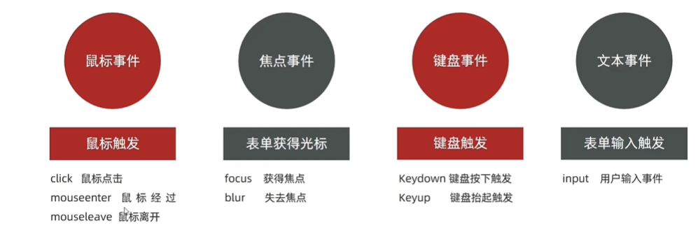

# 第13章 事件监听（绑定）

## 13.1、事件监听

目标：能够给DOM元素添加事件监听。

- 什么是事件？
    - 事件时在编程时系统内发生的<span style="color:red;">动作</span>或者发生的事情。比如：用户在网页上<span style="color:red;">单击</span>一个按钮。

- 什么是事件监听？
    - 就是让程序检测是否有事件产生，一旦有事件触发，就立即调用一个函数做出响应，也称为绑定事件或者注册事件。
        - 比如鼠标经过显示下拉菜单。
        - 比如点击可以播放轮播图等等。
- **语法：**

```js
元素对象.addEventListener("事件类型", 要执行的函数）;
```

- 事件监听三要素：

    - **事件源：**哪一个DOM元素触发了事件，触发事件的DOM元素。

    - **事件类型：**用什么方式触发，比如鼠标单击click、鼠标经过mouseover等。
    - **事件调用的函数：**要做什么事情。

```html
<button>按钮</button>
<script>
	const btn = document.querySelector(".btn");
    // 修改元素像是
    btn.addEventListener("click", function(){alert("点击了！");});
</script>
```

> 注意：
>
> - 事件类型要<span style="color:red;font-weight:bold;">加引号</span>
> - <span style="color:red;font-weight:bold;">函数是点击之后再去执行，每次点击都会执行一次</span>

## 13.2、事件监听版本

- DOM L0

事件源.on事件=function(){}

- DOM L2

事件源.addEventListener(事件, 事件处理函数)

- 区别：

on方式会被覆盖，<span style="color:red;">addEventListener</span>方式可以绑定多次，拥有事件更多特性，<span style="color:red;font-weight:bold;">推荐使用</span>

- 发展史：
    - DOM L0：是DOM的发展的第一个版本；L：level。
    - DOM L1：DOM级别1，于1998年10月1日称为W3C推荐标准。
    - DOM L2：使用addEventListener注册事件。
    - DOM L3：DOM3级事件模块在DOM2级事件的基础上重新定义了这些事件，也添加了一些事件的新类型。

## 13.3、事件类型



[MDN事件类型介绍](https://developer.mozilla.org/zh-CN/docs/Web/API/Element/mousemove_event)

## 13.4、事件对象

目标：能说出什么是事件对象。

- 事件对象是什么？
    - 也是一个对象，这个对象里有事件触发时的相关信息。
    - 例如：鼠标点击事件中，事件对象就存了鼠标点在哪个位置等信息。
- 使用场景
    - 可以判断用户按下哪个键，比如按下回车键可以发布新闻。
    - 可以判断鼠标点击了哪个元素，从而做相应的操作。

**1、获取事件对象**

- 语法：如何获取

    - 在事件绑定的回调函数的第一个参数就是事件对象。
    - 一般命名为event、ev、e。

  ```js
  元素.addEventListener("click", function(e){});
  ```

- 部分常用属性
    - type
        - 获取当前的事件类型
    - button
        - 记录着鼠标按下的是哪一个键
        - 0：左键
        - 1：中建（滚轮）
        - 2：右键
    - clientX/clientY
        - 获取光标相对于浏览器可见窗口左上角的位置。会受页面滚动影响。
    - offsetX/offsetY
        - 获取光标相对于当前DOM元素左上角的位置。
    - pageX/pageY
        - 获取光标相对于页面本身（而非视口）的左上角的位置。不受页面滚动影响。
    - screenX/screenY
        - 获取光标相对于整个电脑屏幕左上角的位置。
    - key
        - 用户按下的键盘键的值
        - 现在不提倡使用keyCode。

## 13.5、环境对象

**目标：**能够分析判断函数运行在不同环境中<span style="color:red;font-weight:bold;">this</span>所指代的对象。

**环境对象：**指的是函数内部特殊的<span style="color:red;font-weight:bold;">变量this</span>，它代表着当前函数运行时所处的环境。

**作用：**弄清楚<span style="color:red;font-weight:bold;">this</span>的指向，可以让我们代码更简洁。

- 函数的调用方式不同，this指代的对象也不同。
- <span style="color:red;font-weight:bold;">[谁调用，this就是谁]</span>是判断this指向的粗略规则。
- 直接调用函数，其实相当于是`window.函数`，所以this指代window。

## 13.6、回调函数

目标：能够说出什么是回调函数。

如果将函数A作为参数传递给含B时，我们称函数A为<span style="color:red;font-weight:bold;">回调函数</span>

简单理解：当一个函数作为参数来传递给另外一个函数时，这个函数就是<span style="color:red;font-weight:bold;">回调函数</span>

- 常见的使用场景：

```js
function fn() {
    console.log("我是回调函数...");
}
// fn 传递给setInterval，fn就是回调函数
setInterval(fn, 1000);

box.addEventListener("click", function(){ console.log("我也是回调函数..."); });
```
