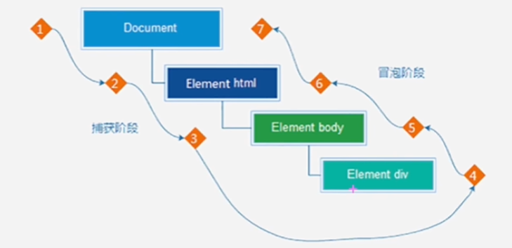

# 第14章 事件流

## 14.1、事件流与两个阶段说明

- <span style="color:red;font-weight:bold;">事件流</span>指的是事件完整执行过程中的流动路径
- 说明：假设网页里有个div，当触发事件时，会经历两个阶段，分别是捕获阶段、冒泡阶段。
- 简单来说：捕获阶段时 <span style="color:red;">从父到子</span>，冒泡阶段是 <span style="color:red;">从子到父</span>。
- <span style="color:red;font-weight:bold;">实际的工作中，都是使用冒泡为主</span>



## 14.2、事件捕获

目标：简单了解事件捕获执行过程。

- **事件捕获概念：**
    - 从DOM的根元素开始去执行对应的事件（从外到里）。
- 事件捕获需要写对应代码才能看到效果。
- 代码：

```js
DOM.addEventListener(事件类型, 事件处理函数, [是否使用捕获机制]]);
```

- 说明：
    - addEventListener第三个参数传入<span style="color:red;">true</span>代表是捕获阶段触发（很少的使用）。
    - 若传入false代表冒泡阶段触发，默认就是false。
    - 若是用L0事件监听，则只有冒泡阶段，没有捕获。


## 14.3、事件冒泡

目标：能够说出事件冒泡的执行过程。

- **事件冒泡概念：**
    - 当一个元素的实际被触发时，同样的事件将会在该元素的所有祖先元素中依次被触发。这一过程被称为事件冒泡。

- **简单理解；**当一个元素触发事件后，会依次向上调用所有父级元素的<span style="color:red;font-weight:bold;">同名事件</span>

- 事件冒泡是默认存在的
- L2事件监听第三个参数是false，或者默认都是冒泡。

```js
const father = document.querySelector(".father");
const son = document.querySelector(".son");
document.addEventListener("click", function () { alert("document"); });
father.addEventListener("click", function () { alert("father"); });
son.addEventListener( "click", function () { alert("son"); });
```


## 14.4、阻止冒泡

目标：能够写出阻止冒泡的代码。

- **问题：**因为默认就有冒泡模式的存在，所以容易导致事件影响到父级元素。
- **需求：**若想把事件就限制在当前元素内，就需要阻止事件冒泡。
- **前提：**阻止事件冒泡需要拿到事件对象。
- **语法：**

```js
事件对象.stopPropagation();
```

- **注意：**此方法可以阻断事件流动传播，不光在冒泡阶段有效，捕获阶段也有效。

## 14.5、解绑事件

- on事件方式，知己诶使用null覆盖后就可以实现事件的解绑。

**语法：**

```js
// 绑定事件
btn.onclick = function() {
    alert("点击来了");
}
// 解绑事件
btn.oncliick = null;
```

- addEventListener方式，必须使用：`removeEventListener(事件类型, 事件处理函数, [获取捕获或者冒泡阶段])`

```js
function func() {
    alert("点击了");
}
// 绑定事件
btn.addEventListener("click", fn);
// 解除绑定
btn.removeEventListener("click", fn);
```

<span style="color:red;font-weight:bold;">注意：匿名函数无法被解绑</span>

## 14.6、鼠标经过事件的区别

- 鼠标经过事件：
    - mouseover和mouseout会有冒泡效果
    - mouseenter和mouseleave没有冒泡效果（推荐）

## 14.7、两种注册事件的区别

- 传统on注册（L0）
    - 同一个对象，后面注册的事件会覆盖前面注册的（同一个事件）
    - 直接使用null覆盖后就可以实现事件的解除绑定
    - 都是冒泡阶段执行的
- 事件监听注册（L2）
    - 语法：addEventListener(事件类型, 事件处理函数, 是否使用捕获）。
    - 后面注册的事件，不会覆盖前面注册的事件（同一个事件）。
    - 可以通过第三个参数去确定是在冒泡或者捕获阶段执行。
    - 必须使用removeEventListener(事件类型, 事件处理函数, [获取捕获或者冒泡阶段])
    - 匿名函数无法被解绑