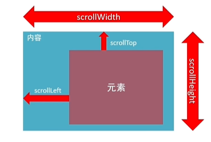
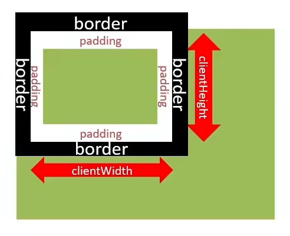
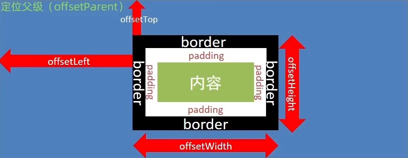

# 第15章 事件其他知识

## 15.1、事件委托

目标：能够说出事件委托的好处。

事件委托是利用事件流的特征解决一些开发需求的知识技巧。

- 优点：减少注册次数，可以提高程序性能。
- 原理：事件委托其实是利用事件冒泡的特点。
    - 给<span style="color:red;font-weight:bold;">父元素注册事件</span>，当我们触发了子元素的时候，会冒泡到父元素身上，从而触发父元素的事件。
- 实现：事件对象.target.tagName可以获取真正触发事件的元素。

## 15.2、阻止默认行为

**我们某些情况下需要**阻止默认行为的发生，比如：阻止链接的跳转，表单域跳转。

- **语法：**

```js
e.preventDefault();
```

```html
<form action="http://www.baidu.com">
    <input type="submit" value="提交">
</form>
<script>
    const form = document.querySelector("form");
    form.addEventListener("click", function(e){
        // 阻止表单默认提交行为
        e.preventDefault();
    });
</script>
```

## 15.3、其他事件

### 15.3.1、页面加载事件

**1、load事件：**

- 加载外部资源（如图片、外链CSS和JavaScript等）加载完毕时触发的事件。

- 为什么要学？

    - 有些时候需要等页面资源全部处理完了做一些事情。

    - 老代码喜欢把script写在head中，这时候直接找dom元素找不到。

    - 事件名：<span style="color:red;font-weight:bold;">load</span>

    - 监听页面所有资源加载完毕：

        - 给window添加load事件。

      ```js
      // 页面加载事件
      window.addEventListener("load", function(){
          // 执行的操作
      });
      ```

        - 注意：不光可以监听整个页面资源加载完毕，也可以针对某个资源绑定load事件。

**2、DOMContentLoaded事件：**

- 当初始的HTML文档被完全加载和解析完成之后，DOMContentLoaded事件被触发，而无需等待样式表、图像等完全加载。
- 事件名：DOMContentLoaded

```js
document.addEventListener("DOMContentLoaded", function () {
    // 执行的操作
});
```

### 15.3.2、页面滚动事件

- 滚动条在滚动的时候持续触发的事件。
- 为什么要学？
    - 很多网页需要检测用户把网页滚动到某个区域后做一些处理，比如固定导航栏，比如返回顶部。
- 事件名：<span style="color:red;font-weight:bold;">scroll</span>
- 监听整个页面滚动：

```js
// 页面滚动事件
window.addEventListener("scroll", function () {
    console.log("我滚动了！");
});
```

- 给window或document添加scroll事件。

- **scrollLeft和scrollTop（属性）**

    - 获取被卷去的大小。
    - 获取元素内容往左、往上滚出去看不到的距离。
    - 这两个值是可<span style="color:red;font-weight:bold;">读写</span>的。

  

    - 尽量在scroll事件里面获取被卷去的距离。

  ```js
  div.addEventListener("scroll", function(){
      console.log(this.scrollTop);
  });
  ```


- 开发中，我们经常检测页面滚动的距离，比如页面滚动100像素，就可以显示一个元素，或者固定一个元素。

```js
// 页面滚动事件
window.addEventListener("scroll", function () {
    // 我想知道页面到底滚动了多少像素，被卷去了多少 scrollTop
    // 获取 html 元素写法【特殊用法】
    let n = document.documentElement.scrollTop;
    console.log(n);
});
```

- scrollTo()方法可以把内容滚动到指定的坐标。

    - 语法：

  ```js
  元素.scrollTo(x,y)
  ```

```js
// 让页面滚动到 y 轴 1000 像素的位置
window.scrollTo(0, 1000)
```

### 15.3.3、页面尺寸事件

- 会在窗口尺寸改变的时候触发事件：

    - <span style="color:red;font-weight:bold;">resize</span>

  ```js
  window.addEventListener("resize", function(){
      // 执行的代码
  });
  ```

    - 获取宽高：

        - 获取元素的可见部分宽高（不包含边框，margin，滚动条等）
        - **clientWidth 和 clientHeight**

      

### 15.3.4、元素尺寸与位置

- 使用场景：
    - 前面案例滚动多少距离，都是我们自己算的，最好是页面滚动到某个元素，就可以做某些事情。
    - 简单说，就是通过JS的方式，得到<span style="color:red;font-weight:bold;">元素在页面中的位置</span>
    - 这样我们可以做，页面滚动到这个位置，就可以做没某些操作，省去计算了。
- 获取宽高：
    - 获取元素的自身宽高、包含元素自身设置的宽高、padding、border
    - **offsetWidth和offsetHeight**
    - 获取出来的是数值，方便计算。
    - 注意：获取的是可视宽高，如果盒子是隐藏的，获取的结果是0。
- 获取位置：
    - 获取元素距离自己<span style="color:red;font-weight:bold;">定位父级元素</span>的左、上距离。
    - **offsetLeft和offsetTop 注意是只读属性。**

- 获取位置2：

    - element.getBoundingClientRect() 方法返回元素的大小及其<span style="color:red;font-weight:bold;">相对于视口</span>的位置。

  


### 15.3.5、尺寸与位置总结1

| 属性                                                         | 作用                                                         | 说明                                                         |
| ------------------------------------------------------------ | ------------------------------------------------------------ | ------------------------------------------------------------ |
| scrollLeft和scrollTop                                        | 被卷去的头部和左侧                                           | 配合页面滚动来用，<span style="color:red;font-weight:bold;">可读写</span> |
| clientWidth和clientHeight                                    | 获得元素宽度和高度                                           | 不包含border,margin,滚动条；用于JS获取元素大小，**只读属性** |
| offsetWidth和offsetHeight                                    | 获得元素宽度和高度                                           | <span style="color:red;font-weight:bold;">包含border、padding、滚动条等，只读属性</span> |
| <span style="color:red;font-weight:bold;">offsetLeft和offsetTop</span> | 获取元素距离自己定位父级元素的左、上距离。                   | 获取元素位置的时候使用，**只读属性**。不受页面滚动影响。     |
| getBoundingClientRect()                                      | 获取元素的大小及其<span style="color:red;font-weight:bold;">相对于视口</span>的位置 | 会受页面滚动影响。                                           |