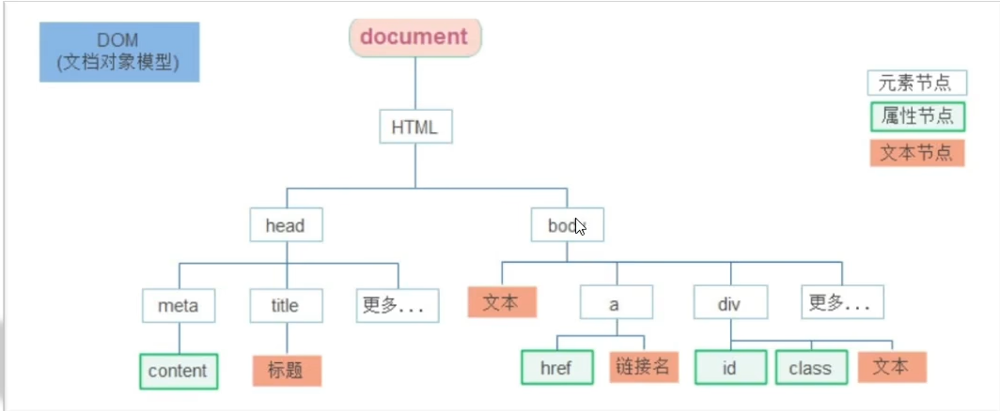

# 第17章 节点操作

## 17.1、DOM节点

- DOM节点
    - DOM树里面每一个内容都称之为节点。
- 节点类型
    - 元素节点
        - 所有的标签，比如body、div
        - html是根节点
    - 属性节点
        - 所有的属性，比如href
    - 文本节点
        - 所有的文本
    - 其他



## 17.2、查找节点

节点关系：针对的找亲戚，返回的都是对象。

### 17.2.1、父节点

- **父节点查找：**

    - parentNode属性
    - 返回最近一级的父节点，找不到返回为null

  ```js
  子元素.parentNode
  ```

### 17.2.2、子节点

- **子节点查找：**

    - childNodes

        - 获得所有子节点、包括文本节点（空格、换行）、注释节点等。

    - <span style="color:red;font-weight:bold;">children属性（重点）</span>

        - 仅获得所有元素节点
        - 返回的还是一个伪数组

      ```js
      父元素.children
      ```

### 17.2.3、兄弟节点

- **兄弟关系查找：**
    - 下一个兄弟节点
        - nextElementSibling 属性
    - 上一个兄弟节点
        - previousElementSibling 属性

## 17.3、增加节点

目标：能够具备根据需求新增节点的能力。

- 很多情况下，我们需要在页面中增加元素

    - 比如：点击发布按钮，可以新增一条信息。

- 创建节点

    - 即创造出一个新的网页元素，再添加到网页内，一般先创建节点，然后插入节点。
    - 创建元素节点方法：

  ```js
  // 创造一个新的元素节点
  document.createElement("标签名");
  ```

- 追加节点

    - 要想在界面看到，还得插入到某个父元素中。
    - 插入到父元素的最后一个子元素：

  ```js
  // 插入到这个父元素的最后
  父元素.appendChild(要插入的元素)
  ```

    - 插入到父元素中某个子元素的前面：

  ```js
  // 插入到某个子元素的前面
  父元素.insertBefore(要插入的元素, 在哪个元素前面)
  ```


- 特殊情况下，我们新增节点，按照如下操作：

    - 复制一个原有的节点
    - 把赋值的节点放入到指定的元素内部

- 克隆节点

  ```js
  // 克隆一个已有的元素节点
  元素.cloneNode(布尔值)
  ```

  cloneNode会克隆出一个跟原标签一样的元素，括号内传入布尔值。

    - 若为true，则代表克隆时会包含后代节点一起克隆
    - 若为false，则代表克隆时不包含后代节点
    - 默认为false

## 17.4、删除节点

目标：能够具备根据要求删除节点的能力。

- 若一个节点在页面中已不需要时，可以删除它。
- 在JavaScript原生DOM操作中，要删除元素必须通过<span style="color:red;font-weight:bold;">父元素删除</span>
- **语法：**

```js
父元素.removeChild(要删除的元素)
```

- 注：
    - 如不存在父子关系则删除不成功
    - 删除节点和隐藏节点（display:none）有区别的：隐藏节点还是存在的，但是删除，则从html中删除节点。
