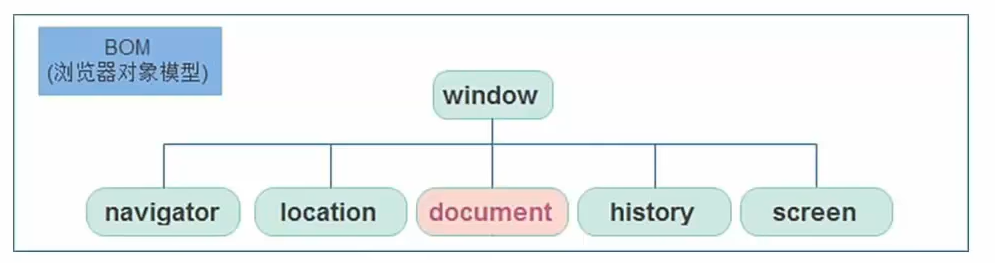
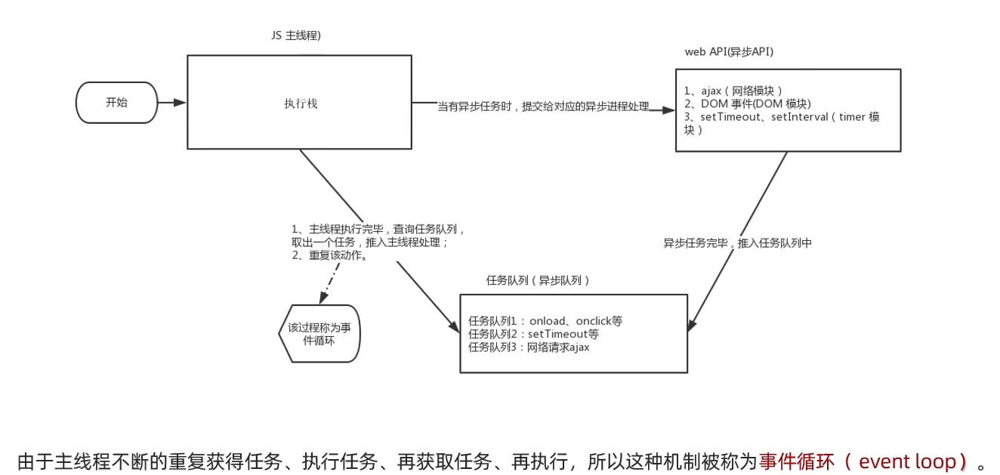

# 第19章 BOM-Window对象

## 19.1、BOM

- BOM（Browser Object Model）是浏览器对象模型



- window对象是一个全局对象，也可以说是JavaScript中的顶级对象。
- 像document、alert()、console.log()这些都是window的属性，基本BOM的属性和方法都是window的。
- 所有通过var定义在全局作用域中的变量、函数都会变成window对象的属性和方法。
- window对象下的属性和方法调用的时候可以省略window。


## 19.2、定时器-延时函数

- JavaScript内置的一个用来让代码延迟执行的函数，叫setTimeout
- **语法：**

```js
setTimeout(回调函数, 等待的毫秒数)
```

- setTimeout仅仅执行一次，所以可以理解为就是把一段代码延迟执行，平时省略window。

- **清除延时函数：**

```js
let timer = setTimeout(回调函数, 等待的毫秒数)
clearTimeout(timer);
```

- **注意点：**
    - 延时器需要等待，所以后面的代码先执行。
    - 每一次调用延时器都会产生一个新的延时器。

## 19.3、JS执行机制

JavaScript语言的一大特点就是<span style="color:red;font-weight:bold;">单线程</span>，也就是说：<span style="color:red;font-weight:bold;">同一个时间只能做一件事</span>

这是因为JavaScript这门脚本语言诞生的使命所致——JavaScript是为处理页面中用户的交互，以及操作DOM而诞生的。比如我们对某个DOM元素进行添加和删除的操作，不能同时进行。应该先进行添加，之后再删除。

单线程意味着，所有任务需要排队，前一个任务结束，才会执行后一个任务。这样所导致的问题是：如果JS执行的时间过长，这样就会造成页面的渲染不连贯，导致页面渲染加载阻塞的感觉。


为了解决这个问题，利用多核CPU的计算能力，HTML5提出Web Worker标准，允许JavaScript脚本创建多个线程。于是，JS中出现了<span style="color:red;font-weight:bold;">同步</span>和<span style="color:red;font-weight:bold;">异步</span>。

**同步**

前一个任务结束后再执行后一个任务，程序的执行顺序与任务的排列顺序是一致的、同步的。比如做饭的同步做法：我们要烧水煮饭，等水开了（10分钟之后），再去切菜，炒菜。

**异步**

你在做一件事情时，因为这件事情会花费很长时间，在做这件事的同时，你还可以去处理其他事情。比如做饭的异步做法，我们在烧水的同时，利用这10分钟，去切菜，炒菜。

**同步任务**

同步任务都在主线程上执行，形成一个<span style="color:red;font-weight:bold;">执行栈</span>。

**异步任务**

JS的异步是通过回调函数实现的。

一般而言，异步任务有以下三种类型：

1、普通事件，如click、resize等

2、资源加载，如load、error等

3、定时器，包括setInterval()、setTimeout()等。

异步任务相关添加到<span style="color:red;font-weight:bold;">任务队列</span>中（任务队列也称为消息队列）。


1）先执行<span style="color:red;font-weight:bold;">执行栈中的同步任务</span>。

2）异步任务放入任务队列中。

3）一旦执行栈中的所有同步任务执行完毕，系统就会按次序读取<span style="color:red;font-weight:bold;">任务队列</span>中的异步任务，于是被读取的异步任务结束等待状态，进入执行栈，开始执行。



## 19.4、location对象

- location的数据类型是对象，它拆分并保存了URL地址的各个组成部分。

- 常用属性和方法：

    - href属性获取完整的URL地址，对其赋值时用于地址的跳转。

  ```js
  // 可以得到当前文件URL地址
  console.log(location.href);
  // 可以通过js方式跳转到目标地址
  location.href='http://www.itcast.cn';
  ```

    - search属性获取地址中携带的参数，符号 ? 后面部分

  ```js
  console.log(location.search);
  ```

    - hash属性获取地址中的哈希值，符号#后面部分。

  ```js
  console.log(location.hash);
  ```

    - reload方法用来刷新当前页面，传入参数true时表示强制刷新。

  ```html
  <button>点击刷新</button>
  <script>
      let btn = document.querySelector("button");
      btn.addEventListener("click", function(){
          location.reload(true);
          // 强制刷新，类似 Ctrl+F5
      })
  </script>
  ```

## 19.5、navigator对象

- navigator的数据类型是对象，该对象下记录了浏览器自身的相关信息。

- **常用属性和方法：**

    - 通过userAgent检测浏览器的版本及平台

  ```js
  // 检测 userAgent （浏览器信息）
  !(function () {
      const userAgent = navigator.userAgent;
      // 验证是否为 Android 或 iPhone
      const android = userAgent.match(/(Android);?[\s\/]+([\d.]+)?/);
      const iphone = userAgent.match(/(iPhone\sOS)\s([\d_]+)/);
      // 如果是 Android 或 iPhone，则跳转至移动站点
      if (android || iphone) {
          location.href = "http://m.itcast.cn";
      }
  })();
  ```

## 19.6、history对象

- history的数据类型是对象，主要管理丽水记录，该对象与浏览器地址栏的操作相对应，如前进、后退、历史记录等。
- **常用属性和方法：**

| history对象方法 | 作用                                                         |
| --------------- | ------------------------------------------------------------ |
| back()          | 可以后退功能                                                 |
| forward()       | 前进功能                                                     |
| go(参数)        | 前进后退功能，参数如果是1，前进1个页面；如果是-1，后退1个页面。 |