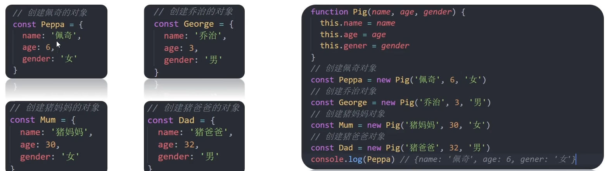
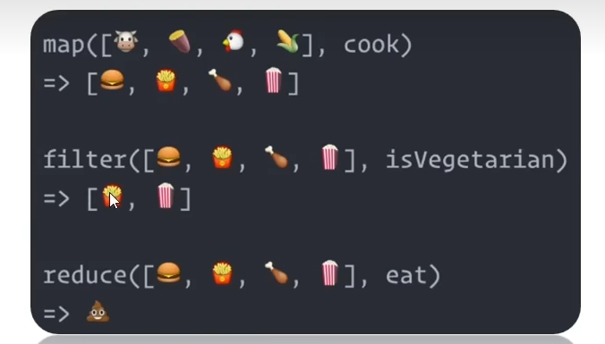
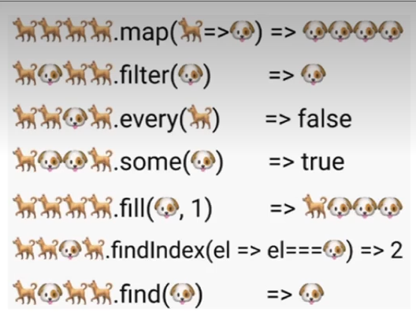

# 第23章 JS进阶`_`构造函数`_`数据常用函数

## 23.1、深入对象

### 23.1.1、创建对象三种方式

1. 利用对象字面量创建对象

```js
const o = { name: "佩奇" };
```

2. 利用 new Object创建对象

```js
const o = new Object({ name: "佩奇" });
```

3. 利用构造函数创建对象

```js
// 创建一个猪的构造函数
function Pig(uname, age) {
    this.uname = uname;
    this.age = age;
}
const peiqi = new Pig("佩奇", 6);
console.log(peiqi);
const qiaozhi = new Pig("乔治", 7);
console.log(qiaozhi);
```

### 23.1.2、构造函数

目标：能够利用构造函数创建对象。

- **构造函数：**是一种特殊的函数，主要用来初始化对象。
- **使用场景：**常规的{...}语法允许创建一个对象。比如我们创建了佩奇的对象，继续创建乔治的对象，还需要重新写一遍，此时可以通过<span style="color:red;font-weight:bold;">构造函数</span>来。<span style="color:red;font-weight:bold;">快速创建多个类似的对象</span>



- 构造函数在技术上是常规函数。
- 不过有两个约定：
    - 1.它们在命名以大写字母开头。
    - 2.它们只能由“new”操作符来执行。

**说明：**

1. 使用new关键字调用函数的行为被称为<span style="color:red;font-weight:bold;">实例化</span>
2. 实例化构造函数时没有参数时可以省略（）
3. 构造函数内部无需写return，返回值即为新创建的对象
4. 构造函数内部的return返回值无效，所以不要写return

- **实例化执行的过程：**

说明：

1. 创建新的空对象
2. 构造函数this执行新对象
3. 执行构造函数代码，修改this，添加新的属性
4. 返回新对象

```js
// 1.创建构造函数
function Pig(name) {
	this.name = name;
}
// 2.new 关键字调用函数
const peiqi = new Pig("佩奇");
```

### 23.1.3、实例成员&静态成员

- **实例成员：**

通过构造函数创建的对象称为实例对象，<span style="color:red;font-weight:bold;">实例对象中</span>的属性和方法<span style="color:red;font-weight:bold;">实例成员</span>（实例属性和实例方法）。

```js
function Person() {
    // 构造函数内部的 this 就是实例对象
    // 实例对象中动态添加属性
    this.name = "小明";
    // 实例对象中动态添加方法
    this.sayHi = function() {
        console.log("大家好！");
    }
}
// 实例化，p1是实例对象
// p1 实际就是 构造函数内部的 this
const p1 = new Person();
console.log(p1);
console.log(p1.name); // 访问实例属性
p1.sayHi(); // 调用实例方法
```

说明：

1. 为构造函数传入参数，创建结构相同但是<span style="color:red;font-weight:bold;">值不相同的对象</span>
2. 构造函数创建的实例对象<span style="color:red;font-weight:bold;">彼此独立</span>互不影响。


- **静态成员：**

<span style="color:red;font-weight:bold;">构造函数</span>的属性和方法被称为<span style="color:red;font-weight:bold;">静态成员</span>（静态属性和静态方法）。

```js
// 构造函数
function Person(name, age) {
    // 省略实例成员
}
// 静态属性
Person.eyes = 2;
Person.arms = 2;
// 静态方法
Person.walk = function() {
    console.log("^_^人都会走路...");
    // this 指向 Person
    console.log(this.eyes);
}
```

说明：

1. 静态成员只能构造函数来访问
2. 静态方法中的this指向构造函数

比如：<span style="color:red;font-weight:bold;">Date.now()、Math.PI、Math.random()</span>

## 23.2、内置构造函数

在JavaScript中<span style="color:red;font-weight:bold;">最主要</span>的数据类型有<span style="color:red;font-weight:bold;">6种</span>：

**基本数据类型：**

- 字符串（string）
- 数值（number）
- 布尔（boolean）
- undefined
- null

**引用数据类型：**

- 对象（object）

但是，我们会发现有一些特殊情况：

```js
// 普通字符串
const str = "andy";
console.log(str.length); // 4
```

其实，字符串、数值、布尔等基本类型也都有专门的构造函数，这些我们称为包装类型。

JS几乎所有的数据都可以基于构造函数创建。


### 23.2.1、内置构造函数分类

**引用类型：**

- Object
- Array
- RegExp
- Date等

**包装类型：**

- String
- Number
- Boolean等

### 23.2.2、Object

Object是内置的构造函数，用于创建普通对象。

```js
// 通过构造函数创建普通对象
const user = new Object({name: '小明', age: 15});
```

推荐使用字面量方式声明对象，而不是Object构造函数。

**三个常用静态方法：**

```js
// 想要获得对象里面的属性和值怎么做？
const o = {name: "佩奇", age: 6};
for (let k in o) {
    console.log(k); // 属性 name age
    console.log(o[k]); // 值 佩奇 6
}
```

- **Object.keys**

    - **作用：**静态方法获取对象自身的可枚举的字符串（键）属性名组成的数组。
    - **语法：**

  ```js
  const o = { uname: "pink", age: 18 };
  // 1.获得所有的属性名
  console.log(Object.keys(o)); // 返回数组  ['uname', 'age']
  ```

    - **注意：**返回的是一个数组。

- **Object.values**

    - **作用：**静态方法获取对象中所有值
    - **语法：**

  ```js
  const o = { uname: "pink", age: 18 };
  // 2.获得所有的属性值
  console.log(Object.values(o)); // ['pink', 18]
  ```

- **Object.assign**

    - **作用：**静态方法常用于对象拷贝。
    - **语法：**

  ```js
  const o = { uname: "pink", age: 18 };
  // 3.对象的拷贝
  const oo = {};
  Object.assign(oo, o);
  console.log(oo); // { uname: "pink", age: 18 }
  console.log(oo === o); // false
  Object.assign(oo, { gender: "女" });
  console.log(oo); // {uname: 'pink', age: 18, gender: '女'}
  ```

### 23.2.3、Array

Array是内置的构造函数，用于创建数组。

```js
const arr = new Array(3, 5);
console.log(arr); // [3, 5]
```

创建数组建议使用<span style="color:red;font-weight:bold;">字面量</span>创建，不用Array构造函数创建。

1. **数组常见实例方法-核心方法**

| 方法    | 作用     | 说明                                                         |
| ------- | -------- | ------------------------------------------------------------ |
| forEach | 遍历数组 | 不返回数组，经常用于<span style="color:red;font-weight:bold;">查找遍历数组元素</span> |
| filter  | 过滤数组 | <span style="color:red;font-weight:bold;">返回新数组</span>，返回的是<span style="color:red;font-weight:bold;">满足筛选条件</span>的数组元素。 |
| map     | 迭代数组 | <span style="color:red;font-weight:bold;">返回新数组</span>，返回的是处理之后的数组元素，想要使用返回的新数组。 |
| reduce  | 累计器   | 返回累计处理的结果，经常用于求和等。                         |



- reduce

    - **作用：**reduce返回**累计处理的结果**，经常用于求和等。
    - **基本语法：**

  ```js
  // arr.reduce(function(){}, 起始值);
  const total = arr.reduce(function (prev, current) {
      console.log(prev, current); // 第一次 1和5，第二次 6和8 共迭代2次
      return prev + current;
  });
  console.log(total); // 14
  ```

  ```js
  // arr.reduce(function(上一次值, 当前值){}, 起始值);
  const total = arr.reduce(function (prev, current) {
      console.log(prev, current); // 第一次 0和1，第二次 1和5， 第三次 6和8 共迭代3次
      return prev + current;
  }, 0);
  console.log(total); // 14
  ```

    - **参数：**
        - 如果有起始值，则把初始值累加到里面。
    - **reduce执行过程：**
        1. 如果<span style="color:red;font-weight:bold;">没有起始值</span>，则<span style="color:red;font-weight:bold;">上一次值是</span>数组的<span style="color:red;font-weight:bold;">数组第一个元素的值</span>
        2. 每一次循环，把<span style="color:red;font-weight:bold;">返回值</span>作为下一次循环的<span style="color:red;font-weight:bold;">上一次值</span>
        3. 如果<span style="color:red;font-weight:bold;">有起始值</span>，则起始值作为<span style="color:red;font-weight:bold;">上一次值</span>

2. **数组常见方法-其他方法**

- 实例方法<span style="color:red;font-weight:bold;">join</span>数组元素拼接为字符串，返回字符串（重点）
- 实例方法<span style="color:red;font-weight:bold;">find</span>查找元素，返回符合测试条件的第一个数组元素值，如果没有符合条件的则返回undefined（重点）
- 实例方法<span style="color:red;font-weight:bold;">every</span>检测数组是否所有元素是否都符合指定条件，如果**所有元素**都通过检测则返回true，否则返回false（重点）
- 实例方法<span style="color:red;font-weight:bold;">some</span>检测数组中是否有元素满足指定条件，如果**数组中有**元素满足条件则返回true，否则返回false。
- 实例方法<span style="color:red;font-weight:bold;">concat</span>合并两个数组，返回生成新数组。
- 实例方法<span style="color:red;font-weight:bold;">sort</span>对原数组单元值排序。
- 实例方法<span style="color:red;font-weight:bold;">splice</span>删除或替换原数组单元。
- 实例方法<span style="color:red;font-weight:bold;">reverse</span>反转数组
- 实例方法<span style="color:red;font-weight:bold;">findIndex</span>查找元素的索引值
- 实例方法<span style="color:red;font-weight:bold;">fill()</span>用一个固定值填充一个数组中从起始索引（默认为0）到终止索引（默认为array.length）内的全部元素。返回修改后的数组。



3. **数组常见方法-伪数组转换为真数组**

- 静态方法 Array.from()


### 23.2.4、String

在JavaScript中的字符串、数值、布尔具有对象的使用特征，如具有属性和方法。

```js
// 字符串类型
const str = "hello world!";
// 统计字符的长度（字符数量）
console.log(str.length);
```

之所以具有对象特征的原因是字符串、数值、布尔值类型数据是JavaScript底层使用Object构造函数“包装”来的，被称为<span style="color:red;font-weight:bold;">包装类型</span>。

1. **常见实例方法**

- 实例属性<span style="color:red;font-weight:bold;">length</span>用来获取字符串的长度（重点）
- 实例方法<span style="color:red;font-weight:bold;">split('分隔符')</span>用来将字符串拆分成数组（重点）
- 实例方法<span style="color:red;font-weight:bold;">substring(需要截取的第一个字符的索引[,结束的索引号])</span>用于字符串截取（重点）
- 实例方法<span style="color:red;font-weight:bold;">startsWith(检测字符串[,检测位置索引号])</span>检测是否以某字符开头（重点）
- 实例方法<span style="color:red;font-weight:bold;">includes(搜索的字符串[,检测位置索引号])</span>判断一个字符串是否包含在另一个字符串中，根据情况返回true或false（重点）
- 实例方法<span style="color:red;font-weight:bold;">toUpperCase()</span>用于将字母转换成大写。
- 实例方法<span style="color:red;font-weight:bold;">toLowerCase()</span>用于将字母转换成小写。
- 实例方法<span style="color:red;font-weight:bold;">indexOf()</span>检测是否包含某字符。
- 实例方法<span style="color:red;font-weight:bold;">endsWith</span>检测是否以某字符结尾。
- 实例方法<span style="color:red;font-weight:bold;">replace</span>用于替换字符串，支持正则匹配。
- 实例方法<span style="color:red;font-weight:bold;">match</span>用于查找字符串，支持正则匹配。
- 实例方法<span style="color:red;font-weight:bold;">trim()</span>方法从字符串的两端清除空格，返回一个新的字符串，而不修改原始字符串。
- 实例方法<span style="color:red;font-weight:bold;">trimStart()</span>方法会删除字符串开头的空白字符。<span style="color:red;font-weight:bold;">trimLeft()</span>是此方法的别名。
- 实例方法<span style="color:red;font-weight:bold;">trimEnd()</span>方法会删除字符串末尾的空白字符。<span style="color:red;font-weight:bold;">trimRight()</span>是这个方法的别名。
- 实例方法<span style="color:red;font-weight:bold;">slice()</span>方法提取某个字符串的一部分，并返回一个新的字符串，且不会改动原字符串。

### 23.4.5、Number

Number是内置的构造函数，用于创建数值。

常用方法：

toFixed()设置保留小数位的长度。

```js
// 数值类型
const price = 12.345;
// 保留两位小数 四舍五入
price.toFixed(2); // 12.35
```
