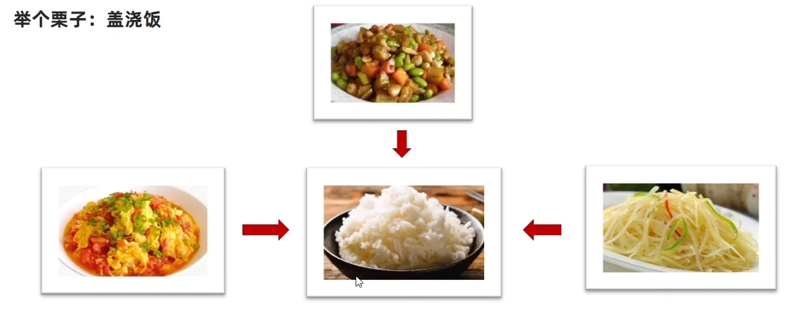
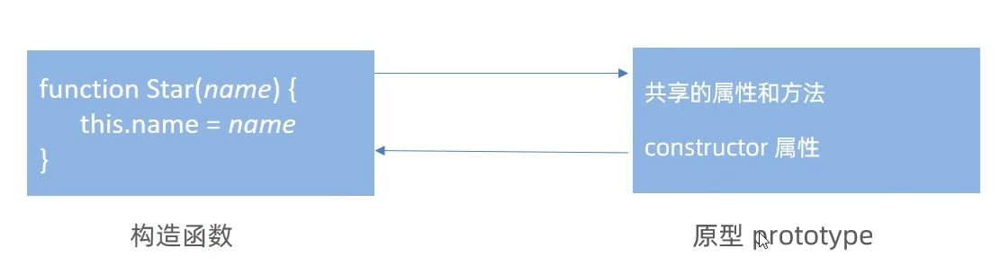
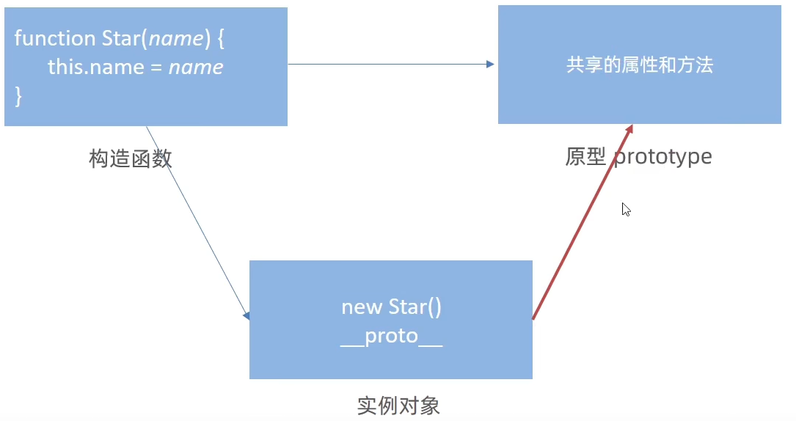
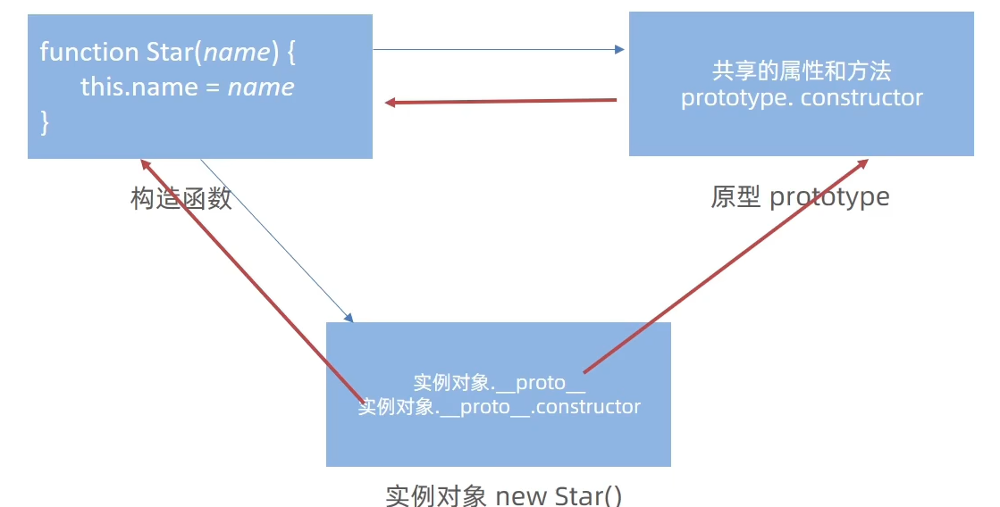
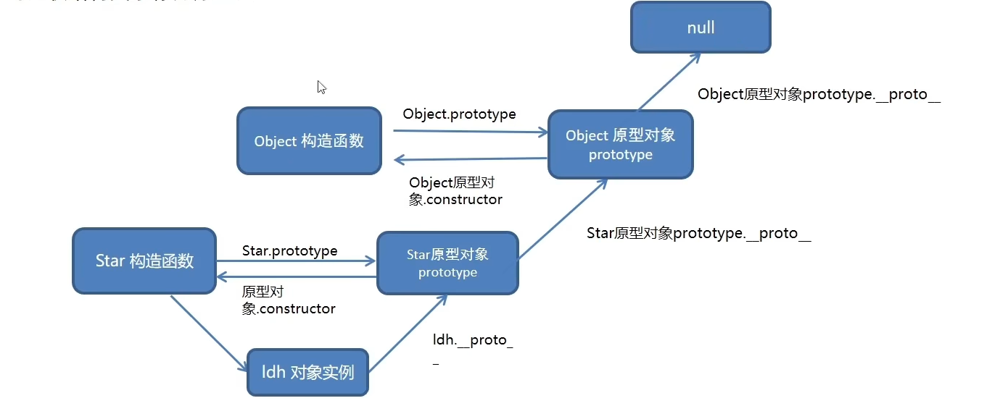

# 第24章 JS进阶`_`深入面向对象

## 24.1、编程思想

### 24.1.1、面向过程编程

目标：从生活例子了解什么是面向过程编程。

- <span style="color:red;font-weight:bold;">面向过程</span>就是分析出解决问题所需要的步骤，然后用函数把这些步骤一步一步的实现，使用的时候再一个一个的依次调用就可以了。
- **举个例子：蛋炒饭**


- <span style="color:red;font-weight:bold;">面向过程，就是按照我们分析好了的步骤，按照步骤解决问题。</span>

### 24.1.2、面向对象编程（oop）

目标：从生活例子了解什么是面向对象。

- <span style="color:red;font-weight:bold;">面向对象</span>是把事物分解成为一个个对象，然后由对象之间分工与合作。
- **举个例子：盖浇饭**



- <span style="color:red;font-weight:bold;">面向对象是以对象功能来划分问题，而不是步骤。</span>

- 在面向对象程序开发思想中，每一个对象都是功能中心，具有明确分工。

- 面向对象编程具有灵活、代码可复用、容易维护和开发的优点，更适合多人合作的大型软件项目。

- 面向对象的特性：

    - 封装性
    - 继承性
    - 多态性

  

### 24.1.3、面向过程VS面向对象

- <span style="color:red;font-weight:bold;">面向过程编程</span>
    - **优点：**性能比面向对象高，适合跟硬件联系很紧密的东西，例如单片机就采用的面向过程编程。
    - **缺点：**没有面向对象易维护、易复用、易扩展。
- <span style="color:red;font-weight:bold;">面向对象编程</span>
    - **优点：**易维护、易复用、易扩展，由于面向对象有封装、继承、多态性的特性，可以设计出低耦合的系统，使系统更加灵活、更加易于维护。
    - **缺点：**性能比面向对象低。

<span style="color:red;font-weight:bold;">生活离不开蛋炒饭，也离不开盖浇饭，选择不同而已，只不过前端不同于其他语言，面向过程更多</span>

## 24.2、构造函数

- 封装是面向对象思想中比较重要的一部分，JS面向对象可以通过<span style="color:red;font-weight:bold;">构造函数</span>实现封装。
- 同样的将变量和函数组合到了一起并能通过this实现数据的共享，所不同的是借助构造函数创建出来的实例对象之间是彼此不影响的
- <span style="color:red;font-weight:bold;">构造函数这种封装的实现方式，存在浪费内存的问题</span>

```js
// 构造函数 公共的属性和方法，封装到Star构造函数里面了
function Star(uname, age) {
    this.uname = uname;
    this.age = age;
    this.sing = function () {
        console.log("我会唱歌！");
    };
}
// 实例对象，获得了构造函数中封装的所有逻辑
const ldh = new Star("刘德华", 18);
const zxy = new Star("张学友", 19);
console.log(ldh === zxy); // false
console.log(ldh.sing === zxy.sing); // false
```

- 总结：
    1. 构造函数体现了面向对象的封装特性。
    2. 构造函数实例创建的对象彼此独立、互不影响。

<span style="color:red;font-weight:bold;">我们系统所有的对象使用同一个函数，这样就比较节省内存，那么我们要怎么样做呢？</span>

<span style="color:red;font-weight:bold;font-size:50px">答案就是prototype原型</span>

## 24.3、原型（原型对象）

**目标：**能够利用原型对象实现方法共享。

- 构造函数通过原型分配的函数是所有对象所<span style="color:red;font-weight:bold;">共享的</span>。
- JavaScript规定，<span style="color:red;font-weight:bold;">每一个构造函数都有一个prototype属性</span>，指向另一个对象，所以我们也称为原型对象。
- 这个对象可以挂载函数，对象实例化不会多次创建原型上函数，节约内存。
- <span style="color:red;font-weight:bold;">我们可以把那些不变的方法，直接定义在prototype对象上，这样所有对象的实例就可以共享这些方法。</span>
- <span style="color:red;font-weight:bold;">构造函数和原型对象中的this都指向实例化的对象</span>。

```js
// 1.公共的属性写到构造函数里面
function Star(uname, age) {
    this.uname = uname;
    this.age = age;
}
// 2.公共的方法写到原型对象上
Star.prototype.sing = function () {
    console.log("我会唱歌！");
};

// 实例对象，获得了构造函数中封装的所有逻辑
const ldh = new Star("刘德华", 18);
const zxy = new Star("张学友", 19);
console.log(ldh === zxy); // false
console.log(ldh.sing === zxy.sing); // true

console.dir(Star.prototype); // object
console.dir(Star.prototype.prototype); // undefined
```

- <span style="color:red;font-weight:bold;">构造函数和原型对象中的this都指向实例化的对象</span>。

```js
let that;
function Star(uname) {
    that = this;
    console.log(that);
    this.uname = uname;
}
Star.prototype.sing = function () {
    that = this;
    console.log(that);
};

// 构造函数里面的this就是实例对象ldh
const ldh = new Star("刘德华");
console.log(that === ldh); // true

ldh.sing();
console.log(that === ldh); // true
```

## 24.4、constructor属性

**在哪里？**每个原型对象里面都有个constructor属性（constructor构造函数）。

**作用：**该属性<span style="color:red;font-weight:bold;">指向</span>该原型对象的<span style="color:red;font-weight:bold;">构造函数，简单理解，就是指向我的爸爸，我是有爸爸的孩子</span>



**目标：**了解constructor属性的作用。

**使用场景：**

如果有多个对象的方法，我们可以给原型对象采取对象形式赋值。

但是这样就会覆盖构造函数原型对象原来的内容，这样修改后的原型对象constructor就不再指向当前构造函数了。此时，我们可以在修改后的原型对象中，添加一个constructor指向原来的构造函数。

```js
function Star(name) {
    this.name = name;
}
Star.prototype = {
    sing: function() { console.log("唱歌！"); },
    dance: function() { console.log("跳舞！"); }
}
console.log(Star.prototype.constructor); // 指向了Object
```

```js
function Star(name) {
    this.name = name;
}
Star.prototype = {
    // 手动利用constructor，指回Star构造函数
    constructor: Star,
    sing: function() { console.log("唱歌！"); },
    dance: function() { console.log("跳舞！"); }
}
console.log(Star.prototype.constructor); // 指向Star
```

## 24.5、对象原型

<span style="color:red;font-weight:bold;">对象都有一个属性 `__proto__` 指向构造函数的prototype原型对象，之所以我们对象可以使用构造函数 prototype 原型对象的属性和方法，就是因为对象有 `__proto__` 原型的存在。 </span>



**注意：**

- `__proto__`是JS非标准属性
- [[prototype]]和`__proto__`意义相同
- 用来表明当前实例对象指向哪一个原型对象prototype
- `__proto__`<span style="color:red;font-weight:bold;font-size:30px;">对象原型</span>里面也有一个constructor，<span style="color:red;font-weight:bold;">指向创建该实例对象的构造函数</span>
- <span style="color:red;font-weight:bold;">`__proto__`是只读的</span>。




## 24.6、原型继承

继承是面向对象编程的另一个特征，通过继续进一步提升代码封装的程序，JavaScript中大多是借助原型对象实现继承的特性。

龙生龙、凤生凤、老鼠的儿子会打洞，描述的正是继承的含义。

```js
// 人 父类
function Person() {
    this.eyes = 2;
    this.head = 1;
}

// 女人 构造函数 子类
function Woman() {}
Woman.prototype = new Person();
Woman.prototype.constructor = Woman;
Woman.prototype.baby = function () {
    console.log("生宝贝");
};
const red = new Woman();
console.log(red);

// 男人 构造函数 子类
function Man() {}
Man.prototype = new Person();
Man.prototype.constructor = Man;
const blue = new Man();
console.log(blue);
```

## 24.7、原型链

基于原型对象的继承使得不同构造函数的原型对象关联在一起，并且这种关联的关系是一种链式结构，我们将原型对象的链式结构关系称为原型链。

```js
// function Object() {}
function Star() {}
const ldh = new Star();

console.log(ldh instanceof Star); // true
console.log(ldh instanceof Object); // true
console.log(Array instanceof Object); // true
console.log(ldh instanceof Array); // false
console.log([1, 2, 3] instanceof Array); // true

// ==================================================

console.log(ldh.__proto__ === Star.prototype); // true
console.log(ldh.__proto__.constructor === Star); // true

console.log(Star.prototype.__proto__ === Object.prototype); // true
console.log(Star.prototype.__proto__.constructor === Object); // true

// ==================================================

console.log(Object.__proto__); // ƒ () { [native code] }
console.log(Object.prototype); // {constructor: ƒ, __defineGetter__: ƒ, __defineSetter__: ƒ, hasOwnProperty: ƒ, __lookupGetter__: ƒ, …}
console.log(Object.prototype.__proto__); // null

// ==================================================

console.log(Array.prototype.constructor === Array); // true
console.log(Array.prototype.__proto__.constructor === Object); // true
// prettier-ignore
console.log( Array.prototype.__proto__ === Object.prototype ); // true
console.log(Array.prototype.__proto__.__proto__); // null
```




**原型链-查找规则：**

1. 当访问一个对象的属性（包括方法）时，首先查找这个<span style="color:red;font-weight:bold;">对象自身</span>有没有该属性。
2. 如果没有就查找它的原型（也就是`__proto__`指向的<span style="color:red;font-weight:bold;">prototype对象</span>）
3. 如果还没有就查找原型对象的原型（<span style="color:red;font-weight:bold;">Object的原型对象</span>）
4. 以此类推，一直查找到Object的原型对象为止（<span style="color:red;font-weight:bold;">null</span>）
5. `__proto__`对象原型的意义就在于为对象成员查找机制提供一个方向，或者说一条路线。
6. 可以使用<span style="color:red;font-weight:bold;">instanceof</span>运算符用于检测构造函数的prototype属性是否出现在某个实例对象的原型链上。
