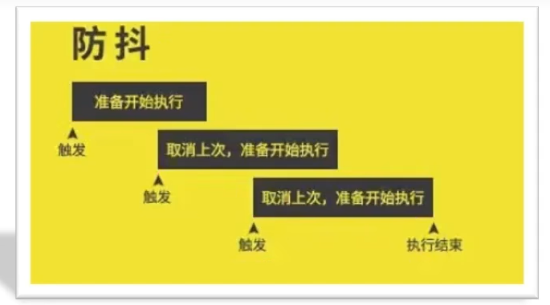
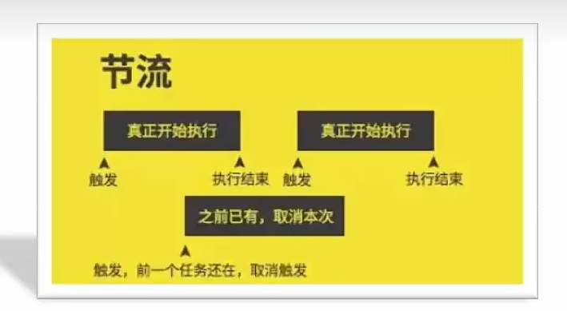

# 第25章 JS进阶_高阶技巧

## 25.1、深浅拷贝

<span style="color:red;font-weight:bold;">首先浅拷贝和深拷贝只针对引用类型。</span>

开发中我们经常需要赋值一个对象。如果直接用赋值会有如下问题：

```js
const obj = {
    uname: "pink",
    age: 18,
};
const o = obj;
console.log(o); // {uname: 'pink', age: 18}
o.age = 20;
console.log(o); // {uname: 'pink', age: 20}
console.log(obj); // {uname: 'pink', age: 20}
```

### 25.1.1、浅拷贝

浅拷贝：拷贝的是地址。

**常见方法：**

1. 拷贝对象： Object.assign() / 展开运算符 {...obj} 拷贝对象
2. 拷贝数组：Array.prototype.concat() 或者 [...arr]

```js
const obj = {
    uname: "pink",
    age: 18,
    family: { baby: "小pink" },
};
// 浅拷贝
// const o = { ...obj };
// console.log(o.age, o.family.baby); // // 18 '小pink'
// o.age = 20;
// o.family.baby = "小小的pink";
// console.log(o.age, o.family.baby); // 20 '小小的pink'
// console.log(o.age, o.family.baby); // 20 '小小的pink'

const o = {};
Object.assign(o, obj);
console.log(o.age, o.family.baby); // 18 '小pink'
o.age = 20;
o.family.baby = "小小的pink";
console.log(o.age, o.family.baby); // 20 '小小的pink'
console.log(o.age, o.family.baby); // 20 '小小的pink'
```

<span style="color:red;font-weight:bold;">如果是简单数据类型拷贝值，引用数据类型拷贝的是地址</span>（简单理解：如果是单层对象，没问题；如果是多层，就有问题了）

### 25.1.2、深拷贝

深拷贝：拷贝的是对象，不是地址。

**常见方法：**

1. 通过递归实现深拷贝
2. lodash/cloneDeep
3. 通过JSON.stringify()实现

**1.通过递归实现深拷贝**

**函数递归：**

<span style="color:red;font-weight:bold;">如果一个函数在内部可以调用其本身，那么这个函数就是递归函数。</span>

- 简单理解：函数内部自己调用自己，这个函数就是递归函数。

- 递归函数的作用和循环效果类似。

- 由于递归很容易发生“栈溢出”错误（stack overflow)，所以<span style="color:red;font-weight:bold;">必须要加退出条件 return</span>

  <span style="color:red;font-weight:bold;">Uncaught RangeError: Maximum call stack size exceeded</span>

```js
// 拷贝函数
function deepCopy(newObj, oldObj) {
    for (let k in oldObj) {
        // k 属性名 oldObj[k] 属性值
        if (oldObj[k] instanceof Array) {
            newObj[k] = [];
            deepCopy(newObj[k], oldObj[k]);
        } else if (oldObj[k] instanceof Object) {
            newObj[k] = {};
            deepCopy(newObj[k], oldObj[k]);
        } else {
            newObj[k] = oldObj[k];
        }
    }
}
```


**2.JS库lodash里面cloneDeep内部实现了深拷贝**

```js
<script src="./lodash.min.js"></script>
const o = _.cloneDeep(obj);
```


**3.通过JSON.stringify()实现**

```js
const ostr = JSON.stringify(obj);
const o = JSON.parse(ostr);
```


## 25.2、异常处理

### 25.2.1、throw抛出异常

异常处理是指预估代码执行过程中可能发生的错误，然后最大程度的避免错误的发生导致整个程序无法继续运行。

```js
function fn(x, y) {
    if (!x || !y) {
        // throw "参数不能为空！";
        throw new Error("参数不能为空！");
    }
    return x + y;
}
console.log(fn());
```

**总结：**

1. throw抛出异常信息，程序也会终止执行。
2. <span style="color:red;font-weight:bold;">throw后面跟的是错误提示信息</span>。
3. <span style="color:red;font-weight:bold;">Error对象配合throw使用，能够设置更详细的错误信息</span>。

### 25.2.2、try/catch捕获异常

我们可以通过try/catch捕获错误信息（浏览器提供的错误信息）try 试试 catch 拦住 finally 最后。

```js
function fn() {
    try {
        // 可能发生错误的代码，要写到try
        const p = document.querySelector(".p");
        p.style.color = "red";
    } catch (error) {
        // 拦截错误，提示浏览器提供的错误信息，但是不中断程序的执行。
        console.log(error.message);
        // 需要加return，才能中断后续的执行
        // return;
        // 或者使用抛出异常
        throw new Error("是不是选择器错误了！");
    } finally {
        // 不管程序对不对，我都要执行！
        alert("不管程序对不对，我都要执行！");
    }
    console.log("如果不return，还是会执行这个！");
}
fn();
```

**总结：**

1. try...catch用于捕获错误信息。
2. 将预估可能发生错误的代码写在try代码段中。
3. 如果try代码段中出现错误后，会执行catch代码段，并截获到错误信息。
4. finally不管是否有错误，都会执行。


### 25.2.3、debugger

触发断点。

```js
const arr = [1, 3, 5];
const newArr = arr.map((item, index) => {
    debugger;
    console.log(index); // 当前元素索引号
    console.log(item); // 当前元素
    return item + 10; // 让当前元素+10
});
console.log(newArr); // [11, 13, 15]
```


## 25.3、处理this

this是JavaScript最具“魅惑”的知识点，不同的应用场合this的取值可能会有意想不到的结果，在此我们对以往学习过的关于[<span style="color:red;font-weight:bold;">this默认的取值</span>]情况进行归纳和总结。

目标：了解函数中this在不同场景下的默认值，知道动态指定函数this值的方法。

### 25.3.1、普通函数this指向

**目标：**能说出普通函数的this指向。

普通函数的调用方式决定了this的值，即【谁调用this的值就指向谁】

```js
// "use strict"; // 是否开启严格模式

console.log(this); // window

// 普通函数没有明确调用者时，this值为window；严格模式下没有调用时this指向undefined。
function fn() {
    console.log(this); // window
}
fn();

setTimeout(function () {
    console.log(this); // window
}, 1000);

document
    .querySelector("button")
    .addEventListener("click", function () {
        console.log(this); // button
    });

const obj = {
    sayHi: function () {
        console.log(this); // obj
    },
};
obj.sayHi();
```

### 25.3.2、箭头函数this指向

**目标：**能说出箭头函数的this指向。

箭头函数中this与普通函数完全不同，也不受调用方式的影响；事实上<span style="color:red;font-weight:bold;">箭头函数中并不存在this</span>！

1. 箭头函数会默认帮我们绑定外层this的值，所以在箭头函数中this的值和外层的this是一样的。
2. 箭头函数中this引用的就是最近作用域中的this。
3. 向外层作用域中，一层一层查找this，直到有this的定义。

**注意情况1：**

在开发中【使用箭头函数前需要考虑函数中this的值】，事件回调函数使用箭头函数时，this为全局的window。

因此DOM事件回调函数<span style="color:red;font-weight:bold;">如果里面需要</span>DOM对象的this，则不推荐使用箭头函数。

```js
// DOM 节点
const btn = document.querySelector(".btn");
// 箭头函数 此时this指向了window
btn.addEventListener("click", ()=>{
    console.log(this);
});
// 普通函数 此时 this 指向了 DOM 对象
btn.addEventListener("click", function () {
    console.log(this);
});
```

**注意情况2：**

同样由于箭头函数this的原因，基于原型的面向对象也不推荐采用箭头函数。

```js
function Person() {
    
}
// 原型对象上添加了箭头函数
Person.prototype.walk = () => {
    console.log("人都要走路...");
    console.log(this); // window
}
const p1 = new Person();
p1.walk();
```

**总结：**

1. 函数内部存在this，沿用上一级的。
2. 不适用
    1. 构造函数，原型函数，dom事件函数等等场景
3. 适用
    1. 需要使用上层this的地方
4. 使用正确的话，它会在很多地方带来方便，后面我们会大量使用慢慢体会。

### 25.3.3、改变this指向

JavaScript中还允许指定函数中this的指向，有3个方法可以动态指定普通函数中this的指向。

- call()
- apply()
- bind()

**1.call() 了解**

使用call方法调用函数，同时指定被调用函数中this的值。

- **语法：**

  ```js
  fun.call(thisArg, arg1, arg2, ...)
  ```

    - thisArg: 在fun函数运行时指定的this值
    - arg1,arg2...：传递的其他参数
    - 返回值就是函数的返回值，因为它就是调用函数。

**2.apply()**

使用apply方法调用函数，同时指定被调用函数中this的值

- **语法：**

  ```js
  fun.apply(thisArg, [argsArray])
  ```

    - thisArg: 在fun函数运行时指定的this值。
    - argsArray:传递的值，必须包含在<span style="color:red;font-weight:bold;">数组</span>里面。
    - 返回值就是函数的返回值，因为它就是调用函数。
    - 因此apply主要跟数组有关系，比如使用Math.max()求数组的最大值。

**3.bind()-重点**

- bind()方法不会调用函数。但是能改变函数内部this指向。

- **语法：**

  ```js
  fun.bind(thisArg, arg1, arg2, ...)
  ```

    - thisArg:在fun函数运行时指定的this值。
    - arg1,arg2:传递的其他参数
    - 返回由指定的this值和初始化参数改造的<span style="color:red;font-weight:bold;">原函数拷贝（新函数）</span>
    - 因此当我们只是想改变this指向，并且不想调用这个函数的时候，可以使用bind，比如改变定时器内部的this指向。

**call、apply、bind总结**

- **相同点：**
    - 都可以改变函数内部的this指向。
- 区别点：
    - call和apply会调用函数，并且改变函数内部的this指向。
    - call和apply传递的参数不一样，call传递参数arg1,arg2...形式，apply必须数组形式[args]
    - <span style="color:red;font-weight:bold;">bind不会调用函数，可以改变函数内部this指向</span>
- 主要应用场景：
    - call调用函数并且可以传递参数。
    - apply经常跟数组有关系，比如借助于数学对象实现数组最大值最小值。
    - <span style="color:red;font-weight:bold;">bind不会调用函数，但是还想改变this的指向，比如改变定时器内部的this指向</span>。


## 25.4、性能优化

### 25.4.1、防抖（debounce）

- **防抖：**单位时间内，频繁触发事件，<span style="color:red;font-weight:bold;">只执行最后一次</span>。

    - 场景1：<span style="color:red;font-weight:bold;">搜索框搜索输入</span>。只需用户<span style="color:red;font-weight:bold;">最后</span>一次输入完，再发送请求。
    - 场景2：手机号、邮箱验证<span style="color:red;font-weight:bold;">输入检测</span>。

  ```js
  function debounce(fn, t) {
      let timer = null;
      // return 返回一个匿名函数
      return function () {
          if (timer) {
              clearTimeout(timer);
          }
          timer = setTimeout(fn, t);
      };
  }
  ```




### 25.4.2、节流（throttle）

- **节流：**单位时间内，频繁触发事件，<span style="color:red;font-weight:bold;">只执行一次</span>

    - 场景：高频事件，鼠标移动mousemove、页面尺寸缩放resize、滚动条滚动scroll等

  ```js
  function throttle(fn, t) {
      let timer = null;
      // return 返回一个匿名函数
      return function () {
          if (!timer) {
              fn();
              timer = setTimeout(function () {
                  // 清空定时器
                  timer = null;
              }, t);
          }
      };
  }
  ```



### 25.4.3、防抖和节流总结

| 性能优化 | 说明                                                         | 使用场景                                                     |
| -------- | ------------------------------------------------------------ | ------------------------------------------------------------ |
| 防抖     | 单位时间内，频繁触发事件时<span style="color:red;font-weight:bold;">仅执行最后一次</span> | 搜索框搜索输入、手机号、邮箱验证输入检测                     |
| 节流     | 单位时间内，频繁触发事件时<span style="color:red;font-weight:bold;">仅执行第一次</span> | 高频事件：<br />鼠标移动mousemove、页面尺寸缩放resize、滚动条滚动scroll等 |


## 25.5、综合案例

两个事件：

- ontimeupdate事件在视频/音频（audio/video）当前的播放位置发送改变时触发。
- onloadeddata事件在当前帧的数据加载完成且还没有足够的数据播放视频/音频（audio/video）的下一帧时触发。