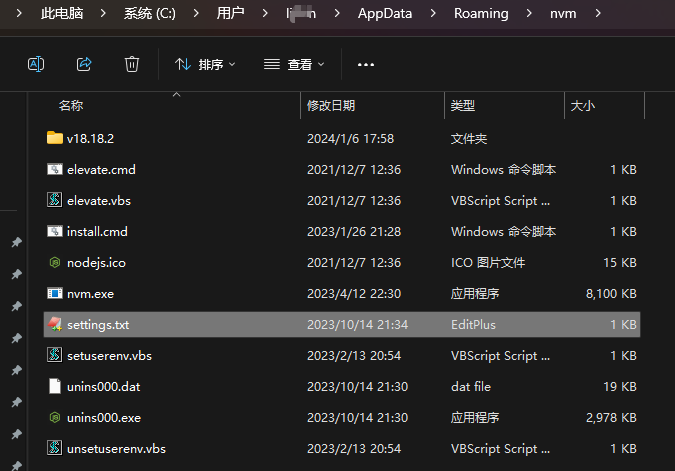

[NodeJS英文官网](https://nodejs.org/en)

[NodeJS中文官网](https://nodejs.cn/)

[npm官网](https://www.npmjs.com/)

[pnpm官网](https://pnpm.io/)

[pnpm中文网](https://pnpm.nodejs.cn/)

[express官网](https://www.expressjs.com/)

[koa官方](https://expressjs.com.cn/)

[视频教程](https://www.bilibili.com/video/BV1gM411W7ex/?spm_id_from=333.337.search-card.all.click&vd_source=b850b3a29a70c8eb888ce7dff776a5d1)


# 1 模块系统

JavaScript 主要有两种模块语法，了解它们非常重要：

## 1.1 CommonJS (CJS)

- **主要用于：** **Node.js** 环境（后端）。

- **语法：**

  - **默认导出：**

  ```js
  // 导出单个值
  module.exports = function() {
    console.log('默认导出');
  };
  
  // 或者导出对象
  module.exports = {
    name: 'CommonJS',
    version: '1.0'
  };
  ```

  - **命名导出：**

  ```js
  // 导出多个值
  exports.add = function(a, b) {
    return a + b;
  };
  
  exports.subtract = function(a, b) {
    return a - b;
  };
  
  // 或者一次性导出
  module.exports = {
    add: function(a, b) { return a + b; },
    subtract: function(a, b) { return a - b; }
  };
  ```

  - **导入**

  ```js
  // 导入默认导出
  const myModule = require('./myModule');
  
  // 导入命名导出
  const { add, subtract } = require('./math');
  
  // 或者
  const math = require('./math');
  const result = math.add(2, 3);
  ```

## 1.2 ES Modules (ESM)

- **主要用于：** 浏览器环境（前端），现代 Node.js 也支持。
- **语法：**
  
  - **默认导出：**
  
  ```js
  // 导出单个值
  export default function() {
    console.log('默认导出');
  };
  
  // 或者导出对象
  export default {
    name: 'ESM',
    version: '1.0'
  };
  ```
  
  - **命名导出：**
  
  ```js
  // 导出多个值
  export const add = function(a, b) {
    return a + b;
  };
  
  export function subtract(a, b) {
    return a - b;
  };
  
  // 或者先定义后导出
  const multiply = (a, b) => a * b;
  const divide = (a, b) => a / b;
  
  export { multiply, divide };
  ```
  
  - **导入：**
  
  ```js
  // 导入默认导出
  import myModule from './myModule.js';
  
  // 导入命名导出
  import { add, subtract } from './math.js';
  
  // 同时导入默认和命名导出
  import myModule, { add, subtract } from './myModule.js';
  
  // 导入所有导出
  import * as math from './math.js';
  ```

## 1.3 对比总结

| 特性         | CommonJS                                                 | ES Modules                                   |
| :----------- | :------------------------------------------------------- | :------------------------------------------- |
| 加载方式     | 运行时加载，同步                                         | 编译时加载，异步                             |
| 默认导出语法 | module.exports = value                                   | export default value                         |
| 命名导出语法 | exports.name = value 或 module.exports = { name: value } | export const name = value 或 export { name } |
| 导入语法     | const module = require('module')                         | import module from 'module'                  |
| 动态导入     | 原生支持                                                 | 使用 import() 函数                           |
| 主要使用环境 | Node.js 服务器端                                         | 浏览器端和现代Node.js                        |
| 值的引用     | 导出值的拷贝                                             | 导出值的引用（动态绑定）                     |


# 2 安装NVM

## 2.1 Windows安装nvm

https://github.com/coreybutler/nvm-windows

下载地址： <https://github.com/coreybutler/nvm-windows/releases>

1. 下载 nvm-setup.zip，解压后可以得到 nvm-setup.exe 安装宝，双击安装即可。
2. 安装nvm

备注：若nvm安装node卡主，可以尝试更换网络：

【找到nvm安装目录（比如：C:\Users\limin\AppData\Roaming\nvm】下的settings文件，编辑并增加：

```tex
# 现有
root: C:\Users\limin\AppData\Roaming\nvm
path: C:\Program Files\nodejs
# 增加
node_mirror: https://npm.taobao.org/mirrors/node/
npm_mirror: https://npm.taobao.org/mirrors/npm/
```

## 2.2 Linux安装nvm

https://github.com/nvm-sh/nvm

## 2.3 MacOS安装nvm

```bash
% brew install nvm
```

- 创建目录

```bash
% mkdir ~/.nvm
```

- 添加到环境变量

```bash
% vim ~/.zshrc
```

```bash
# nvm
export NVM_DIR="$HOME/.nvm"
  [ -s "/opt/homebrew/opt/nvm/nvm.sh" ] && \. "/opt/homebrew/opt/nvm/nvm.sh"  # This loads nvm
  [ -s "/opt/homebrew/opt/nvm/etc/bash_completion.d/nvm" ] && \. "/opt/homebrew/opt/nvm/etc/bash_completion.d/nvm"  # This loads nvm bash_completion
```

- 重启shell

```bash
% exec $SHELL -l
```

- 查看版本

```bash
% nvm --version
0.40.1
```

## 2.4 nvm用法

常用命令：

| 命令                  | 说明                          |
| --------------------- | ----------------------------- |
| nvm current           | 显示激活的版本                |
| nvm -v                | 查看版本                      |
| nvm list available    | 显示所有可以下载的Node.js版本 |
| nvm list              | 显示已安装的版本              |
| nvm install 18.12.1   | 安装18.12.1版本的Node.js      |
| nvm install latest    | 安装最新版本的Node.js         |
| nvm uninstall 18.12.1 | 删除某个版本的Node.js         |
| nvm use 18.12.1       | 切换到18.12.1版本的Node.js    |
| nvm cache dir         | 显示缓存目录                  |
| nvm cache clear       | 清空缓存目录                  |

常见问题1：

> $ nvm list available
>
> Could not retrieve https://npm.taobao.org/mirrors/node/index.json.
>
> Get "https://npm.taobao.org/mirrors/node/index.json": tls: failed to verify certificate: x509: certificate has expired or is not yet valid:

问题1解决：

找到nvm目录，`which nvm`

> $ which nvm
> /c/Users/limin/AppData/Roaming/nvm/nvm



打开settings.txt并调整如下：

```
root: C:\Users\limin\AppData\Roaming\nvm
path: C:\Program Files\nodejs
#node_mirror: https://npm.taobao.org/mirrors/node/
node_mirror: https://npmmirror.com/mirrors/node/
#npm_mirror: https://npm.taobao.org/mirrors/npm/
npm_mirror: https://npmmirror.com/mirrors/npm/
```


# 3 安装Node

## 3.1 安装

安装长期维护版本，推荐多数用户使用（LTS）

**推荐在Linux环境通过nvm ls-remote查看LTS版本安装**

```
nvm install v8.11.3
# 或者
nvm install v6.14.3
```

**以上安装，会安装node和对应的npm版本**

4. 使用

```
nvm use v8.11.3
# 或者
nvm use v6.14.3
```

5. 校验

```
node --version
npm --version
```

6. 配置淘宝npm镜像【可选】

```shell
npm config set registry https://registry.npm.taobao.org
```

## 3.2 查找全局依赖安装的位置

```bash
$ npm root -g
```

## 3.2 常用模块

- chalk

颜色代码模块

```shell
npm install chalk --save
```

- supervisor

1. 安装

```shell
npm install supervisor -g
```

2. 使用

```shell
supervisor app.js // app.js是一个node的server文件
```

- handlebars

```shell
npm install handlebars --save
```

# 4 NRM

nrm(npm registry manager)是npm的镜像源管理工具，有时候国外资源太慢，使用这个就可以快速地在npm源之间切换。

## 4.1、安装nrm

```bash
npm install nrm -g
npm i -g nrm open@8.4.2 # 推荐，避免缺少open的错误
```

> 如果碰到错误`const open = require('open');
>
> ​                                                  ^
>
> 如上错误，表示nrm的依赖包open未能加载，打开nrm的安装包下`package.json`查看，需要：
>
> "open": ">=6.0.0"，所以请安装open
>
> `npm i -g open@8.4.2`

## 4.2、查看镜像源

```bash
$ nrm ls

  npm -------- https://registry.npmjs.org/
  yarn ------- https://registry.yarnpkg.com/
  cnpm ------- http://r.cnpmjs.org/
* taobao ----- https://registry.npm.taobao.org/  ==> 最新版是：https://registry.npmmirror.com
  nj --------- https://registry.nodejitsu.com/
  npmMirror -- https://skimdb.npmjs.com/registry/
  edunpm ----- http://registry.enpmjs.org/
  ss --------- https://repo.ishanshan.com/repository/ss-public/
```


其中带`*`的是当前使用的源

> 如果展示的结果，看不到 * ，可以如下修复：
>
> 1. 打开nrm安装目录，找到cli.js并打开
>
> 2. 找到如下代码
>
> ```js
> function onUse (name) {
>     var allRegistries = getAllRegistry();
>     if (hasOwnProperty(allRegistries, name)) {
>         getCurrentRegistry(function (cur) {
>             let currentRegistry, item;
>             for (let key of Object.keys(allRegistries)) {
>                 item = allRegistries[key];
>                 if (item[FIELD_IS_CURRENT] && equalsIgnoreCase(item.registry, cur)) {
>                     currentRegistry = item;
>                     break;
>                 }
>             }
>             var registry = allRegistries[name];
>             let attrs = [].concat(REGISTRY_ATTRS).concat();
>             for (let attr in Object.assign({}, currentRegistry, registry)) {
>                 if (!REGISTRY_ATTRS.includes(attr) && !IGNORED_ATTRS.includes(attr)) {
>                     attrs.push(attr);
>                 }
>             }
> 
>             config(attrs, registry).then(() => {
>                 console.log('                        ');
>                 const newR = npm.config.get(FIELD_REGISTRY);
>                 var customRegistries = getCustomRegistry();
>                 Object.keys(customRegistries).forEach(key => {
>                     delete customRegistries[key][FIELD_IS_CURRENT];
>                 });
>                 if (hasOwnProperty(customRegistries, name) && (name in registries || customRegistries[name].registry === registry.registry)) {
>                     registry[FIELD_IS_CURRENT] = true;
>                     customRegistries[name] = registry;
>                 }
>                 setCustomRegistry(customRegistries);
>                 printMsg(['', '   Registry has been set to: ' + newR, '']);
>             }).catch(err => {
>                 exit(err);
>             });
>         });
>     } else {
>         printMsg(['', '   Not find registry: ' + name, '']);
>     }
> }
> ```
>
> 3. 修改如下：
>
> ```js
> if (hasOwnProperty(customRegistries, name) && (name in registries || customRegistries[name].registry === registry.registry))
> ==>
> if (hasOwnProperty(customRegistries, name) || (name in registries || customRegistries[name].registry === registry.registry))
> ```
>
> 5. 重新`nrm use taobao` ，然后`nrm ls`查看结果，会发现已经带有*了。

## 4.3、切换镜像源

```bash
nrm use taobao
```

## 4.4、增加

你可以增加定制的源，特别适用于添加企业内部的私有源，执行命令： `nrm add <registry> <url>`，其中registry为源名，url为源的路径。

```bash
nrm add registry http://registry.npm.frp.trmap.cn/
```

## 4.5、删除

执行命令：`nrm del <registry>`删除对应的源。

## 4.6、测试速度

你还可以通过 `nrm test` 测试相应源的响应时间。

```bash
nrm test npm
```

# 5 NPX

npx是执行Node软件包的工具，它从 npm5.2版本开始，就与npm捆绑在一起。

npx的作用如下：

1. 默认情况下，首先检查路径中是否存在要执行的包（即在项目中）；

2. 如果存在，它将执行；

3. 若不存在，意味着尚未安装该软件包，npx将安装其最新版本，然后执行它；

Node8.2以后自带npm模块，所以可以直接使用npx命令。万一不能用，就要手动安装一下。

```bash
npm install -g npx
```

## 5.1、调用项目安装的模块

npx想要解决的主要问题，就是调用项目内部安装的模块。比如，项目内部安装了测试工具Mocha。

```bash
npm install -D mocha
```

一般来说，调用Mocha，只能在项目脚本和package.json的`scripts`字段里面，如果想在命令行下调用，必须像下面这样。

```bash
# 项目的跟目录下执行
node-modules/.bin/mocha --version
```

npx就是想解决这个问题，让项目内部安装的模块用起来更方便，只要像下面这样调用就行了。

```bash
npx mocha --version
```

npx的原理很简单，就是运行的时候，会到`node_modules/.bin`路径和环境变量`$PATH`里面，检查命令是否存在。由于npx会检查环境变量`$PATH`，所以系统命令也可以调用。

```bash
# 等同于ls
npx ls
```

注意，Bash内置的命令不在`$PATH`里面，所以不能用。比如，`cd`是Bash命令，因此就不能用`npx cd`。

## 5.2、避免全局安装模块

除了调用项目内部模块，npx还能避免全局安装的模块。比如`create-react-app`这个模块是全局安装，npx可以运行它，而且不进行全局安装。

```bash
npx create-react-app my-react-app
```

上面代码运行时，npx将`create-react-app`下载到一个临时目录，使用以后再删除。所以，以后再次执行上面的命令，会重新下载`create-react-app`。

下载全局模块时，npx允许指定版本。

```bash
npx uglify-js@3.1.0 main.js -o ./dist/main.js
```

上面代码指定使用3.1.0版本的`uglify-js`压缩脚本。

注意，只要npx后面的模块无法在本地发现，就会下载同名模块。比如，本地没有安装`http-server`模块，下面的命令会自动下载该模块，在当前目录启动一个Web服务。

```bash
npx http-server
```

## 5.3、`--no-install`参数和`--ignore-existing`参数

如果想让npx强制使用本地模块，不下载远程模块，可以使用`--no-install`参数。如果本地不存在该模块，就会报错。

```bash
npx --no-install http-server
```

反过来，如果忽略本地的同名模块，强制安装使用远程模块，可以使用`--ignore-existing`参数。比如，本地已经全局安装了`create-react-app`，但还是想使用远程模块，就用这个参数。

```bash
npx --ignore-existing create-react-app my-react-app
```


### **一、饮食红绿灯：关注这些食物**

**核心原则：** 不是完全禁止，而是**了解、警惕并合理控制**。

| 食物类别                                        | 具体食物举例                                                 | 说明与建议                                                   |
| :---------------------------------------------- | :----------------------------------------------------------- | :----------------------------------------------------------- |
| **🚨 高草酸食物** （易形成**草酸钙结石**）       | **蔬菜类**：菠菜、苋菜、甜菜、空心菜、秋葵、韭菜、竹笋、蒜苗 **坚果类**：花生、杏仁、腰果 **饮品类**：浓茶、速溶咖啡 **其他**：大豆、豆腐、巧克力、可可、红薯 | • **对策**：**焯水**是妙招！烹饪前用开水焯烫1-2分钟，可去除大部分草酸。 • **避免**与高钙食物（如牛奶）同时大量食用，可在不同餐分开吃。 • 勿一次性大量食用。 |
| **🚨 高嘌呤食物** （易形成**尿酸结石**）         | **动物内脏**：肝、肾、脑、心 **部分海鲜**：沙丁鱼、凤尾鱼、贝类、鱼籽 **浓肉汤**：火锅汤、老火靓汤 **其他**：啤酒、酵母粉 | • **对策**：严格限制摄入频率和量。 • 吃肉弃汤，尤其是火锅汤和久煮的肉汤，嘌呤含量极高。 |
| **🟡 高盐（钠）食物** （**所有结石类型**的公敌） | **加工食品**：咸菜、腊肉、香肠、酱菜、罐头 **调味品**：酱油、蚝油、鸡精、味精、各类酱料 **零食**：薯片、话梅、椒盐坚果 | • **对策**：购买食品看**营养成分表**，选择钠含量低的。 • 烹饪多用醋、胡椒、香料等替代盐和酱油调味。 • 目标：每日食盐摄入量 **< 5克**（约一个啤酒瓶盖的量）。 |
| **🟡 高动物蛋白食物** （增加尿钙和尿酸）         | **红肉**：猪、牛、羊肉 **禽肉皮**                            | • **对策**：控制总量，每日摄入量约**一副扑克牌大小**。 • 优先选择鸡胸肉、鱼肉等白肉。 |
| **🟡 高糖食物/饮料**                             | **含糖饮料**：可乐、果汁、奶茶 **甜点**：蛋糕、冰淇淋        | • **对策**：最佳饮料就是**白开水**。 • 糖分会干扰钙代谢，增加尿钙，间接促进结石形成。 |
| **✅ 推荐/安全的食物**                           | **大量白开水**、柠檬水、低糖水果（如西瓜、梨）、大部分蔬菜（除上述高草酸外）、低脂奶制品 | • **柠檬水**是佳品，其中的**柠檬酸钾**能有效抑制结石形成。 • **钙质**需正常摄入（如牛奶），但建议随餐服用，钙能在肠道与草酸结合，减少草酸吸收，反而预防结石。 |


### **二、必养成的五大核心习惯**

这五大习惯比单纯忌口更重要，是预防结石的基石。

**1. 饮水习惯：第一位，无可替代**

- **目标**：保证每日尿量 **2-2.5升**。这通常需要您每天喝下 **2.5-3升** 液体。
- **技巧**：
  - 在身边随时放一个大水杯，提醒自己喝水。
  - 观察尿液颜色，保持清亮无色或淡黄色。
  - 睡前和起床后各喝一杯水，弥补夜间水分流失。

**2. 饮食习惯：均衡与节制**

- **遵循“饮食红绿灯”原则**，合理安排三餐。
- **均衡膳食**，避免长期单一、大量地摄入某一种高风险食物。
- **按时吃饭**，避免暴饮暴食。

**3. 运动习惯：动起来，但别忘了补水**

- 规律运动（如散步、慢跑、游泳）有助于微小结石排出。
- **关键**：运动前后和运动中，必须**额外补充水分**，否则出汗导致尿液浓缩，会适得其反。

**4. 体检与监测习惯：知己知彼**

- **定期体检**：每年做一次泌尿系统B超。
- **保留结石**：如有结石排出，务必收集起来送检**成分分析**，这是后续预防的“金标准”。
- **咨询医生**：必要时进行“24小时尿液成石风险分析”，在医生指导下进行精准到药物级别的预防。

**5. 生活方式：细节决定成败**

- 避免长时间憋尿。
- 保持健康体重，肥胖是结石的风险因素之一。
- 管理压力，保证充足睡眠。

