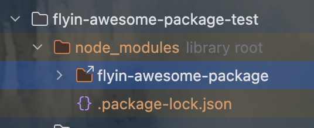
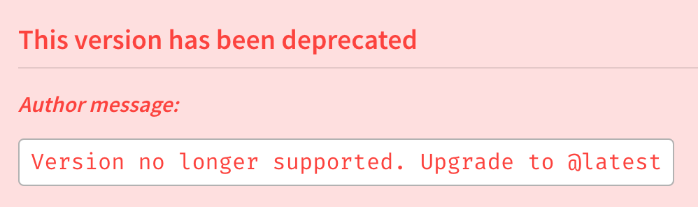

# 第1章 如何开发并发布一个npm包

## 1 开发npm包

### 1.1 前置条件

- 安装 [Node.js](https://nodejs.org/)（自带 npm）
- 拥有一个 [npm 官网](https://www.npmjs.com/) 账号
- 在终端运行 `npm login` 登录你的账号
- 为 `npm init` 命令设置默认的配置选项

```bash
$ npm config set init-author-email "liming20110711@163.com"
$ npm config set init-author-name "wenqiu"
```

### 1.2 登录npm

1. 在命令行中，输入以下命令：

```bash
$ npm login
```

:::details 登录详情

```bash
npm notice Log in on https://registry.npmjs.org/
Login at:
https://www.npmjs.com/login?next=/login/cli/f3b87948-1a74-478b-86af-cf67b23b0124
Press ENTER to open in the browser...

Logged in on https://registry.npmjs.org/.
```

:::

2. 当提示时，输入您的用户名、密码和电子邮件地址。
3. 如果您已启用双因素认证，当提示时，输入一次性密码。
4. 为测试您是否已成功登录，请输入：

```bash
$ npm whoami
```

5. 您的 npm 用户名应该会显示。

### 1.3 创建项目目录

在为你的包选择名称时，应选择一个名称：

- 是唯一的
- 具有描述性
- 符合 npm 政策指南。例如，不要给您的包起侮辱性的名称，也不要使用他人的注册商标名称或违反 npm 商标政策。
- 不包含大写字母

此外，在选择无作用域包的名称时，应选择一个名称：

- 不是以与其他包名称类似的方式拼写
- 不会使他人对作者身份产生混淆

选择一个合适的地方创建一个新的文件夹，这将成为你的npm包的根目录。例如：

```bash
$ mkdir flyin-awesome-package
$ cd flyin-awesome-package
```

### 1.4 初始化项目（创建一个package.json文件）

[初始化项目](https://docs.npmjs.com/creating-a-package-json-file)

**创建什么样的模块？**

- 对于作用域模块，运行 `npm init --scope=@scope-name`
- 对于无作用域的模块，运行 `npm init`

**必需字段（ `name` 和 `version` ）以及 `main` 字段：**

- `name` : 您的模块名称。

- `version` : 模块的初始版本。我们建议遵循语义版本化规范，并从 `1.0.0` 开始。
- `main`: 模块入口

在项目目录下运行`npm init`来初始化项目。这会引导你填写一些关于项目的元数据，如名称、版本、描述等。也可以直接使用`npm init -y`快速生成默认的`package.json`文件。

```bash
$ npm init
```

::: details npm init 输出

```bash
This utility will walk you through creating a package.json file.
It only covers the most common items, and tries to guess sensible defaults.

See `npm help init` for definitive documentation on these fields
and exactly what they do.

Use `npm install <pkg>` afterwards to install a package and
save it as a dependency in the package.json file.

Press ^C at any time to quit.
package name: (flyin-awesome-package) 
version: (1.0.0) 
description: 问秋第一个npm插件包
entry point: (index.js) src/index.js
test command: 
git repository: 
keywords: flyin,工具包,依赖库,丰富的套件,问秋,wenqiu
license: (ISC) 
About to write to /Users/wenqiu/WebstormProjects/frontend-node-learning/flyin-awesome-package/package.json:

{
  "name": "flyin-awesome-package",
  "version": "1.0.0",
  "main": "src/index.js",
  "scripts": {
    "test": "echo \"Error: no test specified\" && exit 1"
  },
  "keywords": [
    "flyin",
    "工具包",
    "依赖库",
    "丰富的套件",
    "问秋",
    "wenqiu"
  ],
  "author": "wenqiu <liming20110711@163.com>",
  "license": "ISC",
  "description": "问秋第一个npm插件包"
}


Is this OK? (yes) yes
```

:::

:::tip

- 您可以将一个 `package.json` 文件添加到您的包中，以便其他人轻松管理和安装。发布到注册中心的包必须包含一个 `package.json` 文件。

- 一个 `package.json` 文件必须包含 `"name"` 和 `"version"` 字段。

- `"name"` 字段包含你的包的名称，必须全部小写且不包含任何空格。可以包含连字符、点和下划线。

- `"version"` 字段必须采用 `x.x.x` 格式，并遵循[语义版本控制规范](https://docs.npmjs.com/about-semantic-versioning)。

- 如果你需要包含包作者信息，在 `"author"` 字段中使用以下格式（电子邮件和网站都是可选的）：

  `Your Name <email@example.com> (https://example.com)`

:::

### 1.5 编写代码（创建Node.js模块）

创建一个与你在 `main` 字段中提供的同名文件。在该文件中，将一个函数作为 `exports` 对象的属性添加。这将使该函数对其他代码可用：

```js
// helloWorld.js
/**
 * 这是默认导出（Default Export）
 * 直接导出一个函数（或任何其他值）
 * 只能导出一个主要的值
 * 导入时直接获得该函数
 * @returns {string}
 */
module.exports = function helloWorld() {
    return 'Hello, World!';
};
```

```js
// src/welcome.js
/**
 * 这是命名导出（Named Exports）
 * 导出的是一个对象，该对象包含 printMsg 属性
 * 可以同时导出多个值/函数
 * 导入时需要通过属性名访问或使用解构赋值
 * @returns {string}
 */
exports.printMsg = function () {
    console.log("欢迎使用我的Node.js模块");
}
```

```js
// src/index.js
const helloWorld = require('./helloWorld');
const welcome = require('./welcome');

module.exports = {
    helloWorld,
    welcome: welcome.printMsg
};
```

### 1.6 本地测试代码（在本地测试你的模块）

在项目根目录下创建一个简单的测试文件，比如`test.js`，确保你的代码能正常工作。

```js
// src/test.js
const {helloWorld, welcome} = require('./index');
console.log(helloWorld())
welcome();
```

然后运行测试文件：

```bash
$ node src/test.js
```

```bash
Hello, World!
欢迎使用我的Node.js模块
```

### 1.7 发布到npm

将您的包发布到 npm：

- 对于私有包和无作用域包，使用 `npm publish` 。
- 对于作用域的公共包，使用 `npm publish --access public`
- 默认情况下，运行 `npm publish` 将为您的包添加 `latest` 分发标签。若要使用其他分发标签，在发布时使用 `--tag` 标志。
  - `npm publish --tag <tag>`

确保`package.json`中包含必要的字段，如`main`指明入口文件，`keywords`便于搜索，以及`repository`和`license`等。

```bash
$ npm publish
```

:::details

```bash
npm notice
npm notice 📦  flyin-awesome-package@1.0.0
npm notice Tarball Contents
npm notice 366B package.json
npm notice 262B src/helloWorld.js
npm notice 151B src/index.js
npm notice 86B src/test.js
npm notice 318B src/welcome.js
npm notice Tarball Details
npm notice name: flyin-awesome-package
npm notice version: 1.0.0
npm notice filename: flyin-awesome-package-1.0.0.tgz
npm notice package size: 943 B
npm notice unpacked size: 1.2 kB
npm notice shasum: 4d7c92c7e9cc82dd0f382934a615e8feb33f9b35
npm notice integrity: sha512-48DOsbw8cqrqI[...]ulXC+R86+2eww==
npm notice total files: 5
npm notice
npm notice Publishing to https://registry.npmjs.org/ with tag latest and default access
+ flyin-awesome-package@1.0.0
```

:::

### 1.8 添加 `README.md` 并更新发布并弃用旧版

1. 在文本编辑器中，在你的包根目录下，创建一个名为 `README.md` 的文件。
2. 在 `README.md` 文件中，添加关于你的包的有用信息。

只有在你发布新版本的包时， `README.md` 文件才会更新到包页面。要更新你的 `README.md` 文件：

- 更新补丁包版本

```bash
$ npm version patch
```

```bash
# 输出
v1.0.1
```

- 发布

```bash
$ npm publish
```

- 弃用旧版

```bash
$ npm deprecate flyin-awesome-package@1.0.0 "fix:入口页面放置错误位置，导致无法使用"
$ npm deprecate flyin-awesome-package@1.0.1 "fix:入口文件调整错误的bug"
```

- 添加稳定版分发标签

```bash
$ npm dist-tag add flyin-awesome-package@1.0.2 stable
```

### 1.9 最终目录结构

最终，一个插件包应该有如下目录：

```bash
$ tree --dirsfirst flyin-awesome-package
flyin-awesome-package
├── src
│   ├── helloWorld.js
│   ├── index.js
│   ├── test.js
│   └── welcome.js
├── package.json
└── README.md

2 directories, 6 files
```


## 2 使用npm包

### 2.0 目录结构

```bash
$ tree --dirsfirst
.
├── flyin-awesome-package
│   ├── src
│   │   ├── helloWorld.js
│   │   ├── index.js
│   │   ├── test.js
│   │   └── welcome.js
│   ├── package.json
│   └── README.md
└── flyin-awesome-package-test
    ├── src
    │   └── test.js
    ├── package-lock.json
    └── package.json

5 directories, 9 files
```

### 2.1 如何引用已发布的包？

#### 2.1.1 方案一：安装已发布的包

```bash
$ mkdir flyin-awesome-package-test && cd flyin-awesome-package-test
$ npm i flyin-awesome-package
```

#### 2.1.2 方案二：无需发布，直接link引用

- 方式一

  - 第一步：进入被<span style="color:#9400D3;font-weight:bold;">引用的包</span>所在项目的根目录，创建全局链接

    ```bash
    $ cd flyin-awesome-package
    # 会在全局创建链接
    $ npm link
    # 查看链接
    $ npm list -g --depth=0
    ```

    ```BASH
    /Users/wenqiu/.nvm/versions/node/v20.19.4/lib
    ├── corepack@0.32.0
    ├── flyin-awesome-package@1.0.2 -> ./../../../../../WebstormProjects/frontend-node-learning/flyin-awesome-package
    ```

  - 第二步：进入要使用链接的项目

    ```bash
    $ cd flyin-awesome-package-test
    # 使用链接，这里指定的是包名（注意：不会在package.json添加依赖，但会在node_modules目录下挂载）
    $ npm link flyin-awesome-package
    ```

    

  - 第三步：清理（非必须，视需要而定）

    ```bash
    # 用后可以解除对链接的使用
    $ cd flyin-awesome-package-test
    $ npm unlink flyin-awesome-package
    # 删除创建的引用包的全局链接
    $ npm rm -g flyin-awesome-package
    ```

    

- 方式二

该方式是上面的步骤合二为一，效果一样，但这里的link后面，指定的是被引用包的目录。

```bash
$ cd flyin-awesome-package-test
$ npm link ../flyin-awesome-package
```

### 2.2 使用

1. 在测试目录中，创建一个 `test.js` 文件，该文件需要你的模块，并将你的模块作为方法调用。

```js
// src/test.js
const {helloWorld, welcome} = require('flyin-awesome-package');
console.log(helloWorld())
welcome();
```

2. 在命令行中运行 `node test.js` 。应该会看到发送到 console.log 的消息。

```bash
$ node src/test.js 
```

```bash
Hello, World!
欢迎使用我的Node.js模块
```

## 3 作用域

### 3.1 关于作用域

当您注册 npm 用户账户或创建一个组织时，您将获得一个与您的用户或组织名称匹配的作用域。您可以使用这个作用域作为相关包的命名空间。

作用域允许您创建一个与另一个用户或组织创建的具有相同名称的包，而不会产生冲突。

当在 `package.json` 文件中列为主要依赖时，作用域包会以它们的作用域名称开头。作用域名称是 `@` 和斜杠之间的所有内容：

### 3.2 作用域和包的可见性

- 无作用域的包总是公开的。
- 私有包总是有作用域的。
- 作用域包默认是私有的；当你发布时，必须传递一个命令行标志才能使其公开。

### 3.3 关于公共包

- 无作用域的公共包存在于全局公共注册表命名空间中，可以在 `package.json` 文件中仅使用包名引用： `package-name` 。
- 有作用域的公共包属于用户或组织，在 `package.json` 文件中作为依赖项引用时，必须以用户或组织的名称开头：
    - `@username/package-name`
    - `@org-name/package-name`

### 3.4 关于私有包

要使用私有包，你必须

- 使用 npm 版本 2.7.0 或更高版本。要升级，在命令行中运行 `npm install npm@latest -g`
- 拥有付费用户或组织账户

使用 npm 私有包，你可以使用 npm 注册表来托管只有你和选定的协作者可见的代码，让你能够在项目中与公共代码一起管理和使用私有代码。

私有包总是有一个作用域，而作用域包默认是私有的。

- 用户作用域的私有包只能被你和被你授予读取或读写权限的协作者访问。
- 组织作用域的私有包只能被被授予读取或读写权限的团队访问。

### 3.5 npm包访问矩阵

| 作用域            | 访问级别     | 可以查看和下载                       | 可以写入（发布）                     |
| ----------------- | ------------ | ------------------------------------ | ------------------------------------ |
| Org 组织          | Private 私有 | 组织团队中具有读取包权限的成员       | 组织团队中具有读取和写入包权限的成员 |
| Org 组织          | Public 公共  | 所有人                               | 组织团队中具有读取和写入包权限的成员 |
| User 用户         | Private 私有 | 拥有包的用户和被授予包读取权限的用户 | 包的所有者和被授予包读写权限的用户   |
| User 用户         | Public 公共  | 所有人                               | 包的所有者和被授予包读写权限的用户   |
| Unscoped 无作用域 | Public 公共  | 所有人                               | 包的所有者和被授予包读写权限的用户   |

## 4 关于语义版本控制

为了保持 JavaScript 生态系统的健康、可靠和安全性，每次你对所拥有的 npm 包进行重大更新时，我们建议在遵循语义版本控制规范的 `package.json` 文件中发布一个带有更新版本号的包新版本。遵循语义版本控制规范有助于依赖你的代码的其他开发者理解特定版本中的变更程度，并在必要时调整他们自己的代码。

### 4.1 已发布包中的语义版本增量

为了帮助依赖你代码的开发者，我们建议你的包版本从 `1.0.0` 开始，并按以下方式递增：

| Code status 代码状态 | Stage 阶段   | Rule 规则                                        | Example version 示例版本 |
| -------------------- | ------------ | ------------------------------------------------ | ------------------------ |
| 首次发布             | 新产品       | 从 1.0.0 开始                                    | 1.0.0                    |
| 向后兼容的 bug 修复  | 补丁版本发布 | 增加第三位数字                                   | 1.0.1                    |
| 向后兼容的新功能     | 小版本发布   | 将中间数字加一，并将最后一位数字重置为零         | 1.1.0                    |
| 破坏向后兼容性的变更 | 大版本发布   | 将第一个数字递增，并将中间和最后一个数字重置为零 | 2.0.0                    |

### 4.2 使用语义版本控制来指定您的包可以接受的更新类型

您可以在包的 `package.json` 文件中指定您的包可以接受的更新类型。

例如，要指定最高到 1.0.4 的可接受版本范围，请使用以下语法：

- 补丁版本： `1.0` 或 `1.0.x` 或 `~1.0.4`
- 次版本： `1` 或 `1.x` 或 `^1.0.4`
- 主版本： `*` 或 `x`

有关语义版本号语法的更多信息，请参阅 [npm semver 计算器](https://semver.npmjs.com/)。

### 4.3 NPM模块的版本号

每一个模块后面对应的就是他的版本号，如"^4.10.1"。下面是几个版本的表达式：

| 表达式                     | 版本范围              |
| :------------------------- | :-------------------- |
| >=1.2.7                    | 大于等于1.2.7         |
| >=1.2.7<1.3.0              | 1.2.7,1.2.8,1.2.9     |
| 1.2.3-2.3.4                | >=1.2.3<=2.3.4        |
| 1.2-2.3.4                  | >=1.2.0<=2.3.4        |
| 1.2.3-2.3                  | >=1.2.3<2.4.0         |
| 1.2.3-2                    | >=1.2.3<3.0.0         |
| *                          | >=0.0.0               |
| 1.x(等价于1.X)             | >=1.0.0<2.0.0         |
| 1(等价于1.x.x)             | >=1.0.0 <2.0.0        |
| 1.2(等价于1.2.x)           | >=1.2.0 <1.3.0        |
| ~1.2.3(>=1.2.3 <1.(2+1).0) | >=1.2.3 <1.3.0        |
| ~1.2(>=1.2.0 <1.(2+1).0)   | >=1.2.0 <1.3.0        |
| ~1(>=1.0.0 <(1+1).0.0)     | >=1.0.0 <2.0.0        |
| ~0.2.3(>=0.2.3 <0.(2+1).0) | >=0.2.3 <0.3.0        |
| ~0.2(>=0.2.0 <0.(2+1).0)   | >=0.2.0 <0.3.0        |
| ~0(>=0.0.0 <(0+1).0.0)     | >=0.0.0 <1.0.0        |
| ~1.2.3-beta.2              | >=1.2.3-beta.2 <1.3.0 |
| ^1.2.3                     | >=1.2.3 <2.0.0        |
| ^0.2.3                     | >=0.2.3 <0.3.0        |
| ^0.0.3                     | >=0.0.3 <0.0.4        |
| ^1.2.3-beta.2              | >=1.2.3-beta.2 <2.0.0 |
| ^0.0.3-beta                | >=0.0.3-beta <0.0.4   |
| ^1.2.x                     | >=1.2.0 <2.0.0        |
| ^0.0.x                     | >=0.0.0 <0.1.0        |
| ^0.0                       | >=0.0.0 <0.1.0        |
| ^1.x                       | >=1.0.0 <2.0.0        |
| ^0.x                       | >=0.0.0 <1.0.0        |

npm包的版本号格式X.Y.Z，版本号的格式遵循semver 2.0规范，其中X为主版本号，只有更新了不向下兼容的API时修改主版本号；Y为次版本号，当模块增加了向下兼容的功能时进行修改；Z为修订版本号，当模块进行了向下兼容的bug修改后进行修改，这就是**语义化的版本控制**。

#### 4.3.1 脱字符`^`

默认情况下，当用--save或者--save-dev安装模块时，npm通过脱字符（^）来<span style="color:red;font-weight:bold;">限定所安装模块的`最新的`主版本号</span>，而该脱字符对不同的版本号有不同的更新机制。

- `^1.2.1` 代表的更新版本范围为>=1.2.1&&<2.0.0
- `^0.2.1` 代表的更新版本范围为>=0.2.1&&<0.3.0
- `^0.0.2` 代表的更新版本范围为0.0.2（相当于锁定了0.0.2版本）

#### 4.3. 2 波浪号`~`

波浪号`~`会<span style="color:red;font-weight:bold;">匹配最近的小版本依赖包</span>。

- `~1.2.3`匹配 >=1.2.x<1.3.0
- `~1.2`匹配 >=1.2.0 <1.3.0
- `~1`匹配 >=1.0.0 <2.0.0

### 4.4 一个示例

```bash
"dependencies": {
  "my_dep": "^1.0.0",
  "another_dep": "~2.2.0"
},
```

## 5 为包添加分发标签（dist-tags）

分布标签（dist-tags）是您用来组织和标记您发布的不同版本包的人性化标签。dist-tags 补充语义版本控制。除了比语义版本编号更人性化外，标签还允许发布者更有效地分发他们的包。

:::warning

注意：由于 dist-tags 与语义版本共享命名空间，请避免与现有版本号冲突的 dist-tags。我们建议避免以数字或字母“v”开头的 dist-tags。

:::

### 5.1 使用 dist-tag 发布包

默认情况下，运行 `npm publish` 将为您的包添加 `latest` 分发标签。若要使用其他分发标签，在发布时使用 `--tag` 标志。

- 在命令行中，导航到您的包的根目录。

  `cd /path/to/package`

- 运行以下命令，将 `<tag>` 替换为您要使用的标签：

  `npm publish --tag <tag>`

**示例：**

要在命令行中使用 "beta" 分发标签发布包，请在您的包的根目录中运行以下命令：

```bash
$ npm publish --tag beta
```

### 5.2 为您的包的特定版本添加分发标签

1. 在命令行中，导航到您的包的根目录。

   `cd /path/to/package`

2. 运行以下命令，将 `<package_name>` 替换为您的包名， `<version>` 替换为您的包版本号， `<tag>` 替换为分发标签：

   `npm dist-tag add <package-name>@<version> [<tag>]`

**示例：**

要将 "stable" 标签添加到 "example-package" 包的 1.4.0 版本，您将运行以下命令：

```bash
$ npm dist-tag add example-package@1.4.0 stable
```

## 6 更新已发布的包版本号

当你对已发布的包进行重大修改时，我们建议更新版本号，以便向依赖你代码的其他人传达修改的程度。

:::tip

注意：如果你将一个 git 仓库链接到了一个包，更新包的版本号也会向链接的 git 仓库添加一个带有更新发布号的标签。

:::

要在 `package.json` 中更改版本号，在命令行中，在包的根目录下，运行以下命令，将 `<update_type>` 替换为语义版本发布类型之一（补丁、主要或次要）：

1. `npm version <update_type>`

   ```bash
   npm version [<newversion> | major | minor | patch | premajor | preminor | prepatch | prerelease | from-git]
   ```

2. 运行 `npm publish`

3. 前往您的包页面 ( `https://npmjs.com/package/<package>` ) 检查包版本是否已更新。

​	比如：https://www.npmjs.com/package/flyin-awesome-package


## 7 弃用和恢复包或包版本

### 7.1 启用包或版本

#### 7.1.1 弃用整个包

要弃用整个包，运行以下命令，将 `<package-name>` 替换为您的包名，将 `"<message>"` 替换为您的弃用消息：

`npm deprecate <package-name> "<message>"`

如果您已启用双因素认证，请在命令中添加一次性密码， `--otp=123456` （其中 123456 是您认证器应用中的代码）。

#### 7.1.2 弃用包的单一版本

当您弃用包的某个版本时，该版本的包页面上将显示一条红色消息，类似于弃用整个包。



要弃用某个包的版本，运行以下命令，将 `<package-name>` 替换为您的包名， `<version>` 替换为您的版本号， `"<message>"` 替换为您的弃用信息：

`npm deprecate <package-name>@<version> "<message>"`

命令行模式下还接受 `<version>` 的版本范围。

如果你有双因素认证，在命令中添加一次性密码， `--otp=123456` （其中 123456 是你认证器中的代码）。

### 7.2 重新启用包或版本

要取消弃用某个包，将上述命令中的一个 `"<message>"` 替换为 `""` （一个空字符串）。

例如，要取消弃用整个包，运行以下命令，将 `<package-name>` 替换为你的包名，将 `<version>` 替换为你的版本号：

`npm deprecate <package-name> ""`

或者，要仅取消弃用一个单个包版本，运行以下命令，将 `<package-name>` 替换为你的包名，将 `<version>` 替换为你的版本号：

`pm deprecate <package-name>@<version> ""`

如果你有双因素认证，在命令中添加一次性密码， `--otp=123456` （其中 123456 是你认证器中的代码）。

## 8 取消发布包或包版本（下架）

### 8.1 取消发布策略

作为包的所有者或协作者，如果你的包没有依赖项，你可以通过使用命令行界面将其永久从 npm 注册表中删除。你可以在首次发布后的 72 小时内取消发布；超过 72 小时后，如果你的[包符合某些条件](https://docs.npmjs.com/policies/unpublish)，你仍然可以取消发布。

解除发布策略：

- 对于新创建的包，只要 npm 公共注册表中没有其他包依赖于你的包，你可以在发布后的前 72 小时内随时下架。
- 对于超过72小时的包
  - 没有其他 npm 公共注册表中的包依赖于它
  - 过去一周的下载量少于 300 次
  - 它只有一个所有者/维护者

这些条件是为了避免损害 JavaScript 包生态系统。如果你无法取消发布你的包，你可以选择将其弃用。

:::tip

注意：从包中删除所有协作者或团队不会将其取消发布。

:::

### 8.2 如何取消发布

要取消发布单个包版本，运行 `npm unpublish <package_name>@<version>` 。

如果包的所有版本都可以取消发布，你可以通过运行 `npm unpublish <package_name> --force` 一次性取消发布所有版本。

### 8.3 注意事项

- 一旦使用过 `package@version` ，你就再也无法使用它了。<span style="color:red;font-weight:bold;">即使你已取消发布旧版本，也必须发布新版本</span>。
- <span style="color:red;font-weight:bold;">一旦你取消发布一个包，你将无法撤销取消发布操作。</span>

- <span style="color:red;font-weight:bold;">如果你完全取消发布一个包的所有版本，在 24 小时之内你可能无法再发布该包的任何新版本。</span>

:::details 下架后再上架错误提示

```bash
$ npm unpublish flyin-awesome-package --force
```

---


```bash
npm warn using --force Recommended protections disabled.
- flyin-awesome-package
```

---


```bash
$ npm publish
```

---


```bash
npm notice
npm notice 📦  flyin-awesome-package@1.0.2
npm notice Tarball Contents
npm notice 120B README.md
npm notice 570B package.json
npm notice 262B src/helloWorld.js
npm notice 151B src/index.js
npm notice 86B src/test.js
npm notice 318B src/welcome.js
npm notice Tarball Details
npm notice name: flyin-awesome-package
npm notice version: 1.0.2
npm notice filename: flyin-awesome-package-1.0.2.tgz
npm notice package size: 1.1 kB
npm notice unpacked size: 1.5 kB
npm notice shasum: e005b06112bfb3b4df6d56b529b7901ccf33257d
npm notice integrity: sha512-tHanAdBJodW/9[...]AqHhFUNWHfNkQ==
npm notice total files: 6
npm notice
npm notice Publishing to https://registry.npmjs.org/ with tag latest and default access
npm error code E403
npm error 403 403 Forbidden - PUT https://registry.npmjs.org/flyin-awesome-package - flyin-awesome-package cannot be republished until 24 hours have passed.
npm error 403 In most cases, you or one of your dependencies are requesting
npm error 403 a package version that is forbidden by your security policy, or
npm error 403 on a server you do not have access to.
npm error A complete log of this run can be found in: /Users/wenqiu/.npm/_logs/2025-09-16T06_55_47_191Z-debug-0.log
```

:::

