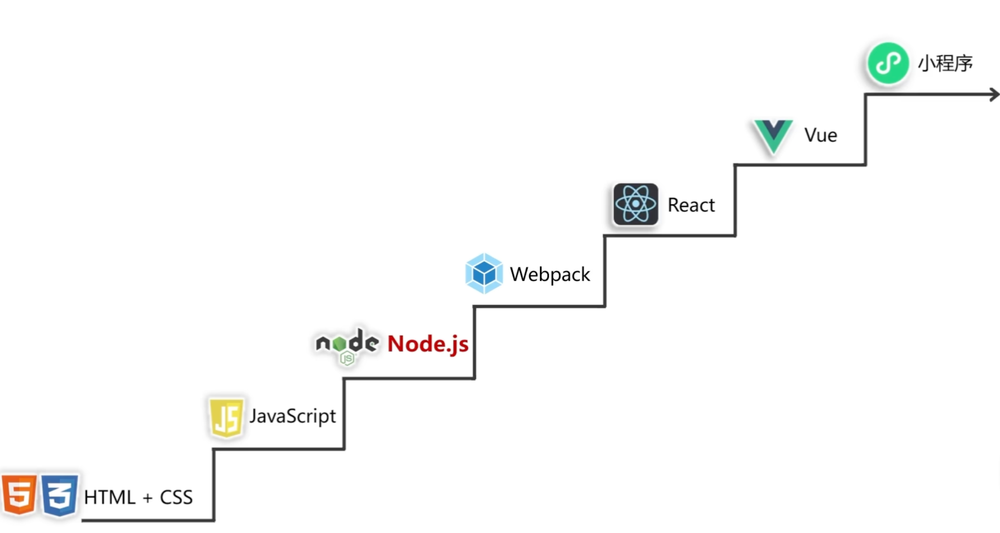
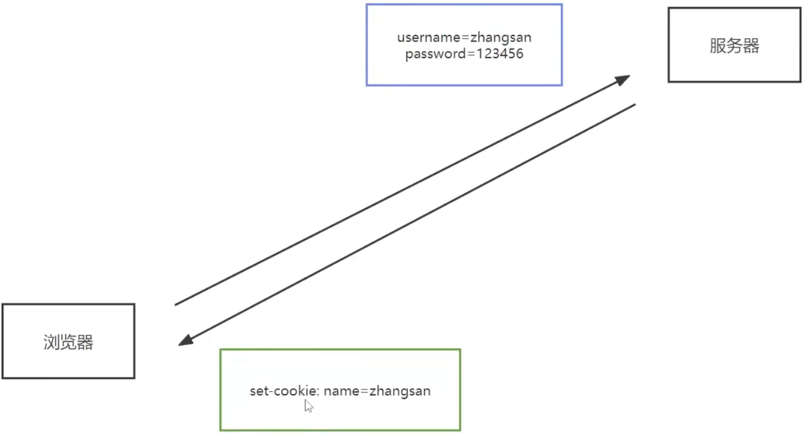
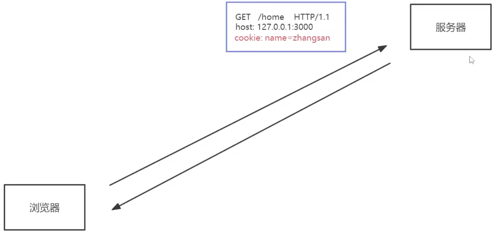
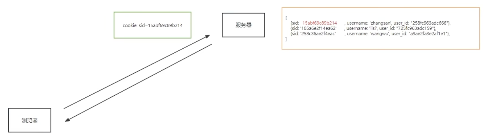
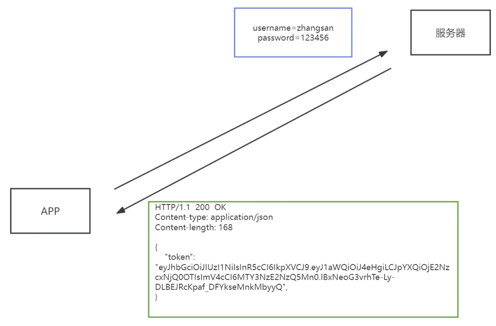
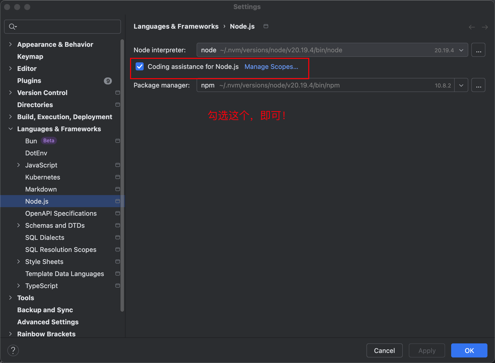

# 第6章 NodeJS




## 1 Node.js的作用

- 开发服务器应用

- 开发工具类应用

  

    - Webpack
    - Vite
    - Babel

- 开发桌面端应用

  

    - VSCode
    - Figma
    - Postman

## 2 Node.js注意点

Node.js中不能使用BOM和DOM的API

### 2.1 浏览器中的JavaScript

- 核心语法：ECMAScript

- Web API：
    - DOM
    - BOM
    - AJAX
    - Storage
    - console
    - 定时器
    - alert/confirm
    - ……

### 2.2 Node.js中的JavaScript

- ECMAScript
- Node API：
    - fs
    - url
    - http
    - util
    - console
    - 定时器
    - path
    - ……

## 3 Buffer（缓冲器）

### 3.1 概念

Buffer是一个类似于数组的`对象`，用于表示固定长度的字节序列。

Buffer本质是一段内存空间，专门用来处理`二进制数据`。

### 3.2 特点

1. Buffer大小固定且无法调整
2. Buffer性能较好，可以直接对计算机内存进行操作
3. 每个元素的大小为1字节（byte）


## 4 计算机基础

### 4.1 计算机基本组成

#### 4.1.1 CPU、内存、硬盘、显卡


#### 4.1.2 主机、显示器、音响、键盘、鼠标垫和和鼠标


### 4.2 程序运行的基本流程


<video src="./images/iShot_2025-10-04_09.05.10.mp4" controls=""></video>

### 4.3 进程与线程

## 5 fs模块

fs模块可以实现与硬盘的交互，例如文件的创建、删除、重命名、移动，还有文件内容的写入、读取，以及文件夹的相关操作。

## 6 HTTP

### 6.1 HTTP各版本发布时间及特点

| HTTP版本     | 发布时间                     | 主要特点                                                     |
| :----------- | :--------------------------- | :----------------------------------------------------------- |
| **HTTP/0.9** | 1991年                       | - 仅支持**GET**方法 - 仅能传输**HTML**纯文本 - 响应后立即**关闭连接** |
| **HTTP/1.0** | 1996年                       | - 增加**POST**、**HEAD**等方法 - 引入**HTTP Header**、**状态码**的概念 - 支持传输图片、视频等更多文件格式 - 默认仍为**短连接**（每次请求-响应后关闭连接） |
| **HTTP/1.1** | 1997年                       | - 引入**持久连接（长连接）**，允许连接复用 - 增加**PUT**、**DELETE**等方法 - **强制要求Host头**，支持虚拟主机 - 支持**管道化**，允许连续发送请求，但响应必须按序返回 |
| **HTTP/2**   | 2015年                       | - **二进制协议**替代文本协议，更高效 - **多路复用**，一个连接并行处理多个请求-响应，解决队头阻塞 - **头部压缩**以减小开销 - **服务端推送**，可预先将资源推送给客户端 |
| **HTTP/3**   | 2018年进入标准化，2020年发布 | - 基于**QUIC协议**，使用**UDP**而非TCP - 解决**TCP层队头阻塞**问题 - 提供**更快的连接建立**（如0-RTT） - 提升网络切换时的连接韧性 |

### 6.2 获取 HTTP 请求报文信息列表

| 代码                                             | 含义                          | 说明与示例                                                   |
| :----------------------------------------------- | :---------------------------- | :----------------------------------------------------------- |
| **`request.method`**                             | 获取请求方法                  | 返回请求的 HTTP 方法（字符串）。 示例：`'GET'`, `'POST'`     |
| **`request.httpVersion`**                        | 获取 HTTP 版本                | 返回客户端使用的 HTTP 版本（字符串）。 示例：`'1.1'`         |
| **`request.url`**                                | 获取完整 URL 路径和查询字符串 | 返回 URL 中端口之后的部分（字符串）。**这是最原始的信息，通常需要进一步解析。** 示例：`'/api/users?id=123&name=john'` |
| **`new URL(request.url, 'http://example.com')`** | **解析 URL 对象**             | 这是**解析 URL 各部分的推荐方法**。你需要提供一个基础 URL（如 `http://${request.headers.host}`）来构造一个完整的 URL 对象。 |
| **`urlObject.pathname`**                         | 获取 URL 路径                 | 从 URL 对象中提取路径部分。 示例（基于上一条）：`'/api/users'` |
| **`urlObject.searchParams`**                     | 获取 URL 查询字符串           | 从 URL 对象中提取查询参数，返回一个可操作的 `URLSearchParams` 对象。 示例（基于上一条）：`id=123&name=john` 获取特定参数：`urlObject.searchParams.get('id')` // '123' |
| **`request.headers`**                            | 获取请求头                    | 返回一个包含所有请求头的对象。头名称均为小写。 示例：`{ 'host': 'example.com', 'user-agent': '...' }` 获取特定头：`request.headers['content-type']` |
| **`请求体数据流`**                               | 获取请求体                    | **请求体需要通过监听数据流来获取**，因为 `request` 对象本身没有 `.body` 属性。 |

### 6.3 设置HTTP响应报文

| 方法/属性                          | 用途                   | 示例                                         |
| :--------------------------------- | :--------------------- | :------------------------------------------- |
| `statusCode`                       | 设置状态码             | `res.statusCode = 404`                       |
| `statusMessage`                    | 设置状态消息           | `res.statusMessage = 'Not Found'`            |
| `setHeader(name, value)`           | 设置单个响应头         | `res.setHeader('Content-Type', 'text/html')` |
| `getHeader(name)`                  | 获取响应头值           | `res.getHeader('Content-Type')`              |
| `removeHeader(name)`               | 移除响应头             | `res.removeHeader('X-Powered-By')`           |
| `writeHead(statusCode, [headers])` | 一次性设置状态码和头部 | `res.writeHead(200, headers)`                |
| `write(chunk)`                     | 写入响应体             | `res.write('Hello')`                         |
| `end([data])`                      | 结束响应               | `res.end('Done')`                            |
| `headersSent`                      | 检查头部是否已发送     | `if (!res.headersSent) {...}`                |

### 6.4 网页URL的路径

#### 6.4.1 绝对路径

| 类型                  | 格式示例                 | 解析结果（假设当前页面为 `https://www.example.com/blog/posts/index.html`） | 说明                                           |
| :-------------------- | :----------------------- | :----------------------------------------------------------- | :--------------------------------------------- |
| **绝对路径**          |                          |                                                              |                                                |
| 包含协议的绝对路径    | `https://cdn.com/lib.js` | `https://cdn.com/lib.js`                                     | **最完整、最可靠**的方式，与当前页面无关。     |
| 协议相对URL（不推荐） | `//cdn.com/lib.js`       | `https://cdn.com/lib.js`                                     | 继承当前页面的协议（HTTP/HTTPS），**已过时**。 |
| **根相对路径**        |                          |                                                              | **（这是一种特殊的相对路径，但常被单独讨论）** |
| 根相对路径            | `/images/logo.jpg`       | `https://www.example.com/images/logo.jpg`                    | 以 `/` 开头，**相对于网站的根域名**。          |

#### 6.4.2 相对路径的详细形式

相对路径不以 `/` 开头，其解析**严重依赖**于当前页面的URL。

| 类型                 | 格式示例                    | 解析基准（当前目录）                                         | 解析结果（假设当前页面为 `https://www.example.com/blog/posts/index.html`） | 说明                                  |
| :------------------- | :-------------------------- | :----------------------------------------------------------- | :----------------------------------------------------------- | :------------------------------------ |
| **相对路径**         |                             |                                                              |                                                              |                                       |
| 同级文件             | `article.html`              | `https://www.example.com/blog/posts/`                        | `https://www.example.com/blog/posts/article.html`            | 指向当前目录下的文件。                |
| 同级目录             | `css/style.css`             | `https://www.example.com/blog/posts/`                        | `https://www.example.com/blog/posts/css/style.css`           | 指向当前目录下的子目录中的文件。      |
| 上一级目录（父目录） | `../images/bg.jpg`          | `https://www.example.com/blog/posts/` → `https://www.example.com/blog/` | `https://www.example.com/blog/images/bg.jpg`                 | `../` 表示返回上一级目录。            |
| 上两级目录           | `../../assets/logo.png`     | `https://www.example.com/blog/posts/` → `https://www.example.com/blog/` → `https://www.example.com/` | `https://www.example.com/assets/logo.png`                    | 每多一个 `../` 就多向上一级目录。     |
| 根目录（隐式）       | `./contact.html`            | `https://www.example.com/blog/posts/`                        | `https://www.example.com/blog/posts/contact.html`            | `./` 表示当前目录本身，通常可以省略。 |
| 任意上级的子目录     | `../assets/../css/main.css` | `https://www.example.com/blog/posts/` → `https://www.example.com/blog/` → `https://www.example.com/blog/` | `https://www.example.com/blog/css/main.css`                  |                                       |

#### 6.4.3 最佳实践建议

1. **外部资源**：无条件使用 **`https:` 绝对路径**。
2. **内部资源**：优先使用 **根相对路径** (`/...`)。
3. **紧密关联的资源**（如一个组件自身的HTML、CSS、图片）：可以使用**相对路径**来保持其内部链接的完整性。

### 6.5 MIME

#### 6.5.1 什么是MIME

**MIME**，全称为 **Multipurpose Internet Mail Extensions**，中文翻译为“**多用途互联网邮件扩展**”。

最初，它是为了解决电子邮件只能传输纯文本（ASCII）的问题而设计的。后来，它被广泛应用于互联网的其他领域，特别是 **HTTP 协议**，成为 Web 技术的基石之一。

**核心作用：** MIME 类型（也常称为“媒体类型”或“内容类型”）是一种标准，用来**标识数据的性质和格式**。

**简单来说，MIME 类型就是告诉计算机：“嘿，这段数据是一张 JPEG 图片，请你用图片查看器打开它”，或者“这是一个 PDF 文档，请你用 PDF 阅读器打开”。**

#### 6.5.2 为什么 MIME 如此重要？

在没有 MIME 类型的情况下，浏览器接收到数据后，就像收到一个没有标签的包裹，它不知道里面是什么。它只能猜测内容类型（例如通过文件扩展名或分析内容），这非常不可靠，容易导致内容显示错误或下载行为异常。

MIME 类型通过 HTTP 响应头中的 `Content-Type` 字段来传递：

text

```
Content-Type: text/html; charset=utf-8
```


这行代码明确地告诉浏览器：“我发给你的内容是一个使用 UTF-8 编码的 HTML 文档，请你把它渲染成网页。”

#### 6.5.3 MIME 类型的结构

MIME 类型通常由两部分组成，格式为：`类型/子类型`。

- **类型（Type）**： 表示数据的大类别。
- **子类型（Subtype）**： 表示在该大类下的具体格式。

有时还会带上参数，例如 `charset=utf-8` 用来指定字符集。

#### 6.5.4 常见的 MIME 类型列表

| 类型              | 描述                                                         | 常见 MIME 类型示例                       | 文件扩展名                           |
| :---------------- | :----------------------------------------------------------- | :--------------------------------------- | :----------------------------------- |
| **`text`**        | 表明数据是文本                                               | `text/html`                              | `.html`, `.htm`                      |
|                   |                                                              | `text/css`                               | `.css`                               |
|                   |                                                              | `text/plain`                             | `.txt`                               |
|                   |                                                              | `text/csv`                               | `.csv`                               |
|                   |                                                              | `text/javascript` (历史原因，见下文说明) | `.js`                                |
| **`image`**       | 表明数据是图像                                               | `image/jpeg`                             | `.jpg`, `.jpeg`                      |
|                   |                                                              | `image/png`                              | `.png`                               |
|                   |                                                              | `image/gif`                              | `.gif`                               |
|                   |                                                              | `image/svg+xml`                          | `.svg`                               |
|                   |                                                              | `image/webp`                             | `.webp`                              |
|                   |                                                              | `image/x-icon`                           | `.ico`                               |
| **`audio`**       | 表明数据是音频                                               | `audio/mpeg`                             | `.mp3`                               |
|                   |                                                              | `audio/wav`                              | `.wav`                               |
|                   |                                                              | `audio/ogg`                              | `.ogg`                               |
|                   |                                                              | `audio/webm`                             | `.weba`                              |
| **`video`**       | 表明数据是视频                                               | `video/mp4`                              | `.mp4`                               |
|                   |                                                              | `video/ogg`                              | `.ogv`                               |
|                   |                                                              | `video/webm`                             | `.webm`                              |
|                   |                                                              | `video/x-msvideo`                        | `.avi`                               |
| **`application`** | 表明数据是**二进制**格式，通常需要由某个应用程序处理。用于所有不适用于其他类别的数据。 | `application/json`                       | `.json`                              |
|                   |                                                              | `application/pdf`                        | `.pdf`                               |
|                   |                                                              | `application/zip`                        | `.zip`                               |
|                   |                                                              | `application/xml`                        | `.xml`                               |
|                   |                                                              | **`application/octet-stream`**           | 任何二进制文件，浏览器通常会强制下载 |
|                   |                                                              | **`application/javascript`** (官方推荐)  | `.js`                                |
| **`font`**        | (专为 Web 字体设计)                                          | `font/woff`                              | `.woff`                              |
|                   |                                                              | `font/woff2`                             | `.woff2`                             |
|                   |                                                              | `font/ttf`                               | `.ttf`                               |
|                   |                                                              | `font/otf`                               | `.otf`                               |
| **`model`**       | 用于 3D 模型                                                 | `model/gltf+json`                        | `.gltf`                              |
|                   |                                                              | `model/gltf-binary`                      | `.glb`                               |
| **`multipart`**   | 用于将多个数据部分组合在一起，通常在**表单提交**时使用。     | `multipart/form-data`                    | (用于表单文件上传)                   |
|                   |                                                              | `multipart/byteranges`                   | (用于 HTTP 206 部分内容响应)         |

#### 6.5.5 重要说明与特殊情况

1. **对于 JavaScript 文件**：
   - 历史上，因为 MIME 类型标准化较晚，`text/javascript` 被广泛使用。
   - **现在，官方标准推荐使用 `application/javascript`**。
   - 但为了最大兼容性，目前实践中两者都被接受，且大多数服务器和浏览器都能正确处理 `text/javascript`。
2. **未知二进制文件**：
   - `application/octet-stream` 是默认的二进制文件类型。当服务器不知道具体类型，或者希望浏览器直接下载文件而不是尝试打开它时，会使用此类型。
3. **动态内容**：
   - 对于由 PHP、Python、Node.js 等后端程序动态生成的内容（如 JSON 数据），必须在 HTTP 响应头中正确设置 `Content-Type`（例如 `application/json`），因为不存在一个真实的文件扩展名供浏览器猜测。
4. **`X-` 前缀类型**：
   - 像 `application/vnd.ms-excel` 这样的类型是厂商特定的 MIME 类型。以前，非标准的实验性类型会以 `x-` 开头（如 `application/x-gzip`），但这种命名约定已被废弃，现在更倾向于使用 `vnd.` 表示供应商特定类型。

## 7 IP

| 类别           | 作用范围                                    | 用途                                                         | 互联网可达 | 取值范围                                                     |
| :------------- | :------------------------------------------ | :----------------------------------------------------------- | :--------- | :----------------------------------------------------------- |
| **本地回环IP** | **本机内部**                                | 用于本机网络协议栈的测试和进程间通信。                       | **否**     | **127.0.0.0 ~ 127.255.255.255** （常用 `127.0.0.1`）         |
| **局域网IP**   | **同一本地网络内部** （如家庭、公司局域网） | 在私有网络内部标识设备，实现内部通信。通过NAT技术与外网通信。 | **否**     | **A类：** `10.0.0.0 ~ 10.255.255.255` **B类：** `172.16.0.0 ~ 172.31.255.255` **C类：** `192.168.0.0 ~ 192.168.255.255` |
| **广域网IP**   | **全球互联网**                              | 在互联网上唯一标识一个设备或网络出口。                       | **是**     | 除上述**私有IP**和**回环IP**之外的所有地址。                 |

## 8 Port端口分类、范围及作用总结

端口号是传输层协议（如TCP和UDP）用来区分同一台主机上不同网络应用程序的地址。它是一个 **16位** 的二进制数字。

- 16位二进制数能表示的最大值是：2^16 = 65,536。
- 端口号的计数从 **0** 开始，所以范围是 **0 ~ 65,535**。
- 因此，一台服务器上的每个网络协议（TCP或UDP）都可以有最多 65,536 个端口。

由于服务器可以同时使用TCP和UDP协议提供不同的服务（例如，既提供HTTP服务又提供DNS查询），所以<span style="color:red;font-weight:bold;">理论上，一台服务器可以提供 **65,536个TCP服务** 和 **65,536个UDP服务**</span>，它们互不冲突。

| 类别                                    | 端口范围          | 说明                                                         | 常见例子                                                     |
| :-------------------------------------- | :---------------- | :----------------------------------------------------------- | :----------------------------------------------------------- |
| **知名端口** （Well-Known）             | **0 - 1023**      | 分配给最关键、最通用的互联网服务。**通常需要系统权限（如root）才能监听**。 | • **20/21**: FTP (文件传输) • **22**: SSH (安全远程登录) • **23**: Telnet (明文远程登录) • **25**: SMTP (邮件发送) • **53**: DNS (域名解析) • **80**: HTTP (网页服务) • **110**: POP3 (邮件接收) • **123**: NTP (时间同步) • **143**: IMAP (邮件接收) • **443**: HTTPS (加密网页服务) |
| **注册端口** （Registered）             | **1024 - 49151**  | 分配给用户级的应用程序或一些不太通用的服务。许多商业软件和自建服务使用此范围。 | • **1433**: Microsoft SQL Server • **1521**: Oracle Database • **1723**: PPTP (VPN) • **3306**: MySQL Database • **3389**: RDP (远程桌面) • **5432**: PostgreSQL • **6379**: Redis • **8080**: HTTP (Web服务备用端口) • **27017**: MongoDB |
| **动态/私有端口** （Dynamic/Ephemeral） | **49152 - 65535** | **不作为服务端口使用**。主要由操作系统分配给**客户端程序**作为临时端口。当客户端访问服务时，其本地IP和这个临时端口构成了连接的返回地址。 | 客户端随机使用，无固定分配。例如，你打开浏览器访问百度，你的电脑就会在本范围打开一个临时端口用于接收数据。 |

## 9 模块化

### 9.1 什么是模块化与模块？

将一个复杂的程序文件依据一定规则（规范）拆分成多个文件的过程称之为`模块化`。

其中拆分出的`每个文件就是一个模块`，模块的内部数据是私有的，不过模块可以暴露内部数据以便其他模块使用。

### 9.2 什么是模块化项目？

编码时是按照模块一个一个编码的，整个项目就是一个模块化的项目。

### 9.3 模块化的好处

下面是模块化的一些好处：

1. 防止命名冲突
2. 高复用性
3. 高维护性

### 9.4 模块化之暴露数据

模块暴露数据的方式有两种：

1. module.exports=value
2. exports.name=value

> 使用时有几点注意：
>
> - module.exports可以暴露`任意`数据。
> - 不能使用 `exports = value`的形式暴露数据，模块内部 module 与 exports 的隐式关系 `exports = module.exports = {}`
> - `require('模块')`时返回的是 module.exports ，而不是 exports，若exports 被重新赋值新值，并没有改变module.exports。

### 9.5 模块化之导入模块

在模块中使用require传入文件路径即可引入文件。

`cons test = require('./me.js');`

require使用的一些注意事项：

1. 对于自己创建的模块，导入时路径建议写`相对路径`，且不能省略`./`和`../`
2. `js`和`json`文件导入时可以不用谢后缀，c/c++编写的`node`扩展文件也可以不写后缀，但是一般用不到
3. 如果导入其他类型的文件，会以`js`文件进行处理
4. 如果导入的路径是个文件夹，则会首先检测该文件夹下`package.json`文件中`main`属性对应的文件，如果main属性不存在，或者package.json文件不存在，则会检测文件夹下的`index.js`和`index.json`，如果还是没找到，就会报错。
5. 导入node.js内置模块时，直接require模块的名字即可，无需夹`./`和`../`

> 1. require还有一种使用场景，会在`包管理工具`章节介绍
> 2. `module.exports`、`exports`以及`require`这些都是`CommonJS`模块化规范中的内容，而Node.js实现了CommonJS模块化规范

### 9.6 导入模块的基本流程

这里我们介绍一下`require`导入`自定义模块`的基本流程

1. 将相对路径转为绝对路径，定位目标文件
2. 缓存检测
3. 读取目标文件代码
4. 包裹为一个函数并执行（自执行函数）。通过`arguments.callee.toString()`查看自执行函数
5. 缓存模块的值
6. 返回`module.exports`的值。

### 9.7 CommonJS规范

`module.exports`、`exports`以及`require`这些都是`CommonJS`模块话规范中的内容。

而 Node.js 是实现了 CommonJS 模块化规范，二者关系有点像 JavaScript 与 ECMAScript。

## 10 包管理工具

### 10.1 概念介绍

#### 10.1.1 包是什么

『包』英文单词是`package`，代表了一组特定功能的源码集合。

#### 10.1.2 包管理工具

管理『包』的应用软件，可以对『包』进行`下载安装`、`更新`、`删除`、`上传`等操作。

借助包管理工具，可以快速开发项目，提升开发效率。

包管理工具是一个通用的概念，很多编程语言都有包管理工具，所以`掌握好包管理工具非常重要`

#### 10.1.3 常用的包管理工具

下面列举了前端常用的包管理工具

- <span style="color:red;font-weight:bold;">npm</span>

- yarn
- cnpm

### 10.2 npm

npm全称`Node Package Manager`，翻译为中文意思是『Node的包管理工具』

npm是node.js官方内置的包管理工具，是`必须要掌握住的工具`

### 10.3 require导入npm包基本流程

1. 在当前文件夹下 node_modules 中寻找同名的文件
2. 在上级目录中下的 node_modules 中寻找同名的文件夹，直至找到磁盘根目录

## 11 Express JS

### 11.1 express介绍

express是一个基于Node.js平台的极简、灵活的WEB应用开发框架，

英文官方网址： https://www.expressjs.com/

中文官方地址： https://expressjs.com.cn/

简单来说，express是一个封装好的工具包，封装了很多功能，便于我们开发WEB应用（HTTP服务）

### 11.2 express 中间件

#### 11.2.1 什么是中间件

中间件（middleware）本质是一个回调函数。

中间件函数可以像路由回调一样访问请求对象（request），响应对象（response）

#### 11.2.2 中间件的作用

中间件的作用就是使用函数封装公共操作，简化代码。

#### 11.2.3 中间件的类型

- 全局中间件
- 路由中间件

#### 11.2.4 定义全局中间件

每一个请求到达服务端之后都会执行全局中间件函数。

声明中间件函数：

```js
let recordMiddleware = function(request, response, next) {
  // 实现功能代码
  // ......
  // 执行next函数（当如果希望执行完中间件函数之后，仍然继续执行路由中的回调函数，必须调用next）
  next();
}
```

#### 11.2.5 静态资源中间件

express 内置处理静态资源的中间件

```js
// 导入express
const express = require('express');
const fs = require('fs');
const path = require('path');

// 创建应用对象
const app = express();

// 我是首页
app.get('/', (req, res) => {
    res.send('我是首页');
})

// 声明静态资源中间件函数，将 public 目录设为静态资源目录
app.use(express.static(path.join(__dirname, 'public')))

app.all(/.*/, (req, res) => {
    res.status(404).end('404 Not Found');
});

// 监听端口，启动服务
app.listen(3000, () => {
    console.log('服务已启动，请访问 http://127.0.0.1:3000');
})
```

> 注意事项：
>
> 1. index.html文件为默认打开的资源，也就是匹配请求路径 /
> 2. 如果静态资源与路由规则同时匹配，谁先匹配谁就响应。比如示例中的 / 路由，与默认的 index.html应答，谁在前面谁先应答。
> 3. 路由响应动态资源，静态资源中间件响应静态资源

### 11.3 express generator 应用生成器

https://expressjs.com/en/starter/generator.html

使用应用生成器工具 `express-generator` ，快速创建应用骨架。

您可以使用 `npx` 命令运行应用生成器（适用于 Node.js 8.2.0）。

```bash
$ npx express-generator
```

对于较早版本的 Node，将应用生成器作为全局 npm 包安装，然后启动它：

```bash
$ npm install -g express-generator
$ express
```

使用 `-h` 选项显示命令选项：

```bash
$ express -h

  Usage: express [options] [dir]

  Options:

        --version        output the version number
    -e, --ejs            add ejs engine support
        --pug            add pug engine support
        --hbs            add handlebars engine support
    -H, --hogan          add hogan.js engine support
    -v, --view <engine>  add view <engine> support (dust|ejs|hbs|hjs|jade|pug|twig|vash) (defaults to jade)
        --no-view        use static html instead of view engine
    -c, --css <engine>   add stylesheet <engine> support (less|stylus|compass|sass) (defaults to plain css)
        --git            add .gitignore
    -f, --force          force on non-empty directory
    -h, --help           output usage information

```

例如，以下创建一个名为 myapp 的 Express 应用。应用将在当前工作目录下名为 myapp 的文件夹中创建，并且视图引擎将设置为 Pug：

```bash
$ express --view=pug myapp

   create : myapp
   create : myapp/package.json
   create : myapp/app.js
   create : myapp/public
   create : myapp/public/javascripts
   create : myapp/public/images
   create : myapp/routes
   create : myapp/routes/index.js
   create : myapp/routes/users.js
   create : myapp/public/stylesheets
   create : myapp/public/stylesheets/style.css
   create : myapp/views
   create : myapp/views/index.pug
   create : myapp/views/layout.pug
   create : myapp/views/error.pug
   create : myapp/bin
   create : myapp/bin/www

```

然后安装依赖：

```bash
$ cd myapp
$ npm install
```

:::code-group

```bash [在Mac/Linux运行应用]
$ DEBUG=myapp:* npm start
```

```bash [在Windows运行应用]
$ set DEBUG=myapp:* & npm start
```

:::

然后，在浏览器中加载 `http://localhost:3000/` 以访问应用。

生成的应用具有以下目录结构：

```bash
.
├── app.js
├── bin
│   └── www
├── package.json
├── public
│   ├── images
│   ├── javascripts
│   └── stylesheets
│       └── style.css
├── routes
│   ├── index.js
│   └── users.js
└── views
    ├── error.pug
    ├── index.pug
    └── layout.pug

7 directories, 9 files

```


## 12 Koa js

node.js 的下一代网络框架

英文官方网址： https://koajs.com/

Koa 是由 Express 团队设计的一个新的 Web 框架，旨在成为更小、更具表现力和更健壮的 Web 应用程序和 API 的基础。通过利用异步函数，Koa 让您可以放弃回调并大大提高错误处理能力。Koa 在其核心中不捆绑任何中间件，并提供了一套优雅的方法，使编写服务器变得快速且愉快。


## 13 EJS模板引擎

### 13.1 什么是模板引擎

模板引擎是非`用户界面和业务数据`的一种技术。

### 13.2 什么是EJS

EJS是一个高效的 JavaScript 的模板引擎。

官网：https://ejs.co/

中文网站：https://ejs.bootcss.com/

### 13.3 EJS初体验

下载安装EJS

```bash
$ npm i ejs --save
```

代码示例

```js
let ejs = require('ejs');
let people = ['geddy', 'neil', 'alex'];
let html = ejs.render('<%= people.join(", "); %>', {people: people});
```

## 14 MonogoDB

### 14.1 简介

MongoDB上一个基于分布式文件存储的数据库，官方地址 https://www.mongodb.com/

- 数据库（database）数据库是一个数据仓库，数据库服务下可以创建很多数据库，数据库中可以存放很多集合。
- 集合（collection）集合类似于JS中的数组，在集合中可以存放很多文档。
- 文档（document）文档是数据库中的最小单位，类似于JS中的对象。

### 14.2 Mongoose

mongodb（数据库）/mongo-express（网页客户端）/mongo-compass（PC客户端）/mongoose（开发客户端）

#### 14.2.1 介绍

Mongoose是一个对象文档模型库，官网 http://www.mongoosejs.net/

### 14.2.2 作用

方便使用代码操作 mongodb 数据库。

### 14.2.3 字段类型（Mongoose对应Mongodb数据类型）

https://mongoosejs.com/docs/schematypes.html

Mongoose Schema Types → MongoDB BSON Types

| Mongoose 类型                         | MongoDB BSON 类型           | 说明                 |
| :------------------------------------ | :-------------------------- | :------------------- |
| `mongoose.Schema.Types.Array`         | `array`                     | 数组类型             |
| `mongoose.Schema.Types.BigInt`        | `long`                      | 大整数类型           |
| `mongoose.Schema.Types.Boolean`       | `bool`                      | 布尔类型             |
| `mongoose.Schema.Types.Buffer`        | `binData`                   | 二进制数据           |
| `mongoose.Schema.Types.Date`          | `date`                      | 日期类型             |
| `mongoose.Schema.Types.Decimal128`    | `decimal`                   | 高精度小数           |
| `mongoose.Schema.Types.DocumentArray` | `array` of `object`         | 文档数组             |
| `mongoose.Schema.Types.Double`        | `double`                    | 双精度浮点数         |
| `mongoose.Schema.Types.Int32`         | `int32`                     | 32位整数             |
| `mongoose.Schema.Types.Map`           | `object`                    | Map 类型             |
| `mongoose.Schema.Types.Mixed`         | 任意 BSON 类型              | 混合类型             |
| `mongoose.Schema.Types.Number`        | `double` 或 `int32`/`int64` | 数字类型（自动选择） |
| `mongoose.Schema.Types.ObjectId`      | `objectId`                  | MongoDB 对象ID       |
| `mongoose.Schema.Types.String`        | `string`                    | 字符串类型           |
| `mongoose.Schema.Types.Subdocument`   | `object`                    | 子文档类型           |
| `mongoose.Schema.Types.UUID`          | `binData` (subtype 4)       | UUID 类型            |
| `mongoose.Schema.Types.Union`         | 根据实际值决定              | 联合类型             |

### 14.2.4 字段值验证

https://mongoosejs.com/docs/validation.html

Mongoose有一些内建验证器，可以对字段值进行验证。

```js
title: {
  	type: String,
    required: true // 设置必填项
}
```

- 默认值

```js
author: {
		type: String,
    default: '匿名' // 默认值
}
```

- 枚举值

```js
gender: {
	  type: String,
    enum: ['男', '女'] // 设置的值必须是数组中的
}
```

- 唯一值

```js
username: {
	  type: String,
    unique: true
}
```


## 15 RESTful API

https://www.ruanyifeng.com/blog/2014/05/restful_api.html

## 16 json-server

### 16.1 安装与启动

json-server本身是一个 JS 编写的工具包，可以快速搭建 RESTful API 服务。

官方地址： https://github.com/typicode/json-server

操作步骤：

1. 全局安装 `json-server`

```bash
$ npm i -g json-server@0.17.4
```

2. 创建 JSON 文件（db.json或者db.js），编写基本结构

```js
{
  "song": [
    {"id": 1, "name": "干杯", "singer": "五月天"},
    {"id": 2, "name": "当", "singer": "动力火车"},
    {"id": 3, "name": "不能说的秘密", "singer": "周杰伦"}
  ]
}
```

3. 以 JSON 文件所在文件夹作为工作目录，执行如下命令

```bash
$ json-server --watch db.json
```

默认监听端口为 3000

4. `json-server.json`简化命令

- 中间件`middlewares/delay.js`

```js
module.exports = (req, res, next) => {
    const delay = Math.floor(Math.random() * 1000);
    console.log(`请求: ${req.method} ${req.url} - 延迟 ${delay}ms`);
    setTimeout(next, delay);
};
```

- 配置`json-server.json`

```json
{
  "port": 3001,
  "watch": true,
  "middlewares": [
    "./middlewares/delay.js"
  ]
}
```

```bash
# 与 json-server.json 同目录
$ json-server db.json
```

### 16.2以下是对json-server的增删改查curl命令操作列表：

#### 16.2.1 查询操作

- 查询所有歌曲

```bash
curl -X GET "http://localhost:3001/song"
```

- 查询指定ID的歌曲

```bash
# 查询ID为1的歌曲
curl -X GET "http://localhost:3001/song/1"
```

- 条件查询

```bash
# 查询歌手为周杰伦的歌曲
curl -G "http://localhost:3001/song" --data-urlencode "singer=周杰伦"

# 查询名称包含"干"的歌曲
curl -G "http://localhost:3001/song" --data-urlencode "name_like=干"

# 多条件查询
curl -G "http://localhost:3001/song" --data-urlencode "singer=五月天&name=干杯"
```

- 分页查询

```bash
# 每页2条，第1页
curl -X GET "http://localhost:3001/song?_page=1&_limit=2"
# _start从0开始，表示：获取第3条
curl -X GET "http://localhost:3001/song?_start=2&_end=3"
# _start从0开始，表示：获取第2、3共2条
curl -X GET "http://localhost:3001/song?_start=1&_limit=2"

# 排序查询（按名称升序）
curl -X GET "http://localhost:3001/song?_sort=name&_order=asc"
```

#### 16.2.2 添加操作

- 添加新歌曲

```bash
curl -X POST "http://localhost:3001/song" \
-H "Content-Type: application/json" \
-d '{
  "name": "夜曲",
  "singer": "周杰伦"
}'
```

#### 16.2.3 修改操作

- 完整修改（PUT）

```bash
# 修改ID为1的歌曲（会替换整个对象）
curl -X PUT "http://localhost:3001/song/1" \
-H "Content-Type: application/json" \
-d '{
  "id": 1,
  "name": "干杯 - 十年版",
  "singer": "五月天"
}'
```

- 部分修改（PATCH）

```bash
# 只修改ID为1的歌曲名称
curl -X PATCH "http://localhost:3001/song/1" \
-H "Content-Type: application/json" \
-d '{
  "name": "干杯（新版）"
}'
```

#### 16.2.4 删除操作

- 删除指定歌曲

```bash
# 删除ID为3的歌曲
curl -X DELETE "http://localhost:3001/song/3"
```

- 批量删除

```bash
# 删除歌手为动力火车的所有歌曲，不支持中文编码问题！！！所以这个命令无效
curl -X DELETE "http://localhost:3001/song" -G --data-urlencode "singer=动力火车"
```

#### 16.2.5 高级查询

- 范围查询

```bash
# 查询ID大于1的歌曲
curl -X GET "http://localhost:3001/song?id_gte=2"

# 查询ID在1-2之间的歌曲
curl -X GET "http://localhost:3001/song?id_gte=1&id_lte=2"
```

- 全文搜索

```bash
# 搜索包含"秘密"的歌曲
curl -G "http://localhost:3001/song"  --data-urlencode "q=秘密"
```

#### 16.2.6 实用技巧

- 获取特定字段

```bash
# 只获取歌曲名称
curl -X GET "http://localhost:3001/song"  | jq '.[].name'

# 获取名称和歌手
curl -X GET "http://localhost:3001/song" | jq '.[] | {name, singer}'

# 获取名称、歌手和ID
curl -s -X GET "http://localhost:3001/song" | jq '.[] | {id, name, singer}'

# 保持数组格式
curl -s -X GET "http://localhost:3001/song" | jq 'map({name, singer})'
```

### 16.3 命令脚本化

:::details

```bash
#!/bin/bash

# song.sh - JSON Server歌曲管理脚本
# 使用方法: ./song.sh [command] [parameters]

BASE_URL="http://localhost:3001/song"

# 完全避免echo兼容性问题，统一使用printf
cecho() {
    local color_code=""
    case "$1" in
        red) color_code='\033[0;31m' ;;
        green) color_code='\033[0;32m' ;;
        yellow) color_code='\033[1;33m' ;;
        blue) color_code='\033[0;34m' ;;
        *) color_code='' ;;
    esac
    shift
    printf "%b%s%b\n" "$color_code" "$*" '\033[0m'
}

# 帮助信息
show_help() {
    cecho blue "歌曲管理脚本使用说明:"
    echo "=========================="
    cecho green "查询操作:"
    echo "  ./song.sh list                   # 列出所有歌曲"
    echo "  ./song.sh get <id>              # 根据ID查询歌曲"
    echo "  ./song.sh search <keyword>      # 搜索歌曲（名称或歌手）"
    echo "  ./song.sh by-singer <singer>    # 按歌手查询"
    echo "  ./song.sh by-name <name>        # 按歌曲名查询"
    echo ""
    cecho green "添加操作:"
    echo "  ./song.sh add <name> <singer>   # 添加新歌曲"
    echo ""
    cecho green "修改操作:"
    echo "  ./song.sh update <id> <name> <singer>  # 完整修改歌曲"
    echo "  ./song.sh patch <id> <field> <value>   # 部分修改歌曲"
    echo ""
    cecho green "删除操作:"
    echo "  ./song.sh delete <id>           # 删除指定ID的歌曲"
    echo "  ./song.sh delete-by-singer <singer> # 删除指定歌手的歌曲"
    echo ""
    cecho green "其他操作:"
    echo "  ./song.sh help                  # 显示此帮助信息"
    echo "  ./song.sh status               # 检查服务状态"
    echo ""
    cecho yellow "示例:"
    echo "  ./song.sh add \"夜曲\" \"周杰伦\""
    echo "  ./song.sh search \"周杰伦\""
    echo "  ./song.sh update 1 \"干杯新版\" \"五月天\""
}

# 检查服务状态
check_status() {
    cecho blue "检查服务状态..."
    if curl -s -o /dev/null -w "%{http_code}" "$BASE_URL" | grep -q "200"; then
        cecho green "✓ 服务运行正常"
        return 0
    else
        cecho red "✗ 服务未运行或无法访问"
        return 1
    fi
}

# 格式化JSON输出
format_json() {
    if command -v jq &> /dev/null; then
        jq .
    else
        # 回退方案
        python3 -c "import json, sys; print(json.dumps(json.load(sys.stdin), ensure_ascii=False, indent=2))" 2>/dev/null || cat
    fi
}

# 列出所有歌曲
list_songs() {
    cecho blue "获取所有歌曲..."
    curl -s -X GET "$BASE_URL" | format_json
}

# 根据ID查询歌曲
get_song() {
    if [ -z "$1" ]; then
        cecho red "错误: 请提供歌曲ID"
        return 1
    fi
    cecho blue "查询歌曲 ID: $1"
    curl -s -X GET "$BASE_URL/$1" | format_json
}

# 搜索歌曲
search_songs() {
    if [ -z "$1" ]; then
        cecho red "错误: 请提供搜索关键词"
        return 1
    fi
    cecho blue "搜索关键词: $1"
    curl -s -G "$BASE_URL" --data-urlencode "q=$1" | format_json
}

# 按歌手查询
get_by_singer() {
    if [ -z "$1" ]; then
        cecho red "错误: 请提供歌手名称"
        return 1
    fi
    cecho blue "查询歌手: $1 的歌曲"
    curl -s -G "$BASE_URL" --data-urlencode "singer=$1" | format_json
}

# 按歌曲名查询
get_by_name() {
    if [ -z "$1" ]; then
        cecho red "错误: 请提供歌曲名称"
        return 1
    fi
    cecho blue "查询歌曲: $1"
    curl -s -G "$BASE_URL" --data-urlencode "name=$1" | format_json
}

# 添加新歌曲
add_song() {
    if [ -z "$1" ] || [ -z "$2" ]; then
        cecho red "错误: 请提供歌曲名称和歌手"
        echo "用法: ./song.sh add <歌曲名> <歌手>"
        return 1
    fi

    cecho blue "添加新歌曲: $1 - $2"
    response=$(curl -s -X POST "$BASE_URL" \
        -H "Content-Type: application/json" \
        -d "{\"name\":\"$1\", \"singer\":\"$2\"}")

    echo "$response" | format_json
    cecho green "✓ 歌曲添加成功"
}

# 完整修改歌曲
update_song() {
    if [ -z "$1" ] || [ -z "$2" ] || [ -z "$3" ]; then
        cecho red "错误: 请提供歌曲ID、新名称和新歌手"
        echo "用法: ./song.sh update <id> <新歌曲名> <新歌手>"
        return 1
    fi

    cecho blue "修改歌曲 ID: $1 -> $2 - $3"
    response=$(curl -s -X PUT "$BASE_URL/$1" \
        -H "Content-Type: application/json" \
        -d "{\"id\":$1, \"name\":\"$2\", \"singer\":\"$3\"}")

    echo "$response" | format_json
    cecho green "✓ 歌曲修改成功"
}

# 部分修改歌曲
patch_song() {
    if [ -z "$1" ] || [ -z "$2" ] || [ -z "$3" ]; then
        cecho red "错误: 请提供歌曲ID、字段名和字段值"
        echo "用法: ./song.sh patch <id> <字段名> <字段值>"
        return 1
    fi

    cecho blue "部分修改歌曲 ID: $1 ($2=$3)"
    response=$(curl -s -X PATCH "$BASE_URL/$1" \
        -H "Content-Type: application/json" \
        -d "{\"$2\":\"$3\"}")

    echo "$response" | format_json
    cecho green "✓ 歌曲部分修改成功"
}

# 删除歌曲
delete_song() {
    if [ -z "$1" ]; then
        cecho red "错误: 请提供要删除的歌曲ID"
        return 1
    fi

    cecho yellow "确定要删除歌曲 ID: $1 吗? (y/N)"
    read -r confirmation

    if [ "$confirmation" = "y" ] || [ "$confirmation" = "Y" ]; then
        curl -s -X DELETE "$BASE_URL/$1"
        cecho green "✓ 歌曲删除成功"
    else
        cecho blue "取消删除操作"
    fi
}

# 按歌手删除歌曲
delete_by_singer() {
    if [ -z "$1" ]; then
        cecho red "错误: 请提供要删除的歌手名称"
        return 1
    fi

    # 先查询匹配的歌曲ID
    ids=$(curl -s -G "$BASE_URL" --data-urlencode "singer=$1" | jq -r '.[].id')
    cecho yellow "确定要删除所有歌手为 '$1' 的歌曲吗（歌曲ID为 $ids ）? (y/N)"
    read -r confirmation

    if [ "$confirmation" = "y" ] || [ "$confirmation" = "Y" ]; then
        # 然后逐个删除
        echo "$ids" | while read id; do
            curl -X DELETE "$BASE_URL/$id"
        done
        cecho green "✓ 歌手 '$1' 的所有歌曲已删除"
    else
        cecho blue "取消删除操作"
    fi
}

# 主程序
main() {
    case "$1" in
        "list"|"l")
            list_songs
            ;;
        "get"|"g")
            get_song "$2"
            ;;
        "search"|"s")
            search_songs "$2"
            ;;
        "by-singer"|"bs")
            get_by_singer "$2"
            ;;
        "by-name"|"bn")
            get_by_name "$2"
            ;;
        "add"|"a")
            add_song "$2" "$3"
            ;;
        "update"|"u")
            update_song "$2" "$3" "$4"
            ;;
        "patch"|"p")
            patch_song "$2" "$3" "$4"
            ;;
        "delete"|"d")
            delete_song "$2"
            ;;
        "delete-by-singer"|"dbs")
            delete_by_singer "$2"
            ;;
        "status"|"st")
            check_status
            ;;
        "help"|"h"|"")
            show_help
            ;;
        *)
            cecho red "未知命令: $1"
            echo "使用 './song.sh help' 查看可用命令"
            ;;
    esac
}

# 检查依赖
check_dependencies() {
    if ! command -v curl &> /dev/null; then
        cecho red "错误: 需要安装 curl"
        exit 1
    fi

    if ! command -v jq &> /dev/null; then
        cecho yellow "警告: 未找到 jq，JSON输出将不会格式化"
        format_json() {
            cat
        }
    fi

    if ! command -v python3 &> /dev/null; then
        cecho yellow "警告: 未找到 python3，JSON输出将不会格式化"
        format_json() {
            cat
        }
    fi
}

# 脚本入口
check_dependencies

if [ $# -eq 0 ]; then
    show_help
else
    main "$@"
fi
```
:::

## 17 会话控制

### 17.1 介绍

所谓会话控制就是`对会话进行控制`

HTTP是一种无状态的协议，它没有办法区分多次的请求是否来自于同一个客户端，`无法区分用户`

而产品中又大量存在这样的需求，所以我们需要通过`会话控制`来解决该问题。

常见的会话控制技术有三种：

- cookie
- session
- token

### 17.2 cookie

#### 17.2.1 cookie是什么

cookie是HTTP服务器发送到用户浏览器并保存在本地的一小块数据。

`cookie 是保存在浏览器端的一小块数据`

`cookie 是按照域名划分保存的`

简单示例：

| 域名             | cookie                       |
| ---------------- | ---------------------------- |
| www.baidu.com    | a=100;b=200                  |
| www.bilibili.com | xid=1020abce121;hm=112411213 |
| jd.com           | x=100;ocw=12414cce           |

#### 17.2.2 cookie的特点

浏览器向服务器发送请求时，会自动将`当前域名下`可用的cookie设置在请求头中传递给服务器。

这个请求头的名字页叫做`cookie`，所以将`cookie`理解为一个HTTP的请求头也是可以的。

#### 17.2.3 cookie的运行流程

填写账号和密码校验身份，校验通过后下发cookie。



有了cookie之后，后续向服务器发送请求时，就会自动携带cookie。



### 17.3 session

#### 17.3.1 session是什么

session是保存在`服务器端的一块儿数据`，保存当前访问用户的相关信息。

#### 17.3.2 session的作用

实现会话控制，可以识别用户的身份，快速获取当前用户的相关信息。

#### 17.3.3 session运行流程

填写账号和密码校验身份，校验通过后创建`session信息`，然后将`session_id`的值通过响应头返回给浏览器。


有了cookie，下次发送请求时会自动携带cookie，服务器通过`cookie`中的`session_id`的值确定用户的身份。



### 17.4 session 和 cookie 的区别

cookie 和 session 的区别主要有如下几点：

1. 存在的位置

   - cookie：浏览器端

   - session：服务端

2. 安全性

   - cookie是以明文的方式存放在客户端的，安全性相对较低

   - session存放于服务器中，所以安全性`相对`较好

3. 网络传输量

   - cookie设置内容过多会增大报文体积，会影响传输效率。
   - session数据存储在服务器，只是通过cookie传递id，所以不影响传输效率

4. 存储限制

   - 浏览器限制单个cookie保存的数据不能超过`4K`，且单个域名下的存储数量也有限制

   - session数据存储在服务器中，所以没有这些限制

### 17.5 token

#### 17.5.1 token是什么

`token`是服务端生成并返回给HTTP客户端的一串加密字符串，`token`中保存着`用户信息`。

#### 17.5.2 token的作用

`实现会话控制`，可以识别用户的身份，主要用于移动端APP。

#### 17.5.3 token的工作流程

填写账号和密码校验身份，校验通过后响应token，token一般是在响应体中返回给客户端的。



后续发送请求时，需要手动将token添加在请求报文中，一般是放在请求头中。


#### 17.5.34token的特点

- 服务端压力更小
  - 数据存储在客户端
- 相对更安全
  - 数据加密
  - 可以避免CSRF（跨站请求伪造）
- 扩展性更强
  - 服务间可以共享
  - 增加服务节点更简单

#### 17.5.5 JWT

JWT（JSON Web Token）是目前最流行的跨域认证解决方案，可用于基于`token`的身份验证。

JWT使token的生成与校验更规范。

我们可以使用`jsonwebtoken 包`来操作token。

## 18 本地域名

所谓本地域名就是`只能在本机使用的域名`，一般在开发阶段使用。

### 18.1 操作流程

编辑文件`C:\Windows\System32\drivers\etc\hosts`

<span style="color:red;font-weight:bold;">如果修改失败，可以拷贝hosts文件并编辑，然后覆盖过去。</span>


## 99 WebStorm中对Node.js的提示支持


