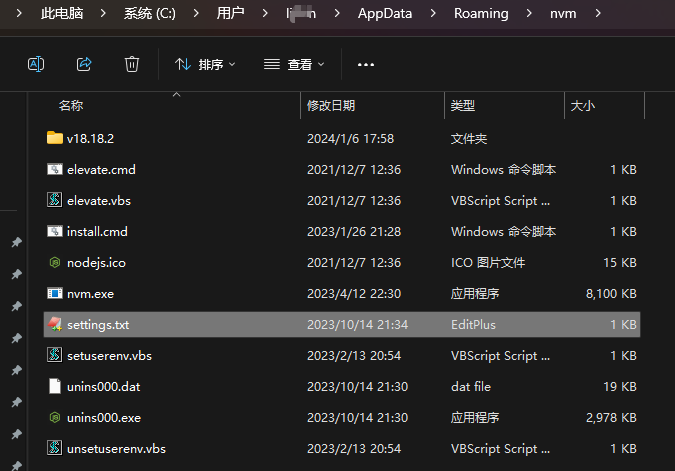
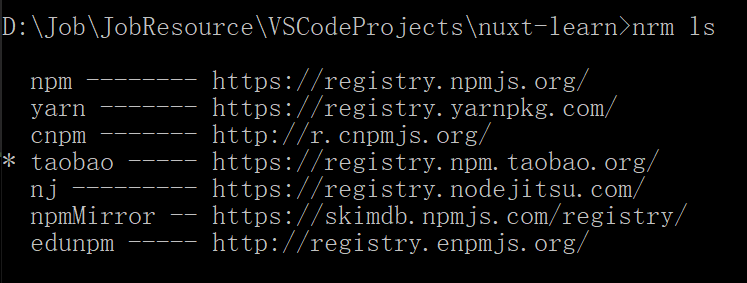

Node实战

[返回列表](https://github.com/EmonCodingFrontEnd/frontend-tutorial)

[TOC]

# 官方地址： https://nodejs.org/en/

# 官方文档：https://nodejs.org/en/docs/

# 中文文档：http://nodejs.cn/api/

# npm文档：https://www.npmjs.com/

# editconfig：https://editorconfig.org/

# 一、Node

## 1、安装nvm和Node/npm

### 1.1、安装nvm

下载地址： <https://github.com/coreybutler/nvm-windows/releases>

1. 下载 nvm-setup.zip，解压后可以得到 nvm-setup.exe 安装宝，双击安装即可。
2. 安装nvm

备注：若nvm安装node卡主，可以尝试更换网络：

【找到nvm安装目录（比如：C:\Users\limin\AppData\Roaming\nvm】下的settings文件，编辑并增加：

```tex
# 现有
root: C:\Users\limin\AppData\Roaming\nvm
path: C:\Program Files\nodejs
# 增加
node_mirror: https://npm.taobao.org/mirrors/node/
npm_mirror: https://npm.taobao.org/mirrors/npm/
```


### 1.2、安装Node/npm

nodejs官网：<https://nodejs.org/en/>

npmjs官网： <https://www.npmjs.com/>

1. 打开cmd
2. 在官网查看可安装版本

<https://nodejs.org/zh-cn/>

3. 安装

安装长期维护版本，推荐多数用户使用（LTS）

**推荐在Linux环境通过nvm ls-remote查看LTS版本安装**

```
nvm install v8.11.3
# 或者
nvm install v6.14.3
```

**以上安装，会安装node和对应的npm版本**

4. 使用

```
nvm use v8.11.3
# 或者
nvm use v6.14.3
```

5. 校验

```
node --version
npm --version
```

6. 配置淘宝npm镜像【推荐】

```shell
npm config set registry https://registry.npm.taobao.org
```

常用命令：

| 命令                  | 说明                          |
| --------------------- | ----------------------------- |
| nvm current           | 显示激活的版本                |
| nvm -v                | 查看版本                      |
| nvm list available    | 显示所有可以下载的Node.js版本 |
| nvm list              | 显示已安装的版本              |
| nvm install 18.12.1   | 安装18.12.1版本的Node.js      |
| nvm install latest    | 安装最新版本的Node.js         |
| nvm uninstall 18.12.1 | 删除某个版本的Node.js         |
| nvm use 18.12.1       | 切换到18.12.1版本的Node.js    |
| nvm cache dir         | 显示缓存目录                  |
| nvm cache clear       | 清空缓存目录                  |

常见问题1：

> $ nvm list available
>
> Could not retrieve https://npm.taobao.org/mirrors/node/index.json.
>
> Get "https://npm.taobao.org/mirrors/node/index.json": tls: failed to verify certificate: x509: certificate has expired or is not yet valid:

问题1解决：

找到nvm目录，`which nvm`

> $ which nvm
> /c/Users/limin/AppData/Roaming/nvm/nvm



打开settings.txt并调整如下：

```
root: C:\Users\limin\AppData\Roaming\nvm
path: C:\Program Files\nodejs
#node_mirror: https://npm.taobao.org/mirrors/node/
node_mirror: https://npmmirror.com/mirrors/node/
#npm_mirror: https://npm.taobao.org/mirrors/npm/
npm_mirror: https://npmmirror.com/mirrors/npm/
```

## 2、CommonJS规范

```shell
# 查找全局依赖安装的位置
npm root -g
```


## 3、global

- CommonJS
- Buffer、process、console
- timer


## 4、调试

- Inspector

- WebStorm自带调试，像调试Java一样简单


## 5、NodeJS基础API

### 5.1、path

- `__dirname`和`__filename`总是返回文件的绝对路径。

- `process.cwd()`总是返回执行node命令所在文件夹。

- `./`
  - 在require方法中总是相对当前文件所在文件夹
  - 在其他地方和process.cwd()一样，相对node启动文件夹。


### 5.2、Buffer

- Buffer用于处理二进制数据流
- 实例类似整数数组，大小固定
- C++代码在V8堆外分配物理内存


## 6、零碎知识

### 6.1、常用模块

- chalk

颜色代码模块

```shell
npm install chalk --save
```

- supervisor

1. 安装

```shell
npm install supervisor -g
```

2. 使用

```shell
supervisor app.js // app.js是一个node的server文件
```

- handlebars

```shell
npm install handlebars --save
```


# 二、NPM

临时：[npm命令详解]( https://www.cnblogs.com/itlkNote/p/6830682.html)

[中文官网](https://www.npmjs.cn/)

## 1、NPM是什么

NPM的全称是`Node Package Manager`，是随同NodeJS一起安装的包管理和分发工具，它很方便让JavaScript开发者下载、安装、上传以及管理已经安装的包。

## 2、NPM模块的版本号

每一个模块后面对应的就是他的版本号，如"^4.10.1"。下面是几个版本的表达式：

| 表达式                     | 版本范围              |
| -------------------------- | --------------------- |
| >=1.2.7                    | 大于等于1.2.7         |
| >=1.2.7<1.3.0              | 1.2.7,1.2.8,1.2.9     |
| 1.2.3-2.3.4                | >=1.2.3<=2.3.4        |
| 1.2-2.3.4                  | >=1.2.0<=2.3.4        |
| 1.2.3-2.3                  | >=1.2.3<2.4.0         |
| 1.2.3-2                    | >=1.2.3<3.0.0         |
| *                          | >=0.0.0               |
| 1.x(等价于1.X)             | >=1.0.0<2.0.0         |
| 1(等价于1.x.x)             | >=1.0.0 <2.0.0        |
| 1.2(等价于1.2.x)           | >=1.2.0 <1.3.0        |
| ~1.2.3(>=1.2.3 <1.(2+1).0) | >=1.2.3 <1.3.0        |
| ~1.2(>=1.2.0 <1.(2+1).0)   | >=1.2.0 <1.3.0        |
| ~1(>=1.0.0 <(1+1).0.0)     | >=1.0.0 <2.0.0        |
| ~0.2.3(>=0.2.3 <0.(2+1).0) | >=0.2.3 <0.3.0        |
| ~0.2(>=0.2.0 <0.(2+1).0)   | >=0.2.0 <0.3.0        |
| ~0(>=0.0.0 <(0+1).0.0)     | >=0.0.0 <1.0.0        |
| ~1.2.3-beta.2              | >=1.2.3-beta.2 <1.3.0 |
| ^1.2.3                     | >=1.2.3 <2.0.0        |
| ^0.2.3                     | >=0.2.3 <0.3.0        |
| ^0.0.3                     | >=0.0.3 <0.0.4        |
| ^1.2.3-beta.2              | >=1.2.3-beta.2 <2.0.0 |
| ^0.0.3-beta                | >=0.0.3-beta <0.0.4   |
| ^1.2.x                     | >=1.2.0 <2.0.0        |
| ^0.0.x                     | >=0.0.0 <0.1.0        |
| ^0.0                       | >=0.0.0 <0.1.0        |
| ^1.x                       | >=1.0.0 <2.0.0        |
| ^0.x                       | >=0.0.0 <1.0.0        |

npm包的版本号格式X.Y.Z，版本号的格式遵循semver 2.0规范，其中X为主版本号，只有更新了不向下兼容的API时修改主版本号；Y为次版本号，当模块增加了向下兼容的功能时进行修改；Z为修订版本号，当模块进行了向下兼容的bug修改后进行修改，这就是**语义化的版本控制**。

### 2.1、脱字符`^`

默认情况下，当用--save或者--save-dev安装模块时，npm通过脱字符（^）来限定所安装模块的`最新的`主版本号，而该脱字符对不同的版本号有不同的更新机制。

- `^1.2.1` 代表的更新版本范围为>=1.2.1&&<2.0.0
- `^0.2.1` 代表的更新版本范围为>=0.2.1&&<0.3.0
- `^0.0.2` 代表的更新版本范围为0.0.2（相当于锁定了0.0.2版本）

### 2.2、波浪号`~`

波浪号`~`会匹配最近的小版本依赖包。

- `~1.2.3`匹配 >=1.2.x<1.3.0
- `~1.2`匹配 >=1.2.0 <1.3.0
- `~1`匹配 >=1.0.0 <2.0.0

## 3、NPM命令

### 3.1、npm install

```shell
npm install (with no args, in package dir)
npm install [<@scope>/]<name>
npm install [<@scope>/]<name>@<tag>
npm install [<@scope>/]<name>@<version>
npm install [<@scope>/]<name>@<version range>
npm install <git-host>:<git-user>/<repo-name>
npm install <git repo url>
npm install <tarball file>
npm install <tarball url>
npm install <folder>

aliases: npm i, npm add
common options: [-P|--save-prod|-D|--save-dev|-O|--save-optional] [-E|--save-exact] [-B|--save-bundle] [--no-save] [--dry-run]
```

- 安装指定版本：

```shell
npm install gulp@3.9.1
```

项目对模块的依赖可以使用下面的3种方法来表示（假设当前版本号是1.1.0）：

1. 兼容模块新发布的补丁版本：`~1.1.0`、`1.1.x`、`1.1`

2. 先容模块新发布的小版本、补丁版本：`^1.1.0`、`1.x`、`1`

3. 兼容模块新发布的大版本、小版本、补丁版本：`*`、`x`


小贴士：安装`chromedriver@2.27.2`碰到过错误导致安装失败：

> npm ERR! node:events:495
> npm ERR!       throw er; // Unhandled 'error' event
> npm ERR!       ^

解决：

> npm install chromedriver@2.27.2 --ignore-scripts

可以作为以后解决问题的参考！！！


- `S,--save`安装包信息将加入到dependencies(生产阶段的依赖）【默认方式】

```shell
npm install gulp --save 
或
npm install gulp -S
或
npm install gulp
```

package.json文件的dependencies字段：

```json
"dependencies": {
    "gulp": "^3.9.1"
}
```


- `-D,--save-dev`安装包信息将加入到devDependencies（开发阶段的依赖），所以开发阶段一般使用它

```shell
npm install gulp --save-dev 
或
npm install gulp -D
```

package.json文件的devDependencies字段：

```json
"devDependencies": {
    "gulp": "^3.9.1"
}
```


- `-O,--save-optional`安装包信息将加入到optionalDependencies(可选阶段的依赖)

```shell
npm install gulp --save-optional 
或
npm install gulp -O
```

package.json文件的optionalDependencies字段：

```json
"optionalDependencies": {
    "gulp": "^3.9.1
}
```


- `E,--save-exact`精确安装指定模块版本

```shell
npm install gulp --save-exact
或
npm install gulp -E
```

输入命令`npm install gulp -ES`，留意package.json文件的dependencies字段，可以看到版本号中的`^`消失了

```json
"dependencies": {
    "gulp": "3.9.1"
}
```

模块的依赖都被写入了package.json文件后，他人打开项目的根目录（项目开源、内部团队合作），使用`npm install`命令可以根据dependencies配置安装所有的依赖包。

```shell
npm install
```

- 本地安装（local）

```shell
npm install gulp
```

- 全局安装（global），使用`-g`或`--global`

```shell
npm install gulp -g
```

- 全局安装加上`-D`效果，安装到开发和运行环境

```bash
npm install -gd vue-cli
```


### 3.2、npm uninstall

```shell
npm uninstall [<@scope>/]<pkg>[@<version>]... [-S|--save|-D|--save-dev|-O|--save-optional|--no-save]

aliases: remove, rm, r, un, unlink
```


- 卸载开发版本的模块

```shell
npm uninstall gulp --save-dev
```

- 卸载全局安装的vue-cli

```bash
npm uninstall vue-cli -g
```


### 3.3、npm update

```shell
npm update [-g] [<pkg>...]

aliases: up, upgrade
```

### 3.4、npm outdated

检查模块是否已经过时

```shell
npm outdated [[<@scope>/]<pkg> ...]
```


### 3.5、npm ls

查看安装的模块

```shell
npm ls [[<@scope>/]<pkg> ...]

aliases: list, la, ll
```

- 查看全局安装的模块及依赖

```bash
npm ls -g
```

- 查看全局安装的模块

```bash
npm ls -g --depth=0
```

### 3.6、npm list

- 查看项目依赖包

```shell
npm list
```

- 指定查看层级

```shell
npm list --depth 2
```

### 3.7、npm help

查看某条命令的帮助详情

```shell
npm help <term> [<terms..>]
```


### 3.8、npm config 

管理npm的配置路径

```bash
npm config set <key> <value> [-g|--global]
npm config get <key>
npm config delete <key>
npm config list [-l] [--json]
npm config edit
npm get <key>
npm set <key> <value> [-g|--global]

aliases: c
```

- 设置淘宝镜像

```shell
npm config set registry https://registry.npm.taobao.org # 已废弃
npm config set registry https://registry.npmmirror.com
```

- 获取镜像设置

```shell
npm config get registry
```

- 查看配置列表

```shell
npm config list
```

- 删除配置项

```shell
npm config delete <key>
```

- 编辑配置文件

```shell
npm config edit
```

- 查看所有配置默认值

```bash
npm config ls -l
```


### 3.9、npm cache 

管理模块的缓存

```bash
npm cache add <tarball file>
npm cache add <folder>
npm cache add <tarball url>
npm cache add <name>@<version>

npm cache clean [<path>]
aliases: npm cache clear, npm cache rm

npm cache verify
```

- 清除npm本地缓存

```bash
npm cache clean
```

### 3.10、npm root

显示npm根目录

```bash
npm root [-g]
```

在标准输出上将有效的`node_modules`文件夹打印出来。

### 3.11、npm init/create

> npm v6版本给init命令添加了别名create。

在项目中引导创建一个package.json文件

安装包的信息可保存到项目的package.json文件中，以便后续的其他的项目开发或者他人合作使用，也就是说package.json在项目中是必不可少的。

```bash
npm init [-f|--force|-y|--yes|--scope]
```

- 无需人工干预的初始化

```bash
npm init -f
或者
npm init -y
```

### 3.12、cnpm

安装：

```bash
npm install -g cnpm --registry=https://registry.npm.taobao.org # 已废弃
npm install -g cnpm --registry=https://registry.npmmirror.com
```

cnpm是npm的国内镜像。

网址：https://npmmirror.com/

### 3.13、npm view 查看某个包的所有版本

```shell
$ npm view webpack versions
```

### 3.14、pnpm（performant npm）

https://pnpm.io/zh/

pnpm是高性能的npm。

使用 npm 时，依赖每次被不同的项目使用，都会重复安装一次。  而在使用 pnpm 时，依赖会被存储在内容可寻址的存储中，所以：

1. 如果你用到了某依赖项的不同版本，只会将不同版本间有差异的文件添加到仓库。 例如，如果某个包有100个文件，而它的新版本只改变了其中1个文件。那么 `pnpm update` 时只会向存储中心额外添加1个新文件，而不会因为仅仅一个文件的改变复制整新版本包的内容。
2. 所有文件都会存储在硬盘上的某一位置。 当软件包被被安装时，包里的文件会硬链接到这一位置，而不会占用额外的磁盘空间。 这允许你跨项目地共享同一版本的依赖。

因此，您在磁盘上节省了大量空间，这与项目和依赖项的数量成正比，并且安装速度要快得多！

- 安装

```bash
npm i -g pnpm
```

- 卸载

```bash
npm r -g pnpm
```

- pnpm dlx 在临时环境运行一个包

```bash
$ pnpm dlx create-umi
# 等效
$ pnpm create umi
```

### 3.15、npm audit

**是npm 6 新增的一个命令,可以允许开发人员分析复杂的代码并查明特定的漏洞。** 该命令会在项目中更新或者下载新的依赖包之后自动运行，如果你在项目中使用了具有已知安全问题的依赖，就收到官方的警告通知。

```bash
$ npm audit 
```


## 4、NRM命令

​		nrm(npm registry manager)是npm的镜像源管理工具，有时候国外资源太慢，使用这个就可以快速地在npm源之间切换。

### 1、安装nrm

```bash
npm install nrm -g
npm i -g nrm open@8.4.2 # 推荐，避免缺少open的错误
```

> 如果碰到错误`const open = require('open');
>
> ​                                                  ^
>
> 如上错误，表示nrm的依赖包open未能加载，打开nrm的安装包下`package.json`查看，需要：
>
> "open": ">=6.0.0"，所以请安装open
>
> `npm i -g open@8.4.2`

### 2、查看镜像源

```bash
$ nrm ls

  npm -------- https://registry.npmjs.org/
  yarn ------- https://registry.yarnpkg.com/
  cnpm ------- http://r.cnpmjs.org/
* taobao ----- https://registry.npm.taobao.org/  ==> 最新版是：https://registry.npmmirror.com
  nj --------- https://registry.nodejitsu.com/
  npmMirror -- https://skimdb.npmjs.com/registry/
  edunpm ----- http://registry.enpmjs.org/
  ss --------- https://repo.ishanshan.com/repository/ss-public/
```

> 如果展示的结果，看不到 * ，可以如下修复：
>
> 1. 打开nrm安装目录，找到cli.js并打开
>
> 2. 找到如下代码
>
> ```js
> function onUse (name) {
>     var allRegistries = getAllRegistry();
>     if (hasOwnProperty(allRegistries, name)) {
>         getCurrentRegistry(function (cur) {
>             let currentRegistry, item;
>             for (let key of Object.keys(allRegistries)) {
>                 item = allRegistries[key];
>                 if (item[FIELD_IS_CURRENT] && equalsIgnoreCase(item.registry, cur)) {
>                     currentRegistry = item;
>                     break;
>                 }
>             }
>             var registry = allRegistries[name];
>             let attrs = [].concat(REGISTRY_ATTRS).concat();
>             for (let attr in Object.assign({}, currentRegistry, registry)) {
>                 if (!REGISTRY_ATTRS.includes(attr) && !IGNORED_ATTRS.includes(attr)) {
>                     attrs.push(attr);
>                 }
>             }
> 
>             config(attrs, registry).then(() => {
>                 console.log('                        ');
>                 const newR = npm.config.get(FIELD_REGISTRY);
>                 var customRegistries = getCustomRegistry();
>                 Object.keys(customRegistries).forEach(key => {
>                     delete customRegistries[key][FIELD_IS_CURRENT];
>                 });
>                 if (hasOwnProperty(customRegistries, name) && (name in registries || customRegistries[name].registry === registry.registry)) {
>                     registry[FIELD_IS_CURRENT] = true;
>                     customRegistries[name] = registry;
>                 }
>                 setCustomRegistry(customRegistries);
>                 printMsg(['', '   Registry has been set to: ' + newR, '']);
>             }).catch(err => {
>                 exit(err);
>             });
>         });
>     } else {
>         printMsg(['', '   Not find registry: ' + name, '']);
>     }
> }
> ```
>
> 3. 修改如下：
>
> ```js
> if (hasOwnProperty(customRegistries, name) && (name in registries || customRegistries[name].registry === registry.registry))
> ==>
> if (hasOwnProperty(customRegistries, name) || (name in registries || customRegistries[name].registry === registry.registry))
> ```
>
> 5. 重新`nrm use taobao` ，然后`nrm ls`查看结果，会发现已经带有*了。

### 3、切换镜像源

```bash
nrm use taobao
```

### 4、增加

你可以增加定制的源，特别适用于添加企业内部的私有源，执行命令： `nrm add <registry> <url>`，其中registry为源名，url为源的路径。

```bash
nrm add registry http://registry.npm.frp.trmap.cn/
```

### 5、删除

执行命令：`nrm del <registry>`删除对应的源。

### 6、测试速度

你还可以通过 `nrm test` 测试相应源的响应时间。

```bash
nrm test npm
```


# 三、YARN

[Yarn中文官网](https://yarn.bootcss.com/)

[Yarn英文官网](https://yarnpkg.com/)

## 1、YARN是什么

Yarn对你的代码来说是一个包管理器，你可以通过它使用全世界开发者的代码，或者分享自己的代码。Yarn做这些块捷、安全、可靠，所以你不用担心什么。

通过Yarn你可以使用其他开发者针对不同问题的解决方案，使自己的开发过程更简单。使用讴歌过程中遇到问题，你可以将其上报或者贡献解决方案。一旦问题被修复，Yarn会更新保持同步。

代码通过`包（package）（或者称为模块（moudule））`的方式来共享。一个包里包含所有需要共享的代码，以及描述包信息的文件，称为`package.json`。

## 2、使用方法

### 2.1、安装yarn

```bash
npm install -g yarn
yarn --version
```


### 2.2、初始化一个新项目

```bash
yarn init
```


### 2.3、添加依赖包

```bash
yarn add [package]
yarn add [package]@[version]
yarn add [package]@[tag]
```


### 2.4、将依赖项添加到不同依赖项类别中

分别添加到`devDependencies`、`peerDependencies`和`optionalDependencies`类别中：

```bash
yarn add [package] --dev
yarn add [package] --peer
yarn add [package] --optional
```


### 2.5、升级依赖包

```bash
yarn upgrade [package]
yarn upgrade [package]@[version]
yarn upgrade [package]@[tag]
```


### 2.6、移除依赖包

```bash
yarn remove [package]
```


### 2.7、安装项目的全部依赖

```bash
yarn
或
yarn install
```


## 3、YARN命令详解

[YARN命令详解](https://www.cnblogs.com/Jimc/p/10108821.html)

### 3.1、常用命令

- 创建项目

```bash
yarn init
```

- 安装依赖包

```bash
yarn
或
yarn install
```

- 添加依赖包

```bash
yarn add
```

- 配置淘宝镜像

```bash
yarn config set registry "https://registry.npm.taobao.org"
```

### 3.1、yarn add

添加依赖包

```bash
yarn add <package...>
yarn add <package...> [--dev/-D]
yarn add <package...> [--peer/-P]
yarn add <package...> [--optional/-O]
yarn add <package...> [--exact/-E]
yarn add <package...> [--tilde/-T]
yarn add <package...> [--ignore-workspace-root-check/-W]
yarn add <alias-package>@npm:<package>
yarn add <package...> --audit
```

- 安装到`dependencies`

```bash
yarn add <package...>
```

- 安装到`devDependencies`

```bash
yarn add <package...> [--dev/-D]
```


### 3.2、yarn bin

显示yarn安装目录

```bash
yarn bin [<executable>]
```


### 3.3、yarn cache

显示缓存

```bash
yarn cache list [--pattern <pattern>]
yarn cache dir
yarn cache clean [<module_name...>]
```

- 打印缓存目录

```bash
yarn cache dir
```

- 列出缓存包【已废弃】

```bash
yarn cache ls
```

- 列出缓存包【推荐】

```bash
yarn cache list
```

- 清除缓存

```bash
yarn cache clean
```


### 3.4、yarn check

检查包

```bash
yarn check
yarn check --integrity
yarn check --verify-tree
```


### 3.5、yarn config

配置

```bash
yarn config set <key> <value> [-g|--global]
yarn config get <key>
yarn config delete <key>
yarn config list
```


### 3.6、yarn global

全局安装依赖包

```bash
yarn global <add/bin/list/remove/upgrade> [--prefix]
```


### 3.7、yarn list

```bash
yarn list
yarn list [--depth] [--pattern]
```

- 过滤列表

```bash
yarn list --pattern gulp
yarn list --pattern "gulp|grunt"
yarn list --pattern "gulp|grunt" --depth=1
```


### 3.8、yarn remove

```bash
yarn remove <package...>
```

## 4、nrm

nrm 是一个 `npm` 源管理器，允许你快速地在 `npm` 源间切换。

- 安装

```bash
npm install -g nrm
npm i -g nrm open@8.4.2 # 推荐，避免缺少open的错误
```

> 如果碰到错误`const open = require('open');
>
> ​                                                  ^
>
> 如上错误，表示nrm的依赖包open未能加载，打开nrm的安装包下`package.json`查看，需要：
>
> "open": ">=6.0.0"，所以请安装open
>
> `npm i -g open@8.4.2`

- 使用

执行命令`nrm ls`查看可选的源。

```bash
nrm ls
```



其中带`*`的是当前使用的源

- 切换

```bash
nrm use <registry>
```

比如： `nrm use npm`

- 增加

你可以增加定制的源，特别适用于添加企业内部的私有源，执行命令`nrm add <registry> <url>`，其中`registry`为源名，`url`为源路径。

```bash
# 示例：
nrm add registry http://192.168.10.127:8081/repository/npm-public/
```

- 删除

```bash
nrm del <registry>
```

- 测试速度

```bash
nrm test <registry>
```

## 5、npx

npx是执行Node软件包的工具，它从 npm5.2版本开始，就与npm捆绑在一起。

npx的作用如下：

1. 默认情况下，首先检查路径中是否存在要执行的包（即在项目中）；

2. 如果存在，它将执行；

3. 若不存在，意味着尚未安装该软件包，npx将安装其最新版本，然后执行它；

Node8.2以后自带npm模块，所以可以直接使用npx命令。万一不能用，就要手动安装一下。

```bash
npm install -g npx
```

### 5.1、调用项目安装的模块

npx想要解决的主要问题，就是调用项目内部安装的模块。比如，项目内部安装了测试工具Mocha。

```bash
npm install -D mocha
```

一般来说，调用Mocha，只能在项目脚本和package.json的`scripts`字段里面，如果想在命令行下调用，必须像下面这样。

```bash
# 项目的跟目录下执行
node-modules/.bin/mocha --version
```

npx就是想解决这个问题，让项目内部安装的模块用起来更方便，只要像下面这样调用就行了。

```bash
npx mocha --version
```

npx的原理很简单，就是运行的时候，会到`node_modules/.bin`路径和环境变量`$PATH`里面，检查命令是否存在。由于npx会检查环境变量`$PATH`，所以系统命令也可以调用。

```bash
# 等同于ls
npx ls
```

注意，Bash内置的命令不在`$PATH`里面，所以不能用。比如，`cd`是Bash命令，因此就不能用`npx cd`。

### 5.2、避免全局安装模块

除了调用项目内部模块，npx还能避免全局安装的模块。比如`create-react-app`这个模块是全局安装，npx可以运行它，而且不进行全局安装。

```bash
npx create-react-app my-react-app
```

上面代码运行时，npx将`create-react-app`下载到一个临时目录，使用以后再删除。所以，以后再次执行上面的命令，会重新下载`create-react-app`。

下载全局模块时，npx允许指定版本。

```bash
npx uglify-js@3.1.0 main.js -o ./dist/main.js
```

上面代码指定使用3.1.0版本的`uglify-js`压缩脚本。

注意，只要npx后面的模块无法在本地发现，就会下载同名模块。比如，本地没有安装`http-server`模块，下面的命令会自动下载该模块，在当前目录启动一个Web服务。

```bash
npx http-server
```

### 5.3、`--no-install`参数和`--ignore-existing`参数

如果想让npx强制使用本地模块，不下载远程模块，可以使用`--no-install`参数。如果本地不存在该模块，就会报错。

```bash
npx --no-install http-server
```

反过来，如果忽略本地的同名模块，强制安装使用远程模块，可以使用`--ignore-existing`参数。比如，本地已经全局安装了`create-react-app`，但还是想使用远程模块，就用这个参数。

```bash
npx --ignore-existing create-react-app my-react-app
```


# 四、安装常用模块

## 1、`dependencies`类型包

- axios

一个基于promise的http库，可以用在浏览器和node.js中

```bash
npm i axios -S
```

- webpack

```bash
npm install -g webpack
```

- Bootstrap

  - 安装最新版

  ```
  npm install bootstrap@next
  ```

  - 安装指定版本

  ```
  gem install bootstrap -v 5.0.0.beta3
  ```

- mitt

```bash
npm install --save mitt
```

- vue-router

```bash
npm install vue-router@4
```

- vuex

```bash
npm install vuex@next
```

- markdown-it

```bash
npm install markdown-it --save
npm install --save @types/markdown-it
```

- normalize.css

```bash
npm install --save normalize.css
```

- mockjs

```bash
npm install mockjs
```

- Vant

```bash
npm i vant@next -S
```


## 2、`devDependencies`类型包


# 五、常用前端依赖

## 1、babel

[babel官方文档](https://www.babeljs.cn/docs/usage)

- 安装

```bash
npm install --save-dev @babel/core @babel/cli @babel/preset-env
npm install --save @babel/polyfill
```

- 创建文件并配置`babel.config.json`（需要V7.8.0或更高版本，并将以下内容复制到此文件中：

```bash
{
  "presets": [
    [
      "@babel/env",
      {
        "targets": {
          "edge": "17",
          "firefox": "60",
          "chrome": "67",
          "safari": "11.1"
        },
        "useBuiltIns": "usage",
        "corejs": "3.6.5"
      }
    ]
  ]
}
```

>上述浏览器列表仅用于示例。请根据你所需要支持的浏览器进行调整。参见 [此处](https://www.babeljs.cn/docs/babel-preset-env) 以了解 `@babel/preset-env` 可接受哪些参数。

- 文件转换

  - 文件：

  ```bash
  babel src/index.js -o dist/index.js
  ```

  - 文件夹

  ```bash
  babel src -d dist
  ```

  - 实时监控

  ```bash
  babelk src -w -d dist
  ```

> 注意：如果是在IDE的控制台，可以去掉`./node_modules/.bin/`；如果是在类似`Git Bash`控制台，需要带上`./node_modules/.bin/`；比如：`./node_modules/.bin/babel src -d dist`

- 总结

我们使用 `@babel/cli` 从终端运行 Babel，利用 `@babel/polyfill` 来模拟所有新的 JavaScript 功能，而 `env` preset 只对我们所使用的并且目标浏览器中缺失的功能进行代码转换和加载 polyfill。

## 2、webpack

[webpack官方文档](https://webpack.docschina.org/concepts/)

- 安装

```bash
npm install webpack webpack-cli --save-dev
```


# 六、Koa

## 1、koa-generator

- 安装

```bash
npm install -g koa-generator
```

- 创建项目

```bash
koa2 <projectName>
```

```bash
koa2 -e <projectName>
```

- 安装依赖

```bash
cd koa2-learn && npm install
```

- 运行项目

```bash
set debug=koa* & npm start koa2-learn
或
npm run dev
```

- 访问

```bash
http://localhost:3000
```

## 2、中间件

### 2.1、mongoose

- 功能，mongodb

```bash
npm i mongoose
```

### 2.2、koa-generic-session

- 功能，处理session

```bash
npm i koa-generic-session
```

### 2.3、koa-redis

- 功能，redis

```bash
npm i koa-redis
```

# 九、常见问题

## 1、npm在git bash安装包时无进度条


