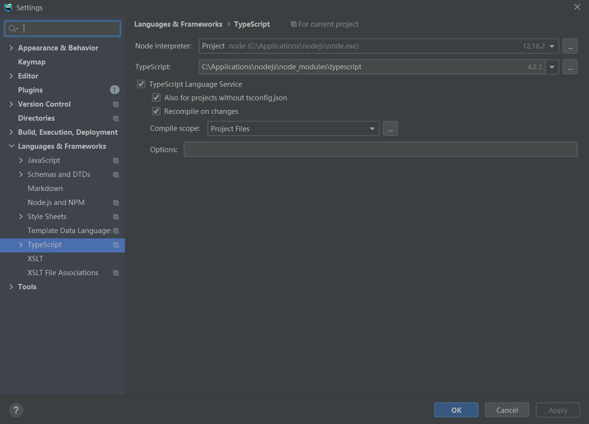
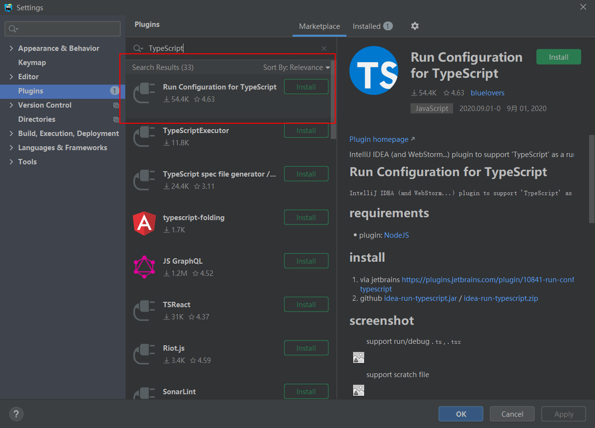

# TypeScript实战

[返回列表](https://github.com/EmonCodingFrontEnd/frontend-tutorial)

[toc]

# 一、环境配置

TypeScript官网地址：  https://www.typescriptlang.org/

TypeScript官方文档地址： https://www.typescriptlang.org/docs/handbook/intro.html

## 1.1、安装TypeScript

通过`npm`来安装：

```sh
npm install -g typescript
```

使用tsc全局命令：

```bash
# 查看 tsc 版本
tsc -v 或者 tsc --version
# 编译 ts 文件
tsc fileName.ts
```


## 1.2、配置到WebStorm

1. 配置TypeScript

`Settings`->`Languages&Frameworks`->`TypeScript`，在右侧选择：TypeScript，指定到安装目录。




2. 在WebStorm中添加监听文件

`File`->`Settings`->`File Watchers`->`TypeScript`，这里选择`TypeScript`，但是File Watchers默认是不存在的。添加如下图：


**注意**：`Program:`这一项一定要指定到`tsc.cmd`，如果是nvm安装的node，TypeScript是npm全局安装的，则`tsc.cmd`的位置类似上图。

```typescript
--sourcemap --target "ES5"
$FileNameWithoutExtension$.js:$FileNameWithoutExtension$.js.map
```


3. 自动执行TypeScript

- WebScorm安装直接运行所需依赖包

```bash
npm install -g ts-node
```

- 安装IDE插件


## 1.3、配置TypeScript使用三方库

查询TypeScript对三方库的声明：

[TypeScript声明的三方库查询](https://www.typescriptlang.org/dt/search?search=)

如果项目没有`package.json`文件，执行`npm`初始化：

```bash
npm init
# 或者
npm init -y
```

然后执行安装TypeScript对三方库的声明文件：

```bash
# 比如jQuery
npm install --save @types/jquery
```

查看项目的安装情况：

```bash
# 在项目的根目录下执行命令
npm ls
# 或者打开编辑器，查看 node_modules 
```


# 九、常见问题

- TypeScript中变量命名问题

  - 问题描述：

  ```
  TS2451: Cannot redeclare block-scoped variable 'result'.
  ```

  - 原因

  变量声明重复，在项目其他文件声明过了。

  - 解决

    在脚本文件最后一行，添加：`export {}`，将文件声明为模块，限制`result`的作用域，不会和其他文件同名变量冲突。

  

