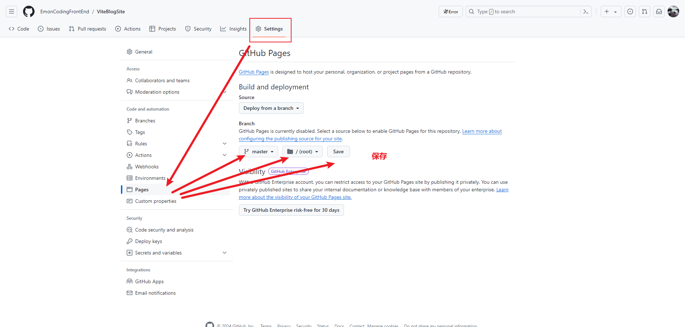
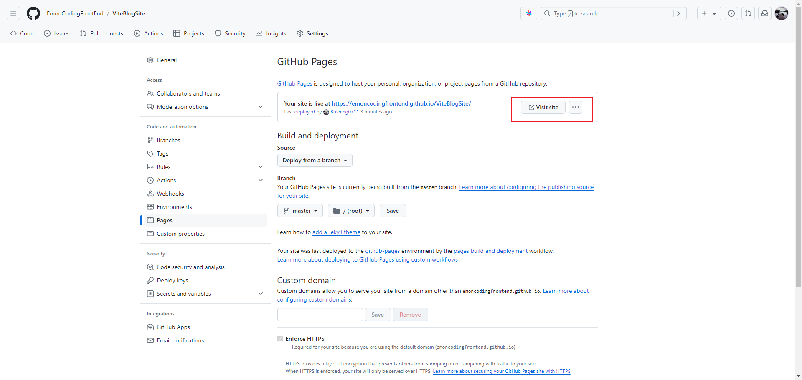

[TOC]

# 从0开始创建VitePress+GitHub Pages项目

## 1、创建2个GitHub项目

- [ViteBlog](https://github.com/EmonCodingFrontEnd/ViteBlog)

  ViteBlog一个SSG项目

  

- [Rushing0711.github.io](https://github.com/Rushing0711/Rushing0711.github.io)

  ViteBlog部署网站

  

## 2、检出并初始化ViteBlog项目ViteBlog

- 检出

```bash
$ git@github.com:EmonCodingFrontEnd/ViteBlog.git
```

- 初始化

```bash
$ pnpm init
```

- [安装VitePress](https://vitepress.dev/zh/)

```bash
$ pnpm i -D vitepress
```

- 创建静态文档目录

```bash
$ mkdir docs && echo '# Hello VitePress & GitHub Pages' > docs/index.md
```

- 配置package.json脚本

```json
"scripts": {
    "docs:dev": "vitepress dev docs",
    "docs:build": "vitepress build docs", # 将构建并存放结果到 `.vitepress/dist`
    "docs:serve": "vitepress serve docs"  # 预览前面构建的结果，也就是启动一个静态文件服务
}
```

- 添加.gitignore

```
# Logs
logs
*.log
npm-debug.log*
yarn-debug.log*
yarn-error.log*
pnpm-debug.log*
lerna-debug.log*

node_modules
dist
dist-ssr
*.local

# Editor directories and files
.vscode/*
!.vscode/extensions.json
.idea
.DS_Store
*.suo
*.ntvs*
*.njsproj
*.sln
*.sw?

# Customized
docs/.vitepress/cache
!docs/.vitepress/dist
```

- 启动

```bash
$ pnpm docs:dev
```

## 3、编译出的页面并提交到仓库Rushing0711.github.io

- 编译

```bash
$ pnpm docs:build
```

- 提交编译输出的内容到ViteBlogSite仓库

```bash
$ cd docs/.vitepress/dist/
$ git init
Initialized empty Git repository in C:/Job/JobResource/WebProjects/ViteBlog/docs/.vitepress/dist/.git/
$ git add .
$ git commit -am "docs:20240613-01"
$ git remote add origin git@github.com:Rushing0711/Rushing0711.github.io.git
$ git push -u origin master
```

- 提交项目内容到ViteBlog仓库

```bash
# 切换到ViteBlog项目根目录
$ git rm -rf --cached docs/.vitepress/dist
$ git submodule add git@github.com:Rushing0711/Rushing0711.github.io.git docs/.vitepress/dist
$ git add .
$ git commit -m "first commit"
$ git remote add origin git@github.com:EmonCodingFrontEnd/ViteBlog.git
$ git push -u origin master
```

网页：https://rushing0711.github.io/

## 4、设置GitHub Pages（非Rushing0711.github.io需设置）

- 设置GitHub Pages



- 保存并访问

点击上图的保存，然后不断刷新保存之后的页面，直至出现 GitHub Pages 的地址：




网址：https://emoncodingfrontend.github.io/ViteBlogSite/

## 5、GitHub Pages页面何时可以访问？

- 若是 用户名.github.io 则等待十多秒。
- 若是某个组织下的项目，请刷新Save后的页面，等待访问。


