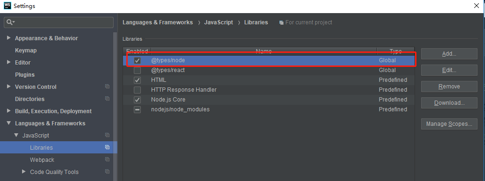

# WebStorm使用详解

[返回列表](https://github.com/EmonCodingFrontEnd/frontend-tutorial)

[TOC]

# 前端代码规范化工具列表

## 1、统一代码风格工具EditorConfig

EditorConfig不是什么软件，而是一个名称为`.editorconfig`的自定义文件。该文件用来定义项目的编码规范，编辑器的行为会与`.editorconfig`文件中定义的一致，并且其优先级比编辑器自身的设置要高，这在多人合作开发项目时十分有用且必要。

有些编辑器默认已安装了插件，比如`Intellij Idea`和`WebStorm`;而有些编辑器则需要安装插件，比如`ATOM`、`Sublime`、`VS Code`等。

- 官网

https://editorconfig.org/

- 文件语法

`.editorconfig`配置文件需要是UTF-8字符集编码的，以回车换行或者换行作为一行的分隔符。

斜线（/）被用作一个路径分隔符，井号（#）或分号（;）被用作于注释，注释需要与注释符号写在同一行。

- 通配符

| 符号           | 描述                                                         |
|--------------| ------------------------------------------------------------ |
| *            | 匹配除/之外的任意字符串                                      |
| **           | 匹配任意字符串                                               |
| ?            | 匹配任意单个的字符                                           |
| [name]       | 匹配name中的任意一个单一字符                                 |
| [!name]      | 匹配不存在name中的任意一个单一字符                           |
| `{s1,s2,s3}` | 匹配给定的字符串中的任意一个（用逗号分隔）                   |
| `{num1..num2}` | 匹配num1到num2之间的任意一个整数，<br />这里的num1和num2可以为正整数也可以为负整数 |

- 属性

  所有的属性和值都是忽略大小写的，解析时它们都是小写的。

  - `indent_style` 设置锁紧风格（tab是硬缩进，space为软缩进）。
  - `indent_size` 用一个整数定义的列数来设置锁紧的宽度，如果indent_style为tab，则此属性默认为tab_width。
  - `tab_width` 用一个整数来设置tab锁紧的列数。默认是indent_size。
  - `end_of_line` 设置换行符，值位lf、cr和crlf。
  - `charset` 设置编码，值位latin1、utf-8、utf-8-bom、utf-16be和utf-16le，不建议使用utf-8-bom。
  - `trim_+trailing_whitespace` 设为true表示会去除换行行首的任意空白字符。
  - `insert_final_newline` 设为true表示使文件以一个空白行结尾。
  - `root` 表示使最顶层的配置文件，发现设为true时，才会停止查找`.editorconfig`文件

## 2、ESLint

英文官网： https://eslint.org/

中文官网： http://eslint.cn/


# WebStorm相关

## 一、下载安装

### 1、下载

WebStorm官方网址：http://www.jetbrains.com/webstorm/

### 2、安装

双击安装包，比如：`WebStorm-2021.1.exe` 执行默认安装即可。

### 3、注册

- license server方式

  - 网络上搜索WebStorm的 license server 并配置即可

- 注册码方式

  1. 修改hosts文件，并追加如下内容

  ```
  0.0.0.0 account.jetbrains.com
  ```

  2. 输入注册码

  ```shell
  EB101IWSWD-eyJsaWNlbnNlSWQiOiJFQjEwMUlXU1dEIiwibGljZW5zZWVOYW1lIjoibGFuIHl1IiwiYXNzaWduZWVOYW1lIjoiIiwiYXNzaWduZWVFbWFpbCI6IiIsImxpY2Vuc2VSZXN0cmljdGlvbiI6IkZvciBlZHVjYXRpb25hbCB1c2Ugb25seSIsImNoZWNrQ29uY3VycmVudFVzZSI6ZmFsc2UsInByb2R1Y3RzIjpbeyJjb2RlIjoiSUkiLCJwYWlkVXBUbyI6IjIwMTgtMTAtMTQifSx7ImNvZGUiOiJSUzAiLCJwYWlkVXBUbyI6IjIwMTgtMTAtMTQifSx7ImNvZGUiOiJXUyIsInBhaWRVcFRvIjoiMjAxOC0xMC0xNCJ9LHsiY29kZSI6IlJEIiwicGFpZFVwVG8iOiIyMDE4LTEwLTE0In0seyJjb2RlIjoiUkMiLCJwYWlkVXBUbyI6IjIwMTgtMTAtMTQifSx7ImNvZGUiOiJEQyIsInBhaWRVcFRvIjoiMjAxOC0xMC0xNCJ9LHsiY29kZSI6IkRCIiwicGFpZFVwVG8iOiIyMDE4LTEwLTE0In0seyJjb2RlIjoiUk0iLCJwYWlkVXBUbyI6IjIwMTgtMTAtMTQifSx7ImNvZGUiOiJETSIsInBhaWRVcFRvIjoiMjAxOC0xMC0xNCJ9LHsiY29kZSI6IkFDIiwicGFpZFVwVG8iOiIyMDE4LTEwLTE0In0seyJjb2RlIjoiRFBOIiwicGFpZFVwVG8iOiIyMDE4LTEwLTE0In0seyJjb2RlIjoiUFMiLCJwYWlkVXBUbyI6IjIwMTgtMTAtMTQifSx7ImNvZGUiOiJDTCIsInBhaWRVcFRvIjoiMjAxOC0xMC0xNCJ9LHsiY29kZSI6IlBDIiwicGFpZFVwVG8iOiIyMDE4LTEwLTE0In0seyJjb2RlIjoiUlNVIiwicGFpZFVwVG8iOiIyMDE4LTEwLTE0In1dLCJoYXNoIjoiNjk0NDAzMi8wIiwiZ3JhY2VQZXJpb2REYXlzIjowLCJhdXRvUHJvbG9uZ2F0ZWQiOmZhbHNlLCJpc0F1dG9Qcm9sb25nYXRlZCI6ZmFsc2V9-Gbb7jeR8JWOVxdUFaXfJzVU/O7c7xHQyaidCnhYLp7v32zdeXiHUU7vlrrm5y9ZX0lmQk3plCCsW+phrC9gGAPd6WDKhkal10qVNg0larCR2tQ3u8jfv1t2JAvWrMOJfFG9kKsJuw1P4TozZ/E7Qvj1cupf/rldhoOmaXMyABxNN1af1RV3bVhe4FFZe0p7xlIJF/ctZkFK62HYmh8V3AyhUNTzrvK2k+t/tlDJz2LnW7nYttBLHld8LabPlEEjpTHswhzlthzhVqALIgvF0uNbIJ5Uwpb7NqR4U/2ob0Z+FIcRpFUIAHEAw+RLGwkCge5DyZKfx+RoRJ/In4q/UpA==-MIIEPjCCAiagAwIBAgIBBTANBgkqhkiG9w0BAQsFADAYMRYwFAYDVQQDDA1KZXRQcm9maWxlIENBMB4XDTE1MTEwMjA4MjE0OFoXDTE4MTEwMTA4MjE0OFowETEPMA0GA1UEAwwGcHJvZDN5MIIBIjANBgkqhkiG9w0BAQEFAAOCAQ8AMIIBCgKCAQEAxcQkq+zdxlR2mmRYBPzGbUNdMN6OaXiXzxIWtMEkrJMO/5oUfQJbLLuMSMK0QHFmaI37WShyxZcfRCidwXjot4zmNBKnlyHodDij/78TmVqFl8nOeD5+07B8VEaIu7c3E1N+e1doC6wht4I4+IEmtsPAdoaj5WCQVQbrI8KeT8M9VcBIWX7fD0fhexfg3ZRt0xqwMcXGNp3DdJHiO0rCdU+Itv7EmtnSVq9jBG1usMSFvMowR25mju2JcPFp1+I4ZI+FqgR8gyG8oiNDyNEoAbsR3lOpI7grUYSvkB/xVy/VoklPCK2h0f0GJxFjnye8NT1PAywoyl7RmiAVRE/EKwIDAQABo4GZMIGWMAkGA1UdEwQCMAAwHQYDVR0OBBYEFGEpG9oZGcfLMGNBkY7SgHiMGgTcMEgGA1UdIwRBMD+AFKOetkhnQhI2Qb1t4Lm0oFKLl/GzoRykGjAYMRYwFAYDVQQDDA1KZXRQcm9maWxlIENBggkA0myxg7KDeeEwEwYDVR0lBAwwCgYIKwYBBQUHAwEwCwYDVR0PBAQDAgWgMA0GCSqGSIb3DQEBCwUAA4ICAQC9WZuYgQedSuOc5TOUSrRigMw4/+wuC5EtZBfvdl4HT/8vzMW/oUlIP4YCvA0XKyBaCJ2iX+ZCDKoPfiYXiaSiH+HxAPV6J79vvouxKrWg2XV6ShFtPLP+0gPdGq3x9R3+kJbmAm8w+FOdlWqAfJrLvpzMGNeDU14YGXiZ9bVzmIQbwrBA+c/F4tlK/DV07dsNExihqFoibnqDiVNTGombaU2dDup2gwKdL81ua8EIcGNExHe82kjF4zwfadHk3bQVvbfdAwxcDy4xBjs3L4raPLU3yenSzr/OEur1+jfOxnQSmEcMXKXgrAQ9U55gwjcOFKrgOxEdek/Sk1VfOjvS+nuM4eyEruFMfaZHzoQiuw4IqgGc45ohFH0UUyjYcuFxxDSU9lMCv8qdHKm+wnPRb0l9l5vXsCBDuhAGYD6ss+Ga+aDY6f/qXZuUCEUOH3QUNbbCUlviSz6+GiRnt1kA9N2Qachl+2yBfaqUqr8h7Z2gsx5LcIf5kYNsqJ0GavXTVyWh7PYiKX4bs354ZQLUwwa/cG++2+wNWP+HtBhVxMRNTdVhSm38AknZlD+PTAsWGu9GyLmhti2EnVwGybSD2Dxmhxk3IPCkhKAK+pl0eWYGZWG3tJ9mZ7SowcXLWDFAk0lRJnKGFMTggrWjV8GYpw5bq23VmIqqDLgkNzuoog==
  ```


## 二、偏好配置

### 1、配置Node和npm

左侧：`Settings`->`Languages&Frameworks`->`Node.js and NPM`

右侧：

- `Node interpreter` 选择node.exe的路径，比如：

```
C:\Program Files\nodejs\node.exe
```

- 勾选`Coding assistance for Node.js`

- `package manager` 选择npm的路径，比如：

  - 比如：npm

  ```bash
  C:\Applications\nodejs\node_modules\npm
  ```

  - 比如：yarn

  ```bash
  C:\Applications\nodejs\node_modules\yarn
  ```

### 2、配置Node提示

- 左侧`Settings`
  - `Languages&Frameworks`
    - `JavaScript`
      - `Libraries`
- 右侧选择`Download`，打开Download Library界面，搜索node并选择，然后点击Download and Install按钮下载并安装，完成后可以看到如下图：


### 3、启用EditorConfig

- 左侧`Settings`
  - `Editor`
    - `Code Style`
- 右侧在`EditorConfig`区域，默认`Enable EditorConfig support`是勾选的，此时点击`Export`阿牛即可在项目中生成一个`.editorconfig`文件。

具体配置请参见官网：https://editorconfig.org/

配置完成后，触发格式化即可按照`.editorconfig`进行格式化。

### 4、启用ESLint

#### 4.1、安装eslint

全局安装eslint：

```shell
npm install --g eslint babel-eslint
```

在项目的根目录执行`eslint --init`命令可以创建一个`.eslintrc.js`配置文件，这样你就可以继承推荐的规则。

```shell
eslint --init
```

然后根据默认选择项，回车执行。

中文官网：http://eslint.cn/

英文官网：https://eslint.org/

#### 4.2、配置WebStorm中eslint

- 左侧`Settings`
  - `Languages&Frameworks`
    - `JavaScript`
      - `Code Quality Tools`
        - `ESLint`
- 右侧勾选`Enable`复选框，在已经安装了ESLint情况下，ESLint package默认也会探测到值，如下图：


#### 4.3、结合npm的pre-commit使用eslint组织git commit

1. `package.json`加入script

```json
"scripts": {
    "fix": "eslint --fix .",
    "lint": "eslint ."
},
"pre-commit": [
    "fix",
    "lint"
],
```

2. 安装pre-commit

```shell
npm install --save-dev pre-commit
```

#### 4.4、配置`.eslintignore`

作用：忽略eslint的检查范围

## 5、调整WebStorm格式化风格满足ESLint要求

### 5.1、调整TypeScript格式化风格

-  如何保证TypeScript中对象格式化添加前后空格

【Setting】->【Editor】->【CodeStyle】->【TypeScript】->【Spaces】->【Within】->【Object literal braces】，勾选即可。

-  ES6导入导出时变量结构的花括号前后添加空格

【Setting】->【Editor】->【CodeStyle】->【TypeScript】->【Spaces】->【Within】->【ES6 import/export braces】，勾选即可。

- 配置import文件时使用单引号，不加分号
  - 导航

  【Setting】->【Editor】->【CodeStyle】->【TypeScript】-【Spaces】->【Punctuation】

  - 配置

  `Don't use` semicolon to terminate statements `in new code`

  Use `single` quotes `in new code`

  Trailing comma: `Keep`

- 配置函数名和括号之间有一个空格

【Setting】->【Editor】->【CodeStyle】->【TypeScript】->【Spaces】->【Before parentheses】->【Function declaration parentheses】，勾选即可。

## 三、插件安装

## 四、快捷键

## 五、常用技巧